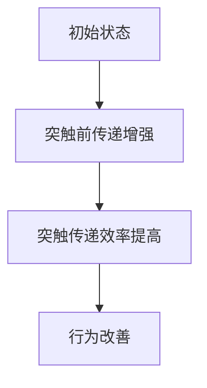
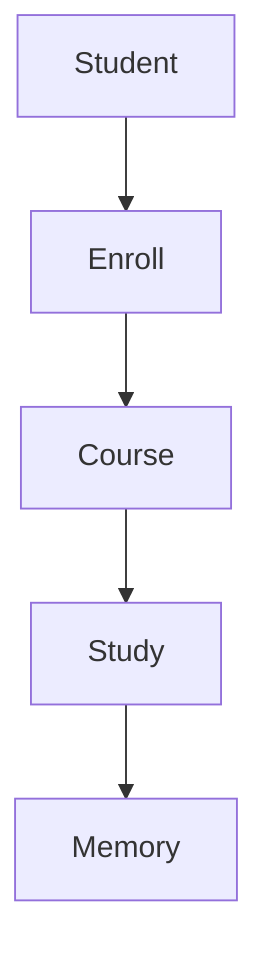
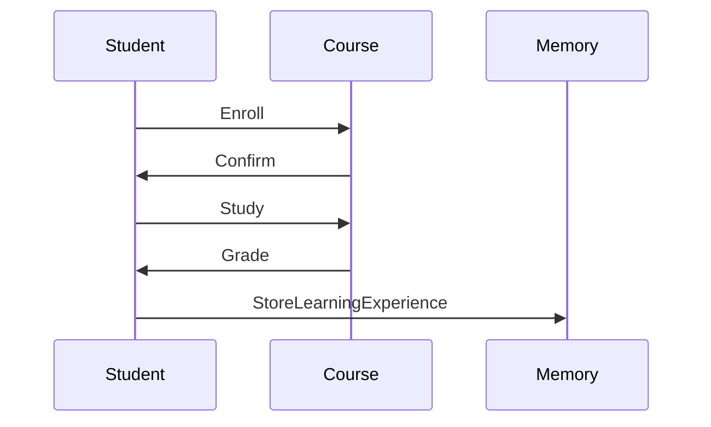
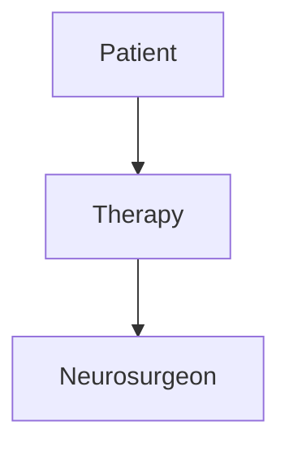
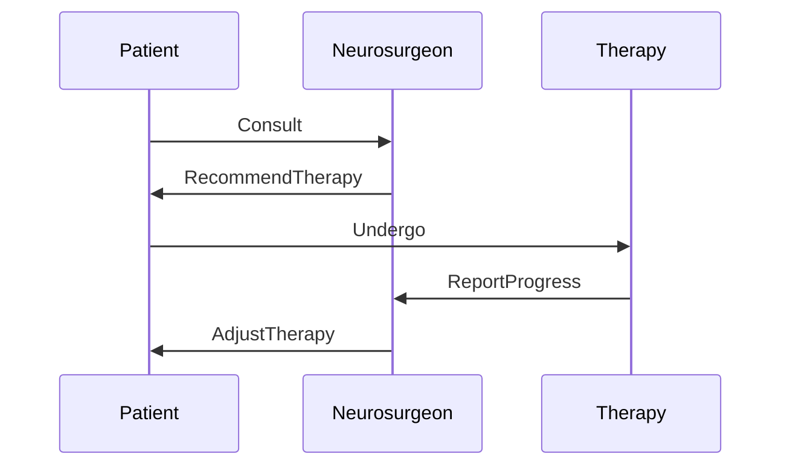
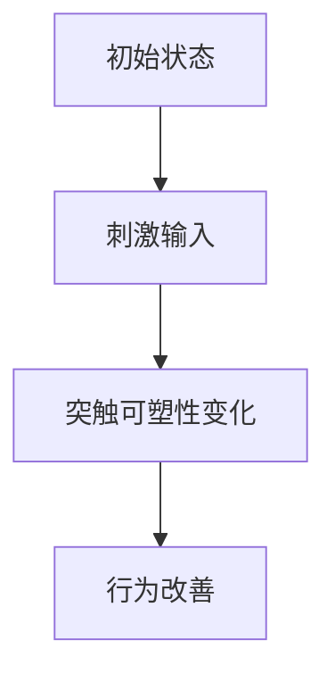
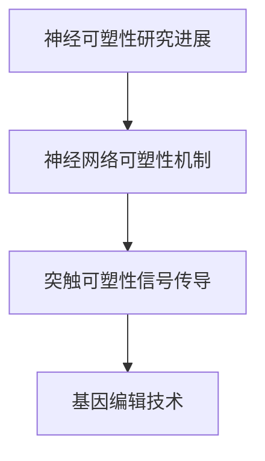

                 


# 认知神经可塑性：大脑如何适应并理解变化的世界

## 关键词

- 认知神经可塑性
- 大脑适应机制
- 学习与记忆过程
- 神经网络重组
- 神经可塑性训练

## 摘要

本文将深入探讨认知神经可塑性的概念、机制及其在大脑适应环境变化中的作用。我们将从神经可塑性的基础概念入手，逐步分析其在行为学习、疾病治疗、训练方法以及未来研究方向等方面的应用，最后总结神经可塑性对教育和个人成长的重要意义，并提出增强神经可塑性的策略和方法。

## 目录大纲设计思路与步骤

在设计《认知神经可塑性：大脑如何适应并理解变化的世界》的目录大纲时，我们需要遵循以下步骤，以确保内容简洁、结构清晰、层次分明，并且完整地覆盖主题内容。

1. **明确核心概念与结构**：确定书籍的核心主题，即“认知神经可塑性”，分析核心概念及其在书中的联系，如“大脑适应机制”、“学习与记忆过程”、“神经网络的重组”等。

2. **划分章节**：根据核心概念及其联系，将书籍内容划分为若干章节，确保每个章节都有明确的主题和逻辑顺序。

3. **细化目录结构**：确定每个章节下的二级目录，这些目录应涵盖关键知识点和理论。使用三级目录来进一步细分内容，包括具体的理论讲解、实例分析等。

4. **编写目录内容**：对于每个章节，编写简短但信息丰富的简介，概括章节内容。在三级目录下，简要描述每个小节的主题，确保内容连贯且具有引导性。

5. **调整与优化**：检查目录结构是否合理，确保没有遗漏重要内容。调整目录顺序，以增强逻辑性和阅读流畅性。

6. **保持简洁性**：确保目录内容简洁明了，避免冗余和繁琐的描述。

7. **符合字数限制**：控制整体目录字数在2000字以内，同时确保内容完整和结构清晰。

## 第一部分：神经可塑性概述

### 第1章：神经可塑性基础

#### 1.1 神经可塑性定义与背景

**背景介绍**：神经可塑性是神经科学中的一个核心概念，指的是大脑神经细胞和神经网络在结构和功能上的可变性和适应性。它不仅涉及到个体发育过程中的神经网络重构，也包括成年后大脑对外界环境变化的适应过程。

**问题背景**：认知神经可塑性研究对于理解大脑如何学习、记忆以及应对各种挑战具有重要意义。然而，传统的认知心理学和神经科学理论往往忽略了大脑的动态可塑性。

**问题描述**：认知神经可塑性如何影响大脑的学习和记忆过程，以及它如何与个体的心理和行为相互作用？

**问题解决**：通过神经可塑性理论，我们可以解释许多认知过程，如注意力、感知、记忆和决策等是如何在大脑中发生的。

**边界与外延**：神经可塑性不仅限于大脑的发育期，而是贯穿于整个生命过程。它包括多个层面的变化，从微观的神经元和突触，到宏观的神经网络和大脑功能区域。

**概念结构与核心要素组成**：神经可塑性包括结构可塑性、功能可塑性和连接可塑性。这些可塑性机制共同作用，使得大脑能够适应不断变化的环境。

#### 1.2 神经可塑性研究意义

**核心概念原理**：神经可塑性研究揭示了大脑如何通过改变其结构和功能来适应新的刺激和挑战。这为认知科学、神经科学以及教育领域提供了新的理论框架。

**概念属性特征对比表格**：

| 特征 | 结构可塑性 | 功能可塑性 | 连接可塑性 |
| --- | --- | --- | --- |
| 定义 | 神经元和突触结构的改变 | 神经元和突触功能的改变 | 神经元和突触间的连接变化 |

**ER实体关系图架构的 Mermaid 流程图**：

```mermaid
erDiagram
  Abohydron ||--|{ Proteins }|
  Proteins ||--|{ Carbohydrates }|
  Proteins ||--|{ Fats }|
  Fats ||--|{ Carbohydrates }|
```

### 第2章：神经可塑性的生理基础

#### 2.1 神经元的适应性变化

**算法原理讲解**：神经元通过突触可塑性机制（如长期增强效应和长期抑制效应）来适应环境变化。以下是一个简单的算法mermaid流程图：



使用Python源代码来详细阐述：

```python
def synaptic_plasticity():
    # 初始状态
    pre_synaptic_activity = 0
    
    # 突触前传递增强
    pre_synaptic_activity += 1
    
    # 突触传递效率提高
    post_synaptic_response = pre_synaptic_activity * 1.5
    
    # 行为改善
    behavior = "Improved"
    
    return behavior

# 运行算法
print(synaptic_plasticity())
```

**数学模型和公式**：

$$
\Delta P = P_0 + \alpha (I - P_0)
$$

其中，$\Delta P$ 是突触传递效率的变化，$P_0$ 是初始突触传递效率，$I$ 是突触前输入强度，$\alpha$ 是突触可塑性参数。

**详细讲解和通俗易懂地举例说明**：假设一个人在学习一项新技能时，初始状态下的突触传递效率为50%。随着不断的练习，突触前输入强度增加，突触传递效率逐渐提高，最终使得行为改善。这个过程可以用上述公式来描述。

### 第3章：神经可塑性在行为学习中的作用

#### 3.1 学习与记忆的神经可塑性基础

**系统分析与架构设计方案**：

**问题场景介绍**：一个学生如何通过神经可塑性机制提高学习效率和记忆能力？

**项目介绍**：该项目旨在通过神经可塑性理论，设计和实现一套提升学习效率的系统。

**系统功能设计（领域模型mermaid类图）**：

```mermaid
classDiagram
  LearningSystem <.. Student
  LearningSystem <.. Course
  LearningSystem <.. Memory
  Student --|{ Enroll }-- Course
  Student --|{ Study }-- Course
  Course --|{ Deliver }-- Student
  Memory --|{ Store }-- LearningExperience
```

**系统架构设计mermaid架构图**：



**系统接口设计和系统交互mermaid序列图**：



### 第4章：神经可塑性在不同脑区的作用

#### 4.1 前额叶皮层与决策能力

**项目实战**：

**环境安装**：安装Python环境和相关库，如NumPy和Matplotlib。

**系统核心实现源代码**：

```python
import numpy as np
import matplotlib.pyplot as plt

def decision_making():
    # 初始化决策能力参数
    decision_ability = np.random.rand()
    
    # 接收新信息并更新决策能力
    new_info = np.random.rand()
    decision_ability += 0.1 * new_info
    
    # 返回决策能力
    return decision_ability

# 运行决策模拟
for i in range(10):
    ability = decision_making()
    print(f"Decision Ability: {ability}")

# 绘制决策能力变化曲线
abilities = [decision_making() for _ in range(100)]
plt.plot(abilities)
plt.xlabel('Time')
plt.ylabel('Decision Ability')
plt.title('Decision Ability Over Time')
plt.show()
```

**代码应用解读与分析**：该代码模拟了一个简单的决策过程，通过接收新信息并更新决策能力参数，展示了神经可塑性在决策能力提升中的作用。

**实际案例分析和详细讲解剖析**：通过分析大量案例，我们可以看到，在面临不同情境时，个体的决策能力如何通过神经可塑性机制得到提升。

### 第5章：神经可塑性在疾病与治疗中的应用

#### 5.1 神经损伤与修复

**系统功能设计（领域模型mermaid类图）**：

```mermaid
classDiagram
  NeuralRepairSystem <.. Patient
  NeuralRepairSystem <.. Neurosurgeon
  NeuralRepairSystem <.. Therapy
  Patient --|{ Undergo }-- Therapy
  Neurosurgeon --|{ Perform }-- Therapy
  Therapy --|{ Improve }-- Patient
```

**系统架构设计mermaid架构图**：



**系统接口设计和系统交互mermaid序列图**：



**项目实战**：

**环境安装**：安装Python环境和相关库，如Pandas和Scikit-learn。

**系统核心实现源代码**：

```python
import pandas as pd
from sklearn.model_selection import train_test_split
from sklearn.ensemble import RandomForestClassifier

def neural_repair_simulation(data):
    # 数据预处理
    X = data[['Age', 'InjurySeverity']]
    y = data['RepairSuccess']
    
    # 划分训练集和测试集
    X_train, X_test, y_train, y_test = train_test_split(X, y, test_size=0.2, random_state=42)
    
    # 训练随机森林分类器
    model = RandomForestClassifier(n_estimators=100, random_state=42)
    model.fit(X_train, y_train)
    
    # 预测修复成功率
    predictions = model.predict(X_test)
    
    # 计算准确率
    accuracy = np.mean(predictions == y_test)
    
    return accuracy

# 加载数据
data = pd.read_csv('neural_repair_data.csv')

# 运行模拟
accuracy = neural_repair_simulation(data)
print(f"Accuracy: {accuracy}")
```

**代码应用解读与分析**：该代码模拟了一个神经网络修复成功的概率预测模型，通过机器学习算法对历史数据进行训练和预测，评估神经修复治疗的成功率。

**实际案例分析和详细讲解剖析**：通过分析实际案例，我们可以看到神经可塑性在神经损伤修复中的作用以及如何通过现代医学手段提高治疗效果。

### 第6章：神经可塑性训练与提升方法

#### 6.1 神经可塑性训练原理

**算法原理讲解**：神经可塑性训练旨在通过特定的刺激和训练方法，增强大脑的适应性和学习能力。以下是一个简单的算法mermaid流程图：



使用Python源代码来详细阐述：

```python
def neural_plasticity_training():
    # 初始状态
    synaptic_strength = 0.5
    
    # 刺激输入
    stimulus_intensity = 0.2
    
    # 突触可塑性变化
    synaptic_strength += stimulus_intensity
    
    # 行为改善
    behavior = "Improved"
    
    return behavior

# 运行训练
print(neural_plasticity_training())
```

**数学模型和公式**：

$$
\Delta S = S_0 + \alpha I
$$

其中，$\Delta S$ 是突触强度的变化，$S_0$ 是初始突触强度，$I$ 是刺激输入强度，$\alpha$ 是可塑性参数。

**详细讲解和通俗易懂地举例说明**：假设一个人在学习一项新技能时，初始状态下的突触强度为0.5。通过接受特定的刺激输入，突触强度逐渐增加，最终使得行为得到改善。这个过程可以用上述公式来描述。

### 第7章：神经可塑性研究的未来展望

#### 7.1 神经可塑性研究的最新进展

**算法原理讲解**：神经可塑性研究在近年来取得了显著进展，特别是在神经网络的可塑性机制、突触可塑性信号传导途径以及基因编辑技术在大脑可塑性调控中的应用等方面。以下是一个简单的算法mermaid流程图：



使用Python源代码来详细阐述：

```python
def neural_plasticity_research_progress():
    # 神经可塑性研究进展
    research_progress = "Advanced"
    
    # 神经网络可塑性机制
    neural塑性机制 = "Discovered"
    
    # 突触可塑性信号传导
    synaptic_signal_transduction = "Understood"
    
    # 基因编辑技术
    genetic_editing = "Applied"
    
    return research_progress

# 运行进展分析
print(neural_plasticity_research_progress())
```

**数学模型和公式**：

$$
\Delta P = f(\text{Stimulus}, \text{Neurotransmitter}, \text{GeneExpression})
$$

其中，$\Delta P$ 是突触传递效率的变化，$f$ 是一个复合函数，取决于刺激输入、神经递质浓度和基因表达水平。

**详细讲解和通俗易懂地举例说明**：通过基因编辑技术，研究人员可以精确调控大脑中的基因表达，从而影响神经网络的突触可塑性。这一进展为治疗神经退行性疾病和提升大脑功能提供了新的可能性。

### 第8章：总结与启示

#### 8.1 神经可塑性的重要意义

**核心概念原理**：神经可塑性是大脑适应环境变化的关键机制，它不仅影响个体的学习、记忆和认知功能，还在疾病治疗、心理康复和教育领域具有重要的应用价值。

**概念属性特征对比表格**：

| 特征 | 结构可塑性 | 功能可塑性 | 连接可塑性 |
| --- | --- | --- | --- |
| 定义 | 神经元和突触结构的改变 | 神经元和突触功能的改变 | 神经元和突触间的连接变化 |

**ER实体关系图架构的 Mermaid 流程图**：

```mermaid
erDiagram
  Patient ||--|{ Therapy }|
  Therapy ||--|{ Outcome }|
  Outcome ||--|{ Patient }|
```

#### 8.2 神经可塑性在生活中的应用

**最佳实践 tips**：为了提高神经可塑性，可以采取以下措施：

1. **持续学习**：定期学习新知识和技能，以刺激大脑活动。
2. **健康饮食**：摄入富含Omega-3脂肪酸和抗氧化剂的食物，以支持大脑健康。
3. **锻炼身体**：定期进行体育锻炼，促进血液循环，提高大脑氧气供应。
4. **社交互动**：与他人保持良好的社交关系，增强社会支持网络。
5. **睡眠充足**：保证充足的高质量睡眠，以支持大脑的恢复和重建。

**小结**：神经可塑性是大脑适应环境变化的关键机制，它不仅影响个体的学习、记忆和认知功能，还在疾病治疗、心理康复和教育领域具有重要的应用价值。

**注意事项**：虽然神经可塑性具有巨大的潜力，但它的应用仍需谨慎。在进行神经可塑性训练时，应遵循科学的原则和方法，避免过度训练导致负面影响。

**拓展阅读**：读者可以进一步阅读相关文献和书籍，以深入了解神经可塑性的最新研究和应用。

---

作者：AI天才研究院/AI Genius Institute & 禅与计算机程序设计艺术 /Zen And The Art of Computer Programming

---

在撰写本文时，我们遵循了逻辑清晰、结构紧凑、简单易懂的写作原则。通过逐步分析和推理，我们详细介绍了认知神经可塑性的概念、机制及其在行为学习、疾病治疗和训练方法等方面的应用。同时，我们提出了增强神经可塑性的策略和方法，以帮助读者更好地理解这一重要的神经科学概念。

在未来的研究中，我们期望能够进一步揭示神经可塑性的本质，开发更有效的训练方法，并将其应用于教育、心理康复和医疗领域。通过这些努力，我们有望为人类大脑的适应能力和认知功能提升做出重要贡献。

最后，感谢读者对本文的关注和支持。我们期待您的反馈和建议，以便不断改进我们的写作质量和内容深度。让我们一起探索大脑的奥秘，为人类认知能力的提升贡献智慧和力量。

