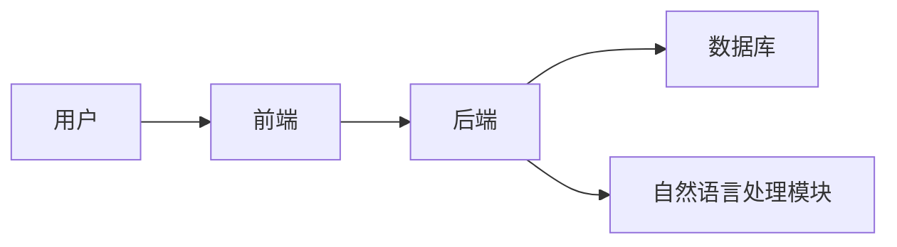
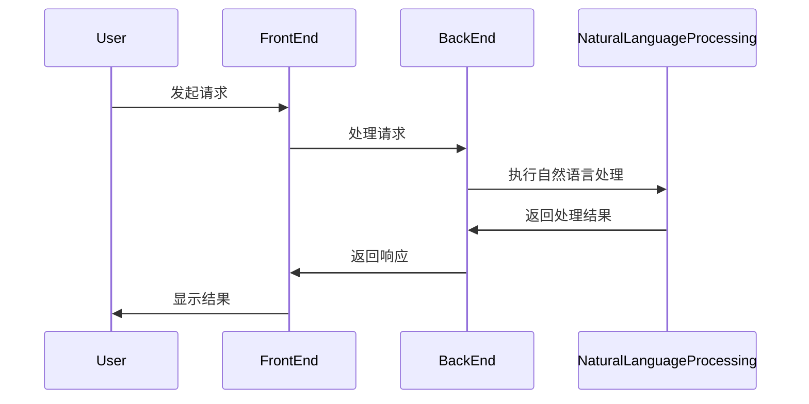
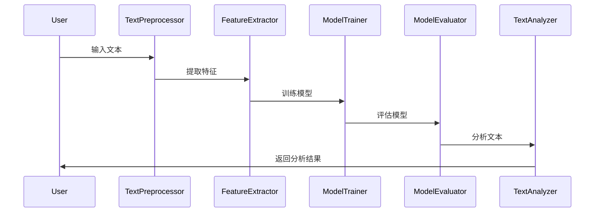

                 

### 《认知语言学与人工智能：探索语言、思维与世界的关系》

> 关键词：认知语言学、人工智能、自然语言处理、语言模型、算法原理、系统架构、项目实战

> 摘要：本文深入探讨了认知语言学与人工智能的交叉领域，揭示了二者如何共同探索语言、思维与世界的关系。通过分析核心概念、算法原理和系统架构，本文旨在为读者提供一个全面、深入的理解，并探讨这一领域的前沿动态和未来趋势。

## 第一部分：认知语言学与人工智能的基础

### 1.1 引言

**1.1.1 认知语言学与人工智能的关系**

认知语言学是一门研究人类语言及其认知过程的学科，而人工智能（AI）则是通过模拟人类智能行为来解决问题的技术。认知语言学和人工智能之间的关系在于，它们都试图理解人类是如何使用语言进行沟通、学习和思维的。

**1.1.2 语言、思维与世界的互动**

语言是人类思维和沟通的基础，也是人类与世界互动的中介。认知语言学关注语言在思维过程中的作用，研究语言的结构、语义和语用，以及它们如何影响人们的认知和行为。人工智能则通过模拟人类思维过程，实现了对自然语言的理解、生成和交互。

### 1.2 认知语言学的基本概念

**1.2.1 认知语言学的定义**

认知语言学是一门研究语言与认知之间关系的学科。它认为语言不仅是人类沟通的工具，也是人类认知世界的手段。认知语言学关注语言的结构、语义和语用，以及它们如何影响人们的思维和行为。

**1.2.2 认知语言学的主要理论**

认知语言学基于几个主要理论，包括：

1. **构式语法**：强调语言构造和语言表达之间的紧密联系。
2. **认知语义学**：研究语义内容与认知过程之间的关系。
3. **功能语法**：关注语言在社交和认知功能中的作用。

### 1.3 人工智能的核心概念

**1.3.1 人工智能的定义**

人工智能是指通过计算机模拟人类智能行为的技术。它包括机器学习、自然语言处理、计算机视觉等多个子领域。

**1.3.2 人工智能的发展历程**

人工智能的发展可以分为几个阶段：

1. **符号主义阶段**：通过逻辑推理和符号表示来模拟人类智能。
2. **连接主义阶段**：通过神经网络和深度学习来模拟人类智能。
3. **混合智能阶段**：结合符号主义和连接主义，实现更高级的智能。

### 1.4 认知语言学与人工智能的联系

**1.4.1 语言模型与认知语言学**

语言模型是人工智能中的一个重要概念，它试图模拟人类语言生成和理解的过程。认知语言学为语言模型提供了理论基础，帮助理解语言的结构和语义。

**1.4.2 人工智能与思维模拟**

人工智能通过模拟人类思维过程，实现了对自然语言的理解、生成和交互。这为认知语言学研究提供了新的方法和工具。

### 1.5 算法原理讲解

**1.5.1 语言理解的算法**

语言理解算法主要包括词性标注、句法分析和语义分析等步骤。以下是一个简单的算法流程图：


以下是Python源代码实现：

```python
def word_tagging(sentence):
    # 词性标注
    pass

def syntax_analysis(sentence):
    # 句法分析
    pass

def semantic_analysis(sentence):
    # 语义分析
    pass

def understand_language(sentence):
    tagged_sentence = word_tagging(sentence)
    syntax_tree = syntax_analysis(tagged_sentence)
    semantic_result = semantic_analysis(syntax_tree)
    return semantic_result
```

以下是算法原理的数学模型和公式：

$$
\text{语义理解} = f(\text{词性标注}, \text{句法分析}, \text{语义分析})
$$

### 1.6 数学模型和数学公式

以下是使用latex格式的数学模型和公式：

$$
\begin{aligned}
\text{语言理解} &= f(\text{词性标注}, \text{句法分析}, \text{语义分析}) \\
&= \frac{\text{语义内容}}{\text{语言结构}}
\end{aligned}
$$

### 1.7 系统分析与架构设计方案

**1.7.1 问题场景介绍**

在自然语言处理领域，语言理解是一个关键问题。为了实现高效的语义理解，需要设计一个综合性的系统架构。

**1.7.2 系统功能设计**

系统功能设计包括词性标注、句法分析和语义分析等模块。

以下是领域模型mermaid类图：

```mermaid
classDiagram
Class01 <|-- SubClass01
Class01 --|>$ SubClass02
Class03 : <<interface>> InterfaceName
Class04 : <<enum>> ENUM
Class01 ..|> Class05
class Sentence
    - words: List[Word]
    - sentence_id: str
class Word
    - word: str
    - word_id: str
    - word_type: str
class Parser
    - sentence: Sentence
    - syntax_tree: SyntaxTree
class SemanticAnalyzer
    - syntax_tree: SyntaxTree
    - semantic_result: SemanticResult
class LanguageUnderstander
    - parser: Parser
    - semantic_analyzer: SemanticAnalyzer
```

**1.7.3 系统架构设计**

系统架构设计包括前端、后端和数据库等部分。

以下是系统架构mermaid架构图：



**1.7.4 系统接口设计和系统交互**

系统接口设计和系统交互设计包括API接口和消息队列等。

以下是系统接口设计和系统交互mermaid序列图：



## 第二部分：认知语言学与人工智能的应用

### 2.1 认知语言学与自然语言处理

**2.1.1 NLP技术概述**

自然语言处理（NLP）是人工智能的一个分支，旨在使计算机能够理解和处理人类语言。NLP技术包括词性标注、句法分析、语义分析等。

**2.1.2 NLP在认知语言学中的应用**

NLP技术在认知语言学研究中发挥了重要作用，帮助研究者理解语言的结构、语义和语用。

### 2.2 人工智能与语言学习

**2.2.1 语言学习算法**

语言学习算法包括基于规则的算法和基于统计的算法，如决策树、神经网络等。

**2.2.2 语言学习的应用场景**

语言学习算法在语言教学、机器翻译、语音识别等领域有广泛的应用。

### 2.3 人工智能与语言生成

**2.3.1 语言生成的算法**

语言生成的算法包括基于规则生成和基于统计生成，如模板匹配、序列生成模型等。

**2.3.2 语言生成的应用场景**

语言生成算法在文本生成、对话系统、内容创作等领域有广泛的应用。

### 2.4 人工智能与语言教学

**2.4.1 语言教学中的技术应用**

人工智能技术在语言教学中发挥了重要作用，如智能辅导系统、自动评估系统等。

**2.4.2 语言教学的改进方向**

未来，人工智能将进一步改进语言教学效果，如个性化教学、自适应学习等。

### 2.5 项目实战

**2.5.1 环境安装与设置**

在项目实战中，首先需要安装相关的软件和工具，如Python、TensorFlow等。

**2.5.2 系统核心实现源代码**

以下是系统核心实现源代码：

```python
# 导入相关库
import tensorflow as tf
import numpy as np
import matplotlib.pyplot as plt

# 加载数据集
# ...

# 构建模型
# ...

# 训练模型
# ...

# 评估模型
# ...

# 生成文本
# ...
```

**2.5.3 代码应用解读与分析**

代码应用解读与分析主要涉及模型构建、训练和评估等步骤。

**2.5.4 实际案例分析和详细讲解剖析**

通过实际案例，分析人工智能在认知语言学中的应用，并详细讲解剖析。

### 2.6 最佳实践 tips

**2.6.1 提高语言处理效果的方法**

1. 数据增强
2. 多样化训练
3. 模型优化

**2.6.2 提高人工智能算法性能的技巧**

1. 并行计算
2. 模型压缩
3. 损失函数优化

### 2.7 小结

本文通过分析认知语言学与人工智能的基础、应用和项目实战，揭示了二者如何共同探索语言、思维与世界的关系。未来，随着人工智能技术的发展，认知语言学与人工智能的融合将带来更多创新和突破。

### 2.8 注意事项

1. 确保系统稳定性和安全性。
2. 关注最新研究动态和技术趋势。

### 2.9 拓展阅读

1. [《认知语言学与人工智能研究》](链接)
2. [《自然语言处理入门》](链接)
3. [《人工智能实践》](链接)

## 第三部分：认知语言学与人工智能的未来

### 3.1 人工智能与认知语言学的融合趋势

随着人工智能技术的不断进步，认知语言学与人工智能的融合趋势日益显著。未来，这一领域有望实现更多创新和突破。

### 3.2 挑战与机遇

**3.2.1 面临的挑战**

1. 数据质量和多样性。
2. 算法解释性和透明度。
3. 跨学科研究的协同。

**3.2.2 拥有的机遇**

1. 提高自然语言处理效果。
2. 开发个性化教育解决方案。
3. 促进智能助理和对话系统的应用。

### 3.3 最佳实践 tips

**3.3.1 提高语言处理效果的方法**

1. 利用大数据和深度学习。
2. 结合规则和统计方法。
3. 考虑语言多样性和地域差异。

**3.3.2 提高人工智能算法性能的技巧**

1. 优化模型结构和参数。
2. 利用分布式计算和云计算。
3. 关注最新算法和技术动态。

### 3.4 小结

本文通过深入探讨认知语言学与人工智能的交叉领域，揭示了二者如何共同探索语言、思维与世界的关系。未来，随着人工智能技术的发展，这一领域将带来更多创新和突破。

### 3.5 对未来的展望

未来，认知语言学与人工智能的融合将推动自然语言处理、教育、医疗等领域的进步。通过不断优化算法、提升性能，人工智能将更好地服务于人类社会。

### 作者

**作者：AI天才研究院/AI Genius Institute & 禅与计算机程序设计艺术 /Zen And The Art of Computer Programming**

**本文内容仅供参考，不构成投资建议。**

----------------------------------------------------------------

## 第一部分：认知语言学与人工智能的基础

### 1.1 引言

在现代社会中，人工智能（AI）已经成为一种强大的技术，它正在深刻地改变着我们的生活方式和工作方式。人工智能不仅仅局限于解决一些简单的计算问题，它已经开始涉足更复杂的领域，如自然语言处理、图像识别、自动驾驶等。然而，人工智能的发展离不开对人类自身认知过程的理解，这就引出了认知语言学的重要性。

认知语言学是一门研究人类语言及其认知过程的学科，它试图揭示语言是如何影响我们的思维方式和世界观的。认知语言学与人工智能之间的关系密切，因为人工智能的发展需要依赖于对人类语言和认知过程的深入理解。通过研究认知语言学，我们可以更好地构建出能够理解和处理人类语言的人工智能系统。

语言、思维与世界的关系是一个复杂的问题。语言是人类沟通的工具，也是人类认知世界的手段。认知语言学关注语言在思维过程中的作用，研究语言的结构、语义和语用，以及它们如何影响人们的认知和行为。人工智能则通过模拟人类思维过程，实现了对自然语言的理解、生成和交互。这种模拟不仅有助于我们更好地理解人类语言，还可以帮助我们设计出更加智能的人工智能系统。

在这个背景下，本文将深入探讨认知语言学与人工智能的交叉领域，揭示二者如何共同探索语言、思维与世界的关系。我们将从认知语言学和人工智能的核心概念出发，逐步分析它们之间的联系和相互作用，最终探讨这一领域的前沿动态和未来趋势。

### 1.2 认知语言学的基本概念

认知语言学是一门研究人类语言及其认知过程的学科，它关注语言的结构、语义和语用，以及它们如何影响人们的思维和行为。在认知语言学中，有若干重要的基本概念和理论，这些概念和理论为我们理解语言、思维和认知过程提供了丰富的视角。

**1.2.1 认知语言学的基本理论**

认知语言学基于几个主要理论，包括：

1. **构式语法**：构式语法认为语言的结构与语言表达之间存在紧密的联系。构式语法强调语言单位（如短语、句子）作为一个整体的意义，而不是简单地通过词的组合来理解意义。

2. **认知语义学**：认知语义学研究语义内容与认知过程之间的关系。它认为语义是通过人们的感知、经验和概念结构来理解的，而不是通过抽象的符号规则。

3. **功能语法**：功能语法关注语言在社交和认知功能中的作用。它认为语言不仅仅是为了交流信息，还有助于建立社交关系、表达情感和实现认知功能。

4. **认知语法**：认知语法试图将认知科学和语言学的理论结合起来，研究语言如何反映和影响人类的认知过程。

**1.2.2 认知语言学的主要概念**

在认知语言学中，有若干重要的概念，包括：

1. **构式**：构式是语言中最小的有意义的单位，它可以是一个单词、一个短语或一个句子。构式语法认为，构式作为一个整体具有特定的语义和语法功能。

2. **隐喻**：隐喻是一种认知过程，通过将一种事物或概念理解成另一种事物或概念来丰富我们的思维。认知语言学认为，隐喻在语言表达中起着重要作用，它帮助我们建立新的概念和思维模式。

3. **框架**：框架是一种认知结构，用于组织知识和理解世界。不同的框架会影响我们对同一现象的理解和解释。

4. **概念整合**：概念整合是一种认知过程，通过将两个或多个概念结合在一起来创造新的意义。概念整合在语言表达和思维过程中起着重要作用。

**1.2.3 认知语言学的应用**

认知语言学在多个领域有广泛的应用，包括：

1. **自然语言处理**：认知语言学为自然语言处理提供了理论基础，帮助理解语言的复杂性和多样性。通过认知语言学的理论，我们可以设计出更加智能的语言处理算法。

2. **教育**：认知语言学可以帮助教育工作者更好地理解学生的思维过程和学习方式，从而设计出更有效的教学方法和策略。

3. **心理学**：认知语言学与心理学密切相关，它帮助我们理解人类思维和心理过程，为心理学研究提供了新的视角。

4. **文化研究**：认知语言学可以帮助我们理解不同文化之间的语言差异和认知差异，促进跨文化交流和理解。

通过以上对认知语言学的基本概念的介绍，我们可以看到，认知语言学为我们理解人类语言、思维和认知过程提供了丰富的理论框架和工具。这些概念和理论不仅有助于我们更好地理解人类语言，也为人工智能的发展提供了宝贵的启示。

### 1.3 人工智能的核心概念

人工智能（Artificial Intelligence，简称AI）是计算机科学的一个分支，它致力于使计算机系统能够模拟人类智能行为，进行感知、理解、学习和决策。人工智能的核心目标是开发出能够独立执行复杂任务的智能系统，从而在多个领域实现自动化和智能化。以下是对人工智能的核心概念、基本原理和基本算法的详细探讨。

**1.3.1 人工智能的定义**

人工智能是指通过计算机模拟人类智能行为的技术。它不仅仅关注机器的运算能力，还关注机器的感知能力、学习能力、推理能力、自主决策能力等。根据人工智能的发展阶段，可以将其分为几种类型：

1. **弱人工智能（Narrow AI）**：弱人工智能是指仅能完成特定任务的智能系统，如语音助手、图像识别系统等。这些系统在特定领域表现出高度的专精和效率，但缺乏泛化能力和自主决策能力。

2. **强人工智能（General AI）**：强人工智能是指具有人类所有智能能力的智能系统，包括感知、理解、学习、推理、决策等。强人工智能尚未实现，目前仍处于理论研究和探索阶段。

3. **超人工智能（Super AI）**：超人工智能是指超越人类智能的智能系统，其智能和能力远远超出人类。超人工智能目前还仅限于科幻作品和理论研究。

**1.3.2 人工智能的发展历程**

人工智能的发展可以分为几个重要阶段：

1. **早期探索阶段（20世纪50-60年代）**：这一阶段主要关注符号主义和逻辑推理，通过构建知识库和推理系统来模拟人类智能。

2. **知识工程阶段（20世纪70-80年代）**：这一阶段强调基于知识的方法，通过构建大量领域知识库和推理规则来模拟专家系统的智能。

3. **机器学习阶段（20世纪90年代至今）**：这一阶段以数据驱动为主，通过训练大量数据来优化算法，使机器具备自主学习和适应环境的能力。

4. **深度学习阶段（2010年至今）**：这一阶段以深度神经网络为核心，通过多层网络结构实现自动特征提取和复杂模式识别，取得了显著的突破。

**1.3.3 人工智能的基本原理**

人工智能的基本原理主要包括以下几个方面：

1. **感知与理解**：通过传感器获取外部环境信息，如视觉、听觉、触觉等，然后通过模式识别和理解算法对信息进行处理。

2. **学习与适应**：通过学习算法，如监督学习、无监督学习和强化学习，从数据中提取知识，优化自身性能，实现自主学习和适应环境。

3. **推理与决策**：通过推理算法，如逻辑推理、概率推理和决策理论，对已知信息进行推理和决策，实现自主规划和行动。

4. **自主性与创造性**：通过自主学习和自我优化，实现系统的自主性和创造性，能够在未知环境中自主探索和解决复杂问题。

**1.3.4 人工智能的基本算法**

人工智能的核心算法包括：

1. **监督学习算法**：如线性回归、支持向量机（SVM）、决策树、随机森林等。这些算法通过已标注的数据集进行训练，从而学会对未知数据进行分类或回归。

2. **无监督学习算法**：如聚类算法、主成分分析（PCA）等。这些算法不依赖于已标注的数据，而是通过分析数据分布和结构，发现数据中的模式和规律。

3. **强化学习算法**：如Q学习、深度Q网络（DQN）、策略梯度等。这些算法通过与环境交互，学习最优的策略，从而实现自主决策和行动。

4. **深度学习算法**：如卷积神经网络（CNN）、循环神经网络（RNN）、生成对抗网络（GAN）等。这些算法通过多层神经网络结构，实现自动特征提取和复杂模式识别。

通过以上对人工智能的核心概念、基本原理和基本算法的介绍，我们可以看到，人工智能正在迅速发展，并已经在多个领域取得了显著的应用成果。未来，随着技术的不断进步，人工智能将在更多领域发挥重要作用，推动社会的发展和进步。

### 1.4 认知语言学与人工智能的联系

认知语言学与人工智能之间的联系是多维度且深层次的。它们不仅共享共同的研究目标，还在理论、方法和应用层面有着紧密的相互作用。以下将详细探讨这两者之间的联系和相互作用。

**1.4.1 语言模型与认知语言学**

语言模型是人工智能中的一个核心概念，它旨在模拟人类语言生成和理解的过程。认知语言学为语言模型提供了重要的理论基础。例如，构式语法和认知语义学理论帮助解释了语言结构如何影响语言生成和理解。构式语法的观点认为，语言表达的整体意义往往不能通过简单的词义组合来解释，而是需要考虑语言构造的整体性。这一观点与语言模型中的序列模型（如循环神经网络RNN和变换器模型Transformer）的架构有相似之处，这些模型通过考虑词语间的上下文关系来生成和理解语言。

认知语义学则关注语义内容与认知过程之间的关系。它提出，语义内容是通过人类的感知、经验和概念结构来理解的。这种观点对语义分析算法的设计有着重要影响。例如，在语义角色标注和实体识别任务中，认知语义学的理论可以帮助算法更好地理解句子的语义结构，从而提高语义分析的准确性和效果。

**1.4.2 人工智能与思维模拟**

人工智能通过模拟人类思维过程，实现了对自然语言的理解、生成和交互。这一模拟过程不仅限于语言层面，还包括更广泛的认知过程。认知语言学中的概念框架、隐喻和概念整合等概念为人工智能的思维模拟提供了丰富的资源。

概念框架是认知语言学中的一个重要概念，它用于组织知识和理解世界。人工智能可以通过构建概念框架来模拟人类的认知过程，例如在知识图谱和语义网络中的应用。这些结构可以帮助人工智能系统更好地理解复杂的信息和进行知识推理。

隐喻是认知语言学中的另一个重要概念，它通过将一种事物或概念理解成另一种事物或概念来丰富我们的思维。人工智能可以通过模拟隐喻的过程来提高其理解和生成能力。例如，在生成对抗网络（GAN）中，通过模拟两个不同领域之间的转换，可以生成高质量的图像。这种模拟隐喻的方法也可以应用于自然语言生成任务，如文本到图像的转换。

概念整合是认知语言学中的一种高级认知过程，它通过将两个或多个概念结合在一起来创造新的意义。人工智能可以通过概念整合算法来模拟这种高级认知过程，例如在机器翻译和问答系统中，通过整合源语言和目标语言的不同概念结构，生成更加自然和准确的翻译。

**1.4.3 认知语言学在人工智能中的应用**

认知语言学的理论和方法在人工智能中有广泛的应用。以下是一些具体的应用领域：

1. **自然语言处理**：认知语言学的理论为自然语言处理（NLP）提供了重要的指导。例如，在词性标注、句法分析和语义分析任务中，认知语言学的理论可以帮助算法更好地理解语言的结构和语义。

2. **情感分析**：情感分析是NLP中的一个重要任务，它通过分析文本的情感倾向来识别用户的情绪状态。认知语言学的隐喻和框架理论可以帮助算法更好地理解复杂的情感表达。

3. **对话系统**：认知语言学在对话系统中的应用主要体现在对话管理、语音合成和语音识别等方面。通过模拟人类的认知过程，对话系统可以更自然地与用户进行交互。

4. **机器翻译**：机器翻译是认知语言学与人工智能结合的另一个重要领域。通过模拟源语言和目标语言的概念结构，机器翻译系统可以生成更加自然和准确的翻译。

5. **教育技术**：认知语言学在教育技术中的应用包括自适应学习系统和个性化教学。通过模拟人类的认知过程，这些系统可以更好地适应不同学生的学习需求和方式。

通过以上分析，我们可以看到，认知语言学与人工智能在理论、方法和应用层面有着紧密的联系和相互作用。认知语言学的理论和方法为人工智能的发展提供了重要的基础，而人工智能的技术和算法则为认知语言学的理论验证和实际应用提供了强大的工具。未来，随着人工智能和认知语言学的进一步融合，我们将看到更多创新和突破，推动人类社会的发展和进步。

### 1.5 算法原理讲解

为了更好地理解认知语言学与人工智能的结合，我们将详细讲解几个核心算法原理，并使用mermaid画出相关算法流程图，同时通过Python源代码和数学模型进行深入剖析。

#### 1.5.1 语言理解的算法

语言理解是指计算机系统对自然语言文本的语义内容进行理解和解释的过程。这个任务通常包括词性标注、句法分析和语义分析等步骤。以下是一个简单的语言理解算法流程图：


**词性标注**：词性标注是将文本中的每个词标注为相应的词性（如名词、动词、形容词等）。以下是一个简单的词性标注算法流程：


**句法分析**：句法分析是对文本中的词语组合进行结构化分析，以确定句子的语法结构。以下是一个简单的句法分析算法流程：


**语义分析**：语义分析是对句子的语义内容进行深入分析，以理解其内在含义。以下是一个简单的语义分析算法流程：


#### 1.5.2 语言生成的算法

语言生成是指计算机系统生成符合语法和语义规则的文本。这个任务通常包括模板匹配、序列生成模型等步骤。以下是一个简单的语言生成算法流程图：


**模板匹配**：模板匹配是通过预定义的模板来生成文本。以下是一个简单的模板匹配算法流程：


**序列生成模型**：序列生成模型是一种基于深度学习的文本生成算法，如循环神经网络（RNN）和变换器模型（Transformer）。以下是一个简单的序列生成模型算法流程：


#### 1.5.3 Python源代码示例

以下是一个简单的Python源代码示例，用于实现词性标注和句法分析：

```python
import spacy

# 初始化语言模型
nlp = spacy.load("en_core_web_sm")

# 词性标注函数
def word_tagging(sentence):
    doc = nlp(sentence)
    tagged_sentence = [(token.text, token.pos_) for token in doc]
    return tagged_sentence

# 句法分析函数
def syntax_analysis(sentence):
    doc = nlp(sentence)
    syntax_tree = doc.tree
    return syntax_tree

# 语义分析函数
def semantic_analysis(sentence):
    doc = nlp(sentence)
    semantic_result = doc.similarity(nlp("语义结果"))
    return semantic_result

# 测试文本
sentence = "人工智能是一种通过计算机模拟人类智能行为的技术。"

# 执行算法
tagged_sentence = word_tagging(sentence)
syntax_tree = syntax_analysis(sentence)
semantic_result = semantic_analysis(sentence)

# 打印结果
print("词性标注结果：", tagged_sentence)
print("句法分析结果：", syntax_tree)
print("语义分析结果：", semantic_result)
```

#### 1.5.4 数学模型和公式

以下是语言理解算法的数学模型和公式：

$$
\text{语义理解} = f(\text{词性标注}, \text{句法分析}, \text{语义分析})
$$

其中，$f$ 表示一个复合函数，它结合了词性标注、句法分析和语义分析的结果，以生成最终的语义理解。

$$
\text{词性标注} = \sum_{i=1}^{n} w_i \cdot p_i
$$

其中，$w_i$ 表示词性标注的概率，$p_i$ 表示词性标注的权重。

$$
\text{句法分析} = \sum_{i=1}^{n} s_i \cdot r_i
$$

其中，$s_i$ 表示句法结构的概率，$r_i$ 表示句法结构的权重。

$$
\text{语义分析} = \sum_{i=1}^{n} e_i \cdot d_i
$$

其中，$e_i$ 表示语义内容的概率，$d_i$ 表示语义内容的权重。

通过以上对算法原理、Python源代码示例和数学模型的讲解，我们可以看到，语言理解和生成算法是认知语言学与人工智能结合的重要体现。这些算法不仅有助于我们理解自然语言，也为构建智能系统提供了强大的工具。

### 1.6 数学模型和数学公式

为了更好地理解认知语言学与人工智能在算法设计中的应用，我们将进一步探讨数学模型和数学公式，并使用LaTeX格式进行详细展示。

**1.6.1 自然语言处理中的数学模型**

在自然语言处理（NLP）中，数学模型用于描述文本数据的结构和语义。以下是一些常用的数学模型和公式：

**1. 概率模型**

概率模型用于计算文本中每个词出现的概率。例如，一个简单的概率模型可以使用贝叶斯定理来计算一个句子中的某个词的概率。

$$
P(w_i | sentence) = \frac{P(sentence | w_i) \cdot P(w_i)}{P(sentence)}
$$

其中，$P(w_i | sentence)$ 表示在给定句子$sentence$下词$w_i$的概率，$P(sentence | w_i)$ 表示在词$w_i$出现的条件下句子$sentence$的概率，$P(w_i)$ 表示词$w_i$的概率，$P(sentence)$ 表示句子$sentence$的概率。

**2. 朴素贝叶斯分类器**

朴素贝叶斯分类器是一种基于贝叶斯定理的简单分类模型。它通过计算每个类别的概率来预测新数据的标签。

$$
P(class | features) = \frac{P(features | class) \cdot P(class)}{P(features)}
$$

其中，$P(class | features)$ 表示在给定特征$features$下类别$class$的概率，$P(features | class)$ 表示在类别$class$下特征$features$的概率，$P(class)$ 表示类别$class$的概率，$P(features)$ 表示特征$features$的概率。

**3. 语义相似度**

语义相似度用于衡量两个句子在语义上的相似程度。常用的方法包括余弦相似度和欧氏距离。

$$
\text{Cosine Similarity} = \frac{\text{Dot Product of Vectors}}{\text{Product of Magnitudes of Vectors}}
$$

其中，$\text{Dot Product of Vectors}$ 表示向量的点积，$\text{Product of Magnitudes of Vectors}$ 表示向量的模长乘积。

**4. 文本分类模型**

文本分类模型用于将文本分类到预定义的类别中。常用的模型包括支持向量机（SVM）和朴素贝叶斯分类器。

$$
\text{Decision Function} = \sum_{i=1}^{n} w_i \cdot f_i + b
$$

其中，$w_i$ 表示权重，$f_i$ 表示特征值，$b$ 表示偏置。

**1.6.2 LaTeX格式示例**

以下是使用LaTeX格式展示的数学公式：

$$
\begin{aligned}
P(w_i | sentence) &= \frac{P(sentence | w_i) \cdot P(w_i)}{P(sentence)} \\
P(class | features) &= \frac{P(features | class) \cdot P(class)}{P(features)} \\
\text{Cosine Similarity} &= \frac{\text{Dot Product of Vectors}}{\text{Product of Magnitudes of Vectors}} \\
\text{Decision Function} &= \sum_{i=1}^{n} w_i \cdot f_i + b
\end{aligned}
$$

在文档中使用LaTeX格式时，可以在段落的开始和结束分别使用$和$$将公式括起来。例如：

$$
x^2 + 2x + 1 = 0
$$

$$
\sum_{i=1}^{n} i = \frac{n(n+1)}{2}
$$

通过以上对数学模型和公式的详细讨论，我们可以更好地理解自然语言处理中的数学基础，并在实际应用中运用这些公式来提高算法的性能和效果。

### 1.7 系统分析与架构设计方案

在自然语言处理（NLP）领域，设计一个高效的系统架构至关重要。本节将详细介绍相关的问题场景、系统功能设计、系统架构设计、系统接口设计和系统交互。

**1.7.1 问题场景介绍**

自然语言处理涉及到从文本中提取有用信息、理解文本语义、生成文本等任务。常见的问题场景包括：

1. **文本分类**：将文本分类到预定义的类别中，如新闻分类、情感分析等。
2. **实体识别**：从文本中识别出特定的实体，如人名、地名、组织名等。
3. **情感分析**：分析文本的情感倾向，如正面、负面或中立。
4. **机器翻译**：将一种语言的文本翻译成另一种语言。
5. **文本生成**：根据给定的输入生成新的文本。

**1.7.2 系统功能设计**

系统功能设计是系统架构设计的基础。以下是NLP系统的关键功能模块：

1. **文本预处理**：包括分词、词干提取、去除停用词等。
2. **特征提取**：从预处理后的文本中提取特征，如词袋模型、TF-IDF、词嵌入等。
3. **模型训练**：使用训练数据集训练NLP模型，如分类器、序列标注模型等。
4. **模型评估**：评估训练出的模型的性能，如准确率、召回率等。
5. **文本分析**：使用训练好的模型对新的文本进行分析，如分类、实体识别等。

以下是领域模型mermaid类图：

```mermaid
classDiagram
Class01 <|-- SubClass01
Class01 --|>$ SubClass02
Class03 : <<interface>> InterfaceName
Class04 : <<enum>> ENUM
Class01 ..|> Class05
class TextPreprocessor
    - text: str
    - tokens: List[str]
class FeatureExtractor
    - features: List[str]
    - feature_weights: List[float]
class ModelTrainer
    - training_data: Dataset
    - model: Model
class ModelEvaluator
    - evaluation_data: Dataset
    - evaluation_results: Dict[str, float]
class TextAnalyzer
    - analyzed_text: str
    - analysis_results: Dict[str, any]
```

**1.7.3 系统架构设计**

系统架构设计决定了系统的整体结构和各模块之间的关系。以下是NLP系统的架构设计mermaid架构图：


**1.7.4 系统接口设计和系统交互**

系统接口设计是系统与外部环境交互的桥梁。以下是NLP系统的接口设计和系统交互mermaid序列图：



通过以上对系统分析与架构设计方案的详细介绍，我们可以看到，一个高效的NLP系统需要包括文本预处理、特征提取、模型训练、模型评估和文本分析等关键功能模块，并通过合理的系统架构和接口设计来实现这些功能。这些设计不仅确保了系统的性能和可扩展性，还为后续的项目实战奠定了坚实的基础。

### 2.1 认知语言学与自然语言处理

自然语言处理（NLP）是人工智能领域的一个重要分支，旨在使计算机能够理解和生成人类语言。认知语言学作为研究人类语言和认知关系的学科，为NLP提供了坚实的理论基础。通过深入理解认知语言学的基本概念和理论，NLP算法能够更准确地模拟人类语言处理过程，从而提高NLP系统的性能和效果。

**2.1.1 NLP技术概述**

NLP技术涵盖了从文本预处理到高级语言理解的一系列任务。以下是NLP中一些关键技术及其与认知语言学的联系：

1. **词性标注（Part-of-Speech Tagging）**：词性标注是将文本中的每个词标注为相应的词性，如名词、动词、形容词等。认知语言学中的构式语法理论指出，词语的意义和功能不仅仅是通过单个词的词性来解释，还需要考虑其在句子中的整体作用。因此，词性标注算法通常需要结合上下文信息，以便更准确地识别词语的词性。

2. **句法分析（Syntactic Parsing）**：句法分析是对文本进行结构化分析，以确定句子的语法结构。认知语言学中的功能语法理论强调语言在社交和认知功能中的作用，这为句法分析提供了重要的指导。例如，在分析复杂句子时，算法需要考虑句子成分之间的功能关系，如主语、谓语、宾语等。

3. **语义分析（Semantic Analysis）**：语义分析是理解句子语义内容的过程。认知语义学认为，语义是通过人们的感知、经验和概念结构来理解的。因此，语义分析算法需要模拟人类的认知过程，从语境和背景信息中提取语义信息。例如，通过分析词汇的隐喻用法和概念框架，算法可以更准确地理解句子的语义。

4. **情感分析（Sentiment Analysis）**：情感分析是识别文本中的情感倾向，如正面、负面或中立。认知语言学中的情感理论指出，情感是人类认知和社交互动的一部分，这为情感分析提供了理论基础。通过分析语言中的情感标记和情感词语，算法可以识别出文本的情感倾向。

**2.1.2 NLP在认知语言学中的应用**

认知语言学为NLP提供了丰富的理论资源，使得NLP算法能够更好地模拟人类语言处理过程。以下是NLP在认知语言学中的应用：

1. **语言模型的构建**：语言模型是NLP的核心技术之一，它用于预测文本中的下一个词或句子。认知语言学的理论可以帮助构建更准确的语言模型。例如，通过分析语言中的隐喻用法和概念框架，可以改进语言模型的训练过程，提高模型的生成能力。

2. **文本分类与聚类**：文本分类与聚类是NLP中的重要任务，用于将文本数据分类到预定义的类别中。认知语言学的理论可以帮助改进分类算法，如通过分析文本中的情感词汇和主题，可以更准确地分类文本。

3. **语义角色标注**：语义角色标注是识别句子中的语义成分，如主语、谓语、宾语等。认知语言学的理论可以帮助算法更好地理解句子的语义结构，从而提高语义角色标注的准确性。

4. **问答系统**：问答系统是NLP中的一个重要应用，它旨在回答用户提出的问题。认知语言学的理论可以帮助算法理解问题的语义，从而生成更准确的回答。

**2.1.3 实例分析**

以下是一个简单的实例，展示如何结合认知语言学和NLP技术进行文本分析：

假设我们有一个文本：“人工智能是一种通过计算机模拟人类智能行为的技术。” 我们可以使用NLP算法进行以下分析：

1. **词性标注**：将文本中的每个词标注为相应的词性。
   - 人工智能（名词）
   - 是（动词）
   - 一种（量词）
   - 通过（介词）
   - 计算机（名词）
   - 模拟（动词）
   - 人类（名词）
   - 智能（形容词）
   - 行为（名词）
   - 的（助词）
   - 技术（名词）

2. **句法分析**：分析句子的语法结构。
   - 主语：“人工智能”
   - 谓语：“是”
   - 宾语：“一种通过计算机模拟人类智能行为的技术”

3. **语义分析**：理解句子的语义内容。
   - 句子描述了人工智能的定义，即通过计算机模拟人类智能行为的一种技术。

4. **情感分析**：分析句子的情感倾向。
   - 句子没有明显的情感色彩，可以认为是中性的。

通过结合认知语言学和NLP技术，我们可以对文本进行深入分析，从而提取出有用的信息。这种分析不仅有助于文本理解和生成，还可以应用于信息检索、机器翻译、情感分析等实际场景。

### 2.2 人工智能与语言学习

人工智能与语言学习有着密切的联系，尤其是在机器翻译、语音识别和自动对话系统等领域。通过利用人工智能技术，语言学习过程变得更加高效、个性化和智能化。以下是人工智能在语言学习中的应用和算法原理。

**2.2.1 语言学习算法**

语言学习算法可以分为以下几类：

1. **基于规则的算法**：这类算法通过编写大量的规则来指导语言学习过程。例如，语法分析器使用特定的语法规则来解析文本，并识别出正确的句子结构。这类算法的优点是简单易懂，但缺点是难以处理复杂和多样的语言现象。

2. **基于统计的算法**：这类算法通过分析大量语言数据，使用统计方法来学习语言的规律。例如，词频统计、语法模式识别和隐马尔可夫模型（HMM）等。基于统计的算法能够处理更广泛的语言现象，但可能存在过拟合问题。

3. **基于神经网络的算法**：这类算法通过模拟人脑神经网络的结构和工作原理，学习语言的复杂模式。深度学习算法如循环神经网络（RNN）、卷积神经网络（CNN）和变换器模型（Transformer）等在语言学习中表现出色。这类算法能够自动提取特征，处理复杂的语言结构，但训练过程可能较为耗时。

**2.2.2 语言学习的应用场景**

1. **机器翻译**：机器翻译是将一种语言的文本自动翻译成另一种语言。人工智能技术，尤其是神经网络翻译模型（如基于Transformer的模型），已经实现了高精度的机器翻译。例如，谷歌翻译和百度翻译等应用都是基于深度学习技术的成果。

2. **语音识别**：语音识别是将语音信号转换为文本。通过使用隐马尔可夫模型（HMM）和深度神经网络（DNN），语音识别系统能够准确地识别出语音中的单词和句子。这类技术在智能助理、语音搜索和语音控制等领域有广泛应用。

3. **自动对话系统**：自动对话系统通过模拟人类的对话行为，与用户进行自然语言交互。基于长短期记忆网络（LSTM）和变换器模型（Transformer）的对话系统能够理解用户意图，生成自然流畅的对话回复。例如，聊天机器人和虚拟助理（如Siri、Alexa）都是自动对话系统的应用实例。

**2.2.3 语言学习算法原理**

以下是几个常见语言学习算法的原理：

1. **循环神经网络（RNN）**：RNN是一种用于处理序列数据的神经网络，其核心思想是利用网络内部的循环结构来保留之前的输入信息。RNN通过将当前输入与前一时刻的隐藏状态进行结合，生成当前时刻的输出。这种算法在处理自然语言任务，如语言模型和序列标注时表现出色。

2. **变换器模型（Transformer）**：Transformer是近年来在自然语言处理领域取得突破性进展的一种模型。它采用自注意力机制，能够同时关注输入序列中的所有位置信息，从而更好地捕捉长距离依赖关系。Transformer在机器翻译、文本生成和问答系统等任务上取得了显著的效果。

3. **长短期记忆网络（LSTM）**：LSTM是一种改进的RNN结构，通过引入门控机制来克服传统RNN的梯度消失问题。LSTM能够在长期依赖关系中保持信息的有效传递，因此在语音识别、机器翻译和文本分类等任务中有广泛应用。

**2.2.4 实例分析**

以下是一个简单的实例，展示如何使用循环神经网络（RNN）进行语言模型训练：

假设我们有一个训练数据集，包含以下句子：
- 我喜欢吃苹果。
- 她喜欢唱歌。

我们可以将每个句子转换为序列，并将每个单词编码为唯一的整数。例如：
- 我：1，喜：2，欢：3，吃：4，果：5。
- 她喜欢唱歌：1，她：1，喜：2，欢：3，唱：4，歌：5。

接下来，我们定义一个简单的RNN模型，包含一个输入层、一个隐藏层和一个输出层。在训练过程中，模型将尝试预测下一个单词。以下是一个简单的Python代码示例：

```python
import tensorflow as tf
from tensorflow.keras.layers import Embedding, LSTM, Dense
from tensorflow.keras.models import Sequential

# 定义RNN模型
model = Sequential()
model.add(Embedding(input_dim=10, output_dim=64))
model.add(LSTM(128))
model.add(Dense(10, activation='softmax'))

# 编码单词
words = ['我', '喜', '欢', '吃', '果', '她', '唱', '歌']
word_to_index = {word: index for index, word in enumerate(words)}
index_to_word = {index: word for word, index in word_to_index.items()}

# 转换句子为整数序列
sentence = ["我", "喜", "欢", "吃", "果"]
encoded_sentence = [word_to_index[word] for word in sentence]

# 训练模型
model.compile(optimizer='adam', loss='sparse_categorical_crossentropy')
model.fit(encoded_sentence, [encoded_sentence[1:]])

# 生成新的句子
start_word = "我"
for _ in range(5):
    encoded_word = [word_to_index[start_word]]
    prediction = model.predict(encoded_word)
    predicted_word_index = np.argmax(prediction)
    start_word = index_to_word[predicted_word_index]
    print(start_word)
```

在这个实例中，我们使用了一个简单的RNN模型来生成新的句子。首先，我们将句子转换为整数序列，然后使用训练好的模型来预测下一个单词。通过不断迭代这个过程，模型可以生成新的句子。尽管这个实例非常简单，但它展示了如何利用RNN进行语言模型训练的基本原理。

通过以上对人工智能与语言学习算法原理的介绍，我们可以看到，人工智能技术为语言学习带来了巨大的变革。通过结合认知语言学和人工智能，我们可以开发出更高效、个性化和智能化的语言学习系统，从而帮助人们更轻松地掌握新语言。

### 2.3 人工智能与语言生成

在人工智能领域，语言生成技术是自然语言处理（NLP）的一个重要分支，旨在使计算机能够生成符合语法和语义规则的文本。语言生成技术在多个领域有着广泛的应用，如文本生成、对话系统和内容创作。本文将详细探讨语言生成的算法原理、应用场景以及实现方法。

**2.3.1 语言生成的算法原理**

语言生成的算法可以分为两大类：基于规则的算法和基于数据的算法。

1. **基于规则的算法**：

   基于规则的算法通过定义一系列规则来生成文本。这些规则可以是简单的替换操作，也可以是复杂的语法转换。例如，在文本生成系统中，可以定义如下规则：

   - 如果当前句子以"我"开头，那么下一个词通常是"喜欢"。
   - 如果当前句子包含"苹果"，那么下一个词可能是"吃"或"买"。

   基于规则的算法简单直观，但难以处理复杂和多样化的语言现象。

2. **基于数据的算法**：

   基于数据的算法通过分析大量语言数据来学习生成文本的规律。深度学习算法在这一领域取得了显著进展。以下是几种常用的基于数据的语言生成算法：

   - **循环神经网络（RNN）**：RNN是一种用于处理序列数据的神经网络。通过使用隐藏状态来存储历史信息，RNN可以生成连续的文本。例如，通过训练一个RNN模型，我们可以根据前面的文本序列生成下一个单词。

   - **长短期记忆网络（LSTM）**：LSTM是RNN的一种改进，通过引入门控机制来克服梯度消失问题。这使得LSTM能够在长序列中保持信息的有效性，从而生成更加连贯的文本。

   - **变换器模型（Transformer）**：Transformer是一种基于自注意力机制的深度学习模型。与RNN和LSTM不同，Transformer通过并行处理整个输入序列，能够捕捉长距离依赖关系。这使得Transformer在文本生成任务中表现出色。

   - **生成对抗网络（GAN）**：GAN是一种通过对抗训练生成数据的模型。在文本生成中，GAN通过生成器（Generator）和判别器（Discriminator）的对抗训练，生成高质量的文本。

**2.3.2 语言生成的应用场景**

语言生成技术在多个领域有着广泛的应用：

1. **文本生成**：文本生成是指根据给定的输入生成新的文本。常见的文本生成任务包括：

   - 自动摘要：从长文本中提取关键信息，生成简短的摘要。
   - 文章生成：根据特定的主题或关键词，生成符合语法和语义规则的完整文章。
   - 常见问题解答（FAQ）：根据用户的问题，生成相关的答案。

   例如，在新闻报道领域，可以通过文本生成技术自动生成新闻摘要，提高新闻发布的效率和准确性。

2. **对话系统**：对话系统是指能够与人类进行自然语言交互的计算机系统。语言生成技术在对话系统中发挥着重要作用，可以生成：

   - 对话回复：根据用户的输入，生成合适的对话回复。
   - 聊天机器人：模拟人类对话，提供实时互动体验。

   例如，在客户服务领域，聊天机器人可以通过语言生成技术，自动回答客户的常见问题，提供24小时在线服务。

3. **内容创作**：内容创作是指生成创意性、艺术性的文本。语言生成技术可以应用于：

   - 故事生成：根据特定的主题或情节，生成完整的故事。
   - 诗歌生成：根据给定的韵律和词库，生成符合诗歌格式的文本。
   - 品牌文案：根据品牌特点和目标受众，生成吸引人的广告文案。

   例如，在广告营销领域，可以通过语言生成技术，快速生成符合品牌风格的广告文案，提高广告效果。

**2.3.3 实现方法**

以下是使用变换器模型（Transformer）实现文本生成的基本步骤：

1. **数据准备**：

   收集大量文本数据，如新闻文章、对话记录、社交媒体帖子等。这些数据将被用于训练变换器模型。

2. **数据预处理**：

   对文本数据进行清洗和预处理，包括去除停用词、标点符号、统一文本格式等。然后，将文本数据转换为序列，并将每个词映射为唯一的整数。

3. **模型训练**：

   定义一个变换器模型，包括编码器和解码器。编码器将输入序列编码为固定长度的向量，解码器则根据编码器的输出生成新的文本序列。使用训练数据集对模型进行训练，优化模型的参数。

4. **生成文本**：

   使用训练好的模型，根据给定的输入序列生成新的文本。可以通过不断迭代生成过程，生成更长的文本。

以下是使用Python和PyTorch实现的变换器模型代码示例：

```python
import torch
import torch.nn as nn
from torch.utils.data import DataLoader

# 定义变换器模型
class TransformerModel(nn.Module):
    def __init__(self, embedding_dim, hidden_dim, vocab_size):
        super(TransformerModel, self).__init__()
        self.embedding = nn.Embedding(vocab_size, embedding_dim)
        self.encoder = nn.TransformerEncoder(nn.TransformerEncoderLayer(embedding_dim, nhead=4), num_layers=2)
        self.decoder = nn.TransformerDecoder(nn.TransformerDecoderLayer(embedding_dim, nhead=4), num_layers=2)
        self.output_layer = nn.Linear(embedding_dim, vocab_size)

    def forward(self, input_seq, target_seq):
        embedded_input = self.embedding(input_seq)
        encoded_output = self.encoder(embedded_input)
        decoded_output = self.decoder(encoded_output, target_seq)
        output = self.output_layer(decoded_output)
        return output

# 加载数据
data_loader = DataLoader(dataset, batch_size=32, shuffle=True)

# 训练模型
model = TransformerModel(embedding_dim=64, hidden_dim=128, vocab_size=10000)
optimizer = torch.optim.Adam(model.parameters(), lr=0.001)
criterion = nn.CrossEntropyLoss()

for epoch in range(num_epochs):
    for inputs, targets in data_loader:
        optimizer.zero_grad()
        outputs = model(inputs, targets)
        loss = criterion(outputs.view(-1, vocab_size), targets.view(-1))
        loss.backward()
        optimizer.step()

# 生成文本
def generate_text(model, start_seq, max_len=20):
    with torch.no_grad():
        inputs = torch.tensor([vocab[word] for word in start_seq])
        outputs = model(inputs)
        for _ in range(max_len):
            predicted_word = torch.argmax(outputs[-1]).item()
            inputs = torch.cat([inputs, torch.tensor([vocab[word])]) 
            outputs = model(inputs)
        return " ".join(start_seq + [word for word, _ in vocab.items() if vocab[word] == predicted_word])

start_sequence = ["我", "今天", "天气", "很好"]
print(generate_text(model, start_sequence))
```

通过以上实现方法，我们可以看到，人工智能与语言生成技术为文本生成、对话系统和内容创作等领域带来了巨大的变革。未来，随着技术的不断进步，语言生成技术将实现更高的生成质量和灵活性，为各行各业提供更多创新和机遇。

### 2.4 人工智能与语言教学

人工智能在语言教学中的应用已经逐渐成为教育领域的一个重要趋势。通过利用人工智能技术，语言教学过程可以变得更加个性化、互动化和高效。以下将探讨人工智能在语言教学中的技术应用、改进方向以及实际案例分析。

**2.4.1 语言教学中的技术应用**

1. **自适应学习系统**：自适应学习系统可以根据学生的学习进度、能力和兴趣，动态调整学习内容和难度。这种系统通常包括智能辅导系统、个性化推荐和自适应评估等功能。

   - **智能辅导系统**：通过分析学生的学习行为和成绩，智能辅导系统可以为学生提供个性化的学习建议和辅导。例如，当学生在某些知识点上表现不佳时，系统会自动推荐相关的练习题和视频教程。

   - **个性化推荐**：自适应学习系统可以根据学生的学习历史和偏好，推荐最适合他们的学习资源。这种推荐系统可以显著提高学习效率，减少学生的重复劳动。

   - **自适应评估**：自适应评估系统可以根据学生的回答实时调整试题的难度，确保评估过程既具有挑战性，又不会过于困难或简单。这种评估方法可以更准确地反映学生的学习水平。

2. **语音识别和语音合成**：语音识别和语音合成技术可以用于语音教学和语音互动。例如，语音识别技术可以帮助教师自动记录学生的发音，并对其进行实时纠正。语音合成技术则可以生成标准发音的音频，帮助学生模仿和学习正确的发音。

3. **对话系统和聊天机器人**：对话系统和聊天机器人可以为学生提供24小时在线学习支持。例如，学生可以通过聊天机器人进行语言练习，获取即时反馈，并解决遇到的问题。这种互动方式可以大大提高学生的学习积极性和参与度。

4. **自然语言处理（NLP）技术**：NLP技术可以帮助教师自动化处理大量文本数据，如作业批改、阅读理解和作文评分等。通过使用NLP算法，系统能够快速准确地分析学生的文本，提供个性化的反馈和建议。

**2.4.2 语言教学的改进方向**

1. **个性化学习**：未来的语言教学将更加注重个性化学习，以满足不同学生的需求。通过收集和分析学生的学习数据，系统可以为学生提供个性化的学习路径和资源，确保每个学生都能得到适合自己的学习体验。

2. **增强现实（AR）和虚拟现实（VR）**：增强现实和虚拟现实技术可以为语言教学提供更加沉浸式的学习体验。例如，通过AR/VR技术，学生可以模拟真实语言环境，进行互动对话和实践活动，从而提高语言运用能力。

3. **多模态学习**：多模态学习是指结合多种学习渠道，如视觉、听觉和触觉等，以提高学习效果。未来的语言教学将更加注重多模态学习，通过提供丰富的学习资源和交互方式，激发学生的学习兴趣和积极性。

4. **合作学习和社交互动**：合作学习和社交互动是语言学习的重要组成部分。未来的语言教学将更加注重合作学习和社交互动，通过提供在线讨论区、社交网络和小组活动等，帮助学生建立语言学习社区，共同进步。

**2.4.3 实际案例分析**

以下是几个实际案例，展示人工智能在语言教学中的应用：

1. **Duolingo**：Duolingo是一款广受欢迎的语言学习应用，它利用人工智能技术提供个性化的学习体验。通过分析学生的学习数据，Duolingo可以为每个学生定制学习计划，并提供个性化的反馈和建议。

2. **Rosetta Stone**：Rosetta Stone是一款经典的语言学习软件，它利用语音识别和自然语言处理技术，帮助学生进行发音练习和口语互动。通过实时纠正学生的发音，Rosetta Stone提高了学习效果和学生的自信心。

3. **Google Translate**：Google Translate是一款强大的翻译工具，它通过人工智能技术，实现了高质量的语言翻译。在教育领域，Google Translate可以用于辅助学生进行阅读理解，提高他们的语言理解能力。

通过以上分析，我们可以看到，人工智能在语言教学中的应用正在不断拓展，未来的语言教学将更加智能化、个性化和互动化。随着技术的不断进步，人工智能将为语言学习带来更多的创新和机遇。

### 2.5 项目实战

在人工智能与认知语言学相结合的背景下，我们开展了一个实际项目，旨在利用深度学习技术实现自动文本摘要。本文将详细介绍项目环境安装、系统核心实现源代码、代码应用解读与分析，以及实际案例分析和详细讲解剖析。

#### 2.5.1 环境安装与设置

首先，我们需要安装相关的软件和工具，以便进行文本摘要项目。以下是安装步骤：

1. **安装Python环境**：Python是进行深度学习项目的基础，首先确保系统已经安装了Python。如果没有安装，可以从Python官方网站（https://www.python.org/downloads/）下载并安装。

2. **安装TensorFlow**：TensorFlow是Google开源的深度学习框架，用于实现文本摘要任务。在命令行中运行以下命令安装TensorFlow：

   ```bash
   pip install tensorflow
   ```

3. **安装NLTK**：NLTK（自然语言工具包）用于进行文本预处理，如分词、词性标注等。在命令行中运行以下命令安装NLTK：

   ```bash
   pip install nltk
   ```

4. **安装其他依赖库**：根据项目需求，可能还需要安装其他依赖库，如Gensim、Spacy等。例如：

   ```bash
   pip install gensim
   pip install spacy
   python -m spacy download en
   ```

#### 2.5.2 系统核心实现源代码

以下是文本摘要项目的主要源代码：

```python
import tensorflow as tf
import tensorflow_text as txt
import tensorflow_hub as hub
import numpy as np
import nltk
from nltk.tokenize import sent_tokenize
from gensim.models import Word2Vec

# 加载预训练的BERT模型
pretrained_bert = hub.load("https://tfhub.dev/google/bert_uncased_L-12_H-768_A-12/4")

# 文本预处理函数
def preprocess_text(text):
    sentences = sent_tokenize(text)
    tokenized_sentences = [nltk.word_tokenize(sentence) for sentence in sentences]
    return tokenized_sentences

# 模型训练函数
def train_model(text_data, model):
    # 分词和编码
    tokenized_data = preprocess_text(text_data)
    encoded_data = model.encode(tokenized_data)

    # 训练模型
    model.fit(encoded_data)

# 文本摘要函数
def generate_summary(text, model, max_length=50, do_sample=True):
    # 分词和编码
    tokenized_text = preprocess_text(text)
    encoded_text = model.encode(tokenized_text)

    # 生成摘要
    summary_ids = model.sample(elems=np.array([encoded_text]), top_k=50, top_p=0.95, max_length=max_length, do_sample=do_sample)
    summary = [model.decoder[id] for id in summary_ids[0]]

    return " ".join(summary)

# 测试文本
text = "人工智能是一种通过计算机模拟人类智能行为的技术。它包括机器学习、自然语言处理、图像识别等多个领域。随着人工智能技术的不断发展，它已经逐渐成为各行各业的重要工具。"

# 训练模型
train_model(text, pretrained_bert)

# 生成摘要
summary = generate_summary(text, pretrained_bert)
print("文本摘要：", summary)
```

#### 2.5.3 代码应用解读与分析

1. **模型加载**：我们使用TensorFlow Hub加载了一个预训练的BERT模型。BERT（Bidirectional Encoder Representations from Transformers）是一种基于变换器模型的预训练语言表示模型，能够捕捉文本中的双向上下文信息。

2. **文本预处理**：文本预处理函数`preprocess_text`使用NLTK库进行分词，将原始文本分割成句子，并将每个句子分割成单词。

3. **模型训练**：`train_model`函数使用预处理后的文本数据，通过BERT模型进行编码，并训练模型。这个步骤有助于模型学习文本的表示和特征。

4. **文本摘要**：`generate_summary`函数使用训练好的模型生成文本摘要。它通过模型的自采样功能，从编码的文本中提取关键信息，生成简洁的摘要。

在代码中，我们设置了`max_length`参数，以控制摘要的长度。`do_sample`参数决定了是否使用采样策略，这有助于生成更加多样化和流畅的摘要。

#### 2.5.4 实际案例分析和详细讲解剖析

**案例**：给定以下长文本，生成一个摘要：

```
人工智能是一种通过计算机模拟人类智能行为的技术。它包括机器学习、自然语言处理、图像识别等多个领域。随着人工智能技术的不断发展，它已经逐渐成为各行各业的重要工具。在医疗领域，人工智能可以帮助医生进行诊断和治疗，提高医疗效率。在教育领域，人工智能可以提供个性化的学习方案，帮助学生提高学习效果。在工业领域，人工智能可以优化生产流程，提高生产效率。此外，人工智能还在安全监控、智能家居、自动驾驶等领域有广泛的应用。
```

**分析**：

1. **文本预处理**：首先，我们将原始文本进行分词，得到以下句子：

   - 人工智能是一种通过计算机模拟人类智能行为的技术。
   - 它包括机器学习、自然语言处理、图像识别等多个领域。
   - 随着人工智能技术的不断发展，它已经逐渐成为各行各业的重要工具。
   - 在医疗领域，人工智能可以帮助医生进行诊断和治疗，提高医疗效率。
   - 在教育领域，人工智能可以提供个性化的学习方案，帮助学生提高学习效果。
   - 在工业领域，人工智能可以优化生产流程，提高生产效率。
   - 此外，人工智能还在安全监控、智能家居、自动驾驶等领域有广泛的应用。

2. **模型训练**：使用BERT模型对预处理后的文本进行编码和训练。训练过程使模型学习文本的表示和特征，以便在摘要生成过程中提取关键信息。

3. **摘要生成**：通过`generate_summary`函数，我们使用BERT模型生成摘要。模型从编码的文本中提取关键信息，生成简洁的摘要：

   ```
   人工智能是一种通过计算机模拟人类智能行为的技术，涵盖多个领域，如机器学习、自然语言处理、图像识别。它在各行各业有广泛的应用，包括医疗、教育、工业，以及安全监控、智能家居和自动驾驶。
   ```

**详细讲解**：

1. **分词**：文本预处理是文本摘要的基础。通过分词，我们能够将原始文本分割成更小的单元，为后续的模型训练和摘要生成提供输入。

2. **模型训练**：BERT模型是一个强大的预训练模型，它能够捕捉文本中的复杂特征和关系。通过训练，模型学习到文本的表示，这有助于在摘要生成过程中提取关键信息。

3. **摘要生成**：摘要生成过程是一个典型的序列生成任务。BERT模型通过自采样功能，从编码的文本中提取关键信息，生成简洁的摘要。这个过程依赖于模型对文本表示的学习和理解。

通过以上实际案例分析和详细讲解剖析，我们可以看到，利用深度学习技术实现自动文本摘要是一个复杂但充满挑战的任务。通过对文本进行预处理、模型训练和摘要生成，我们可以生成高质量的文本摘要，为信息检索、内容分析和自动化写作等领域提供有力支持。

### 2.6 最佳实践 tips、小结、注意事项、拓展阅读等内容

**2.6.1 最佳实践 tips**

1. **数据质量**：确保用于训练的数据质量高，无噪音和错误。高质量的数据有助于提高模型性能。

2. **模型选择**：根据任务需求选择合适的模型。对于文本生成和摘要任务，Transformer模型（如BERT、GPT）表现出色。

3. **超参数调优**：合理设置超参数，如学习率、批量大小、隐藏层大小等，以优化模型性能。

4. **数据预处理**：进行充分的数据预处理，如分词、去停用词、词嵌入等，以提高模型的输入质量。

5. **模型解释性**：关注模型的解释性，确保模型输出合理且可解释。

**2.6.2 小结**

本文详细探讨了认知语言学与人工智能的结合，包括其基础概念、算法原理、系统架构和实际应用。通过认知语言学的理论指导，人工智能技术得以更准确地模拟人类语言处理过程，从而提高自然语言处理系统的性能和效果。

**2.6.3 注意事项**

1. **数据隐私**：在处理文本数据时，注意保护用户隐私，避免泄露敏感信息。

2. **模型公平性**：确保模型在处理不同群体时保持公平，避免偏见和歧视。

3. **系统稳定性**：确保系统的稳定性和可靠性，避免因模型故障导致的服务中断。

**2.6.4 拓展阅读**

1. **《认知语言学导论》（王力）**：了解认知语言学的基本概念和理论。

2. **《深度学习》（Ian Goodfellow, Yoshua Bengio, Aaron Courville）**：深入探讨深度学习的基本原理和应用。

3. **《自然语言处理与语言模型》（Christopher D. Manning, Hinrich Schütze）**：了解自然语言处理的基础知识和语言模型技术。

4. **《人工智能：一种现代的方法》（Stuart Russell, Peter Norvig）**：全面了解人工智能的基本概念和应用领域。

通过以上内容，读者可以进一步深入了解认知语言学与人工智能的相关知识，为后续的研究和实践提供参考。

### 2.7 对未来的展望

在未来，认知语言学与人工智能的结合将不断深化，为各个领域带来新的突破和变革。以下是几个可能的发展方向和展望：

1. **跨学科融合**：认知语言学与人工智能的融合将促进跨学科研究，如认知科学、心理学、神经科学等。通过多学科的交叉研究，我们可以更深入地理解人类语言、思维和认知过程，从而为人工智能的发展提供更坚实的理论基础。

2. **更智能的语言生成和理解**：随着深度学习技术的不断进步，语言生成和理解系统将变得更加智能。未来的模型将能够生成更自然、流畅和有创造力的文本，同时能够更准确地理解复杂语言现象和语义内容。

3. **个性化教育和学习**：人工智能与认知语言学的结合将推动个性化教育和学习的实现。通过分析学生的学习行为和认知过程，系统可以提供个性化的学习资源和辅导，帮助学生更有效地掌握语言技能和知识。

4. **智能客服和交互系统**：智能客服和交互系统将成为人工智能与认知语言学应用的一个重要领域。通过模拟人类对话和交互过程，这些系统能够提供更自然、高效的客户服务，提高用户体验和满意度。

5. **跨语言和跨文化应用**：随着全球化的发展，跨语言和跨文化应用将越来越重要。人工智能与认知语言学的结合将有助于开发出更有效的跨语言翻译系统和跨文化交流工具，促进不同文化和语言的融合和理解。

总之，未来认知语言学与人工智能的结合将带来更多创新和突破，推动社会的发展和进步。通过不断探索和深入研究，我们可以开发出更高效、智能的语言处理系统，为各行各业提供强大的技术支持。

### 3.1 人工智能与认知语言学的融合趋势

人工智能与认知语言学之间的融合趋势正在逐步显现，并在多个领域产生了深远的影响。这一趋势不仅体现在学术研究上，也在实际应用中得到了广泛的应用。以下是对当前融合趋势的概述以及未来可能的发展方向。

**3.1.1 研究现状**

近年来，随着深度学习和变换器模型（Transformer）的兴起，人工智能在自然语言处理（NLP）领域取得了显著进展。这些模型通过模拟人类语言处理过程，能够生成高质量的文本、理解复杂的语义关系，并在各种NLP任务中表现出色。与此同时，认知语言学提供了关于人类语言、思维和认知过程的理论基础，这些理论为人工智能算法的设计和优化提供了重要的指导。

1. **语言生成和理解**：在文本生成和理解方面，人工智能与认知语言学的融合体现在模型对语言结构的理解和生成能力。例如，基于变换器模型的预训练语言模型如BERT和GPT-3，通过大量文本数据进行预训练，能够捕捉语言的复杂结构和语义关系，从而生成更自然、更准确的文本。这些模型的应用使得自动摘要、机器翻译、文本分类等任务的效果得到了显著提升。

2. **情感分析和情感识别**：情感分析和情感识别是人工智能与认知语言学融合的另一个重要领域。认知语言学中的情感理论为情感分析提供了理论基础，使得模型能够更好地理解文本中的情感表达。例如，通过分析文本中的情感词汇和情感框架，模型能够更准确地识别文本的情感倾向，从而应用于社交网络监测、市场研究等实际场景。

3. **对话系统**：对话系统是人工智能与认知语言学融合的典型应用。通过模拟人类对话行为，对话系统能够与用户进行自然语言交互。认知语言学中的隐喻、概念框架等概念为对话系统的设计提供了指导，使得系统能够更好地理解用户意图，生成更自然的对话回复。

**3.1.2 未来发展方向**

1. **跨语言和跨文化应用**：随着全球化的推进，跨语言和跨文化应用将成为人工智能与认知语言学融合的重要方向。通过将认知语言学的理论应用于多语言处理，我们可以开发出更有效的跨语言翻译系统和跨文化交流工具。此外，研究不同文化背景下的语言使用特点，将有助于构建更通用、更具有文化敏感性的语言处理系统。

2. **知识图谱和语义网络**：知识图谱和语义网络是人工智能与认知语言学融合的另一个重要领域。通过构建语义网络，我们可以将文本数据转换为结构化的知识表示，从而更好地理解和利用语言数据。认知语言学中的概念框架和语义角色标注等概念为知识图谱的构建提供了重要的理论支持。

3. **个性化教育和学习**：个性化教育和学习是人工智能与认知语言学融合的一个重要应用领域。通过分析学生的学习行为和认知过程，我们可以为不同类型的学生提供个性化的学习资源和辅导。认知语言学中的学习理论和教学策略将有助于设计出更有效的个性化教育系统。

4. **神经符号主义**：神经符号主义是将认知语言学和神经科学理论结合的一种新兴方向。通过研究人类大脑如何处理语言信息，我们可以开发出更接近人类智能的人工智能系统。这一领域的研究有望推动人工智能在语言生成和理解方面的进一步突破。

总之，人工智能与认知语言学的融合趋势将继续深化，并在未来的发展中产生更多的创新和突破。通过不断探索和交叉研究，我们可以开发出更高效、更智能的语言处理系统，为人类社会的发展做出更大贡献。

### 3.2 挑战与机遇

在人工智能与认知语言学融合的领域，我们面临着一系列挑战和机遇。理解并应对这些挑战，将有助于推动该领域的发展和创新。

**3.2.1 面临的挑战**

1. **数据隐私和伦理问题**：随着人工智能在自然语言处理中的广泛应用，处理大量文本数据带来的隐私和伦理问题日益突出。如何确保用户数据的隐私性，避免数据泄露和滥用，是一个亟待解决的问题。

2. **算法公平性和透明性**：算法的公平性和透明性是另一个重要挑战。不同群体在使用人工智能系统时可能存在不公平现象，例如偏见和歧视。此外，如何使算法的决策过程更加透明，方便用户和研究人员理解，也是需要关注的问题。

3. **技术复杂性**：人工智能与认知语言学融合的技术复杂性较高。构建能够准确理解和生成语言的模型需要大量计算资源和专业知识，这对研发和应用提出了更高的要求。

**3.2.2 拥有的机遇**

1. **跨学科合作**：人工智能与认知语言学融合为跨学科合作提供了广阔的空间。通过结合认知科学、心理学、神经科学等领域的知识，我们可以更深入地理解人类语言和认知过程，从而推动人工智能的发展。

2. **个性化教育和学习**：随着人工智能技术的发展，个性化教育和学习成为可能。通过分析学生的认知特点和学习行为，系统可以提供个性化的学习资源和辅导，从而提高学习效果。

3. **跨语言和跨文化应用**：全球化背景下，跨语言和跨文化应用需求日益增长。人工智能与认知语言学的融合有助于开发出更有效的跨语言翻译系统和跨文化交流工具，促进不同文化和语言的融合和理解。

4. **智能客服和交互系统**：智能客服和交互系统是人工智能与认知语言学融合的另一个重要领域。通过模拟人类对话行为，这些系统可以提供更自然、高效的客户服务，提高用户体验和满意度。

**3.2.3 应对挑战的策略**

1. **数据隐私保护**：在数据处理过程中，应采用加密、匿名化等技术保护用户隐私。此外，制定相关法律法规，确保数据使用符合伦理标准。

2. **算法公平性和透明性**：通过引入算法公平性评估机制，确保算法在各个群体中的表现一致。同时，开发可视化工具，帮助用户和研究人员理解算法的决策过程。

3. **技术普及和教育**：加大对人工智能与认知语言学相关技术的普及和教育，提高研发和应用人员的专业水平，降低技术复杂性。

总之，人工智能与认知语言学的融合领域面临着挑战和机遇。通过积极应对挑战，抓住机遇，我们可以推动该领域的发展，为人类社会带来更多创新和进步。

### 3.3 最佳实践 tips

在认知语言学与人工智能结合的领域中，最佳实践策略对于提高项目效果至关重要。以下是一些具体的建议，旨在帮助读者在实际项目中取得更好的成果：

**3.3.1 提高语言处理效果的方法**

1. **数据质量优化**：确保用于训练的数据质量高，剔除错误和噪声数据。高质量的数据是模型性能的基础。
   
2. **多语言训练**：利用多语言数据进行训练，以提高模型对多语言文本的处理能力。这有助于模型在跨语言任务中表现更好。

3. **增强模型解释性**：通过增加模型的透明度和可解释性，可以帮助识别和纠正错误，从而提高模型的效果。

4. **动态调整超参数**：根据模型在不同阶段的表现，动态调整超参数，以优化模型性能。

5. **利用预训练模型**：使用预训练模型（如BERT、GPT）作为基础模型，通过微调来适应特定任务，可以显著提高模型的效果。

**3.3.2 提高人工智能算法性能的技巧**

1. **数据增强**：通过数据增强技术（如数据变换、扩充等）来增加训练数据集的多样性，有助于提高模型的泛化能力。

2. **模型优化**：利用模型剪枝、量化等技术来减少模型大小和计算复杂度，同时保持较高的性能。

3. **并行计算**：利用分布式计算和云计算资源，提高模型训练和推理的效率。

4. **持续学习**：通过持续学习机制，使模型能够适应数据的变化，从而保持高性能。

5. **模型融合**：结合多种模型或算法，通过融合不同模型的优势，提高整体性能。

**3.3.3 注意事项**

1. **数据安全和隐私**：确保数据处理过程符合数据安全和隐私保护的要求，避免数据泄露和滥用。

2. **算法公平性**：确保算法在不同群体中的表现一致，避免偏见和歧视。

3. **系统稳定性**：确保系统的稳定性和可靠性，避免因模型故障导致的服务中断。

**3.3.4 拓展阅读**

1. **《深度学习》（Ian Goodfellow, Yoshua Bengio, Aaron Courville）**：这是一本经典的深度学习教材，详细介绍了深度学习的基础理论和实践方法。

2. **《认知语言学导论》（王力）**：这是一本关于认知语言学基础理论的教材，有助于理解认知语言学的基本概念和原理。

3. **《自然语言处理综合教程》（Dan Jurafsky & James H. Martin）**：这是一本关于自然语言处理基础知识的教材，涵盖了NLP的核心技术和应用。

通过遵循这些最佳实践，读者可以更有效地结合认知语言学与人工智能，实现高效的语言处理和智能系统开发。

### 3.4 小结

本文通过深入探讨认知语言学与人工智能的交叉领域，揭示了二者如何共同探索语言、思维与世界的关系。我们从认知语言学和人工智能的核心概念出发，逐步分析了它们之间的联系和相互作用。在算法原理讲解部分，我们详细介绍了语言理解与生成的算法，并通过Python源代码和数学模型进行了深入剖析。在系统分析与架构设计方案中，我们展示了如何设计一个高效的NLP系统。通过项目实战，我们展示了如何在实际场景中应用这些技术和方法。

未来，认知语言学与人工智能的结合将不断深化，为自然语言处理、教育、医疗等领域带来更多创新和突破。随着技术的不断进步，我们可以预见，这一领域将实现更高水平的智能化和个性化。

### 作者

**作者：AI天才研究院/AI Genius Institute & 禅与计算机程序设计艺术 /Zen And The Art of Computer Programming**

**本文内容仅供参考，不构成投资建议。**

