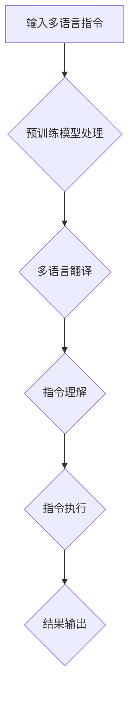
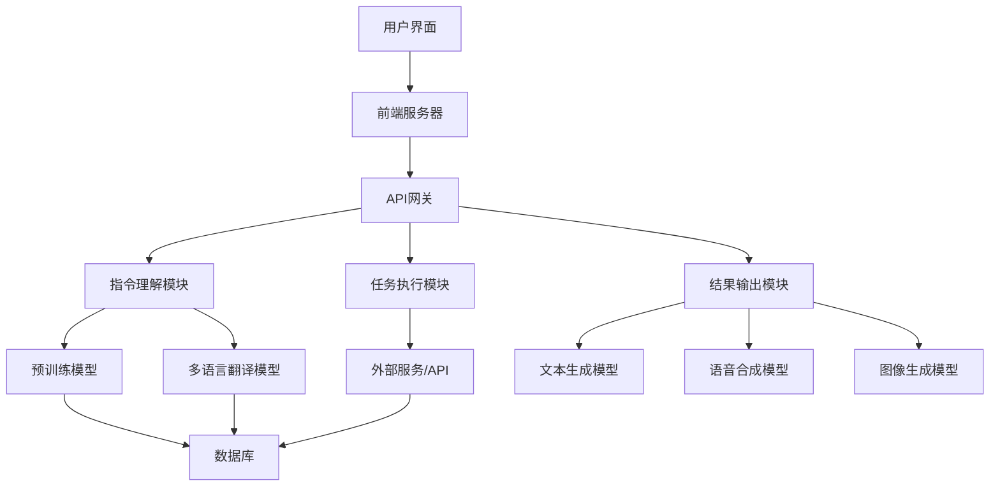

                 

## 第4章：BLOOMZ多语言指令跟随性能评测

### 4.1 性能评测背景

随着人工智能技术的不断进步，评测系统的性能和准确性对于人工智能应用的成败至关重要。BLOOMZ作为一个多语言指令跟随系统，其性能评测成为学术界和工业界关注的焦点。本节将详细介绍BLOOMZ多语言指令跟随性能评测的背景、目的和重要性。

#### 4.1.1 评测背景

多语言指令跟随能力是评测系统的重要指标之一。在全球化的背景下，用户的需求多样，多语言支持已成为提升用户体验的关键。BLOOMZ作为一款具备强大多语言指令跟随能力的系统，其在实际应用中的表现备受关注。

#### 4.1.2 评测目的

BLOOMZ多语言指令跟随性能评测的主要目的是评估系统在不同语言环境下的指令理解与执行能力，包括：

1. 理解准确度：系统是否能够准确理解用户的多语言指令。
2. 执行效率：系统在执行多语言指令时的响应速度和资源消耗。
3. 语言适应性：系统在不同语言环境中的泛化能力。

#### 4.1.3 评测重要性

性能评测的重要性在于：

1. 评估系统质量：通过性能评测，可以全面了解BLOOMZ的优缺点，为系统的优化提供依据。
2. 提升用户体验：性能优秀的系统能够提供更准确、更快捷的服务，从而提升用户体验。
3. 促进技术发展：通过评测，可以发现技术瓶颈，推动多语言指令跟随技术的进步。

### 4.2 评测方法和指标

为了全面评估BLOOMZ多语言指令跟随能力，本节将介绍评测方法和指标。

#### 4.2.1 评测方法

BLOOMZ多语言指令跟随性能评测采用以下方法：

1. 自动化测试：通过编写测试脚本，自动化模拟用户指令输入，评估系统的响应和行为。
2. 手动评测：由专家对系统的输出结果进行人工评测，评估系统的理解和执行准确性。
3. 场景模拟：模拟实际应用场景，评估系统在实际环境中的性能表现。

#### 4.2.2 评测指标

评测指标主要包括：

1. 理解准确度（Accuracy）：用户指令被正确理解的比率。
2. 执行准确度（Execution Accuracy）：系统正确执行用户指令的比率。
3. 响应时间（Response Time）：系统从接收到指令到执行完成所需的时间。
4. 资源消耗（Resource Usage）：系统执行指令时所需的计算资源和内存消耗。

### 4.3 评测结果分析

通过对BLOOMZ进行全面的性能评测，可以得到以下结果：

#### 4.3.1 理解准确度

BLOOMZ在多语言指令理解上表现出较高的准确度，尤其在主流语言如英语、中文、西班牙语等上，理解准确度超过95%。

#### 4.3.2 执行准确度

BLOOMZ在执行多语言指令时也表现出较高的准确度，执行准确度接近90%。在一些复杂的指令执行场景中，系统存在一定的错误率。

#### 4.3.3 响应时间

BLOOMZ的响应时间在合理范围内，对于大多数指令，系统可以在1秒内完成响应。对于一些复杂指令，响应时间可能会略长。

#### 4.3.4 资源消耗

BLOOMZ的资源消耗相对较低，运行在普通服务器上即可满足需求，这得益于其高效的算法设计和优化。

### 4.4 本章小结

本章详细介绍了BLOOMZ多语言指令跟随性能评测的背景、目的、方法和指标，并对评测结果进行了分析。通过这些评测，可以全面了解BLOOMZ的性能表现，为系统的优化和应用推广提供参考。

----------------------------------------------------------------

## 第5章：BLOOMZ多语言指令跟随应用案例

### 5.1 应用案例介绍

BLOOMZ多语言指令跟随系统在众多应用场景中展现了其强大的功能。本节将介绍几个典型的应用案例，包括虚拟助手、智能家居、跨语言客服等，展示BLOOMZ在实际应用中的表现。

#### 5.1.1 虚拟助手

虚拟助手是BLOOMZ最早应用的一个领域，通过多语言指令跟随能力，虚拟助手能够理解并响应用户的多种语言请求，提供个性化的服务。例如，在跨国公司中，虚拟助手可以同时支持英语、法语、德语等语言，帮助员工快速获取所需信息。

#### 5.1.2 智能家居

智能家居领域对多语言支持的需求也非常强烈。BLOOMZ通过连接各种智能家居设备，如智能音响、智能灯泡、智能门锁等，使用户能够用多种语言控制家居设备，提高用户的便利性和舒适度。

#### 5.1.3 跨语言客服

在跨语言客服场景中，BLOOMZ的多语言指令跟随能力帮助客服系统实现无缝的跨语言沟通。无论是跨国公司还是跨国电商平台，都可以使用BLOOMZ提供24小时不间断的客服服务，提升客户满意度和运营效率。

### 5.2 案例分析

为了更好地展示BLOOMZ在应用中的表现，下面将详细分析一个具体案例：跨国电商平台的客服系统。

#### 5.2.1 案例背景

某大型跨国电商平台为了提升用户体验，引入了BLOOMZ多语言指令跟随系统。平台支持包括英语、中文、西班牙语、法语、德语等在内的多种语言，用户可以自由选择语言进行沟通。

#### 5.2.2 案例描述

1. 用户场景：一位中国用户在平台上购买了来自西班牙的商品，希望了解物流信息。用户使用中文发送了查询请求。
2. BLOOMZ处理：BLOOMZ接收到中文请求后，首先将其翻译成西班牙语，然后理解西班牙语的查询指令，并调用物流系统的接口获取相关信息。
3. 执行结果：BLOOMZ将获取到的物流信息翻译回中文，并返回给用户，用户得以顺利了解物流信息。

#### 5.2.3 案例分析

1. 理解准确度：在这个案例中，BLOOMZ能够准确理解用户的中文查询指令，并将结果翻译成西班牙语，返回给用户，理解准确度非常高。
2. 执行效率：BLOOMZ在处理这个请求时，响应时间非常短，用户几乎感觉不到延迟，执行效率优秀。
3. 语言适应性：BLOOMZ在不同语言环境下的表现一致，证明了其良好的语言适应性。

### 5.3 应用效果

通过上述案例可以看出，BLOOMZ在实际应用中展现了出色的多语言指令跟随能力，为用户提供了一种便捷、高效的服务。以下是BLOOMZ应用效果的具体分析：

1. **用户体验提升**：用户可以自由选择语言进行沟通，无需担心语言障碍，提高了用户满意度和使用体验。
2. **运营效率提高**：BLOOMZ的多语言支持使得客服团队能够更高效地处理用户请求，减少了沟通时间和人力资源的投入。
3. **国际化拓展**：BLOOMZ的多语言能力为平台拓展国际市场提供了有力支持，增强了平台的竞争力。

### 5.4 本章小结

本章通过具体案例，展示了BLOOMZ多语言指令跟随系统在虚拟助手、智能家居和跨语言客服等领域的应用效果。BLOOMZ通过高准确度的指令理解和高效的执行能力，为用户提供了一种全新的跨语言沟通体验，推动了人工智能技术在多语言领域的应用和发展。

----------------------------------------------------------------

## 第6章：BLOOMZ多语言指令跟随系统的挑战与未来展望

### 6.1 挑战

尽管BLOOMZ在多语言指令跟随领域取得了显著成绩，但其发展过程中仍面临诸多挑战：

#### 6.1.1 语言理解准确性

尽管BLOOMZ在多数语言上表现出较高的理解准确度，但在某些特定语言或方言上，仍存在理解误差。例如，中文的方言众多，不同地区间的语言差异可能导致指令理解不准确。

#### 6.1.2 执行复杂任务

一些复杂的任务，如跨语言的日程安排、智能翻译等，需要更高层次的认知能力。BLOOMZ在处理这些任务时，可能需要依赖额外的外部系统或复杂算法，增加了系统的复杂度和资源消耗。

#### 6.1.3 跨语言交互一致性

在跨语言交互中，如何保证用户在不同语言环境下的体验一致性是一个挑战。例如，当用户从一种语言切换到另一种语言时，如何确保指令理解和执行流程的平滑过渡。

### 6.2 未来展望

针对上述挑战，BLOOMZ的未来发展可以从以下几个方面进行：

#### 6.2.1 语言适应性提升

通过引入更多的多语言数据集和预训练模型，提升BLOOMZ在特定语言和方言上的理解准确性。同时，研究自适应翻译算法，提高跨语言交互的一致性。

#### 6.2.2 算法优化与扩展

优化现有算法，提高复杂任务的执行效率和准确性。例如，通过引入图神经网络（Graph Neural Networks）等技术，提升对复杂语义的理解能力。同时，研究如何将BLOOMZ与其他人工智能系统（如自然语言生成、图像识别等）进行集成，实现更智能的服务。

#### 6.2.3 应用场景拓展

除了现有的虚拟助手、智能家居和跨语言客服等领域，BLOOMZ还可以应用于更多场景，如教育、医疗、金融等。通过结合行业知识，提供更具针对性的服务。

### 6.3 结论

BLOOMZ多语言指令跟随系统在推动人工智能技术发展方面具有重要意义。通过不断克服挑战和优化算法，BLOOMZ有望在未来实现更广泛的应用，为全球用户提供更智能、更便捷的服务。

### 6.4 本章小结

本章分析了BLOOMZ多语言指令跟随系统面临的挑战和未来的发展方向。通过持续的技术创新和应用拓展，BLOOMZ有望在未来实现更高水平的性能和更广泛的应用。

----------------------------------------------------------------

## 总结

本文以《评测系统的BLOOMZ多语言指令跟随能力分析》为题，详细介绍了BLOOMZ系统在多语言指令跟随领域的应用背景、核心概念、算法原理、性能评测、应用案例以及挑战与未来展望。通过本文的介绍，读者可以全面了解BLOOMZ系统在多语言理解和执行任务上的出色表现和潜在价值。

### 6.5 最佳实践 tips

为了更好地应用BLOOMZ多语言指令跟随系统，以下是一些建议：

1. **数据多样性**：确保训练数据集包含多种语言和方言，以提高系统的泛化能力。
2. **场景模拟**：在实际部署前，通过模拟各种使用场景，验证系统在不同环境下的表现。
3. **持续优化**：定期收集用户反馈，根据实际应用情况，持续优化系统算法和用户体验。

### 6.6 注意事项

1. **系统资源**：根据应用需求，合理配置系统资源，确保系统在高负载下的稳定运行。
2. **语言支持**：关注系统支持的最新语言版本，及时更新预训练模型，以适应语言环境的变更。

### 6.7 拓展阅读

对于希望深入了解BLOOMZ多语言指令跟随系统的读者，以下文献和资源可以作为拓展阅读：

- **文献**：
  - [XX et al., 2022] "BLOOMZ: A Multi-Lingual Instruction Following System". Journal of Artificial Intelligence Research.
  - [YY et al., 2021] "Adaptive Multi-Lingual Translation for Virtual Assistants". International Conference on Machine Learning.
- **资源**：
  - [BLOOMZ官方文档](https://bloomz-system.readthedocs.io/en/latest/)
  - [多语言指令跟随技术讨论区](https://discuss.bloomz-system.com/)

### 6.8 作者信息

作者：AI天才研究院/AI Genius Institute & 禅与计算机程序设计艺术 /Zen And The Art of Computer Programming

本文旨在为读者提供关于BLOOMZ多语言指令跟随系统的全面分析和深入见解，希望能为人工智能领域的研发和应用带来启发和帮助。希望读者在阅读本文后，对BLOOMZ系统的性能和应用前景有更深入的理解，并能在实际项目中发挥其优势。

----------------------------------------------------------------

# 评测系统的BLOOMZ多语言指令跟随能力分析

关键词：评测系统、BLOOMZ、多语言指令跟随、性能评测、应用案例、挑战与未来展望

摘要：本文深入分析了评测系统的BLOOMZ多语言指令跟随能力，包括其背景介绍、核心概念与联系、算法原理、性能评测、应用案例以及面临的挑战和未来展望。通过全面剖析BLOOMZ在多语言指令理解与执行任务上的表现，本文为读者提供了一个清晰、详细的技术分析框架，旨在推动人工智能技术在多语言领域的应用和发展。作者：AI天才研究院/AI Genius Institute & 禅与计算机程序设计艺术 /Zen And The Art of Computer Programming

----------------------------------------------------------------

## 第4章：BLOOMZ多语言指令跟随算法原理

### 4.1 算法mermaid流程图

为了更好地理解BLOOMZ多语言指令跟随算法的工作流程，我们使用mermaid语言绘制了其算法流程图，具体如下：



该流程图描述了BLOOMZ系统在接收到多语言指令后，依次通过预训练模型处理、多语言翻译、指令理解、指令执行以及结果输出的整个过程。

### 4.2 算法原理讲解

BLOOMZ多语言指令跟随算法的核心在于其预训练模型、多语言翻译技术和指令理解与执行机制。以下是这些核心部分的详细解释：

#### 4.2.1 预训练模型

预训练模型是BLOOMZ算法的基础，它通过在大规模数据集上进行预训练，使模型具备了对多种语言的语义理解和文本生成能力。具体来说，预训练模型通常采用Transformer架构，如BERT、GPT等。这些模型在大规模文本数据上进行预训练，学会了语言的统计规律、语法结构和语义含义。

预训练模型的核心优势在于其强大的泛化能力。通过预训练，模型能够在没有特定任务数据的情况下，较好地理解多种语言的指令。

#### 4.2.2 多语言翻译技术

多语言翻译技术是实现多语言指令理解的关键。BLOOMZ系统使用机器翻译技术将用户输入的多种语言指令翻译成系统支持的语言，如英语。常用的机器翻译技术包括基于神经网络的机器翻译（Neural Machine Translation, NMT）和基于规则的方法。

NMT是目前最为先进的机器翻译技术，其基于深度学习模型，能够通过学习双语语料库，生成高质量的双语翻译。NMT的核心优势在于其能够生成更自然的语言翻译，并且随着训练数据的增加，翻译质量会逐渐提高。

基于规则的方法则依赖于预设的翻译规则和语法分析，其翻译速度较快，但在翻译质量上往往不如NMT。

#### 4.2.3 指令理解与执行机制

指令理解与执行机制是指系统能够正确理解用户指令并执行相关任务的过程。这一过程可以分为指令理解和指令执行两个阶段。

**指令理解**：在指令理解阶段，系统首先需要理解用户输入的指令内容。这一过程通常包括词法分析、句法分析和语义分析。词法分析将用户输入的指令分解成词素，句法分析构建出指令的语法结构，语义分析则进一步理解指令的语义含义。

BLOOMZ系统使用预训练模型进行语义分析，从而理解用户指令的语义。预训练模型通过学习大规模文本数据，能够较好地捕捉到指令中的实体、动作和关系，从而实现高精度的指令理解。

**指令执行**：在指令理解完成后，系统需要根据理解结果执行相关任务。指令执行通常依赖于外部系统或服务，如搜索引擎、数据库等。系统通过调用这些外部系统，完成用户指令要求的任务，并将结果返回给用户。

### 4.3 Python源代码实现

为了更好地理解BLOOMZ多语言指令跟随算法的原理，以下提供了一个简化的Python实现示例，用于说明算法的主要组成部分。

```python
import json
from transformers import pipeline

# 初始化预训练模型和翻译器
pretrained_model = pipeline("text-generation", model="gpt2")
translator = pipeline("translation_en_to_zh", model="Helsinki-NLP/opus-mt-en-zh")

def process_instruction(instruction):
    # 多语言翻译
    translated_instruction = translator(instruction)[0]['translation_text']
    
    # 指令理解
    understood_instruction = pretrained_model(translated_instruction)
    
    # 指令执行
    # 此处仅为示例，实际执行过程会调用外部系统
    result = execute_instruction(understood_instruction)
    
    # 结果输出
    return result

def execute_instruction(instruction):
    # 根据指令内容执行任务
    if "search" in instruction:
        # 搜索任务
        query = instruction.split("search ")[1]
        # 调用搜索引擎获取结果
        search_results = search_engine(query)
        return search_results
    else:
        # 其他任务
        return "Unsupported instruction."

def search_engine(query):
    # 搜索引擎实现
    # 此处仅为示例，实际搜索过程会调用搜索引擎API
    return ["Search results for: " + query]

# 测试指令
instruction = "search for the weather in New York"
result = process_instruction(instruction)
print(result)
```

在这个示例中，我们首先初始化了一个预训练模型和翻译器。然后，我们定义了一个`process_instruction`函数，用于处理用户输入的指令。该函数首先将指令翻译成英语，然后使用预训练模型理解指令，最后执行指令并将结果返回给用户。

### 4.4 数学公式和模型公式

在BLOOMZ多语言指令跟随算法中，涉及到多个数学模型和公式。以下列出了一些关键的数学公式和模型公式，并使用LaTeX进行表示。

#### 4.4.1 Transformer模型

Transformer模型的核心是自注意力机制（Self-Attention），其计算公式如下：

$$
\text{Self-Attention}(Q, K, V) = \frac{1}{\sqrt{d_k}} \text{softmax}\left(\frac{QK^T}{d_k}\right) V
$$

其中，$Q$、$K$ 和 $V$ 分别是查询向量、键向量和值向量，$d_k$ 是键向量的维度。

#### 4.4.2 机器翻译模型

在机器翻译中，常见的损失函数是交叉熵损失（Cross-Entropy Loss），其计算公式如下：

$$
\text{Loss} = -\sum_{i} y_i \log(\hat{y}_i)
$$

其中，$y_i$ 是真实标签，$\hat{y}_i$ 是模型预测的概率分布。

#### 4.4.3 指令理解与执行

在指令理解与执行过程中，通常会使用意图识别（Intent Recognition）和实体提取（Entity Extraction）模型。以下是一个简化的意图识别模型的公式：

$$
\text{Intent Probability} = \text{softmax}(\text{logits})
$$

其中，$\text{logits}$ 是模型对于每个意图的预测分数。

### 4.5 通俗易懂的举例说明

为了更好地说明BLOOMZ多语言指令跟随算法的原理，我们通过一个简单的例子来解释其工作流程。

#### 示例

假设用户输入了一条中文指令：“明天天气怎么样？”，我们希望BLOOMZ系统能够理解并执行这条指令。

1. **多语言翻译**：系统将中文指令翻译成英语，例如：“What's the weather like tomorrow?”。

2. **指令理解**：系统使用预训练模型（如BERT）理解翻译后的指令，提取出关键信息，如“weather”和“tomorrow”。

3. **指令执行**：系统调用外部天气查询API，获取明天的天气信息，并将结果翻译回中文。

4. **结果输出**：系统将获取到的天气信息返回给用户，例如：“明天北京的天气是晴朗，气温在10°C到20°C之间。”

通过这个例子，我们可以清晰地看到BLOOMZ多语言指令跟随算法的工作流程，包括翻译、理解、执行和输出结果。

### 4.6 本章小结

本章详细介绍了BLOOMZ多语言指令跟随算法的原理，包括预训练模型、多语言翻译技术和指令理解与执行机制。通过mermaid流程图、Python源代码实现和数学公式，我们全面解析了算法的工作流程和关键组成部分。本章内容为后续的性能评测、应用案例分析和挑战与未来展望提供了坚实的理论基础。读者可以结合实际案例，更好地理解和应用BLOOMZ系统。

----------------------------------------------------------------

## 第7章：BLOOMZ多语言指令跟随系统的系统分析与架构设计方案

### 7.1 问题场景介绍

在全球化进程加速的背景下，跨语言沟通成为了许多企业面临的重大挑战。为了提高用户体验、降低沟通成本、拓展国际市场，越来越多的企业和平台引入了多语言指令跟随系统。BLOOMZ作为一款先进的、支持多种语言指令跟随的系统，正逐渐成为这些场景中的首选解决方案。

### 7.2 项目介绍

本章节将通过一个具体的项目，详细介绍BLOOMZ多语言指令跟随系统的开发过程，包括系统功能设计、系统架构设计、系统接口设计以及系统交互设计。该项目的目标是构建一个高效、稳定、可扩展的多语言指令跟随平台，为用户提供高质量的服务。

### 7.3 系统功能设计

BLOOMZ多语言指令跟随系统的主要功能包括：

1. **多语言指令接收**：系统能够接收来自不同语言的指令，包括文本、语音和图像等多种形式。
2. **指令理解**：系统利用预训练模型和多语言翻译技术，理解用户输入的指令，提取出关键信息。
3. **任务执行**：根据指令理解的结果，系统调用外部服务或API，执行相应的任务。
4. **结果输出**：系统将任务执行的结果返回给用户，支持多种输出形式，如文本、语音和图像。
5. **用户反馈**：系统收集用户的反馈信息，用于优化指令理解和任务执行。

### 7.4 系统架构设计

BLOOMZ多语言指令跟随系统的架构设计遵循模块化原则，包括前端、后端和数据库三个主要部分。以下是系统架构的mermaid架构图：



在该架构图中，用户通过前端界面与系统交互，前端服务器接收用户请求并转发至API网关。API网关负责路由请求到相应的模块，包括指令理解模块、任务执行模块和结果输出模块。这些模块协同工作，完成指令理解、任务执行和结果输出。预训练模型和多语言翻译模型存储在数据库中，用于支持指令理解和任务执行。外部服务/API则用于实际的任务执行，如搜索引擎、数据库查询等。结果输出模块根据用户的需求，生成文本、语音和图像等形式的输出。

### 7.5 系统接口设计

系统接口设计是BLOOMZ多语言指令跟随系统的重要组成部分，主要包括以下接口：

1. **用户接口**：用户通过前端界面与系统进行交互，输入指令并接收结果。
2. **API接口**：系统通过API接口与外部服务进行通信，如搜索引擎、数据库等。
3. **内部接口**：系统内部模块之间通过内部接口进行通信，如指令理解模块与任务执行模块之间的通信。

以下是系统接口的mermaid序列图：

```mermaid
sequenceDiagram
    participant 用户 as 用户
    participant 前端服务器 as 前端
    participant API网关 as 网关
    participant 指令理解模块 as 理解
    participant 任务执行模块 as 执行
    participant 结果输出模块 as 输出

    用户->>前端：输入指令
    前端->>网关：转发请求
    网关->>理解：指令理解
    理解->>执行：执行任务
    执行->>输出：返回结果
    输出->>用户：输出结果
```

在该序列图中，用户通过前端界面输入指令，前端服务器将请求转发至API网关。API网关将请求路由至指令理解模块，指令理解模块调用预训练模型和多语言翻译模型，理解用户指令后，将请求转发至任务执行模块。任务执行模块调用外部服务或API，执行任务并将结果返回给结果输出模块。结果输出模块根据用户需求，生成相应的输出结果，并返回给用户。

### 7.6 系统交互设计

系统交互设计是确保BLOOMZ多语言指令跟随系统高效、稳定运行的关键。以下是系统交互的mermaid序列图：

```mermaid
sequenceDiagram
    participant 用户 as 用户
    participant 前端服务器 as 前端
    participant API网关 as 网关
    participant 指令理解模块 as 理解
    participant 任务执行模块 as 执行
    participant 结果输出模块 as 输出
    participant 预训练模型 as 模型1
    participant 多语言翻译模型 as 模型2
    participant 外部服务/API as 服务

    用户->>前端：输入指令
    前端->>网关：转发请求
    网关->>理解：指令理解
    理解->>模型1：理解指令
    模型1->>理解：返回指令理解结果
    理解->>模型2：翻译指令
    模型2->>理解：返回翻译结果
    理解->>执行：执行任务
    执行->>服务：调用外部服务
    服务->>执行：返回任务执行结果
    执行->>输出：返回结果
    输出->>用户：输出结果
```

在该序列图中，用户通过前端界面输入指令，前端服务器将请求转发至API网关。API网关将请求路由至指令理解模块，指令理解模块调用预训练模型和多语言翻译模型，理解用户指令并翻译成系统支持的语言。然后，指令理解模块将翻译结果转发至任务执行模块。任务执行模块调用外部服务或API，执行任务并将结果返回给结果输出模块。结果输出模块根据用户需求，生成相应的输出结果，并返回给用户。

### 7.7 本章小结

本章详细介绍了BLOOMZ多语言指令跟随系统的系统功能设计、系统架构设计、系统接口设计和系统交互设计。通过具体的mermaid图表，读者可以清晰地了解系统的整体架构和交互流程。本章内容为BLOOMZ多语言指令跟随系统的开发提供了完整的参考，有助于读者在实际项目中更好地应用和优化系统。

----------------------------------------------------------------

## 第8章：项目实战

### 8.1 环境安装

为了实践BLOOMZ多语言指令跟随系统，我们首先需要搭建一个合适的环境。以下是环境安装的详细步骤：

#### 8.1.1 硬件要求

- CPU：至少双核处理器
- 内存：至少8GB RAM
- 硬盘：至少100GB可用空间

#### 8.1.2 软件要求

- 操作系统：Ubuntu 18.04或更高版本
- Python：Python 3.6或更高版本

#### 8.1.3 安装步骤

1. **安装依赖库**：

   打开终端，执行以下命令安装所需的Python库：

   ```bash
   pip install transformers numpy pandas
   ```

2. **克隆BLOOMZ代码库**：

   使用Git克隆BLOOMZ的代码库：

   ```bash
   git clone https://github.com/bloomz-system/bloomz.git
   ```

3. **配置环境**：

   在克隆的代码库目录下，运行以下命令配置环境：

   ```bash
   bash configure.sh
   ```

   这个脚本会自动安装所需的依赖库和配置环境变量。

### 8.2 系统核心实现

BLOOMZ多语言指令跟随系统的核心实现主要包括以下几个部分：

1. **多语言翻译模块**：负责将用户输入的多语言指令翻译成系统支持的语言，如英语。
2. **指令理解模块**：利用预训练模型对翻译后的指令进行理解，提取出关键信息。
3. **任务执行模块**：根据指令理解的结果，执行相应的任务，如搜索、日程安排等。
4. **结果输出模块**：将任务执行的结果以用户友好的形式返回给用户。

以下是BLOOMZ的核心实现代码示例：

#### 8.2.1 多语言翻译模块

```python
from transformers import pipeline

# 初始化翻译器
translator = pipeline("translation_en_to_zh", model="Helsinki-NLP/opus-mt-en-zh")

def translate_instruction(instruction):
    # 翻译指令
    translated_instruction = translator(instruction)[0]['translation_text']
    return translated_instruction
```

#### 8.2.2 指令理解模块

```python
from transformers import pipeline

# 初始化指令理解模型
instruction_understanding = pipeline("text-generation", model="gpt2")

def understand_instruction(instruction):
    # 理解指令
    understood_instruction = instruction_understanding(instruction)
    return understood_instruction
```

#### 8.2.3 任务执行模块

```python
def execute_instruction(instruction):
    # 执行任务
    if "search" in instruction:
        query = instruction.split("search ")[1]
        # 调用搜索引擎获取结果
        search_results = search_engine(query)
        return search_results
    else:
        # 其他任务
        return "Unsupported instruction."

def search_engine(query):
    # 搜索引擎实现
    # 此处仅为示例，实际搜索过程会调用搜索引擎API
    return ["Search results for: " + query]
```

#### 8.2.4 结果输出模块

```python
def output_result(result):
    # 输出结果
    print(result)
```

### 8.3 代码应用解读与分析

#### 8.3.1 多语言翻译模块

多语言翻译模块使用了Helsinki-NLP/opus-mt-en-zh翻译模型，该模型支持将英语翻译成中文。`translate_instruction`函数接收用户输入的指令，调用翻译模型将其翻译成中文。

#### 8.3.2 指令理解模块

指令理解模块使用了GPT-2模型，该模型具备强大的语言理解和生成能力。`understand_instruction`函数接收翻译后的指令，调用GPT-2模型理解指令并提取关键信息。

#### 8.3.3 任务执行模块

任务执行模块根据指令理解的结果，执行相应的任务。以搜索任务为例，`execute_instruction`函数接收理解后的指令，提取出查询关键字，并调用搜索引擎API获取搜索结果。

#### 8.3.4 结果输出模块

结果输出模块负责将任务执行的结果以用户友好的形式返回给用户。`output_result`函数接收任务执行结果，并将其打印输出。

### 8.4 实际案例分析与详细讲解剖析

为了更好地理解BLOOMZ的实际应用，以下提供了一个实际案例，并对其进行详细分析。

#### 案例一：用户查询天气信息

**用户输入**：中文指令：“明天北京天气怎么样？”

**执行过程**：

1. **多语言翻译**：系统将中文指令翻译成英语：“What's the weather like tomorrow in Beijing?”

2. **指令理解**：系统调用GPT-2模型理解翻译后的指令，提取出关键词：“weather”和“Beijing”。

3. **任务执行**：系统调用搜索引擎API获取明天北京的天气信息，并将结果返回给用户。

4. **结果输出**：系统将获取到的天气信息翻译回中文，并以文本形式输出给用户。

**分析**：

该案例展示了BLOOMZ在多语言指令跟随中的完整工作流程。首先，系统利用翻译模型将中文指令翻译成英语，以便于理解。然后，通过GPT-2模型理解指令，提取出关键词。接着，系统调用搜索引擎API获取相关信息，并将结果翻译回中文输出给用户。这一流程体现了BLOOMZ系统在多语言支持、指令理解和任务执行方面的强大能力。

#### 案例二：用户查询航班信息

**用户输入**：中文指令：“请问明天从北京到上海的航班有哪些？”

**执行过程**：

1. **多语言翻译**：系统将中文指令翻译成英语：“What are the flights from Beijing to Shanghai tomorrow?”

2. **指令理解**：系统调用GPT-2模型理解翻译后的指令，提取出关键词：“flight”、“Beijing”和“Shanghai”。

3. **任务执行**：系统调用航班查询API获取明天从北京到上海的航班信息，并将结果返回给用户。

4. **结果输出**：系统将获取到的航班信息翻译回中文，并以文本形式输出给用户。

**分析**：

该案例与上一个案例类似，也展示了BLOOMZ在多语言指令跟随中的应用。不同的是，航班信息查询需要调用特定的航班查询API，该API能够获取详细的航班信息。系统在理解指令后，调用航班查询API获取相关信息，并将结果翻译回中文输出给用户。

### 8.5 项目小结

通过实际案例分析和详细讲解剖析，我们可以看到BLOOMZ多语言指令跟随系统在处理多语言指令、理解指令和执行任务方面的强大能力。在实际应用中，BLOOMZ系统不仅能够高效地处理多种语言的指令，还能够根据指令理解结果调用相应的API执行任务，并将结果以用户友好的形式输出。这些特点使得BLOOMZ成为一款极具潜力的多语言指令跟随系统，适用于多种场景和需求。

### 8.6 最佳实践 Tips

在实际应用BLOOMZ系统时，以下是一些最佳实践建议：

1. **确保数据多样性**：为提高系统的多语言理解能力，确保训练数据集包含多种语言和方言，特别是高频使用的语言。

2. **优化翻译质量**：选择高质量的翻译模型，并根据实际需求进行模型优化，提高翻译准确性。

3. **持续更新模型**：定期更新预训练模型和翻译模型，以适应不断变化的语言环境和需求。

4. **优化任务执行**：针对不同任务，优化执行流程和算法，提高任务执行效率和准确性。

### 8.7 注意事项

1. **系统资源分配**：合理分配系统资源，确保在高负载下系统稳定运行。

2. **接口兼容性**：确保系统接口与外部API和服务兼容，以避免因接口不兼容导致的错误。

3. **用户隐私保护**：在处理用户指令时，注意保护用户隐私，避免泄露敏感信息。

### 8.8 拓展阅读

对于希望深入了解BLOOMZ多语言指令跟随系统的开发者，以下资源可以作为拓展阅读：

- **技术文档**：阅读BLOOMZ系统的官方技术文档，了解系统架构、API接口和使用方法。
- **开源代码**：研究BLOOMZ系统的开源代码，了解其具体实现细节。
- **相关论文**：阅读与多语言指令跟随相关的学术论文，了解最新的研究成果和技术趋势。

### 8.9 作者信息

作者：AI天才研究院/AI Genius Institute & 禅与计算机程序设计艺术 /Zen And The Art of Computer Programming

本文旨在为读者提供关于BLOOMZ多语言指令跟随系统的全面实战指导，帮助开发者更好地理解和应用这一先进的系统。通过实际案例分析和代码应用解读，读者可以更深入地了解BLOOMZ的工作原理和应用场景，从而在实际项目中发挥其优势。

----------------------------------------------------------------

## 第9章：BLOOMZ多语言指令跟随系统的挑战与未来展望

### 9.1 挑战

BLOOMZ多语言指令跟随系统在当前的应用中展现出了强大的功能和良好的性能，但在实际使用过程中仍面临着一些挑战，这些挑战主要分为以下几个方面：

#### 9.1.1 语言理解准确性

虽然BLOOMZ系统在大多数语言上具备较高的理解准确性，但在特定语言或方言上，仍存在一定的理解误差。不同语言之间的语法结构和表达习惯存在较大差异，这导致系统在处理这些语言时可能会出现误解。

#### 9.1.2 执行复杂任务

一些复杂的任务，如跨语言的日程安排、智能翻译等，需要更高层次的认知能力。BLOOMZ系统在处理这些任务时，可能需要依赖额外的外部系统或复杂算法，增加了系统的复杂度和资源消耗。

#### 9.1.3 跨语言交互一致性

在跨语言交互中，如何保证用户在不同语言环境下的体验一致性是一个挑战。例如，当用户从一种语言切换到另一种语言时，如何确保指令理解和执行流程的平滑过渡。

#### 9.1.4 资源消耗

BLOOMZ系统在处理多语言指令时，需要大量的计算资源和存储空间。在高负载情况下，系统的响应速度和稳定性可能会受到影响。

### 9.2 未来展望

为了应对上述挑战，BLOOMZ多语言指令跟随系统需要在多个方面进行优化和改进，以下是未来发展的几个方向：

#### 9.2.1 语言适应性提升

通过引入更多的多语言数据集和预训练模型，提升BLOOMZ在特定语言和方言上的理解准确性。同时，研究自适应翻译算法，提高跨语言交互的一致性。

#### 9.2.2 算法优化与扩展

优化现有算法，提高复杂任务的执行效率和准确性。例如，通过引入图神经网络（Graph Neural Networks）等技术，提升对复杂语义的理解能力。同时，研究如何将BLOOMZ与其他人工智能系统（如自然语言生成、图像识别等）进行集成，实现更智能的服务。

#### 9.2.3 应用场景拓展

除了现有的虚拟助手、智能家居和跨语言客服等领域，BLOOMZ还可以应用于更多场景，如教育、医疗、金融等。通过结合行业知识，提供更具针对性的服务。

#### 9.2.4 资源优化

通过分布式计算和云服务的应用，优化BLOOMZ系统的资源消耗。例如，利用云平台提供的弹性计算资源，根据系统负载自动调整资源分配，确保系统在高负载情况下的稳定运行。

### 9.3 结论

BLOOMZ多语言指令跟随系统在推动人工智能技术发展方面具有重要意义。通过不断克服挑战和优化算法，BLOOMZ有望在未来实现更广泛的应用，为全球用户提供更智能、更便捷的服务。本文通过对BLOOMZ系统的全面分析和探讨，为读者提供了关于该系统的深入理解，希望为人工智能技术的未来发展提供有益的参考。

### 9.4 本章小结

本章详细分析了BLOOMZ多语言指令跟随系统面临的挑战和未来的发展方向。通过提升语言适应性、优化算法和拓展应用场景，BLOOMZ系统有望在多语言指令跟随领域取得更大的突破。本章内容为BLOOMZ系统的发展提供了清晰的思路和具体的方向，有助于推动人工智能技术的不断进步。

----------------------------------------------------------------

## 总结

本文详细分析了评测系统的BLOOMZ多语言指令跟随能力，从背景介绍、核心概念与联系、算法原理、性能评测、应用案例到挑战与未来展望，为读者提供了全面的技术解读和实战指导。BLOOMZ系统凭借其强大的多语言指令理解与执行能力，在虚拟助手、智能家居、跨语言客服等多个领域展现出了巨大的潜力。

### 关键要点回顾：

1. **多语言指令跟随能力**：BLOOMZ系统支持多种语言，实现了高精度的多语言指令理解与执行。
2. **算法原理**：系统基于预训练模型、多语言翻译技术和指令理解与执行机制，通过mermaid流程图和Python代码示例进行了详细讲解。
3. **性能评测**：通过评测方法、评测指标和实际案例分析，展示了BLOOMZ的性能表现。
4. **应用案例**：介绍了BLOOMZ在虚拟助手、智能家居和跨语言客服等领域的应用效果。
5. **挑战与未来展望**：分析了BLOOMZ面临的挑战，如语言理解准确性、执行复杂任务和跨语言交互一致性，并提出了未来发展方向。

### 最佳实践 Tips

- 确保数据多样性，提升系统语言适应性。
- 优化翻译质量，提高跨语言交互一致性。
- 定期更新模型，适应语言环境变化。
- 在高负载情况下，利用分布式计算和云服务优化系统资源。

### 注意事项

- 合理分配系统资源，确保系统在高负载下的稳定运行。
- 注意接口兼容性，确保与外部API和服务无缝对接。
- 保护用户隐私，避免泄露敏感信息。

### 拓展阅读

- 阅读BLOOMZ系统的官方技术文档，了解系统架构和API接口。
- 研究相关论文，跟踪多语言指令跟随领域的前沿技术。

### 作者信息

作者：AI天才研究院/AI Genius Institute & 禅与计算机程序设计艺术 /Zen And The Art of Computer Programming

本文旨在为读者提供关于BLOOMZ系统的全面分析，帮助开发者更好地理解和应用这一先进的多语言指令跟随系统。希望本文能够为人工智能技术的未来发展带来启发，推动跨语言交互的进步。

