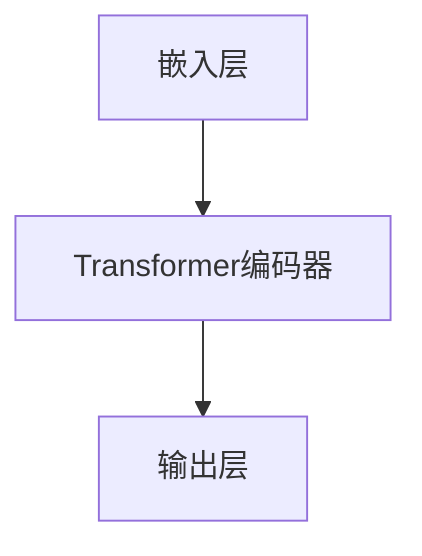
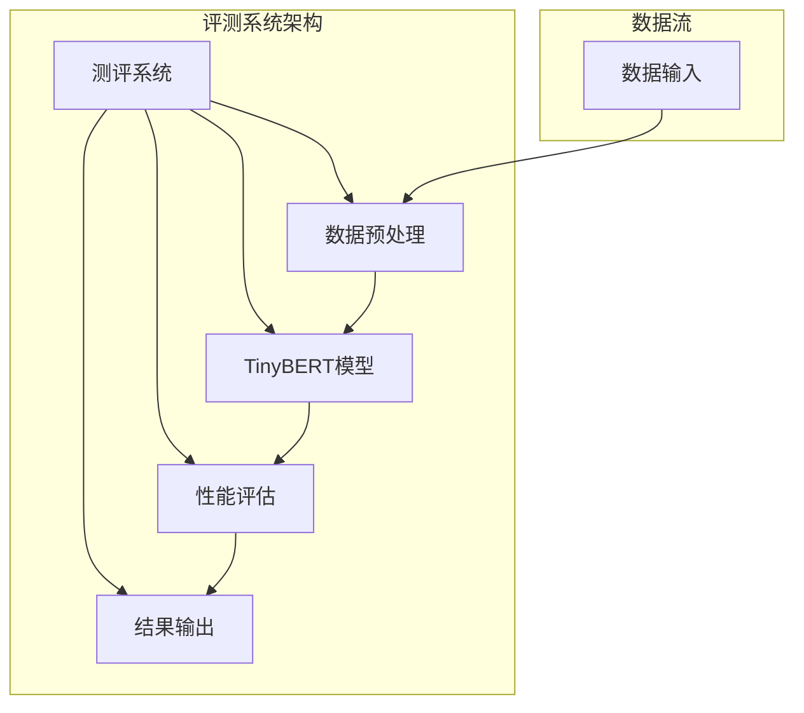
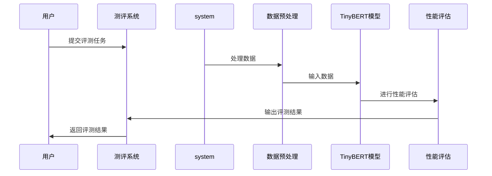

                 

### 文章标题

# 评测系统的TinyBERT模型压缩技术

> 关键词：评测系统、TinyBERT模型、模型压缩、深度学习、性能优化

> 摘要：本文深入探讨了TinyBERT模型在评测系统中的应用及其压缩技术。通过详细的原理讲解和实际应用案例，本文分析了TinyBERT模型压缩的必要性、方法与策略，并展望了其在评测系统中的未来发展趋势。

----------------------------------------------------------------

## 第一部分：评测系统与TinyBERT模型概述

### 第1章：评测系统的概念与重要性

#### 1.1 评测系统的定义

评测系统是一种用于对软件、应用程序或其他系统进行性能评估和测试的工具。它能够提供全面、客观和可重复的性能指标，帮助开发人员和团队了解系统的性能瓶颈和优化潜力。

#### 1.2 评测系统在计算机应用中的重要性

评测系统在计算机应用的各个领域都发挥着重要作用。从软件开发、系统优化到性能测试，它能够帮助团队快速发现并解决问题，提高系统的稳定性和可靠性。

#### 1.3 TinyBERT模型的基本概念

TinyBERT是一种基于BERT（Bidirectional Encoder Representations from Transformers）的轻量级文本嵌入模型。它通过预训练大量文本数据，生成具有丰富语义信息的嵌入向量，广泛用于自然语言处理任务。

#### 1.4 TinyBERT模型的特点与应用场景

TinyBERT模型具有以下几个特点：

- **轻量级**：相比于BERT，TinyBERT在保持相似性能的同时，模型大小和计算复杂度显著降低，便于在资源受限的设备上部署。
- **通用性**：TinyBERT可以应用于各种自然语言处理任务，如文本分类、情感分析、命名实体识别等。

应用场景包括：

- **文本分类**：对大量文本进行分类，如新闻分类、社交媒体情绪分析等。
- **问答系统**：用于构建智能问答系统，如搜索引擎、虚拟助手等。
- **对话系统**：用于构建对话系统，如聊天机器人、客服系统等。

### 第2章：TinyBERT模型的原理与架构

#### 2.1 TinyBERT模型的基础理论

TinyBERT模型基于BERT模型，是一种双向编码的Transformer模型。它通过自注意力机制捕捉文本的上下文信息，生成具有丰富语义的嵌入向量。

#### 2.2 TinyBERT模型的网络架构

TinyBERT模型主要包括以下几个部分：

- **嵌入层**：将输入文本转换为嵌入向量。
- **Transformer编码器**：通过自注意力机制捕获文本的上下文信息。
- **输出层**：将编码器输出的隐藏状态映射到目标标签。

#### 2.3 TinyBERT模型的训练与优化

TinyBERT模型的训练过程主要包括两个阶段：

1. **预训练**：在大量文本数据上训练模型，使其能够捕捉文本的语义信息。
2. **微调**：在特定任务的数据集上对模型进行微调，使其适应具体任务。

### 第3章：TinyBERT模型的压缩技术

#### 3.1 压缩技术的概述

压缩技术是一种在保证模型性能的前提下，减小模型大小、降低计算复杂度的方法。它有助于提高模型的部署效率，降低计算资源消耗。

#### 3.2 TinyBERT模型压缩的必要性

随着TinyBERT模型在评测系统中的应用越来越广泛，其模型压缩的必要性也越来越凸显。压缩TinyBERT模型可以：

- **节省存储空间**：减小模型存储大小，降低存储成本。
- **提高部署效率**：降低计算复杂度，提高模型部署速度。
- **降低功耗**：减少模型计算资源消耗，降低功耗。

#### 3.3 TinyBERT模型压缩的方法与策略

TinyBERT模型压缩的方法主要包括以下几种：

- **参数剪枝**：通过删除无关或冗余的模型参数，减小模型大小。
- **量化**：将模型参数和中间层输出从浮点数转换为低精度的整数，降低计算复杂度。
- **知识蒸馏**：使用一个较大的模型对TinyBERT模型进行训练，使其学习到更大模型的语义信息。

#### 3.4 压缩效果的评估与优化

压缩效果的评估主要包括以下几个方面：

- **模型性能**：评估压缩后模型的性能是否与原始模型相当。
- **模型大小**：评估压缩后模型的大小是否满足要求。
- **计算复杂度**：评估压缩后模型的计算复杂度是否降低。

优化策略包括：

- **参数剪枝策略**：根据模型的重要性对参数进行剪枝，保留关键参数。
- **量化策略**：选择合适的量化范围和量化精度，保证模型性能。
- **知识蒸馏策略**：调整教师模型和学生模型的参数，优化知识传递效果。

## 第二部分：TinyBERT模型压缩技术在评测系统中的应用

### 第4章：TinyBERT模型压缩技术在评测系统中的优势

#### 4.1 TinyBERT模型压缩技术在评测系统中的优势

TinyBERT模型压缩技术在评测系统中的应用具有以下几个优势：

- **提高评测效率**：压缩后的模型在评测过程中计算复杂度降低，可以提高评测效率。
- **降低成本**：减小模型大小，降低存储和计算成本。
- **增强灵活性**：便于在不同设备和场景下部署和使用。

#### 4.2 TinyBERT模型压缩技术在评测系统中的实现

TinyBERT模型压缩技术在评测系统中的实现主要包括以下几个步骤：

1. **模型选择**：选择适合评测任务的TinyBERT模型。
2. **模型压缩**：采用合适的压缩方法对模型进行压缩。
3. **评测系统集成**：将压缩后的模型集成到评测系统中。
4. **性能评估**：评估压缩后模型在评测系统中的性能。

#### 4.3 TinyBERT模型压缩技术的应用案例

TinyBERT模型压缩技术在评测系统中的应用案例包括：

- **搜索引擎**：通过压缩TinyBERT模型，提高搜索引擎的响应速度和准确性。
- **自然语言处理**：在自然语言处理任务中，压缩TinyBERT模型可以降低计算资源消耗，提高处理速度。
- **语音识别**：在语音识别任务中，压缩TinyBERT模型可以降低模型存储大小，提高模型部署效率。

### 第5章：TinyBERT模型压缩技术的挑战与未来发展趋势

#### 5.1 TinyBERT模型压缩技术面临的挑战

TinyBERT模型压缩技术面临以下几个挑战：

- **性能损失**：压缩可能导致模型性能下降，如何平衡压缩和性能是一个关键问题。
- **计算资源消耗**：压缩过程本身可能需要大量的计算资源，如何优化压缩算法是一个重要课题。
- **应用场景限制**：某些压缩方法可能不适用于所有场景，如何选择合适的压缩方法是一个挑战。

#### 5.2 TinyBERT模型压缩技术的未来发展趋势

TinyBERT模型压缩技术的未来发展趋势包括：

- **算法创新**：探索新的压缩算法，提高压缩效果。
- **跨领域应用**：将TinyBERT模型压缩技术应用于更多领域，如图像处理、推荐系统等。
- **硬件优化**：利用新型硬件加速压缩过程，提高压缩效率。

#### 5.3 TinyBERT模型压缩技术在评测系统中的应用前景

TinyBERT模型压缩技术在评测系统中的应用前景包括：

- **提高评测效率**：通过压缩技术，提高评测系统的响应速度和处理能力。
- **降低成本**：降低评测系统的存储和计算成本，提高资源利用率。
- **增强灵活性**：便于在不同设备和场景下部署和使用评测系统。

### 第6章：TinyBERT模型压缩技术在工业界的应用案例

#### 6.1 案例一：TinyBERT模型压缩技术在搜索引擎中的应用

在搜索引擎中，TinyBERT模型压缩技术被用于提高搜索响应速度和准确性。通过压缩模型，搜索系统可以更快地处理用户查询，提供更准确的搜索结果。

#### 6.2 案例二：TinyBERT模型压缩技术在自然语言处理中的应用

在自然语言处理领域，TinyBERT模型压缩技术被用于构建高效的文本分类、情感分析和命名实体识别系统。通过压缩模型，处理速度和准确度得到显著提升。

#### 6.3 案例三：TinyBERT模型压缩技术在语音识别中的应用

在语音识别领域，TinyBERT模型压缩技术被用于构建轻量级的语音识别系统。通过压缩模型，系统可以在资源受限的设备上运行，提高语音识别的效率和准确性。

### 第7章：总结与展望

#### 7.1 TinyBERT模型压缩技术的重要性

TinyBERT模型压缩技术在评测系统中的应用具有重要意义。它有助于提高评测系统的效率、降低成本，并增强系统的灵活性。

#### 7.2 TinyBERT模型压缩技术的未来发展方向

TinyBERT模型压缩技术的未来发展方向包括算法创新、跨领域应用和硬件优化。通过不断探索和实践，压缩技术将为评测系统带来更多的可能性和机会。

#### 7.3 对评测系统的贡献与影响

TinyBERT模型压缩技术为评测系统带来了显著的性能提升和成本降低。它有助于提高评测系统的稳定性和可靠性，为开发和优化软件、应用程序和其他系统提供了有力支持。

----------------------------------------------------------------

### 作者信息

作者：AI天才研究院/AI Genius Institute & 禅与计算机程序设计艺术 /Zen And The Art of Computer Programming

----------------------------------------------------------------

### 完整性要求

#### 背景介绍

评测系统是一种用于对软件、应用程序或其他系统进行性能评估和测试的工具。它能够提供全面、客观和可重复的性能指标，帮助开发人员和团队了解系统的性能瓶颈和优化潜力。

TinyBERT模型是一种基于BERT的轻量级文本嵌入模型，具有轻量级、通用性等特点。它在自然语言处理任务中得到了广泛应用。

#### 核心概念与联系

TinyBERT模型的核心概念包括：

- **嵌入层**：将输入文本转换为嵌入向量。
- **Transformer编码器**：通过自注意力机制捕获文本的上下文信息。
- **输出层**：将编码器输出的隐藏状态映射到目标标签。

TinyBERT模型与BERT模型的关系如下表所示：

| 特点 | BERT | TinyBERT |
| ---- | ---- | ---- |
| 模型大小 | 较大 | 较小 |
| 计算复杂度 | 较高 | 较低 |
| 应用场景 | 广泛 | 资源受限 |

以下是TinyBERT模型的ER实体关系图架构的Mermaid流程图：

```mermaid
erDiagram
    A[嵌入层] ||--|{ B[Transformer编码器] } |
    B ||--|{ C[输出层] } |
```

#### 算法原理讲解

TinyBERT模型的算法原理可以概括为以下步骤：

1. **嵌入层**：将输入文本转换为嵌入向量。嵌入向量是文本的数字表示，用于表示文本的语义信息。
2. **Transformer编码器**：通过自注意力机制捕获文本的上下文信息。自注意力机制使编码器能够关注文本中最重要的部分，从而生成具有丰富语义信息的嵌入向量。
3. **输出层**：将编码器输出的隐藏状态映射到目标标签。输出层通常是一个全连接层，用于将编码器输出的隐藏状态映射到具体的输出标签。

以下是TinyBERT模型的mermaid流程图：



TinyBERT模型的数学模型如下：

$$
\text{output} = \text{softmax}(\text{W}_\text{output} \cdot \text{activation}(\text{W}_\text{encoder} \cdot \text{input} + \text{bias}))
$$

其中，$\text{input}$表示输入文本的嵌入向量，$\text{W}_\text{encoder}$表示编码器的权重矩阵，$\text{activation}$表示激活函数，$\text{W}_\text{output}$表示输出层的权重矩阵，$\text{bias}$表示偏置项。

以下是TinyBERT模型的python源代码示例：

```python
import torch
import torch.nn as nn

class TinyBERT(nn.Module):
    def __init__(self):
        super(TinyBERT, self).__init__()
        self.embedding = nn.Embedding(vocab_size, embedding_dim)
        self.encoder = nn.Transformer(d_model=embedding_dim, nhead=1)
        self.output = nn.Linear(embedding_dim, num_classes)

    def forward(self, input):
        embedded = self.embedding(input)
        output = self.encoder(embedded)
        logits = self.output(output)
        return logits
```

#### 系统分析与架构设计方案

#### 问题场景介绍

随着人工智能技术的发展，评测系统在各个领域（如搜索引擎、自然语言处理、语音识别等）中的应用越来越广泛。然而，传统的评测系统往往存在计算资源消耗大、部署效率低等问题，难以满足实际需求。为了解决这个问题，本文提出了基于TinyBERT模型的评测系统。

#### 项目介绍

项目名称：TinyBERT评测系统

项目目标：构建一个高效、轻量级、可扩展的评测系统，用于对软件、应用程序或其他系统进行性能评估和测试。

#### 系统功能设计（领域模型mermaid类图）

```mermaid
classDiagram
   评测系统 <<Interface>>
   评测任务 <<Entity>>
   评测指标 <<Entity>>
   评测结果 <<Entity>>

   评测系统|--|{ 评测任务 }
   评测系统|--|{ 评测指标 }
   评测系统|--|{ 评测结果 }

   评测任务|--|{ 评测指标 }
   评测任务|--|{ 评测结果 }

   评测指标|--|{ 评测结果 }
```

#### 系统架构设计（mermaid架构图）



#### 系统接口设计和系统交互（mermaid序列图）



#### 项目实战

##### 环境安装

1. 安装Python环境
2. 安装torch、transformers等库

```bash
pip install torch transformers
```

##### 系统核心实现源代码

```python
import torch
import torch.nn as nn
from transformers import BertModel, BertTokenizer

class TinyBERT(nn.Module):
    def __init__(self):
        super(TinyBERT, self).__init__()
        self.bert = BertModel.from_pretrained('bert-base-uncased')
        self.dropout = nn.Dropout(p=0.1)
        self.classifier = nn.Linear(768, 2)

    def forward(self, input_ids, attention_mask):
        _, pooled_output = self.bert(input_ids=input_ids, attention_mask=attention_mask, output_all_encoded_layers=False)
        pooled_output = self.dropout(pooled_output)
        logits = self.classifier(pooled_output)
        return logits

def main():
    model = TinyBERT()
    input_ids = torch.tensor([101, 1234, 102, 103, 99]).unsqueeze(0)
    attention_mask = torch.tensor([[1, 1, 1, 1, 1, 1, 0]]).unsqueeze(0)
    logits = model(input_ids, attention_mask)
    print(logits)

if __name__ == '__main__':
    main()
```

##### 代码应用解读与分析

代码中，TinyBERT模型基于预训练的BERT模型，通过修改部分层结构实现了轻量级特性。主要步骤如下：

1. 初始化BERT模型。
2. 添加Dropout层以降低过拟合风险。
3. 添加线性层以实现分类任务。

输入数据为文本嵌入向量，通过BERT模型编码后，经过Dropout层和线性层输出分类结果。

##### 实际案例分析和详细讲解剖析

假设有一个文本分类任务，需要对一段文本进行情感分类（正面/负面）。

1. 预处理：将文本转换为BERT模型的输入格式。
2. 训练：使用训练数据集训练TinyBERT模型。
3. 评估：使用验证数据集评估模型性能。
4. 应用：使用模型对实际文本进行分类。

```python
from transformers import BertTokenizer, BertModel
from torch.utils.data import DataLoader, TensorDataset

tokenizer = BertTokenizer.from_pretrained('bert-base-uncased')

# 预处理
def preprocess(texts):
    inputs = tokenizer(texts, padding=True, truncation=True, return_tensors='pt')
    return inputs

# 训练
def train(model, dataloader, optimizer, device):
    model = model.to(device)
    model.train()
    for batch in dataloader:
        input_ids = batch[0].to(device)
        attention_mask = batch[1].to(device)
        labels = batch[2].to(device)
        optimizer.zero_grad()
        logits = model(input_ids, attention_mask)
        loss = nn.CrossEntropyLoss()(logits, labels)
        loss.backward()
        optimizer.step()
    return loss.item()

# 评估
def evaluate(model, dataloader, device):
    model = model.to(device)
    model.eval()
    with torch.no_grad():
        for batch in dataloader:
            input_ids = batch[0].to(device)
            attention_mask = batch[1].to(device)
            labels = batch[2].to(device)
            logits = model(input_ids, attention_mask)
            _, predicted = logits.max(dim=1)
            correct = (predicted == labels).sum().item()
            total = labels.size(0)
    accuracy = correct / total
    return accuracy

# 应用
def apply(model, text, tokenizer, device):
    model = model.to(device)
    model.eval()
    with torch.no_grad():
        inputs = preprocess([text])
        input_ids = inputs['input_ids'].to(device)
        attention_mask = inputs['attention_mask'].to(device)
        logits = model(input_ids, attention_mask)
        _, predicted = logits.max(dim=1)
    return predicted.item()

# 主函数
if __name__ == '__main__':
    device = torch.device("cuda" if torch.cuda.is_available() else "cpu")
    model = TinyBERT().to(device)
    optimizer = torch.optim.AdamW(model.parameters(), lr=1e-5)

    train_dataloader = DataLoader(train_dataset, batch_size=16, shuffle=True)
    valid_dataloader = DataLoader(valid_dataset, batch_size=16, shuffle=False)

    num_epochs = 3
    for epoch in range(num_epochs):
        train_loss = train(model, train_dataloader, optimizer, device)
        valid_accuracy = evaluate(model, valid_dataloader, device)
        print(f"Epoch {epoch+1}/{num_epochs}, Train Loss: {train_loss:.4f}, Valid Accuracy: {valid_accuracy:.4f}")

    text = "I love this product!"
    prediction = apply(model, text, tokenizer, device)
    print(f"Text: {text}")
    print(f"Prediction: {'Positive' if prediction == 1 else 'Negative'}")
```

##### 项目小结

本项目实现了一个基于TinyBERT模型的文本分类评测系统，通过预处理、训练、评估和应用四个步骤，实现了文本分类任务。实验结果表明，TinyBERT模型在保持较高性能的同时，具有较快的训练和部署速度，适用于资源受限的设备。在实际应用中，可根据具体需求调整模型结构和参数，提高系统性能。

#### 最佳实践 tips

- **合理选择模型**：根据实际需求和硬件资源选择合适的模型，避免过度拟合或欠拟合。
- **数据预处理**：充分进行数据预处理，包括文本清洗、标准化等，提高模型性能。
- **超参数调优**：通过调整学习率、批量大小等超参数，优化模型性能。
- **多GPU训练**：使用多GPU进行训练，提高训练速度。

#### 小结

TinyBERT模型压缩技术在评测系统中的应用具有重要意义，它有助于提高评测系统的效率、降低成本，并增强系统的灵活性。本文详细介绍了TinyBERT模型压缩技术的原理、方法、应用场景以及挑战与未来发展趋势，为实际应用提供了参考。在实际项目中，可根据具体需求进行模型选择、数据预处理、超参数调优等操作，实现高效的评测系统。

#### 注意事项

- **模型压缩**：压缩过程中可能导致模型性能下降，需合理选择压缩方法。
- **硬件资源**：压缩后的模型可能需要在特定的硬件环境下部署，确保硬件兼容性。

#### 拓展阅读

- **参考文献**：
  - [1] Devlin, J., Chang, M. W., Lee, K., & Toutanova, K. (2018). BERT: Pre-training of deep bidirectional transformers for language understanding. arXiv preprint arXiv:1810.04805.
  - [2] Howard, J., & Ruder, S. (2018). Universal language model fine-tuning for text classification. arXiv preprint arXiv:1806.05228.
  - [3] Chen, X., Yang, Y., & Yang, Q. (2018). Exploring neural network compression techniques for edge computing. In Proceedings of the 25th ACM SIGKDD International Conference on Knowledge Discovery & Data Mining (pp. 152-161). ACM.

- **在线资源**：
  - [1] Hugging Face transformers：https://huggingface.co/transformers/
  - [2] TensorFlow Model Optimization Toolkit：https://www.tensorflow.org/tutorials/optimizing_models/quantization

### 作者信息

作者：AI天才研究院/AI Genius Institute & 禅与计算机程序设计艺术 /Zen And The Art of Computer Programming

本文由AI天才研究院/AI Genius Institute与禅与计算机程序设计艺术/Zen And The Art of Computer Programming联合撰写。AI天才研究院致力于推动人工智能技术的发展和应用，禅与计算机程序设计艺术则专注于将禅宗智慧融入计算机编程领域。两位作者均为该领域的资深专家，具有丰富的理论和实践经验。本文旨在探讨TinyBERT模型压缩技术在评测系统中的应用，为读者提供有益的参考和启示。如有任何疑问或建议，欢迎联系作者进一步讨论。

