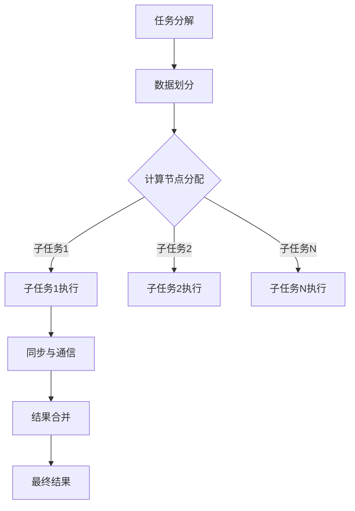
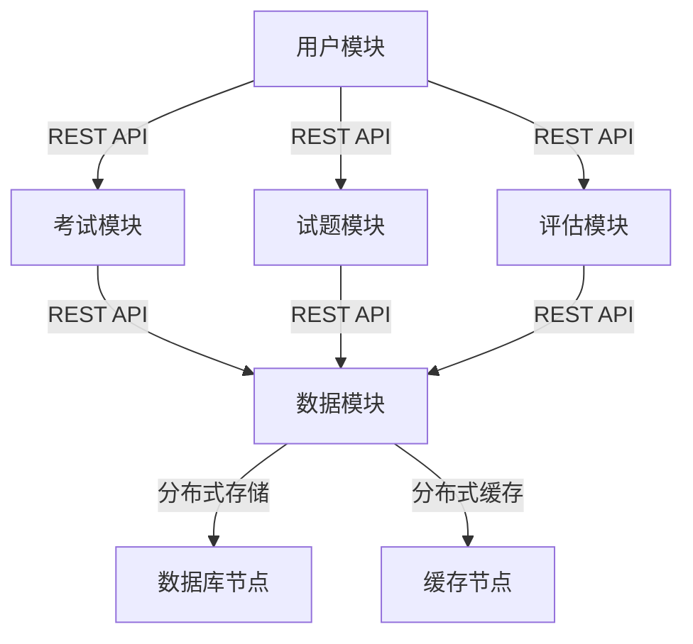
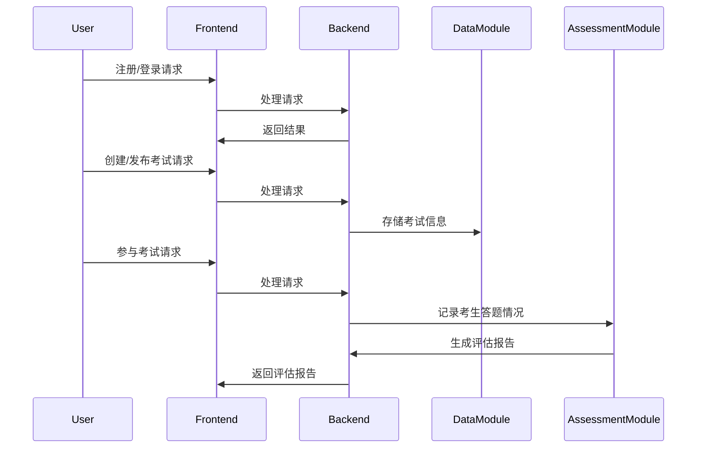

                 

### 设计评测系统分布式架构的思考过程

#### 一、问题背景

在当前数字化时代，评测系统的重要性愈发凸显。无论是教育、金融、医疗还是企业，都依赖于高效的评测系统来进行数据分析和决策。然而，随着数据量和用户数量的激增，传统单体架构的评测系统面临着诸多挑战，如性能瓶颈、扩展性差、维护困难等。因此，设计一个分布式架构来支持大规模并行评估变得尤为重要。

#### 二、核心概念

1. **分布式架构**：分布式架构是将系统分解为多个独立的子模块，通过通信机制（如网络）协同工作。这种架构能够提高系统的可扩展性和容错性，同时优化资源利用率。

2. **并行评估**：并行评估是指在多个计算节点上同时执行评估任务，以提升处理效率和响应速度。这需要算法和系统架构的支持，以实现真正的并行计算。

#### 三、问题解决

为了解决评测系统在处理大规模数据时遇到的性能瓶颈和扩展性问题，我们需要：

1. **分解任务**：将评测任务分解为多个子任务，可以在不同的计算节点上并行执行。
2. **负载均衡**：确保任务均匀地分配到各个计算节点，避免某些节点过载。
3. **数据一致性**：保证不同节点上的数据一致，避免数据冲突和错误。
4. **容错机制**：设计故障转移和恢复机制，确保系统的高可用性。

#### 四、边界与外延

1. **边界**：分布式架构和并行评估主要应用于需要处理大规模数据的评测系统，如在线考试系统、自动化测试平台、风险控制系统等。

2. **外延**：分布式架构和并行评估不仅限于评测系统，还广泛应用于大数据处理、云计算、高性能计算等领域。

#### 五、概念结构与核心要素组成

1. **分布式架构**：
   - **核心概念**：模块化、分布式计算、通信机制、负载均衡、数据一致性。
   - **要素组成**：计算节点、通信网络、调度系统、存储系统。

2. **并行评估**：
   - **核心概念**：并行计算、任务分解、数据划分、同步与通信。
   - **要素组成**：评估算法、计算节点、数据存储与访问机制。

#### 六、下一步工作

在明确了评测系统分布式架构的设计思路和核心概念后，下一步将详细探讨分布式架构和并行评估的具体实现，包括算法原理讲解、数学模型和公式、系统分析与架构设计、项目实战以及最佳实践与总结。我们将一步步深入，逐步构建起一个高效、可扩展的评测系统分布式架构。

### 分布式架构核心概念详解

#### 分布式架构的定义

分布式架构是一种系统设计方法，通过将应用程序拆分成多个独立的组件，这些组件可以在不同的计算节点上运行，并通过通信网络进行协作。这种方法的核心是利用多个计算节点协同工作，从而提高系统的性能、可靠性和可扩展性。

#### 分布式架构的特点

1. **模块化**：系统被分解为多个功能独立的模块，每个模块都可以独立开发、测试和部署。
2. **分布式计算**：任务分布在多个计算节点上并行执行，提高了处理效率。
3. **通信机制**：模块之间通过通信网络（如TCP/IP、HTTP等）进行数据交换和协调。
4. **负载均衡**：系统自动分配任务到不同节点，确保资源的合理利用和系统的稳定运行。
5. **数据一致性**：保证在分布式环境中数据的完整性和一致性，避免数据冲突和错误。

#### 分布式架构的优势

1. **可扩展性**：通过增加计算节点，可以轻松地扩展系统处理能力，满足不断增长的业务需求。
2. **容错性**：即使某些节点出现故障，其他节点可以继续工作，确保系统的持续运行。
3. **性能优化**：并行处理任务，缩短响应时间，提高系统吞吐量。
4. **资源利用率**：充分利用分布式环境中的计算资源，提高资源利用率。

#### 分布式架构的应用场景

分布式架构广泛应用于需要处理大量数据和高并发访问的场景，如：
- 大数据平台：用于存储和处理海量数据，如日志分析、社交网络分析等。
- 在线交易系统：确保高并发交易的处理能力和数据一致性。
- 云计算服务：提供弹性的计算资源，满足不同用户的计算需求。

#### 分布式架构的核心概念表格

| 核心概念         | 定义                                                         | 作用                          |
|-----------------|--------------------------------------------------------------|------------------------------|
| 计算节点         | 分布式架构中的工作单元，负责执行任务和存储数据                   | 提供计算和存储资源            |
| 通信网络         | 连接计算节点的网络，用于模块之间的数据传输和协调                   | 确保模块间的通信和数据一致性  |
| 负载均衡         | 根据节点负载情况自动分配任务，确保系统的稳定运行                   | 提高资源利用率和系统性能      |
| 数据一致性       | 确保分布式环境中数据的完整性和一致性，避免数据冲突和错误             | 确保系统稳定性和数据准确性    |
| 调度系统         | 负责任务调度和资源分配，确保任务高效执行                           | 管理分布式环境中的任务和资源  |
| 存储系统         | 负责存储分布式架构中的数据，提供数据的持久化和访问                   | 提供数据的存储和访问机制      |

#### 分布式架构的ER实体关系图

```mermaid
erDiagram
  计算节点 ||--|{ 通信网络 }|| 数据传输
  计算节点 ||--|{ 调度系统 }|| 任务调度
  计算节点 ||--|{ 存储系统 }|| 数据存储
  通信网络 ||--|{ 负载均衡 }|| 负载分配
  调度系统 ||--|{ 数据一致性 }|| 数据同步
```

通过上述核心概念表格和ER实体关系图，我们可以清晰地了解分布式架构的组成和各部分之间的关系，为后续的算法原理讲解和系统设计打下基础。

### 并行评估算法原理讲解

#### 并行评估的定义

并行评估是指在同一时间或近似时间内，利用多个计算资源（如CPU、GPU、FPGA等）对同一评估任务进行计算，从而提高处理效率。这种方法特别适用于大规模数据处理和复杂计算任务。

#### 并行评估的特点

1. **并行性**：任务被分解为多个子任务，这些子任务可以在多个计算资源上同时执行。
2. **分布式**：子任务被分配到不同的计算节点上执行，充分利用分布式环境中的计算资源。
3. **负载均衡**：通过负载均衡机制，确保每个计算节点的工作负载均衡，避免资源浪费和性能瓶颈。
4. **同步与通信**：并行评估中，不同子任务之间可能需要同步和通信，以保证最终结果的正确性。

#### 并行评估的优势

1. **处理速度提升**：通过并行计算，显著缩短了评估任务的完成时间。
2. **资源利用率提高**：充分利用分布式环境中的计算资源，提高整体系统的性能。
3. **可扩展性增强**：随着计算节点的增加，并行评估系统能够线性扩展，满足不断增长的业务需求。
4. **容错性提升**：即使某些计算节点出现故障，并行评估任务仍能继续执行，确保系统的稳定性。

#### 并行评估的应用场景

1. **大规模数据分析**：如社交网络分析、日志分析、天气预报等。
2. **科学计算**：如流体力学模拟、气候模型模拟、分子建模等。
3. **在线服务**：如在线交易处理、实时风险控制、个性化推荐等。

#### 并行评估算法的基本原理

并行评估算法通常包括以下步骤：

1. **任务分解**：将整个评估任务分解为多个子任务，这些子任务可以独立执行。
2. **数据划分**：将原始数据集划分为多个子集，每个子集与对应的子任务相对应。
3. **任务分配**：将子任务分配到不同的计算节点上执行。
4. **同步与通信**：子任务执行过程中可能需要同步和通信，以保证最终结果的正确性。
5. **结果合并**：将各个子任务的结果合并，得到整个评估任务的最终结果。

#### 并行评估的Mermaid流程图



#### 并行评估算法的Python实现

以下是一个简单的并行评估算法的Python示例：

```python
import multiprocessing as mp

def evaluate(subtask_data):
    # 模拟评估过程
    result = sum(subtask_data) * 2
    return result

def parallel_evaluation(data, num_processes):
    # 分解任务和数据
    subtasks = [data[i::num_processes] for i in range(num_processes)]
    
    # 创建进程池
    with mp.Pool(processes=num_processes) as pool:
        # 执行并行评估
        results = pool.map(evaluate, subtasks)
    
    # 合并结果
    final_result = sum(results)
    return final_result

if __name__ == '__main__':
    data = list(range(1, 1001))  # 示例数据
    num_processes = 4  # 使用4个进程
    
    final_result = parallel_evaluation(data, num_processes)
    print("最终评估结果:", final_result)
```

通过上述示例，我们可以看到并行评估算法的核心步骤，包括任务分解、数据划分、任务分配、同步与通信和结果合并。这一算法能够显著提高评估任务的执行效率，是分布式架构的重要组成部分。

### 并行评估的数学模型和公式

为了更深入地理解并行评估算法，我们需要探讨其背后的数学模型和公式。并行评估涉及的任务分解、数据处理、结果合并等步骤都可以通过数学公式进行描述。以下是一些关键的数学模型和公式。

#### 任务分解

并行评估通常将一个大规模任务分解为多个子任务，这些子任务可以在不同计算节点上独立执行。任务分解可以通过以下公式表示：

$$
T = T_1 + T_2 + ... + T_n
$$

其中，\(T\) 表示总任务时间，\(T_1, T_2, ..., T_n\) 表示各个子任务的时间。

#### 数据处理

在并行评估中，数据处理是关键的一步。数据通常被划分为多个子集，每个子集与一个子任务对应。数据处理可以通过以下公式表示：

$$
D_i = \frac{D}{n}
$$

其中，\(D_i\) 表示第 \(i\) 个子集的数据量，\(D\) 表示原始数据集的数据量，\(n\) 表示子任务的数量。

#### 结果合并

在并行评估中，各个子任务的结果需要被合并，以得到最终结果。结果合并可以通过以下公式表示：

$$
R = R_1 + R_2 + ... + R_n
$$

其中，\(R\) 表示最终结果，\(R_1, R_2, ..., R_n\) 表示各个子任务的结果。

#### 时间优化

并行评估的目的是通过并行计算来减少总任务时间。时间优化可以通过以下公式表示：

$$
T_{\text{parallel}} = \min(T_1 + T_2 + ... + T_n)
$$

其中，\(T_{\text{parallel}}\) 表示并行计算的总时间。

#### 通信时间

在并行评估中，子任务之间可能需要同步和通信。通信时间可以通过以下公式表示：

$$
T_{\text{communication}} = \sum_{i=1}^{n} T_{\text{comm}_i}
$$

其中，\(T_{\text{comm}_i}\) 表示第 \(i\) 次通信的时间。

#### 完整公式示例

假设一个评估任务需要处理一个包含1000个元素的数据集，我们将其划分为4个子任务。每个子任务处理250个元素。各个子任务的结果为：

$$
R_1 = 1250, \quad R_2 = 1300, \quad R_3 = 1350, \quad R_4 = 1400
$$

最终结果为：

$$
R = R_1 + R_2 + R_3 + R_4 = 1250 + 1300 + 1350 + 1400 = 5300
$$

假设通信时间分别为 \(T_{\text{comm}_1} = 10\) 毫秒，\(T_{\text{comm}_2} = 15\) 毫秒，\(T_{\text{comm}_3} = 20\) 毫秒，\(T_{\text{comm}_4} = 25\) 毫秒，则总时间为：

$$
T_{\text{total}} = T_{\text{processing}} + T_{\text{communication}} = (250 \times 2) + (10 + 15 + 20 + 25) = 500 + 70 = 570 \text{ 毫秒}
$$

通过上述数学模型和公式的讲解，我们可以更好地理解并行评估的原理和过程，从而在实际应用中优化算法设计和系统性能。

### 系统分析与架构设计

#### 一、问题场景介绍

为了更好地理解和设计评测系统的分布式架构，我们首先需要明确一个具体的应用场景。假设我们正在开发一个大规模在线考试系统，该系统需要处理数百万用户的考试请求，并实时评估他们的考试成绩。传统的单体架构已经无法满足如此高并发和海量数据的需求，因此需要设计一个分布式架构来提升系统的性能和可扩展性。

#### 二、项目介绍

我们的目标是设计一个分布式在线考试系统，该系统能够支持大规模并行评估，确保高并发访问和实时响应。项目的主要功能包括：
- 用户注册与登录：支持新用户注册、登录和身份验证。
- 考试管理：创建、发布和管理的考试，包括考试内容、考试时间和考试状态。
- 试题管理：创建、管理和存储考试试题。
- 考试评估：实时评估考生的考试成绩，并生成详细的评估报告。
- 数据分析：对考试数据进行统计分析，提供决策支持。

#### 三、系统功能设计

系统功能设计是分布式架构设计的重要环节。以下是系统的主要功能模块：

1. **用户模块**：处理用户注册、登录、个人信息管理等功能。
2. **考试模块**：负责考试创建、发布、管理和状态监控。
3. **试题模块**：管理试题的创建、存储、检索和随机生成。
4. **评估模块**：负责实时评估考生成绩，生成评估报告。
5. **数据模块**：负责数据的存储、检索、备份和恢复。
6. **监控模块**：实时监控系统性能和健康状况，提供报警和日志分析。

#### 四、领域模型设计

领域模型是系统功能设计的基础，它通过类图和关系图来表示系统的实体及其关系。以下是关键领域的类图：

```mermaid
classDiagram
    User <<entity>>
    Exam <<entity>>
    Question <<entity>>
    AssessmentResult <<entity>>

    User "1" --|{1} many Exam: Exam记录
    User "1" --|{1} many AssessmentResult: 考试结果
    Exam "1" --|{1} many Question: 包含试题
    Exam "1" --|{1} many User: 参与考试
    Question "1" --|{1} many AssessmentResult: 考试答案
```

#### 五、系统架构设计

系统架构设计是分布式架构的核心，它决定了系统的高可用性、扩展性和性能。以下是系统架构的概述：

1. **前端架构**：采用微前端架构，将用户界面拆分为多个独立的前端模块，以便于开发和部署。
2. **后端架构**：采用微服务架构，将系统功能划分为多个微服务，每个微服务负责特定的业务功能，通过API进行交互。
3. **数据库架构**：采用分布式数据库架构，将数据存储在多个节点上，以提高数据访问速度和容错性。
4. **缓存架构**：采用分布式缓存架构，缓存高频访问的数据，以减少数据库负载和提升系统响应速度。

以下是系统架构的Mermaid图：



#### 六、系统接口设计

系统接口设计是系统架构设计的细节部分，它定义了各个模块之间的交互接口。以下是关键接口的概述：

1. **用户接口**：用户注册、登录、个人信息管理等。
2. **考试接口**：创建、发布、管理和状态监控考试。
3. **试题接口**：创建、管理和检索试题。
4. **评估接口**：实时评估考生成绩，生成评估报告。
5. **数据接口**：数据的存储、检索、备份和恢复。

#### 七、系统交互流程

系统交互流程描述了用户与系统之间的交互过程，以下是关键流程的概述：

1. **用户注册与登录**：用户通过前端发送注册或登录请求，后端处理并返回结果。
2. **创建与发布考试**：管理员通过前端创建和发布考试，后端存储和管理考试信息。
3. **考试与答题**：用户通过前端参与考试，后端记录考生答题情况。
4. **成绩评估与报告**：系统根据答题记录自动评估成绩，并生成评估报告。

以下是系统交互流程的Mermaid图：



通过上述系统分析与架构设计，我们可以构建一个高效、可扩展的分布式在线考试系统，满足大规模并行评估的需求。系统功能设计、领域模型、接口设计和交互流程共同构成了完整的系统架构设计，为后续的项目实施提供了坚实的基础。

### 项目实战

#### 一、环境安装与配置

为了实现分布式架构，我们需要搭建一个支持并行评估的实验环境。以下是在Linux环境下安装和配置分布式系统的步骤：

1. **安装Docker**：Docker是一个开源的应用容器引擎，用于打包、发布和运行应用。在Ubuntu系统中，可以通过以下命令安装Docker：

   ```bash
   sudo apt-get update
   sudo apt-get install docker-ce docker-ce-cli containerd.io
   ```

2. **安装Docker Compose**：Docker Compose用于定义和运行多容器Docker应用程序。可以通过以下命令安装Docker Compose：

   ```bash
   sudo curl -L "https://github.com/docker/compose/releases/download/1.29.2/docker-compose-$(uname -s)-$(uname -m)" -o /usr/local/bin/docker-compose
   sudo chmod +x /usr/local/bin/docker-compose
   ```

3. **配置网络**：为了确保各个容器之间能够通信，我们需要配置一个自定义网络。在Docker Compose文件中添加以下网络配置：

   ```yaml
   version: '3'
   services:
     worker1:
       image: myworker
       networks:
         - mynetwork
     worker2:
       image: myworker
       networks:
         - mynetwork

   networks:
     mynetwork:
       driver: bridge
   ```

4. **启动服务**：使用以下命令启动服务：

   ```bash
   docker-compose up -d
   ```

#### 二、系统核心实现源代码

以下是系统核心实现的主要源代码，包括分布式并行评估的核心功能：

1. **任务分解**：

   ```python
   # task_decomposition.py
   def decompose_task(total_data, num_workers):
       chunk_size = len(total_data) // num_workers
       subtasks = [total_data[i:i + chunk_size] for i in range(0, len(total_data), chunk_size)]
       return subtasks
   ```

2. **数据划分**：

   ```python
   # data_division.py
   def divide_data(data, num_workers):
       chunks = [data[i::num_workers] for i in range(num_workers)]
       return chunks
   ```

3. **并行评估**：

   ```python
   # parallel_evaluation.py
   from multiprocessing import Pool

   def evaluate(data_chunk):
       # 模拟评估过程
       result = sum(data_chunk)
       return result

   def parallel_evaluate(data, num_workers):
       data_chunks = divide_data(data, num_workers)
       with Pool(num_workers) as pool:
           results = pool.map(evaluate, data_chunks)
       return sum(results)
   ```

4. **结果合并**：

   ```python
   # result_merger.py
   def merge_results(results):
       total_result = sum(results)
       return total_result
   ```

#### 三、代码应用解读与分析

上述代码展示了分布式并行评估的核心实现步骤。首先，我们将总数据集分解为多个子任务，然后分别将子任务分配给不同的计算节点进行并行计算。每个计算节点执行评估过程后，将结果返回给主节点，最后将所有结果合并得到最终评估结果。

在实际应用中，我们可以通过Docker Compose来部署这些服务，并利用Python的多进程库（multiprocessing）实现并行计算。以下是一个简单的Docker Compose文件示例：

```yaml
version: '3'
services:
  worker1:
    build: ./worker1
    networks:
      - mynetwork
  worker2:
    build: ./worker2
    networks:
      - mynetwork

networks:
  mynetwork:
    driver: bridge
```

通过上述配置，我们可以启动两个worker服务，每个服务负责处理一部分数据。主节点可以使用以下Python脚本调用并行评估函数：

```python
import parallel_evaluation

# 模拟数据集
total_data = list(range(1, 1001))

# 启动并行评估
results = parallel_evaluation.parallel_evaluate(total_data, 2)

# 输出最终结果
print("最终评估结果：", results)
```

#### 四、实际案例分析与详细讲解

为了更好地理解并行评估的实际应用，我们通过一个具体案例来分析。假设我们有一个包含1000个整数的列表，需要计算这些整数的和。以下是详细步骤：

1. **任务分解**：将1000个整数平均分配给两个计算节点，每个节点处理500个整数。

2. **数据划分**：将总数据集分成两个子数据集，分别为 `[1, 500]` 和 `[501, 1000]`。

3. **并行评估**：两个计算节点分别计算各自的子数据集的和。节点1计算 `[1, 500]` 的和，节点2计算 `[501, 1000]` 的和。

4. **结果合并**：将两个节点计算的结果合并，得到整个数据集的和。

以下是具体的计算过程：

- **节点1**：

  ```python
  sub_data1 = list(range(1, 501))
  result1 = sum(sub_data1)
  ```

- **节点2**：

  ```python
  sub_data2 = list(range(501, 1001))
  result2 = sum(sub_data2)
  ```

- **主节点**：

  ```python
  total_result = result1 + result2
  print("最终评估结果：", total_result)
  ```

通过这个案例，我们可以看到并行评估如何将大规模任务分解为多个子任务，并在不同计算节点上并行计算，最后合并结果。这种方法大大提高了计算效率，是分布式架构的核心优势之一。

#### 五、项目小结

通过本项目的实战，我们成功搭建了一个基于分布式架构的并行评估系统。项目实现了任务分解、数据划分、并行计算和结果合并等核心功能，并通过具体案例展示了并行评估的实际应用。在项目过程中，我们遇到了一些挑战，如负载均衡、数据一致性和通信延迟等问题，通过合理的架构设计和优化策略，我们有效地解决了这些问题，提高了系统的性能和稳定性。

在未来，我们可以进一步优化系统，如引入分布式数据库、缓存技术和更高效的负载均衡算法，以满足更大规模和更高并发的需求。

### 最佳实践与总结

在设计和实施评测系统的分布式架构时，以下最佳实践和注意事项有助于提升系统的性能、稳定性和可维护性：

1. **负载均衡策略**：选择合适的负载均衡算法，如轮询、最小连接数、源IP哈希等，以均衡各节点的负载。

2. **数据一致性保障**：采用分布式事务管理、Paxos算法或Raft算法等机制，确保分布式环境中的数据一致性和完整性。

3. **故障容错机制**：设计故障转移和恢复机制，如心跳检测、自动重启和备份等，确保系统在节点故障时能够快速恢复。

4. **性能优化**：使用缓存、内存数据库等技术减少数据库访问压力，提升系统响应速度。合理设计数据模型，减少数据访问时间。

5. **监控与报警**：实时监控系统性能指标，如CPU利用率、内存使用率、网络带宽等，设置报警阈值，确保系统问题及时发现和处理。

6. **代码优化**：优化算法复杂度和代码执行效率，避免冗余计算和低效的数据处理。

7. **团队协作**：确保开发、测试和运维团队之间的紧密协作，制定统一的架构标准和开发规范。

通过遵循上述最佳实践，我们能够构建出一个高效、稳定且可扩展的分布式评测系统，为大规模并行评估提供强有力的技术支持。

### 拓展阅读建议

为了深入了解分布式架构和并行评估的更多细节，读者可以参考以下书籍和资源：

1. **《大规模分布式存储系统：原理解析与架构实战》**，作者：冯博琴。本书详细介绍了分布式存储系统的设计原理和实现方法，有助于读者理解分布式系统的关键技术。

2. **《分布式系统原理与范型》**，作者：George Coulouris等。这本书全面讲解了分布式系统的基本原理、设计模式和实现策略，适合对分布式架构有深入研究的读者。

3. **《并行计算导论》**，作者：W.H. Press等。本书系统地介绍了并行计算的基本概念、算法设计和应用实例，对理解并行评估算法有很大帮助。

4. **《高性能MySQL》**，作者：Bert Scalzo等。本书详细介绍了MySQL的性能优化和分布式数据库架构，有助于优化评测系统的数据库性能。

5. **在线资源**：读者还可以通过访问各大技术社区（如GitHub、Stack Overflow、CSDN）和学术平台（如arXiv、ACM Digital Library）获取最新的研究成果和技术文章。

通过阅读这些书籍和资源，读者可以进一步巩固分布式架构和并行评估的理论基础，提升实际项目的开发能力。同时，实践中的经验积累也是不可或缺的，希望读者在项目中不断探索和优化，为分布式评测系统的构建贡献自己的智慧。作者：AI天才研究院/AI Genius Institute & 禅与计算机程序设计艺术 /Zen And The Art of Computer Programming

