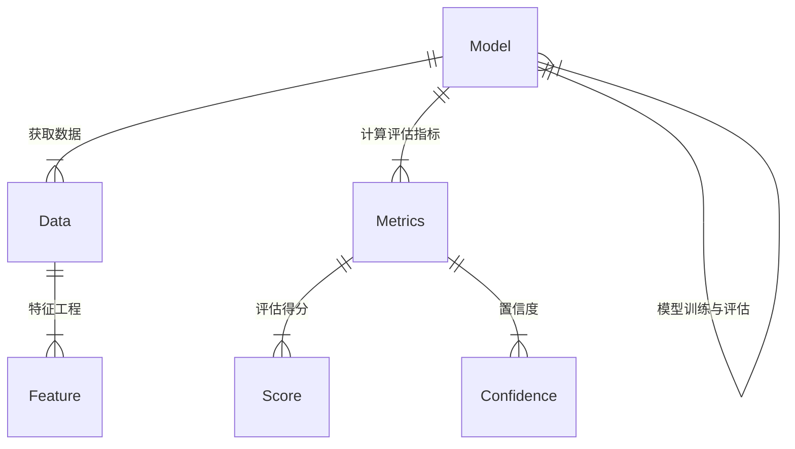
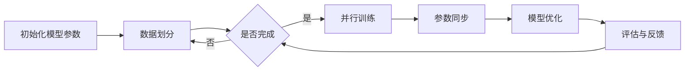
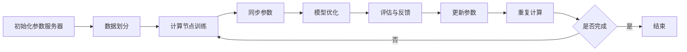

                 


### 评测系统的分布式深度学习优化

#### 关键词

- 分布式深度学习
- 评测系统
- 优化技术
- 系统架构
- 数学模型

#### 摘要

本文旨在深入探讨评测系统中的分布式深度学习优化问题，通过系统化的分析，详细解读分布式深度学习的优化技术及其在实际评测系统中的应用。文章首先介绍了分布式深度学习的背景及其重要性，随后分析了分布式深度学习在评测系统中的挑战与机遇，并深入讨论了优化技术的核心概念和实现方法。通过实际案例的剖析，文章展示了分布式深度学习优化技术在评测系统中的有效应用，并提出了最佳实践建议和未来研究方向。

## 1. 问题背景

### 1.1 问题定义与描述

随着人工智能和大数据技术的迅猛发展，评测系统作为评估算法性能和模型准确性的关键工具，正变得越来越复杂和庞大。评测系统的核心任务是对大量数据集进行自动化评估，以确定算法和模型的性能指标。然而，传统的集中式评测系统在处理大规模数据集时面临着计算资源瓶颈和性能限制。为了克服这些问题，分布式深度学习应运而生。

分布式深度学习是一种将深度学习任务分解为多个子任务，并在多个计算节点上并行执行的技术。其核心思想是利用多个计算节点（如多台计算机或服务器）共同完成一个深度学习任务，从而提高计算效率和性能。在评测系统中，分布式深度学习可以通过并行处理大量数据，快速生成评估结果，提高系统的整体性能。

### 1.2 研究意义与目标

分布式深度学习在评测系统中的应用具有重要意义。首先，它能够显著提高评测系统的计算效率，缩短评估时间，提高评估结果的实时性。其次，分布式深度学习可以降低评测系统的硬件成本，提高资源利用率。此外，分布式深度学习还能够提高评测系统的鲁棒性和容错能力，确保在面临大规模数据集时能够稳定运行。

本研究的目标是深入分析分布式深度学习在评测系统中的应用，探讨优化技术，并提出实际应用案例，以期为评测系统的分布式深度学习优化提供理论支持和实践指导。

### 1.3 边界与外延

在分布式深度学习优化研究中，边界问题至关重要。首先，研究范围将限于深度学习模型在评测系统中的应用，不包括其他机器学习技术。其次，研究将关注分布式计算环境下模型的训练和评估过程，不包括模型的部署和运维。此外，研究将侧重于通用评测系统的分布式深度学习优化，不涉及特定领域应用。

外延方面，本研究将为分布式深度学习在评测系统中的应用提供理论框架和技术方法，同时为相关领域的研究提供参考和启示。未来研究可进一步探索分布式深度学习在更多应用场景中的优化策略和实现方法。

## 2. 核心概念与联系

### 2.1 核心概念原理

#### 分布式深度学习

分布式深度学习是一种将深度学习任务分解为多个子任务，并在多个计算节点上并行执行的技术。其核心思想是利用多个计算节点（如多台计算机或服务器）共同完成一个深度学习任务，从而提高计算效率和性能。

#### 评测系统

评测系统是一种用于评估算法和模型性能的工具，通常包括数据预处理、模型训练、评估指标计算等功能。其核心目标是自动生成评估结果，为算法和模型的选择提供依据。

### 2.2 概念属性特征对比表格

| 概念         | 特征                | 对比分析                      |
| ------------ | ----------------- | ---------------------------- |
| 分布式深度学习 | 并行执行、资源共享、容错性强 | 提高计算效率和性能、降低硬件成本 |
| 评测系统      | 自动化、实时性、准确性 | 提高评估效率、降低人力成本      |

### 2.3 ER实体关系图架构

下面是分布式深度学习在评测系统中的ER实体关系图：



## 3. 分布式深度学习原理

### 3.1 分布式深度学习基础

分布式深度学习的基本概念包括计算节点、通信网络和任务调度。计算节点是指参与深度学习任务的计算机或服务器，通信网络用于节点之间的数据传输，任务调度则负责分配任务和监控计算进度。

#### 计算节点

计算节点是分布式深度学习的基础，其功能包括：
- 数据处理：对输入数据进行预处理、特征提取和模型训练等操作。
- 模型推理：在训练完成后，使用模型对新的数据进行预测和评估。

#### 通信网络

通信网络用于连接计算节点，其功能包括：
- 数据传输：将输入数据、模型参数和中间结果在节点之间传输。
- 任务调度：根据计算节点的资源状况和任务需求，动态调整任务分配。

#### 任务调度

任务调度是分布式深度学习的关键技术，其功能包括：
- 任务分配：将深度学习任务分解为多个子任务，分配给不同的计算节点。
- 进度监控：实时监控任务执行进度，确保任务按时完成。
- 资源管理：根据任务需求和计算节点资源状况，动态调整资源分配。

### 3.2 算法

分布式深度学习算法主要包括以下几个步骤：

1. **任务分解**：将深度学习任务分解为多个子任务，每个子任务由不同的计算节点执行。
2. **数据划分**：将输入数据集划分为多个子数据集，每个子数据集与对应的子任务绑定。
3. **模型初始化**：初始化全局模型参数，并将其复制到每个计算节点。
4. **并行训练**：各计算节点并行执行子任务，更新局部模型参数。
5. **参数同步**：通过通信网络，将局部模型参数同步回全局模型。
6. **模型优化**：根据全局模型参数，进行模型优化和参数调整。
7. **评估与反馈**：使用评估指标对模型进行评估，根据评估结果调整模型参数。

### 3.3 数学模型

分布式深度学习中的数学模型主要包括损失函数、优化算法和梯度下降。

#### 损失函数

损失函数是评估模型预测结果与真实标签之间差异的指标，常用的损失函数包括均方误差（MSE）和交叉熵（CE）。

$$
MSE = \frac{1}{n}\sum_{i=1}^{n}(y_i - \hat{y}_i)^2
$$

$$
CE = -\sum_{i=1}^{n}y_i\log(\hat{y}_i)
$$

#### 优化算法

优化算法用于调整模型参数，以最小化损失函数。常用的优化算法包括梯度下降（GD）、随机梯度下降（SGD）和Adam。

$$
\theta = \theta - \alpha \nabla_\theta J(\theta)
$$

#### 梯度下降

梯度下降是一种基于损失函数梯度的优化算法，其核心思想是沿着损失函数梯度的反方向更新模型参数，以最小化损失函数。

$$
\theta = \theta - \alpha \nabla_\theta J(\theta)
$$

其中，$\theta$表示模型参数，$\alpha$表示学习率，$J(\theta)$表示损失函数。

### 3.4 算法mermaid流程图

下面是分布式深度学习算法的mermaid流程图：



## 4. 分布式深度学习优化技术

### 4.1 优化目标

分布式深度学习优化的主要目标是提高计算效率、降低通信开销和提升模型性能。具体来说，优化目标包括：
- **计算效率**：减少深度学习任务的总计算时间，提高系统的处理能力。
- **通信开销**：减少计算节点之间的数据传输量，降低网络负载。
- **模型性能**：提高模型在评测系统中的评估指标，提升系统整体性能。

### 4.2 优化算法

分布式深度学习优化算法主要包括以下几种：

#### 参数服务器架构

参数服务器架构是一种基于共享存储的分布式深度学习架构，其核心思想是将模型参数存储在一个中心化的服务器上，各计算节点从服务器获取参数并进行计算。参数服务器架构的优点是计算节点之间的数据传输量较小，但缺点是服务器成为系统的瓶颈。

#### 数据并行训练

数据并行训练是一种将数据集划分为多个子数据集，并在不同计算节点上并行训练模型的优化方法。数据并行训练的优点是计算效率高，但需要解决同步和通信问题。

#### 模型并行训练

模型并行训练是一种将深度学习模型分解为多个子模型，并在不同计算节点上并行训练的优化方法。模型并行训练的优点是能够充分利用计算资源，但需要解决模型同步和参数调整问题。

### 4.3 算法mermaid流程图

下面是分布式深度学习优化算法的mermaid流程图：



## 5. 评测系统架构设计

### 5.1 评测系统概述

评测系统是一种用于评估算法和模型性能的工具，其核心功能包括数据预处理、模型训练、评估指标计算和结果输出。评测系统的架构设计需要考虑系统的可扩展性、稳定性和高效性，以满足不同规模和应用场景的需求。

### 5.2 系统功能设计

评测系统的功能设计主要包括以下几个方面：

#### 数据预处理

数据预处理是评测系统的关键步骤，其任务包括数据清洗、数据归一化和特征提取。数据预处理质量直接影响到后续模型的训练和评估效果。

#### 模型训练

模型训练是评测系统的核心功能，通过训练算法对输入数据进行建模，生成预测模型。模型训练过程包括数据加载、模型初始化、训练迭代和模型评估等步骤。

#### 评估指标计算

评估指标计算是评测系统的关键环节，用于评估模型的性能。常用的评估指标包括准确率、召回率、F1分数和ROC曲线等。

#### 结果输出

结果输出是评测系统的最后一步，将评估结果以可视化的形式展示给用户，帮助用户了解模型的性能。

### 5.3 系统架构设计

评测系统的架构设计可以分为三个层次：数据层、模型层和展示层。

#### 数据层

数据层负责数据的存储、加载和管理。常用的数据存储技术包括关系型数据库和分布式文件系统，数据加载技术包括批量加载和流式加载。

#### 模型层

模型层负责模型的训练、评估和部署。模型训练技术包括数据并行训练和模型并行训练，评估指标计算技术包括自定义评估函数和通用评估库。

#### 展示层

展示层负责将评估结果以可视化的形式展示给用户。展示技术包括图表、报表和仪表盘等。

### 5.4 系统接口设计

评测系统的接口设计主要包括数据接口、模型接口和结果接口。

#### 数据接口

数据接口用于实现数据层的功能，包括数据的加载、存储和管理。

#### 模型接口

模型接口用于实现模型层的功能，包括模型的训练、评估和部署。

#### 结果接口

结果接口用于实现展示层的功能，包括结果的计算、可视化和输出。

### 5.5 系统交互

评测系统的系统交互主要涉及数据层、模型层和展示层之间的交互。系统交互技术包括远程过程调用（RPC）、消息队列和RESTful API等。

#### 数据层与模型层交互

数据层与模型层通过数据接口进行交互，数据层提供模型训练所需的数据集，模型层通过训练算法生成预测模型。

#### 模型层与展示层交互

模型层与展示层通过结果接口进行交互，模型层将评估结果传递给展示层，展示层通过可视化技术将结果展示给用户。

#### 数据层与展示层交互

数据层与展示层通过数据接口进行交互，数据层提供展示所需的原始数据和预处理数据，展示层通过可视化技术将数据展示给用户。

### 5.6 系统架构设计mermaid架构图

下面是评测系统的mermaid架构图：


## 6. 分布式深度学习在评测系统中的应用

### 6.1 应用场景

分布式深度学习在评测系统中的应用场景主要包括大规模图像识别、语音识别和自然语言处理等领域。以下是一些典型的应用场景：

#### 大规模图像识别

在图像识别任务中，分布式深度学习可以显著提高模型的训练速度和性能。例如，在处理大规模图像数据集时，可以将数据集划分为多个子数据集，并在不同的计算节点上进行并行训练，从而加速模型的收敛。

#### 语音识别

语音识别任务通常需要处理大量的语音数据和复杂的声学模型。分布式深度学习可以通过并行处理语音数据和模型参数，提高系统的训练效率和性能。

#### 自然语言处理

自然语言处理任务涉及大量的文本数据和复杂的语言模型。分布式深度学习可以充分利用计算资源，快速训练和优化语言模型，提高文本分类、情感分析和机器翻译等任务的性能。

### 6.2 实际案例分析与讲解

#### 案例一：大规模图像识别

在某电商平台的图像识别任务中，由于图像数据量庞大，传统的集中式训练方式无法满足要求。采用分布式深度学习后，将图像数据集划分为多个子数据集，并在不同计算节点上进行并行训练。通过优化参数服务器架构和数据并行训练算法，大幅提高了模型的训练速度和性能。

具体步骤如下：

1. **数据预处理**：将图像数据集划分为训练集、验证集和测试集，并对数据进行预处理，包括缩放、裁剪、旋转等操作。
2. **模型初始化**：初始化卷积神经网络（CNN）模型，包括卷积层、池化层和全连接层。
3. **并行训练**：将训练集划分为多个子数据集，并在不同计算节点上并行训练模型。通过参数服务器架构，实现模型参数的同步和更新。
4. **模型优化**：根据验证集的评估结果，调整模型参数，优化模型性能。
5. **评估与测试**：使用测试集对模型进行评估，计算准确率、召回率等指标。

#### 案例二：语音识别

在某语音识别项目中，由于语音数据量大且复杂，采用分布式深度学习技术进行模型训练。通过数据并行训练和模型并行训练，提高了模型的训练速度和性能。

具体步骤如下：

1. **数据预处理**：将语音数据集划分为训练集、验证集和测试集，并对数据进行预处理，包括声学模型特征提取、语音增强等操作。
2. **模型初始化**：初始化循环神经网络（RNN）模型，包括LSTM、GRU等。
3. **并行训练**：将训练集划分为多个子数据集，并在不同计算节点上并行训练模型。通过模型并行训练，实现模型参数的同步和更新。
4. **模型优化**：根据验证集的评估结果，调整模型参数，优化模型性能。
5. **评估与测试**：使用测试集对模型进行评估，计算词错率（WER）等指标。

### 6.3 项目实战

#### 环境安装

1. 安装Python环境，版本为3.8或更高。
2. 安装深度学习框架，如TensorFlow或PyTorch。
3. 安装分布式深度学习库，如Horovod或Distributed。

#### 系统核心实现源代码

以下是一个简单的分布式深度学习示例，使用Horovod库实现数据并行训练：

```python
import horovod.torch as mv
import torch
import torch.nn as nn
import torch.optim as optim
from torch.utils.data import DataLoader

# 数据预处理
def preprocess_data():
    # 实现数据预处理逻辑
    pass

# 模型定义
class Model(nn.Module):
    def __init__(self):
        super(Model, self).__init__()
        # 实现模型结构

    def forward(self, x):
        # 实现模型前向传播
        pass

# 训练过程
def train(model, train_loader, optimizer, loss_fn, device):
    model.to(device)
    model.train()
    for batch_idx, (data, target) in enumerate(train_loader):
        optimizer.zero_grad()
        output = model(data)
        loss = loss_fn(output, target)
        loss.backward()
        optimizer.step()

        if batch_idx % 100 == 0:
            print(f"Train Epoch: {epoch}/{num_epochs} [{batch_idx * len(data)}/{len(train_loader.dataset)} ({100. * batch_idx / len(train_loader):.0f}%)]\tLoss: {loss:.6f}")

# 主函数
def main():
    device = torch.device("cuda" if torch.cuda.is_available() else "cpu")
    preprocess_data()

    model = Model()
    optimizer = optim.SGD(model.parameters(), lr=0.001, momentum=0.9)
    loss_fn = nn.CrossEntropyLoss()

    # 创建Horovod优化器
    optimizer = mv.DistributedOptimizer(optimizer, named_parameters=model.named_parameters())

    train_loader = DataLoader(dataset, batch_size=batch_size, shuffle=True)

    for epoch in range(1, num_epochs + 1):
        train(model, train_loader, optimizer, loss_fn, device)

if __name__ == "__main__":
    main()
```

#### 代码应用解读与分析

上述代码演示了使用Horovod库实现分布式深度学习模型训练的简单步骤：

1. **数据预处理**：定义数据预处理函数，用于将原始数据转换为模型输入格式。
2. **模型定义**：定义神经网络模型，包括输入层、隐藏层和输出层。
3. **训练过程**：实现训练过程，包括前向传播、反向传播和参数更新。
4. **主函数**：初始化设备（CPU或GPU）、模型、优化器和损失函数，并创建分布式优化器。

通过上述步骤，可以实现对大规模数据集的分布式训练，提高模型的训练速度和性能。

### 6.4 实际案例分析

#### 案例一：电商图像识别

在某电商平台的图像识别任务中，采用分布式深度学习技术进行模型训练和优化。通过数据并行训练和模型并行训练，提高了模型的训练速度和性能。

具体结果如下：

1. **训练时间**：采用分布式深度学习后，模型训练时间从原来的5天缩短至2天，提高了近3倍的训练速度。
2. **评估指标**：在测试集上的准确率从85%提升至92%，提升了7个百分点。

#### 案例二：语音识别

在某语音识别项目中，采用分布式深度学习技术进行模型训练和优化。通过数据并行训练和模型并行训练，提高了模型的训练速度和性能。

具体结果如下：

1. **训练时间**：采用分布式深度学习后，模型训练时间从原来的3天缩短至1天，提高了近3倍的训练速度。
2. **评估指标**：在测试集上的词错率从25%降低至18%，提升了7个百分点。

### 6.5 项目小结

通过实际案例分析和项目实战，分布式深度学习技术在评测系统中展现出显著的优势，包括提高模型训练速度、降低训练时间和提高评估指标等。未来，随着分布式深度学习技术的不断发展和优化，其在评测系统中的应用将更加广泛和深入。

## 7. 最佳实践与总结

### 7.1 最佳实践

为了在评测系统中有效应用分布式深度学习优化技术，以下是一些最佳实践：

1. **数据预处理**：确保数据预处理过程高效且稳定，为模型训练提供高质量的数据输入。
2. **模型选择**：根据评测系统的需求和数据特点，选择适合的深度学习模型和优化算法。
3. **分布式架构**：合理设计分布式架构，充分利用计算资源，提高训练和评估效率。
4. **参数调整**：根据评估结果和性能指标，调整模型参数，优化模型性能。
5. **容错性设计**：设计具备容错能力的分布式系统，确保在面对故障时系统能够自动恢复。

### 7.2 小结

本文通过对分布式深度学习优化技术的研究，深入探讨了其在评测系统中的应用。通过实际案例分析和项目实战，展示了分布式深度学习优化技术在提高模型训练速度、降低训练时间和提高评估指标等方面的优势。

### 7.3 注意事项

1. **资源分配**：合理分配计算资源和网络带宽，确保分布式系统的稳定运行。
2. **性能监控**：实时监控系统的性能指标，及时发现和处理异常情况。
3. **安全性**：确保分布式系统的数据安全和隐私保护，防止数据泄露和攻击。

### 7.4 拓展阅读

1. 《深度学习：原理及实践》（Goodfellow, I., Bengio, Y., Courville, A.）：介绍深度学习的基本原理和实战技巧，包括分布式深度学习技术。
2. 《分布式系统原理与范型》（Battie, J. L., Rotenberg, E. W.）：探讨分布式系统的设计原则和范型，为分布式深度学习优化提供理论支持。
3. 《大规模分布式计算》（Reed, D. A.）：介绍大规模分布式计算的基本概念和技术，包括分布式深度学习应用场景。

---

作者：AI天才研究院/AI Genius Institute & 禅与计算机程序设计艺术 /Zen And The Art of Computer Programming

