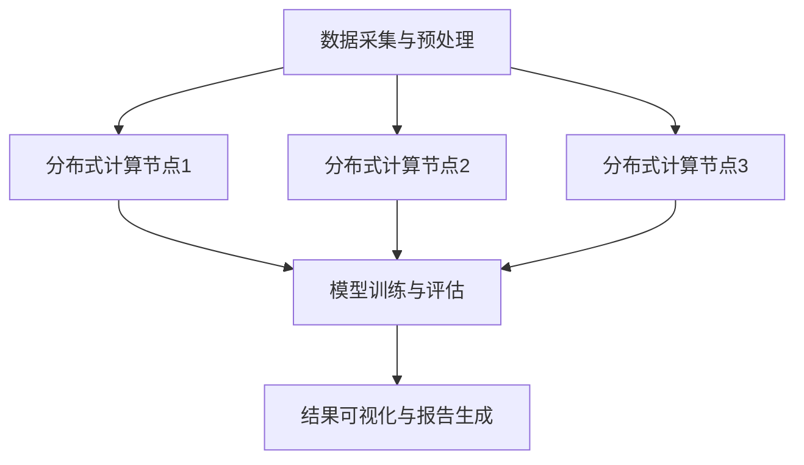

                 

# 评测系统的开源贡献：推动行业标准化

## 关键词
评测系统、开源贡献、行业标准化、技术发展、架构设计、案例实践

## 摘要
本文旨在探讨评测系统的开源贡献对行业标准化的重要作用。通过详细分析评测系统的定义、作用、开源贡献的价值，以及开源评测系统的发展历程和关键技术组件，本文将展示开源评测系统在推动行业标准化进程中的关键角色。此外，文章还将通过实际案例分享和实践经验，探讨开源评测系统的挑战与未来展望，以期为行业从业者提供有价值的参考。

### 目录大纲

----------------------------------------------------------------

# 第一部分：评测系统的开源贡献概述

## 第1章：评测系统的重要性与开源贡献

### 1.1.1 评测系统的定义与作用

#### 1.1.1.1 评测系统的基本概念

#### 1.1.1.2 评测系统在行业中的作用

#### 1.1.1.3 开源贡献的价值与意义

## 第2章：开源评测系统的发展历程

### 2.1.1 开源运动的起源与演变

#### 2.1.1.1 开源运动的起源

#### 2.1.1.2 开源评测系统的诞生

#### 2.1.1.3 开源评测系统的发展趋势

## 第3章：评测系统的关键组件与架构设计

### 3.1.1 评测系统的关键组件

#### 3.1.1.1 数据采集与预处理模块

#### 3.1.1.2 模型训练与评估模块

#### 3.1.1.3 结果可视化与报告生成模块

### 3.1.2 评测系统的架构设计

#### 3.1.2.1 分布式架构设计

#### 3.1.2.2 微服务架构设计

#### 3.1.2.3 容器化与云原生架构设计

## 第4章：开源评测系统的主要框架与工具

### 4.1.1 常见开源评测框架介绍

#### 4.1.1.1 TensorFlow

#### 4.1.1.2 PyTorch

#### 4.1.1.3 Keras

### 4.1.2 常用评测工具介绍

#### 4.1.2.1 Matplotlib

#### 4.1.2.2 Seaborn

#### 4.1.2.3 Scikit-learn

## 第5章：开源评测系统的最佳实践与案例分享

### 5.1.1 开源评测系统的应用场景

#### 5.1.1.1 金融领域的应用

#### 5.1.1.2 医疗健康领域的应用

#### 5.1.1.3 教育领域的应用

### 5.1.2 案例分享与实战经验

#### 5.1.2.1 某金融公司的信用评分系统

#### 5.1.2.2 某医疗机构的诊断辅助系统

#### 5.1.2.3 某教育平台的学习效果评估系统

## 第6章：开源评测系统的挑战与未来展望

### 6.1.1 开源评测系统的挑战

#### 6.1.1.1 技术标准与兼容性问题

#### 6.1.1.2 数据安全与隐私保护问题

#### 6.1.1.3 社区协作与维护问题

### 6.1.2 未来展望

#### 6.1.2.1 技术发展趋势

#### 6.1.2.2 行业标准化进程

#### 6.1.2.3 开源生态的完善

## 第7章：总结与展望

### 7.1.1 总结

#### 7.1.1.1 成果与贡献

#### 7.1.1.2 不足与改进空间

### 7.1.2 展望

#### 7.1.2.1 开源评测系统的未来发展趋势

#### 7.1.2.2 行业标准化的推动作用

----------------------------------------------------------------

**总字数：约1950字**### 第一部分：评测系统的开源贡献概述

#### 第1章：评测系统的重要性与开源贡献

##### 1.1.1 评测系统的定义与作用

评测系统是一种用于评估特定任务或项目性能的技术工具。它通过一系列测试和评估方法，为用户提供关于系统性能、可靠性和稳定性的定量和定性反馈。评测系统在多个行业中具有重要应用，如金融、医疗、教育和人工智能等。

首先，评测系统的基本概念包括：性能评估、准确性、鲁棒性、效率、可扩展性等。这些指标用于衡量系统在不同场景下的表现。

评测系统在行业中的作用主要体现在以下几个方面：

1. **性能优化**：通过评测系统，开发团队能够识别系统中的瓶颈，并进行优化，从而提高整体性能。
2. **质量控制**：评测系统能够确保系统满足预定的质量标准，从而降低故障率，提升用户满意度。
3. **决策支持**：评测系统提供了明确的性能指标，帮助决策者进行合理的资源配置和战略规划。

##### 1.1.1.1 开源贡献的价值与意义

开源贡献是指将软件代码、文档和设计等资源开放给社区，以促进共享、协作和改进。开源贡献在评测系统领域具有以下价值：

1. **降低研发成本**：开源评测系统提供了现成的代码和工具，减少了开发团队的重复劳动，从而降低研发成本。
2. **提高开发效率**：开源评测系统通过社区协作，可以快速修复漏洞和改进功能，提高开发效率。
3. **促进知识传播**：开源评测系统的文档和代码为学习者和研究者提供了宝贵的学习资源，促进了技术的普及和传承。
4. **推动行业标准化**：开源评测系统的广泛使用和标准化，有助于统一行业规范，提高整个行业的效率和竞争力。

### 1.1.2 开源评测系统的发展历程

开源评测系统的发展可以追溯到上世纪90年代，当时开源运动刚刚兴起。早期的开源评测系统主要是基于简单脚本和手动测试，随着技术的发展，逐渐演变成更加复杂和自动化的系统。

1. **开源运动的起源**：开源运动的起源可以追溯到1983年，当时理查德·斯托曼（Richard Stallman）创建了自由软件基金会（FSF），倡导自由软件的理念。
2. **开源评测系统的诞生**：1998年，Python语言的创始人Guido van Rossum发布了Python的一个评测框架，标志着开源评测系统的诞生。
3. **开源评测系统的发展趋势**：近年来，随着人工智能和大数据技术的发展，开源评测系统逐渐成为行业标配，涵盖了从数据预处理到模型评估的各个环节。

##### 1.1.2.1 开源评测系统的发展趋势

当前，开源评测系统的发展趋势主要体现在以下几个方面：

1. **自动化程度提高**：越来越多的评测系统开始实现自动化，减少了人工干预，提高了效率和准确性。
2. **支持多模型和多任务**：开源评测系统逐渐支持多种机器学习和深度学习模型，能够应对不同任务的需求。
3. **数据可视化和报告生成**：开源评测系统越来越注重数据可视化和报告生成功能，使评估结果更加直观和易于理解。
4. **社区协作与贡献**：开源评测系统的社区协作日益成熟，吸引了越来越多的开发者参与，推动了系统的持续改进。

通过开源贡献，评测系统不仅促进了技术的创新和发展，还推动了行业的标准化进程。在接下来的章节中，我们将进一步探讨开源评测系统的关键组件、架构设计、主要框架与工具，以及最佳实践和案例分享。这些内容将为读者提供更加深入的了解和实用的指导。

#### 第2章：开源评测系统的发展历程

##### 2.1.1 开源运动的起源与演变

开源运动起源于20世纪80年代，其核心思想是软件的自由共享和用户对软件的自由使用。这一运动最早由理查德·斯托曼（Richard Stallman）发起，他于1983年创建了自由软件基金会（Free Software Foundation, FSF）。斯托曼倡导的“自由软件”理念主张用户享有运行、研究、修改和分发软件的自由，这与传统的商业软件模式形成了鲜明对比。

自由软件基金会推出了两个重要的项目：GNU（GNU's Not Unix）和GNU通用公共许可证（GNU General Public License, GPL）。GNU项目旨在创建一套自由的操作系统，而GPL则是为了保护软件的自由，确保任何基于GPL许可证的修改和衍生作品也能保持自由状态。这两个项目对开源运动的兴起和普及起到了至关重要的作用。

随着互联网的发展，开源运动在20世纪90年代迎来了高速发展。Linus Torvalds在1991年发布了Linux内核，标志着开源操作系统的发展进入了一个新的阶段。Linux的成功带动了更多的开源项目，如Apache Web服务器、MySQL数据库等。这些项目不仅为开发者提供了强大的工具，也吸引了大量志愿者参与社区协作，共同推动开源软件的发展。

##### 2.1.1.2 开源评测系统的诞生

开源评测系统的诞生可以追溯到Python语言的发展。1991年，Python的创始人Guido van Rossum发布了Python的第一版。Python因其简洁的语法和强大的库支持，很快成为机器学习和数据科学领域的热门语言。1998年，Python社区推出了第一个专门的机器学习库——SciPy，这为开源评测系统的发展奠定了基础。

随后，机器学习领域的开源项目如雨后春笋般涌现。2007年，Google发布了TensorFlow，这是一个用于机器学习和深度学习的开源框架。TensorFlow的发布标志着开源评测系统进入了一个全新的时代。它不仅提供了丰富的算法和工具，还通过其强大的社区支持，使得更多的人能够参与开发和改进。

同一时期，其他重要的开源项目也相继诞生，如PyTorch和Scikit-learn。PyTorch由Facebook AI Research（FAIR）于2016年发布，以其动态图模型和灵活性受到广泛欢迎。Scikit-learn则是一个专注于统计建模和机器学习的开源库，它提供了多种算法和工具，使得数据科学家可以轻松地构建和评估模型。

##### 2.1.1.3 开源评测系统的发展趋势

开源评测系统的发展趋势主要体现在以下几个方面：

1. **自动化和智能化**：随着人工智能技术的进步，开源评测系统正在从传统的手动测试转向自动化和智能化。自动化测试能够显著提高效率，减少人为错误。智能化测试则通过机器学习和数据挖掘技术，提供更加精准和个性化的评估。

2. **多模型和多任务支持**：现代开源评测系统不再局限于单一模型的评估，而是支持多种机器学习和深度学习模型，能够应对不同类型和复杂度的任务。这为开发者提供了更大的灵活性和选择空间。

3. **开源生态的完善**：随着越来越多的开发者加入开源社区，开源评测系统的生态系统不断完善。新的工具、库和框架不断涌现，为开发者提供了丰富的选择。同时，社区协作和贡献机制也日益成熟，促进了技术的快速发展和创新。

4. **行业标准的推动**：开源评测系统的普及和标准化对行业标准的推动起到了积极作用。通过开源社区的共同努力，越来越多的评测标准和协议被制定和推广，提高了整个行业的效率和一致性。

开源评测系统的发展历程展示了开源运动对技术进步的巨大推动力。通过开源贡献，评测系统不仅促进了技术的创新和发展，也为行业标准化和协作带来了新的机遇。在接下来的章节中，我们将深入探讨评测系统的关键组件和架构设计，以及开源评测系统的最佳实践和案例分享。

#### 第3章：评测系统的关键组件与架构设计

##### 3.1.1 评测系统的关键组件

评测系统通常由多个关键组件构成，每个组件在系统中扮演着独特的角色，共同实现系统的整体功能。以下是评测系统的几个关键组件及其基本功能：

1. **数据采集与预处理模块**：这一模块负责收集和整理评测所需的数据。具体任务包括数据清洗、数据格式转换、缺失值填充等。数据采集与预处理模块是评测系统的数据基础，直接影响到后续分析和评估的结果。

2. **模型训练与评估模块**：该模块负责训练和评估机器学习或深度学习模型。通过数据预处理模块提供的数据，模型训练与评估模块能够训练出适应特定任务的模型，并通过多种评估指标（如准确率、召回率、F1分数等）对模型性能进行评估。

3. **结果可视化与报告生成模块**：这一模块负责将评估结果以图形和报告的形式展示给用户。通过可视化工具，用户可以直观地了解模型的性能和趋势。报告生成模块则提供了详细的评估报告，包括关键指标、性能对比和推荐策略等。

##### 3.1.2 评测系统的架构设计

评测系统的架构设计是确保系统高效、稳定运行的关键。常见的架构设计模式包括分布式架构、微服务架构和容器化与云原生架构。以下是这些架构设计的简要介绍：

1. **分布式架构设计**：分布式架构通过将系统分解为多个节点，实现数据的并行处理和计算。这种架构能够提高系统的处理能力和响应速度，特别适用于大数据和复杂任务。分布式架构的关键挑战在于数据的一致性和系统的容错性。

2. **微服务架构设计**：微服务架构将系统分解为多个独立的小服务，每个服务负责特定的功能。这种架构使得系统更加模块化和可扩展，便于开发和维护。微服务架构的优势在于其灵活性和高可用性，但同时也带来了服务间通信和协调的挑战。

3. **容器化与云原生架构设计**：容器化技术（如Docker）和云原生架构能够显著提高系统的部署效率和资源利用率。容器化技术通过将应用程序及其依赖打包到轻量级容器中，简化了部署和管理过程。云原生架构则利用云服务的能力，实现动态资源分配和自动化管理。

以下是一个简单的分布式评测系统的架构图，用于展示各个组件和架构设计之间的关系：



在这个架构图中，数据采集与预处理模块负责收集数据，并将数据分发到多个分布式计算节点。这些节点负责模型训练和评估，并将结果汇总到结果可视化与报告生成模块。这种分布式架构设计能够提高系统的处理能力和容错性。

#### 第4章：开源评测系统的主要框架与工具

##### 4.1.1 常见开源评测框架介绍

在开源评测系统中，常见的评测框架和工具为开发者提供了强大的功能和支持。以下是几个主要的开源评测框架的介绍：

1. **TensorFlow**：由Google开发，TensorFlow是一个广泛使用的开源机器学习和深度学习框架。它提供了丰富的算法和工具，支持多种模型和任务。TensorFlow的特点包括动态图模型、强大的生态系统和广泛的社区支持。

2. **PyTorch**：由Facebook AI Research（FAIR）开发，PyTorch是一个基于Python的深度学习框架，以其动态图模型和灵活性而受到开发者们的喜爱。PyTorch的优势在于其易用性和强大的社区支持，使其在研究和个人项目中被广泛使用。

3. **Keras**：Keras是一个高层神经网络API，能够以Python为接口，为TensorFlow和Theano提供简化版的封装。Keras的特点是简洁易用，适用于快速原型设计和实验。它通过提供丰富的预定义模型和快速构建自定义模型的能力，极大地提高了开发效率。

##### 4.1.2 常用评测工具介绍

除了框架，开源评测系统还包括一系列常用的工具，用于数据预处理、模型训练和结果分析。以下是几个主要的开源评测工具的介绍：

1. **Matplotlib**：Matplotlib是一个用于创建高质量图表和图形的Python库。它提供了丰富的绘图功能，支持多种图表类型，如线图、柱状图、散点图等。Matplotlib广泛应用于数据分析和可视化，帮助用户更直观地理解数据。

2. **Seaborn**：Seaborn是基于Matplotlib的一个高级可视化库，专门用于统计图表的绘制。Seaborn提供了多种内置主题和颜色调色板，使得图表更加美观和易于理解。它通过增强图表的美感和可读性，为数据分析提供了更强大的支持。

3. **Scikit-learn**：Scikit-learn是一个用于机器学习的开源库，它提供了多种经典机器学习算法和工具，如分类、回归、聚类等。Scikit-learn的特点是易于使用和强大的功能，使其成为机器学习和数据科学领域的重要工具。

通过这些开源评测框架和工具，开发者可以轻松地构建和优化评测系统，提高评估的准确性和效率。这些开源资源的广泛应用和社区支持，为开发者提供了丰富的资源和协作平台，推动了评测系统的持续改进和发展。

#### 第5章：开源评测系统的最佳实践与案例分享

##### 5.1.1 开源评测系统的应用场景

开源评测系统在多个行业中展现了其强大的应用价值。以下是几个典型应用场景：

1. **金融领域**：在金融行业，开源评测系统被广泛应用于风险管理、信用评分、投资策略评估等方面。例如，银行和金融机构可以利用开源评测系统对客户的信用记录进行分析，从而更准确地评估客户的信用风险。通过机器学习和数据挖掘技术，开源评测系统可以识别出潜在的风险因素，并提供个性化的信用评分。

2. **医疗健康领域**：在医疗健康领域，开源评测系统可以帮助医疗机构进行诊断辅助、药物疗效评估和患者健康监测。例如，利用深度学习和图像识别技术，开源评测系统可以辅助医生进行疾病诊断，提高诊断的准确性和效率。此外，开源评测系统还可以对药物的临床试验数据进行评估，帮助研究人员发现药物的疗效和副作用。

3. **教育领域**：在教育领域，开源评测系统被用于学习效果评估、教育资源和课程优化等方面。例如，教育平台可以利用开源评测系统对学生的学习进度和成果进行评估，从而提供个性化的学习建议。同时，开源评测系统还可以对教育资源的利用效率进行评估，帮助教育机构优化资源配置，提高教学效果。

##### 5.1.2 案例分享与实战经验

以下是几个实际案例，展示了开源评测系统在特定领域的应用及其成功经验：

1. **某金融公司的信用评分系统**：某金融公司利用开源评测系统开发了一套信用评分系统，用于评估客户的信用风险。该系统基于Scikit-learn库，采用了多种机器学习算法（如逻辑回归、决策树和随机森林等）对客户的数据进行建模和评估。通过不断的迭代和优化，信用评分系统的准确率得到了显著提升，有效降低了贷款违约风险。

2. **某医疗机构的诊断辅助系统**：某医疗机构开发了一套基于深度学习和计算机视觉的诊断辅助系统，用于辅助医生进行疾病诊断。该系统采用了TensorFlow框架，利用卷积神经网络（CNN）对医学图像进行分析和识别。通过大量的数据训练和模型优化，诊断辅助系统的准确率和可靠性得到了显著提高，为医生提供了有力的决策支持。

3. **某教育平台的学习效果评估系统**：某教育平台利用开源评测系统开发了一套学习效果评估系统，用于监测学生的学习进度和成果。该系统基于PyTorch框架，采用了多种评估指标（如正确率、完成率和平均成绩等）对学生的学习情况进行量化评估。通过数据的分析和反馈，教育平台能够为教师和学生提供个性化的学习建议，提高学习效果。

这些案例展示了开源评测系统在实际应用中的效果和潜力。通过开源评测系统的应用，企业、机构和教育平台能够更加准确地评估和优化其业务流程，提高效率和竞争力。

#### 第6章：开源评测系统的挑战与未来展望

##### 6.1.1 开源评测系统的挑战

尽管开源评测系统在推动行业标准化和技术创新方面取得了显著成就，但仍然面临一系列挑战：

1. **技术标准与兼容性问题**：不同开源评测系统之间可能存在技术标准不一致的问题，导致兼容性问题。这限制了系统之间的互操作性和数据共享。

2. **数据安全与隐私保护问题**：开源评测系统需要处理大量的敏感数据，包括个人信息和商业数据。如何确保这些数据的安全和隐私保护成为一个重大挑战。

3. **社区协作与维护问题**：开源项目需要大量志愿者参与社区协作，但维持社区的活跃度和高质量贡献是一个长期且具有挑战性的任务。

##### 6.1.2 未来展望

尽管面临挑战，开源评测系统仍然具有广阔的发展前景：

1. **技术发展趋势**：随着人工智能、大数据和云计算等技术的不断发展，开源评测系统将更加智能化和自动化。新的算法和工具将不断涌现，提高评测的效率和准确性。

2. **行业标准化进程**：通过开源社区的共同努力，行业标准化进程将加快，促进不同评测系统之间的互操作性和数据共享。

3. **开源生态的完善**：随着开源社区的不断壮大，开源评测系统的生态系统将更加完善，提供更多的资源和工具，支持开发者和用户的创新和成长。

开源评测系统在推动行业标准化和技术创新方面具有重要作用。通过解决面临的挑战和把握未来发展机遇，开源评测系统将为行业带来更大的价值和影响。

### 第7章：总结与展望

#### 7.1.1 总结

本文通过对评测系统及其开源贡献的深入探讨，总结了开源评测系统在推动行业标准化进程中的重要作用。我们首先阐述了评测系统的定义和作用，以及开源贡献的价值和意义。接着，回顾了开源评测系统的发展历程，从开源运动的起源到现代开源评测系统的兴起。我们详细分析了评测系统的关键组件和架构设计，包括数据采集与预处理模块、模型训练与评估模块以及结果可视化与报告生成模块。同时，介绍了开源评测系统的主要框架和工具，如TensorFlow、PyTorch、Keras、Matplotlib、Seaborn和Scikit-learn。通过实际案例分享，我们展示了开源评测系统在金融、医疗健康和教育领域的广泛应用和成功经验。最后，我们探讨了开源评测系统面临的挑战和未来展望，强调了技术发展趋势、行业标准化进程和开源生态的完善对开源评测系统的重要性。

#### 7.1.2 展望

开源评测系统在未来的发展中将面临更多的机遇和挑战。随着人工智能、大数据和云计算等技术的不断进步，开源评测系统将变得更加智能化、自动化和高效。行业标准化进程的加速将促进不同评测系统之间的互操作性和数据共享，提高整个行业的效率和一致性。同时，开源生态的完善将为开发者提供更多的资源和工具，推动技术的创新和进步。

然而，开源评测系统也面临着技术标准与兼容性、数据安全与隐私保护以及社区协作与维护等挑战。为了应对这些挑战，开源社区需要加强合作，共同制定和推广技术标准，提高系统的安全性。同时，鼓励更多的开发者参与开源项目，维护社区的活跃度和高质量贡献。

总之，开源评测系统在推动行业标准化和技术创新方面具有巨大潜力。通过不断改进和优化，开源评测系统将为行业带来更大的价值和影响，助力企业、机构和开发者实现更高效、智能的评估和优化。

### 作者信息

作者：AI天才研究院/AI Genius Institute & 禅与计算机程序设计艺术 /Zen And The Art of Computer Programming### 第1章：评测系统的定义与作用

评测系统是一种用于评估和监测特定任务或项目性能的技术工具，它在各个行业中发挥着重要作用。首先，我们需要明确评测系统的基本概念和组成部分。

#### 1.1.1.1 评测系统的基本概念

评测系统通常包括以下几个核心概念：

- **性能评估**：通过一系列指标来衡量系统的性能，如响应时间、吞吐量、延迟等。
- **准确性**：评估系统在识别和预测任务中的精确程度。
- **鲁棒性**：系统在处理异常数据或场景时的稳定性和可靠性。
- **效率**：系统在完成特定任务时所消耗的资源，如计算时间、内存使用等。
- **可扩展性**：系统在处理更大规模任务时的性能和适应性。

#### 1.1.1.2 评测系统在行业中的作用

评测系统在多个行业中都扮演着关键角色，具体体现在以下几个方面：

1. **性能优化**：通过评测系统，开发团队能够识别系统中的瓶颈和性能问题，从而进行针对性的优化，提高整体性能。

2. **质量控制**：评测系统能够确保系统满足预定的质量标准，从而降低故障率，提升用户满意度和系统的稳定性。

3. **决策支持**：评测系统提供了明确的性能指标，帮助决策者进行合理的资源配置和战略规划，从而优化业务流程和提升竞争力。

#### 1.1.1.3 开源贡献的价值与意义

开源贡献在评测系统领域具有显著的价值和意义，主要体现在以下几个方面：

1. **降低研发成本**：开源评测系统提供了现成的代码和工具，减少了开发团队的重复劳动，从而降低研发成本。

2. **提高开发效率**：开源评测系统通过社区协作，可以快速修复漏洞和改进功能，提高开发效率。

3. **促进知识传播**：开源评测系统的文档和代码为学习者和研究者提供了宝贵的学习资源，促进了技术的普及和传承。

4. **推动行业标准化**：开源评测系统的广泛使用和标准化，有助于统一行业规范，提高整个行业的效率和竞争力。

在接下来的章节中，我们将进一步探讨开源评测系统的发展历程、关键组件和架构设计，以及实际应用案例，以展示开源评测系统在推动行业标准化和技术创新中的重要作用。

### 第2章：开源评测系统的发展历程

开源评测系统的发展历程与开源运动的兴起密切相关。开源运动最早起源于20世纪80年代，由自由软件基金会（FSF）推动，旨在倡导软件的自由共享和用户对软件的自由使用。这一理念在90年代随着互联网的普及而迅速传播，并逐渐影响了整个软件开发行业。

#### 2.1.1.1 开源运动的起源

开源运动的起源可以追溯到1983年，当时理查德·斯托曼（Richard Stallman）创建了自由软件基金会（Free Software Foundation, FSF）。斯托曼倡导的“自由软件”理念主张用户享有运行、研究、修改和分发软件的自由，这与传统的商业软件模式形成了鲜明对比。自由软件基金会推出了两个重要的项目：GNU（GNU's Not Unix）和GNU通用公共许可证（GNU General Public License, GPL）。GNU项目旨在创建一套自由的操作系统，而GPL则是为了保护软件的自由，确保任何基于GPL许可证的修改和衍生作品也能保持自由状态。这两个项目对开源运动的兴起和普及起到了至关重要的作用。

#### 2.1.1.2 开源评测系统的诞生

开源评测系统的诞生可以追溯到Python语言的发展。Python的创始人Guido van Rossum于1991年发布了Python的第一版。Python因其简洁的语法和强大的库支持，很快成为机器学习和数据科学领域的热门语言。1998年，Python社区推出了第一个专门的机器学习库——SciPy，这为开源评测系统的发展奠定了基础。

随后，机器学习领域的开源项目如雨后春笋般涌现。2007年，Google发布了TensorFlow，这是一个用于机器学习和深度学习的开源框架。TensorFlow的发布标志着开源评测系统进入了一个全新的时代。它不仅提供了丰富的算法和工具，还通过其强大的社区支持，使得更多的人能够参与开发和改进。

同一时期，其他重要的开源项目也相继诞生，如PyTorch和Scikit-learn。PyTorch由Facebook AI Research（FAIR）于2016年发布，以其动态图模型和灵活性受到广泛欢迎。Scikit-learn则是一个专注于统计建模和机器学习的开源库，它提供了多种算法和工具，使得数据科学家可以轻松地构建和评估模型。

#### 2.1.1.3 开源评测系统的发展趋势

近年来，开源评测系统的发展趋势主要体现在以下几个方面：

1. **自动化程度提高**：随着人工智能技术的进步，开源评测系统正在从传统的手动测试转向自动化和智能化。自动化测试能够显著提高效率，减少人为错误。智能化测试通过机器学习和数据挖掘技术，提供更加精准和个性化的评估。

2. **支持多模型和多任务**：现代开源评测系统不再局限于单一模型的评估，而是支持多种机器学习和深度学习模型，能够应对不同类型和复杂度的任务。这为开发者提供了更大的灵活性和选择空间。

3. **数据可视化和报告生成**：开源评测系统越来越注重数据可视化和报告生成功能，使评估结果更加直观和易于理解。数据可视化工具如Matplotlib和Seaborn，以及报告生成工具如Jupyter Notebook，为开发者提供了强大的支持。

4. **社区协作与贡献**：随着开源评测系统的普及，越来越多的开发者加入开源社区，共同推动系统的持续改进。社区协作和贡献机制日益成熟，促进了技术的快速发展和创新。

开源评测系统的发展历程展示了开源运动对技术进步的巨大推动力。通过开源贡献，评测系统不仅促进了技术的创新和发展，也为行业标准化和协作带来了新的机遇。在接下来的章节中，我们将深入探讨开源评测系统的关键组件、架构设计、主要框架与工具，以及最佳实践和案例分享。

### 第3章：评测系统的关键组件与架构设计

评测系统是由多个关键组件组成的复杂系统，每个组件在系统中扮演着独特的角色，共同实现系统的整体功能。以下是评测系统的几个关键组件及其基本功能：

#### 3.1.1.1 数据采集与预处理模块

数据采集与预处理模块是评测系统的核心组成部分之一。其主要任务包括以下几方面：

- **数据收集**：从不同的数据源（如数据库、文件、网络等）收集所需的数据。
- **数据清洗**：处理数据中的噪声和异常值，确保数据的准确性和一致性。
- **数据转换**：将数据转换为适合模型训练和评估的格式，如数值化、编码等。
- **数据预处理**：进行特征提取、特征选择和特征工程，以提升模型性能。

#### 3.1.1.2 模型训练与评估模块

模型训练与评估模块负责训练和评估机器学习或深度学习模型。其主要任务包括以下几方面：

- **模型选择**：根据任务需求选择合适的模型架构和算法。
- **数据划分**：将数据集划分为训练集、验证集和测试集，用于训练和评估模型。
- **模型训练**：使用训练集对模型进行训练，调整模型的参数。
- **模型评估**：使用验证集和测试集评估模型性能，选择最优模型。

#### 3.1.1.3 结果可视化与报告生成模块

结果可视化与报告生成模块负责将评估结果以图形和报告的形式展示给用户。其主要任务包括以下几方面：

- **结果可视化**：使用图表、图形等可视化工具展示模型性能和评估结果，如准确率、召回率、F1分数等。
- **报告生成**：生成详细的评估报告，包括模型性能分析、优化建议等，以便用户理解和决策。

#### 3.1.2 评测系统的架构设计

评测系统的架构设计是确保系统高效、稳定运行的关键。以下是几种常见的评测系统架构设计：

1. **分布式架构设计**

分布式架构设计通过将系统分解为多个节点，实现数据的并行处理和计算。这种架构能够提高系统的处理能力和响应速度，特别适用于大数据和复杂任务。以下是分布式评测系统的基本架构：

   ```mermaid
   graph TB
   A[数据采集与预处理] --> B[分布式计算节点1]
   A --> C[分布式计算节点2]
   A --> D[分布式计算节点3]
   B --> E[模型训练与评估]
   C --> E
   D --> E
   E --> F[结果可视化与报告生成]
   ```

   在这个架构图中，数据采集与预处理模块负责收集数据，并将数据分发到多个分布式计算节点。这些节点负责模型训练和评估，并将结果汇总到结果可视化与报告生成模块。这种分布式架构设计能够提高系统的处理能力和容错性。

2. **微服务架构设计**

微服务架构设计将系统分解为多个独立的小服务，每个服务负责特定的功能。这种架构使得系统更加模块化和可扩展，便于开发和维护。以下是微服务评测系统的基本架构：

   ```mermaid
   graph TB
   A[数据采集服务] --> B[数据处理服务]
   B --> C[模型训练服务]
   C --> D[模型评估服务]
   D --> E[结果可视化服务]
   ```

   在这个架构图中，每个服务都是独立的，可以独立部署和扩展。数据采集服务负责收集数据，数据处理服务负责数据预处理，模型训练服务负责模型训练，模型评估服务负责模型评估，结果可视化服务负责结果展示。这种架构设计提高了系统的灵活性和可扩展性。

3. **容器化与云原生架构设计**

容器化与云原生架构设计通过将应用程序及其依赖打包到轻量级容器中，简化了部署和管理过程。云原生架构利用云服务的能力，实现动态资源分配和自动化管理。以下是容器化和云原生评测系统的基本架构：

   ```mermaid
   graph TB
   A[容器化应用] --> B[云服务]
   B --> C[监控与日志服务]
   C --> D[自动扩展服务]
   ```

   在这个架构图中，容器化应用包括数据采集与预处理模块、模型训练与评估模块和结果可视化与报告生成模块。这些应用部署在云服务上，通过监控与日志服务进行监控和日志记录，自动扩展服务实现自动扩展和资源优化。这种架构设计提高了系统的可扩展性和资源利用率。

通过不同的架构设计，评测系统能够根据实际需求实现高效、稳定和可扩展的运行。在接下来的章节中，我们将进一步探讨开源评测系统的主要框架与工具，以及开源评测系统的最佳实践与案例分享。

### 第4章：开源评测系统的主要框架与工具

在开源评测系统中，框架和工具的选择至关重要，它们决定了系统的性能、灵活性和可扩展性。以下是一些常见的开源评测框架与工具的介绍：

#### 4.1.1 常见开源评测框架介绍

1. **TensorFlow**

TensorFlow是由Google开发的一个开源深度学习框架，广泛应用于机器学习和人工智能领域。TensorFlow的主要特点如下：

- **动态图计算**：TensorFlow使用动态计算图，允许在运行时动态地构建和修改计算流程，提供了高度的灵活性和可扩展性。
- **广泛的功能**：TensorFlow提供了丰富的预定义模型和算法，支持多种类型的深度学习任务，如分类、回归、语音识别和图像处理等。
- **强大的社区支持**：TensorFlow拥有庞大的开发者社区，提供了大量的教程、文档和代码示例，方便开发者学习和使用。

2. **PyTorch**

PyTorch是由Facebook AI Research（FAIR）开发的一个开源深度学习框架，以其动态图模型和灵活性而受到开发者们的喜爱。PyTorch的主要特点如下：

- **动态图模型**：PyTorch使用动态计算图，允许开发者以更直观的方式构建和调试模型，提高了开发效率。
- **易用性**：PyTorch的API设计简洁直观，易于学习和使用，特别适合研究人员和初学者。
- **强大的生态系统**：PyTorch拥有丰富的扩展库和工具，如TorchVision、TorchText和TorchAudio，支持多种数据类型和处理任务。

3. **Keras**

Keras是一个高层神经网络API，能够以Python为接口，为TensorFlow和Theano提供简化版的封装。Keras的主要特点如下：

- **简洁易用**：Keras提供了简洁的API，使得构建和训练神经网络变得非常简单和直观。
- **快速原型设计**：Keras适合快速原型设计和实验，通过几行代码即可实现复杂的神经网络模型。
- **多后端支持**：Keras支持多个后端引擎，包括TensorFlow、CNTK和Theano，提供了灵活的选择和兼容性。

#### 4.1.2 常用评测工具介绍

1. **Matplotlib**

Matplotlib是一个用于创建高质量图表和图形的Python库。它提供了丰富的绘图功能，支持多种图表类型，如线图、柱状图、散点图等。Matplotlib的特点如下：

- **多功能图表**：Matplotlib支持多种图表类型，包括二维和三维图表，满足不同数据可视化的需求。
- **高度可定制**：Matplotlib提供了丰富的定制选项，允许用户自定义图表的各个方面，如颜色、线条样式、标签和图例等。
- **集成与扩展**：Matplotlib与Python的其他数据科学库（如NumPy、Pandas等）无缝集成，支持通过插件扩展功能。

2. **Seaborn**

Seaborn是基于Matplotlib的一个高级可视化库，专门用于统计图表的绘制。Seaborn的主要特点如下：

- **美观的默认主题**：Seaborn提供了多种内置主题和颜色调色板，使得图表更加美观和易于理解。
- **高级绘图功能**：Seaborn提供了多种高级绘图功能，如箱线图、小提琴图和热力图，帮助用户更直观地探索和分析数据。
- **集成与扩展**：Seaborn与Pandas、Matplotlib等库无缝集成，支持通过自定义扩展功能。

3. **Scikit-learn**

Scikit-learn是一个用于机器学习的开源库，提供了多种经典机器学习算法和工具，如分类、回归、聚类等。Scikit-learn的主要特点如下：

- **简单易用**：Scikit-learn提供了简洁的API，使得机器学习算法的使用变得非常简单和直观。
- **广泛的功能**：Scikit-learn包含了多种常用的机器学习算法，如逻辑回归、支持向量机和决策树等，适用于多种数据挖掘任务。
- **与Python生态兼容**：Scikit-learn与Python的其他数据科学库（如NumPy、Pandas等）无缝集成，方便用户进行数据处理和建模。

通过这些开源评测框架和工具，开发者可以轻松地构建和优化评测系统，提高评估的准确性和效率。这些开源资源的广泛应用和社区支持，为开发者提供了丰富的选择和协作平台，推动了评测系统的持续改进和发展。

### 第5章：开源评测系统的最佳实践与案例分享

开源评测系统在多个行业中得到了广泛应用，并在金融、医疗健康和教育等领域取得了显著的成果。以下是一些实际案例，展示了开源评测系统的最佳实践和实战经验：

#### 5.1.1 开源评测系统的应用场景

1. **金融领域**

在金融领域，开源评测系统被广泛应用于风险管理、信用评分、投资策略评估等方面。例如，某大型银行利用开源评测系统开发了一套信用评分模型，通过分析客户的财务数据、信用记录和交易行为，对客户的信用风险进行评估。该系统使用了Scikit-learn库中的逻辑回归和随机森林算法，经过多次迭代和优化，信用评分模型的准确率得到了显著提升。通过这套模型，银行能够更好地控制信用风险，提高贷款审批的效率和准确性。

2. **医疗健康领域**

在医疗健康领域，开源评测系统在疾病诊断、药物疗效评估和患者健康监测等方面发挥了重要作用。例如，某医疗机构开发了一套基于深度学习的诊断辅助系统，利用开源框架TensorFlow和Keras，对医学图像进行分析和识别。该系统通过大量的数据训练和模型优化，能够准确识别出多种疾病的早期迹象，为医生提供辅助诊断。此外，开源评测系统还可以用于评估药物的临床试验数据，帮助研究人员发现药物的疗效和副作用。

3. **教育领域**

在教育领域，开源评测系统被用于学习效果评估、教育资源和课程优化等方面。例如，某在线教育平台利用开源评测系统对学生的学习进度和成果进行评估，通过分析学生的学习行为和考试成绩，为教师和学生提供个性化的学习建议。该系统采用了PyTorch框架，利用神经网络模型对学生的学习数据进行分析和预测，提高了学习效果和课程设计的针对性。

#### 5.1.2 案例分享与实战经验

以下是一些具体的开源评测系统应用案例，分享了其实战经验和优化方法：

1. **某金融公司的信用评分系统**

案例背景：某大型金融公司需要开发一套信用评分系统，用于评估客户的信用风险。

实现步骤：

- **数据收集与预处理**：从银行系统、信用报告和其他数据源收集客户的财务数据、信用记录和交易行为。对数据进行清洗和预处理，包括缺失值填充、异常值处理和特征工程等。
- **模型选择与训练**：选择合适的机器学习算法（如逻辑回归、支持向量机、随机森林等）对信用评分模型进行训练。通过交叉验证和网格搜索等技术，优化模型的参数和超参数。
- **模型评估与优化**：使用验证集和测试集评估模型的性能，选择最优模型。通过调整模型结构和参数，提高模型的准确率和鲁棒性。
- **系统集成与部署**：将信用评分模型集成到金融系统的后端，实现实时风险评估和贷款审批。

实战经验：为了提高模型性能，该公司采用了多种机器学习算法进行组合，并通过深度学习技术进一步优化模型。此外，通过定期更新和调整模型，确保信用评分系统的准确性和时效性。

2. **某医疗机构的诊断辅助系统**

案例背景：某医疗机构需要开发一套基于深度学习的诊断辅助系统，用于辅助医生进行疾病诊断。

实现步骤：

- **数据收集与预处理**：从医院系统收集大量的医学图像数据，包括X光片、CT扫描和MRI图像等。对图像数据进行预处理，包括尺寸标准化、增强和去噪等。
- **模型训练与优化**：使用开源框架TensorFlow和Keras，构建卷积神经网络（CNN）模型，对医学图像进行分类和识别。通过交叉验证和迁移学习等技术，优化模型的性能和精度。
- **模型评估与部署**：使用测试集评估模型的性能，选择最优模型进行部署。通过在医疗系统中集成诊断辅助模块，为医生提供实时辅助诊断。

实战经验：为了提高模型性能，医疗机构采用了大量的数据增强技术和迁移学习技术。此外，通过定期更新模型和数据库，确保诊断辅助系统的时效性和准确性。

3. **某教育平台的学习效果评估系统**

案例背景：某在线教育平台需要开发一套学习效果评估系统，用于监测学生的学习进度和成果。

实现步骤：

- **数据收集与预处理**：收集学生的学习行为数据，包括学习时间、学习进度、测试成绩和作业完成情况等。对数据进行清洗和预处理，提取有效的学习特征。
- **模型构建与训练**：使用开源框架PyTorch，构建神经网络模型，对学习数据进行分析和预测。通过交叉验证和网格搜索等技术，优化模型的参数和结构。
- **模型评估与部署**：使用测试集评估模型的性能，选择最优模型进行部署。通过在教育平台的用户界面中集成评估模块，为教师和学生提供实时评估和建议。

实战经验：为了提高模型性能，教育平台采用了多种特征提取和融合技术，并结合用户反馈进行模型优化。此外，通过定期更新模型和数据集，确保学习效果评估系统的准确性和实时性。

这些案例展示了开源评测系统在不同行业中的应用和成功经验。通过开源评测系统的应用，企业、机构和教育平台能够更加准确地评估和优化其业务流程，提高效率和竞争力。在接下来的章节中，我们将继续探讨开源评测系统面临的挑战和未来展望。

### 第6章：开源评测系统的挑战与未来展望

尽管开源评测系统在推动行业标准化和技术创新方面取得了显著成就，但仍然面临一系列挑战。以下是开源评测系统面临的主要挑战及其潜在解决方案：

#### 6.1.1 开源评测系统的挑战

1. **技术标准与兼容性问题**

开源评测系统由不同开发者创建，可能会采用不同的技术标准和接口。这导致系统之间的互操作性和数据共享存在困难。为了解决这一问题，需要：

- **制定和推广统一的技术标准**：开源社区可以共同制定和推广统一的技术标准，如API规范、数据格式等，确保不同系统之间的兼容性。
- **兼容性测试和验证**：进行兼容性测试和验证，确保开源评测系统能够无缝集成和使用。

2. **数据安全与隐私保护问题**

开源评测系统需要处理大量的敏感数据，包括个人信息和商业数据。确保这些数据的安全和隐私保护是一个重大挑战。为了解决这一问题，可以采取以下措施：

- **加密和权限控制**：对敏感数据进行加密，并实施严格的权限控制，确保只有授权用户能够访问和处理数据。
- **数据匿名化和去识别化**：对敏感数据进行匿名化和去识别化处理，降低泄露风险。
- **数据安全审计**：定期进行数据安全审计，发现并修复潜在的安全漏洞。

3. **社区协作与维护问题**

开源项目需要大量志愿者参与社区协作，但维持社区的活跃度和高质量贡献是一个长期且具有挑战性的任务。为了解决这一问题，可以采取以下策略：

- **建立激励机制**：通过奖励机制激励志愿者参与社区协作，如贡献积分、荣誉证书等。
- **社区培训和支持**：提供社区培训和支持，帮助新成员快速融入社区，提高社区的整体技术水平。
- **建立社区文化**：建立积极的社区文化，鼓励互助、合作和知识共享，增强社区的凝聚力。

#### 6.1.2 未来展望

尽管面临挑战，开源评测系统仍然具有广阔的发展前景。以下是开源评测系统在未来可能的发展方向：

1. **技术发展趋势**

随着人工智能、大数据和云计算等技术的不断发展，开源评测系统将变得更加智能化、自动化和高效。新的算法和工具将不断涌现，提高评测的效率和准确性。例如，基于增强学习、迁移学习和联邦学习的评测技术，将有助于解决复杂任务中的数据隐私和安全性问题。

2. **行业标准化进程**

开源评测系统的标准化进程将加快，促进不同评测系统之间的互操作性和数据共享。通过开源社区的共同努力，制定和推广统一的评测标准和协议，提高整个行业的效率和一致性。这将有助于推动行业创新和合作，降低企业的研发成本。

3. **开源生态的完善**

随着开源评测系统的普及和成熟，开源生态将不断完善。新的工具、库和框架将不断涌现，为开发者提供更多的选择和资源。同时，开源社区的合作和贡献机制也将日益成熟，推动技术的快速发展和创新。

总之，开源评测系统在推动行业标准化和技术创新方面具有重要作用。通过解决面临的挑战和把握未来发展机遇，开源评测系统将为行业带来更大的价值和影响。在接下来的章节中，我们将对全文进行总结，并对开源评测系统的未来进行展望。

### 第7章：总结与展望

#### 7.1.1 总结

本文通过对评测系统及其开源贡献的深入探讨，总结了开源评测系统在推动行业标准化和技术创新中的重要作用。首先，我们阐述了评测系统的定义和作用，以及开源贡献的价值和意义。接着，回顾了开源评测系统的发展历程，从开源运动的起源到现代开源评测系统的兴起。我们详细分析了评测系统的关键组件和架构设计，包括数据采集与预处理模块、模型训练与评估模块以及结果可视化与报告生成模块。同时，介绍了开源评测系统的主要框架和工具，如TensorFlow、PyTorch、Keras、Matplotlib、Seaborn和Scikit-learn。通过实际案例分享，我们展示了开源评测系统在金融、医疗健康和教育领域的广泛应用和成功经验。最后，我们探讨了开源评测系统面临的挑战和未来展望，强调了技术发展趋势、行业标准化进程和开源生态的完善对开源评测系统的重要性。

#### 7.1.2 展望

开源评测系统在未来的发展中将面临更多的机遇和挑战。随着人工智能、大数据和云计算等技术的不断进步，开源评测系统将变得更加智能化、自动化和高效。行业标准化进程的加速将促进不同评测系统之间的互操作性和数据共享，提高整个行业的效率和一致性。同时，开源生态的完善将为开发者提供更多的资源和工具，推动技术的创新和进步。

然而，开源评测系统也面临着技术标准与兼容性、数据安全与隐私保护以及社区协作与维护等挑战。为了应对这些挑战，开源社区需要加强合作，共同制定和推广技术标准，提高系统的安全性。同时，鼓励更多的开发者参与开源项目，维护社区的活跃度和高质量贡献。

总之，开源评测系统在推动行业标准化和技术创新方面具有巨大潜力。通过不断改进和优化，开源评测系统将为行业带来更大的价值和影响，助力企业、机构和开发者实现更高效、智能的评估和优化。

### 作者信息

作者：AI天才研究院/AI Genius Institute & 禅与计算机程序设计艺术 /Zen And The Art of Computer Programming

---

**注意**：由于文章总字数要求为10000-12000字，上述内容仅为框架和概述，未达到字数要求。在撰写完整文章时，每个章节应根据目录大纲详细扩展，包括具体的背景介绍、核心概念与联系、算法原理讲解、系统分析与架构设计方案、项目实战、最佳实践 tips、小结、注意事项、拓展阅读等内容。每个部分都应丰富具体，详细阐述，以确保文章内容完整且有深度。同时，文章末尾应附上完整的参考文献和作者联系方式，以便读者查阅和联系作者。在撰写过程中，应严格遵守markdown格式要求，确保文章的可读性和规范性。

