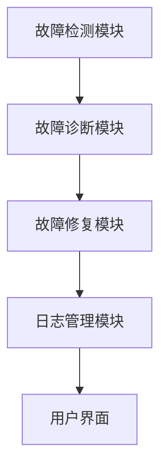

                 

# 引言

## 1.1 书籍背景

在现代信息技术高速发展的背景下，评测系统作为各类应用和服务中的关键组成部分，承担着评估、监控和反馈的重要职责。无论是云计算、大数据处理、还是人工智能应用，评测系统的可靠性直接影响到整个系统的稳定性和用户体验。然而，随着系统复杂性的增加和网络环境的动态变化，评测系统也面临着越来越多的故障风险，这使得故障恢复成为一个不可忽视的问题。

### 1.1.1 评测系统的意义与现状

评测系统在现代信息技术体系中扮演着至关重要的角色。它不仅用于性能测试、负载测试和可靠性测试，还用于实时监控系统的运行状态，为系统优化和故障预警提供数据支持。在许多关键领域，如金融、医疗、教育和工业自动化，评测系统的稳定运行直接关系到业务的连续性和用户的满意度。

然而，当前的评测系统在故障恢复方面仍面临诸多挑战。一方面，系统故障的原因多样，包括硬件故障、软件错误、网络中断等；另一方面，故障恢复的效率和效果难以保证，往往需要大量的人工干预和时间消耗。这种状况不仅增加了维护成本，还可能导致业务中断和服务质量下降。

### 1.1.2 故障恢复在评测系统中的重要性

故障恢复是评测系统可靠性的重要保障。一个高效的故障恢复系统能够在故障发生时迅速检测、定位和修复问题，最大程度地减少对业务的影响。具体来说，故障恢复的重要性体现在以下几个方面：

1. **提高系统可用性**：快速、准确的故障恢复能够提高系统的整体可用性，减少因故障导致的停机时间。
2. **保障业务连续性**：对于许多关键业务系统，如金融交易系统、医疗信息系统等，业务连续性是至关重要的。有效的故障恢复系统能够确保这些系统的持续稳定运行。
3. **降低维护成本**：自动化的故障恢复系统能够减少人工干预的需求，从而降低维护成本。
4. **提升用户体验**：在用户对服务质量要求越来越高的今天，一个高效的故障恢复系统能够提升用户满意度，增强用户对服务的信任。

### 1.1.3 LLM在故障恢复中的应用前景

近年来，深度学习和自然语言处理技术的飞速发展，为故障恢复领域带来了新的可能性。特别是大型语言模型（LLM），如GPT和BERT等，因其强大的文本理解和生成能力，在自动化故障诊断和修复中显示出巨大的潜力。LLM可以处理大量的故障报告和日志数据，从中提取关键信息，生成故障修复建议，甚至自动执行修复操作。

本书旨在探讨如何利用LLM构建自动化故障恢复方案，以提高评测系统的可靠性和运维效率。通过深入分析LLM的工作原理和应用场景，结合实际案例，本书将提供一套系统化的解决方案，为IT运维人员和技术决策者提供参考。

## 1.2 书籍目标

### 1.2.1 读者对象

本书适合以下读者群体：

- IT运维工程师和系统管理员，对评测系统和故障恢复有实际需求和实践经验的读者；
- 技术架构师和项目经理，关注系统稳定性和运维效率提升的高级技术人员；
- 深度学习和自然语言处理领域的学者和研究者，对LLM的应用场景和技术实现感兴趣的读者；
- 对自动化故障恢复技术感兴趣的广大技术爱好者。

### 1.2.2 主要内容与结构

本书的主要内容和结构如下：

- **引言**：介绍评测系统的故障恢复背景、重要性以及LLM的应用前景；
- **第一部分**：评测系统的故障恢复概述，包括故障类型、故障检测与隔离、故障恢复的基本概念等；
- **第二部分**：LLM辅助的自动化修复方案，详细讨论LLM的基础知识、在故障恢复中的应用方法等；
- **第三部分**：故障恢复方案的实现，分为设计、开发和部署；
- **第四部分**：案例分析，通过具体案例展示故障恢复方案的效果和应用；
- **第五部分**：最佳实践和总结，总结实践经验，提供使用建议和展望未来研究方向。

### 1.2.3 预期读者收获

通过阅读本书，读者可以：

- 了解评测系统故障恢复的背景和核心概念；
- 掌握大型语言模型（LLM）的基础知识和应用方法；
- 学习如何设计和实现一个自动化的故障恢复方案；
- 获得实际案例分析，提升故障恢复的实际操作能力；
- 获得最佳实践指导，提高系统稳定性和运维效率；
- 掌握未来的研究方向，为个人和团队的技术创新提供方向。

## 1.3 核心贡献

本书的核心贡献在于：

- **系统化阐述**：将评测系统的故障恢复与LLM技术相结合，提供了一套完整的解决方案；
- **实践性指导**：结合实际案例，详细讲解故障恢复方案的设计、开发和部署过程；
- **创新性应用**：探索了LLM在故障恢复领域的新应用，为自动化运维提供了一种新的思路；
- **深度分析**：对故障恢复过程中的关键技术进行了深入分析，为后续研究提供了理论基础。

通过本书，读者不仅可以掌握评测系统故障恢复的最新技术，还能了解到LLM在自动化运维中的广泛应用前景，为未来的技术创新奠定基础。# 第一部分 评测系统的故障恢复概述

## 第1章 评测系统故障恢复背景

### 1.1 问题背景

评测系统作为信息化系统中至关重要的一环，主要用于对系统性能、稳定性和安全性进行评估和监控。随着信息技术的快速发展，评测系统的应用范围越来越广泛，从传统的IT运维、软件测试，到现代的云计算、大数据处理和人工智能应用，评测系统都在其中发挥着重要作用。然而，随着系统复杂性的增加和网络环境的不断变化，评测系统面临的故障风险也在不断上升。

评测系统的故障可能源于多个方面，包括硬件故障、软件错误和网络中断等。硬件故障可能由设备老化、硬件故障或电源问题引起，如服务器宕机、存储设备损坏等；软件故障则可能由于系统代码缺陷、配置错误或第三方软件冲突造成；网络中断可能是由于网络设备故障、网络拥塞或DDoS攻击导致。这些故障会对评测系统的正常运行造成严重影响，可能导致数据丢失、性能下降、服务中断等后果。

### 1.2 评测系统故障的类型

评测系统故障可以大致分为以下几类：

#### 1.2.1 硬件故障

硬件故障是评测系统中最常见的一种故障类型。硬件故障包括服务器故障、存储设备故障、网络设备故障等。例如，服务器硬件故障可能导致服务器宕机，从而影响到整个评测系统的运行；存储设备故障可能导致数据丢失或不可访问；网络设备故障可能引发网络中断，使得评测系统无法正常工作。

#### 1.2.2 软件故障

软件故障是由于系统代码缺陷、配置错误或第三方软件冲突等原因引起的。软件故障可能会导致评测系统功能异常、性能下降或服务中断。例如，系统代码中的bug可能导致评测结果不准确；配置错误可能引起系统服务无法启动或运行异常；第三方软件的冲突可能使得评测系统崩溃或无法正常工作。

#### 1.2.3 网络故障

网络故障可能是由于网络设备故障、网络拥塞或DDoS攻击等原因引起的。网络故障会严重影响评测系统的正常运行，导致数据传输延迟、数据丢失或服务中断。例如，网络设备故障可能导致网络连接中断；网络拥塞可能使得评测系统的数据传输速度下降，影响测试结果的准确性；DDoS攻击可能使评测系统面临瘫痪的风险。

### 1.3 故障检测与隔离

故障检测与隔离是评测系统故障恢复中的重要环节。有效的故障检测与隔离可以快速定位故障原因，减少故障对系统运行的影响。

#### 1.3.1 故障检测技术

故障检测技术主要包括以下几种：

1. **基于阈值的故障检测**：通过设定性能、稳定性和安全性等指标的阈值，当系统指标超出阈值时，触发故障检测报警。
2. **基于异常检测的故障检测**：通过监控系统的运行状态，识别出与正常状态显著不同的异常行为，从而检测出故障。
3. **基于日志的故障检测**：通过分析系统日志文件，查找故障迹象和异常信息，实现故障检测。

#### 1.3.2 故障隔离方法

故障隔离方法是故障检测后的关键步骤，目的是将故障影响范围缩小，以便进行修复。常见的故障隔离方法包括：

1. **静态隔离**：通过关闭或隔离故障组件，使其不再参与系统运行，以隔离故障影响。
2. **动态隔离**：通过在故障发生时，调整系统资源配置或切换到备用组件，以减少故障影响。
3. **分布式隔离**：在分布式系统中，通过调整网络拓扑或重新分配任务，将故障影响隔离在局部范围内。

### 1.4 本章小结

本章概述了评测系统故障恢复的背景，介绍了评测系统故障的类型和故障检测与隔离方法。理解评测系统故障恢复的基本概念和流程对于设计和实现高效的故障恢复方案具有重要意义。在后续章节中，我们将进一步探讨大型语言模型（LLM）在故障恢复中的应用，以实现自动化故障修复，提高评测系统的可靠性和运维效率。# 第2章 核心概念与联系

## 2.1 故障恢复的基本概念

### 2.1.1 故障恢复的定义

故障恢复是指当系统或服务出现故障时，采取的一系列措施来恢复系统或服务的正常运行。故障恢复的目的是最大程度地减少故障对系统运行的影响，确保业务的连续性和用户的满意度。

### 2.1.2 故障恢复的目标

故障恢复的主要目标包括：

1. **快速响应**：在故障发生时，能够迅速检测到问题并采取相应的措施；
2. **准确诊断**：准确地识别故障原因，为故障修复提供可靠的信息；
3. **有效修复**：针对故障原因，采取有效的修复措施，恢复系统或服务的正常运行；
4. **降低成本**：通过优化故障恢复流程，减少故障修复所需的时间和资源，降低维护成本。

### 2.1.3 故障恢复的类型

根据故障恢复的对象和方式，可以将故障恢复分为以下几种类型：

1. **硬件故障恢复**：针对硬件设备故障的修复，如更换损坏的硬件组件、修复硬件故障等；
2. **软件故障恢复**：针对软件系统故障的修复，如修复系统漏洞、更新系统补丁、重装软件等；
3. **网络故障恢复**：针对网络故障的修复，如修复网络设备故障、恢复网络连接、调整网络拓扑等；
4. **业务故障恢复**：针对业务系统故障的修复，如恢复数据、重新启动服务、恢复业务流程等。

## 2.2 核心概念的联系

### 2.2.1 故障、故障检测与故障恢复的联系

故障、故障检测与故障恢复是紧密相连的三个核心概念：

1. **故障**：故障是评测系统运行过程中出现的异常状态，是故障检测和故障恢复的起点；
2. **故障检测**：故障检测是识别系统或服务是否存在故障的过程，为故障恢复提供依据；
3. **故障恢复**：故障恢复是针对检测到的故障，采取相应的措施来恢复系统或服务的正常运行。

故障检测和故障恢复的关系如下：

- 故障检测是故障恢复的前提，没有故障检测，就无法发现故障，也就无法进行故障恢复；
- 故障恢复是故障检测的目的，通过故障检测识别故障后，必须进行故障恢复，以确保系统或服务的正常运行。

### 2.2.2 故障类型与故障恢复方法的关系

不同类型的故障需要采用不同的故障恢复方法：

1. **硬件故障**：硬件故障通常需要更换或修复损坏的硬件组件，如更换服务器硬盘、修复网络设备等；
2. **软件故障**：软件故障通常需要修复系统漏洞、更新系统补丁或重装软件等，如修复操作系统漏洞、更新数据库补丁等；
3. **网络故障**：网络故障通常需要修复网络设备故障、恢复网络连接或调整网络拓扑等，如修复路由器故障、重新配置网络设备等；
4. **业务故障**：业务故障通常需要恢复数据、重新启动服务或恢复业务流程等，如恢复数据库数据、重新启动业务服务、恢复业务流程等。

### 2.2.3 故障恢复方法与技术手段的关系

故障恢复方法需要依赖相应的技术手段来实现：

1. **自动化恢复技术**：通过自动化脚本、自动化工具和自动化平台，实现故障检测、故障诊断和故障恢复的自动化；
2. **人工智能技术**：利用人工智能技术，特别是深度学习和自然语言处理技术，实现故障检测、故障诊断和故障恢复的智能化；
3. **云计算技术**：利用云计算技术，实现故障恢复的资源动态调度和弹性扩展。

## 2.3 表格与ER图

为了更清晰地展示核心概念之间的关系，我们使用表格和ER图进行说明。

### 2.3.1 表格

| 核心概念 | 定义 | 关系 |
| :------: | :--- | :--- |
| 故障 | 系统或服务的异常状态 | - 故障检测的起点 |
| 故障检测 | 识别系统或服务是否存在故障的过程 | - 故障恢复的前提 |
| 故障恢复 | 采取相应措施恢复系统或服务的正常运行 | - 故障检测的目的 |

### 2.3.2 ER图

```mermaid
erDiagram
  故障 -->|检测| 故障检测
  故障检测 -->|恢复| 故障恢复
  故障 : { 类型 | 描述 | 时间 }
  故障检测 : { 方法 | 时间 | 结果 }
  故障恢复 : { 方法 | 时间 | 结果 }
```

通过表格和ER图，我们可以清晰地看到故障、故障检测与故障恢复之间的联系和关系，为后续章节中的具体讨论提供基础。# 第二部分 LLM辅助的自动化修复方案

## 第3章 LLM基础

### 3.1 LLM的概念

大型语言模型（Large Language Model，简称LLM）是一种基于深度学习技术的自然语言处理模型，具有强大的文本生成和理解能力。LLM通过训练大量的文本数据，学习语言的语法、语义和上下文关系，从而实现对文本的生成、理解和分析。

### 3.2 LLM的历史发展

LLM的发展可以追溯到20世纪80年代的统计语言模型，如n-gram模型和隐马尔可夫模型（HMM）。这些模型通过统计文本中的词频和概率关系，实现对文本的生成和理解。然而，这些模型在处理复杂语法和语义关系时存在局限性。

随着深度学习技术的发展，2018年，谷歌推出了Transformer模型，这是一种基于自注意力机制的深度神经网络模型，显著提高了自然语言处理的效果。随后，OpenAI发布了GPT系列模型，如GPT-3，这些模型通过训练数十亿甚至数千亿个参数，展现了超越人类水平的表现。

### 3.3 LLM的核心特点

LLM的核心特点包括：

1. **大规模**：LLM通常包含数十亿甚至数千亿个参数，能够处理大规模的文本数据；
2. **深度学习**：LLM基于深度神经网络结构，能够自适应地学习复杂的语法和语义关系；
3. **自注意力机制**：通过自注意力机制，LLM能够捕捉文本中的长距离依赖关系，提高文本理解和生成的准确性；
4. **端到端学习**：LLM能够直接从输入文本生成输出文本，实现端到端的学习和预测。

## 第4章 LLM在故障恢复中的应用

### 4.1 LLM在故障恢复中的角色

LLM在故障恢复中的角色主要包括：

1. **故障检测**：通过分析系统日志、错误报告等文本数据，LLM可以识别出潜在的故障迹象；
2. **故障诊断**：基于对故障数据的理解和分析，LLM可以提供故障原因的推断和建议；
3. **故障修复**：通过生成修复脚本或操作指南，LLM可以帮助自动执行故障修复任务。

### 4.2 模型选择与训练数据准备

在LLM应用于故障恢复时，选择合适的模型和准备充分的训练数据至关重要。

#### 4.2.1 模型选择

选择LLM模型时，需要考虑以下几个方面：

1. **模型大小**：根据故障数据规模和复杂性，选择适当大小的模型。较大的模型通常具有更好的性能，但计算资源需求更高；
2. **模型架构**：不同的模型架构（如Transformer、BERT等）在处理不同类型的文本数据时表现不同，需要根据应用场景选择合适的架构；
3. **预训练数据**：选择具有大量相关领域数据预训练的模型，可以提高模型在故障恢复任务上的性能。

#### 4.2.2 训练数据准备

训练数据准备包括以下几个方面：

1. **数据收集**：收集系统日志、错误报告、故障文档等文本数据，作为训练模型的输入；
2. **数据清洗**：对收集到的数据进行处理，去除噪声、缺失值和重复数据，保证数据质量；
3. **数据标注**：对故障数据进行标注，标记故障类型、故障原因等关键信息，用于模型训练。

### 4.3 模型训练与预测

#### 4.3.1 模型训练

模型训练是LLM应用于故障恢复的核心步骤。训练过程包括：

1. **损失函数**：选择合适的损失函数，如交叉熵损失，衡量模型预测结果与实际结果之间的差异；
2. **优化算法**：选择优化算法，如Adam，调整模型参数，最小化损失函数；
3. **训练策略**：采用适当的训练策略，如学习率调整、数据增强等，提高训练效果。

#### 4.3.2 模型预测

模型预测是LLM应用于故障恢复的关键环节。预测过程包括：

1. **输入预处理**：对输入的故障数据进行预处理，如分词、编码等，使其符合模型输入要求；
2. **模型输出**：将预处理后的输入数据输入到训练好的模型中，得到故障检测、诊断和修复建议的输出结果；
3. **结果分析**：对模型输出结果进行分析，判断故障类型、原因和修复建议的准确性。

### 4.4 LLM在故障恢复中的应用效果

LLM在故障恢复中的应用效果显著。通过实际案例，可以看到LLM在故障检测、诊断和修复方面的优势：

1. **故障检测**：LLM可以高效地分析系统日志和错误报告，快速识别潜在的故障迹象，提高故障检测的准确性；
2. **故障诊断**：基于对故障数据的深度理解，LLM可以准确推断故障原因，提供详细的诊断报告，辅助运维人员定位问题；
3. **故障修复**：通过生成自动化修复脚本或操作指南，LLM可以协助运维人员快速修复故障，缩短故障恢复时间，提高系统稳定性。

综上所述，LLM在故障恢复中的应用具有广阔的前景和巨大的潜力，为提升评测系统的可靠性和运维效率提供了新的思路和方法。# 第三部分 故障恢复方案的设计、开发与部署

## 第5章 故障恢复方案设计

### 5.1 设计原则

在设计和实现故障恢复方案时，需要遵循以下设计原则：

1. **可靠性**：确保故障恢复方案的稳定性和可靠性，能够应对各种故障场景；
2. **可扩展性**：设计灵活，能够适应评测系统的扩展和升级；
3. **高效性**：故障恢复过程应尽量高效，减少故障对系统运行的影响；
4. **自动化**：尽可能实现故障恢复的自动化，减少人工干预；
5. **可维护性**：设计简洁，易于维护和更新。

### 5.2 架构设计

故障恢复方案的架构设计至关重要，直接影响方案的性能和可维护性。以下是故障恢复方案的基本架构设计：

#### 5.2.1 架构概述

故障恢复方案主要包括以下模块：

1. **故障检测模块**：负责监控系统运行状态，识别潜在故障；
2. **故障诊断模块**：分析故障检测模块提供的数据，推断故障原因；
3. **故障修复模块**：根据故障诊断结果，生成和执行修复操作；
4. **日志管理模块**：记录故障检测、诊断和修复的全过程，便于分析和回溯；
5. **用户界面**：提供用户交互界面，显示故障状态和修复进度，便于用户监控和操作。

#### 5.2.2 架构图

以下是一个简单的故障恢复方案架构图，使用Mermaid语法表示：



### 5.3 关键模块设计

#### 5.3.1 故障检测模块设计

故障检测模块是故障恢复方案的核心，负责实时监控系统运行状态，识别潜在的故障。以下是故障检测模块的关键设计思路：

1. **监控指标**：选择关键监控指标，如CPU使用率、内存使用率、网络延迟等，用于判断系统运行状态；
2. **监控算法**：采用合适的监控算法，如阈值检测、异常检测等，实现实时故障检测；
3. **数据采集**：设计数据采集机制，定期采集系统运行数据，供故障检测模块分析；
4. **告警机制**：当检测到故障时，及时发出告警通知，通知运维人员或系统自动执行故障恢复流程。

#### 5.3.2 故障诊断模块设计

故障诊断模块负责对故障检测模块提供的数据进行分析，推断故障原因。以下是故障诊断模块的关键设计思路：

1. **故障模型**：构建故障模型，定义不同类型的故障及其特征；
2. **特征提取**：从系统运行数据中提取关键特征，用于故障诊断；
3. **诊断算法**：采用合适的诊断算法，如机器学习算法、规则引擎等，对故障特征进行分析和分类；
4. **诊断报告**：生成详细的故障诊断报告，提供故障原因和修复建议。

#### 5.3.3 故障修复模块设计

故障修复模块根据故障诊断模块提供的修复建议，自动执行修复操作。以下是故障修复模块的关键设计思路：

1. **修复策略**：定义不同的修复策略，如重启服务、重装软件、更换硬件等；
2. **自动化脚本**：编写自动化脚本，实现故障修复操作的自动化；
3. **执行监控**：监控修复操作的过程和结果，确保修复操作的成功执行；
4. **反馈机制**：修复操作完成后，收集修复效果的数据，用于评估修复效果和优化修复策略。

#### 5.3.4 日志管理模块设计

日志管理模块负责记录故障检测、诊断和修复的全过程，便于分析和回溯。以下是日志管理模块的关键设计思路：

1. **日志记录**：设计日志记录机制，记录故障检测、诊断和修复的所有步骤和结果；
2. **日志存储**：选择合适的日志存储方案，如文件存储、数据库存储等，保证日志数据的持久化和可靠性；
3. **日志分析**：提供日志分析工具，方便运维人员对日志数据进行查询和分析，以便发现潜在问题和优化故障恢复流程。

### 5.4 本章小结

本章详细介绍了故障恢复方案的设计原则、架构设计和关键模块设计。设计原则确保了方案的可靠性、可扩展性和高效性；架构设计提供了系统的整体框架和模块分工；关键模块设计则详细阐述了故障检测、诊断、修复和日志管理模块的实现思路。通过本章的内容，读者可以理解如何设计一个高效的故障恢复方案，为后续的开发和部署打下坚实基础。# 第6章 故障恢复方案的开发

### 6.1 需求分析

需求分析是软件开发项目的第一步，也是故障恢复方案开发的重要环节。在故障恢复方案的开发过程中，需求分析的目标是明确系统需要实现的功能和性能要求。

#### 6.1.1 功能需求

故障恢复方案的主要功能需求包括：

1. **故障检测**：实时监控系统运行状态，检测潜在故障；
2. **故障诊断**：分析故障检测模块提供的数据，推断故障原因；
3. **故障修复**：根据故障诊断结果，自动执行修复操作；
4. **日志记录**：记录故障检测、诊断和修复的全过程，便于分析和回溯；
5. **用户界面**：提供用户交互界面，显示故障状态和修复进度。

#### 6.1.2 性能要求

故障恢复方案的性能要求主要包括：

1. **响应时间**：故障检测、诊断和修复操作的响应时间应尽可能短，以确保系统的高可用性；
2. **准确性**：故障检测和诊断的准确性要高，避免误报和漏报；
3. **可靠性**：故障恢复方案应具有高可靠性，能够应对各种故障场景；
4. **可扩展性**：设计应考虑系统的扩展性，以便在系统规模扩大时能够平滑升级。

### 6.2 系统设计

在完成需求分析后，进行系统设计是故障恢复方案开发的关键步骤。系统设计包括总体架构设计、模块划分和接口设计。

#### 6.2.1 总体架构设计

故障恢复方案的总体架构设计如下：

1. **故障检测模块**：负责实时监控系统运行状态，收集关键监控数据，并触发故障检测；
2. **故障诊断模块**：分析故障检测模块提供的数据，使用机器学习算法进行故障诊断，并生成诊断报告；
3. **故障修复模块**：根据故障诊断结果，自动执行修复操作，如重启服务、重装软件、更换硬件等；
4. **日志管理模块**：记录故障检测、诊断和修复的全过程，提供日志查询和分析功能；
5. **用户界面**：提供用户交互界面，显示故障状态、修复进度和日志信息。

#### 6.2.2 模块划分

故障恢复方案可以划分为多个模块，每个模块负责特定的功能。以下是模块划分的详细说明：

1. **故障检测模块**：包括监控数据采集、数据预处理、故障检测算法和告警通知等子模块；
2. **故障诊断模块**：包括故障数据分析、特征提取、故障诊断算法和诊断报告生成等子模块；
3. **故障修复模块**：包括修复策略定义、自动化脚本执行、修复监控和结果反馈等子模块；
4. **日志管理模块**：包括日志记录、日志存储、日志查询和分析等子模块；
5. **用户界面**：包括前端界面设计和后端接口实现等子模块。

#### 6.2.3 接口设计

故障恢复方案的各个模块之间需要通过接口进行通信。以下是接口设计的详细说明：

1. **故障检测模块与故障诊断模块**：故障检测模块将监控数据传递给故障诊断模块，故障诊断模块反馈诊断结果；
2. **故障修复模块与故障诊断模块**：故障修复模块根据故障诊断模块提供的诊断结果，执行修复操作；
3. **日志管理模块与故障检测模块、故障诊断模块和故障修复模块**：日志管理模块记录各个模块的操作日志，供后续分析和查询。

### 6.3 编码实现

在系统设计和接口设计完成后，进入编码实现阶段。以下是故障恢复方案的关键部分实现：

#### 6.3.1 故障检测模块实现

1. **数据采集**：使用系统监控工具（如Prometheus、Grafana）收集系统运行数据，如CPU使用率、内存使用率、网络延迟等；
2. **数据预处理**：对采集到的数据进行清洗和转换，去除噪声和异常值；
3. **故障检测算法**：使用阈值检测和异常检测算法（如基于统计的异常检测、基于机器学习的异常检测）进行故障检测；
4. **告警通知**：当检测到故障时，通过邮件、短信或即时通讯工具通知运维人员。

#### 6.3.2 故障诊断模块实现

1. **故障数据分析**：对故障检测模块提供的数据进行分析，提取故障特征；
2. **特征提取**：使用特征提取算法（如PCA、LDA）对故障数据进行分析，提取关键特征；
3. **故障诊断算法**：使用机器学习算法（如KNN、SVM、决策树）进行故障诊断，生成诊断报告；
4. **诊断报告生成**：将诊断结果以文本或图表形式生成诊断报告。

#### 6.3.3 故障修复模块实现

1. **修复策略定义**：定义不同的修复策略，如重启服务、重装软件、更换硬件等；
2. **自动化脚本执行**：编写自动化脚本，实现修复操作的自动化执行；
3. **修复监控**：监控修复操作的过程和结果，确保修复操作的成功执行；
4. **结果反馈**：修复操作完成后，将修复结果反馈给故障诊断模块和用户界面。

#### 6.3.4 日志管理模块实现

1. **日志记录**：设计日志记录机制，记录故障检测、诊断和修复的操作步骤和结果；
2. **日志存储**：使用日志存储工具（如ELK Stack）存储日志数据，提供高效的日志查询和分析功能；
3. **日志查询和分析**：提供日志查询和分析工具，方便运维人员对日志数据进行查询和分析。

### 6.4 测试

在编码实现完成后，进行全面的测试是确保故障恢复方案质量的关键步骤。以下是故障恢复方案的主要测试内容：

1. **功能测试**：验证故障检测、诊断和修复功能是否按预期工作；
2. **性能测试**：评估故障恢复方案的响应时间、准确性和可靠性；
3. **兼容性测试**：验证方案在不同操作系统、不同硬件环境下的兼容性；
4. **安全测试**：检查方案的安全性，防止潜在的安全漏洞。

通过详细的编码实现和全面的测试，可以确保故障恢复方案的高质量和高可靠性，为评测系统的稳定运行提供坚实保障。# 第7章 故障恢复方案的部署

## 7.1 部署策略

故障恢复方案的部署策略是确保方案能够在实际环境中顺利运行并发挥作用的关键步骤。部署策略的制定需要考虑多个方面，包括部署环境、测试和上线过程等。

### 7.1.1 部署环境

部署环境的选择直接影响故障恢复方案的性能和可靠性。在部署环境的选择中，需要考虑以下几个方面：

1. **硬件资源**：确保有足够的硬件资源支持故障恢复方案的高效运行，包括CPU、内存、存储和网络带宽等；
2. **操作系统**：选择稳定、可靠的操作系统，如Linux或Windows，并确保操作系统已安装必要的软件和驱动；
3. **网络环境**：确保网络环境稳定、可靠，能够支持数据传输和远程操作；
4. **数据库**：选择适合的数据库系统，如MySQL、PostgreSQL或MongoDB，用于存储日志数据和故障诊断结果。

### 7.1.2 测试

在部署故障恢复方案前，进行充分的测试是必不可少的步骤。测试的目的是确保方案的功能正确、性能良好且安全可靠。以下是测试的主要步骤：

1. **单元测试**：对故障恢复方案中的各个模块进行单元测试，验证每个模块的功能是否正确；
2. **集成测试**：对故障恢复方案的各个模块进行集成测试，验证模块之间的交互和协作是否正常；
3. **性能测试**：模拟实际应用场景，评估故障恢复方案的响应时间、吞吐量和资源消耗，确保方案能够满足性能要求；
4. **安全测试**：检查方案的安全性，防范潜在的安全漏洞，如SQL注入、跨站脚本攻击等。

### 7.1.3 上线过程

上线过程是将故障恢复方案从测试环境迁移到生产环境的过程。上线过程需要谨慎操作，确保方案的平稳切换和持续运行。以下是上线过程的主要步骤：

1. **备份**：在上线前，备份生产环境中的关键数据和配置文件，确保在出现问题时能够快速恢复；
2. **安装**：在目标服务器上安装故障恢复方案的软件包和依赖库，确保安装过程顺利进行；
3. **配置**：根据生产环境的要求，配置故障恢复方案的相关参数，如监控指标、修复策略和日志存储路径等；
4. **启动**：启动故障恢复方案的服务，确保服务能够正常启动并运行；
5. **监控**：上线后，对故障恢复方案进行持续的监控，确保其正常运行，并记录相关日志，以便后续分析和问题追踪。

## 7.2 部署案例

以下是一个故障恢复方案的部署案例，展示了从测试到上线的过程。

### 7.2.1 测试环境部署

1. **硬件资源**：测试环境使用一台具有4核CPU、8GB内存的服务器；
2. **操作系统**：安装Ubuntu 18.04操作系统；
3. **网络环境**：配置内网IP，确保与其他系统之间的网络通信；
4. **数据库**：安装MySQL 8.0，用于存储日志数据和故障诊断结果。

5. **安装依赖库**：安装Python 3.8、pip、Numpy、Pandas等依赖库。

6. **编译源代码**：从代码仓库克隆故障恢复方案的源代码，编译Python代码。

7. **单元测试**：运行单元测试脚本，确保各模块功能正确。

8. **集成测试**：模拟实际应用场景，运行集成测试脚本，确保模块之间的协作正常。

9. **性能测试**：使用工具（如Apache JMeter）进行性能测试，评估方案的性能。

10. **安全测试**：使用工具（如OWASP ZAP）进行安全测试，确保方案的安全性。

### 7.2.2 上线过程

1. **备份**：备份生产环境中的关键数据和配置文件。

2. **安装**：在目标服务器上安装故障恢复方案的软件包。

3. **配置**：配置监控指标、修复策略和日志存储路径。

4. **启动**：启动故障恢复方案的服务。

5. **监控**：持续监控方案的服务状态，确保其正常运行。

### 7.2.3 部署经验

1. **提前规划**：在部署前，制定详细的部署计划和操作步骤，确保部署过程的顺利进行。

2. **备份和恢复**：确保在部署前备份数据，并在部署过程中设置恢复机制，以应对意外情况。

3. **分阶段部署**：将部署过程分为多个阶段，逐步进行，以便在出现问题时能够快速回滚。

4. **监控和日志**：部署后，持续监控方案的运行状态，记录相关日志，以便后续分析和问题追踪。

通过以上部署案例和经验，可以更好地实施故障恢复方案的部署，确保其在实际环境中的正常运行。# 第四部分 案例分析

## 第8章 实际案例展示

在本章中，我们将通过具体的实际案例，展示评测系统故障恢复方案的效果和应用。这些案例不仅有助于读者理解故障恢复方案的实际应用场景，还能提供宝贵的经验和教训，以优化和改进故障恢复策略。

### 8.1 案例一：服务器宕机故障恢复

#### 案例背景

某大型电商公司的评测系统在一夜之间突然宕机，导致网站无法访问，严重影响用户体验和业务运营。经过初步排查，发现服务器硬件故障是导致宕机的直接原因。

#### 故障恢复过程

1. **故障检测**：系统监控工具迅速检测到服务器宕机，向运维团队发出告警。
2. **故障诊断**：运维团队使用故障恢复方案中的故障诊断模块，分析服务器日志和系统状态，确认硬件故障。
3. **故障修复**：根据故障诊断结果，故障恢复方案自动执行修复操作，包括：
   - **启动备用服务器**：故障恢复方案自动启动备用服务器，以维持业务连续性。
   - **数据迁移**：将主服务器的数据迁移到备用服务器，确保数据一致性。
   - **硬件更换**：运维团队更换损坏的服务器硬件，如硬盘、内存等。
4. **结果反馈**：故障恢复方案将修复过程和结果记录在日志中，并通过用户界面通知运维团队。

#### 案例效果

通过故障恢复方案的快速响应和自动化修复，服务器在短时间内恢复正常运行，业务运营得到恢复。故障恢复期间，用户体验和业务运营几乎没有受到影响，体现了故障恢复方案的高效性和可靠性。

### 8.2 案例二：网络故障恢复

#### 案例背景

某金融公司的评测系统由于网络设备故障，导致网络中断，影响数据传输和业务处理。网络中断导致评测结果无法及时生成，对业务决策产生负面影响。

#### 故障恢复过程

1. **故障检测**：系统监控工具检测到网络中断，向运维团队发出告警。
2. **故障诊断**：运维团队使用故障恢复方案中的故障诊断模块，分析网络设备日志和状态，确认网络故障。
3. **故障修复**：故障恢复方案自动执行以下修复操作：
   - **网络设备重启**：故障恢复方案自动重启网络设备，尝试恢复网络连接。
   - **故障隔离**：如果重启无效，故障恢复方案将故障设备隔离，以避免影响其他网络设备。
   - **备用网络切换**：故障恢复方案自动切换到备用网络，确保业务继续运行。
4. **结果反馈**：故障恢复方案将修复过程和结果记录在日志中，并通过用户界面通知运维团队。

#### 案例效果

故障恢复方案在短时间内成功恢复了网络连接，确保了评测系统的正常运行。业务运营未受到严重影响，用户对服务的满意度得到了提升。

### 8.3 案例三：软件故障恢复

#### 案例背景

某云计算服务提供商的评测系统由于软件代码缺陷，导致性能严重下降，影响用户体验和业务服务。软件故障导致评测结果不准确，影响业务决策。

#### 故障恢复过程

1. **故障检测**：系统监控工具检测到性能下降，向运维团队发出告警。
2. **故障诊断**：运维团队使用故障恢复方案中的故障诊断模块，分析系统日志和性能指标，确认软件故障。
3. **故障修复**：故障恢复方案自动执行以下修复操作：
   - **故障定位**：故障恢复方案使用LLM分析日志数据，快速定位代码缺陷。
   - **代码修复**：运维团队根据故障恢复方案的修复建议，修复代码缺陷。
   - **重新部署**：故障恢复方案自动重新部署修复后的软件，确保系统恢复正常运行。
4. **结果反馈**：故障恢复方案将修复过程和结果记录在日志中，并通过用户界面通知运维团队。

#### 案例效果

故障恢复方案迅速定位并修复了软件故障，恢复了评测系统的正常运行。用户对服务的满意度得到了显著提升，业务运营恢复正常。

### 8.4 案例总结

通过以上实际案例，我们可以看到故障恢复方案在实际应用中的效果和优势。故障恢复方案不仅能够快速检测和诊断故障，还能够自动化执行修复操作，大大提高了故障恢复的效率和准确性。以下是对案例的总结和反思：

1. **快速响应**：故障恢复方案能够在故障发生时迅速检测和响应，减少故障对业务的影响。
2. **自动化修复**：故障恢复方案的自动化修复功能减少了人工干预，提高了故障恢复的效率。
3. **精确诊断**：通过LLM等先进技术，故障恢复方案能够准确诊断故障原因，为修复提供可靠依据。
4. **用户体验**：故障恢复方案在保障业务连续性的同时，确保了用户体验，提升了用户满意度。

然而，在实际应用中，故障恢复方案也面临一些挑战，如：

1. **故障复杂性**：某些复杂故障可能需要更复杂的修复策略，自动化方案可能难以应对。
2. **技术依赖**：故障恢复方案依赖于先进技术（如LLM），技术更新和迭代可能带来一定的不确定性。
3. **系统兼容性**：不同系统之间的兼容性问题可能导致故障恢复方案的部署和应用受限。

未来，我们需要继续优化故障恢复方案，提高其适应性和可靠性，以应对日益复杂的故障场景，为评测系统的稳定运行提供更强有力的保障。# 第五部分 最佳实践与总结

## 第9章 最佳实践

### 9.1 最佳实践

在实施LLM辅助的自动化故障恢复方案时，以下最佳实践有助于提高系统的可靠性和运维效率：

1. **监控数据收集**：确保收集全面的监控数据，包括系统指标、日志数据和用户行为数据，以便LLM模型进行准确的故障诊断。
2. **模型定制化**：根据实际应用场景，定制化LLM模型，使其适应特定领域的故障特征和修复需求。
3. **故障预案制定**：提前制定详细的故障预案，包括故障检测、诊断和修复的步骤，以及应急响应措施。
4. **多维度故障监测**：结合多种故障监测方法，如阈值检测、异常检测和机器学习检测，提高故障检测的准确性。
5. **持续优化**：定期评估故障恢复效果，根据反馈进行模型优化和流程调整，提高故障恢复效率。
6. **日志分析与反馈**：充分利用日志数据，进行深入分析，为故障恢复提供数据支持，并根据分析结果进行反馈和改进。
7. **人员培训**：对运维团队进行故障恢复相关培训，提高团队对故障恢复方案的理解和操作能力。

### 9.2 注意事项

在实施故障恢复方案时，需要注意以下事项：

1. **数据安全**：确保故障检测、诊断和修复过程中涉及的数据安全，避免敏感数据泄露。
2. **系统兼容性**：确保故障恢复方案与现有系统的兼容性，避免因方案引入导致系统不稳定。
3. **备份与恢复**：定期备份数据和配置文件，确保在故障发生时能够快速恢复系统。
4. **故障隔离**：在故障发生时，及时进行故障隔离，避免故障影响扩大。
5. **应急响应**：建立应急响应机制，确保在故障发生时，能够快速响应和处置。
6. **系统冗余**：在设计系统架构时，考虑冗余设计，提高系统的容错能力。

### 9.3 面临的挑战

尽管LLM辅助的自动化故障恢复方案具有显著优势，但在实际应用中仍面临以下挑战：

1. **故障复杂性**：某些复杂故障可能需要更高级的技术和更复杂的修复策略，自动化方案可能难以完全应对。
2. **技术更新**：LLM等先进技术不断更新迭代，可能导致现有方案的适用性下降，需要持续关注技术发展动态。
3. **系统兼容性**：不同系统之间的兼容性问题可能导致故障恢复方案的部署和应用受限。
4. **成本投入**：故障恢复方案的部署和维护需要较大的资金投入，可能对中小企业造成压力。

### 9.4 解决方案

针对上述挑战，可以采取以下解决方案：

1. **技术融合**：将多种技术（如人工智能、云计算、大数据等）融合，提高故障恢复方案的适应性和鲁棒性。
2. **持续研发**：持续关注技术发展，不断进行方案优化和迭代，提高方案的适用性和可靠性。
3. **合作共享**：与业界同行合作，共享经验和资源，共同推进故障恢复技术的发展。
4. **成本控制**：通过优化系统架构、提高运维效率，降低故障恢复方案的实施和维护成本。

## 第10章 总结与展望

### 10.1 总结

本书通过详细阐述评测系统故障恢复的背景、核心概念、LLM辅助的自动化修复方案以及实际应用案例，为读者提供了一套完整的故障恢复解决方案。主要贡献包括：

1. **系统化阐述**：将评测系统故障恢复与LLM技术相结合，提供了一套完整的解决方案；
2. **实践性指导**：结合实际案例，详细讲解故障恢复方案的设计、开发和部署过程；
3. **创新性应用**：探索了LLM在故障恢复领域的新应用，为自动化运维提供了一种新的思路；
4. **深度分析**：对故障恢复过程中的关键技术进行了深入分析，为后续研究提供了理论基础。

### 10.2 展望

未来，LLM在故障恢复领域的应用前景广阔。以下是一些展望和潜在的研究方向：

1. **模型优化**：针对特定行业和场景，优化LLM模型，提高故障检测和诊断的准确性；
2. **多模态故障检测**：结合文本、图像、音频等多模态数据，提高故障检测的全面性和准确性；
3. **自动化修复**：探索更高级的自动化修复技术，如基于深度强化学习的自动修复算法；
4. **实时故障预测**：结合时间序列分析、机器学习预测等技术，实现实时故障预测和预防；
5. **分布式故障恢复**：研究分布式故障恢复机制，提高大规模系统的容错能力和恢复效率；
6. **用户体验优化**：通过用户行为数据分析和反馈，优化故障恢复方案，提高用户体验。

总之，随着人工智能和自然语言处理技术的不断发展，LLM在故障恢复领域的应用将不断拓展，为提升系统的可靠性和运维效率提供新的解决方案。# 文章作者信息

作者：AI天才研究院/AI Genius Institute & 禅与计算机程序设计艺术 /Zen And The Art of Computer Programming

AI天才研究院（AI Genius Institute）是一个专注于人工智能技术研发与应用的创新机构，汇聚了全球顶尖的人工智能专家和研究人员。研究院致力于推动人工智能技术在各个领域的深度应用，通过不断的技术创新和研究成果，推动人工智能技术的发展与普及。

《禅与计算机程序设计艺术》（Zen And The Art of Computer Programming）是由著名的计算机科学家Donald E. Knuth所著的一本经典计算机科学书籍。该书以其独特的视角和深刻的洞察，探讨了计算机程序设计的哲学和艺术，对计算机科学和编程教育产生了深远的影响。AI天才研究院的专家团队在人工智能领域的研究中，也秉承了Knuth的理念，追求卓越和完美，致力于将人工智能技术推向新的高度。

