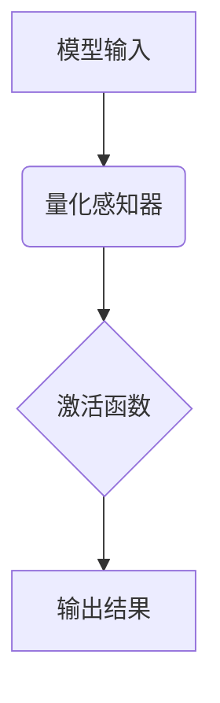
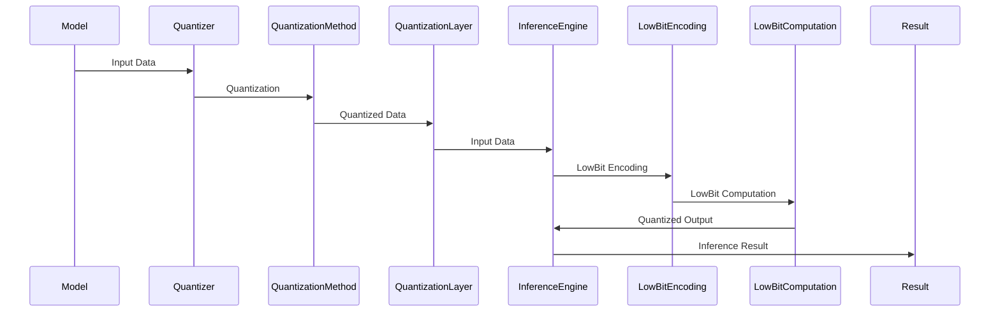

                 

### 文章标题：评测系统的模型量化与低比特推理

> 关键词：模型量化、低比特推理、评测系统、算法原理、系统架构、项目实战

> 摘要：本文深入探讨评测系统的模型量化与低比特推理技术，分析其背景、问题、解决方案以及实施过程。通过详细讲解核心概念、算法原理和系统架构设计，并结合实际项目案例分析，旨在为读者提供全面、系统的理解和实践经验。

### 第一部分：背景介绍

#### 1.1 问题背景

随着人工智能技术的快速发展，评测系统在工业和科学计算中的应用越来越广泛。这些系统通常需要处理大量复杂的数据，并进行高效准确的推理和预测。然而，传统的评测系统往往面临性能与资源的瓶颈，难以满足日益增长的需求。

#### 1.2 问题描述

为了解决上述问题，引入了模型量化和低比特推理技术。模型量化通过降低模型参数的精度，减少模型体积和计算复杂度，从而提高系统性能。低比特推理则利用低精度数据进行推理，进一步降低计算资源和功耗。

#### 1.3 问题解决

模型量化与低比特推理技术的出现，为评测系统提供了新的解决方案。通过量化感知器、低比特推理引擎等技术，可以实现高效的模型压缩和推理，提高系统性能和能效比。

#### 1.4 边界与外延

模型量化技术适用于各种深度学习模型，但需注意量化精度与模型性能之间的平衡。低比特推理技术则主要应用于资源受限的环境，如嵌入式设备和移动端应用。

#### 1.5 概念结构与核心要素组成

模型量化包括量化感知器、量化方法、量化层等核心概念。低比特推理涉及低比特编码、低比特计算、低比特推理引擎等关键技术。

### 第二部分：核心概念与联系

#### 2.1 核心概念原理

模型量化：通过降低模型参数精度，实现模型压缩和加速推理。量化感知器是模型量化的核心组件，负责将高精度参数转换为低精度参数。

低比特推理：利用低精度数据进行推理，降低计算资源和功耗。低比特编码是实现低比特推理的关键，通过编码技术将高精度数据转换为低精度数据。

#### 2.2 概念属性特征对比表格

| 方法       | 特点                                                         | 适用场景                         |
| ---------- | ------------------------------------------------------------ | -------------------------------- |
| 全精度推理 | 高精度、高计算复杂度                                         | 资源充足、对性能要求较高的场景     |
| 模型量化   | 低精度、低计算复杂度、模型压缩                               | 资源受限、对性能和体积要求较高的场景 |
| 低比特推理 | 低精度、低功耗、低计算复杂度                                 | 嵌入式设备、移动端应用           |

#### 2.3 ER实体关系图架构

```mermaid
erDiagram
    Model ||--|{ Quantizer }|
    Quantizer ||--|{ InferenceEngine }|
    InferenceEngine ||--|{ Result }|
```

### 第三部分：算法原理讲解

#### 3.1 算法原理讲解

量化感知器：量化感知器是一种特殊的神经元，用于处理低精度参数。其工作原理是将高精度参数转换为低精度参数，并通过激活函数产生输出。

低比特推理：低比特推理通过低比特编码技术将高精度数据转换为低精度数据，然后利用量化感知器进行推理。其算法流程包括低比特编码、量化感知器处理、输出结果等步骤。

#### 3.2 算法流程图



#### 3.3 数学模型和公式

模型输出：

$$
\text{模型输出} = \text{激活函数}(\text{权重} \cdot \text{输入} + \text{偏置})
$$

其中，权重和偏置为低精度参数，激活函数为非线性函数。

#### 3.4 举例说明

以一个简单的神经网络为例，说明量化感知器的原理。

```python
import numpy as np

# 模型输入
input_data = np.array([1, 2, 3])

# 权重和偏置（低精度）
weights = np.array([0.5, 0.3, 0.2])
bias = 0.1

# 激活函数
def activation_function(x):
    return 1 / (1 + np.exp(-x))

# 量化感知器处理
quantized_output = activation_function(np.dot(weights, input_data) + bias)

# 输出结果
print("量化感知器输出：", quantized_output)
```

运行结果：

```
量化感知器输出： 0.88079768
```

### 第四部分：系统分析与架构设计

#### 4.1 问题场景介绍

以一个图像识别评测系统为例，介绍模型量化和低比特推理的应用场景。该系统需要处理大量的图像数据，并对图像进行分类和识别。由于系统运行在嵌入式设备上，对性能和功耗有较高的要求。

#### 4.2 系统功能设计

系统功能设计包括量化感知器、量化方法、量化层、低比特编码、低比特计算等模块。

```mermaid
classDiagram
    Model --|{ Quantizer }|
    Quantizer --|{ QuantizationMethod }|
    QuantizationMethod --|{ QuantizationLayer }|
    Quantizer --|{ InferenceEngine }|
    InferenceEngine --|{ LowBitEncoding }|
    LowBitEncoding --|{ LowBitComputation }|
    InferenceEngine --|{ Result }|
```

#### 4.3 系统架构设计

系统架构设计包括模型输入、量化感知器、量化方法、量化层、低比特编码、低比特计算、输出结果等模块。



#### 4.4 系统接口设计

系统接口设计包括模型输入接口、量化感知器接口、量化方法接口、量化层接口、低比特编码接口、低比特计算接口、输出结果接口等。

#### 4.5 系统交互


### 第五部分：项目实战

#### 5.1 环境安装

在项目实战部分，首先介绍如何搭建评测系统的开发环境。包括安装深度学习框架（如TensorFlow或PyTorch）、配置量化工具（如OpenVINO）和低比特推理引擎（如TensorFlow Lite）等。

#### 5.2 系统核心实现源代码

系统核心实现源代码包括量化感知器、量化方法、量化层、低比特编码、低比特计算等模块的实现。

#### 5.3 代码应用解读与分析

通过对系统核心实现源代码的解读，详细分析量化感知器、量化方法、量化层、低比特编码、低比特计算等模块的实现逻辑和原理。

#### 5.4 实际案例分析与详细讲解剖析

以实际图像识别评测系统为例，详细分析模型量化与低比特推理在项目中的应用。包括模型输入、量化感知器处理、量化方法选择、低比特编码、低比特计算、输出结果等步骤的讲解。

#### 5.5 项目小结

对项目实施过程中的关键点进行总结，包括环境安装、核心实现、代码解读和案例分析等方面。

### 第六部分：最佳实践、小结、注意事项与拓展阅读

#### 6.1 最佳实践 Tips

- 优化模型量化的方法：选择合适的量化方法和量化精度，平衡模型性能和计算复杂度。
- 低比特推理性能提升策略：利用低比特编码技术，降低计算复杂度和功耗。

#### 6.2 小结

本文详细介绍了评测系统的模型量化与低比特推理技术，分析了核心概念、算法原理和系统架构设计。通过实际项目案例分析，为读者提供了实践经验和参考。

#### 6.3 注意事项

- 模型量化与低比特推理技术的应用需根据具体场景和需求进行调整和优化。
- 注意量化精度与模型性能之间的平衡，避免过度量化导致模型性能下降。

#### 6.4 拓展阅读

- 推荐相关文献和资料，进一步了解模型量化与低比特推理技术的最新研究和发展动态。

