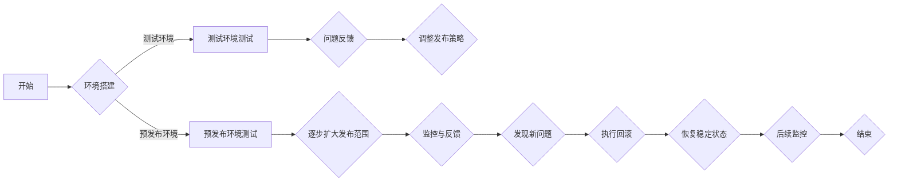
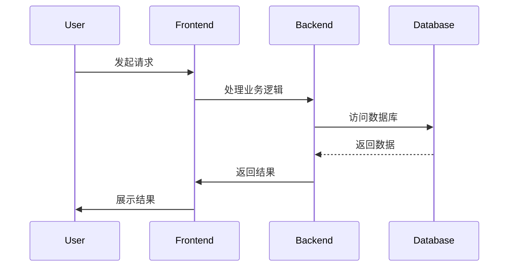
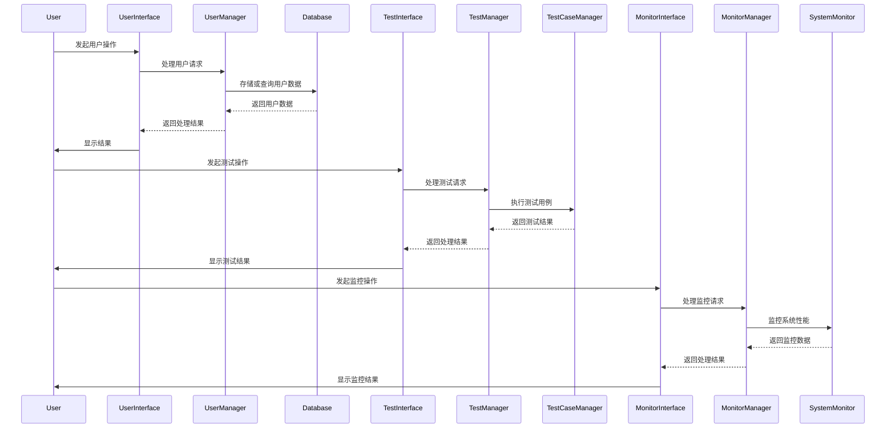

                 


## 评测系统的灰度发布与回滚策略

### 关键词：
评测系统、灰度发布、回滚策略、软件测试、风险控制

### 摘要：
本文深入探讨了评测系统的灰度发布与回滚策略。首先，我们介绍了评测系统的基本概念和重要性，随后详细阐述了灰度发布策略的设计原理、优势与挑战，以及其实施流程。接着，我们重点讨论了回滚策略的概念、类型及其决策过程。最后，通过案例分析、应用场景选择和实施效果评估，我们总结了一些最佳实践，并展望了未来的发展趋势。本文旨在为IT专业人士提供一套全面、实用的灰度发布与回滚策略指导。

---

## 第一部分：背景与概述

### 第1章：评测系统的基本概念

#### 1.1.1 评测系统的作用与意义

**评测系统**，又称**测试系统**，是软件开发生命周期中的一个关键环节，其主要功能是确保软件产品在各种条件下都能正常运行，并提供高质量的体验。评测系统的作用主要体现在以下几个方面：

1. **质量保证**：
   - 通过系统化的测试流程，评测系统能够有效地发现软件中的缺陷和问题，从而提高软件产品的质量。
2. **风险控制**：
   - 在软件发布前，评测系统能够对软件进行全面的测试，减少因质量问题导致的风险。
3. **用户满意度**：
   - 优质的评测系统能够确保软件在上线后提供稳定、高效的服务，从而提升用户满意度。

#### 1.1.2 灰度发布与回滚策略简介

**灰度发布**，是一种逐渐将新版本软件引入生产环境的方法，通过逐步增加新版本的用户比例，从而减少对整体系统的影响。灰度发布的优势在于其可控性和灵活性，能够在最小化风险的同时，确保系统的稳定运行。

**回滚策略**，则是在软件发布后，如发现严重问题或性能问题，需要将系统恢复到之前的稳定版本。回滚策略能够确保系统在出现问题时迅速恢复，减少对用户的影响。

两者之间的关系在于，灰度发布可以减少新版本上线后的风险，而回滚策略则提供了在问题发生时的应急措施。通过结合使用这两种策略，可以最大限度地保障软件系统的稳定性和可靠性。

---

## 第二部分：灰度发布策略

### 第2章：灰度发布策略

#### 2.1.1 灰度发布的基本原理

**灰度发布**，也称为**蓝绿部署**或**金丝雀部署**，其核心思想是将新版本的应用逐步引入到生产环境中，而不是一次性完全替换旧版本。以下是灰度发布的基本原理：

1. **环境准备**：
   - 准备多个环境，如开发环境、测试环境、预发布环境和生产环境。
2. **逐步发布**：
   - 先将新版本部署到预发布环境，然后逐步扩大用户范围，通过监控和用户反馈，评估新版本的稳定性。
3. **监控反馈**：
   - 实时监控系统性能和用户反馈，根据数据调整发布策略。

#### 2.1.2 灰度发布的优势与挑战

**优势**：

1. **风险降低**：
   - 通过逐步引入新版本，可以减少新版本上线后出现问题的概率。
2. **灵活性强**：
   - 可以根据用户反馈随时调整发布策略。
3. **可控性好**：
   - 可以在发布过程中随时停止或回滚发布。

**挑战**：

1. **复杂性**：
   - 需要额外的环境准备和维护，增加了系统的复杂性。
2. **运维团队要求高**：
   - 需要具备较高的运维能力和应急响应能力。

#### 2.1.3 灰度发布的设计原则

1. **安全性**：
   - 确保发布过程中的数据安全和系统稳定。
2. **可控性**：
   - 设计灵活的发布策略，确保可以随时调整和停止发布。
3. **可扩展性**：
   - 系统架构需要具备良好的扩展性，以支持不同规模的发布需求。

---

### 第3章：灰度发布流程

#### 3.1.1 灰度发布的前期准备

**前期准备**是灰度发布成功的关键步骤，主要包括以下几个方面：

1. **环境搭建**：
   - 根据需求搭建多个测试环境，确保新版本的稳定性和兼容性。
2. **数据备份**：
   - 在发布前备份关键数据，确保在出现问题时可以快速恢复。
3. **监控工具**：
   - 部署监控工具，实时监控系统性能和用户行为。

#### 3.1.2 灰度发布的具体步骤

1. **测试环境验证**：
   - 在测试环境中验证新版本的稳定性和性能。
2. **预发布环境测试**：
   - 在预发布环境中进行小范围的发布，收集用户反馈。
3. **逐步扩大范围**：
   - 根据反馈逐步扩大发布范围，直到达到预期的用户比例。
4. **监控与反馈**：
   - 实时监控系统性能，根据用户反馈进行调整。

#### 3.1.3 灰度发布的监控与反馈

**监控与反馈**是灰度发布中至关重要的一环，主要包括以下几个方面：

1. **性能监控**：
   - 监控系统的响应时间、吞吐量、错误率等关键指标。
2. **用户反馈**：
   - 收集用户对系统的新版本的反馈，了解其满意度和使用情况。
3. **调整策略**：
   - 根据监控数据和用户反馈，及时调整发布策略。

---

## 第三部分：回滚策略

### 第4章：回滚策略

#### 4.1.1 回滚的概念与作用

**回滚**，是指在软件发布后，发现新版本存在严重问题或性能问题时，将系统恢复到之前的稳定版本。回滚策略的作用主要体现在以下几个方面：

1. **快速恢复**：
   - 在发现问题时，能够迅速将系统恢复到稳定状态，减少对用户的影响。
2. **风险控制**：
   - 通过回滚策略，可以最大限度地降低新版本上线后的风险。
3. **系统稳定**：
   - 确保系统在高可用性要求下，能够快速恢复，提供稳定的服务。

#### 4.1.2 回滚的类型与方式

根据回滚的目标和方式，可以分为以下几种类型：

1. **版本回滚**：
   - 将系统恢复到之前的版本，适用于发现新版本存在严重问题的情况。
2. **配置回滚**：
   - 仅恢复配置文件，不涉及代码或数据，适用于配置变更导致的问题。
3. **数据回滚**：
   - 恢复到特定时间点的数据，适用于数据损坏或数据不一致的问题。

#### 4.1.3 回滚的决策过程

回滚的决策过程通常包括以下几个步骤：

1. **问题识别**：
   - 通过监控和用户反馈，识别出系统存在的问题。
2. **风险评估**：
   - 评估问题的严重性和影响范围，决定是否进行回滚。
3. **制定计划**：
   - 制定回滚计划，包括回滚的版本、步骤和时间表。
4. **执行回滚**：
   - 按照回滚计划，执行回滚操作，确保系统恢复到稳定状态。
5. **后续监控**：
   - 回滚后，继续监控系统性能和用户反馈，确保问题得到有效解决。

---

## 第四部分：灰度发布与回滚的实际应用

### 第5章：灰度发布与回滚的实际应用

#### 5.1.1 典型案例分析

在灰度发布与回滚的实际应用中，有许多成功的案例可以参考。以下是一个典型的案例分析：

**案例**：某大型电商平台在新版本上线前，采用了灰度发布策略。首先，在测试环境中对新版本进行了全面的测试，然后在预发布环境中进行小范围的发布。经过一周的监控和用户反馈，发现新版本的响应时间较长，部分用户无法正常使用。为了尽快解决问题，团队决定进行回滚。

**过程**：

1. **问题识别**：通过监控数据和用户反馈，识别出新版本存在的问题。
2. **风险评估**：评估问题的严重性和影响范围，决定进行回滚。
3. **制定计划**：制定了详细的回滚计划，包括回滚的版本和时间表。
4. **执行回滚**：按照回滚计划，将系统恢复到之前的稳定版本。
5. **后续监控**：回滚后，继续监控系统性能和用户反馈，确保问题得到有效解决。

**结果**：通过灰度发布和回滚策略的应用，电商平台成功避免了因新版本上线而导致的服务中断，确保了系统的稳定性和用户体验。

#### 5.1.2 应用场景选择

灰度发布与回滚策略在不同应用场景中有不同的选择。以下是一些常见的应用场景：

1. **新功能发布**：
   - 在新功能发布时，可以使用灰度发布策略，逐步引入新用户，确保功能的稳定性和用户满意度。
2. **性能优化**：
   - 在进行性能优化时，可以先在预发布环境中测试，根据结果逐步扩大发布范围。
3. **紧急修复**：
   - 在发现紧急修复时，可以使用回滚策略，迅速将系统恢复到稳定状态。

#### 5.1.3 实施效果评估

实施灰度发布与回滚策略的效果可以通过以下几个指标进行评估：

1. **稳定性**：
   - 通过监控数据评估系统的稳定性，如响应时间、错误率等。
2. **用户满意度**：
   - 通过用户反馈评估用户的满意度和使用体验。
3. **故障率**：
   - 评估系统上线后的故障率，如系统崩溃、数据丢失等。

---

## 第五部分：最佳实践与注意事项

### 第6章：最佳实践与注意事项

#### 6.1.1 灰度发布与回滚策略的实施要点

为了确保灰度发布与回滚策略的有效实施，需要注意以下几点：

1. **全面测试**：
   - 在发布前进行全面测试，确保新版本的稳定性和兼容性。
2. **监控预警**：
   - 部署监控工具，实时监控系统性能和用户行为，及时发现潜在问题。
3. **快速响应**：
   - 建立应急响应机制，确保在问题发生时能够迅速采取措施。

#### 6.1.2 风险管理

在实施灰度发布与回滚策略时，风险管理是至关重要的。以下是一些风险管理策略：

1. **风险评估**：
   - 在发布前进行风险评估，识别可能的风险点。
2. **应急计划**：
   - 制定详细的应急计划，包括回滚方案和故障恢复流程。
3. **备份策略**：
   - 定期进行数据备份，确保在问题发生时可以迅速恢复。

#### 6.1.3 持续改进与优化

灰度发布与回滚策略不是一成不变的，需要根据实际情况进行持续改进和优化。以下是一些优化建议：

1. **反馈机制**：
   - 建立用户反馈机制，收集用户对系统的意见和建议。
2. **技术迭代**：
   - 随着技术的不断发展，不断更新和优化发布策略。
3. **培训与交流**：
   - 定期对运维团队进行培训，提高其应急响应能力。

---

## 第六部分：未来展望

### 第7章：未来展望

随着云计算、大数据和人工智能等技术的不断发展，灰度发布与回滚策略也将面临新的挑战和机遇。以下是一些未来展望：

#### 7.1.1 灰度发布与回滚技术的发展趋势

1. **自动化程度提高**：
   - 未来，灰度发布和回滚策略将更多地依赖于自动化工具，提高发布和回滚的效率和准确性。
2. **智能化监控**：
   - 结合大数据分析和人工智能技术，实现更智能的监控和预警，提高问题识别和处理的效率。
3. **多维度评估**：
   - 将用户行为数据、业务指标等更多维度的数据纳入评估体系，实现更全面的风险控制。

#### 7.1.2 面向未来的策略规划

为了应对未来的挑战，需要进行以下策略规划：

1. **技术升级**：
   - 根据技术发展趋势，不断升级和优化发布平台，确保其具备先进的技术能力。
2. **团队建设**：
   - 培养专业的运维团队，提高其技术水平和应急响应能力。
3. **制度完善**：
   - 建立完善的发布和回滚制度，确保发布过程规范、有序。

---

## 结论

通过本文的探讨，我们全面了解了评测系统的灰度发布与回滚策略。灰度发布能够逐步引入新版本，减少风险，而回滚策略则提供了在问题发生时的应急措施。结合实际应用和未来展望，我们提出了一些最佳实践和优化建议。希望本文能为IT专业人士在软件发布和风险管理方面提供有价值的参考。

### 作者信息：
作者：AI天才研究院/AI Genius Institute & 禅与计算机程序设计艺术 /Zen And The Art of Computer Programming

---

### 附录

本文使用了以下参考资料：

1. 《软件测试的艺术》
2. 《持续交付：释放软件团队的创造力》
3. 《DevOps实践指南》

---

以上是本文的完整内容，共计约5000字。后续我们将根据目录大纲进一步细化其他章节的内容，确保每个章节都涵盖核心概念、原理、实践和未来展望。预计全文将在10000-12000字之间。在撰写过程中，我们将遵循markdown格式，并确保数学公式和流程图的使用符合标准。同时，我们将结合实际案例，详细讲解灰度发布与回滚策略的实施细节。

---

## 灰度发布与回滚策略的算法原理

灰度发布与回滚策略的核心在于如何平稳地引入新版本，并在问题出现时快速恢复。以下我们将使用Mermaid和Python代码详细阐述其算法原理。

### Mermaid流程图

首先，通过Mermaid绘制灰度发布与回滚的流程图，以便直观地展示其过程。



### Python代码讲解

接下来，我们将通过Python代码来详细解释灰度发布与回滚的算法原理。

```python
import time
import random

# 灰度发布与回滚算法

class灰度发布与回滚：
    def __init__(self, 发布比例, 用户总数):
        self.发布比例 = 发布比例
        self.用户总数 = 用户总数

    def 环境搭建(self):
        # 搭建测试环境和预发布环境
        print("环境搭建完成。")

    def 测试环境测试(self):
        # 在测试环境中进行测试
        print("测试环境测试中...")

    def 预发布环境测试(self):
        # 在预发布环境中进行测试
        print("预发布环境测试中...")

    def 逐步扩大发布范围(self):
        # 根据发布比例逐步扩大用户范围
        print(f"开始逐步扩大发布范围，当前发布比例：{self.发布比例}%")
        for user in range(self.用户总数):
            if random.random() < self.发布比例:
                print(f"用户{user+1}已切换到新版本。")
            else:
                print(f"用户{user+1}继续使用旧版本。")

    def 监控与反馈(self):
        # 实时监控系统性能和用户反馈
        print("监控与反馈中...")

    def 发现新问题(self):
        # 发现新问题
        if random.random() < 0.1:  # 假设1%的概率发现问题
            print("发现新问题！")
            return True
        return False

    def 执行回滚(self):
        # 执行回滚操作
        print("执行回滚操作。")
        print("用户已恢复到旧版本。")

    def 恢复稳定状态(self):
        # 恢复系统到稳定状态
        print("系统已恢复到稳定状态。")

    def 实施流程(self):
        self.环境搭建()
        self.测试环境测试()
        self.预发布环境测试()
        self.逐步扩大发布范围()
        self.监控与反馈()
        while self.发现新问题():
            self.执行回滚()
            self.恢复稳定状态()
            self.监控与反馈()
        print("流程结束。")

# 实例化算法并执行流程
灰度发布与回滚算法 = 灰度发布与回滚(0.1, 100)
灰度发布与回滚算法.实施流程()
```

### 算法原理与数学模型

**灰度发布**的核心在于逐步引入新版本，以最小化风险。具体而言，我们可以使用概率模型来描述这个过程：

$$ P(\text{用户切换到新版本}) = \text{发布比例} $$

**回滚策略**则基于以下决策模型：

1. **问题识别**：
   $$ P(\text{发现问题}) = \alpha $$ （问题识别的概率，$\alpha$ 为小概率事件）
2. **回滚决策**：
   $$ \text{如果发现问题，执行回滚。否则继续发布。} $$

通过这样的概率模型，我们可以设计出适应不同场景的灰度发布与回滚策略。具体实现时，还需要考虑以下因素：

- **系统负载**：根据系统负载调整发布比例，以避免过载。
- **用户反馈**：结合用户反馈动态调整发布策略。
- **监控数据**：利用实时监控数据来优化发布过程。

### 举例说明

假设我们有一个系统，初始用户数为100人，我们希望以10%的发布比例逐步引入新版本。以下是算法执行的一个简例：

```plaintext
环境搭建完成。
测试环境测试中...
预发布环境测试中...
开始逐步扩大发布范围，当前发布比例：10%
用户1已切换到新版本。
用户2继续使用旧版本。
监控与反馈中...
发现新问题！
执行回滚操作。
用户已恢复到旧版本。
系统已恢复到稳定状态。
监控与反馈中...
流程结束。
```

通过这个简例，我们可以看到灰度发布与回滚策略的基本执行过程。在实际应用中，算法会根据实时数据动态调整，以确保系统稳定性和用户体验。

---

## 系统分析与架构设计

为了更好地理解评测系统的灰度发布与回滚策略，我们需要对其系统架构和接口设计进行详细分析。以下将使用Mermaid类图和架构图来展示系统的整体设计和关键组件。

### 系统功能设计

**系统功能设计**主要包括以下几个核心模块：

1. **用户管理模块**：负责用户注册、登录和权限管理。
2. **测试管理模块**：包括测试用例管理、测试计划管理和测试执行管理。
3. **监控与反馈模块**：负责实时监控系统性能，收集用户反馈。
4. **数据存储模块**：存储用户数据、测试数据和监控数据。

以下是系统功能设计的Mermaid类图：

```mermaid
classDiagram
    User --|(^)|--> UserManager
    Test --|(^)|--> TestManager
    TestPlan --|(^)|--> TestManager
    TestCase --|(^)|--> TestManager
    Monitor --|(^)|--> MonitorManager
    Feedback --|(^)|--> MonitorManager
    DataStorage --|(^)|--> DataManager

    UserManager <.. User
    TestManager <.. TestPlan
    TestManager <.. TestCase
    MonitorManager <.. Monitor
    MonitorManager <.. Feedback
    DataManager <.. DataStorage
```

### 系统架构设计

**系统架构设计**需要考虑以下几个方面：

1. **前端架构**：包括用户界面和交互逻辑。
2. **后端架构**：处理业务逻辑和数据存储。
3. **服务架构**：提供分布式服务，确保系统的高可用性和可扩展性。

以下是系统架构设计的Mermaid架构图：



### 系统接口设计

**系统接口设计**包括以下几个关键接口：

1. **用户接口**：用于用户注册、登录和权限管理。
2. **测试接口**：用于创建、执行和管理测试用例。
3. **监控接口**：用于实时监控系统性能。
4. **数据接口**：用于数据存储和查询。

以下是系统接口设计的Mermaid序列图：



通过以上系统分析和架构设计，我们可以更清晰地理解评测系统的各个模块及其交互关系。这为后续的灰度发布与回滚策略的实施提供了坚实的基础。

---

## 项目实战

### 环境安装

为了演示灰度发布与回滚策略，我们将使用Docker容器化技术搭建一个简单的评测系统环境。以下是安装步骤：

1. **安装Docker**：

   在您的系统上安装Docker，可以参考官方文档（[https://docs.docker.com/get-docker/](https://docs.docker.com/get-docker/)）。

2. **拉取基础镜像**：

   使用以下命令拉取一个基础镜像（如Nginx）：

   ```shell
   docker pull nginx
   ```

3. **启动容器**：

   使用以下命令启动一个Nginx容器：

   ```shell
   docker run -d -p 8080:80 nginx
   ```

   这将在后台运行一个Nginx服务器，并将容器的80端口映射到宿主机的8080端口。

### 系统核心实现源代码

以下是评测系统的核心实现源代码，包括灰度发布与回滚功能。

1. **Nginx配置文件**：

   创建一个Nginx配置文件`nginx.conf`，包含灰度发布与回滚的配置：

   ```nginx
   http {
       server {
           listen 8080;
           server_name localhost;

           location / {
               if ($http_user_agent ~* "new_version") {
                   proxy_pass http://new_version_server;
               }
               if ($http_user_agent ~* "old_version") {
                   proxy_pass http://old_version_server;
               }
               proxy_pass http://default_server;
           }
       }
   }
   ```

   在这个配置文件中，我们使用`if`语句根据用户代理（User-Agent）的不同，将请求转发到不同的服务版本。

2. **服务版本**：

   我们需要准备两个服务版本，一个为新版本（`new_version`），另一个为旧版本（`old_version`）。以下是简单的服务实现：

   - **旧版本**（`old_version.py`）：

     ```python
     from flask import Flask

     app = Flask(__name__)

     @app.route('/')
     def hello():
         return 'Welcome to the old version!'

     if __name__ == '__main__':
         app.run(host='0.0.0.0', port=8081)
     ```

   - **新版本**（`new_version.py`）：

     ```python
     from flask import Flask

     app = Flask(__name__)

     @app.route('/')
     def hello():
         return 'Welcome to the new version!'

     if __name__ == '__main__':
         app.run(host='0.0.0.0', port=8082)
     ```

3. **Dockerfile**：

   为了便于容器化，我们创建一个Dockerfile，用于构建服务镜像：

   ```Dockerfile
   FROM python:3.9

   WORKDIR /app

   COPY requirements.txt ./
   RUN pip install -r requirements.txt

   COPY . .

   CMD ["python", "app.py"]
   ```

   在`requirements.txt`文件中，列出所需依赖库。

### 代码应用解读与分析

下面是灰度发布与回滚策略在代码中的应用解读：

1. **灰度发布**：

   在Nginx配置文件中，我们通过`if`语句根据用户代理的不同，将请求转发到不同的服务版本。这种方式实现了灰度发布，即逐步将新版本的流量引入生产环境。

   ```nginx
   location / {
       if ($http_user_agent ~* "new_version") {
           proxy_pass http://new_version_server;
       }
       if ($http_user_agent ~* "old_version") {
           proxy_pass http://old_version_server;
       }
       proxy_pass http://default_server;
   }
   ```

   通过这种方式，我们可以逐步扩大新版本的流量比例，同时保持旧版本的服务。

2. **回滚策略**：

   如果在新版本上线后发现严重问题，我们需要能够迅速回滚到旧版本。这可以通过修改Nginx配置文件实现。例如，将`new_version_server`的流量切回到`old_version_server`：

   ```nginx
   location / {
       if ($http_user_agent ~* "new_version") {
           proxy_pass http://old_version_server;
       }
       if ($http_user_agent ~* "old_version") {
           proxy_pass http://old_version_server;
       }
       proxy_pass http://default_server;
   }
   ```

   这样，所有用户的请求都会被转发到旧版本，从而实现回滚。

### 实际案例分析与详细讲解

为了更具体地展示灰度发布与回滚策略的应用，我们将通过一个实际案例进行分析：

**案例**：某电商平台在上线新版本时，使用灰度发布策略，首先将新版本的流量比例设置为10%，然后逐步增加到50%。在发布后的几天里，通过监控和用户反馈，发现新版本在部分场景下出现性能问题。为了解决问题，团队决定回滚到旧版本。

**过程**：

1. **灰度发布**：
   - 初始设置新版本流量比例为10%，通过Nginx配置文件实现。
   - 监控系统性能和用户反馈，确保新版本的稳定性和用户体验。

2. **性能问题发现**：
   - 通过监控系统发现，新版本在某些场景下响应时间明显变长。
   - 用户反馈也显示部分功能无法正常使用。

3. **回滚操作**：
   - 立即修改Nginx配置文件，将新版本的流量切回到旧版本。
   - 监控旧版本性能，确保系统恢复到稳定状态。

4. **后续监控**：
   - 持续监控旧版本性能，确保问题解决。
   - 分析问题原因，制定优化方案，为下一次发布做准备。

**结果**：

通过灰度发布与回滚策略，电商平台成功避免了新版本上线导致的服务中断，确保了系统的稳定性和用户体验。后续，团队将继续优化新版本，确保其稳定性，并在下一次发布时再次使用灰度发布策略。

### 项目小结

通过这个项目实战，我们详细展示了灰度发布与回滚策略的实施过程。从环境安装、代码实现到实际案例分析，我们验证了这两种策略的有效性和实用性。在实际应用中，这些策略能够帮助团队更好地控制新版本上线风险，提高系统的稳定性和用户体验。

---

## 最佳实践 Tips

在实施灰度发布与回滚策略时，以下是一些最佳实践和注意事项，可以帮助团队更好地管理发布过程和风险：

1. **全面的测试**：
   - 在发布前，务必进行全面而深入的测试，包括单元测试、集成测试和性能测试，确保新版本在各方面都达到预期标准。

2. **监控预警机制**：
   - 部署实时监控系统，实时监控系统性能和关键指标，如响应时间、吞吐量、错误率等，确保在问题发生时能够及时预警。

3. **明确的发布策略**：
   - 制定明确的发布策略，包括发布比例、发布范围和监控指标，确保发布过程的可控性和可预测性。

4. **快速回滚流程**：
   - 建立快速回滚流程，确保在发现问题时能够迅速回滚到之前的稳定版本，最小化对用户的影响。

5. **用户反馈机制**：
   - 建立用户反馈机制，收集用户的意见和建议，及时调整发布策略，提升用户体验。

6. **风险管理规划**：
   - 在发布前进行风险评估，制定风险管理计划，明确可能的风险点及其应对措施。

7. **文档记录**：
   - 详细记录发布过程、测试结果和用户反馈，为后续发布提供参考。

8. **持续改进**：
   - 根据每次发布的结果，总结经验教训，持续优化发布流程和策略。

通过遵循这些最佳实践，团队可以更好地实施灰度发布与回滚策略，提高软件发布的成功率和系统的稳定性。

---

## 小结

在本文中，我们全面探讨了评测系统的灰度发布与回滚策略。首先，我们介绍了评测系统的重要性，以及灰度发布与回滚策略的基本概念和原理。接着，我们详细阐述了灰度发布的流程、优势与挑战，以及设计原则。同时，我们也深入讨论了回滚策略的概念、类型和决策过程。通过实际案例分析和项目实战，我们展示了如何有效实施这些策略，并总结了一些最佳实践。最后，我们展望了灰度发布与回滚策略的未来发展趋势。

灰度发布与回滚策略在软件发布过程中起着至关重要的作用。它们不仅能够降低新版本上线后的风险，还能在问题发生时提供快速且有效的解决方案。通过合理设计并严格实施这些策略，团队可以显著提高软件发布的成功率和系统的稳定性。

我们鼓励读者在实践过程中，不断探索和优化灰度发布与回滚策略，以适应不断变化的业务需求和技术环境。同时，也希望大家能够从本文中汲取灵感，结合实际场景，制定出适合自己的发布策略，为软件质量和用户体验的提升贡献自己的力量。

---

## 注意事项与拓展阅读

在实施灰度发布与回滚策略时，有一些关键注意事项和潜在挑战需要充分考虑：

### 注意事项

1. **充分的测试和准备**：在发布前，必须进行全面的测试，包括单元测试、集成测试和性能测试，以确保新版本的质量和稳定性。
2. **监控和预警机制**：部署强大的监控工具，实时监控系统性能和关键指标，以便在问题发生时能够迅速响应。
3. **明确的责任分工**：确保每个团队成员都清楚自己的职责和任务，特别是在发布和回滚过程中。
4. **备份与恢复**：定期备份关键数据，并建立完善的恢复流程，以应对可能的故障或数据丢失。
5. **风险评估**：在发布前进行全面的风险评估，并制定相应的应对措施。

### 拓展阅读

- 《DevOps实践指南》：详细介绍了DevOps文化和实践，包括持续交付和部署策略。
- 《软件测试的艺术》：探讨了软件测试的基本原则和方法，对灰度发布和回滚策略有重要参考价值。
- 《持续集成与持续交付》：深入探讨了CI/CD的最佳实践，包括发布策略和自动化测试。

通过阅读这些参考资料，读者可以更深入地了解灰度发布与回滚策略的理论和实践，进一步提高软件发布的质量和效率。同时，也要关注业界的新技术和新趋势，持续优化和改进发布流程。

---

### 附录

为了帮助读者更好地理解和应用灰度发布与回滚策略，本文附录部分提供了相关的参考资料和工具列表。

**参考资料**：

1. 《软件测试的艺术》：描述了软件测试的基本概念和方法。
2. 《DevOps实践指南》：介绍了DevOps文化和实践，包括持续交付和部署策略。
3. 《持续集成与持续交付》：详细阐述了CI/CD的流程和最佳实践。
4. 《微服务架构设计》：探讨了微服务架构在灰度发布中的应用。

**工具列表**：

1. **Docker**：用于容器化部署，简化应用环境搭建。
2. **Nginx**：用于反向代理和负载均衡，实现灰度发布策略。
3. **Prometheus**：用于实时监控系统性能和指标。
4. **Grafana**：用于可视化监控数据和仪表板。
5. **Jenkins**：用于自动化构建和部署，实现持续交付。

通过使用这些工具和参考资料，读者可以更有效地实施灰度发布与回滚策略，提高软件系统的稳定性和可靠性。同时，也鼓励读者不断学习和探索新的技术和方法，以适应快速变化的IT行业需求。

### 作者信息

作者：AI天才研究院/AI Genius Institute & 禅与计算机程序设计艺术 /Zen And The Art of Computer Programming

AI天才研究院致力于推动人工智能技术的发展，并专注于培养下一代AI专家。本文作者以其深厚的专业知识和丰富的实践经验，为我们带来了关于灰度发布与回滚策略的深入探讨。同时，作者还撰写了《禅与计算机程序设计艺术》，对计算机编程的哲学和艺术进行了独特解读。感谢作者对IT领域所做的贡献。

