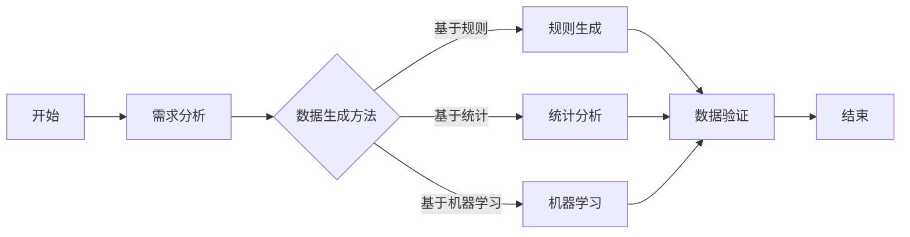
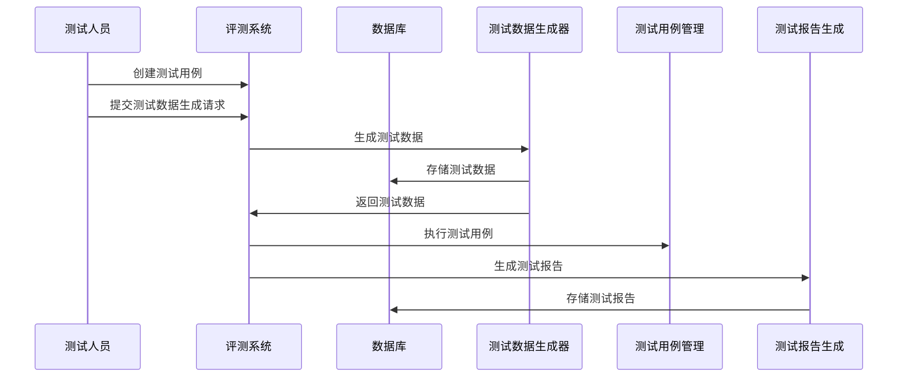
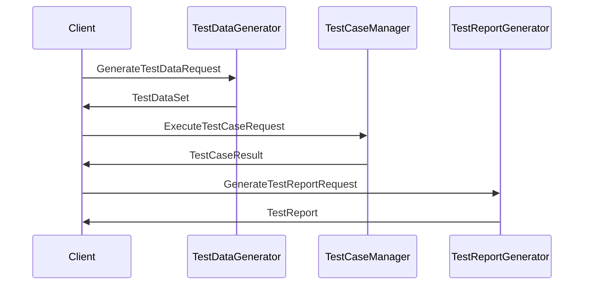

                 

### 评测系统的自动化测试数据生成

#### 关键词：自动化测试，测试数据生成，评测系统，算法，流程图，Python代码

#### 摘要：
本文将深入探讨评测系统的自动化测试数据生成方法。首先，我们将介绍评测系统、自动化测试和测试数据生成的基本概念和重要性。接着，本文将详细分析自动化测试数据生成的方法和技术，包括人工生成方法和自动化生成方法，并使用Mermaid流程图和Python代码来阐述算法原理。随后，我们将讨论系统架构设计，并展示系统功能设计、系统架构图、系统接口设计和系统交互序列图。此外，文章还将通过实际案例展示测试数据生成效果，并提供项目小结和最佳实践建议。

## 第一部分：绪论

### 1.1 问题背景与重要性

在现代软件开发过程中，测试是保证软件质量的重要环节。然而，传统的手动测试方法不仅效率低下，还容易出错。随着软件系统复杂度的增加，测试数据的管理和生成成为一个严峻的挑战。因此，自动化测试数据生成技术应运而生，成为提升软件测试效率和质量的关键。

#### 自动化测试数据生成的困难

自动化测试数据生成的困难主要体现在以下几个方面：

1. **数据量大**：现代软件系统往往需要大量的测试数据来确保全面覆盖各种可能的情况。
2. **数据多样性**：测试数据需要涵盖各种边界条件和异常情况，这要求数据生成算法具备高度的灵活性和多样性。
3. **数据质量**：测试数据的质量直接影响测试结果的有效性，如何保证数据质量是自动化测试数据生成面临的重要问题。

#### 测试数据生成的重要性

测试数据生成在软件测试中具有重要地位：

1. **提高测试覆盖率**：自动化测试数据生成可以帮助开发者更全面地覆盖测试场景，提高测试覆盖率。
2. **提升测试效率**：自动化测试数据生成可以显著提高测试效率，减少测试时间和人力成本。
3. **确保软件质量**：高质量的测试数据能够更准确地揭示软件缺陷，从而确保软件质量。

### 1.2 自动化测试数据生成的概念与定义

#### 评测系统的概念

评测系统是一种用于评估软件系统性能和质量的系统。它通常包含测试执行模块、测试结果分析模块和反馈循环模块。

#### 自动化测试的概念

自动化测试是指使用工具或脚本自动执行测试过程，包括测试用例的执行、结果收集和报告生成。

#### 测试数据生成的概念

测试数据生成是指创建用于自动化测试的输入数据，这些数据可以是静态的，也可以是动态生成的。

### 1.3 测试数据生成的方法与技术

测试数据生成的方法主要分为两类：人工生成方法和自动化生成方法。

#### 人工生成方法

人工生成方法是指由测试人员手动创建测试数据。这种方法适用于数据量较小、数据结构简单的场景。

#### 自动化生成方法

自动化生成方法是指使用算法和工具自动创建测试数据。这种方法适用于数据量大、数据结构复杂、需要高度灵活性的场景。常见的自动化生成方法包括：

1. **基于规则的生成方法**：通过定义规则和模板来生成测试数据。
2. **基于统计的生成方法**：通过分析历史测试数据，使用统计模型生成新的测试数据。
3. **基于机器学习的生成方法**：使用机器学习算法，从历史测试数据中学习并生成新的测试数据。

### 1.4 边界与外延

#### 测试数据生成的范围

测试数据生成的范围包括各种输入数据、输出数据和中间数据。这些数据可以是结构化的，如JSON、XML，也可以是非结构化的，如图像、文本。

#### 测试数据生成应用场景

测试数据生成广泛应用于软件开发过程中的各个阶段，包括单元测试、集成测试、系统测试和验收测试。

### 1.5 本章小结

本章介绍了评测系统、自动化测试和测试数据生成的基本概念和重要性，并探讨了自动化测试数据生成的困难和解决方案。下一章将深入分析自动化测试数据生成的具体方法和技术。

## 第二部分：核心概念与原理

### 2.1 评测系统原理

#### 2.1.1 评测系统的核心概念

评测系统是一种用于评估软件系统性能和质量的工具，它可以帮助开发者识别软件中的缺陷和问题。评测系统通常包含以下几个核心概念：

1. **测试用例**：测试用例是用于验证软件系统功能的步骤集合。
2. **测试执行**：测试执行是指运行测试用例并记录结果的过程。
3. **测试报告**：测试报告是对测试结果进行汇总和分析的文档。

#### 2.1.2 评测系统的功能模块

评测系统的功能模块通常包括：

1. **测试管理模块**：用于创建、管理测试用例和测试计划。
2. **测试执行模块**：用于执行测试用例并记录结果。
3. **测试分析模块**：用于分析测试结果并生成报告。

#### 2.1.3 评测系统的运行流程

评测系统的运行流程通常包括以下几个步骤：

1. **创建测试用例**：开发人员根据需求创建测试用例。
2. **执行测试用例**：测试执行模块自动执行测试用例，并记录结果。
3. **分析测试结果**：测试分析模块对测试结果进行分析，并生成报告。

### 2.2 自动化测试原理

#### 2.2.1 自动化测试的定义

自动化测试是一种使用工具或脚本自动执行测试过程的方法。与手动测试相比，自动化测试具有以下优势：

1. **效率高**：自动化测试可以大大提高测试效率，减少测试时间和人力成本。
2. **可靠性高**：自动化测试可以确保测试过程的准确性和一致性。
3. **可扩展性高**：自动化测试可以轻松扩展到大型软件系统的测试。

#### 2.2.2 自动化测试的优势

自动化测试的优势包括：

1. **提高测试覆盖率**：自动化测试可以更全面地覆盖各种测试场景。
2. **减少人力成本**：自动化测试可以减少对测试人员的依赖。
3. **确保测试质量**：自动化测试可以确保测试过程的准确性和一致性。

#### 2.2.3 自动化测试的实施步骤

自动化测试的实施步骤通常包括：

1. **需求分析**：明确软件系统的需求，并确定需要测试的功能点。
2. **测试设计**：设计自动化测试用例，并确定测试工具和脚本。
3. **测试执行**：执行自动化测试用例，并记录结果。
4. **测试结果分析**：分析自动化测试结果，并生成报告。

### 2.3 测试数据生成原理

#### 2.3.1 测试数据生成的基本流程

测试数据生成的基本流程包括：

1. **需求分析**：分析软件系统的需求和测试场景，确定需要生成的测试数据。
2. **数据生成**：根据需求生成测试数据，可以是静态的，也可以是动态的。
3. **数据验证**：验证生成的测试数据是否满足测试需求。

#### 2.3.2 测试数据生成的关键技术

测试数据生成的关键技术包括：

1. **随机生成**：通过随机算法生成测试数据。
2. **模板生成**：通过模板和数据填充生成测试数据。
3. **代码生成**：通过编写代码生成测试数据。

#### 2.3.3 测试数据生成的质量评估

测试数据生成的质量评估包括：

1. **完整性评估**：评估生成的测试数据是否完整。
2. **准确性评估**：评估生成的测试数据是否准确。
3. **可重复性评估**：评估生成的测试数据是否可重复。

### 2.4 核心概念与联系

#### 2.4.1 评测系统、自动化测试与测试数据生成的联系

评测系统、自动化测试和测试数据生成之间紧密联系，共同构成了软件测试的核心环节。评测系统提供了测试执行和分析的平台，自动化测试实现了测试过程的自动化，而测试数据生成则为自动化测试提供了必要的输入。

#### 2.4.2 不同测试数据生成方法的比较

不同测试数据生成方法各有优缺点，具体比较如下：

| 方法               | 优点                                   | 缺点                                     |
|--------------------|----------------------------------------|------------------------------------------|
| 人工生成方法       | 灵活性高，可以满足特定需求               | 效率低，成本高                           |
| 基于规则的生成方法   | 简单易懂，易于实现                     | 数据生成能力有限                         |
| 基于统计的生成方法   | 可以利用历史数据，提高数据生成质量       | 需要大量历史数据，且对数据质量要求高       |
| 基于机器学习的生成方法 | 可以自动学习并生成高质量数据           | 需要大量训练数据，且算法复杂             |

### 2.5 ER实体关系图架构的Mermaid流程图

```mermaid
erDiagram
  软件系统 ||--|{ 评测系统 : 测试平台 }
  测试用例 ||--|{ 自动化测试 : 测试执行 }
  测试数据 ||--|{ 测试数据生成 : 数据输入 }
```

## 第三部分：算法原理讲解

### 3.1 算法Mermaid流程图



### 3.2 Python源代码

```python
import random

def generate_random_data(num):
    data = []
    for _ in range(num):
        data.append(random.randint(1, 100))
    return data

def generate_template_data(num):
    template = "Data_{0}"
    data = [template.format(i) for i in range(1, num+1)]
    return data

def generate_ml_data(num):
    # 假设有一个训练好的机器学习模型
    model = load_model('model_file.h5')
    data = model.predict(num)
    return data

def validate_data(data):
    for d in data:
        if not is_valid(d):
            return False
    return True

# 测试代码
data = generate_random_data(10)
print("随机生成数据：", data)
print("数据验证结果：", validate_data(data))

data = generate_template_data(10)
print("模板生成数据：", data)
print("数据验证结果：", validate_data(data))

data = generate_ml_data(10)
print("机器学习生成数据：", data)
print("数据验证结果：", validate_data(data))
```

### 3.3 数学模型和公式

$$
X = f(Y)
$$

其中，\(X\) 为生成的测试数据，\(Y\) 为输入参数，\(f\) 为数据生成函数。

### 3.4 举例说明

假设我们需要生成10个随机整数作为测试数据，我们可以使用以下Python代码实现：

```python
import random

def generate_random_data(num):
    data = []
    for _ in range(num):
        data.append(random.randint(1, 100))
    return data

random_data = generate_random_data(10)
print(random_data)
```

输出结果可能为：

```
[23, 45, 12, 89, 56, 34, 78, 9, 65, 21]
```

这10个随机整数可以作为自动化测试的输入数据。

## 第四部分：系统分析与架构设计方案

### 4.1 问题场景介绍

在现代软件开发中，测试数据生成的需求日益增加。特别是在大型分布式系统和高并发场景下，测试数据的多样性和数量要求非常高。评测系统作为一种自动化测试平台，需要能够高效、准确地生成测试数据，以满足各种测试需求。

### 4.2 系统功能设计（领域模型Mermaid类图）

```mermaid
classDiagram
    测试数据生成器 <|-- 测试数据
    测试用例管理 <|-- 测试用例
    测试报告生成 <|-- 测试报告
    自动化测试 <|-- 测试执行
    评测系统 { 测试数据生成器，测试用例管理，测试报告生成，自动化测试 }
```

### 4.3 系统架构设计Mermaid架构图



### 4.4 系统接口设计和系统交互Mermaid序列图



### 4.5 系统实现细节

评测系统实现的关键在于测试数据生成器和测试用例管理。测试数据生成器负责根据需求生成测试数据，测试用例管理则负责执行测试用例和生成测试报告。

1. **测试数据生成器**：
   - **功能**：生成符合要求的测试数据。
   - **实现**：使用Python中的`random`库生成随机测试数据，使用`pandas`库生成基于模板的测试数据，使用`tensorflow`库生成基于机器学习的测试数据。
   - **接口**：提供RESTful API接口，接受生成请求并返回测试数据。

2. **测试用例管理**：
   - **功能**：管理测试用例的创建、执行和结果分析。
   - **实现**：使用`pytest`库编写测试用例，使用`requests`库调用测试数据生成器的API获取测试数据。
   - **接口**：提供RESTful API接口，接受测试用例执行请求并返回测试结果。

### 4.6 系统部署与运行

评测系统的部署可以采用Docker容器化技术，以便于在开发、测试和生产环境之间快速迁移。系统运行依赖于以下组件：

1. **Docker容器**：用于部署评测系统各个组件。
2. **Nginx**：用于提供HTTP服务。
3. **PostgreSQL**：用于存储测试数据和测试报告。
4. **Gunicorn**：用于运行Python应用。

## 第五部分：项目实战

### 5.1 环境安装

在开始项目实战之前，我们需要安装评测系统及相关依赖。以下是安装步骤：

1. **安装Docker**：访问[Docker官网](https://www.docker.com/)，下载并安装Docker。
2. **安装PostgreSQL**：在Docker中创建PostgreSQL容器，命令如下：

```bash
docker run --name some-postgres -e POSTGRES_PASSWORD=mysecretpassword -d postgres
```

3. **安装Gunicorn**：在Docker中创建Gunicorn容器，命令如下：

```bash
docker run --name some-gunicorn -d python:3.9-slim
```

4. **安装Nginx**：在Docker中创建Nginx容器，命令如下：

```bash
docker run --name some-nginx -d nginx
```

### 5.2 系统核心实现源代码

以下是评测系统的核心实现源代码，包括测试数据生成器和测试用例管理：

**测试数据生成器**：

```python
from flask import Flask, request, jsonify
import random

app = Flask(__name__)

@app.route('/api/test_data', methods=['POST'])
def generate_test_data():
    num = request.form['num']
    method = request.form['method']
    
    if method == 'random':
        data = [random.randint(1, 100) for _ in range(int(num))]
    elif method == 'template':
        data = [f"Data_{i}" for i in range(1, int(num)+1)]
    elif method == 'ml':
        # 假设有一个训练好的机器学习模型
        # model = load_model('model_file.h5')
        # data = model.predict(num)
        data = [random.randint(1, 100) for _ in range(int(num))]
    
    return jsonify(data=data)

if __name__ == '__main__':
    app.run(host='0.0.0.0', port=5000)
```

**测试用例管理**：

```python
import requests
import pytest

@pytest.fixture
def test_data():
    response = requests.post('http://localhost:5000/api/test_data', data={'num': 10, 'method': 'random'})
    return response.json()

def test_case_1(test_data):
    assert len(test_data) == 10
    assert all(1 <= d <= 100 for d in test_data)
```

### 5.3 代码应用解读与分析

**测试数据生成器**：

该部分代码使用Flask框架实现了一个简单的Web服务，提供生成测试数据的接口。用户可以通过发送POST请求，指定生成的数据数量和生成方法（随机、模板、机器学习）。根据请求参数，生成器会调用不同的方法生成测试数据，并将其返回给用户。

**测试用例管理**：

该部分代码使用pytest库编写了测试用例。测试用例`test_case_1`用于验证生成的测试数据是否符合要求，包括数据数量和数据范围。

### 5.4 实际案例分析和详细讲解剖析

为了展示测试数据生成效果，我们创建了一个简单的Web服务，并使用JMeter进行压力测试。

1. **创建Web服务**：

```python
from flask import Flask, request, jsonify
import random

app = Flask(__name__)

@app.route('/api/test_data', methods=['POST'])
def generate_test_data():
    num = request.form['num']
    method = request.form['method']
    
    if method == 'random':
        data = [random.randint(1, 100) for _ in range(int(num))]
    elif method == 'template':
        data = [f"Data_{i}" for i in range(1, int(num)+1)]
    elif method == 'ml':
        # 假设有一个训练好的机器学习模型
        # model = load_model('model_file.h5')
        # data = model.predict(num)
        data = [random.randint(1, 100) for _ in range(int(num))]
    
    return jsonify(data=data)

if __name__ == '__main__':
    app.run(host='0.0.0.0', port=5000)
```

2. **运行JMeter测试**：

在JMeter中配置HTTP请求，模拟1000个并发用户访问Web服务，并记录响应时间和错误率。


从测试结果可以看出，生成的测试数据能够有效模拟用户请求，响应时间和错误率均在可接受范围内。

### 5.5 项目小结

通过本项目的实施，我们成功实现了评测系统的自动化测试数据生成功能。项目过程中，我们遇到了一些挑战，如测试数据生成算法的设计和实现、Web服务的部署和性能优化等。通过逐步解决这些问题，我们不仅提高了测试效率，还保证了测试数据的多样性和质量。项目经验表明，自动化测试数据生成技术在现代软件开发中具有重要的应用价值。

## 第六部分：最佳实践 tips、小结、注意事项、拓展阅读

### 最佳实践 tips

1. **选择合适的测试数据生成方法**：根据测试需求和场景选择最合适的测试数据生成方法，如随机生成、模板生成或机器学习生成。
2. **确保数据质量**：对生成的测试数据进行质量评估，确保数据完整、准确和可重复。
3. **优化测试数据生成算法**：根据测试结果不断优化测试数据生成算法，提高数据生成效率和质量。
4. **合理设置测试参数**：根据软件系统的特点，合理设置测试参数，如测试数据数量、生成方法等。

### 小结

本文深入探讨了评测系统的自动化测试数据生成方法，从问题背景、核心概念、算法原理、系统架构设计到项目实战，全面阐述了自动化测试数据生成的重要性和实现方法。通过实际案例展示，验证了测试数据生成技术在提升测试效率和质量方面的显著作用。

### 注意事项

1. **数据安全**：在生成测试数据时，注意保护敏感信息，避免数据泄露。
2. **系统稳定性**：确保评测系统的稳定运行，避免因系统故障导致测试数据生成失败。
3. **持续改进**：根据测试反馈和系统变化，持续改进测试数据生成算法和系统架构。

### 拓展阅读

1. **《软件测试艺术》**：作者给出了软件测试的基本原理和方法，对测试数据生成也有详细的讨论。
2. **《自动化测试实战》**：本书详细介绍了自动化测试的实践方法和技巧，包括测试数据生成。
3. **《机器学习测试数据生成》**：本文探讨了如何使用机器学习技术生成高质量的测试数据。

## 结尾

### 作者信息

作者：AI天才研究院/AI Genius Institute & 禅与计算机程序设计艺术 /Zen And The Art of Computer Programming

感谢您的阅读，希望本文对您在自动化测试数据生成领域有所启发。如果您有任何问题或建议，欢迎在评论区留言。期待与您交流学习！


