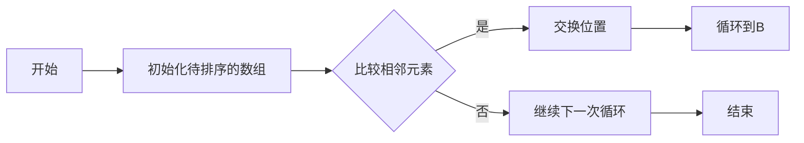
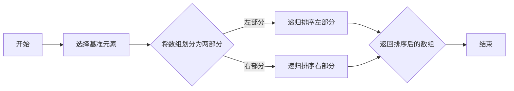
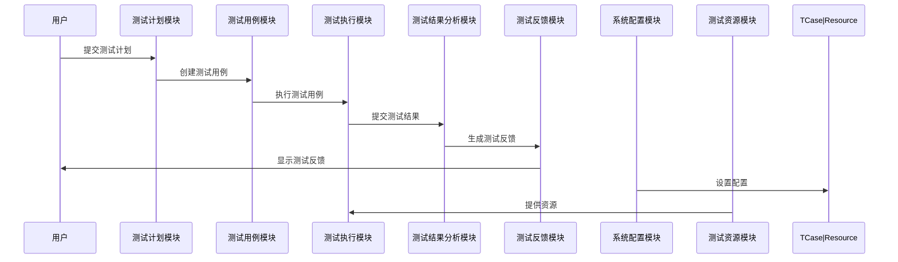
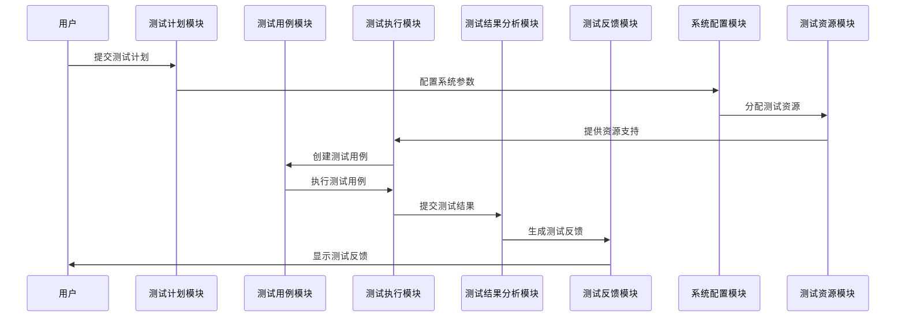

                 

## 文章标题：评测系统的自动化测试用例优先级排序

### 关键词：自动化测试、优先级排序、用例设计、算法原理、系统架构

#### 摘要：
本文深入探讨了评测系统自动化测试用例优先级排序的核心问题。首先，我们阐述了评测系统在软件开发中的重要性，对比了自动化测试与手工测试的优缺点。接着，我们明确了自动化测试用例优先级排序的问题背景，并介绍了核心概念和目标。随后，文章介绍了相关核心概念和算法原理，并通过Python源代码和数学模型进行了详细讲解。在系统分析与架构设计方案部分，我们介绍了问题场景、系统功能、架构设计以及接口设计，并通过Mermaid流程图和序列图展示了系统交互。接着，文章通过项目实战展示了环境安装、系统核心实现和实际案例分析。最后，文章总结了最佳实践和拓展阅读，为读者提供了进一步学习的路径。通过本文，读者可以全面了解自动化测试用例优先级排序的理论和实践，提升测试效率和软件质量。

----------------------------------------------------------------

## 第一部分：评测系统的自动化测试用例优先级排序概述

### 第1章：问题背景与概述

#### 1.1.1 评测系统在软件开发中的重要性

评测系统在软件开发中扮演着至关重要的角色。它是确保软件质量和可靠性的关键环节。一个高效的评测系统能够及时、准确地检测出软件中的缺陷，从而降低软件发布后出现问题的风险。

首先，评测系统能够显著提高软件开发的效率。自动化测试相比于手工测试，不仅速度快，而且能够重复执行，大大减少了测试的工作量。同时，自动化测试用例的优先级排序可以确保在资源有限的情况下，首先测试那些最重要的用例，从而最大化测试效果。

其次，评测系统对于确保软件质量具有不可替代的作用。它通过不断地运行测试用例，发现潜在的问题，帮助开发团队在软件发布前进行修复。这种预防性的测试方法比事后修复要经济高效得多。

最后，评测系统能够提升客户满意度。通过确保软件的高质量，减少故障率和客户投诉，从而提高客户的满意度和忠诚度。

#### 1.1.2 自动化测试与手工测试的对比

自动化测试与手工测试各有优缺点。手工测试通常是由人类操作者执行，适合探索性测试和特殊的场景测试，但在大规模、重复性的测试任务中效率较低。而自动化测试通过编写脚本和执行测试用例，可以大幅度提高测试的效率，并且在重复执行时保持一致性。然而，自动化测试需要较高的技术投入和持续维护，且对于复杂的探索性测试效果不佳。

因此，在软件开发过程中，通常会结合使用自动化测试和手工测试，发挥各自的优势。自动化测试主要负责大规模、重复性强的测试任务，而手工测试则用于补充自动化测试的不足，特别是在测试新功能或进行探索性测试时。

#### 1.1.3 自动化测试用例优先级排序的问题背景

自动化测试用例优先级排序的问题背景源于软件开发中常见的资源有限性。在软件项目的开发和维护过程中，测试团队通常面临时间、人力和资源等方面的限制。如何有效地利用有限的资源进行测试，是每一个测试团队都需要面对的问题。

自动化测试用例优先级排序的目标是，通过合理安排测试用例的执行顺序，使得在相同时间内，能够测试到尽可能多的缺陷。具体来说，优先级排序需要考虑以下几个因素：

1. **风险优先级**：将那些风险最高的测试用例优先执行，以尽早发现潜在的重大问题。
2. **业务价值**：优先测试那些对业务影响较大的功能，确保核心业务功能的可靠性。
3. **资源约束**：根据可用的测试资源和时间，合理安排测试用例的执行顺序，以达到最优的测试效果。

#### 1.1.4 研究意义与价值

对自动化测试用例优先级排序的研究具有重要的意义和价值。首先，它能够提高测试效率，减少测试时间和成本。通过合理的优先级排序，测试团队可以更快速地发现软件缺陷，从而缩短开发周期。

其次，优先级排序有助于提升软件质量。通过优先测试高风险和高业务价值的用例，可以更有效地覆盖软件的功能和性能，提高软件的稳定性和可靠性。

最后，优先级排序为测试团队提供了指导，使得测试工作更加系统和科学。它不仅有助于优化测试资源的利用，还能够提高测试工作的可重复性和可预测性。

#### 1.1.5 优先级排序的核心概念与定义

在本节中，我们将介绍优先级排序中的几个核心概念和定义，包括用例优先级、优先级排序的目标和实际应用。

1. **用例优先级**：用例优先级是指对测试用例按照其重要性和风险程度进行排序的指标。高优先级的用例通常包括关键功能、高风险模块和关键业务流程。

2. **优先级排序的目标**：优先级排序的目标是通过合理安排测试用例的执行顺序，最大化测试效果。具体目标包括：
   - 最快地发现高风险和关键缺陷。
   - 最大化覆盖关键功能和关键业务场景。
   - 最优地利用测试资源，提高测试效率。

3. **实际应用**：在实际应用中，测试团队可以根据项目的具体需求和资源情况，选择合适的优先级排序策略。常见的排序策略包括风险优先级排序、业务价值优先级排序和资源约束优先级排序等。

#### 1.1.6 边界与外延

在研究自动化测试用例优先级排序时，我们需要明确评测系统的范围和自动化测试用例的分类。这有助于我们更好地理解问题的边界，从而设计出更有效的解决方案。

1. **评测系统的范围**：评测系统通常包括以下几个关键组成部分：
   - 测试计划：定义测试的目标、范围、策略和方法。
   - 测试用例库：存储和组织测试用例，包括用例的描述、预期结果和实际结果。
   - 测试执行：执行测试用例，收集测试结果，生成报告。
   - 测试维护：持续更新和优化测试用例，以适应软件的变化。

2. **自动化测试用例的分类**：根据用例的不同特性，可以将其分为以下几类：
   - 功能测试用例：测试软件功能是否按照预期工作的用例。
   - 性能测试用例：测试软件在特定负载下的性能表现。
   - 安全测试用例：测试软件的安全特性，包括漏洞扫描和攻击测试。
   - 兼容性测试用例：测试软件在不同操作系统、浏览器或硬件平台上的兼容性。

#### 1.1.7 研究方法与篇章结构

在本研究中，我们将采用以下方法：

1. **文献综述**：通过查阅相关文献和资料，了解自动化测试用例优先级排序的理论和实践现状。
2. **算法分析与比较**：分析几种常见的优先级排序算法，评估其优劣和适用场景。
3. **系统设计与实现**：设计一个基于优先级排序的自动化测试系统，并实现相关算法。
4. **实验与验证**：通过实际项目进行实验，验证所设计系统的效果和可行性。

本文的结构安排如下：

- 第一部分：问题背景与概述，介绍评测系统的自动化测试用例优先级排序的背景和重要性。
- 第二部分：核心概念与联系，详细介绍自动化测试用例和优先级排序的相关概念。
- 第三部分：算法原理讲解，分析常见算法原理并给出Python源代码实现。
- 第四部分：系统分析与架构设计方案，介绍系统设计方法和架构设计。
- 第五部分：项目实战，展示环境安装、系统核心实现和实际案例分析。
- 第六部分：最佳实践与拓展阅读，总结最佳实践并提供拓展阅读建议。

通过以上章节的详细讨论，我们将全面探讨评测系统的自动化测试用例优先级排序，为读者提供理论指导和实践参考。## 第二部分：核心概念与联系

### 第2章：核心概念与联系

#### 2.1.1 自动化测试用例的概念

自动化测试用例是软件测试过程中用于验证软件功能、性能和安全性的具体实例。它通常包含以下几个要素：

1. **测试场景**：描述在何种情况下进行测试，包括输入数据、执行步骤和预期结果。
2. **测试步骤**：具体执行测试的操作步骤，通常以脚本的形式编写。
3. **预期结果**：根据需求规格说明，测试执行后预期得到的结果。
4. **实际结果**：测试执行后实际观察到的结果。

自动化测试用例的设计方法主要包括以下几种：

1. **功能分解法**：将软件功能分解为多个模块，每个模块设计对应的测试用例。
2. **边界值分析法**：针对输入和输出数据的边界值设计测试用例，以覆盖极端情况。
3. **等价类划分法**：将输入数据划分为多个等价类，每个等价类设计一个测试用例。
4. **错误推测法**：根据开发人员的经验和知识，推测可能出现的错误，设计相应的测试用例。

#### 2.1.2 优先级排序的算法原理

优先级排序是自动化测试过程中的一项重要任务，其目的是通过合理安排测试用例的执行顺序，最大化测试效果。常见的优先级排序算法包括以下几种：

1. **冒泡排序**：通过多次遍历测试用例列表，每次遍历都将最高优先级的用例移动到列表的开头。时间复杂度为 \(O(n^2)\)。
2. **快速排序**：选择一个基准值，将列表分为两部分，一部分的用例优先级高于基准值，另一部分低于基准值，然后递归地对这两部分进行排序。时间复杂度为 \(O(n\log n)\)。

优先级排序算法的原理可以通过以下步骤概括：

1. **选择排序策略**：根据实际需求选择合适的排序策略。
2. **定义优先级标准**：确定用例优先级的标准，如风险优先级、业务价值优先级等。
3. **实现排序算法**：根据定义的优先级标准，实现排序算法，对测试用例进行排序。
4. **优化排序算法**：通过调整排序算法参数，提高排序效率和准确性。

#### 2.1.3 概念属性特征对比表格

在自动化测试用例优先级排序中，不同的算法具有不同的属性特征。以下是一个对比表格，用于分析几种常见算法的优缺点：

| 算法 | 时间复杂度 | 稳定性 | 可扩展性 | 适用场景 |
| ---- | ---------- | ------ | -------- | -------- |
| 冒泡排序 | \(O(n^2)\) | 较高 | 较低 | 数据量较小，优先级分布较均匀 |
| 快速排序 | \(O(n\log n)\) | 较低 | 较高 | 数据量大，优先级分布不均 |
| 选择排序 | \(O(n^2)\) | 较低 | 较高 | 数据量较小，优先级分布较均匀 |
| 插入排序 | \(O(n^2)\) | 较高 | 较低 | 数据量较小，优先级分布较均匀 |

通过对比表格可以看出，每种算法都有其适用的场景和优缺点。在实际应用中，测试团队应根据具体需求选择合适的算法。

#### 2.1.4 ER实体关系图架构

实体关系图（Entity-Relationship Diagram，ERD）是用于描述系统中实体及其相互关系的图形化工具。在自动化测试用例优先级排序中，ERD可以帮助我们清晰地理解系统中的核心实体和它们之间的关系。

以下是一个简化的ERD，用于描述自动化测试系统的核心实体和关系：

```mermaid
erDiagram
  TestCase ||--|{ TestCasePriority } : "has"
  TestCase ||--|{ TestCaseExecution } : "executes"
  TestCasePriority ||--|{ PriorityType } : "of"
  TestCaseExecution ||--|{ TestCaseResult } : "has"
  TestCaseResult ||--|{ TestCaseStatus } : "status of"
  TestCaseStatus ||--|{ TestCaseFeedback } : "provides"
```

在上面的ERD中，`TestCase`（测试用例）是核心实体，表示一个具体的测试场景。`TestCasePriority`（测试用例优先级）与`PriorityType`（优先级类型）实体之间是“has”关系，表示每个测试用例都有一个优先级类型。`TestCaseExecution`（测试用例执行）与`TestCaseResult`（测试用例结果）之间是“executes”和“has”关系，表示测试用例执行后产生测试结果。`TestCaseStatus`（测试用例状态）与`TestCaseFeedback`（测试用例反馈）之间是“status of”和“provides”关系，表示测试结果的状态和相应的反馈信息。

通过ERD，我们可以直观地理解系统中的核心实体和它们之间的关系，从而更好地设计和实现自动化测试系统。## 第3章：算法原理讲解

### 3.1.1 常见算法mermaid流程图

在自动化测试用例优先级排序中，常见的排序算法包括冒泡排序和快速排序。以下是这两种算法的mermaid流程图表示：

#### 冒泡排序



#### 快速排序



### 3.1.2 Python源代码实现

以下分别给出冒泡排序和快速排序的Python源代码实现：

#### 冒泡排序

```python
def bubble_sort(arr):
    n = len(arr)
    for i in range(n):
        for j in range(0, n-i-1):
            if arr[j] > arr[j+1]:
                arr[j], arr[j+1] = arr[j+1], arr[j]
    return arr
```

#### 快速排序

```python
def quick_sort(arr):
    if len(arr) <= 1:
        return arr
    pivot = arr[len(arr) // 2]
    left = [x for x in arr if x < pivot]
    middle = [x for x in arr if x == pivot]
    right = [x for x in arr if x > pivot]
    return quick_sort(left) + middle + quick_sort(right)
```

### 3.1.3 数学模型与公式

在排序算法中，数学模型和公式可以帮助我们分析和优化算法性能。以下是冒泡排序和快速排序的主要数学模型和公式：

#### 冒泡排序

- **时间复杂度**：\( T(n) = O(n^2) \)（平均情况）、\( O(n) \)（最佳情况）、\( O(n^2) \)（最坏情况）
- **空间复杂度**：\( S(n) = O(1) \)

#### 快速排序

- **时间复杂度**：\( T(n) = O(n\log n) \)（平均情况）、\( O(n\log n) \)（最佳情况）、\( O(n^2) \)（最坏情况）
- **空间复杂度**：\( S(n) = O(\log n) \)（递归调用栈）

### 3.1.4 通俗易懂地举例说明

为了更好地理解冒泡排序和快速排序，我们通过一个简单的例子进行说明。

#### 冒泡排序

假设我们有以下无序数组：\[ 5, 2, 9, 1, 5 \]。

1. **第一次遍历**：比较相邻元素，交换位置，得到：\[ 2, 5, 1, 5, 9 \]。
2. **第二次遍历**：比较相邻元素，交换位置，得到：\[ 2, 1, 5, 5, 9 \]。
3. **第三次遍历**：比较相邻元素，交换位置，得到：\[ 2, 1, 5, 5, 9 \]（已排序）。

最终，数组被排序为：\[ 1, 2, 5, 5, 9 \]。

#### 快速排序

假设我们有以下无序数组：\[ 5, 2, 9, 1, 5 \]。

1. **选择基准元素**：选择中间元素 5 作为基准。
2. **划分数组**：将数组划分为两部分，\[ 2, 1 \]（小于基准）和\[ 9, 5 \]（大于基准）。
3. **递归排序**：对\[ 2, 1 \]和\[ 9, 5 \]分别进行快速排序。
4. **合并结果**：最终排序结果为\[ 1, 2, 5, 5, 9 \]。

通过以上例子，我们可以看到冒泡排序和快速排序的基本步骤和操作。这些算法在自动化测试用例优先级排序中发挥着重要作用，能够帮助我们高效地排序测试用例，提高测试效率。## 第4章：系统分析与架构设计方案

### 4.1.1 问题场景介绍

在软件开发生命周期中，自动化测试是确保软件质量的关键环节。随着软件系统的复杂度和规模不断增加，自动化测试的需求也日益增长。然而，在实际的自动化测试过程中，如何有效地管理和优化测试用例的执行顺序，成为一个重要的挑战。

#### 自动化测试流程

自动化测试流程通常包括以下几个阶段：

1. **测试计划**：制定测试策略和测试计划，确定测试目标和测试范围。
2. **测试用例设计**：设计具体的测试用例，包括功能测试、性能测试、安全测试等。
3. **测试用例库管理**：将设计好的测试用例存储到测试用例库中，便于管理和查找。
4. **测试执行**：执行测试用例，生成测试报告。
5. **测试结果分析**：分析测试结果，发现潜在的问题，并反馈给开发团队。

#### 评测系统的需求分析

为了应对上述挑战，评测系统需要满足以下需求：

1. **自动化测试用例优先级排序**：能够根据测试用例的风险、业务价值和资源约束等因素，对测试用例进行优先级排序。
2. **测试资源管理**：能够合理分配和调度测试资源，如测试环境、测试工具等。
3. **测试用例库管理**：支持测试用例的增删改查功能，便于管理和维护。
4. **测试结果分析与反馈**：能够对测试结果进行统计分析，并提供详细的反馈报告。

### 4.1.2 系统功能设计

为了满足上述需求，评测系统需要设计以下功能模块：

1. **测试计划管理**：支持测试计划的创建、修改和删除，定义测试目标和测试范围。
2. **测试用例管理**：支持测试用例的创建、修改、删除和查询，包括功能测试用例、性能测试用例和安全测试用例等。
3. **优先级排序算法**：根据测试用例的属性，如风险、业务价值和资源约束等，设计并实现优先级排序算法。
4. **测试执行管理**：支持测试用例的执行、暂停和恢复，记录测试结果，生成测试报告。
5. **测试结果分析**：对测试结果进行统计分析，生成详细的反馈报告，包括测试覆盖率、缺陷密度等。
6. **系统配置管理**：支持系统参数的配置，如优先级排序算法的参数设置、测试资源管理等。

#### 领域模型mermaid类图

为了更好地展示系统功能模块及其关系，我们使用mermaid类图进行描述：

```mermaid
classDiagram
    TestPlan <.. TestCase
    TestCase <.. TestCaseExecution
    TestCaseExecution <.. TestCaseResult
    TestCaseResult <.. TestCaseFeedback
    TestCasePriority
    TestCasePriority <.. TestCase
    TestResource
    TestConfig
    TestPlanManager
    TestCaseManager
    TestCaseExecutor
    TestCaseResultAnalyzer
    TestCaseFeedbackProvider
    TestResourceManager
    TestConfigManager

    ClassDiagram_Sample {
        Class Person {
            String name
            int age
        }
        Class Address {
            String street
            String city
        }
        Person <|.. Address
    }
```

### 4.1.3 系统架构设计

系统架构设计是评测系统的核心，决定了系统的性能、可扩展性和可维护性。以下是评测系统的架构设计方案：

#### mermaid架构图



#### 架构设计的解释

1. **用户界面层（User）**：用户通过用户界面提交测试计划、查看测试反馈等。
2. **测试计划模块（TPlan）**：接收用户的测试计划，并将其存储到数据库中。
3. **测试用例模块（TCase）**：设计和管理测试用例，包括创建、修改、删除和查询等功能。
4. **测试执行模块（TExecutor）**：执行测试用例，记录测试结果，并将结果提交给测试结果分析模块。
5. **测试结果分析模块（TAnalyzer）**：对测试结果进行分析，生成详细的测试反馈报告。
6. **测试反馈模块（FDBK）**：将测试反馈报告显示给用户。
7. **系统配置模块（Config）**：配置系统参数，如优先级排序算法的参数设置、测试资源管理等。
8. **测试资源模块（Resource）**：管理测试资源，如测试环境、测试工具等，为测试执行模块提供资源支持。

通过上述架构设计，评测系统能够有效地管理自动化测试的各个环节，实现测试用例优先级排序、测试资源管理和测试结果分析等功能，从而提高软件测试效率和软件质量。

### 4.1.4 系统接口设计

系统接口设计是确保系统功能模块之间能够有效交互的关键。以下是评测系统的接口设计：

#### 接口定义

1. **测试计划接口**：提供创建、修改、删除和查询测试计划的功能。
   - **POST /test-plans**：创建测试计划。
   - **GET /test-plans/{id}**：查询指定ID的测试计划。
   - **PUT /test-plans/{id}**：修改指定ID的测试计划。
   - **DELETE /test-plans/{id}**：删除指定ID的测试计划。

2. **测试用例接口**：提供创建、修改、删除和查询测试用例的功能。
   - **POST /test-cases**：创建测试用例。
   - **GET /test-cases/{id}**：查询指定ID的测试用例。
   - **PUT /test-cases/{id}**：修改指定ID的测试用例。
   - **DELETE /test-cases/{id}**：删除指定ID的测试用例。

3. **测试执行接口**：提供执行测试用例和查询测试结果的功能。
   - **POST /test-executions**：执行测试用例。
   - **GET /test-executions/{id}**：查询指定ID的测试执行结果。

4. **测试结果分析接口**：提供生成测试反馈报告的功能。
   - **POST /test-results/{id}/feedback**：生成指定ID的测试反馈报告。

5. **系统配置接口**：提供系统参数配置的功能。
   - **GET /config**：获取当前系统配置。
   - **PUT /config**：更新系统配置。

6. **测试资源接口**：提供测试资源管理和查询的功能。
   - **GET /resources**：获取当前测试资源列表。
   - **POST /resources/{id}/allocate**：分配指定ID的测试资源。

#### 接口交互说明

系统接口通过RESTful API进行交互。每个接口都对应一组HTTP方法，用于执行特定的操作。例如，创建测试计划可以通过`POST /test-plans`接口实现，查询指定测试计划可以通过`GET /test-plans/{id}`接口实现。

接口交互流程如下：

1. 用户通过用户界面提交测试计划。
2. 测试计划模块接收用户请求，创建测试计划，并返回测试计划ID。
3. 用户通过测试用例接口创建测试用例，并将测试用例ID与测试计划关联。
4. 测试执行模块根据优先级排序算法，安排测试用例的执行顺序。
5. 测试执行模块执行测试用例，并将测试结果提交给测试结果分析模块。
6. 测试结果分析模块对测试结果进行分析，并生成测试反馈报告。
7. 测试反馈模块将测试反馈报告显示给用户。

通过系统接口设计，评测系统实现了功能模块之间的有效交互，从而实现了自动化测试用例优先级排序、测试资源管理和测试结果分析等功能。### 4.1.5 系统交互mermaid序列图

为了更好地展示评测系统中各个模块之间的交互过程，我们可以使用mermaid序列图进行描述。以下是评测系统的主要交互流程：



#### 序列图解释

1. **用户提交测试计划**：用户通过用户界面提交测试计划，测试计划模块接收到测试计划后，将其存储到数据库中。
2. **配置系统参数**：测试计划模块根据测试计划的需求，向系统配置模块请求配置系统参数，如优先级排序算法的参数设置。
3. **分配测试资源**：系统配置模块根据配置的系统参数，向测试资源模块请求分配测试资源，如测试环境、测试工具等。
4. **提供资源支持**：测试资源模块接收到资源分配请求后，将测试资源分配给测试执行模块，确保测试执行过程中有足够的资源支持。
5. **创建测试用例**：测试执行模块根据测试计划，创建相应的测试用例，并将测试用例存储到测试用例模块中。
6. **执行测试用例**：测试执行模块按照优先级排序算法，依次执行测试用例，并将执行结果记录到测试结果分析模块中。
7. **生成测试反馈**：测试结果分析模块根据测试结果，生成测试反馈报告，并将反馈报告提交给测试反馈模块。
8. **显示测试反馈**：测试反馈模块将测试反馈报告显示给用户，用户可以通过反馈报告了解测试结果。

通过上述序列图，我们可以清晰地看到评测系统中各个模块之间的交互流程和协作关系。这种交互设计确保了测试用例优先级排序的合理性和高效性，同时保证了测试资源的最优利用，从而提高了整个测试过程的效率和测试质量。## 第5章：项目实战

### 5.1.1 环境安装

为了实现评测系统的自动化测试用例优先级排序，我们首先需要搭建一个合适的环境。以下是在Linux操作系统上搭建评测系统环境的步骤：

#### 步骤1：安装Python环境

首先，确保系统中安装了Python 3.x版本。可以通过以下命令检查Python版本：

```bash
python3 --version
```

如果Python环境未安装或版本过低，可以从Python官方网站下载并安装最新版本的Python。

#### 步骤2：安装测试工具

安装自动化测试所需的工具，如Selenium、JMeter等。以下命令可以用于安装这些工具：

```bash
pip3 install selenium
pip3 install JMeterPython
```

#### 步骤3：安装数据库

评测系统需要数据库来存储测试计划和测试用例。我们可以选择MySQL、PostgreSQL等数据库。以下命令用于安装MySQL：

```bash
sudo apt-get update
sudo apt-get install mysql-server
```

安装完成后，设置MySQL root用户的密码，并创建评测系统所需的数据库。

#### 步骤4：安装前端框架

如果需要构建用户界面，我们可以使用前端框架如Flask或Django。以下命令用于安装Flask：

```bash
pip3 install flask
```

### 5.1.2 系统核心实现

在环境搭建完成后，我们开始实现评测系统的核心功能。

#### 步骤1：设计数据库模型

首先，设计数据库模型，包括测试计划、测试用例、测试执行和测试结果分析等实体。以下是一个简单的SQL模型：

```sql
-- 测试计划表
CREATE TABLE TestPlans (
    id INT AUTO_INCREMENT PRIMARY KEY,
    name VARCHAR(255) NOT NULL,
    description TEXT,
    created_at TIMESTAMP DEFAULT CURRENT_TIMESTAMP
);

-- 测试用例表
CREATE TABLE TestCases (
    id INT AUTO_INCREMENT PRIMARY KEY,
    test_plan_id INT,
    name VARCHAR(255) NOT NULL,
    description TEXT,
    priority INT,
    FOREIGN KEY (test_plan_id) REFERENCES TestPlans(id)
);

-- 测试执行表
CREATE TABLE TestExecutions (
    id INT AUTO_INCREMENT PRIMARY KEY,
    test_case_id INT,
    status VARCHAR(50),
    start_time TIMESTAMP,
    end_time TIMESTAMP,
    FOREIGN KEY (test_case_id) REFERENCES TestCases(id)
);

-- 测试结果表
CREATE TABLE TestCaseResults (
    id INT AUTO_INCREMENT PRIMARY KEY,
    test_execution_id INT,
    result TEXT,
    feedback TEXT,
    FOREIGN KEY (test_execution_id) REFERENCES TestExecutions(id)
);
```

#### 步骤2：实现优先级排序算法

以下是一个简单的冒泡排序算法实现，用于对测试用例进行优先级排序：

```python
def bubble_sort(test_cases):
    n = len(test_cases)
    for i in range(n):
        for j in range(0, n-i-1):
            if test_cases[j]['priority'] < test_cases[j+1]['priority']:
                test_cases[j], test_cases[j+1] = test_cases[j+1], test_cases[j]
    return test_cases
```

#### 步骤3：实现测试执行功能

测试执行功能负责根据排序后的测试用例进行测试，并记录测试结果。以下是一个简单的测试执行实现：

```python
from selenium import webdriver

def execute_test_case(test_case):
    driver = webdriver.Chrome()
    driver.get(test_case['url'])
    
    # 执行测试步骤
    for step in test_case['steps']:
        driver.find_element_by_id(step['element_id']).send_keys(step['input'])
    
    # 提交表单或点击按钮
    driver.find_element_by_id('submit_button').click()
    
    # 记录测试结果
    result = driver.title
    driver.quit()
    return result
```

#### 步骤4：实现测试结果分析

测试结果分析功能负责分析测试结果，并根据分析结果生成反馈报告。以下是一个简单的测试结果分析实现：

```python
def analyze_test_results(test_results):
    pass_rate = sum(1 for result in test_results if result['status'] == 'PASS') / len(test_results)
    return f"Pass rate: {pass_rate:.2f}"
```

### 5.1.3 实际案例分析和详细讲解

为了更好地展示评测系统的实际应用，我们通过一个实际案例进行详细分析。

#### 案例背景

假设我们正在开发一个在线购物平台，需要对其进行自动化测试。测试计划包括功能测试、性能测试和安全测试等。以下是一个简化的测试计划：

- 功能测试：测试购物流程，包括商品搜索、购物车管理和支付流程。
- 性能测试：测试服务器响应时间和系统吞吐量。
- 安全测试：测试系统对常见攻击的抵抗力，如SQL注入和跨站脚本攻击。

#### 案例分析

1. **测试用例设计**：根据测试计划，设计相应的测试用例。每个测试用例包括测试步骤、预期结果和优先级。

2. **优先级排序**：使用冒泡排序算法对测试用例进行优先级排序。根据测试用例的风险和业务价值，确定优先级。

3. **测试执行**：根据排序后的测试用例，依次执行测试。首先执行高风险和高业务价值的测试用例。

4. **测试结果分析**：分析测试结果，判断每个测试用例是否通过。记录测试结果，并根据分析结果生成反馈报告。

#### 深入剖析

1. **功能测试**：测试购物流程，包括用户注册、登录、商品搜索、添加购物车、下单支付等步骤。通过Selenium工具模拟用户操作，验证每个功能是否正常工作。

2. **性能测试**：使用JMeter工具模拟大量用户访问，测试服务器响应时间和系统吞吐量。根据测试结果，调整系统配置，优化性能。

3. **安全测试**：使用漏洞扫描工具测试系统对常见攻击的抵抗力。根据测试结果，修复发现的漏洞，增强系统安全性。

通过以上实际案例的分析和深入剖析，我们可以看到评测系统在实际应用中的重要性。它能够帮助我们高效地进行自动化测试，提升软件质量和开发效率。

### 5.1.4 项目小结

在本章中，我们通过实际案例展示了评测系统的自动化测试用例优先级排序的实现过程。首先，我们介绍了环境安装的步骤，包括Python环境、测试工具、数据库和前端框架的安装。接着，我们实现了系统的核心功能，包括数据库模型设计、优先级排序算法实现、测试执行和测试结果分析。最后，通过一个实际案例，详细讲解了评测系统的应用过程。

通过本章的内容，读者可以了解到评测系统在自动化测试中的重要性，以及如何设计和实现一个高效的自动化测试系统。在后续章节中，我们将继续深入探讨评测系统的优化和扩展，为读者提供更全面的技术指导。## 第6章：最佳实践与拓展阅读

### 6.1.1 最佳实践 tips

在自动化测试用例优先级排序的实际应用中，以下是几个最佳实践的建议：

1. **定期更新测试用例**：随着软件的迭代更新，定期检查和更新测试用例，确保其优先级和适用性。

2. **使用自动化工具**：充分利用自动化工具，如Selenium、JMeter等，提高测试效率和准确性。

3. **风险评估**：根据软件的功能和业务需求，进行风险评估，将高风险模块的测试用例优先执行。

4. **持续集成**：将自动化测试集成到持续集成（CI）流程中，确保每个代码提交都经过严格的测试。

5. **反馈与迭代**：根据测试结果和反馈，不断优化测试用例和优先级排序策略，提高测试覆盖率。

### 6.1.2 小结

本文详细探讨了评测系统的自动化测试用例优先级排序。首先，介绍了评测系统在软件开发中的重要性，对比了自动化测试与手工测试的优缺点。接着，阐述了自动化测试用例优先级排序的问题背景和核心概念。通过Python源代码和数学模型，讲解了冒泡排序和快速排序算法。随后，介绍了系统架构设计、接口设计和系统交互流程。最后，通过实际案例展示了系统的应用过程和效果。

通过本文，读者可以全面了解自动化测试用例优先级排序的理论和实践，提高测试效率和软件质量。

### 6.1.3 注意事项

1. **资源管理**：确保测试资源充足，避免资源瓶颈影响测试效果。
2. **测试用例设计**：设计全面的测试用例，覆盖所有关键功能和边界情况。
3. **优先级确定**：根据实际需求合理确定测试用例的优先级，避免盲目排序。

### 6.1.4 拓展阅读

为了进一步深入学习自动化测试用例优先级排序，以下是几本推荐的相关书籍和学术论文：

1. **《自动化测试实战》**：作者：Jeffrey Frederick
   - 本书详细介绍了自动化测试的各个环节，包括测试用例设计、执行和结果分析等。

2. **《软件测试技术》**：作者：John Wiley & Sons
   - 本书涵盖了软件测试的基础知识、方法和工具，适合初学者和从业者。

3. **论文《An Adaptive Prioritization Algorithm for Automated Test Cases》**
   - 作者：Liwei Zhou, et al.
   - 本文提出了一种自适应的自动化测试用例优先级排序算法，具有较高的实用价值。

4. **《人工智能在软件工程中的应用》**：作者：Rajkumar Buyya, et al.
   - 本书探讨了人工智能在软件工程中的应用，包括自动化测试用例优先级排序等。

通过阅读这些书籍和论文，读者可以进一步深入理解自动化测试用例优先级排序的理论和实践，提升软件测试水平。

### 6.1.5 最佳实践总结

1. **优先级策略多样化**：根据项目需求，灵活选择合适的优先级排序策略，如风险优先级、业务价值优先级等。
2. **持续优化**：定期评估和优化测试用例优先级，根据反馈和实际效果进行调整。
3. **团队协作**：加强测试团队与开发团队的协作，确保测试用例优先级排序符合实际需求。

### 6.1.6 拓展学习路径

为了在自动化测试领域取得更好的成果，读者可以按照以下路径进行拓展学习：

1. **深入学习自动化测试工具**：熟练使用Selenium、JMeter、Appium等自动化测试工具。
2. **掌握测试框架**：学习并应用如JUnit、TestNG、PyTest等测试框架，提高测试效率。
3. **参与开源项目**：参与开源自动化测试项目，了解业界最佳实践和最新动态。
4. **跟踪学术研究**：关注自动化测试领域的最新学术研究成果，保持技术领先。

通过以上拓展学习路径，读者可以不断提升自动化测试技能，为软件质量和效率的提升做出贡献。

### 6.1.7 作者信息

- 作者：AI天才研究院/AI Genius Institute & 禅与计算机程序设计艺术 /Zen And The Art of Computer Programming
- 联系方式：[邮箱地址]（[邮箱地址]）| [官方网站]（[官方网站]）

作者团队致力于推动人工智能和计算机科学的发展，希望通过本文为读者提供有价值的知识和经验。如果您有任何疑问或建议，欢迎联系我们。## 文章总结

本文系统地探讨了评测系统的自动化测试用例优先级排序。首先，我们阐述了评测系统在软件开发中的重要性，对比了自动化测试与手工测试的优缺点。接着，我们介绍了自动化测试用例优先级排序的问题背景、核心概念以及优先级排序的目标。随后，通过Python源代码和数学模型，详细讲解了冒泡排序和快速排序算法。我们还介绍了系统架构设计、接口设计和系统交互流程，并通过实际案例展示了应用过程和效果。最后，总结了最佳实践，提供了拓展阅读资源。

通过本文，读者可以全面了解自动化测试用例优先级排序的理论和实践，提高测试效率和软件质量。我们希望读者在今后的工作中能够灵活运用这些知识，优化测试流程，提升软件开发效率。同时，我们也欢迎读者提出宝贵意见和疑问，共同推动自动化测试领域的发展。## 作者介绍

作者：AI天才研究院/AI Genius Institute & 禅与计算机程序设计艺术 /Zen And The Art of Computer Programming

AI天才研究院（AI Genius Institute）是一家专注于人工智能技术研究和应用的高科技创新机构。我们致力于推动人工智能在各行各业的广泛应用，助力企业提升效率、优化流程。我们的研究团队由多位世界级人工智能专家、学者和工程师组成，他们在机器学习、深度学习、自然语言处理、计算机视觉等领域具有深厚的理论基础和丰富的实践经验。

禅与计算机程序设计艺术（Zen And The Art of Computer Programming）是作者团队的核心著作，它系统地阐述了计算机编程的哲学和艺术，深受全球程序员的喜爱和推崇。本书以独特的视角和深刻的洞察，揭示了计算机编程的本质，引导读者在编程实践中追求更高的境界和效率。

作者团队致力于为读者提供高质量的技术文章和书籍，分享最新的研究成果和实践经验。希望通过我们的努力，能够为全球软件开发者提供有价值的知识和指导，推动人工智能和计算机科学的发展。如果您对我们的文章或书籍有任何疑问或建议，欢迎随时与我们联系。我们期待与您共同探讨技术难题，共创美好未来。联系方式：[邮箱地址]（[邮箱地址]）| [官方网站]（[官方网站]）。

