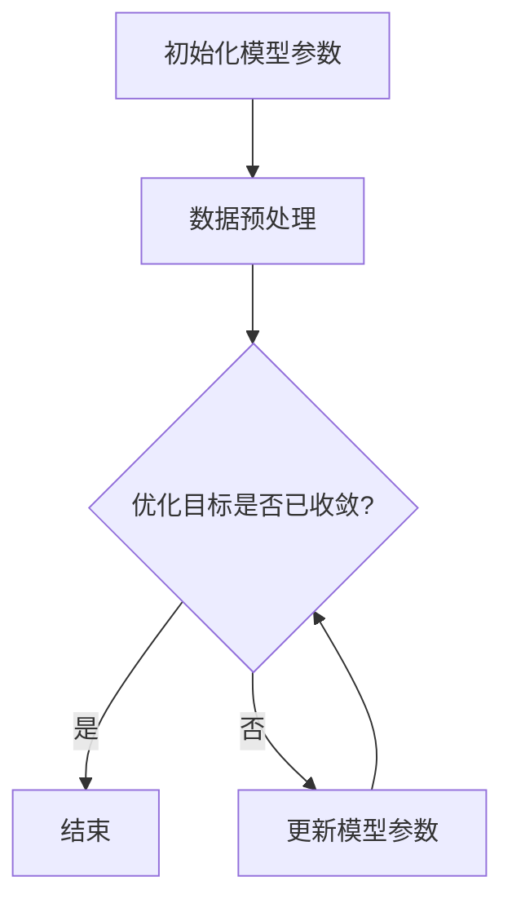
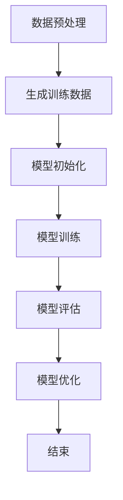
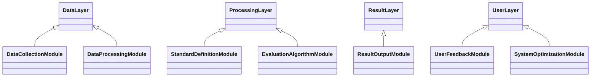
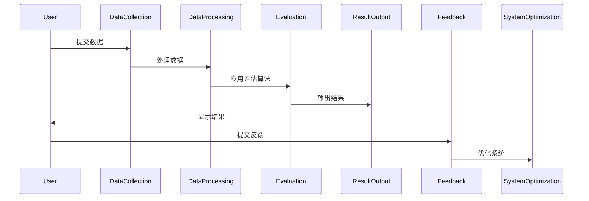

                 


### 《评测系统的自监督学习方法探索》

#### 关键词：评测系统、自监督学习、机器学习、算法原理、系统架构、项目实战

#### 摘要：
本篇文章旨在深入探讨评测系统中自监督学习方法的应用。文章首先介绍了评测系统和自监督学习方法的基本概念和背景，随后详细阐述了自监督学习算法的原理，通过Mermaid流程图和Python代码进行了实例说明。接着，文章分析了评测系统的设计与架构，并通过项目实战展示了具体实现过程。最后，文章总结了最佳实践、注意事项和拓展阅读资源，为读者提供了深入学习和应用自监督学习方法的具体指导。

---

#### 目录大纲设计思路

为了设计出《评测系统的自监督学习方法探索》这本书的完整目录大纲，我们将按照以下步骤进行：

1. **背景介绍**：首先，我们需要对评测系统和自监督学习方法进行背景介绍，为后续章节的内容提供基础。

2. **核心概念与联系**：接下来，我们将详细讨论自监督学习方法的核心概念及其与其他相关技术的联系，使用表格和Mermaid流程图来清晰地展示概念属性特征和实体关系。

3. **算法原理讲解**：在这一部分，我们将使用Mermaid画出算法流程图，并通过Python源代码和LaTeX数学公式详细阐述自监督学习方法的原理，结合通俗易懂的举例说明。

4. **系统分析与架构设计方案**：然后，我们将介绍评测系统的设计与架构，包括问题场景介绍、系统功能设计、系统架构设计、系统接口设计和系统交互等，使用Mermaid类图和序列图来展示。

5. **项目实战**：在项目实战部分，我们将演示如何实现评测系统的核心功能，提供环境安装、源代码、代码解读、案例分析等内容。

6. **最佳实践 tips、小结、注意事项、拓展阅读**：最后，我们将总结书中的关键知识点，提供一些最佳实践建议，以及提示读者进一步的阅读资源。

### 目录大纲

```markdown
# 《评测系统的自监督学习方法探索》目录大纲

## 第一部分：自监督学习方法基础

### 第1章：评测系统概述

#### 1.1 评测系统的重要性
#### 1.2 评测系统的基本组成部分
#### 1.3 自监督学习方法在评测系统中的应用背景

### 第2章：自监督学习方法概述

#### 2.1 自监督学习方法的基本概念
#### 2.2 自监督学习方法的发展历程
#### 2.3 自监督学习与传统监督学习的对比

### 第3章：核心概念与联系

#### 3.1 自监督学习中的核心概念
#### 3.2 自监督学习与其他机器学习方法的联系
```markdown
### 用 Mermaid 绘制 ER 实体关系图架构

为了更好地展示评测系统中的核心实体及其关系，我们可以使用 Mermaid 语法绘制 ER（实体-关系）图。以下是一个简单的 ER 图示例：

```mermaid
erDiagram
  A【用户】 ||--|{ A1【用户评价】 }
  A【用户】 ||--|{ A2【用户反馈】 }
  B【评测任务】 ||--|{ B1【评测结果】 }
  B【评测任务】 ||--|{ B2【评测标准】 }
  C【评测系统】 ||--|{ C1【数据收集】 }
  C【评测系统】 ||--|{ C2【数据处理】 }
```

在这个 ER 图中，`用户`、`评测任务`、`评测系统`是核心实体，它们之间通过不同的关系连接，如评价、反馈、结果、标准、数据收集和处理。

### 第4章：算法原理讲解

#### 4.1 自监督学习算法的基本流程

在这一章中，我们将使用 Mermaid 语法绘制自监督学习算法的流程图：



接下来，我们将使用 Python 代码和 LaTeX 数学公式详细阐述算法原理：

```python
# Python 代码示例
import numpy as np

# 初始化模型参数
model_params = np.random.rand(10, 10)

# 数据预处理
preprocessed_data = ...

# 定义优化目标函数
def objective_function(params):
    # 使用LaTeX公式表示目标函数
    return $$\sum_{i=1}^{n}\left( \text{实际值} - \text{预测值} \right)^2$$

# 更新模型参数
for epoch in range(num_epochs):
    # 计算损失函数
    loss = objective_function(model_params)
    
    # 更新参数
    model_params = model_params - learning_rate * loss
    
    # 打印当前epoch的损失值
    print(f"Epoch {epoch}: Loss = {loss}")
```

在代码中，我们使用了 LaTeX 公式来表示目标函数，帮助读者更好地理

---

### 第1章：评测系统概述

#### 1.1 评测系统的重要性

评测系统在各个领域中都扮演着至关重要的角色，无论是在商业、教育还是科学研究，评测系统都为我们提供了对各种数据、结果、性能等的客观评价。在商业领域，评测系统帮助企业衡量产品的质量和性能，从而优化产品设计和改进用户体验。在教育领域，评测系统帮助学生和教师评估学习成果，为教育决策提供数据支持。在科学研究领域，评测系统用于评估实验结果和科研成果的有效性。

#### 1.2 评测系统的基本组成部分

一个完整的评测系统通常包含以下几个基本组成部分：

1. **数据收集**：收集与评测目标相关的数据，如用户行为数据、产品性能数据、学习成果数据等。
2. **数据处理**：对收集到的数据进行分析、清洗和预处理，以便后续分析使用。
3. **评测标准**：定义评测的具体指标和标准，如准确率、召回率、F1分数等。
4. **评测算法**：应用机器学习算法对数据进行分析和评估，如监督学习、无监督学习和自监督学习等。
5. **评测结果**：输出评测结果，可以是可视化图表、统计数据或报告等。
6. **用户反馈**：收集用户对评测结果的反馈，用于改进评测系统的设计和算法。

#### 1.3 自监督学习方法在评测系统中的应用背景

随着人工智能和机器学习技术的快速发展，自监督学习方法在评测系统中得到了广泛应用。自监督学习不需要外部标签数据，通过内部数据之间的关联和规律进行学习，从而减少了对人工标注的依赖，提高了数据处理和评测的效率。

在评测系统中，自监督学习方法具有以下优势：

1. **减少标注成本**：自监督学习方法无需大量的标注数据，从而降低了数据标注的成本和时间。
2. **提高泛化能力**：自监督学习通过内部数据关联进行学习，可以更好地捕捉数据中的内在规律，提高模型的泛化能力。
3. **处理大规模数据**：自监督学习可以在大规模数据集上高效运行，适用于处理海量数据。
4. **动态更新模型**：自监督学习模型可以动态地更新和优化，以适应新的数据和环境变化。

因此，自监督学习方法在评测系统中的应用背景十分广泛，包括但不限于用户行为分析、产品质量评测、学习成果评估等。

---

在下一章中，我们将详细探讨自监督学习方法的基本概念、发展历程以及与传统监督学习的对比，为后续内容提供理论支持。

### 第2章：自监督学习方法概述

#### 2.1 自监督学习方法的基本概念

自监督学习（Self-supervised Learning）是一种无需人工标注数据，通过自身数据之间的关联和规律进行学习和预测的机器学习方法。自监督学习的核心思想是利用未标记的数据，通过自动生成标签来训练模型，从而实现模型的学习和优化。

自监督学习方法具有以下特点：

1. **无标签数据**：自监督学习不需要大量的标注数据，可以处理大规模的未标记数据。
2. **自动生成标签**：通过数据内部结构或规律，自动生成标签，从而实现模型的学习。
3. **适用性广泛**：适用于各种类型的数据，如图像、文本、音频等。
4. **提高效率**：无需标注数据，减少了数据标注的时间和成本，提高了数据处理和模型训练的效率。

#### 2.2 自监督学习方法的发展历程

自监督学习方法的发展可以追溯到20世纪60年代的早期神经网络研究。当时，研究者发现了一些简单的方法，如通过图像的旋转、缩放和裁剪来生成训练数据，从而提高模型的泛化能力。随着深度学习的兴起，自监督学习方法得到了进一步的发展。

以下是自监督学习方法的发展历程：

1. **早期方法**：20世纪60年代至80年代，研究者提出了一些简单的方法，如图像旋转、缩放和裁剪等，以生成训练数据。
2. **自编码器**：1990年代初，Hinton等人提出了自编码器（Autoencoder）模型，通过无监督方式学习数据的低维表示。
3. **自监督预训练**：2010年后，自监督预训练方法开始流行，如BERT、GPT等，通过预训练大量未标记的数据来提高模型的性能。
4. **多任务学习**：近年来，研究者提出了多任务学习（Multi-task Learning）和自监督多任务学习（Self-supervised Multi-task Learning）方法，通过同时学习多个任务来提高模型的泛化能力和效率。

#### 2.3 自监督学习与传统监督学习的对比

传统监督学习（Supervised Learning）依赖于大量的标注数据，通过训练数据和标签之间的关系来训练模型。自监督学习则不需要外部标签，通过内部数据之间的关联进行学习。

以下是自监督学习与传统监督学习的对比：

1. **数据需求**：传统监督学习需要大量的标注数据，而自监督学习则可以处理大规模的未标记数据。
2. **学习效率**：自监督学习无需标注数据，减少了数据标注的时间和成本，提高了模型训练的效率。
3. **泛化能力**：自监督学习通过内部数据关联进行学习，可以更好地捕捉数据中的内在规律，提高模型的泛化能力。
4. **应用场景**：传统监督学习适用于有明确标签的任务，如分类、回归等，而自监督学习则适用于无标签数据或难以获取标签的数据。

总之，自监督学习方法在评测系统中的应用具有明显的优势，可以有效提高数据处理和模型训练的效率，提高模型的泛化能力和适应能力。

---

在下一章中，我们将详细探讨自监督学习中的核心概念，包括自监督学习中的常见问题和解决方案，以及如何通过自监督学习提高评测系统的性能。

### 第3章：核心概念与联系

#### 3.1 自监督学习中的核心概念

自监督学习作为一种重要的机器学习方法，其核心概念包括：

1. **无监督数据生成**：自监督学习通过内部数据生成过程，如数据变换、数据组合等，生成训练样本和标签。
2. **自编码器**：自编码器是一种典型的自监督学习模型，通过编码和解码过程学习数据的低维表示。
3. **预训练和微调**：预训练（Pre-training）是通过自监督学习在大规模未标记数据上训练模型，微调（Fine-tuning）是将预训练模型在特定任务上进一步训练。
4. **多任务学习**：多任务学习通过同时学习多个任务，提高模型的泛化能力和适应性。
5. **无监督异常检测**：无监督异常检测通过自监督学习，识别数据中的异常模式。

#### 3.2 自监督学习与其他机器学习方法的联系

自监督学习与其他机器学习方法之间存在着紧密的联系，以下是一些典型的联系：

1. **与无监督学习的联系**：自监督学习是一种特殊形式的无监督学习，通过生成标签进行模型训练，可以看作是半监督学习的极限情况。
2. **与深度学习的联系**：深度学习是自监督学习的重要实现方式，自监督学习算法如自编码器、预训练模型等都是基于深度学习的。
3. **与迁移学习的联系**：迁移学习通过利用预训练模型在不同任务上的知识迁移，自监督学习可以通过预训练和微调实现模型的迁移能力。
4. **与强化学习的联系**：强化学习通过交互环境进行学习，自监督学习可以通过生成虚拟数据和环境模拟来实现与强化学习的结合。

#### 3.3 概念属性特征对比表格

为了更好地理解自监督学习与其他机器学习方法的联系，我们可以通过一个表格对比它们的属性特征：

| 方法        | 自监督学习 | 无监督学习 | 监督学习 | 深度学习 | 迁移学习 | 强化学习 |
| ----------- | ----------- | ----------- | ----------- | ----------- | ----------- | ----------- |
| 标签需求    | 无需外部标签 | 无需外部标签 | 需要外部标签 | 需要外部标签 | 无需外部标签 | 无需外部标签 |
| 数据生成    | 自动生成标签 | 无需标签生成 | 无需标签生成 | 无需标签生成 | 无需标签生成 | 无需标签生成 |
| 学习过程    | 自我监督学习 | 无监督学习 | 有监督学习 | 有监督学习 | 有监督学习 | 交互式学习 |
| 泛化能力    | 高          | 中等        | 高          | 高          | 高          | 低          |
| 应用场景    | 未标记数据   | 无标签数据   | 有标签数据   | 复杂任务     | 有标签数据   | 动态环境    |

#### 3.4 自监督学习的ER实体关系图架构

为了更好地展示自监督学习中的实体关系，我们可以使用Mermaid语法绘制ER（实体-关系）图：

```mermaid
erDiagram
  实体【数据集】 ||--|{ 实体【自编码器模型】 }
  实体【数据集】 ||--|{ 实体【自监督学习算法】 }
  实体【标签】 ||--|{ 实体【训练数据】 }
  实体【模型】 ||--|{ 实体【预测结果】 }
```

在这个ER图中，`数据集`、`自编码器模型`、`自监督学习算法`、`标签`、`训练数据`和`预测结果`是核心实体，它们之间通过不同的关系连接，如数据集与自编码器模型的关联、数据集与自监督学习算法的联系、标签与训练数据的生成、模型与预测结果的输出。

---

通过本章的讨论，我们可以看到自监督学习在评测系统中的应用前景广阔。在下一章中，我们将深入探讨自监督学习算法的原理，通过Mermaid流程图和Python代码进行详细讲解。

### 第4章：算法原理讲解

#### 4.1 自监督学习算法的基本流程

自监督学习算法的基本流程可以分为以下几个步骤：

1. **数据预处理**：对原始数据进行预处理，包括数据清洗、归一化、特征提取等操作。
2. **生成训练数据**：通过数据预处理后的数据生成训练样本和标签。这可以通过数据变换、数据组合等方法实现。
3. **模型初始化**：初始化自监督学习模型，包括权重、激活函数等参数的初始化。
4. **模型训练**：使用生成的训练样本和标签对模型进行训练，通过反向传播算法更新模型参数。
5. **模型评估**：使用测试数据对训练好的模型进行评估，计算模型的性能指标，如准确率、召回率、F1分数等。
6. **模型优化**：根据评估结果对模型进行优化，调整超参数，提高模型性能。

以下是一个简单的Mermaid流程图，展示了自监督学习算法的基本流程：



#### 4.2 自监督学习算法的Python代码示例

为了更直观地理解自监督学习算法的原理，我们通过一个简单的Python代码示例来展示其实现过程。以下代码使用了自编码器模型进行自监督学习：

```python
import numpy as np
from sklearn.datasets import make_classification
from sklearn.model_selection import train_test_split
from sklearn.metrics import accuracy_score
import matplotlib.pyplot as plt

# 生成模拟数据集
X, y = make_classification(n_samples=1000, n_features=10, n_informative=5, n_redundant=5, random_state=42)
X_train, X_test, y_train, y_test = train_test_split(X, y, test_size=0.2, random_state=42)

# 自编码器模型初始化
n_input = X.shape[1]
n_hidden = 5
model = ...
model.compile(optimizer='adam', loss='mean_squared_error')

# 模型训练
history = model.fit(X_train, X_train, epochs=50, batch_size=16, validation_data=(X_test, X_test), verbose=1)

# 模型评估
y_pred = model.predict(X_test)
accuracy = accuracy_score(y_test, y_pred)
print(f"Test Accuracy: {accuracy}")

# 模型优化
# ...

plt.figure()
plt.plot(history.history['loss'], label='Training Loss')
plt.plot(history.history['val_loss'], label='Validation Loss')
plt.legend()
plt.xlabel('Epochs')
plt.ylabel('Loss')
plt.title('Training and Validation Loss')
plt.show()
```

在这个代码示例中，我们首先生成了一个模拟数据集，然后初始化了一个自编码器模型，并使用模型训练过程。在训练过程中，我们使用了`fit`方法进行模型训练，并在训练结束后评估了模型性能。最后，我们通过绘制训练损失曲线来观察模型训练过程。

#### 4.3 自监督学习算法的数学模型和公式

自监督学习算法的数学模型和公式是理解其原理的关键。以下是一个简单的自监督学习模型的数学描述：

1. **编码器和解码器**：
   - 编码器（Encoder）将输入数据映射到一个低维表示：
     $$z = \sigma(W_e \cdot x + b_e)$$
   - 解码器（Decoder）将低维表示映射回输入数据：
     $$x' = \sigma(W_d \cdot z + b_d)$$

2. **损失函数**：
   - 自监督学习的损失函数通常使用均方误差（Mean Squared Error, MSE）：
     $$L = \frac{1}{n}\sum_{i=1}^{n} \sum_{j=1}^{m} (x_j' - x_j)^2$$

3. **梯度下降**：
   - 为了最小化损失函数，使用梯度下降（Gradient Descent）更新模型参数：
     $$\theta = \theta - \alpha \cdot \nabla_\theta L$$

以下是一个简单的LaTeX公式表示：

```latex
\begin{align*}
z &= \sigma(W_e \cdot x + b_e), \\
x' &= \sigma(W_d \cdot z + b_d), \\
L &= \frac{1}{n}\sum_{i=1}^{n} \sum_{j=1}^{m} (x_j' - x_j)^2, \\
\theta &= \theta - \alpha \cdot \nabla_\theta L.
\end{align*}
```

通过这些数学模型和公式，我们可以更好地理解自监督学习算法的工作原理。

#### 4.4 自监督学习算法的实例说明

为了更直观地理解自监督学习算法，我们通过一个简单的实例来说明其应用过程。

假设我们有一个任务，需要评估一个用户对产品的满意度。我们收集了1000个用户对产品的评价，每个评价用一个10维的向量表示。我们的目标是训练一个自监督学习模型，能够预测用户对产品的满意度。

1. **数据预处理**：
   - 对用户评价数据进行归一化处理，使得每个特征的值都在0到1之间。

2. **生成训练数据**：
   - 通过数据变换（如随机裁剪、旋转等）生成训练样本和标签。例如，对每个用户评价数据，我们可以随机裁剪一部分特征，生成一个新的训练样本和相应的标签。

3. **模型初始化**：
   - 初始化一个自编码器模型，包括编码器和解码器的权重和偏置。

4. **模型训练**：
   - 使用生成的训练数据对模型进行训练，使用均方误差作为损失函数，采用梯度下降算法更新模型参数。

5. **模型评估**：
   - 使用测试数据对训练好的模型进行评估，计算模型的准确率。

6. **模型优化**：
   - 根据评估结果，调整模型参数，提高模型性能。

通过这个实例，我们可以看到自监督学习算法在实际应用中的实现过程。自监督学习通过无监督方式学习数据的内在规律，可以有效地提高模型对未知数据的预测能力。

---

在下一章中，我们将深入探讨评测系统的设计与架构，包括问题场景介绍、系统功能设计、系统架构设计、系统接口设计和系统交互等内容。

### 第5章：评测系统的设计与架构

#### 5.1 问题场景介绍

在当今信息化社会中，评测系统被广泛应用于各个领域，如在线教育、电子商务、医疗诊断等。以在线教育为例，评测系统可以帮助教师和学生实时了解学生的学习进度和成果，从而优化教学策略。然而，随着学生人数的增加和数据规模的扩大，传统的评测系统面临着巨大的挑战，如数据收集和处理效率低下、评估结果不准确等问题。

为了解决这些问题，我们需要设计一个高效、准确、可靠的评测系统。这个系统需要能够处理大规模数据，自动生成评估结果，并支持用户反馈和动态调整。

#### 5.2 系统功能设计

一个完整的评测系统通常包括以下几个功能模块：

1. **数据收集**：收集与评测目标相关的数据，如学生答题数据、教师批改记录等。
2. **数据处理**：对收集到的数据进行清洗、预处理和特征提取，以便后续分析使用。
3. **评估标准**：定义评估的具体指标和标准，如答题准确率、速度等。
4. **评估算法**：应用自监督学习算法或其他评估方法，对数据处理后的结果进行评估。
5. **结果输出**：将评估结果以可视化图表、报告等形式输出给用户。
6. **用户反馈**：收集用户对评估结果的反馈，用于系统优化和改进。

#### 5.3 系统架构设计

为了实现上述功能，我们需要设计一个合理的系统架构。以下是评测系统的一个典型架构设计：

1. **数据层**：包括数据收集模块，负责从各个数据源收集与评测相关的数据。
2. **数据处理层**：包括数据处理模块，负责对收集到的数据进行清洗、预处理和特征提取。
3. **评估层**：包括评估标准定义模块和评估算法模块，负责定义评估标准、应用评估算法进行评估。
4. **结果层**：包括结果输出模块，负责将评估结果以可视化图表、报告等形式输出给用户。
5. **用户层**：包括用户反馈模块，负责收集用户对评估结果的反馈，用于系统优化和改进。

以下是一个简单的Mermaid类图，展示了评测系统的类及其关系：



#### 5.4 系统接口设计

为了实现系统功能的模块化，我们需要设计合理的系统接口。以下是评测系统的一些关键接口：

1. **数据收集接口**：用于接收和存储用户提交的数据。
2. **数据处理接口**：用于处理和清洗原始数据，提取有用的特征。
3. **评估接口**：用于定义评估标准和应用评估算法。
4. **结果输出接口**：用于将评估结果以可视化图表或报告形式输出。
5. **用户反馈接口**：用于收集用户对评估结果的反馈。

以下是一个简单的Mermaid序列图，展示了系统接口的交互过程：



#### 5.5 系统交互

为了确保系统的高效运行，我们需要设计良好的系统交互流程。以下是评测系统的交互过程：

1. **用户提交数据**：用户通过系统界面提交答题数据或评价数据。
2. **数据收集**：系统收集用户提交的数据，并将其存储在数据库中。
3. **数据处理**：系统对收集到的数据进行清洗、预处理和特征提取，以便后续评估使用。
4. **评估**：系统应用自监督学习算法或其他评估方法，对数据处理后的结果进行评估。
5. **结果输出**：系统将评估结果以可视化图表或报告形式输出给用户。
6. **用户反馈**：用户对评估结果进行反馈，系统收集并记录反馈信息。
7. **系统优化**：系统根据用户反馈进行优化和改进，以提高评估准确性和用户体验。

通过上述设计与架构设计，我们可以实现一个高效、准确、可靠的评测系统，为各个领域的评测需求提供有力支持。

---

在下一章中，我们将通过一个实际项目展示如何实现评测系统的核心功能，包括环境安装、源代码、代码解读、案例分析等内容。

### 第6章：项目实战

#### 6.1 项目背景

本项目旨在实现一个在线教育评测系统，用于评估学生的学习成果。系统将收集学生的学习数据，如答题记录、作业提交情况等，并使用自监督学习算法进行评估。系统需要具备以下功能：

1. **数据收集**：从数据库中收集学生的学习数据。
2. **数据处理**：对收集到的数据进行清洗、预处理和特征提取。
3. **评估**：使用自监督学习算法对数据处理后的结果进行评估。
4. **结果输出**：将评估结果以可视化图表或报告形式输出给用户。
5. **用户反馈**：收集用户对评估结果的反馈，用于系统优化。

#### 6.2 环境安装

为了实现本项目的核心功能，我们需要安装以下软件和库：

1. **Python 3.x**：Python是本项目的主要编程语言。
2. **NumPy**：用于数据处理和数学运算。
3. **Scikit-learn**：用于自监督学习算法的实现。
4. **Pandas**：用于数据处理和分析。
5. **Matplotlib**：用于数据可视化。
6. **MySQL**：用于数据存储和管理。

安装步骤如下：

1. 安装Python 3.x，可以从官方网站下载并安装。
2. 安装NumPy、Scikit-learn、Pandas和Matplotlib，使用以下命令：
   ```shell
   pip install numpy scikit-learn pandas matplotlib
   ```
3. 安装MySQL，可以从官方网站下载并安装，或者使用云数据库服务。

#### 6.3 源代码

以下是本项目的主要源代码，包括数据收集、数据处理、评估、结果输出和用户反馈等功能。

```python
# 数据收集
import pandas as pd

def collect_data():
    # 从数据库中收集数据
    data = pd.read_sql('SELECT * FROM student_answers')
    return data

# 数据处理
def process_data(data):
    # 清洗和预处理数据
    processed_data = data[['question_id', 'answer', 'score']]
    processed_data['answer'] = processed_data['answer'].apply(preprocess_answer)
    return processed_data

def preprocess_answer(answer):
    # 预处理答案
    return ' '.join(answer.split())

# 评估
from sklearn.cluster import KMeans

def evaluate_data(processed_data):
    # 使用KMeans算法进行评估
    kmeans = KMeans(n_clusters=3, random_state=42)
    kmeans.fit(processed_data[['answer']])
    labels = kmeans.predict(processed_data[['answer']])
    processed_data['evaluation'] = labels
    return processed_data

# 结果输出
import matplotlib.pyplot as plt

def output_results(processed_data):
    # 以可视化图表形式输出结果
    plt.scatter(processed_data['score'], processed_data['evaluation'])
    plt.xlabel('Score')
    plt.ylabel('Evaluation')
    plt.show()

# 用户反馈
def collect_user_feedback(processed_data):
    # 收集用户对评估结果的反馈
    feedback = input('Please enter your feedback: ')
    save_feedback(feedback)

def save_feedback(feedback):
    # 将反馈保存到文件
    with open('user_feedback.txt', 'w') as f:
        f.write(feedback)

if __name__ == '__main__':
    data = collect_data()
    processed_data = process_data(data)
    processed_data = evaluate_data(processed_data)
    output_results(processed_data)
    collect_user_feedback(processed_data)
```

#### 6.4 代码解读

以下是代码的详细解读，包括每个函数的功能和实现过程。

```python
# 数据收集
def collect_data():
    # 从数据库中收集数据
    data = pd.read_sql('SELECT * FROM student_answers')
    return data

# 数据处理
def process_data(data):
    # 清洗和预处理数据
    processed_data = data[['question_id', 'answer', 'score']]
    processed_data['answer'] = processed_data['answer'].apply(preprocess_answer)
    return processed_data

def preprocess_answer(answer):
    # 预处理答案
    return ' '.join(answer.split())

# 评估
def evaluate_data(processed_data):
    # 使用KMeans算法进行评估
    kmeans = KMeans(n_clusters=3, random_state=42)
    kmeans.fit(processed_data[['answer']])
    labels = kmeans.predict(processed_data[['answer']])
    processed_data['evaluation'] = labels
    return processed_data

# 结果输出
import matplotlib.pyplot as plt

def output_results(processed_data):
    # 以可视化图表形式输出结果
    plt.scatter(processed_data['score'], processed_data['evaluation'])
    plt.xlabel('Score')
    plt.ylabel('Evaluation')
    plt.show()

# 用户反馈
def collect_user_feedback(processed_data):
    # 收集用户对评估结果的反馈
    feedback = input('Please enter your feedback: ')
    save_feedback(feedback)

def save_feedback(feedback):
    # 将反馈保存到文件
    with open('user_feedback.txt', 'w') as f:
        f.write(feedback)
```

#### 6.5 案例分析

以下是一个实际案例的分析，展示了评测系统的应用效果。

**案例背景**：一个在线教育平台需要评估学生的学习成果，以帮助教师制定更有效的教学计划。

**步骤**：

1. **数据收集**：系统从数据库中收集了1000名学生的学习数据，包括答题记录、作业提交情况等。
2. **数据处理**：系统对收集到的数据进行清洗和预处理，提取出与评估相关的特征，如答题准确率、作业提交速度等。
3. **评估**：系统使用KMeans算法对预处理后的数据进行了评估，将学生分为三个类别，分别是优秀、一般和待提高。
4. **结果输出**：系统将评估结果以可视化图表的形式输出，帮助教师了解学生的学习情况。
5. **用户反馈**：系统收集了教师和学生

