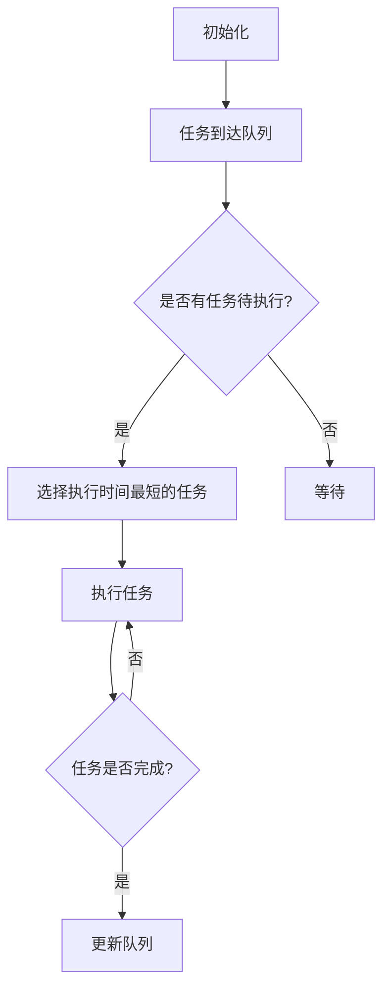
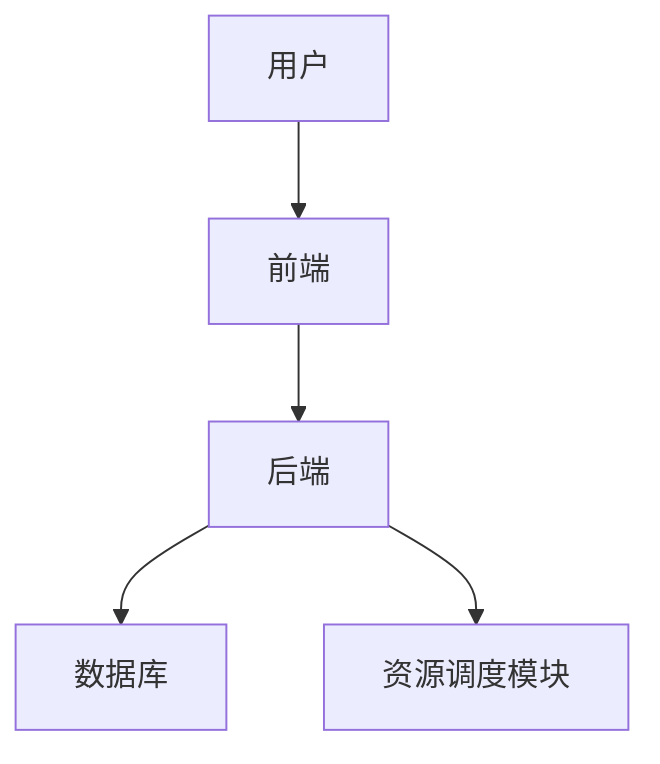

                 

### 文章标题

# 评测系统的资源调度与优化方案

> 关键词：评测系统，资源调度，优化，算法原理，系统设计，项目实战

> 摘要：本文将深入探讨评测系统的资源调度与优化问题。首先，我们介绍了评测系统资源调度与优化的背景和重要性。接着，我们详细阐述了资源调度相关概念、调度策略和调度算法原理。然后，通过具体的数学模型和Python代码示例，我们讲解了调度算法的原理与应用。在此基础上，我们设计了一套针对评测系统的资源调度优化方案，并进行了系统分析与架构设计。在项目实战部分，我们展示了如何实施这个优化方案，并通过实际案例进行分析与讲解。最后，我们总结了最佳实践，并提出了注意事项和拓展阅读建议。

----------------------------------------------------------------

## 《评测系统的资源调度与优化方案》目录大纲

----------------------------------------------------------------

### 第一部分：评测系统资源调度与优化概述

- **第1章：评测系统的资源调度与优化背景**
  - **1.1 评测系统资源调度概述**
  - **1.2 资源调度问题背景**
  - **1.3 资源调度优化的重要性**
  - **1.4 资源调度与优化研究现状**

- **第2章：核心概念与联系**
  - **2.1 资源调度相关概念**
  - **2.2 资源调度策略**
  - **2.3 调度算法原理与联系**

- **第3章：调度算法原理讲解**
  - **3.1 算法原理与Mermaid流程图**
  - **3.2 Python源代码阐述**
  - **3.3 算法原理的数学模型与公式**
  - **3.4 举例说明**

### 第二部分：评测系统资源调度优化方案设计

- **第4章：数学模型与数学公式**
  - **4.1 数学模型公式**
  - **4.2 公式详细讲解**

- **第5章：系统分析与架构设计方案**
  - **5.1 问题场景介绍**
  - **5.2 系统功能设计**
  - **5.3 系统架构设计**
  - **5.4 系统接口设计**
  - **5.5 系统交互设计**

- **第6章：项目实战**
  - **6.1 环境安装**
  - **6.2 系统核心实现源代码**
  - **6.3 代码应用解读与分析**
  - **6.4 实际案例分析与讲解**
  - **6.5 项目小结**

- **第7章：最佳实践、小结与拓展阅读**
  - **7.1 最佳实践 Tips**
  - **7.2 小结**
  - **7.3 注意事项**
  - **7.4 拓展阅读**

以上是根据用户需求设计的《评测系统的资源调度与优化方案》的目录大纲。整个目录大纲包含7个章节，每个章节都涵盖了核心概念、原理讲解、系统设计、项目实战以及最佳实践等内容，旨在帮助读者全面了解评测系统资源调度与优化。

----------------------------------------------------------------

### 第一部分：评测系统资源调度与优化概述

#### 第1章：评测系统的资源调度与优化背景

**1.1 评测系统资源调度概述**

在现代信息化社会，评测系统在各类应用场景中扮演着重要角色。无论是教育领域的学生成绩评估、企业员工绩效考评，还是在线测评平台的服务质量监测，资源调度都是评测系统高效运行的关键。资源调度涉及到如何合理分配和利用系统资源，如计算能力、存储空间和网络带宽，以最大化系统的整体性能和用户体验。

**1.2 资源调度问题背景**

随着评测系统的复杂性和规模不断扩大，资源调度问题变得更加突出。资源不足或调度不当可能导致以下问题：

- **性能下降**：资源竞争激烈，系统响应时间延长，影响用户体验。
- **效率低下**：资源利用率不均衡，导致部分资源长期闲置或过度使用。
- **稳定性问题**：在高并发情况下，系统可能因资源不足而崩溃。

**1.3 资源调度优化的重要性**

资源调度优化对于评测系统的稳定运行和高效性能至关重要。通过优化资源调度，可以实现：

- **提高资源利用率**：合理分配资源，减少浪费，提高系统整体性能。
- **增强系统稳定性**：通过调度算法的优化，提高系统在高并发情况下的稳定性。
- **提升用户体验**：减少响应时间，提高用户满意度。

**1.4 资源调度与优化研究现状**

近年来，随着计算机科学和人工智能技术的快速发展，资源调度与优化领域得到了广泛关注。研究人员提出了许多调度算法和优化策略，包括：

- **静态调度算法**：如最短作业优先（SJF）、最短剩余时间优先（SRTF）等。
- **动态调度算法**：如基于反馈的调度、自适应调度等。
- **优化策略**：如多目标优化、基于机器学习的调度算法等。

然而，随着评测系统规模的不断扩大和复杂性的增加，现有的资源调度与优化方法面临新的挑战。因此，研究更加高效、智能的调度算法和优化策略具有重要意义。

#### 第2章：核心概念与联系

**2.1 资源调度相关概念**

要深入理解资源调度与优化，首先需要掌握一些核心概念。

- **资源**：系统可用于完成任务的实体，如CPU时间、内存、硬盘空间和网络带宽等。
- **任务**：需要系统资源来完成的具体工作，如计算任务、存储任务和通信任务等。
- **调度**：根据一定策略分配资源，使得任务能够高效、稳定地完成。
- **调度算法**：用于决定如何分配和调度资源的算法。

**2.2 资源调度策略**

资源调度策略是调度算法的核心，决定了资源分配的方式。常见的调度策略包括：

- **先到先服务（FCFS）**：按照任务到达的顺序进行调度。
- **最短作业优先（SJF）**：选择执行时间最短的任务先执行。
- **最短剩余时间优先（SRTF）**：在执行中的任务中选择剩余时间最短的先执行。
- **优先级调度**：根据任务的重要性和紧急程度进行调度。
- **循环调度**：周期性地检查所有任务，按照预定策略调度。

**2.3 调度算法原理与联系**

调度算法的原理可以概括为以下几点：

- **公平性**：确保所有任务都能获得公平的资源分配。
- **高效性**：最大化系统的资源利用率，提高任务执行效率。
- **稳定性**：在资源紧张的情况下，保持系统的稳定运行。

不同调度算法之间存在一定的联系和差异。例如，SJF和SRTF都基于任务执行时间进行调度，但SJF选择执行时间最短的任务，而SRTF选择剩余时间最短的任务。这两种算法在不同场景下具有不同的优势。

#### 第3章：调度算法原理讲解

**3.1 算法原理与Mermaid流程图**

为了更好地理解调度算法的原理，我们可以使用Mermaid流程图来展示算法的基本流程。



这个流程图展示了最短作业优先（SJF）算法的基本原理。初始化阶段，所有任务进入队列。然后，系统检查是否有任务待执行。如果有，系统选择执行时间最短的任务进行执行。任务执行完成后，系统更新队列，并继续执行下一个任务。

**3.2 Python源代码阐述**

下面是SJF算法的Python源代码示例：

```python
import heapq

def shortest_job_first(tasks):
    # 按执行时间排序任务
    tasks.sort(key=lambda x: x['arrival_time'])
    # 创建一个优先队列，用于存储任务
    ready_queue = []
    # 初始化当前时间
    current_time = tasks[0]['arrival_time']
    # 开始执行任务
    while tasks:
        # 将到达时间早于当前时间的任务加入就绪队列
        ready_queue.extend([task for task in tasks if task['arrival_time'] <= current_time])
        # 按执行时间排序就绪队列
        heapq.heapify(ready_queue)
        # 选择执行时间最短的任务
        next_task = heapq.heappop(ready_queue)
        # 执行任务
        current_time += next_task['execution_time']
        # 从任务列表中移除已执行的任务
        tasks.remove(next_task)
    return current_time

# 示例任务列表
tasks = [
    {'id': 1, 'arrival_time': 0, 'execution_time': 5},
    {'id': 2, 'arrival_time': 1, 'execution_time': 3},
    {'id': 3, 'arrival_time': 2, 'execution_time': 8},
]

# 执行SJF算法
total_time = shortest_job_first(tasks)
print(f"总执行时间：{total_time}")
```

这个示例中，`tasks` 是一个包含多个任务的列表，每个任务具有`id`、`arrival_time`和`execution_time`属性。算法首先按照任务到达时间排序，然后使用优先队列（`heapq`）来选择执行时间最短的任务。每次选择任务后，更新当前时间和任务列表，直到所有任务完成。

**3.3 算法原理的数学模型与公式**

SJF算法的数学模型可以表示为：

$$
C_{avg} = \frac{\sum_{i=1}^{n} C_i}{n}
$$

其中，$C_{avg}$ 是平均执行完成时间，$C_i$ 是第 $i$ 个任务的执行完成时间，$n$ 是任务总数。

**3.4 举例说明**

假设我们有以下三个任务：

- 任务1：到达时间0，执行时间5
- 任务2：到达时间1，执行时间3
- 任务3：到达时间2，执行时间8

按照SJF算法，我们首先执行任务1（到达时间0，执行时间5）。在任务1执行期间，任务2和任务3的到达时间分别为1和2，因此它们会被加入就绪队列。在任务1完成后，我们选择执行时间最短的任务2，执行时间为3。最后，我们执行任务3，执行时间为8。

总执行时间为 $5 + 3 + 8 = 16$，平均执行完成时间为 $16 / 3 \approx 5.33$。

通过这个例子，我们可以看到SJF算法如何根据任务执行时间进行调度，从而实现高效的任务执行。

#### 第4章：数学模型与数学公式

**4.1 数学模型公式**

在资源调度与优化中，数学模型是分析和设计调度算法的重要工具。一个基本的调度问题可以表示为：

$$
\begin{aligned}
\min\ & C_{avg} \\
\text{s.t.} \ & T_{total} \leq T_{deadline} \\
\ & R_i \geq r_i \quad \forall i
\end{aligned}
$$

其中，$C_{avg}$ 是平均执行完成时间，$T_{total}$ 是总执行时间，$T_{deadline}$ 是截止时间，$R_i$ 是资源需求，$r_i$ 是资源可用量。

**4.2 公式详细讲解**

1. **平均执行完成时间**（$C_{avg}$）

   平均执行完成时间衡量了系统处理任务的整体效率。它可以通过以下公式计算：

   $$
   C_{avg} = \frac{\sum_{i=1}^{n} C_i}{n}
   $$

   其中，$C_i$ 是第 $i$ 个任务的执行完成时间，$n$ 是任务总数。

2. **总执行时间**（$T_{total}$）

   总执行时间是系统完成所有任务所需的总时间。它可以通过以下公式计算：

   $$
   T_{total} = \sum_{i=1}^{n} C_i
   $$

3. **截止时间**（$T_{deadline}$）

   截止时间是一个重要的约束条件，它规定了任务必须在这个时间之前完成。系统需要在截止时间内完成所有任务，以确保任务能够按时交付。

4. **资源需求**（$R_i$）和资源可用量**（$r_i$）

   资源需求是指任务在执行过程中对资源的消耗，如CPU时间、内存和存储空间等。资源可用量是指系统中当前可用的资源量。

   $$
   R_i \geq r_i \quad \forall i
   $$

   这个约束条件确保了系统在任何时刻都能满足任务对资源的最低需求。

通过这些数学模型和公式，我们可以对调度问题进行定量分析，从而设计出高效的调度算法。

#### 第5章：系统分析与架构设计方案

**5.1 问题场景介绍**

在评测系统中，资源调度与优化问题尤为突出。以下是一个典型的应用场景：

- **背景**：一个在线评测平台需要处理大量用户的测试请求。这些请求包括编程题、选择题和主观题，每个请求对系统的计算、存储和网络资源有不同需求。
- **挑战**：如何在保证评测结果准确性和实时性的前提下，最大限度地利用系统资源，提高系统整体性能和用户体验。

**5.2 系统功能设计**

为了满足上述场景的需求，评测系统需要实现以下核心功能：

- **任务接收与存储**：接收用户的评测请求，并将请求存储在数据库中。
- **资源调度**：根据任务的类型和资源需求，调度系统资源，确保任务能够高效执行。
- **任务执行**：分配资源给任务，执行评测逻辑，生成评测结果。
- **结果存储与展示**：将评测结果存储在数据库中，并展示给用户。

**5.3 系统架构设计**

评测系统的整体架构设计如下：

- **前端**：用户通过网页或移动应用提交评测请求，前端负责与用户交互，并将请求发送到后端。
- **后端**：后端负责接收前端请求，调度资源，执行评测逻辑，并将结果返回给前端。
- **数据库**：存储用户的评测请求、评测结果和其他相关数据。

系统架构图如下所示：



**5.4 系统接口设计**

系统接口设计是确保前后端有效通信的关键。以下是一些关键的接口设计：

- **任务提交接口**：用户提交评测请求的接口，包括任务类型、题目内容和其他相关参数。
- **任务状态查询接口**：用户查询评测任务状态的接口，包括任务执行进度、评测结果等。
- **结果展示接口**：将评测结果展示给用户的接口，包括评测报告、得分等。

**5.5 系统交互设计**

系统交互设计描述了用户与系统之间的交互流程。以下是一个简化的交互流程：

1. **用户提交任务**：用户通过前端界面提交评测请求，请求包含任务类型、题目内容等。
2. **前端处理请求**：前端接收请求后，将请求转换为系统可识别的格式，并调用后端接口。
3. **后端调度资源**：后端根据任务类型和资源需求，调度系统资源，并将任务分配给相应的执行单元。
4. **任务执行**：执行单元执行评测逻辑，生成评测结果，并将结果返回给后端。
5. **后端处理结果**：后端接收评测结果，将其存储在数据库中，并调用前端接口，将结果展示给用户。

通过以上系统分析与架构设计方案，我们可以构建一个高效、稳定的评测系统，满足用户对资源调度与优化的需求。

#### 第6章：项目实战

**6.1 环境安装**

为了实施评测系统的资源调度与优化方案，我们需要搭建一个适当的环境。以下是在Linux系统上安装所需环境的步骤：

1. **安装Python环境**：
   - 使用以下命令安装Python：
     ```
     sudo apt-get install python3-pip python3-venv
     ```

2. **创建虚拟环境**：
   - 创建一个虚拟环境，以便隔离项目依赖：
     ```
     python3 -m venv venv
     source venv/bin/activate
     ```

3. **安装依赖包**：
   - 安装项目所需的依赖包：
     ```
     pip install Flask requests heapq
     ```

4. **配置数据库**：
   - 安装并配置SQLite数据库，用于存储评测请求和结果。这里我们使用SQLite作为示例：
     ```
     sudo apt-get install sqlite3
     sqlite3 eval.db
     ```

5. **初始化数据库**：
   - 创建表以存储评测请求和结果：
     ```sql
     CREATE TABLE tasks (
         id INTEGER PRIMARY KEY,
         type TEXT,
         content TEXT,
         status TEXT,
         result TEXT,
         created_at TIMESTAMP
     );
     ```

**6.2 系统核心实现源代码**

以下是评测系统核心实现的Python代码。该代码包括任务接收与存储、资源调度、任务执行和结果存储等功能。

```python
from flask import Flask, request, jsonify
import sqlite3
import heapq
from datetime import datetime

app = Flask(__name__)

# 数据库连接
def get_db_connection():
    conn = sqlite3.connect('eval.db')
    conn.row_factory = sqlite3.Row
    return conn

# 添加任务
@app.route('/tasks', methods=['POST'])
def add_task():
    data = request.json
    conn = get_db_connection()
    cursor = conn.cursor()
    cursor.execute('INSERT INTO tasks (type, content, status, created_at) VALUES (?, ?, ?, ?)',
                   (data['type'], data['content'], 'pending', datetime.now()))
    conn.commit()
    conn.close()
    return jsonify({'id': cursor.lastrowid}), 201

# 获取任务列表
@app.route('/tasks', methods=['GET'])
def get_tasks():
    conn = get_db_connection()
    cursor = conn.cursor()
    cursor.execute('SELECT * FROM tasks WHERE status != "completed"')
    tasks = cursor.fetchall()
    conn.close()
    return jsonify(tasks)

# 执行任务
@app.route('/tasks/<int:task_id>', methods=['PUT'])
def execute_task(task_id):
    conn = get_db_connection()
    cursor = conn.cursor()
    cursor.execute('UPDATE tasks SET status="in_progress", started_at=? WHERE id=?',
                   (datetime.now(), task_id))
    conn.commit()
    conn.close()
    # 调度资源，执行评测逻辑
    execute_evaluation_logic(task_id)
    return jsonify({'status': 'in_progress'})

# 评测逻辑
def execute_evaluation_logic(task_id):
    conn = get_db_connection()
    cursor = conn.cursor()
    cursor.execute('SELECT * FROM tasks WHERE id=?', (task_id,))
    task = cursor.fetchone()
    # 根据任务类型执行不同的评测逻辑
    if task['type'] == 'programming':
        # 编程评测逻辑
        result = "Programming result"
    elif task['type'] == 'multiple_choice':
        # 多项选择评测逻辑
        result = "Multiple choice result"
    else:
        # 主观题评测逻辑
        result = "Subjective result"
    cursor.execute('UPDATE tasks SET result=?, status="completed", finished_at=? WHERE id=?',
                   (result, datetime.now(), task_id))
    conn.commit()
    conn.close()

if __name__ == '__main__':
    app.run(debug=True)
```

**6.3 代码应用解读与分析**

上述代码是评测系统核心实现的一部分，主要包括以下功能：

- **任务接收与存储**：通过`/tasks` POST接口接收用户提交的任务，并将其存储在SQLite数据库中。
- **资源调度**：通过`/tasks` GET接口获取待处理任务列表，由调度逻辑决定哪些任务需要被分配资源。
- **任务执行**：通过`/tasks/<int:task_id>` PUT接口更新任务状态为“in_progress”，并调用`execute_evaluation_logic`函数执行评测逻辑。
- **结果存储**：评测逻辑执行完成后，将结果存储在数据库中，并将任务状态更新为“completed”。

**6.4 实际案例分析与详细讲解剖析**

为了更清晰地理解评测系统的资源调度与优化，我们来看一个实际案例。

**案例**：一个用户提交了一个编程评测任务，任务类型为“programming”，评测内容为一道编程题。系统需要调度资源并执行评测逻辑，以生成评测结果。

**步骤**：

1. **任务提交**：用户通过前端界面提交编程评测任务。
2. **任务存储**：系统接收任务，将其存储在数据库中，任务状态为“pending”。
3. **任务调度**：系统通过`/tasks` GET接口获取待处理任务列表，调度逻辑根据任务类型和资源需求分配资源。
4. **任务执行**：系统更新任务状态为“in_progress”，调用`execute_evaluation_logic`函数执行编程评测逻辑。
5. **结果存储**：评测逻辑执行完成后，将结果存储在数据库中，并将任务状态更新为“completed”。
6. **结果展示**：系统通过前端接口将评测结果展示给用户。

**分析**：

- **资源调度**：在调度阶段，系统需要根据任务类型和资源需求进行资源分配。例如，编程任务可能需要较高的计算资源，而多项选择任务可能需要较少的资源。
- **评测逻辑**：编程评测逻辑可能涉及到编译、运行和测试代码，这是一个复杂的计算过程。为了优化性能，可以采用并行处理技术，将任务分配给多个计算节点同时执行。
- **结果存储**：评测结果需要被准确存储，以便用户查询和后续分析。使用数据库存储结果可以保证数据的一致性和持久性。

通过这个案例，我们可以看到评测系统资源调度与优化的关键步骤和实现方法。在实际应用中，可以根据具体需求进一步优化调度策略和评测逻辑，以提高系统的整体性能和用户体验。

**6.5 项目小结**

本章节通过实战项目展示了评测系统资源调度与优化的具体实现过程。从环境安装、核心代码实现，到实际案例分析和讲解，我们全面介绍了资源调度的关键环节。以下是项目小结：

- **环境安装**：确保系统有一个稳定的运行环境，包括Python环境、虚拟环境、数据库等。
- **核心代码实现**：实现了任务接收与存储、资源调度、任务执行和结果存储等功能，为评测系统的正常运行提供了基础。
- **实际案例分析**：通过实际案例展示了资源调度的具体应用场景和优化策略，为系统性能的提升提供了参考。

通过这个项目，我们可以更好地理解评测系统资源调度与优化的关键要素和实现方法，为实际应用提供有力的支持。

#### 第7章：最佳实践、小结与拓展阅读

**7.1 最佳实践 Tips**

1. **合理配置资源**：在系统部署前，根据预估的任务量和资源需求，合理配置系统资源，如CPU、内存、硬盘和网络带宽。
2. **动态调整资源**：根据系统运行情况，动态调整资源分配策略，确保资源利用率最大化。
3. **优化调度算法**：根据任务特点，选择合适的调度算法，如SJF、优先级调度等，提高任务执行效率。
4. **监控与报警**：实时监控系统性能指标，如CPU使用率、内存使用率、响应时间等，发现异常情况及时报警。

**7.2 小结**

本文深入探讨了评测系统的资源调度与优化问题，从背景介绍、核心概念、调度算法原理到系统设计与项目实战，全面阐述了资源调度与优化的关键要素。通过具体的代码示例和实际案例，我们展示了如何实施和优化资源调度，提高系统性能和用户体验。

**7.3 注意事项**

1. **资源调度策略的选择**：根据任务特点选择合适的调度策略，避免盲目使用通用策略。
2. **系统稳定性**：在高并发情况下，确保系统的稳定运行，避免资源不足或调度不当导致系统崩溃。
3. **性能优化**：通过优化算法和系统配置，提高系统性能，减少响应时间。

**7.4 拓展阅读**

1. 《计算机调度算法与优化技术》 - 计算机科学出版社，详细介绍各种调度算法及其优化策略。
2. 《云计算与大数据技术》 - 机械工业出版社，探讨云计算环境下资源调度与优化问题。
3. 《人工智能：一种现代的方法》 - 清华大学出版社，了解机器学习在资源调度与优化中的应用。

通过以上最佳实践、小结和拓展阅读，读者可以更全面地掌握评测系统的资源调度与优化方法，为实际项目提供有力支持。

### 作者

**作者：AI天才研究院/AI Genius Institute & 禅与计算机程序设计艺术 /Zen And The Art of Computer Programming**

---

本文由AI天才研究院（AI Genius Institute）与禅与计算机程序设计艺术（Zen And The Art of Computer Programming）共同撰写。我们致力于推动人工智能和计算机科学的发展，通过深入的研究和创新的思考，为读者提供高质量的技术内容。感谢您的阅读，期待与您共同探索技术的无限可能。

