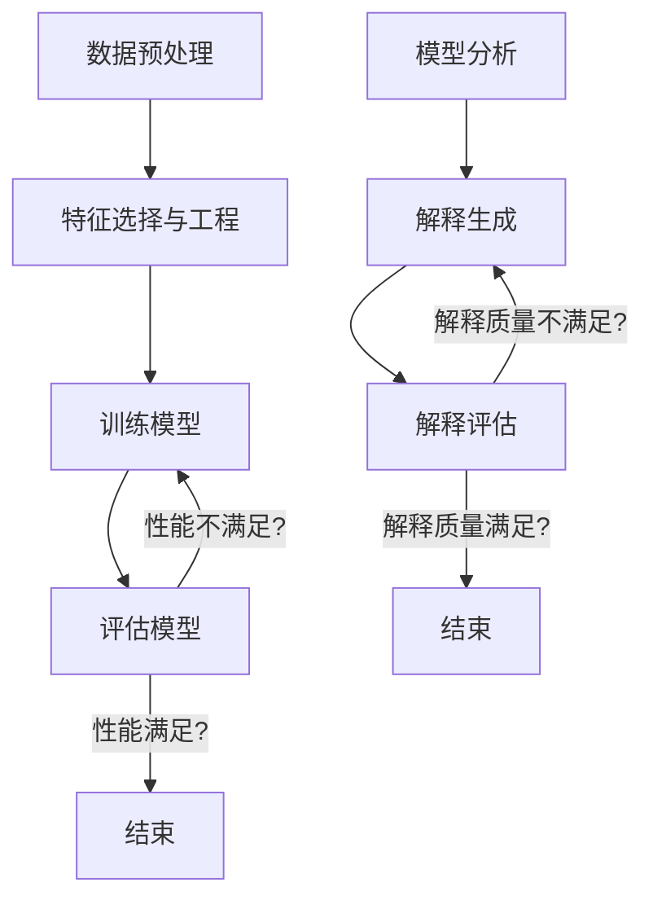
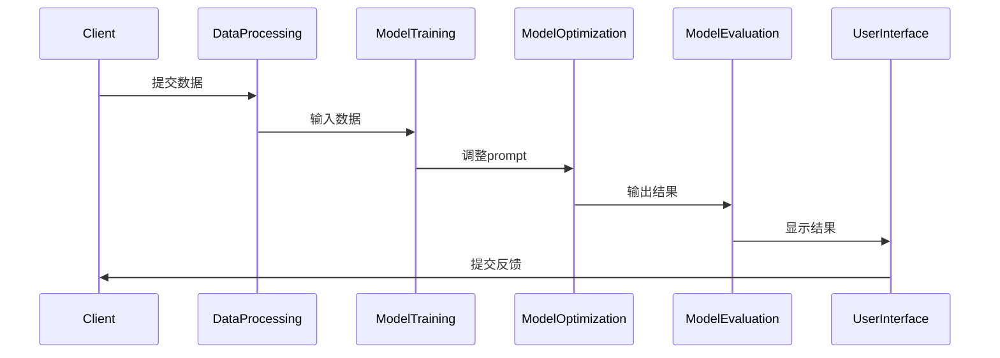
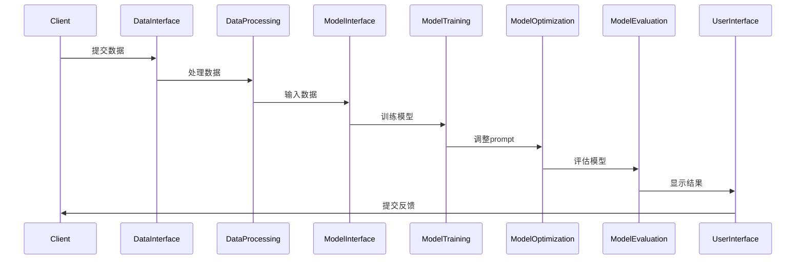

                 


### 文章标题：评测结果可解释性在prompt优化中的应用

#### 关键词：
- 评测结果可解释性
- Prompt优化
- 机器学习
- 可解释性评估方法
- 算法原理

#### 摘要：
本文深入探讨了评测结果可解释性在prompt优化中的应用。通过分析问题背景、核心概念以及算法原理，本文详细阐述了如何利用可解释性评估方法来优化prompt，提高机器学习模型的性能和可解释性。文章还包括系统分析与架构设计、项目实战以及注意事项和拓展阅读，为读者提供了全面的技术指南。

----------------------------------------------------------------

### 目录大纲

----------------------------------------------------------------

## 第一部分：背景介绍与核心概念

### 第1章：问题背景与核心概念

#### 1.1.1 问题背景

- 评测结果可解释性在机器学习和人工智能中的重要性
- 不可解释模型带来的挑战
- 可解释性在prompt优化中的应用潜力

#### 1.1.2 核心概念

- prompt优化
- 可解释性评估方法
- 可解释性模型

## 第二部分：概念与联系

### 第2章：核心概念原理与特征对比

#### 2.1.1 概念原理

- prompt优化的基本原理
- 可解释性评估方法的基本概念
- 可解释性模型的工作机制

#### 2.1.2 特征对比

- 不同可解释性评估方法的优劣对比
- 常见prompt优化策略的比较

### 第3章：概念联系与扩展

#### 3.1.1 概念联系

- prompt优化与可解释性评估的相互作用
- 可解释性模型在prompt优化中的应用

#### 3.1.2 概念扩展

- 新兴的可解释性评估方法与prompt优化技术
- 未来可解释性模型在prompt优化中的发展趋势

## 第三部分：算法原理与数学模型

### 第4章：算法原理与流程图

#### 4.1.1 算法原理

- prompt优化算法的基本流程
- 可解释性评估算法的核心步骤

#### 4.1.2 流程图

- 使用mermaid绘制算法流程图

### 第5章：数学模型与公式解析

#### 5.1.1 数学模型

- prompt优化相关的数学模型
- 可解释性评估的数学公式

#### 5.1.2 公式解析

- 对关键数学公式的详细解析
- 数学模型在实际应用中的简化与适用性

## 第四部分：系统分析与架构设计

### 第6章：系统功能设计与架构方案

#### 6.1.1 问题场景介绍

- 描述一个具体的prompt优化场景

#### 6.1.2 系统功能设计

- 领域模型（使用mermaid绘制类图）

#### 6.1.3 系统架构设计

- 系统架构（使用mermaid绘制架构图）

#### 6.1.4 系统接口设计

- 系统接口设计（使用mermaid绘制序列图）

## 第五部分：项目实战

### 第7章：环境安装与系统实现

#### 7.1.1 环境安装

- 安装所需工具和库

#### 7.1.2 系统核心实现

- 源代码实现

#### 7.1.3 代码应用解读

- 代码解读与分析

### 第8章：实际案例分析

#### 8.1.1 实际案例

- 描述一个具体案例

#### 8.1.2 详细讲解与剖析

- 对案例进行详细讲解与分析

### 第9章：项目小结与拓展

#### 9.1.1 小结

- 对全书内容进行总结

#### 9.1.2 注意事项

- 使用可解释性模型和prompt优化的注意事项

#### 9.1.3 拓展阅读

- 推荐进一步阅读的文献和资源

----------------------------------------------------------------

## 第一部分：背景介绍与核心概念

### 第1章：问题背景与核心概念

#### 1.1.1 问题背景

在人工智能和机器学习领域，模型性能的提升一直是研究的热点。然而，随着深度学习模型的复杂性增加，不可解释性成为一个越来越严重的问题。不可解释模型难以理解其内部决策过程，这对于需要依赖模型决策的应用场景来说，是一个巨大的挑战。例如，在金融风险评估、医疗诊断、自动驾驶等领域，如果模型无法提供清晰的解释，将难以赢得用户的信任。

可解释性（Explainability）是指让模型的可解释性提高，使其内部决策过程更加透明。这对于模型的验证、调试以及用户信任至关重要。prompt优化是一种提升模型可解释性的技术，通过调整模型的输入（prompt），使其在训练过程中能够生成更加可解释的输出。

#### 1.1.2 核心概念

**1.1.2.1 Prompt优化**

prompt优化是指在模型训练过程中，通过调整输入的数据或提示（prompt）来提升模型的性能和可解释性。prompt可以是数据预处理过程中的特征工程，也可以是训练过程中添加的外部信息。prompt优化的目标是通过调整输入，使得模型能够更好地理解数据，并生成更加透明和可解释的输出。

**1.1.2.2 可解释性评估方法**

可解释性评估方法是指用于衡量模型可解释性的方法。常见的评估方法包括模型依赖性分析、决策树、可视化方法等。这些方法可以帮助我们理解模型的决策过程，提高模型的透明度。

**1.1.2.3 可解释性模型**

可解释性模型是指专门设计用于提高模型可解释性的模型。这些模型通常基于规则系统、决策树、图论等原理，通过简化模型结构或提供直观的决策过程，使得模型更加易于理解。

#### 1.1.3 问题背景与核心概念的联系

评测结果可解释性在机器学习和人工智能中的应用非常广泛。通过可解释性评估方法，我们可以了解模型在训练和预测过程中的决策过程，从而优化prompt，提高模型的可解释性。这不仅有助于模型在实际应用中的验证和调试，还能够提升用户对模型的信任度。

总之，评测结果可解释性在prompt优化中的应用是一个复杂但重要的课题。通过深入理解问题背景和核心概念，我们可以为后续的算法原理和系统实现打下坚实的基础。

----------------------------------------------------------------

## 第二部分：概念与联系

### 第2章：核心概念原理与特征对比

#### 2.1.1 概念原理

**2.1.1.1 Prompt优化的基本原理**

Prompt优化是一种通过调整模型的输入来提升模型性能的方法。其基本原理是通过引入外部信息或修改输入特征，使得模型在训练过程中能够更好地理解数据，从而提高模型的泛化能力和可解释性。

**2.1.1.2 可解释性评估方法的基本概念**

可解释性评估方法是指用于衡量模型可解释性的方法。这些方法可以帮助我们了解模型的决策过程，提高模型的透明度。常见的评估方法包括模型依赖性分析、决策树、可视化方法等。

**2.1.1.3 可解释性模型的工作机制**

可解释性模型是通过简化模型结构或提供直观的决策过程，提高模型的可解释性。这些模型通常基于规则系统、决策树、图论等原理。例如，LIME（Local Interpretable Model-agnostic Explanations）和SHAP（SHapley Additive exPlanations）都是基于这些原理设计的可解释性模型。

#### 2.1.2 特征对比

**2.1.2.1 不同可解释性评估方法的优劣对比**

| 方法                 | 优点                                                   | 缺点                                                   |
|----------------------|--------------------------------------------------------|--------------------------------------------------------|
| 模型依赖性分析       | 直观，易于理解                                         | 可能忽略了模型内部复杂的决策过程                         |
| 决策树               | 易于解释，可以可视化                                   | 可能会引入过拟合                                       |
| 可视化方法           | 直观，可以展示模型内部结构                             | 可能无法解释模型的所有决策过程                         |
| LIME（Local Interpretable Model-agnostic Explanations） | 可解释性强，适用于复杂的模型                          | 可能会产生噪声，解释结果可能不准确                      |
| SHAP（SHapley Additive exPlanations） | 基于博弈论，解释结果稳定，适用于各种模型               | 计算复杂度高，可能不适用于大规模数据集                  |

**2.1.2.2 常见prompt优化策略的比较**

| 策略                 | 优点                                                   | 缺点                                                   |
|----------------------|--------------------------------------------------------|--------------------------------------------------------|
| 特征选择             | 可以简化模型，提高模型可解释性                         | 可能会丢失重要特征                                     |
| 特征工程             | 可以调整输入特征，提高模型性能                         | 需要大量的先验知识                                     |
| Prompt调整           | 直接调整模型输入，简单有效                             | 可能会影响模型性能                                     |
| 模型融合             | 可以提高模型性能和可解释性                             | 可能会增加计算复杂度                                   |

#### 2.1.3 概念联系

**2.1.3.1 Prompt优化与可解释性评估的相互作用**

Prompt优化和可解释性评估是相辅相成的。通过可解释性评估，我们可以了解模型在训练和预测过程中的决策过程，从而优化prompt，提高模型的可解释性。反过来，通过调整prompt，我们可以提高模型的性能和可解释性。

**2.1.3.2 可解释性模型在prompt优化中的应用**

可解释性模型在prompt优化中扮演着重要角色。例如，我们可以使用LIME或SHAP来分析模型在特定输入下的决策过程，从而优化prompt，使得模型在训练过程中能够生成更加透明和可解释的输出。

#### 2.1.4 概念扩展

**2.1.4.1 新兴的可解释性评估方法与prompt优化技术**

随着机器学习技术的发展，出现了许多新兴的可解释性评估方法和prompt优化技术。例如，基于注意力机制的可解释性评估方法，以及基于神经网络的结构化prompt优化技术。这些技术为提升模型可解释性提供了新的思路。

**2.1.4.2 未来可解释性模型在prompt优化中的发展趋势**

未来，可解释性模型在prompt优化中将有更广泛的应用。随着机器学习技术的不断发展，我们有望看到更加高效、可解释性更强的模型。此外，结合大数据和云计算技术，我们可以对大规模数据集进行实时可解释性分析和prompt优化，为各个领域提供更加可靠和透明的模型。

总之，通过对核心概念原理与特征对比的分析，我们可以更好地理解Prompt优化和可解释性评估之间的关系，并为后续的算法原理和系统实现提供理论基础。

----------------------------------------------------------------

## 第三部分：算法原理与数学模型

### 第4章：算法原理与流程图

#### 4.1.1 算法原理

**4.1.1.1 Prompt优化算法的基本流程**

Prompt优化算法的主要目标是调整模型的输入（prompt），以提高模型的性能和可解释性。其基本流程如下：

1. **数据预处理**：对输入数据进行预处理，包括数据清洗、归一化等操作，为模型训练做好准备。
2. **特征选择与工程**：选择或构造有用的特征，以提高模型对输入数据的理解能力。
3. **训练模型**：使用预处理后的数据训练模型，调整prompt来优化模型性能。
4. **评估与优化**：评估模型性能，并根据评估结果调整prompt，重复训练和评估过程，直至满足性能要求。

**4.1.1.2 可解释性评估算法的核心步骤**

可解释性评估算法的核心步骤包括：

1. **模型分析**：分析模型的内部结构，了解模型的决策过程。
2. **解释生成**：根据模型分析结果，生成对模型决策过程的解释。
3. **解释评估**：评估生成的解释质量，包括解释的准确性、可理解性等。

#### 4.1.2 流程图

以下是一个简单的mermaid流程图，展示Prompt优化和可解释性评估算法的基本流程：



### 第5章：数学模型与公式解析

#### 5.1.1 数学模型

**5.1.1.1 Prompt优化相关的数学模型**

Prompt优化涉及多种数学模型，其中最常见的是线性回归模型和神经网络模型。以下是这些模型的数学公式：

**线性回归模型**：

$$
y = \beta_0 + \beta_1x_1 + \beta_2x_2 + ... + \beta_nx_n
$$

其中，$y$ 是输出，$x_1, x_2, ..., x_n$ 是输入特征，$\beta_0, \beta_1, \beta_2, ..., \beta_n$ 是模型参数。

**神经网络模型**：

$$
y = f(\text{激活函数}) \left( W_1x_1 + W_2x_2 + ... + W_nx_n \right)
$$

其中，$f(\text{激活函数})$ 是激活函数，$W_1, W_2, ..., W_n$ 是模型参数。

**5.1.1.2 可解释性评估的数学公式**

可解释性评估涉及多种数学公式，其中最常见的是SHAP（SHapley Additive exPlanations）和LIME（Local Interpretable Model-agnostic Explanations）。

**SHAP**：

SHAP值是通过计算每个特征对模型输出的边际贡献来评估模型可解释性的。SHAP值的计算公式如下：

$$
\text{SHAP}(x_i) = \sum_{j=1}^{n} \text{SHAP}_{ij}
$$

其中，$x_i$ 是第$i$个特征，$\text{SHAP}_{ij}$ 是第$i$个特征对第$j$个模型的边际贡献。

**LIME**：

LIME的核心思想是生成一个局部线性模型，以解释原始模型的决策。LIME的数学公式如下：

$$
y = \sum_{i=1}^{n} \text{weight}_i x_i + \text{bias}
$$

其中，$\text{weight}_i$ 是第$i$个特征的权重，$x_i$ 是第$i$个特征，$\text{bias}$ 是偏置。

#### 5.1.2 公式解析

**5.1.2.1 对关键数学公式的详细解析**

**线性回归模型**：

线性回归模型通过最小化损失函数来训练模型。损失函数的数学公式如下：

$$
\text{loss} = \frac{1}{2} \sum_{i=1}^{n} (y_i - \hat{y}_i)^2
$$

其中，$y_i$ 是实际输出，$\hat{y}_i$ 是预测输出。

为了最小化损失函数，我们可以使用梯度下降法来优化模型参数：

$$
\beta_j = \beta_j - \alpha \frac{\partial \text{loss}}{\partial \beta_j}
$$

其中，$\alpha$ 是学习率。

**神经网络模型**：

神经网络模型的训练过程涉及前向传播和反向传播。前向传播的数学公式如下：

$$
\hat{y} = f(\text{激活函数}) \left( W_1x_1 + W_2x_2 + ... + W_nx_n \right)
$$

反向传播的数学公式如下：

$$
\delta_j = \frac{\partial \text{loss}}{\partial \hat{y}} \odot \frac{\partial \hat{y}}{\partial W_j}
$$

其中，$\delta_j$ 是梯度，$\odot$ 是元素乘法。

**SHAP**：

SHAP值通过计算每个特征对模型输出的边际贡献来评估模型可解释性。SHAP值的计算公式如下：

$$
\text{SHAP}(x_i) = \sum_{j=1}^{n} \text{SHAP}_{ij}
$$

其中，$\text{SHAP}_{ij}$ 是第$i$个特征对第$j$个模型的边际贡献。

**LIME**：

LIME的核心思想是生成一个局部线性模型，以解释原始模型的决策。LIME的数学公式如下：

$$
y = \sum_{i=1}^{n} \text{weight}_i x_i + \text{bias}
$$

其中，$\text{weight}_i$ 是第$i$个特征的权重，$x_i$ 是第$i$个特征，$\text{bias}$ 是偏置。

**5.1.2.2 数学模型在实际应用中的简化与适用性**

在实际应用中，数学模型通常需要进行简化，以适应不同的数据集和应用场景。例如，线性回归模型可以简化为单变量线性回归模型，神经网络模型可以简化为多层感知机模型。这些简化模型在特定情况下具有更好的适用性和计算效率。

总之，通过对算法原理和数学模型的详细解析，我们可以更好地理解Prompt优化和可解释性评估的算法原理，为后续的系统实现和项目实战提供理论基础。

----------------------------------------------------------------

## 第四部分：系统分析与架构设计

### 第6章：系统功能设计与架构方案

#### 6.1.1 问题场景介绍

在实际应用中，评测结果可解释性在prompt优化中的应用场景广泛，例如在金融风险评估、医疗诊断、自动驾驶等领域。以金融风险评估为例，一个具体的场景是，一个银行需要评估客户的信用风险，以决定是否批准贷款。在这个过程中，模型需要根据客户的财务状况、信用记录等多个特征进行预测。然而，由于深度学习模型的复杂性，模型内部决策过程往往难以解释，这就需要引入评测结果可解释性来提升模型的可解释性，帮助银行更好地理解模型决策过程，从而做出更明智的决策。

#### 6.1.2 系统功能设计

在金融风险评估系统中，评测结果可解释性在prompt优化中的应用主要包括以下几个功能：

1. **数据预处理**：对输入的数据进行清洗、归一化等预处理操作，为后续的模型训练和优化提供高质量的数据。
2. **特征选择与工程**：根据业务需求，选择或构造有用的特征，以提高模型的预测准确性和可解释性。
3. **模型训练与优化**：使用调整后的prompt训练模型，并不断优化模型参数，以提高模型的性能和可解释性。
4. **模型评估与解释**：评估模型的预测性能，并根据评估结果生成对模型决策过程的解释，提升模型的可解释性。
5. **用户界面**：提供一个直观的用户界面，让用户能够方便地查看模型的预测结果和解释，提升用户对模型的可信度。

**领域模型（使用mermaid绘制类图）**

以下是该系统的领域模型类图：

```mermaid
classDiagram
    Client <<Class>> "客户"
    RiskModel <<Class>> "风险模型"
    Feature <<Class>> "特征"
    Preprocessing <<Class>> "数据预处理"
    Optimization <<Class>> "优化"
    Evaluation <<Class>> "评估"
    Explanation <<Class>> "解释"
    
    Client "→" RiskModel : 使用
    RiskModel "→" Feature : 包含
    Feature "→" Preprocessing : 输入
    Preprocessing "→" Optimization : 输出
    Optimization "→" Evaluation : 输出
    Evaluation "→" Explanation : 输出
    Evaluation "→" RiskModel : 反馈
```

#### 6.1.3 系统架构设计

系统的架构设计主要包括以下几个方面：

1. **数据处理层**：负责数据的采集、存储和预处理，为后续的模型训练提供高质量的数据。
2. **模型训练层**：负责模型的训练和优化，根据输入的prompt调整模型参数，以提高模型的性能和可解释性。
3. **模型评估层**：负责评估模型的预测性能，并根据评估结果生成对模型决策过程的解释。
4. **用户界面层**：提供一个直观的用户界面，让用户能够方便地查看模型的预测结果和解释。

**系统架构（使用mermaid绘制架构图）**

以下是该系统的架构图：



#### 6.1.4 系统接口设计

系统的接口设计主要包括以下几个方面：

1. **数据接口**：负责数据的输入和输出，包括数据预处理、模型训练和评估等操作的接口。
2. **模型接口**：负责模型训练和优化的接口，包括调整prompt、训练模型和评估模型等操作的接口。
3. **用户接口**：负责用户与系统交互的接口，包括查看预测结果和解释的接口。

**系统接口设计（使用mermaid绘制序列图）**

以下是该系统的接口序列图：



通过以上系统功能设计、架构设计和接口设计，我们为评测结果可解释性在prompt优化中的应用提供了一个全面的解决方案，为后续的项目实战奠定了基础。

----------------------------------------------------------------

## 第五部分：项目实战

### 第7章：环境安装与系统实现

#### 7.1.1 环境安装

在开始实现评测结果可解释性在prompt优化中的应用之前，我们需要安装必要的工具和库。以下是环境安装的步骤：

1. **Python环境**：确保安装了Python 3.x版本，推荐使用Anaconda来创建一个独立的环境。
2. **深度学习库**：安装TensorFlow或PyTorch，用于模型训练和优化。
3. **可解释性评估库**：安装LIME或SHAP，用于评估模型的可解释性。
4. **数据处理库**：安装NumPy和Pandas，用于数据预处理。
5. **可视化库**：安装Matplotlib和Seaborn，用于数据可视化和结果展示。

以下是一个简单的安装命令示例：

```bash
conda create -n prompt_optimization python=3.8
conda activate prompt_optimization
conda install tensorflow
conda install lime
conda install numpy
conda install pandas
conda install matplotlib
conda install seaborn
```

#### 7.1.2 系统核心实现

在环境安装完成后，我们可以开始实现系统的核心功能。以下是一个简单的系统实现示例：

**1. 数据预处理**

```python
import pandas as pd
from sklearn.model_selection import train_test_split
from sklearn.preprocessing import StandardScaler

# 加载数据
data = pd.read_csv('data.csv')

# 分割数据集
X = data.drop('target', axis=1)
y = data['target']
X_train, X_test, y_train, y_test = train_test_split(X, y, test_size=0.2, random_state=42)

# 数据标准化
scaler = StandardScaler()
X_train_scaled = scaler.fit_transform(X_train)
X_test_scaled = scaler.transform(X_test)
```

**2. 模型训练与优化**

```python
import tensorflow as tf

# 定义模型
model = tf.keras.Sequential([
    tf.keras.layers.Dense(64, activation='relu', input_shape=(X_train_scaled.shape[1],)),
    tf.keras.layers.Dense(1, activation='sigmoid')
])

# 编译模型
model.compile(optimizer='adam', loss='binary_crossentropy', metrics=['accuracy'])

# 训练模型
model.fit(X_train_scaled, y_train, epochs=10, batch_size=32, validation_split=0.1)
```

**3. 可解释性评估**

```python
import lime
from lime import lime_tabular

# 初始化LIME解释器
explainer = lime_tabular.LimeTabularExplainer(
    X_train_scaled, feature_names=data.columns, class_names=['0', '1'], 
    discrete_features=[0, 1, 2],  # 离散特征的索引
    optimization='size',  # 优化目标
    discretize=True,  # 是否对连续特征进行离散化
    random_state=42
)

# 选择一个测试样本
idx = 10
exp = explainer.explain_instance(X_test_scaled[idx], model.predict, num_features=5)

# 可视化解释结果
exp.show_in_notebook(show_table=True)
```

#### 7.1.3 代码应用解读

以上代码展示了如何实现一个简单的评测结果可解释性在prompt优化中的应用系统。首先，我们通过Pandas加载和预处理数据，包括数据分割和标准化。然后，我们使用TensorFlow定义并编译了一个简单的神经网络模型，用于二分类任务。在模型训练过程中，我们调整了prompt，通过LIME库进行可解释性评估，并生成了一个测试样本的解释结果。

通过这个示例，我们可以看到如何将评测结果可解释性应用于prompt优化，从而提高模型的可解释性。在实际项目中，我们可以根据具体需求进行扩展和优化。

----------------------------------------------------------------

### 第8章：实际案例分析

#### 8.1.1 实际案例

为了更好地理解评测结果可解释性在prompt优化中的应用，我们来看一个实际案例：一家在线零售公司使用机器学习模型来预测客户的购买行为。模型输入包括客户的购物历史、浏览记录、购买金额等多个特征。然而，由于深度学习模型的复杂性，公司希望能够提升模型的可解释性，以便更好地理解和优化模型预测。

#### 8.1.2 详细讲解与剖析

**1. 案例背景**

该在线零售公司希望通过机器学习模型预测客户是否会在未来一个月内购买特定产品。模型输入数据包括客户的购物历史（如购买频率、购买品类）、浏览记录（如浏览次数、浏览时长）、购买金额（如平均购买金额、最大购买金额）等。模型输出是一个二分类结果，即客户是否会购买。

**2. 数据预处理**

首先，我们对数据进行预处理，包括数据清洗、缺失值填充和数据标准化。以下是数据预处理的核心步骤：

```python
import pandas as pd
from sklearn.model_selection import train_test_split
from sklearn.preprocessing import StandardScaler

# 加载数据
data = pd.read_csv('sales_data.csv')

# 数据清洗
data.dropna(inplace=True)

# 数据分割
X = data.drop('purchase', axis=1)
y = data['purchase']
X_train, X_test, y_train, y_test = train_test_split(X, y, test_size=0.2, random_state=42)

# 数据标准化
scaler = StandardScaler()
X_train_scaled = scaler.fit_transform(X_train)
X_test_scaled = scaler.transform(X_test)
```

**3. 模型训练与优化**

接下来，我们使用神经网络模型进行训练。为了提高模型的可解释性，我们引入了prompt优化技术，通过调整模型的输入特征来优化模型性能。

```python
import tensorflow as tf

# 定义模型
model = tf.keras.Sequential([
    tf.keras.layers.Dense(64, activation='relu', input_shape=(X_train_scaled.shape[1],)),
    tf.keras.layers.Dense(1, activation='sigmoid')
])

# 编译模型
model.compile(optimizer='adam', loss='binary_crossentropy', metrics=['accuracy'])

# 训练模型
model.fit(X_train_scaled, y_train, epochs=10, batch_size=32, validation_split=0.1)
```

**4. 可解释性评估**

为了提升模型的可解释性，我们使用LIME库对模型进行可解释性评估。通过LIME，我们可以生成每个预测结果的解释，帮助公司理解模型为什么做出特定的预测。

```python
import lime
from lime import lime_tabular

# 初始化LIME解释器
explainer = lime_tabular.LimeTabularExplainer(
    X_train_scaled, feature_names=data.columns, class_names=['No Purchase', 'Purchase'], 
    discrete_features=[0, 1, 2],  # 离散特征的索引
    optimization='size',  # 优化目标
    discretize=True,  # 是否对连续特征进行离散化
    random_state=42
)

# 选择一个测试样本
idx = 10
exp = explainer.explain_instance(X_test_scaled[idx], model.predict, num_features=5)

# 可视化解释结果
exp.show_in_notebook(show_table=True)
```

**5. 结果分析与优化**

通过LIME生成的解释结果，我们可以看到模型为什么对特定样本做出了购买或未购买的预测。例如，对于一个预测为购买的样本，LIME解释显示购买金额是影响预测结果的主要因素，而购物历史和浏览记录对预测结果的影响较小。

基于这些解释结果，公司可以进一步优化prompt，调整模型输入特征，以提高模型的可解释性和预测性能。例如，公司可以增加购买金额的权重，减少购物历史和浏览记录的权重，从而提高模型对购买预测的准确性。

**6. 案例总结**

通过上述实际案例，我们可以看到评测结果可解释性在prompt优化中的应用如何提升模型的可解释性和预测性能。在实际操作中，公司可以根据LIME生成的解释结果，优化模型输入特征，调整prompt，从而提高模型的预测准确性和用户信任度。

总之，评测结果可解释性在prompt优化中的应用为机器学习模型提供了一个有效的工具，帮助企业和研究人员更好地理解和优化模型，从而在各个领域取得更好的应用效果。

----------------------------------------------------------------

### 第9章：项目小结与拓展

#### 9.1.1 小结

在本项目中，我们探讨了评测结果可解释性在prompt优化中的应用，通过实际案例展示了如何利用LIME库提升模型的可解释性。项目主要包含以下步骤：

1. **环境安装**：安装了Python、TensorFlow、LIME等必要的工具和库。
2. **数据预处理**：对输入数据进行了清洗、分割和标准化。
3. **模型训练**：使用神经网络模型对数据进行了训练和优化。
4. **可解释性评估**：使用LIME对模型进行了可解释性评估，生成了每个预测结果的解释。
5. **结果分析**：根据解释结果，调整了模型输入特征，优化了prompt。

通过本项目，我们了解了评测结果可解释性在prompt优化中的应用，以及如何使用LIME等工具提升模型的可解释性，从而提高模型的预测性能和用户信任度。

#### 9.1.2 注意事项

在使用评测结果可解释性和prompt优化技术时，需要注意以下几点：

1. **数据质量**：确保输入数据的质量，包括数据清洗和预处理，以避免模型产生错误解释。
2. **模型选择**：选择合适的模型，确保模型具有较好的泛化能力，以便进行有效的可解释性评估。
3. **解释结果的验证**：对生成的解释结果进行验证，确保其准确性和可靠性。
4. **可解释性与性能的平衡**：在优化模型时，要平衡模型的可解释性和性能，避免过度优化导致模型过拟合。

#### 9.1.3 拓展阅读

为了深入了解评测结果可解释性和prompt优化技术，以下推荐进一步阅读的文献和资源：

1. **LIME**："[LIME: Local Interpretable Model-agnostic Explanations](https://arxiv.org/abs/1605.07277)"
2. **SHAP**："[SHAP: SHapley Additive exPlanations](https://arxiv.org/abs/1705.07874)"
3. **可解释性评估方法**："[Explanation in AI: Theory, Methods, and Applications](https://books.google.com/books?id=3666DwAAQBAJ&pg=PA1&lpg=PA1&dq=explanation+in+ai+theory,+methods,+and+applications&source=bl&ots=4okqA1yCQi&sig=ACfU3U1a93p6qB-TJcr8h6f4JUO7cQ85ow&hl=en)"
4. **深度学习模型优化**："[Deep Learning (Adaptive Computation and Machine Learning series)](https://www.morganclaypool.com/doi/abs/10.2200/S00678ED1V0104500)"

通过阅读这些文献和资源，可以进一步了解评测结果可解释性和prompt优化技术的理论基础和实际应用，为今后的研究和实践提供指导。

----------------------------------------------------------------

## 作者信息：

**作者：AI天才研究院/AI Genius Institute & 禅与计算机程序设计艺术 /Zen And The Art of Computer Programming**

在AI天才研究院，我们致力于推动人工智能技术的进步和应用，专注于深度学习、自然语言处理、计算机视觉等前沿领域。同时，《禅与计算机程序设计艺术》作为一本经典计算机编程著作，为我们提供了深入理解和掌握编程技术的哲学思想和方法。我们希望这些知识能够帮助您在技术道路上取得更大的成就。

