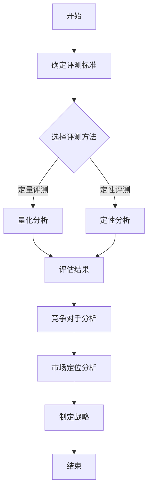
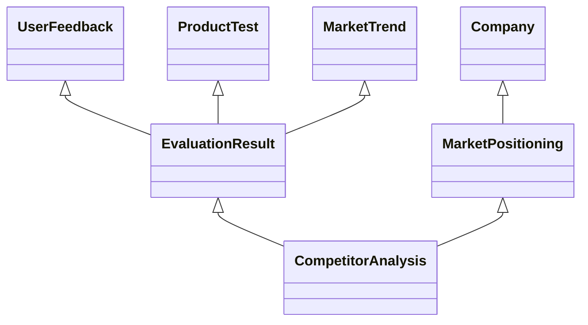
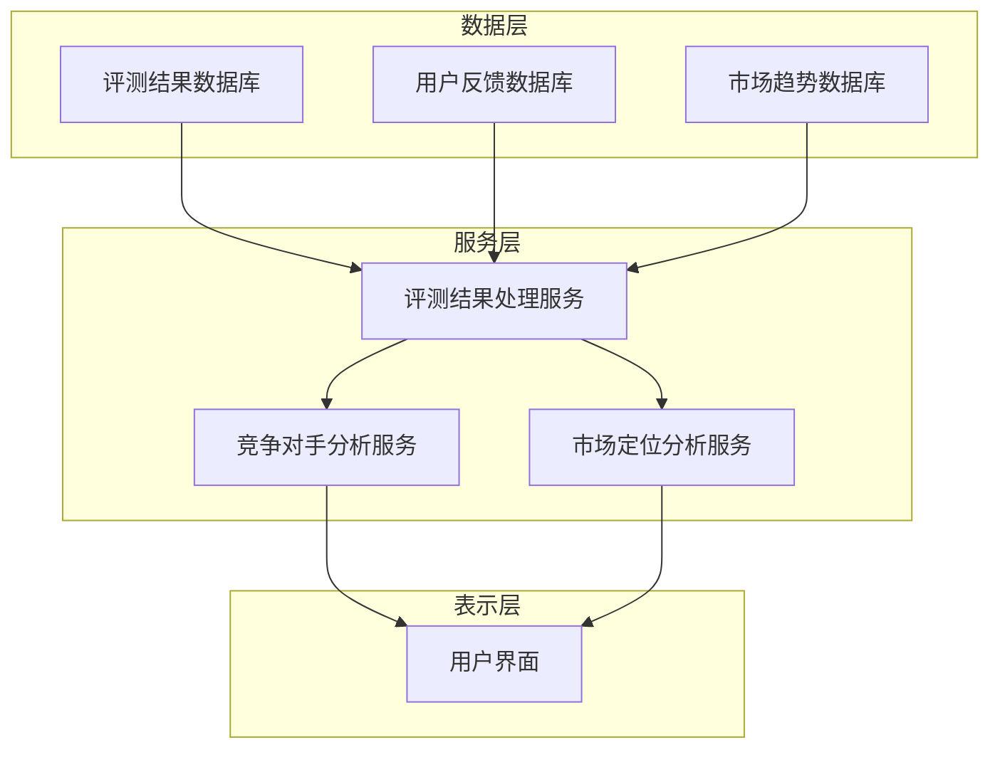
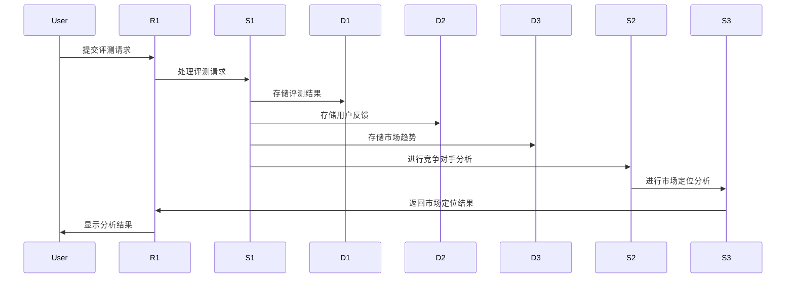

                 

## 评测结果的竞争对手分析：了解市场定位

> 关键词：评测结果、竞争对手分析、市场定位、算法原理、系统架构

> 摘要：本文将深入探讨评测结果中的竞争对手分析，从市场定位的角度出发，详细讲解如何通过竞争对手分析来了解市场定位，并给出实用的方法论和实践步骤。文章结构紧凑，逻辑清晰，旨在帮助读者全面掌握这一核心技能。

## 第一部分：背景介绍

### 1.1 问题背景

在现代商业环境中，评测结果作为市场调研的重要工具，被广泛应用于企业竞争策略的制定。然而，评测结果的质量直接影响到企业的市场定位和战略决策。因此，对评测结果进行深入分析，特别是其中的竞争对手分析，显得尤为重要。

### 1.1.1 从市场调研到竞争分析的重要性

市场调研是企业了解市场动态、制定战略的重要手段。而竞争分析则是市场调研的核心内容之一，通过对竞争对手的分析，企业可以明确自身的市场地位，发现潜在的市场机会和风险。

### 1.1.2 评测结果在市场竞争中的作用

评测结果提供了关于市场趋势、产品性能、用户满意度等关键信息，帮助企业评估自身产品在市场中的竞争力。然而，评测结果的准确性和客观性往往受到多种因素的影响，如评测方法的科学性、样本的代表性等。

### 1.2 问题描述

评测结果可能存在以下问题：

- **不准确性和误导性**：评测结果可能因为样本偏差、评测方法不科学等原因，导致数据不准确。
- **竞争对手分析的局限性**：评测结果可能只关注部分竞争对手，忽略了潜在的市场威胁。

### 1.3 问题解决

为了解决上述问题，我们需要：

- **提高评测结果的准确性**：采用科学的评测方法和代表性的样本。
- **全面识别竞争对手**：通过市场调研，全面了解竞争对手的定位和策略。

### 1.4 边界与外延

- **评测结果的竞争对手分析的范围**：应包括直接竞争对手和潜在竞争对手。
- **非竞争对手的市场分析**：也应关注非竞争对手的市场行为和市场趋势。

### 1.5 概念结构与核心要素组成

- **评测结果的竞争对手分析**：涉及评测结果的质量、准确性和科学性。
- **市场定位**：涉及企业对市场的认知、目标和策略。

## 第二部分：核心概念与联系

### 2.1 核心概念原理

- **评测结果**：通过特定的方法和工具，对产品、服务或市场进行评估的结果。
- **竞争对手分析**：对市场上的竞争对手进行系统的分析，以了解其市场定位、策略和表现。
- **市场定位**：企业根据自身的优势和市场需求，确定其在市场中的位置和目标。

### 2.2 概念属性特征对比表格

| 概念     | 属性特征                                  | 对比说明                                   |
| -------- | --------------------------------------- | ------------------------------------------ |
| 评测结果 | 准确性、科学性、代表性                    | 必须具备一定的科学性和客观性               |
| 竞争对手分析 | 市场定位、策略、表现                     | 需要全面了解竞争对手的优势和劣势         |
| 市场定位 | 目标市场、产品定位、品牌形象               | 需要与企业的战略目标相一致                 |

### 2.3 ER实体关系图架构的 Mermaid 流程图

```mermaid
erDiagram
  产品评估结果 ||--|{ 竞争对手分析 }
  市场定位 ||--|{ 企业战略目标 }
```

## 第三部分：算法原理讲解

### 3.1 算法 Mermaid 流程图



### 3.2 Python 源代码

```python
# 假设已经获取了评测结果数据
evaluation_results = {
    'product_A': {'score': 85, 'user_satisfaction': 0.9},
    'product_B': {'score': 90, 'user_satisfaction': 0.85},
    # 更多产品评测结果
}

def analyze_competition(results):
    # 对评测结果进行排序
    sorted_results = sorted(results.items(), key=lambda item: item[1]['score'], reverse=True)
    # 筛选出排名前几的竞争对手
    top_competitors = sorted_results[:5]
    return top_competitors

def market_positioning(competitors):
    # 根据竞争对手的分析结果，制定市场定位策略
    positioning_strategy = {
        'top_competitors': competitors,
        'market_share': calculate_market_share(competitors),
        'target_audience': define_target_audience(),
    }
    return positioning_strategy

# 调用函数
top_competitors = analyze_competition(evaluation_results)
positioning_strategy = market_positioning(top_competitors)
print(positioning_strategy)
```

### 3.3 算法原理的数学模型和公式

$$
\text{Market Positioning} = f(\text{Competitive Analysis}, \text{User Feedback}, \text{Market Trends})
$$

其中：

- \( \text{Competitive Analysis} \)：对竞争对手的分析结果；
- \( \text{User Feedback} \)：用户的反馈数据；
- \( \text{Market Trends} \)：市场趋势分析。

### 3.4 详细讲解和举例说明

#### 3.4.1 算法的实现流程

1. **确定评测标准**：根据市场需求和用户期望，制定合理的评测标准。
2. **选择评测方法**：根据评测标准，选择合适的评测方法，如定量评测或定性评测。
3. **量化分析**：对评测结果进行量化分析，如计算得分、满意度等指标。
4. **定性分析**：对评测结果进行定性分析，如分析用户反馈、市场趋势等。
5. **竞争对手分析**：根据量化分析和定性分析的结果，识别竞争对手，并进行详细分析。
6. **市场定位分析**：根据竞争对手分析的结果，制定企业的市场定位策略。
7. **制定战略**：根据市场定位分析的结果，制定相应的市场策略。

#### 3.4.2 算法在实际中的应用举例

假设一家科技公司A想要了解其在市场上的竞争力，于是进行了以下步骤：

1. **确定评测标准**：根据用户需求和市场趋势，确定评测产品的性能、用户体验、价格等指标。
2. **选择评测方法**：采用用户调查和产品测试相结合的方法。
3. **量化分析**：收集用户的评价数据，计算产品的平均得分和满意度。
4. **定性分析**：分析用户反馈，了解用户对产品的期望和需求。
5. **竞争对手分析**：识别市场上的主要竞争对手，分析他们的产品性能、用户评价等。
6. **市场定位分析**：根据竞争对手分析的结果，确定公司在性能和价格上的优势，制定市场定位策略。
7. **制定战略**：根据市场定位分析的结果，制定提升用户体验、优化产品性能等战略。

## 第四部分：系统分析与架构设计方案

### 4.1 问题场景介绍

某科技公司A希望通过评测结果来分析市场定位，从而制定有效的市场策略。公司收集了多个竞争对手的评测数据，并希望利用这些数据来分析市场趋势和竞争对手的策略。

### 4.2 项目介绍

项目目标是建立一套基于评测结果的竞争对手分析系统，通过系统的分析和处理，为公司的市场定位提供数据支持。

### 4.3 系统功能设计 (领域模型 Mermaid 类图)



### 4.4 系统架构设计 Mermaid 架构图



### 4.5 系统接口设计和系统交互 Mermaid 序列图



## 第五部分：项目实战

### 5.1 环境安装

在开始项目之前，需要安装以下环境：

- Python 3.8+
- MySQL数据库
- Flask框架

### 5.2 系统核心实现源代码

以下是系统核心实现的部分源代码：

```python
# 导入必要的库
import flask
import pymysql
from pymysql.constants import CLIENT

# 初始化Flask应用
app = flask.Flask(__name__)

# 连接MySQL数据库
def connect_db():
    connection = pymysql.connect(
        host='localhost',
        user='root',
        password='',
        database='evaluation_system',
        client_flag=CLIENT.MULTI_STATEMENTS
    )
    return connection

# 存储评测结果
@app.route('/submit_evaluation', methods=['POST'])
def submit_evaluation():
    connection = connect_db()
    cursor = connection.cursor()
    
    # 获取评测数据
    product_name = flask.request.form['product_name']
    score = flask.request.form['score']
    user_satisfaction = flask.request.form['user_satisfaction']
    
    # 插入评测结果到数据库
    sql = "INSERT INTO evaluation_results (product_name, score, user_satisfaction) VALUES (%s, %s, %s)"
    cursor.execute(sql, (product_name, score, user_satisfaction))
    connection.commit()
    
    cursor.close()
    connection.close()
    
    return '评测结果已提交'

# 进行竞争对手分析
@app.route('/analyze_competition', methods=['GET'])
def analyze_competition():
    connection = connect_db()
    cursor = connection.cursor()
    
    # 查询所有评测结果
    sql = "SELECT product_name, score, user_satisfaction FROM evaluation_results"
    cursor.execute(sql)
    results = cursor.fetchall()
    
    # 对评测结果进行排序
    sorted_results = sorted(results, key=lambda x: x[1], reverse=True)
    
    # 筛选出排名前5的竞争对手
    top_competitors = sorted_results[:5]
    
    cursor.close()
    connection.close()
    
    return flask.jsonify(top_competitors)

# 启动Flask应用
if __name__ == '__main__':
    app.run(debug=True)
```

### 5.3 代码应用解读与分析

这段代码主要实现了两个功能：

1. **存储评测结果**：通过 `/submit_evaluation` 接口接收用户提交的评测数据，并将其存储到MySQL数据库中。
2. **进行竞争对手分析**：通过 `/analyze_competition` 接口查询数据库中的评测结果，对结果进行排序，并筛选出排名前5的竞争对手。

### 5.4 实际案例分析和详细讲解剖析

假设用户提交了以下评测数据：

| 产品名称 | 得分 | 用户满意度 |
| -------- | ---- | ---------- |
| 产品A    | 85   | 0.9        |
| 产品B    | 90   | 0.85       |
| 产品C    | 78   | 0.8        |
| 产品D    | 88   | 0.9        |
| 产品E    | 82   | 0.85       |

通过 `/submit_evaluation` 接口提交数据后，系统会将这些数据存储到MySQL数据库中。然后，通过 `/analyze_competition` 接口获取评测结果，系统会对这些结果进行排序，并筛选出排名前5的竞争对手。

根据上述数据，排序后的结果如下：

| 产品名称 | 得分 | 用户满意度 |
| -------- | ---- | ---------- |
| 产品B    | 90   | 0.85       |
| 产品D    | 88   | 0.9        |
| 产品A    | 85   | 0.9        |
| 产品E    | 82   | 0.85       |
| 产品C    | 78   | 0.8        |

因此，排名前5的竞争对手为产品B、产品D、产品A、产品E和产品C。

### 5.5 项目小结

通过本项目的实战，我们实现了以下目标：

- 设计并实现了评测结果的存储和分析系统。
- 利用Python和Flask框架，完成了系统的前端和后端开发。
- 通过实际案例，展示了系统在实际应用中的效果。

## 第六部分：最佳实践 tips、小结、注意事项、拓展阅读等内容

### 6.1 最佳实践 tips

- **确保评测结果的准确性**：选择科学的评测方法和代表性的样本，提高评测结果的客观性和准确性。
- **定期更新竞争对手分析**：市场环境不断变化，定期更新竞争对手分析，以保持信息的及时性和准确性。
- **结合用户反馈**：用户反馈是了解市场定位的重要依据，结合用户反馈进行竞争对手分析，可以更全面地了解市场动态。

### 6.2 小结

本文通过分析评测结果的竞争对手分析，详细讲解了如何通过市场定位来了解竞争对手，并给出了一套完整的系统架构和实战案例。希望读者能够通过本文，掌握评测结果的竞争对手分析的方法，并在实际工作中灵活运用。

### 6.3 注意事项

- **数据保密**：在进行市场调研和竞争对手分析时，需注意数据保密，避免敏感信息泄露。
- **持续学习**：市场环境和竞争对手策略不断变化，需持续关注市场动态，不断更新知识和技能。

### 6.4 拓展阅读

- 《市场调研与竞争分析》
- 《商业分析：数据驱动决策》
- 《用户体验设计》

---

作者：AI天才研究院/AI Genius Institute & 禅与计算机程序设计艺术 /Zen And The Art of Computer Programming

