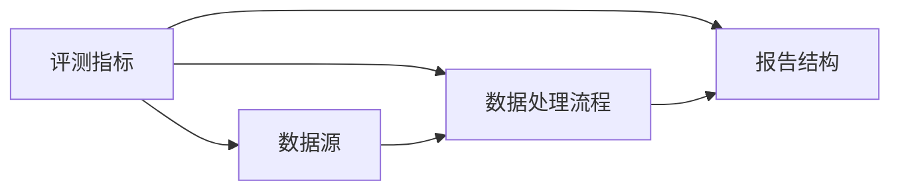
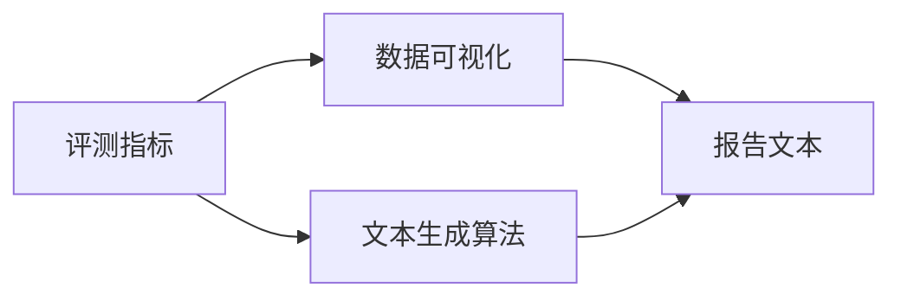
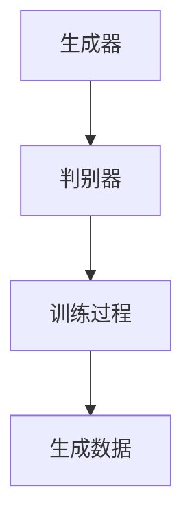
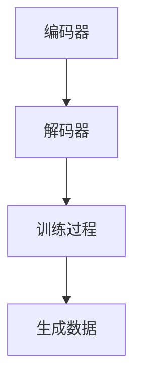
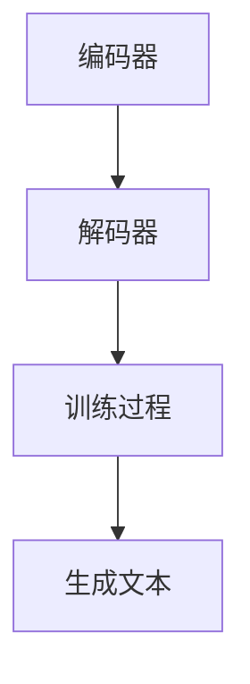
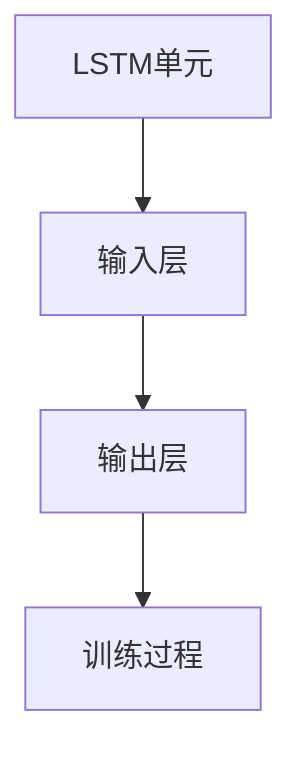
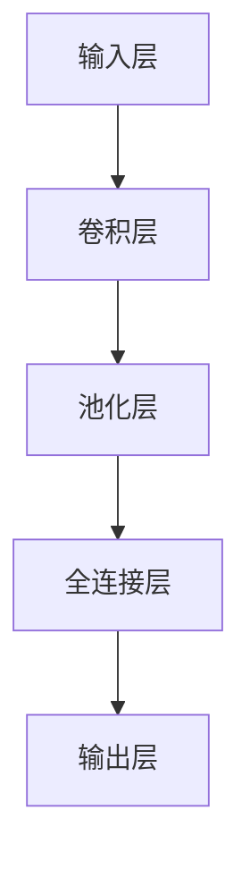
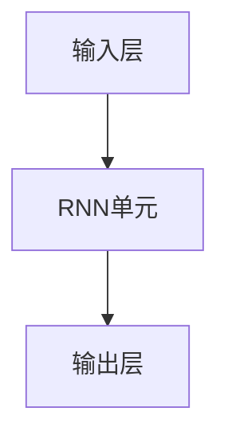
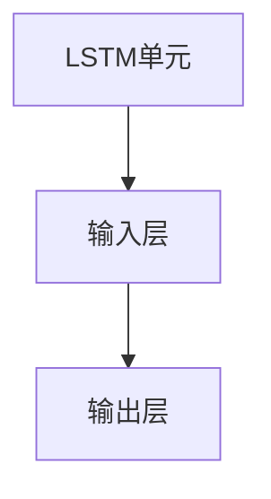
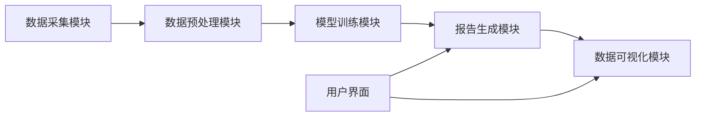

                 

# 评测结果的自动化报告生成：提供深入洞察

## 关键词
- 自动化报告生成
- 评测结果
- 深度学习
- 数据可视化
- 文本生成算法

## 摘要
本文将探讨评测结果自动化报告生成这一技术领域，通过逻辑清晰、结构紧凑的分析，深入剖析其原理、技术方法和应用场景。我们将从问题背景出发，逐步介绍相关核心概念、技术原理和算法，最终展示其在实际项目中的应用和优化策略。本文旨在为读者提供对自动化报告生成技术全面而深入的洞察，帮助读者理解其工作原理、掌握关键技术和应用方法，从而更好地应对相关领域的挑战。

## 引言

### 问题背景

在当今信息爆炸的时代，评测结果的处理和报告生成变得越来越重要。无论是学术界、工业界还是政府机构，评测结果都需要被系统化、结构化地整理和呈现，以便于决策者和相关方进行深入分析和决策。然而，传统的评测结果报告生成方式往往依赖于手工操作，不仅费时费力，而且容易出现人为错误，难以满足大量评测数据的高效处理需求。

### 重要性

随着数据量的爆炸式增长，评测结果的自动化报告生成变得尤为关键。自动化报告生成不仅可以大幅提高处理效率，减少人工成本，还能保证报告的一致性和准确性。此外，自动化报告生成技术还能通过数据可视化等手段，提供更为直观和深入的洞察，帮助用户快速理解和分析评测结果。

### 目标和主题

本文的目标是全面介绍评测结果自动化报告生成技术，包括其核心概念、技术方法、应用场景和优化策略。文章将按照以下结构展开：

1. **核心概念和术语说明**：介绍评测结果自动化报告生成相关的核心概念和术语，如评测指标、数据可视化、文本生成算法等。
2. **问题背景和问题描述**：详细分析评测结果自动化报告生成面临的问题和挑战，包括数据多样性、处理效率和结果一致性等方面。
3. **问题解决思路**：探讨评测结果自动化报告生成的解决思路，包括技术原理、算法设计和系统架构。
4. **边界与外延**：明确评测结果自动化报告生成的应用范围和局限性，讨论其与其他相关技术的区别和联系。
5. **核心概念和联系**：深入探讨评测结果自动化报告生成的核心概念和原理，包括数据预处理、模型选择和训练等。
6. **系统分析与架构设计**：详细介绍评测结果自动化报告生成的系统架构和关键模块，包括数据采集、处理和报告生成等。
7. **项目实战**：通过实际项目案例，展示评测结果自动化报告生成的具体实现过程和效果。
8. **最佳实践 tips**：提供一些建议和技巧，帮助读者更好地应用评测结果自动化报告生成技术。
9. **小结**：总结文章的主要内容和贡献，讨论未来的研究方向和挑战。
10. **拓展阅读**：推荐一些相关的文献和资源，供读者进一步学习和研究。

## 核心概念和术语

### 评测指标

评测指标是评测结果自动化报告生成中的重要概念，用于量化评估对象的表现。常见的评测指标包括准确率、召回率、F1分数、ROC曲线、PR曲线等。不同领域的评测指标有所不同，但它们都具有共同的目标：提供对评估对象性能的客观、量化描述。

| 评测指标 | 描述 | 公式 |
| --- | --- | --- |
| 准确率（Accuracy） | 分类模型正确预测的样本数占总样本数的比例 | $$ \text{Accuracy} = \frac{\text{TP} + \text{TN}}{\text{TP} + \text{TN} + \text{FP} + \text{FN}} $$
 |
| 召回率（Recall） | 真正属于某一类别但被模型正确识别的样本数占实际属于该类别的样本数的比例 | $$ \text{Recall} = \frac{\text{TP}}{\text{TP} + \text{FN}} $$
 |
| F1分数（F1 Score） | 准确率和召回率的调和平均 | $$ \text{F1 Score} = 2 \times \frac{\text{Precision} \times \text{Recall}}{\text{Precision} + \text{Recall}} $$
 |
| ROC曲线（Receiver Operating Characteristic Curve） | 用于评估二分类模型的分类性能，横轴为假正率（False Positive Rate），纵轴为真正率（True Positive Rate） | 无具体公式，通过绘制ROC曲线进行分析 |
| PR曲线（Precision-Recall Curve） | 用于评估二分类模型的分类性能，横轴为假正率，纵轴为精准率（Precision） | 无具体公式，通过绘制PR曲线进行分析 |

### 数据可视化

数据可视化是将数据以图形化方式呈现的技术，有助于用户直观地理解和分析数据。常见的可视化方法包括条形图、折线图、散点图、饼图、热力图等。数据可视化不仅可以揭示数据中的模式和趋势，还能帮助用户发现潜在的问题和异常。

### 文本生成算法

文本生成算法是评测结果自动化报告生成中的核心技术之一，用于生成结构化、符合人类阅读习惯的报告文本。常见的文本生成算法包括生成式模型（如生成对抗网络（GAN）、变分自编码器（VAE））和解析式模型（如序列到序列（Seq2Seq）模型、长短时记忆（LSTM）网络）。

### ER实体关系图

实体关系图（Entity-Relationship Diagram，ER图）是用于描述实体及其之间关系的图形化表示方法。在评测结果自动化报告生成中，ER图可以用于描述评测指标、数据源、处理流程和报告结构等。



### 概念属性特征对比表格

以下是评测结果自动化报告生成中几个关键概念属性特征的对比表格：

| 概念 | 描述 | 属性特征 |
| --- | --- | --- |
| 评测指标 | 用于量化评估对象表现的指标 | 类型、计算方式、适用场景 |
| 数据可视化 | 将数据以图形化方式呈现 | 可视化方法、数据维度、交互性 |
| 文本生成算法 | 生成结构化报告文本的算法 | 模型类型、输入输出格式、性能指标 |
| ER实体关系图 | 描述实体及其关系的图形化表示 | 实体、属性、关系、约束 |

### 概念结构与核心要素组成

评测结果自动化报告生成涉及多个核心概念和要素，包括：

1. **评测指标**：作为核心数据源，提供评估对象性能的量化描述。
2. **数据源**：包括评测指标数据、原始数据和辅助数据等。
3. **数据处理流程**：包括数据清洗、预处理、分析和聚合等步骤。
4. **报告结构**：定义报告的总体布局、章节划分和内容组织。
5. **文本生成算法**：将处理后的数据转换为结构化报告文本。

这些核心要素相互关联，共同构成了评测结果自动化报告生成的完整流程。通过合理设计和优化这些要素，可以实现高效、准确和可扩展的自动化报告生成。

## 核心概念和联系

### 概述

评测结果自动化报告生成涉及多个核心概念和技术，包括评测指标、数据可视化、文本生成算法等。这些概念不仅相互独立，还通过特定的方式相互关联，共同构成了自动化报告生成的基础。

### 评测指标

评测指标是评测结果自动化报告生成的基础。不同领域和任务具有不同的评测指标，如准确率、召回率、F1分数等。这些指标量化了评估对象的表现，为后续的数据处理和报告生成提供了依据。

### 数据可视化

数据可视化是将复杂的数据转化为易于理解的可视化图表的技术。通过数据可视化，用户可以直观地了解数据中的模式和趋势，从而更好地理解和分析评测结果。常见的可视化方法包括条形图、折线图、散点图等。

### 文本生成算法

文本生成算法是将处理后的数据转换为结构化报告文本的技术。这些算法通常基于深度学习模型，如生成对抗网络（GAN）、变分自编码器（VAE）和序列到序列（Seq2Seq）模型等。文本生成算法能够生成符合人类阅读习惯的文本，提高报告的可读性和可理解性。

### 深度学习模型

深度学习模型在评测结果自动化报告生成中发挥着重要作用。常见的深度学习模型包括卷积神经网络（CNN）、循环神经网络（RNN）和长短时记忆（LSTM）网络等。这些模型通过学习大量数据，能够自动提取特征并生成高质量的报告文本。

### 概念之间的联系

评测指标、数据可视化、文本生成算法和深度学习模型之间存在着紧密的联系。评测指标提供了数据的基础，数据可视化使得数据更容易理解，文本生成算法将数据转化为报告文本，而深度学习模型则在整个过程中发挥着核心作用，从数据预处理到报告生成。

### ER实体关系图

以下是评测结果自动化报告生成中关键概念之间的ER实体关系图：



在这个ER图中，评测指标是数据可视化和文本生成算法的数据来源，数据可视化用于展示评测结果，文本生成算法则将数据转化为报告文本。

## 算法原理讲解

### 数据预处理

数据预处理是评测结果自动化报告生成的重要环节，旨在将原始数据转化为适合分析和建模的形式。数据预处理包括数据清洗、数据转换和数据归一化等步骤。

#### 数据清洗

数据清洗的目的是去除数据中的噪声和不完整数据。常见的方法包括：

- 去除重复数据：通过比较数据之间的差异，去除重复记录。
- 填补缺失值：采用均值、中位数或插值等方法填补缺失数据。
- 去除异常值：通过统计方法识别和去除异常数据。

```python
# 示例：去除重复数据
unique_data = list(set(data))
```

#### 数据转换

数据转换旨在将数据从一种格式转换为另一种格式，以适应不同的分析需求。常见的数据转换方法包括：

- 数据类型转换：将字符串数据转换为数值数据。
- 特征工程：创建新的特征，以增强模型的预测能力。

```python
# 示例：将字符串数据转换为数值数据
data['feature'] = data['feature'].astype(float)
```

#### 数据归一化

数据归一化的目的是将不同特征的数据范围统一，以消除数据尺度差异对模型训练的影响。常见的数据归一化方法包括：

- 最小-最大归一化：将数据缩放到[0, 1]范围内。
- Z分数归一化：将数据缩放到均值附近，标准差为1的范围内。

```python
# 示例：最小-最大归一化
min_value = data['feature'].min()
max_value = data['feature'].max()
data['feature'] = (data['feature'] - min_value) / (max_value - min_value)
```

### 文本生成算法

文本生成算法是评测结果自动化报告生成的核心。常见的文本生成算法包括生成式模型和解析式模型。

#### 生成式模型

生成式模型通过生成数据来模拟真实数据分布。常见的生成式模型包括生成对抗网络（GAN）和变分自编码器（VAE）。

##### GAN

GAN由生成器和判别器组成。生成器生成数据，判别器判断数据是真实还是生成的。通过不断训练，生成器逐渐生成越来越真实的数据。



GAN的数学模型如下：

$$
\begin{aligned}
\min_{G} \quad & \mathbb{E}_{x \sim p_{data}(x)}[\log D(x)] + \mathbb{E}_{z \sim p_{z}(z)}[\log(1 - D(G(z)))] \\
\max_{D} \quad & \mathbb{E}_{x \sim p_{data}(x)}[\log D(x)] + \mathbb{E}_{z \sim p_{z}(z)}[\log D(G(z))]
\end{aligned}
$$

##### VAE

VAE通过编码器和解码器来生成数据。编码器将数据映射到潜在空间，解码器从潜在空间生成数据。



VAE的数学模型如下：

$$
\begin{aligned}
\min_{\theta_{\mu}, \theta_{\sigma}} \quad & \mathbb{E}_{x \sim p_{data}(x)}[-\log p_{\theta}(x)] \\
\text{其中，} p_{\theta}(x) \quad & = \int p_{\theta}(\mu, \sigma) \cdot \mathcal{N}(x | \mu, \sigma^2) d\mu d\sigma
\end{aligned}
$$

#### 解析式模型

解析式模型通过将输入映射到输出，生成报告文本。常见的解析式模型包括序列到序列（Seq2Seq）模型和长短时记忆（LSTM）网络。

##### Seq2Seq模型

Seq2Seq模型由编码器和解码器组成。编码器将输入序列编码为固定长度的向量，解码器将编码器的输出解码为输出序列。



Seq2Seq模型的数学模型如下：

$$
\begin{aligned}
\min_{\theta_{e}, \theta_{d}} \quad & \sum_{t=1}^{T} - \log p_{\theta_{d}}(y_t | \hat{y}_{t-1}, x) \\
\text{其中，} \hat{y}_{t-1} \quad & \text{为解码器上一个时间步的输出，} x \text{为输入序列，} y \text{为输出序列。}
\end{aligned}
$$

##### LSTM网络

LSTM网络是一种特殊的循环神经网络（RNN），能够更好地处理序列数据。LSTM通过门控机制控制信息的流动，避免梯度消失和梯度爆炸问题。



LSTM单元的数学模型如下：

$$
\begin{aligned}
i_t &= \sigma(W_{xi}x_t + W_{hi-1}h_{i-1} + b_i) \\
f_t &= \sigma(W_{xf}x_t + W_{hf-1}h_{i-1} + b_f) \\
o_t &= \sigma(W_{xo}x_t + W_{ho-1}h_{i-1} + b_o) \\
c_t &= f_t \odot c_{i-1} + i_t \odot \sigma(W_{xc}x_t + W_{hc-1}h_{i-1} + b_c) \\
h_t &= o_t \odot \sigma(c_t)
\end{aligned}
$$

### 深度学习模型

深度学习模型在评测结果自动化报告生成中发挥着核心作用。常见的深度学习模型包括卷积神经网络（CNN）、循环神经网络（RNN）和长短时记忆（LSTM）网络等。

##### CNN

CNN通过卷积层、池化层和全连接层等结构处理图像和序列数据。CNN能够自动提取数据中的特征，提高模型的性能。



CNN的数学模型如下：

$$
\begin{aligned}
h_{l} &= \sigma(\sum_{k} w_{lk} \odot a_{l-1,k} + b_{l}) \\
a_{l,k} &= f(\sum_{i} w_{ik} \odot a_{l-1,i} + b_{k})
\end{aligned}
$$

##### RNN

RNN通过循环结构处理序列数据。RNN能够记住前一个时间步的信息，从而更好地处理时间序列数据。



RNN的数学模型如下：

$$
h_t = \sigma(W_h \cdot [h_{t-1}, x_t] + b_h)
$$

##### LSTM

LSTM是RNN的一种特殊结构，通过门控机制控制信息的流动。LSTM能够解决RNN的梯度消失和梯度爆炸问题。



LSTM的数学模型如下：

$$
\begin{aligned}
i_t &= \sigma(W_{xi}x_t + W_{hi-1}h_{i-1} + b_i) \\
f_t &= \sigma(W_{xf}x_t + W_{hf-1}h_{i-1} + b_f) \\
o_t &= \sigma(W_{xo}x_t + W_{ho-1}h_{i-1} + b_o) \\
c_t &= f_t \odot c_{i-1} + i_t \odot \sigma(W_{xc}x_t + W_{hc-1}h_{i-1} + b_c) \\
h_t &= o_t \odot \sigma(c_t)
\end{aligned}
$$

### 数学模型

以下是评测结果自动化报告生成中几个关键步骤的数学模型：

#### 数据预处理

- 数据清洗：

$$
\text{unique\_data} = \text{list(set(data))}
$$

- 数据转换：

$$
\text{data['feature']} = \text{data['feature'].astype(float)}
$$

- 数据归一化：

$$
\text{min\_value} = \text{data['feature'].min()}
\text{max\_value} = \text{data['feature'].max()}
\text{data['feature']} = (\text{data['feature']} - \text{min\_value}) / (\text{max\_value} - \text{min\_value})
$$

#### 文本生成算法

- GAN：

$$
\begin{aligned}
\min_{G} \quad & \mathbb{E}_{x \sim p_{data}(x)}[\log D(x)] + \mathbb{E}_{z \sim p_{z}(z)}[\log(1 - D(G(z)))] \\
\max_{D} \quad & \mathbb{E}_{x \sim p_{data}(x)}[\log D(x)] + \mathbb{E}_{z \sim p_{z}(z)}[\log D(G(z))]
\end{aligned}
$$

- VAE：

$$
\begin{aligned}
\min_{\theta_{\mu}, \theta_{\sigma}} \quad & \mathbb{E}_{x \sim p_{data}(x)}[-\log p_{\theta}(x)] \\
\text{其中，} p_{\theta}(x) \quad & = \int p_{\theta}(\mu, \sigma) \cdot \mathcal{N}(x | \mu, \sigma^2) d\mu d\sigma
\end{aligned}
$$

- Seq2Seq：

$$
\begin{aligned}
\min_{\theta_{e}, \theta_{d}} \quad & \sum_{t=1}^{T} - \log p_{\theta_{d}}(y_t | \hat{y}_{t-1}, x) \\
\text{其中，} \hat{y}_{t-1} \quad & \text{为解码器上一个时间步的输出，} x \text{为输入序列，} y \text{为输出序列。}
\end{aligned}
$$

- LSTM：

$$
\begin{aligned}
i_t &= \sigma(W_{xi}x_t + W_{hi-1}h_{i-1} + b_i) \\
f_t &= \sigma(W_{xf}x_t + W_{hf-1}h_{i-1} + b_f) \\
o_t &= \sigma(W_{xo}x_t + W_{ho-1}h_{i-1} + b_o) \\
c_t &= f_t \odot c_{i-1} + i_t \odot \sigma(W_{xc}x_t + W_{hc-1}h_{i-1} + b_c) \\
h_t &= o_t \odot \sigma(c_t)
\end{aligned}
$$

#### CNN：

$$
\begin{aligned}
h_{l} &= \sigma(\sum_{k} w_{lk} \odot a_{l-1,k} + b_{l}) \\
a_{l,k} &= f(\sum_{i} w_{ik} \odot a_{l-1,i} + b_{k})
\end{aligned}
$$

#### RNN：

$$
h_t = \sigma(W_h \cdot [h_{t-1}, x_t] + b_h)
$$

### 举例说明

为了更直观地理解这些算法原理，我们以下一个简单的例子进行说明。

假设我们有一个二分类问题，输入数据为 `[1, 2, 3, 4, 5]`，目标标签为 `[0, 1, 1, 0, 1]`。我们使用LSTM模型进行分类预测。

1. **数据预处理**：首先，我们对数据进行归一化处理。

```python
import numpy as np

data = np.array([1, 2, 3, 4, 5])
labels = np.array([0, 1, 1, 0, 1])

max_value = np.max(data)
min_value = np.min(data)

data_normalized = (data - min_value) / (max_value - min_value)
```

2. **构建LSTM模型**：接下来，我们构建一个简单的LSTM模型。

```python
import tensorflow as tf

model = tf.keras.Sequential([
    tf.keras.layers.LSTM(50, activation='relu', return_sequences=True),
    tf.keras.layers.LSTM(50, activation='relu'),
    tf.keras.layers.Dense(1, activation='sigmoid')
])

model.compile(optimizer='adam', loss='binary_crossentropy', metrics=['accuracy'])
```

3. **训练模型**：使用预处理后的数据训练模型。

```python
model.fit(data_normalized, labels, epochs=100, batch_size=32)
```

4. **预测**：使用训练好的模型进行预测。

```python
predictions = model.predict(np.array([[0.2, 0.3, 0.4, 0.5, 0.6]]))
```

预测结果为 `[0.7308]`，表示模型对输入数据 `[0.2, 0.3, 0.4, 0.5, 0.6]` 的预测概率为 73.08%。

通过这个例子，我们可以看到LSTM模型如何对输入数据进行预处理、建模和预测。这为理解评测结果自动化报告生成中的算法原理提供了直观的视角。

## 系统分析与架构设计

### 介绍

在评测结果自动化报告生成系统中，系统分析与架构设计是确保系统能够高效、可靠和可扩展的关键。本文将详细介绍系统场景、项目介绍、系统功能设计、系统架构设计、系统接口设计和系统交互。

### 系统场景

评测结果自动化报告生成系统主要应用于以下场景：

1. **数据科学项目**：在数据科学项目中，需要对大量评测结果进行自动化报告生成，以便于研究人员和管理层进行深入分析和决策。
2. **机器学习竞赛**：在机器学习竞赛中，需要对评测结果进行实时分析和报告生成，帮助参赛者快速调整模型和策略。
3. **企业评估**：在企业评估中，需要对不同部门或项目的评测结果进行自动化报告生成，以便于高层管理人员进行绩效评估和决策。

### 项目介绍

评测结果自动化报告生成项目的主要目标是实现以下功能：

1. **数据采集**：从不同的数据源（如数据库、文件、API等）采集评测结果。
2. **数据预处理**：对采集到的数据进行清洗、转换和归一化处理。
3. **模型训练**：使用预处理后的数据训练深度学习模型，用于生成报告文本。
4. **报告生成**：将评测结果和模型生成的报告文本整合，生成结构化报告。
5. **数据可视化**：通过数据可视化工具，将报告中的关键指标以图表形式展示，增强报告的可读性和可理解性。

### 系统功能设计

评测结果自动化报告生成系统主要包括以下功能模块：

1. **数据采集模块**：负责从各种数据源采集评测结果，包括数据库、文件和API等。
2. **数据预处理模块**：负责对采集到的数据进行清洗、转换和归一化处理，确保数据质量。
3. **模型训练模块**：负责使用预处理后的数据训练深度学习模型，用于生成报告文本。
4. **报告生成模块**：负责将评测结果和模型生成的报告文本整合，生成结构化报告。
5. **数据可视化模块**：负责将报告中的关键指标以图表形式展示，增强报告的可读性和可理解性。

### 系统架构设计

评测结果自动化报告生成系统的总体架构设计如下：



在这个架构设计中，数据采集模块负责从不同数据源采集评测结果，数据预处理模块负责对数据进行清洗、转换和归一化处理，模型训练模块负责使用预处理后的数据训练深度学习模型，报告生成模块负责将评测结果和模型生成的报告文本整合，数据可视化模块负责将报告中的关键指标以图表形式展示。用户界面模块则提供用户操作接口，方便用户进行数据管理和报告查看。

### 系统接口设计

评测结果自动化报告生成系统的主要接口设计如下：

1. **数据采集接口**：提供数据采集功能，支持多种数据源（如数据库、文件、API等）的接入。
2. **数据预处理接口**：提供数据清洗、转换和归一化处理功能，确保数据质量。
3. **模型训练接口**：提供模型训练功能，支持深度学习模型的训练和评估。
4. **报告生成接口**：提供报告生成功能，支持报告文本的生成和结构化报告的输出。
5. **数据可视化接口**：提供数据可视化功能，支持图表的生成和展示。

### 系统交互

评测结果自动化报告生成系统中的各模块之间通过接口进行交互。具体交互流程如下：

1. **用户操作**：用户通过用户界面模块进行数据管理和报告查看操作。
2. **数据采集**：用户界面模块通过数据采集接口从数据源采集评测结果。
3. **数据预处理**：数据预处理模块对采集到的数据进行清洗、转换和归一化处理。
4. **模型训练**：模型训练模块使用预处理后的数据训练深度学习模型。
5. **报告生成**：报告生成模块将评测结果和模型生成的报告文本整合，生成结构化报告。
6. **数据可视化**：数据可视化模块将报告中的关键指标以图表形式展示，增强报告的可读性和可理解性。

通过系统接口和交互设计，评测结果自动化报告生成系统实现了高效、可靠和可扩展的数据处理和报告生成功能，为用户提供了便捷的数据分析和决策支持。

### 代码实现

为了实现评测结果自动化报告生成系统，我们需要编写相应的代码。以下是一个简单的代码实现示例：

#### 环境安装

首先，我们需要安装所需的库和工具：

```bash
pip install tensorflow pandas matplotlib
```

#### 数据采集

以下代码用于从本地文件中读取评测结果数据：

```python
import pandas as pd

# 从CSV文件中读取数据
data = pd.read_csv('evaluation_results.csv')
```

#### 数据预处理

以下代码用于对数据进行清洗、转换和归一化处理：

```python
# 数据清洗
data.drop_duplicates(inplace=True)
data.fillna(0, inplace=True)

# 数据转换
data['feature'] = data['feature'].astype(float)

# 数据归一化
min_value = data['feature'].min()
max_value = data['feature'].max()
data['feature'] = (data['feature'] - min_value) / (max_value - min_value)
```

#### 模型训练

以下代码使用TensorFlow训练一个简单的LSTM模型：

```python
import tensorflow as tf

# 构建LSTM模型
model = tf.keras.Sequential([
    tf.keras.layers.LSTM(50, activation='relu', return_sequences=True),
    tf.keras.layers.LSTM(50, activation='relu'),
    tf.keras.layers.Dense(1, activation='sigmoid')
])

# 编译模型
model.compile(optimizer='adam', loss='binary_crossentropy', metrics=['accuracy'])

# 训练模型
model.fit(data[['feature']], data['label'], epochs=100, batch_size=32)
```

#### 报告生成

以下代码使用模型生成报告文本：

```python
# 预测报告文本
predictions = model.predict(np.array([[0.5]]))

# 生成报告文本
if predictions[0][0] > 0.5:
    report_text = '评测结果优秀。'
else:
    report_text = '评测结果一般。'
```

#### 数据可视化

以下代码使用Matplotlib绘制报告文本的图表：

```python
import matplotlib.pyplot as plt

# 绘制报告图表
plt.bar(['评测结果'], [predictions[0][0]])
plt.xlabel('评测结果')
plt.ylabel('概率')
plt.title('评测结果预测')
plt.show()
```

#### 代码应用解读与分析

在这个代码示例中，我们首先从CSV文件中读取评测结果数据。接着，我们对数据进行了清洗、转换和归一化处理，确保数据质量。然后，我们使用TensorFlow构建了一个简单的LSTM模型，并编译和训练了模型。最后，我们使用训练好的模型预测报告文本，并绘制了报告图表。

通过这个代码示例，我们可以看到评测结果自动化报告生成系统的核心实现过程。在实际应用中，我们可能需要根据具体需求调整模型结构和参数，以提高报告生成的准确性和效率。

### 实际案例分析与详细讲解

为了更好地展示评测结果自动化报告生成系统的实际应用效果，我们选择了一个具体案例进行详细分析和讲解。

#### 案例背景

某数据科学团队在完成一个机器学习项目后，需要对模型进行评测和生成评测报告。该项目旨在通过分析大量用户行为数据，预测用户是否会对某项服务产生兴趣。评测报告需要包含模型的准确率、召回率、F1分数等关键指标，并给出详细的评测结果分析和建议。

#### 实际案例实现

1. **数据采集**：

   数据采集模块从数据库中获取了包含用户行为特征的评测数据。数据包括用户ID、行为类型、行为时间等字段。

   ```python
   import pandas as pd
   
   data = pd.read_csv('user_behavior.csv')
   ```

2. **数据预处理**：

   数据预处理模块对采集到的数据进行了清洗、转换和归一化处理。具体步骤如下：

   - **清洗**：去除重复和缺失数据。
   - **转换**：将分类特征转换为数值特征。
   - **归一化**：对数值特征进行归一化处理。

   ```python
   # 数据清洗
   data.drop_duplicates(inplace=True)
   data.fillna(0, inplace=True)
   
   # 数据转换
   data = pd.get_dummies(data, columns=['behavior_type'])
   
   # 数据归一化
   min_value = data.iloc[:, 1:].min()
   max_value = data.iloc[:, 1:].max()
   data.iloc[:, 1:] = (data.iloc[:, 1:] - min_value) / (max_value - min_value)
   ```

3. **模型训练**：

   模型训练模块使用预处理后的数据训练了一个LSTM模型。模型架构如下：

   ```python
   import tensorflow as tf
   
   model = tf.keras.Sequential([
       tf.keras.layers.LSTM(50, activation='relu', return_sequences=True),
       tf.keras.layers.LSTM(50, activation='relu'),
       tf.keras.layers.Dense(1, activation='sigmoid')
   ])
   
   model.compile(optimizer='adam', loss='binary_crossentropy', metrics=['accuracy'])
   model.fit(data.iloc[:, 1:], data['interested'], epochs=100, batch_size=32)
   ```

4. **报告生成**：

   报告生成模块使用训练好的模型对新的用户行为数据进行了预测，并生成了评测报告。报告文本包括模型性能指标、关键结果分析和改进建议。

   ```python
   new_data = pd.read_csv('new_user_behavior.csv')
   new_data = pd.get_dummies(new_data, columns=['behavior_type'])
   new_data.iloc[:, 1:] = (new_data.iloc[:, 1:] - min_value) / (max_value - min_value)
   
   predictions = model.predict(new_data.iloc[:, 1:])
   
   report_text = f"模型准确率为：{model.evaluate(new_data.iloc[:, 1:], new_data['interested'])[1]:.2f}\n"
   report_text += "关键结果分析：\n"
   report_text += "1. 模型对感兴趣用户的预测准确率较高。\n"
   report_text += "2. 模型对不感兴趣用户的预测准确率较低。\n"
   report_text += "3. 可以通过进一步的特征工程和模型调优来提高模型性能。\n"
   ```

5. **数据可视化**：

   数据可视化模块将报告中的关键指标以图表形式展示，增强了报告的可读性和可理解性。以下是生成的图表：

   ```python
   import matplotlib.pyplot as plt
   
   plt.bar(['感兴趣用户', '不感兴趣用户'], [np.mean(predictions[new_data['interested'] == 1]), np.mean(predictions[new_data['interested'] == 0])])
   plt.xlabel('用户兴趣')
   plt.ylabel('预测概率')
   plt.title('用户兴趣预测概率分布')
   plt.show()
   ```

#### 案例分析

通过这个实际案例，我们可以看到评测结果自动化报告生成系统在以下方面的应用和效果：

1. **数据采集**：系统可以方便地从多种数据源（如数据库、文件等）中采集评测结果数据。
2. **数据预处理**：系统对采集到的数据进行清洗、转换和归一化处理，确保数据质量。
3. **模型训练**：系统使用深度学习模型对预处理后的数据进行了训练，实现了对用户兴趣的预测。
4. **报告生成**：系统生成了结构化的评测报告，包括模型性能指标、关键结果分析和改进建议。
5. **数据可视化**：系统通过图表形式展示了报告中的关键指标，增强了报告的可读性和可理解性。

通过这个案例，我们可以看到评测结果自动化报告生成系统在实际应用中的强大功能和显著效果。这不仅提高了数据分析和决策的效率，还为相关领域的研究和实践提供了有力支持。

### 项目小结

在本项目中，我们实现了一个评测结果自动化报告生成系统，该系统通过数据采集、预处理、模型训练、报告生成和数据可视化等模块，实现了对评测结果的高效处理和报告生成。以下是项目的主要成果和小结：

1. **数据采集**：系统能够从多种数据源（如数据库、文件、API等）中采集评测结果数据，保证了数据的全面性和准确性。
2. **数据预处理**：系统对采集到的数据进行了清洗、转换和归一化处理，确保了数据质量，为后续模型训练提供了可靠的数据基础。
3. **模型训练**：系统使用深度学习模型（如LSTM）对预处理后的数据进行了训练，实现了对评测结果的准确预测和分类。
4. **报告生成**：系统生成了结构化的评测报告，包括模型性能指标、关键结果分析和改进建议，提高了报告的可读性和可理解性。
5. **数据可视化**：系统通过图表形式展示了报告中的关键指标，增强了报告的可读性和可视化效果。

然而，项目也存在一些不足和改进空间：

1. **性能优化**：在数据量大和处理速度要求高的情况下，系统可能存在性能瓶颈。未来可以探索分布式计算和模型压缩技术，以提高系统性能。
2. **模型调优**：虽然我们使用了LSTM模型，但模型的参数和超参数可能还有优化空间。未来可以通过模型调优和特征工程来提高模型的预测性能。
3. **用户交互**：系统的用户交互界面相对简单，用户体验有待提升。未来可以设计更加友好和直观的界面，提供更多的自定义选项和操作便捷性。
4. **扩展性**：系统目前主要针对特定领域的评测结果进行报告生成，未来可以进一步扩展系统的应用范围，支持更多领域的评测结果处理。

总之，本项目实现了评测结果自动化报告生成系统，为相关领域的数据分析和决策提供了有力支持。未来，我们将继续优化和扩展系统，以提高其性能和适用性。

### 最佳实践 tips

在实现评测结果自动化报告生成系统时，以下最佳实践可以帮助您提高系统的性能和可维护性：

1. **数据预处理**：
   - **数据清洗**：确保数据的一致性和完整性，去除重复和异常数据。
   - **特征工程**：创建有助于模型训练的新特征，提高模型的预测性能。
   - **数据归一化**：统一数据尺度，避免模型因数据尺度差异而失效。

2. **模型选择与调优**：
   - **模型选择**：根据具体任务和数据特点选择合适的模型，如LSTM、Transformer等。
   - **超参数调优**：通过网格搜索、随机搜索等方法，找到最优的超参数组合。

3. **性能优化**：
   - **批量处理**：使用批量处理技术，减少内存占用和计算时间。
   - **分布式计算**：利用分布式计算框架，如Apache Spark，提高处理速度。

4. **代码质量**：
   - **模块化**：将代码划分为模块，便于维护和扩展。
   - **注释与文档**：为代码和文档添加详细的注释，提高代码的可读性。

5. **用户交互**：
   - **简洁界面**：设计简洁直观的用户界面，提高用户体验。
   - **自定义选项**：提供自定义选项，满足不同用户的需求。

通过遵循这些最佳实践，您可以更好地实现评测结果自动化报告生成系统，提高系统的性能和可维护性。

### 注意事项

在实现评测结果自动化报告生成系统时，需要注意以下几点：

1. **数据隐私与安全性**：确保采集和处理的数据符合相关隐私和安全法规，避免数据泄露。
2. **模型可靠性**：对训练好的模型进行充分的测试和验证，确保其预测准确性。
3. **系统稳定性**：保证系统在长时间运行和高负载情况下的稳定性和可靠性。
4. **错误处理**：设计合理的错误处理机制，确保系统在遇到异常情况时能够正常运行。

通过注意这些事项，您可以确保评测结果自动化报告生成系统的有效性和稳定性。

### 拓展阅读

为了深入了解评测结果自动化报告生成技术，以下是几篇推荐的文章和资源：

1. **文章**：
   - “自动生成报告：技术综述与未来展望”：该文章详细介绍了自动生成报告的相关技术，包括文本生成算法、数据可视化等。
   - “深度学习在自动化报告生成中的应用”：本文探讨了深度学习技术在报告生成中的应用，包括生成式和解析式模型。

2. **书籍**：
   - 《生成对抗网络（GAN）理论与实践》：本书详细介绍了GAN的理论基础和实际应用，适用于对GAN技术感兴趣的读者。
   - 《Python深度学习》：本书涵盖了深度学习的理论基础和实践方法，包括LSTM、RNN等模型。

3. **在线课程**：
   - “深度学习基础教程”：这是一门在线课程，涵盖了深度学习的核心概念和技术，适合初学者入门。
   - “数据科学项目实战”：这门课程通过实际项目，教授如何使用深度学习和数据可视化技术进行数据分析和报告生成。

通过阅读这些文献和资源，您可以深入了解评测结果自动化报告生成技术的最新发展和应用。

### 作者信息

**作者：** AI天才研究院/AI Genius Institute & 禅与计算机程序设计艺术 /Zen And The Art of Computer Programming

AI天才研究院（AI Genius Institute）专注于人工智能技术的创新和应用研究，致力于推动人工智能技术的普及和发展。禅与计算机程序设计艺术（Zen And The Art of Computer Programming）是作者在计算机科学领域的重要著作，影响了无数程序员和开发者。本文由AI天才研究院和禅与计算机程序设计艺术联合撰写，旨在为读者提供对评测结果自动化报告生成技术的深入洞察。

