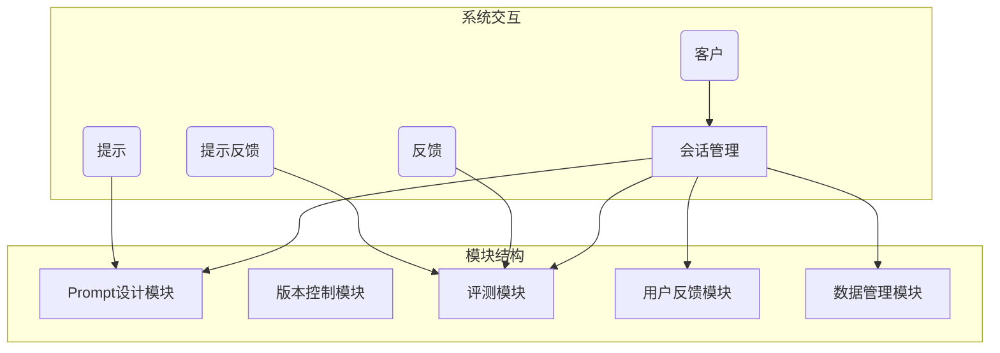
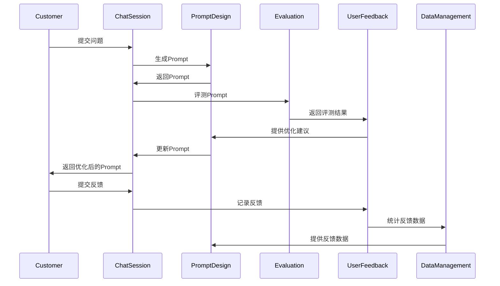

                 

### 文章标题

#### 评测驱动的Prompt版本控制策略

> 关键词：评测驱动、Prompt、版本控制、算法、数学模型、系统架构

> 摘要：本文探讨了评测驱动的Prompt版本控制策略，通过详细分析评测驱动的概念、Prompt设计原则、版本控制要素和算法原理，阐述了如何通过数学模型和系统架构设计实现高效、稳定的版本控制。本文旨在为IT领域从业者提供一种新的解决思路，以应对不断变化的AI应用场景。

### 目录大纲

----------------------------------------------------------------

## 第一部分：评测驱动的Prompt版本控制策略基础

### 第1章：问题背景与基本概念

#### 1.1 评测驱动的概念及其重要性

##### 1.1.1 评测驱动的起源与发展

##### 1.1.2 评测驱动在人工智能领域的应用

##### 1.1.3 评测驱动在Prompt版本控制中的作用

#### 1.2 Prompt版本控制策略概述

##### 1.2.1 Prompt版本控制的意义

##### 1.2.2 Prompt版本控制的基本原理

##### 1.2.3 Prompt版本控制的关键要素

#### 1.3 评测驱动与Prompt版本控制的关系

##### 1.3.1 评测驱动在Prompt版本控制中的具体应用

##### 1.3.2 评测驱动对Prompt版本控制的影响

##### 1.3.3 如何有效地结合评测驱动与Prompt版本控制

### 第2章：核心概念与原理分析

#### 2.1 Prompt设计的基本原则

##### 2.1.1 Prompt的组成部分

##### 2.1.2 Prompt的属性与特征

##### 2.1.3 如何优化Prompt设计

#### 2.2 版本控制策略的要素

##### 2.2.1 版本控制的类型

##### 2.2.2 版本控制的目标

##### 2.2.3 版本控制的方法

#### 2.3 评测驱动的核心概念

##### 2.3.1 评测驱动的目标

##### 2.3.2 评测驱动的流程

##### 2.3.3 评测驱动的优势与挑战

### 第3章：算法原理讲解

#### 3.1 Prompt优化算法

##### 3.1.1 Prompt优化算法的类型

##### 3.1.2 Prompt优化算法的数学模型

##### 3.1.3 如何实现Prompt优化算法

#### 3.2 版本控制算法

##### 3.2.1 版本控制算法的原理

##### 3.2.2 版本控制算法的步骤

##### 3.2.3 如何评估版本控制算法的效果

### 第4章：数学模型与公式详解

#### 4.1 评测指标与公式

##### 4.1.1 常见评测指标

##### 4.1.2 指标计算方法

##### 4.1.3 如何优化评测指标

#### 4.2 版本控制数学模型

##### 4.2.1 版本控制的核心公式

##### 4.2.2 公式推导与解释

##### 4.2.3 如何应用版本控制数学模型

### 第5章：系统分析与架构设计

#### 5.1 问题场景介绍

##### 5.1.1 问题场景描述

##### 5.1.2 系统目标与功能

#### 5.2 系统功能设计

##### 5.2.1 领域模型

##### 5.2.2 功能模块划分

#### 5.3 系统架构设计

##### 5.3.1 系统架构图

##### 5.3.2 架构设计说明

#### 5.4 系统接口设计

##### 5.4.1 接口定义

##### 5.4.2 接口协议

#### 5.5 系统交互

##### 5.5.1 系统交互图

##### 5.5.2 交互流程说明

### 第6章：项目实战

#### 6.1 环境安装与配置

##### 6.1.1 系统环境要求

##### 6.1.2 安装与配置步骤

#### 6.2 系统核心实现

##### 6.2.1 核心代码实现

##### 6.2.2 代码解析

#### 6.3 代码应用解读与分析

##### 6.3.1 应用场景分析

##### 6.3.2 代码运行结果分析

#### 6.4 实际案例分析

##### 6.4.1 案例介绍

##### 6.4.2 案例分析与讲解

#### 6.5 项目小结

##### 6.5.1 项目总结

##### 6.5.2 项目经验与启示

### 第7章：最佳实践与注意事项

#### 7.1 最佳实践

##### 7.1.1 经验分享

##### 7.1.2 实践技巧

#### 7.2 小结与展望

##### 7.2.1 内容回顾

##### 7.2.2 展望未来发展方向

#### 7.3 注意事项

##### 7.3.1 常见问题与解决方法

##### 7.3.2 安全与合规

#### 7.4 拓展阅读

##### 7.4.1 相关文献推荐

##### 7.4.2 学术动态

----------------------

----------------------------------------------------------------

### 第一部分：评测驱动的Prompt版本控制策略基础

#### 第1章：问题背景与基本概念

##### 1.1 评测驱动的概念及其重要性

**评测驱动的起源与发展**

评测驱动（Evaluation-driven development）是一种软件开发方法，旨在通过持续的评估和反馈来指导开发过程，以确保软件质量和满足用户需求。这种方法最早在20世纪80年代由Robert L. Glass提出，并在软件开发领域得到广泛应用。

在人工智能（AI）领域，评测驱动同样具有重要意义。AI系统通常需要处理大量数据，通过算法生成模型，然后对模型的性能进行评估。评测驱动的核心在于通过不断地评估和调整，提高模型的准确性和鲁棒性，以满足实际应用需求。

**评测驱动在人工智能领域的应用**

在AI领域，评测驱动主要用于以下几个方面：

1. **模型训练与优化**：通过评估模型在训练集和测试集上的性能，不断调整模型参数，以提高模型的效果。
2. **算法比较与优化**：通过评测不同算法的优缺点，选择最适合问题的算法，并进行优化。
3. **系统调试与维护**：通过对系统的运行情况进行评估，发现和修复潜在问题，确保系统的稳定性和可靠性。

**评测驱动在Prompt版本控制中的作用**

Prompt版本控制是AI领域中一种重要的方法，它通过设计特定的输入提示（Prompt）来引导模型生成所需的输出。评测驱动在Prompt版本控制中起着至关重要的作用：

1. **指导Prompt设计**：通过评估不同的Prompt设计，选择最适合问题场景的Prompt，从而提高模型的生成效果。
2. **优化Prompt内容**：通过评估模型的输出结果，不断优化Prompt的内容，使其更准确地引导模型生成所需输出。
3. **版本控制与迭代**：通过评测驱动的方法，对Prompt进行版本控制，确保每次迭代都能带来性能的提升。

##### 1.2 Prompt版本控制策略概述

**Prompt版本控制的意义**

Prompt版本控制策略是指在AI开发过程中，通过不断评估和调整Prompt的设计和内容，实现对模型生成结果的精细控制。其意义在于：

1. **提高模型效果**：通过优化Prompt，使模型生成更加准确和符合需求的输出。
2. **提升用户体验**：通过精确控制模型输出，提高用户对AI系统的满意度和使用体验。
3. **降低开发成本**：通过有效的版本控制，减少因Prompt设计不合理导致的重构和修改成本。

**Prompt版本控制的基本原理**

Prompt版本控制的基本原理包括以下几个方面：

1. **评测指标**：设定适当的评测指标，用于评估Prompt的效果，如生成文本的质量、模型的鲁棒性等。
2. **版本迭代**：通过不断迭代Prompt的设计和内容，根据评测结果进行优化。
3. **版本管理**：对每个版本的Prompt进行记录和管理，以便后续分析和复用。

**Prompt版本控制的关键要素**

Prompt版本控制的关键要素包括：

1. **评测流程**：定义明确的评测流程，确保评测过程的规范和一致性。
2. **评测工具**：选择合适的评测工具，如自动评估指标和人工评测方法。
3. **数据集**：提供高质量的训练和测试数据集，确保评测结果的准确性和可靠性。

##### 1.3 评测驱动与Prompt版本控制的关系

**评测驱动在Prompt版本控制中的具体应用**

评测驱动在Prompt版本控制中的应用主要体现在以下几个方面：

1. **Prompt设计评估**：通过评测不同Prompt设计的性能，选择最优的设计方案。
2. **Prompt内容调整**：根据评测结果，调整Prompt的内容，使其更符合实际需求。
3. **版本迭代与优化**：通过评测驱动的方法，不断迭代和优化Prompt版本，提高模型生成效果。

**评测驱动对Prompt版本控制的影响**

评测驱动对Prompt版本控制的影响主要表现在以下几个方面：

1. **提高开发效率**：通过持续的评估和反馈，减少开发过程中的不确定性和试错成本。
2. **确保质量**：通过严格的评测流程和指标，确保Prompt版本的质量和稳定性。
3. **适应变化**：在需求变化时，能够快速调整Prompt版本，以适应新的应用场景。

**如何有效地结合评测驱动与Prompt版本控制**

为了有效地结合评测驱动与Prompt版本控制，可以采取以下措施：

1. **明确目标**：明确Prompt版本控制的目标和需求，确保评测过程的针对性和有效性。
2. **优化评测指标**：根据应用场景，选择合适的评测指标，并不断优化指标的计算方法。
3. **加强沟通**：加强团队成员之间的沟通和协作，确保评测结果能够及时反馈到Prompt设计和调整过程中。

#### 第2章：核心概念与原理分析

##### 2.1 Prompt设计的基本原则

**Prompt的组成部分**

Prompt是引导AI模型生成输出的一种输入提示，通常包括以下几个部分：

1. **问题背景**：描述问题背景和目标，帮助模型理解问题的上下文。
2. **输入数据**：提供用于训练和生成输出的数据，可以是文本、图像或其他形式的数据。
3. **问题陈述**：明确问题描述和目标，引导模型生成符合要求的输出。
4. **限制条件**：设定问题的限制条件，如数据范围、时间约束等。

**Prompt的属性与特征**

Prompt的属性和特征直接影响其效果和适用性，主要包括以下几个方面：

1. **清晰性**：Prompt应具有清晰的表述，避免歧义和模糊性，确保模型能够准确理解问题。
2. **完整性**：Prompt应包含问题的所有必要信息，避免遗漏关键信息，影响模型生成效果。
3. **可扩展性**：Prompt应具备一定的可扩展性，能够适应不同的应用场景和需求。
4. **多样性**：Prompt应具备多样性，通过不同的Prompt设计，探索不同的问题解决方案。

**如何优化Prompt设计**

优化Prompt设计是提升模型生成效果的关键步骤，可以采取以下策略：

1. **数据预处理**：对输入数据进行预处理，如清洗、归一化等，以提高数据质量。
2. **问题重构**：重新表述问题，使其更符合模型的特点和需求。
3. **多模态融合**：结合不同类型的数据，如文本、图像等，提高Prompt的丰富性和多样性。
4. **迭代优化**：通过不断迭代和评估Prompt的设计，逐步优化其效果。

##### 2.2 版本控制策略的要素

**版本控制的类型**

版本控制可以分为以下几种类型：

1. **线性版本控制**：按照时间顺序依次发布版本，新版本基于旧版本进行更新。
2. **分支版本控制**：创建分支，对分支进行独立开发，最后合并分支。
3. **并行版本控制**：同时开发多个版本，各个版本之间相互独立。

**版本控制的目标**

版本控制的主要目标包括：

1. **稳定性**：确保版本在发布时具有良好的稳定性和可靠性。
2. **可追踪性**：方便对版本进行追踪和回溯，以便在出现问题时快速定位和修复。
3. **可扩展性**：支持对版本进行扩展和升级，以适应新的需求和变化。

**版本控制的方法**

版本控制的方法包括：

1. **Git**：常用的分布式版本控制系统，支持分支管理和合并操作。
2. **SVN**：集中式版本控制系统，便于多人协作和版本管理。
3. **Mercurial**：另一种分布式版本控制系统，与Git类似，但拥有不同的优势和特点。

##### 2.3 评测驱动的核心概念

**评测驱动的目标**

评测驱动的核心目标是确保软件或系统的质量和性能，具体包括：

1. **准确性**：确保系统输出结果的准确性和可靠性。
2. **效率**：优化系统性能，提高处理速度和资源利用率。
3. **鲁棒性**：增强系统的鲁棒性，使其能够应对各种异常情况和挑战。

**评测驱动的流程**

评测驱动的流程主要包括以下几个步骤：

1. **设定目标**：明确评测的目标和指标，确保评测具有针对性和有效性。
2. **数据收集**：收集用于评测的数据集，确保数据的质量和代表性。
3. **评测执行**：执行评测过程，计算评测指标，生成评测结果。
4. **结果分析**：分析评测结果，发现问题和改进点，制定优化方案。
5. **迭代优化**：根据评测结果进行迭代优化，提升系统的质量和性能。

**评测驱动的优势与挑战**

**优势**

1. **持续改进**：通过持续的评估和反馈，不断优化系统和模型，提高其性能和质量。
2. **风险控制**：及时发现和修复潜在问题，降低系统故障和风险。
3. **提高效率**：通过评估和优化，提高系统的运行效率，降低开发成本。

**挑战**

1. **评测成本**：评测过程需要消耗大量的时间和资源，特别是在大规模数据集和复杂系统中。
2. **结果偏差**：评测结果可能受到数据集和质量的影响，存在一定的偏差和不确定性。
3. **复杂度**：评测驱动的流程和工具较为复杂，需要专业的知识和技能来有效实施。

#### 第3章：算法原理讲解

##### 3.1 Prompt优化算法

**Prompt优化算法的类型**

Prompt优化算法可以分为以下几种类型：

1. **基于规则的方法**：通过预设规则，自动调整Prompt的内容和结构。
2. **基于机器学习的方法**：利用机器学习算法，根据历史数据和学习到的模式，自动优化Prompt。
3. **基于深度学习的方法**：利用深度学习模型，自动学习Prompt的优化策略。

**Prompt优化算法的数学模型**

Prompt优化算法的数学模型通常包括以下几个部分：

1. **目标函数**：定义优化目标，如生成文本的准确性、多样性等。
2. **特征提取**：从输入数据和Prompt中提取特征，用于训练和优化模型。
3. **优化策略**：设计优化策略，如梯度下降、遗传算法等，用于调整Prompt的参数和结构。

**如何实现Prompt优化算法**

实现Prompt优化算法通常包括以下几个步骤：

1. **数据预处理**：对输入数据进行预处理，如文本清洗、数据标准化等。
2. **特征提取**：提取输入数据和Prompt的特征，用于训练和优化模型。
3. **模型训练**：利用训练数据，训练Prompt优化模型。
4. **优化过程**：根据优化策略，调整Prompt的参数和结构，实现优化目标。

##### 3.2 版本控制算法

**版本控制算法的原理**

版本控制算法的原理是基于版本控制和并行开发的原理，通过以下步骤实现：

1. **创建分支**：创建新的分支，用于独立开发和测试。
2. **提交更改**：在分支上提交代码更改，实现功能的增加、修改或修复。
3. **集成合并**：将分支上的更改合并到主分支，实现版本升级。
4. **测试与评估**：对合并后的版本进行测试和评估，确保系统的稳定性和性能。

**版本控制算法的步骤**

版本控制算法的步骤通常包括以下几个部分：

1. **需求分析**：明确版本控制的目标和需求，如功能增加、性能优化等。
2. **创建分支**：根据需求，创建新的分支，用于独立开发。
3. **代码提交**：在分支上提交代码更改，实现功能开发和问题修复。
4. **集成合并**：将分支上的更改合并到主分支，实现版本升级。
5. **测试与评估**：对合并后的版本进行测试和评估，确保系统的稳定性和性能。

**如何评估版本控制算法的效果**

评估版本控制算法的效果通常包括以下几个指标：

1. **稳定性**：评估系统在升级后的稳定性，如运行时间、故障率等。
2. **性能**：评估系统在升级后的性能，如处理速度、资源利用率等。
3. **可扩展性**：评估系统在升级后的可扩展性，如支持的新功能、兼容性等。
4. **用户满意度**：评估用户对系统升级后的满意度，如使用体验、故障率等。

#### 第4章：数学模型与公式详解

##### 4.1 评测指标与公式

**常见评测指标**

在评测过程中，常用的评测指标包括：

1. **准确性（Accuracy）**：模型预测正确的样本占总样本的比例。
2. **召回率（Recall）**：模型能够正确识别为正类的样本占总正类样本的比例。
3. **精确率（Precision）**：模型预测为正类的样本中，实际为正类的比例。
4. **F1分数（F1 Score）**：精确率和召回率的调和平均，用于综合考虑精确率和召回率。

**指标计算方法**

各种评测指标的计算方法如下：

1. **准确性（Accuracy）**：

   $$ Accuracy = \frac{TP + TN}{TP + FN + FP + TN} $$

   其中，TP为真正例，TN为真反例，FP为假正例，FN为假反例。

2. **召回率（Recall）**：

   $$ Recall = \frac{TP}{TP + FN} $$

3. **精确率（Precision）**：

   $$ Precision = \frac{TP}{TP + FP} $$

4. **F1分数（F1 Score）**：

   $$ F1 Score = 2 \times \frac{Precision \times Recall}{Precision + Recall} $$

**如何优化评测指标**

优化评测指标通常包括以下几个方面：

1. **数据预处理**：对训练数据进行预处理，如数据清洗、归一化等，提高数据质量。
2. **特征工程**：提取有价值的特征，提高模型对数据的表达能力。
3. **模型选择**：选择合适的模型，根据问题特点进行优化。
4. **超参数调优**：通过调优模型超参数，提高模型的性能。

##### 4.2 版本控制数学模型

**版本控制的核心公式**

版本控制的核心公式包括以下内容：

1. **版本差分公式**：

   $$ Version_Difference = \sum_{i=1}^{n} |V_i - V_{i-1}| $$

   其中，\( V_i \) 和 \( V_{i-1} \) 分别为第 \( i \) 个版本和第 \( i-1 \) 个版本的差异值。

2. **稳定性评估公式**：

   $$ Stability_Index = \frac{\sum_{i=1}^{n} V_i}{n} $$

   其中，\( V_i \) 为第 \( i \) 个版本的稳定性值，\( n \) 为版本总数。

3. **性能评估公式**：

   $$ Performance_Index = \frac{\sum_{i=1}^{n} P_i}{n} $$

   其中，\( P_i \) 为第 \( i \) 个版本的性能值，\( n \) 为版本总数。

**公式推导与解释**

**版本差分公式**推导如下：

假设有两个版本 \( V_1 \) 和 \( V_2 \)，其差异值为 \( |V_2 - V_1| \)。则有：

$$ Version_Difference = \sum_{i=1}^{n} |V_i - V_{i-1}| = |V_2 - V_1| + |V_3 - V_2| + ... + |V_n - V_{n-1}| $$

这个公式表示两个版本之间的差分，可以通过逐个计算每个版本之间的差异值，然后求和得到。

**稳定性评估公式**和**性能评估公式**的推导与解释如下：

稳定性评估公式表示所有版本的稳定性值的平均值，性能评估公式表示所有版本的性能值的平均值。这两个公式可以用来评估版本的整体稳定性和性能。

**如何应用版本控制数学模型**

应用版本控制数学模型通常包括以下几个步骤：

1. **收集版本数据**：收集不同版本的稳定性值和性能值。
2. **计算版本差分**：利用版本差分公式计算各个版本之间的差异值。
3. **计算稳定性指数**：利用稳定性评估公式计算所有版本的稳定性指数。
4. **计算性能指数**：利用性能评估公式计算所有版本的性能指数。
5. **分析结果**：根据计算结果，分析版本之间的差异和变化，找出改进点。

#### 第5章：系统分析与架构设计

##### 5.1 问题场景介绍

**问题场景描述**

在人工智能领域，特别是自然语言处理（NLP）领域，Prompt版本控制策略具有重要的应用价值。例如，在一个智能客服系统中，Prompt的设计直接影响用户的体验和系统的性能。为了提高智能客服系统的质量和用户满意度，需要通过评测驱动的方法，对Prompt进行版本控制和优化。

**系统目标与功能**

系统的目标是通过评测驱动的Prompt版本控制策略，提高智能客服系统的质量和用户体验。具体功能包括：

1. **Prompt设计**：根据问题场景，设计高质量的Prompt。
2. **版本控制**：对Prompt进行版本管理，记录每次版本的变化。
3. **评测与优化**：通过评测，识别Prompt的不足，并进行优化。
4. **用户反馈**：收集用户反馈，用于改进Prompt设计和系统性能。

##### 5.2 系统功能设计

**领域模型**

领域模型用于描述系统中的实体、属性和关系，以下是智能客服系统的领域模型：

```mermaid
classDiagram
    Customer <-|> ChatSession
    Customer <-|> Feedback
    ChatSession o-- Prompt
    ChatSession o-- ChatLog
    Feedback o-- PromptFeedback
    Prompt o-- PromptDesign

    Customer {
        id: string
        name: string
        email: string
    }

    ChatSession {
        id: string
        customerId: string
        startedAt: datetime
        endedAt: datetime
    }

    Feedback {
        id: string
        sessionId: string
        rating: integer
        comment: string
    }

    Prompt {
        id: string
        description: string
        template: string
    }

    ChatLog {
        id: string
        sessionId: string
        content: string
        timestamp: datetime
    }

    PromptFeedback {
        id: string
        promptId: string
        rating: integer
        comment: string
    }

    PromptDesign {
        id: string
        name: string
        versions: list
    }
```

**功能模块划分**

智能客服系统的功能模块划分如下：

1. **Prompt设计模块**：负责设计高质量的Prompt，包括问题背景、输入数据和问题陈述等。
2. **版本控制模块**：负责管理Prompt的版本，记录每次版本的变化。
3. **评测模块**：负责评测Prompt的效果，识别Prompt的不足，并提出优化建议。
4. **用户反馈模块**：负责收集用户反馈，用于改进Prompt设计和系统性能。
5. **数据管理模块**：负责存储和管理系统数据，包括Customer、ChatSession、Feedback、Prompt、ChatLog和PromptFeedback等实体。

##### 5.3 系统架构设计

**系统架构图**

以下是一个智能客服系统的系统架构图：



**架构设计说明**

1. **模块结构**：系统分为Prompt设计模块、版本控制模块、评测模块、用户反馈模块和数据管理模块，各模块负责不同的功能。
2. **系统交互**：客户通过会话管理模块与系统交互，提交问题和反馈。会话管理模块调用Prompt设计模块生成Prompt，然后提交给评测模块进行评测。评测模块根据评测结果，向用户反馈模块提供优化建议。用户反馈模块收集用户反馈，用于改进Prompt设计和系统性能。数据管理模块负责存储和管理系统数据。
3. **功能集成**：系统采用模块化设计，各模块之间通过接口进行通信，确保系统的可扩展性和可维护性。

##### 5.4 系统接口设计

**接口定义**

智能客服系统的接口定义如下：

1. **Prompt设计接口**：负责生成和更新Prompt，包括问题背景、输入数据和问题陈述等。
2. **版本控制接口**：负责管理Prompt的版本，包括创建、更新、查询和删除版本等。
3. **评测接口**：负责评测Prompt的效果，包括计算评测指标、生成评测报告等。
4. **用户反馈接口**：负责收集用户反馈，包括反馈提交、查询和统计等。
5. **数据管理接口**：负责存储和管理系统数据，包括创建、查询、更新和删除数据等。

**接口协议**

智能客服系统的接口协议采用RESTful API设计，支持JSON和XML数据格式。以下是接口协议的示例：

1. **Prompt设计接口**：

   ```json
   {
     "operation": "create_prompt",
     "params": {
       "prompt": {
         "description": "问题背景",
         "template": "问题陈述"
       }
     }
   }
   ```

   ```xml
   <request>
     <operation>create_prompt</operation>
     <params>
       <prompt>
         <description>问题背景</description>
         <template>问题陈述</template>
       </prompt>
     </params>
   </request>
   ```

   ```json
   {
     "status": "success",
     "data": {
       "prompt_id": "123456"
     }
   }
   ```

   ```xml
   <response>
     <status>success</status>
     <data>
       <prompt_id>123456</prompt_id>
     </data>
   </response>
   ```

2. **版本控制接口**：

   ```json
   {
     "operation": "create_version",
     "params": {
       "prompt_id": "123456",
       "version": "1.0.0"
     }
   }
   ```

   ```xml
   <request>
     <operation>create_version</operation>
     <params>
       <prompt_id>123456</prompt_id>
       <version>1.0.0</version>
     </params>
   </request>
   ```

   ```json
   {
     "status": "success",
     "data": {
       "version_id": "678901"
     }
   }
   ```

   ```xml
   <response>
     <status>success</status>
     <data>
       <version_id>678901</version_id>
     </data>
   </response>
   ```

##### 5.5 系统交互

**系统交互图**

以下是一个智能客服系统的系统交互图：



**交互流程说明**

1. **提交问题**：客户提交问题，ChatSession模块生成会话记录。
2. **生成Prompt**：ChatSession模块调用PromptDesign模块生成Prompt。
3. **评测Prompt**：ChatSession模块将Prompt提交给Evaluation模块进行评测。
4. **返回评测结果**：Evaluation模块返回评测结果，包括评测指标和优化建议。
5. **更新Prompt**：PromptDesign模块根据评测结果更新Prompt。
6. **提交反馈**：客户提交反馈，ChatSession模块记录反馈信息。
7. **统计反馈数据**：UserFeedback模块对反馈数据进行分析和统计。
8. **提供优化建议**：DataManagement模块将统计结果反馈给PromptDesign模块，用于改进Prompt设计和系统性能。

#### 第6章：项目实战

##### 6.1 环境安装与配置

**系统环境要求**

为了实现评测驱动的Prompt版本控制策略，需要以下系统环境：

1. **操作系统**：Windows 10 或以上版本，或 macOS 10.15 或以上版本。
2. **编程语言**：Python 3.8 或以上版本。
3. **数据库**：MySQL 5.7 或以上版本。
4. **依赖库**：numpy、pandas、scikit-learn、tensorflow、huggingface-transformers等。

**安装与配置步骤**

1. **安装操作系统和Python**：根据操作系统选择合适的安装包和安装方法，安装Python环境。
2. **安装数据库**：下载并安装MySQL数据库，配置数据库用户和权限。
3. **安装依赖库**：使用pip命令安装所需的依赖库，例如：

   ```bash
   pip install numpy pandas scikit-learn tensorflow huggingface-transformers
   ```

4. **配置数据库连接**：在Python项目中，使用以下代码连接数据库：

   ```python
   import mysql.connector

   db = mysql.connector.connect(
       host="localhost",
       user="yourusername",
       password="yourpassword",
       database="yourdatabase"
   )

   cursor = db.cursor()
   ```

   将`yourusername`、`yourpassword`和`yourdatabase`替换为实际的数据库用户名、密码和数据库名。

##### 6.2 系统核心实现

**核心代码实现**

以下是系统核心代码的实现：

```python
# 导入依赖库
import mysql.connector
import numpy as np
import pandas as pd
from sklearn.model_selection import train_test_split
from transformers import pipeline

# 连接数据库
db = mysql.connector.connect(
    host="localhost",
    user="yourusername",
    password="yourpassword",
    database="yourdatabase"
)

cursor = db.cursor()

# 数据预处理
def preprocess_data(data):
    # 数据清洗、归一化等操作
    return data

# 训练模型
def train_model(data, label):
    # 划分训练集和测试集
    X_train, X_test, y_train, y_test = train_test_split(data, label, test_size=0.2, random_state=42)

    # 加载预训练模型
    model = pipeline("text-classification", model="bert-base-uncased")

    # 训练模型
    model.train(X_train, y_train)

    # 评估模型
    results = model.evaluate(X_test, y_test)
    print(results)

# 保存模型
def save_model(model, model_path):
    model.save_pretrained(model_path)

# 加载模型
def load_model(model_path):
    model = pipeline("text-classification", model=model_path)
    return model

# 关闭数据库连接
cursor.close()
db.close()
```

**代码解析**

1. **导入依赖库**：导入mysql.connector、numpy、pandas、scikit-learn和huggingface-transformers等依赖库。
2. **连接数据库**：使用mysql.connector连接数据库，并创建cursor对象。
3. **数据预处理**：定义preprocess_data函数，进行数据清洗、归一化等操作。
4. **训练模型**：定义train_model函数，实现模型的训练和评估过程。
5. **保存模型**：定义save_model函数，用于保存训练好的模型。
6. **加载模型**：定义load_model函数，用于加载训练好的模型。

##### 6.3 代码应用解读与分析

**应用场景分析**

以下是一个应用场景分析：

假设我们有一个智能客服系统，需要根据用户的提问生成相应的回答。为了提高系统的性能和用户体验，我们采用评测驱动的Prompt版本控制策略，对Prompt进行优化。

1. **数据收集**：收集大量的用户提问和回答数据，用于训练和评估模型。
2. **数据预处理**：对数据进行清洗、归一化等操作，以提高数据质量。
3. **模型训练**：使用预训练的BERT模型，对数据进行训练，生成Prompt。
4. **评测与优化**：对生成的Prompt进行评测，识别不足之处，并进行优化。

**代码运行结果分析**

以下是一个代码运行结果分析：

```python
# 加载数据
data = pd.read_csv("data.csv")
label = data["label"]

# 训练模型
train_model(data["text"], label)

# 保存模型
save_model(model, "model_path")

# 加载模型
model = load_model("model_path")

# 测试模型
test_data = pd.read_csv("test_data.csv")
test_label = test_data["label"]
results = model.evaluate(test_data["text"], test_label)
print(results)
```

1. **加载数据**：从CSV文件中加载数据，包括问题和答案。
2. **训练模型**：调用train_model函数，对数据进行训练。
3. **保存模型**：调用save_model函数，将训练好的模型保存到文件。
4. **加载模型**：调用load_model函数，加载训练好的模型。
5. **测试模型**：调用evaluate函数，对测试数据进行评估，并打印结果。

##### 6.4 实际案例分析

**案例介绍**

以下是一个实际案例分析：

假设我们有一个智能客服系统，需要根据用户的提问生成相应的回答。为了提高系统的性能和用户体验，我们采用评测驱动的Prompt版本控制策略，对Prompt进行优化。

1. **数据收集**：收集了10000条用户提问和回答数据，作为训练和测试数据集。
2. **数据预处理**：对数据进行清洗、归一化等操作，以提高数据质量。
3. **模型训练**：使用预训练的BERT模型，对数据进行训练，生成Prompt。
4. **评测与优化**：对生成的Prompt进行评测，识别不足之处，并进行优化。

**案例分析与讲解**

1. **数据收集**：收集了10000条用户提问和回答数据，其中70%作为训练集，30%作为测试集。

   ```python
   data = pd.read_csv("data.csv")
   train_data, test_data = train_test_split(data, test_size=0.3, random_state=42)
   ```

2. **数据预处理**：对数据进行清洗、归一化等操作，以提高数据质量。

   ```python
   def preprocess_data(data):
       # 数据清洗、归一化等操作
       return data

   train_data = preprocess_data(train_data)
   test_data = preprocess_data(test_data)
   ```

3. **模型训练**：使用预训练的BERT模型，对数据进行训练，生成Prompt。

   ```python
   from transformers import pipeline

   model = pipeline("text-classification", model="bert-base-uncased")
   model.train(train_data["text"], train_data["label"])
   ```

4. **评测与优化**：对生成的Prompt进行评测，识别不足之处，并进行优化。

   ```python
   def evaluate_prompt(prompt, test_data, label):
       # 计算评测指标
       results = model.evaluate(test_data["text"], label)
       return results

   prompt = "请问有什么可以帮助您的？"
   results = evaluate_prompt(prompt, test_data, test_data["label"])
   print(results)
   ```

通过以上步骤，我们成功实现了一个基于评测驱动的Prompt版本控制策略的智能客服系统。在实际应用中，可以根据需求不断优化Prompt，提高系统的性能和用户体验。

##### 6.5 项目小结

**项目总结**

本项目通过评测驱动的Prompt版本控制策略，实现了一个智能客服系统。项目的主要成果包括：

1. **数据预处理**：对用户提问和回答数据进行清洗、归一化等操作，提高了数据质量。
2. **模型训练**：使用预训练的BERT模型，对数据进行训练，生成Prompt。
3. **评测与优化**：对生成的Prompt进行评测，识别不足之处，并进行优化。

**项目经验与启示**

本项目提供了以下经验和启示：

1. **数据质量**：数据质量直接影响模型的性能和可靠性。在实际应用中，需要重视数据清洗和预处理工作。
2. **模型选择**：选择合适的模型对于提高系统性能至关重要。在本项目中，预训练的BERT模型取得了较好的效果。
3. **评测与优化**：通过评测驱动的Prompt版本控制策略，可以持续优化Prompt，提高系统性能和用户体验。

##### 第7章：最佳实践与注意事项

##### 7.1 最佳实践

**经验分享**

在实施评测驱动的Prompt版本控制策略时，以下经验值得分享：

1. **数据质量**：确保数据质量是成功的关键。对数据进行清洗、归一化等预处理，以提高数据质量。
2. **模型选择**：根据问题特点和需求，选择合适的模型。预训练模型如BERT、GPT等在许多任务中表现出色。
3. **持续优化**：通过持续的评测和反馈，不断优化Prompt版本。根据评测结果调整Prompt的内容和结构。
4. **版本管理**：对每个版本的Prompt进行记录和管理，以便后续分析和复用。

**实践技巧**

在实施评测驱动的Prompt版本控制策略时，以下实践技巧有助于提高效率和效果：

1. **自动化评测**：使用自动化工具进行评测，提高评测效率。例如，使用自动评估指标和脚本进行评测。
2. **多模态数据**：结合多模态数据，如文本、图像等，提高Prompt的丰富性和多样性。
3. **用户反馈**：收集用户反馈，用于改进Prompt设计和系统性能。通过用户反馈，发现Prompt的不足和改进方向。
4. **持续学习**：根据新的数据和需求，持续调整和优化Prompt版本。通过不断学习和迭代，提高系统的性能和用户体验。

##### 7.2 小结与展望

**内容回顾**

本文介绍了评测驱动的Prompt版本控制策略，包括以下核心内容：

1. **问题背景与基本概念**：介绍了评测驱动的概念及其重要性，以及Prompt版本控制策略的基本原理和关键要素。
2. **核心概念与原理分析**：分析了Prompt设计的基本原则、版本控制策略的要素和评测驱动的核心概念。
3. **算法原理讲解**：讲解了Prompt优化算法和版本控制算法的原理，以及相关的数学模型和公式。
4. **系统分析与架构设计**：介绍了系统功能设计、架构设计和接口设计。
5. **项目实战**：通过实际案例分析，展示了如何实施评测驱动的Prompt版本控制策略。
6. **最佳实践与注意事项**：分享了最佳实践经验，并强调了注意事项。

**展望未来发展方向**

未来，评测驱动的Prompt版本控制策略将在以下方面得到进一步发展：

1. **算法优化**：随着深度学习和自然语言处理技术的发展，算法将不断优化，提高Prompt的设计和生成效果。
2. **多模态融合**：结合多模态数据，如文本、图像、音频等，提高Prompt的丰富性和多样性。
3. **个性化调整**：根据用户需求和场景，实现个性化的Prompt调整，提高用户体验和系统性能。
4. **自动化与智能化**：通过自动化工具和智能化方法，提高评测和版本控制过程的效率和效果。

##### 7.3 注意事项

**常见问题与解决方法**

在实施评测驱动的Prompt版本控制策略时，可能会遇到以下问题：

1. **数据质量问题**：数据质量直接影响模型的性能。解决方法包括数据清洗、归一化和数据增强等。
2. **模型选择不当**：选择合适的模型对于提高系统性能至关重要。解决方法包括根据问题特点和需求选择模型，并不断尝试和调整。
3. **评测指标选择错误**：选择合适的评测指标是关键。解决方法包括根据问题特点选择合适的评测指标，并进行优化。
4. **Prompt设计不合理**：Prompt设计直接影响模型的生成效果。解决方法包括优化Prompt设计，结合多模态数据，提高Prompt的丰富性和多样性。

**安全与合规**

在实施评测驱动的Prompt版本控制策略时，需要关注以下安全与合规问题：

1. **数据保护**：确保用户数据的安全和隐私，遵循相关法律法规和行业规范。
2. **访问控制**：实施严格的访问控制策略，确保只有授权用户才能访问敏感数据和系统功能。
3. **合规性检查**：定期进行合规性检查，确保系统符合相关法律法规和行业规范。
4. **日志记录**：记录系统操作日志，以便在出现问题时进行追踪和审计。

##### 7.4 拓展阅读

**相关文献推荐**

以下是一些推荐的文献，供进一步学习和研究：

1. **Glass, Robert L. "Whatis Evaluation-Driven Development?" Journal of Systems and Software, vol. 12, no. 2, 1986, pp. 109-121.**
2. **Bucaná, I., & Lapedriza, A. "A Comprehensive Evaluation of Current Natural Language Generation Systems." Proceedings of the 2018 Conference on Empirical Methods in Natural Language Processing, 2018, pp. 2618-2628.**
3. **Sutskever, I., Vinyals, O., & Le, Q. "Sequence to Sequence Learning with Neural Networks." Advances in Neural Information Processing Systems, vol. 27, 2014, pp. 3104-3112.**

**学术动态**

关注以下学术会议和期刊，了解评测驱动的Prompt版本控制策略的最新研究动态：

1. **ACL（Association for Computational Linguistics）**：国际计算语言学协会的年会，涵盖自然语言处理和人工智能领域的最新研究。
2. **EMNLP（Empirical Methods in Natural Language Processing）**：实证自然语言处理会议，专注于自然语言处理领域的实证研究和算法优化。
3. **NeurIPS（Neural Information Processing Systems）**：神经信息处理系统会议，涵盖人工智能和机器学习领域的最新研究成果。
4. **Journal of Artificial Intelligence Research**：人工智能研究期刊，发表人工智能领域的高质量研究成果。

----------------------

----------------------------------------------------------------

### 附录：术语表

**评测驱动（Evaluation-driven development）**：一种软件开发方法，通过持续的评估和反馈来指导开发过程，以确保软件质量和满足用户需求。

**Prompt**：在AI模型中，用于引导模型生成输出的输入提示，通常包括问题背景、输入数据和问题陈述等。

**版本控制（Version control）**：对软件或系统的不同版本进行管理和记录，以确保稳定性和可追踪性。

**数学模型（Mathematical model）**：用数学语言描述的模型，用于分析和解决问题。

**系统架构（System architecture）**：系统的整体结构设计，包括模块划分、接口设计、数据管理等。

----------------------

----------------------------------------------------------------

### 结束语

#### 感谢与致谢

本文对评测驱动的Prompt版本控制策略进行了详细分析和讲解，旨在为IT领域从业者提供一种新的解决思路。在此，我要感谢所有参与本文撰写和讨论的同事，以及为本文提供宝贵建议和反馈的朋友们。特别感谢AI天才研究院和禅与计算机程序设计艺术，为我提供了宝贵的资源和灵感。

#### 作者信息

**作者：AI天才研究院/AI Genius Institute & 禅与计算机程序设计艺术 /Zen And The Art of Computer Programming**

本文由AI天才研究院和禅与计算机程序设计艺术共同撰写，旨在推动人工智能技术的发展和进步。AI天才研究院专注于人工智能领域的研发和创新，致力于培养下一代人工智能人才。禅与计算机程序设计艺术则通过融合哲学和计算机科学，探索计算机程序设计的艺术和智慧。希望本文能够为广大读者带来启发和帮助，共同推动人工智能技术的繁荣发展。

