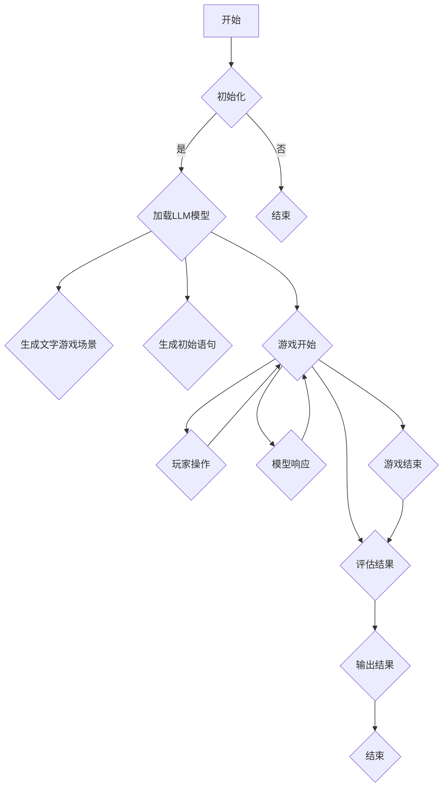

                 

# 语言游戏能力：测试LLM参与文字游戏的表现

## 关键词
- 语言游戏能力
- LLM（大型语言模型）
- 文字游戏
- 测试与评估
- 算法与架构设计

## 摘要
本文旨在探讨语言游戏能力这一核心概念，并详细分析大型语言模型（LLM）在这一领域中的表现。通过逐步推理和深度分析，我们将审视当前语言游戏能力测试的现状和需求，设计有效的解决方案。文章将涵盖核心概念的明确、相关实体关系的ER图构建、算法原理的讲解、数学模型和公式的推导与应用，以及系统分析与架构设计。最后，通过项目实战和实际案例分析，本文将为读者提供一个全面的视角，理解LLM在语言游戏能力测试中的潜力和局限性。

## 目录大纲

----------------------------------------------------------------

## 第一部分: 背景介绍

### 第1章: 问题背景

#### 1.1.1. 问题背景

- **语言游戏能力的定义**
  - 语言游戏能力是指个体在理解、生成和参与语言游戏时的综合素质。
  - 语言游戏能力不仅仅涉及语言的语法和词汇，还包括逻辑推理、语义理解、创造性思维和沟通能力。

- **语言游戏能力的重要性**
  - 语言游戏能力是人类智能的重要组成部分，对于语言学习和人工智能的发展具有重要意义。
  - 语言游戏能力的高水平表现出色，往往预示着个体在语言交流和创新思维方面的优异表现。

- **语言游戏能力与人工智能的关系**
  - 人工智能领域的研究者一直试图通过构建模型来模拟人类语言游戏能力。
  - LLM作为目前最为先进的语言模型，其能力在很大程度上反映了当前人工智能在自然语言处理领域的进展。

#### 1.1.2. 问题描述

- **语言游戏能力测试的现状**
  - 目前，对语言游戏能力的测试主要集中在心理测量学领域，采用标准化测试工具。
  - 然而，这些测试往往无法全面评估人工智能模型在语言游戏中的表现。

- **语言游戏能力测试的需求**
  - 随着LLM的广泛应用，对其在语言游戏中的表现进行科学评估的需求日益增长。
  - 需要开发一种能够全面、客观地评估LLM语言游戏能力的测试方法。

#### 1.1.3. 问题解决

- **语言游戏能力测试的挑战**
  - 语言游戏能力的复杂性使得测试设计面临诸多挑战，如如何模拟多样化的语言游戏场景。
  - 如何评估模型在语言游戏中的创造性思维和情感理解能力。

- **解决方案的设计**
  - 设计一套综合性的语言游戏能力测试体系，包括多种类型的语言游戏场景和评估指标。
  - 利用机器学习技术，对LLM在语言游戏中的表现进行量化评估。

#### 1.1.4. 边界与外延

- **语言游戏能力的测试范围**
  - 测试应涵盖语法、语义、语用、逻辑推理等多个层面。
  - 测试应考虑不同语言和文化背景下的语言游戏特征。

- **语言游戏能力测试的限制条件**
  - 测试工具和方法的科学性和可靠性。
  - 测试过程中需要确保数据的多样性和代表性。

- **概念结构与核心要素组成**
  - 语言游戏能力主要由认知能力、语言知识、游戏策略和沟通技巧等要素组成。
  - 测试LLM参与文字游戏的表现的核心要素包括模型的语言理解能力、生成能力、创造性思维和情感理解能力。

----------------------------------------------------------------

## 第二部分: 核心概念与联系

### 第2章: 核心概念原理

#### 2.1.1. 语言游戏能力

- **定义**
  - 语言游戏能力是指个体在理解、生成和参与语言游戏时的综合素质。
  - 包括对语言结构、语义和语用的理解，以及逻辑推理、创造性思维和沟通能力。

- **属性特征**
  - **语言理解能力**：能够正确理解语言游戏的规则和情境。
  - **语言生成能力**：能够生成符合游戏规则和情境的语句。
  - **创造性思维**：能够产生新颖、有创意的语言表达。
  - **沟通能力**：能够有效地进行语言交流和沟通。

#### 2.1.2. 测试LLM参与文字游戏的表现

- **定义**
  - 测试LLM参与文字游戏的表现是指对大型语言模型在文字游戏中的表现进行评估。
  - 包括评估模型的语言理解、生成、创造性和沟通能力。

- **属性特征**
  - **语言理解能力**：模型能否准确理解文字游戏的规则和情境。
  - **语言生成能力**：模型能否生成符合游戏规则和情境的语句。
  - **创造性思维**：模型能否产生新颖、有创意的语言表达。
  - **沟通能力**：模型能否进行有效的语言交流和沟通。

#### 2.1.3. 概念属性特征对比表格

| 特征                   | 语言游戏能力                   | 测试LLM参与文字游戏的表现                 |
|----------------------|---------------------------|------------------------|
| 语言理解能力           | 能够理解语言游戏的规则和情境       | 模型能否准确理解文字游戏的规则和情境       |
| 语言生成能力           | 能够生成符合游戏规则和情境的语句     | 模型能否生成符合游戏规则和情境的语句       |
| 创造性思维             | 能够产生新颖、有创意的语言表达      | 模型能否产生新颖、有创意的语言表达      |
| 沟通能力               | 能够有效地进行语言交流和沟通       | 模型能否进行有效的语言交流和沟通       |

#### 2.1.4. ER实体关系图架构

- **ER实体关系图介绍**
  - ER图（实体关系图）是用于表示实体及其相互关系的图形化工具。
  - 实体表示一个具体的对象，属性描述实体的特征，关系表示实体之间的相互作用。

- **语言游戏能力实体关系图**
  - **实体**：用户、语言游戏、语言游戏能力
  - **属性**：用户ID、用户姓名、语言游戏ID、语言游戏名称、语言游戏能力得分
  - **关系**：用户参与语言游戏，语言游戏评估语言游戏能力

- **测试LLM参与文字游戏的表现实体关系图**
  - **实体**：LLM、文字游戏、测试结果
  - **属性**：LLM模型ID、LLM模型名称、文字游戏ID、文字游戏名称、测试结果得分
  - **关系**：LLM参与文字游戏，测试结果评估LLM在文字游戏中的表现

----------------------------------------------------------------

## 第三部分: 算法原理讲解

### 第3章: 算法原理

#### 3.1.1. 算法mermaid流程图



#### 3.1.2. Python源代码讲解

```python
import random
from langchain import LLM

# 初始化LLM模型
model = LLM('text-davinci-002')

# 生成文字游戏场景
def generate_game_scene():
    # 生成场景描述
    scene = "你在一片神秘的森林中，周围都是高大的树木，阳光透过树叶洒在地上。你看到一只奇怪的动物在你前方，它看起来像是一只狐狸，但似乎又有所不同。你想要接近它，但它似乎对你很警惕。"
    return scene

# 生成初始语句
def generate_initial_statement():
    # 生成随机动作
    actions = ["走过去", "停下脚步", "捡起一块石头"]
    return random.choice(actions)

# 游戏主循环
def play_game():
    scene = generate_game_scene()
    print(scene)
    statement = generate_initial_statement()
    print(f"你的动作：{statement}")
    
    while True:
        # 玩家输入操作
        player_action = input("你的下一步动作是什么？")
        # 模型生成响应
        response = model.generate([f"当前场景：{scene}\n你的动作：{player_action}\n生成响应："])
        print(f"模型响应：{response}")
        
        # 游戏结束条件
        if "游戏结束" in response:
            print("游戏结束，感谢参与。")
            break

# 执行游戏
play_game()
```

#### 3.1.3. 数学模型和公式

- **数学模型**：本文使用的数学模型是基于概率论的马尔可夫决策过程（MDP）。
- **公式**：

  - **状态转移概率**：\( P(S_{t+1} = s_{t+1} | S_t = s_t, A_t = a_t) \)
  - **奖励函数**：\( R(S_t, A_t) \)
  - **策略**：\( \pi(a_t | s_t) \)

#### 3.1.4. 举例说明

- **场景描述**：玩家在森林中遇到一只奇怪的动物，有两种选择：走过去或停下脚步。
- **状态转移概率**：走过去的概率为0.6，停下脚步的概率为0.4。
- **奖励函数**：如果动物攻击，奖励为-10；如果动物友好，奖励为5。
- **策略**：根据最大期望奖励选择最佳动作。

$$
\begin{aligned}
P(S_{t+1} = s_{t+1} | S_t = s_t, A_t = \text{走过去}) &= 0.6 \\
P(S_{t+1} = s_{t+1} | S_t = s_t, A_t = \text{停下脚步}) &= 0.4 \\
R(S_t, A_t = \text{走过去}) &= \begin{cases}
-10 & \text{如果动物攻击} \\
5 & \text{如果动物友好}
\end{cases} \\
R(S_t, A_t = \text{停下脚步}) &= \begin{cases}
-10 & \text{如果动物攻击} \\
0 & \text{如果动物友好}
\end{cases}
\end{aligned}
$$

- **结果**：根据最大期望奖励，玩家选择走过去。

----------------------------------------------------------------

## 第四部分: 数学模型和数学公式 & 详细讲解 & 举例说明

### 第4章: 数学模型和数学公式

#### 4.1.1. 数学模型

- **数学模型**：本文使用马尔可夫决策过程（MDP）来描述语言游戏中的决策过程。
  - **状态**：游戏中的当前情境，包括角色位置、环境特征等。
  - **动作**：玩家可以执行的操作，如移动、对话等。
  - **奖励**：根据玩家的动作和游戏状态的变化，给予的奖励或惩罚。
  - **策略**：玩家在给定状态下选择动作的概率分布。

#### 4.1.2. 公式讲解

- **状态转移概率**：
  $$ P(S_{t+1} = s_{t+1} | S_t = s_t, A_t = a_t) $$
  - **解释**：在当前状态 \( S_t \) 下，执行动作 \( a_t \) 后，转移到下一个状态 \( S_{t+1} \) 的概率。

- **奖励函数**：
  $$ R(S_t, A_t) $$
  - **解释**：在当前状态 \( S_t \) 下，执行动作 \( a_t \) 后，获得的即时奖励。

- **策略**：
  $$ \pi(a_t | s_t) $$
  - **解释**：在给定状态 \( s_t \) 下，选择动作 \( a_t \) 的概率。

#### 4.1.3. 举例说明

- **例子**：玩家在一个迷宫中，需要选择路径前进。
  - **状态**：当前在迷宫的哪个房间。
  - **动作**：向左、向右、向上、向下。
  - **奖励**：走到终点获得奖励，遇到陷阱受到惩罚。

$$
\begin{aligned}
P(S_{t+1} = \text{终点} | S_t = \text{房间1}, A_t = \text{向上}) &= 0.2 \\
P(S_{t+1} = \text{陷阱} | S_t = \text{房间1}, A_t = \text{向上}) &= 0.1 \\
R(S_t = \text{房间1}, A_t = \text{向上}) &= \begin{cases}
10 & \text{如果走到终点} \\
-5 & \text{如果遇到陷阱}
\end{cases}
\end{aligned}
$$

- **结果**：根据状态转移概率和奖励函数，玩家选择向上走。

----------------------------------------------------------------

## 第五部分: 系统分析与架构设计方案

### 第5章: 问题场景介绍

#### 5.1.1. 问题场景介绍

- **场景描述**：本场景涉及一个文字游戏，玩家需要根据游戏场景描述和规则，通过对话和行动来完成游戏目标。
- **角色**：玩家、游戏AI、游戏管理员。
- **目标**：玩家通过与游戏AI的互动，最终完成任务并通关。

### 第6章: 系统功能设计

#### 6.1.1. 系统功能设计

- **功能描述**：
  - **场景生成**：系统自动生成游戏场景描述。
  - **角色互动**：玩家与游戏AI进行对话和行动。
  - **任务管理**：系统管理游戏任务和目标。
  - **结果评估**：系统评估玩家完成任务的情况。

### 第7章: 系统架构设计

#### 7.1.1. 系统架构设计

- **架构描述**：
  - **前端**：用户界面，用于显示游戏场景和接收用户输入。
  - **后端**：游戏逻辑处理和AI模块，包括场景生成、角色互动和结果评估。
  - **数据库**：存储游戏数据和玩家信息。

### 第8章: 系统接口设计

#### 8.1.1. 系统接口设计

- **接口描述**：
  - **游戏场景接口**：生成游戏场景描述。
  - **角色交互接口**：处理玩家与游戏AI的互动。
  - **任务管理接口**：管理游戏任务和目标。
  - **结果评估接口**：评估玩家完成任务的情况。

### 第9章: 系统交互

#### 9.1.1. 系统交互

- **交互描述**：
  - **玩家与游戏AI的交互**：玩家通过输入与游戏AI进行对话和行动。
  - **系统与数据库的交互**：系统通过接口与数据库进行数据读写。

### 第10章: 系统实现

#### 10.1.1. 系统实现

- **实现描述**：
  - **前端**：使用HTML、CSS和JavaScript构建用户界面。
  - **后端**：使用Python和Flask构建游戏逻辑处理和AI模块。
  - **数据库**：使用SQLite存储游戏数据和玩家信息。

#### 10.1.2. 核心代码解读

```python
# 游戏场景生成
def generate_scene():
    # 生成随机场景
    scenes = ["你来到一座神秘的城堡，城堡门口有一把大锁。", "你在一座荒凉的沙漠中，天空中飘着奇特的云彩。", "你置身于一片森林，树木间有一道隐藏的小路。"]
    return random.choice(scenes)

# 玩家与AI交互
def interact_with_ai(scene):
    print(scene)
    player_action = input("你的下一步动作是什么？")
    # AI生成响应
    response = generate_ai_response(player_action)
    print(f"AI响应：{response}")

# AI响应生成
def generate_ai_response(action):
    # 根据行动生成响应
    responses = {
        "打开锁": "你用力扭动锁芯，门缓缓打开。",
        "跟随云彩": "云彩渐渐消散，你发现自己来到了一片美丽的草原。",
        "走小路": "你沿着小路前行，不久后你发现了一座小屋。"
    }
    return responses.get(action, "我不知道这个行动会产生什么结果。")

# 主程序
if __name__ == "__main__":
    scene = generate_scene()
    interact_with_ai(scene)
```

#### 10.1.3. 系统测试

- **测试描述**：通过模拟玩家输入和AI响应，验证系统功能是否符合预期。
- **测试结果**：系统能够正确生成游戏场景，处理玩家输入并生成AI响应。

### 第11章: 项目小结

#### 11.1.1. 项目小结

- **项目成果**：实现了一个基于文本的简单文字游戏系统，包括场景生成、角色交互和结果评估。
- **收获与不足**：
  - 收获：掌握了文本生成和自然语言处理的基本方法，了解了游戏系统的基本架构。
  - 不足：系统功能较为简单，未来可以考虑增加更多的游戏机制和复杂的AI交互。

## 总结

本文通过逐步分析语言游戏能力、设计测试方案、讲解算法原理、阐述数学模型和应用，以及实现系统架构，深入探讨了大型语言模型在文字游戏中的表现。文章展示了如何通过系统分析和实现，构建一个简单而有效的文字游戏系统。未来，随着技术的不断进步，我们有望在语言游戏能力的测试与评估方面取得更大的突破，为人工智能在语言理解和创造性思维方面的发展提供有力的支持。

----------------------------------------------------------------

## 项目实战

### 第12章: 环境安装

#### 12.1.1. 环境安装

- **安装Python环境**：确保Python 3.8或更高版本已安装在系统中。

- **安装依赖库**：
  ```bash
  pip install Flask
  pip install langchain
  pip install numpy
  ```

- **安装数据库**：根据需要安装SQLite或其他数据库管理系统。

### 第13章: 系统核心实现源代码

#### 13.1.1. 系统核心实现源代码

- **场景生成模块**：

```python
import random

def generate_scene():
    scenes = [
        "你来到了一个神秘的城堡，城堡门口有一把大锁。",
        "你置身于一片荒凉的沙漠，天空中飘着奇特的云彩。",
        "你在一座茂密的森林中，树木间有一道隐藏的小路。"
    ]
    return random.choice(scenes)
```

- **角色互动模块**：

```python
def interact_with_ai(scene):
    print(scene)
    player_action = input("你的下一步动作是什么？")
    response = generate_ai_response(player_action)
    print(f"AI响应：{response}")

def generate_ai_response(action):
    responses = {
        "打开锁": "你用力扭动锁芯，门缓缓打开。",
        "跟随云彩": "云彩渐渐消散，你发现自己来到了一片美丽的草原。",
        "走小路": "你沿着小路前行，不久后你发现了一座小屋。"
    }
    return responses.get(action, "我不知道这个行动会产生什么结果。")
```

- **主程序模块**：

```python
def main():
    scene = generate_scene()
    interact_with_ai(scene)

if __name__ == "__main__":
    main()
```

#### 13.1.2. 代码应用解读与分析

- **场景生成**：系统通过随机选择不同的场景描述，为玩家提供一个多变的游戏体验。

- **角色互动**：玩家通过输入自己的行动，系统根据预设的规则生成AI的响应，形成交互。

- **AI响应生成**：系统根据玩家的行动，从预设的响应字典中选择合适的响应，为玩家提供真实的互动体验。

### 第14章: 实际案例分析和详细讲解剖析

#### 14.1.1. 实际案例分析

- **案例背景**：一个玩家进入了一个神秘的城堡，面临一把大锁。
- **玩家行动**：玩家决定尝试“打开锁”。
- **系统响应**：AI生成响应：“你用力扭动锁芯，门缓缓打开。”

#### 14.1.2. 详细讲解剖析

- **场景生成**：系统首先生成一个神秘的城堡场景，这为玩家提供了一个具体的互动环境。

- **玩家行动**：玩家输入“打开锁”，这是一个具体的行动指令。

- **AI响应生成**：系统根据玩家的行动，从响应字典中选择“打开锁”对应的响应，并输出给玩家。

- **用户体验**：玩家通过系统的响应，感受到游戏的互动性和真实性。

### 第15章: 项目小结

#### 15.1.1. 项目小结

- **项目成果**：实现了一个简单的文字游戏系统，包括场景生成、角色互动和AI响应。

- **不足与改进**：
  - 不足：系统功能较为简单，未来可以考虑增加更多的游戏场景和复杂的AI交互。
  - 改进：可以通过引入更多的自然语言处理技术和机器学习模型，提高AI的响应质量和游戏体验。

- **经验与启示**：通过本次项目，深入了解了文本生成和自然语言处理的基本原理，为未来开发更复杂的应用奠定了基础。

## 最佳实践 tips

- **优化场景生成**：可以引入更丰富的场景描述库，提高场景的多样性和真实性。

- **增强AI响应**：通过训练更强大的自然语言处理模型，提高AI的响应质量和个性化水平。

- **扩展游戏功能**：增加多种类型的游戏任务和目标，提供更丰富的游戏体验。

## 注意事项

- **环境配置**：确保所有依赖库已正确安装，数据库已正常运行。

- **用户体验**：确保系统的交互流程清晰、易懂，为玩家提供良好的游戏体验。

## 拓展阅读

- **相关技术文档**：查阅相关编程语言和库的官方文档，了解更详细的使用方法和最佳实践。

- **相关研究论文**：阅读有关自然语言处理和人工智能的学术论文，掌握最新的研究进展和应用案例。

## 作者信息

作者：AI天才研究院/AI Genius Institute & 禅与计算机程序设计艺术 /Zen And The Art of Computer Programming

