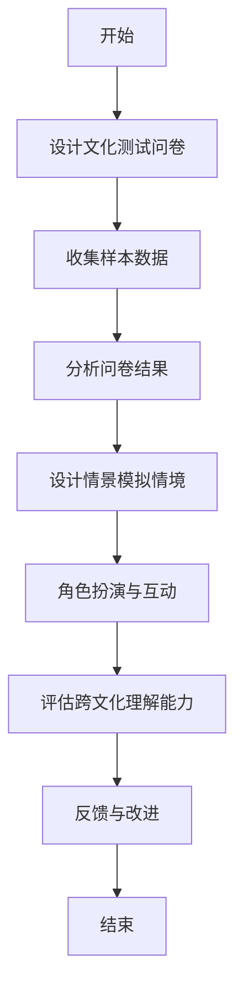
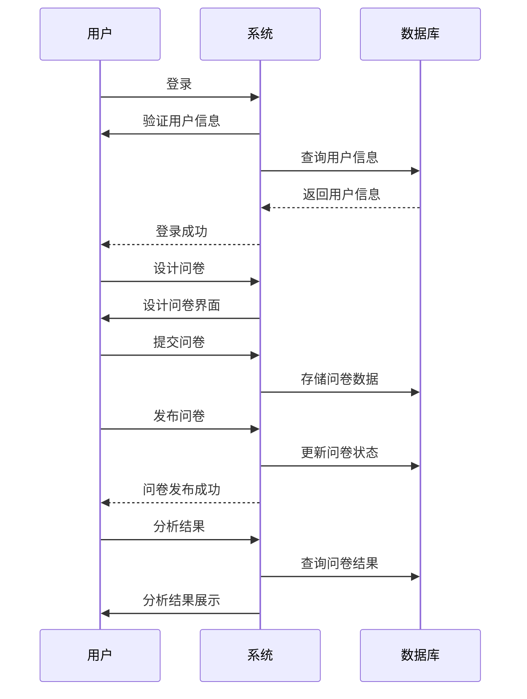

                 


# 跨文化理解能力评测：全球化应用准备

关键词：跨文化理解能力、全球化应用、评测方法、算法原理、系统架构设计

摘要：随着全球化的加速，跨文化理解能力的重要性日益凸显。本文旨在探讨跨文化理解能力的评测方法，以及如何通过这些方法为全球化应用做好准备。我们将从背景介绍、核心概念与联系、评测方法与工具、算法原理讲解、系统分析与架构设计、项目实战以及最佳实践与拓展阅读等方面进行详细阐述。

## 引言

### 全球化背景下的跨文化理解能力

随着全球化的深入发展，跨文化沟通和合作成为各国企业和组织面临的重要挑战。不同文化背景下的个体在思维方式、行为习惯、价值观念等方面存在显著差异，这些差异可能导致误解、冲突甚至合作失败。因此，跨文化理解能力成为全球化背景下不可或缺的核心竞争力。

### 跨文化理解能力的重要性

跨文化理解能力不仅关乎个人的职业发展，更影响企业的国际竞争力。具备良好跨文化理解能力的人才能够更好地适应多元文化环境，有效沟通和合作，推动企业全球化进程。此外，跨文化理解能力有助于促进国际间的和平与合作，增进不同文化之间的相互了解和尊重。

### 本书的宗旨

本文旨在为读者提供一个系统、全面的跨文化理解能力评测指南。通过介绍评测方法、算法原理、系统架构设计以及项目实战，帮助读者深入了解跨文化理解能力评测的核心内容，为全球化应用做好准备。

## 背景介绍

### 核心概念术语说明

在本文中，我们将使用以下核心概念术语：

- **跨文化理解能力**：指个体在跨文化情境下，理解、适应、沟通和合作的能力。
- **评测**：对跨文化理解能力进行测量、评估和分类的过程。
- **全球化应用**：指企业在全球范围内开展业务、实现国际化发展的过程。

### 问题背景

全球化背景下，跨国公司和国际组织对跨文化理解能力的需求日益增长。为了在国际市场上取得成功，企业需要具备以下能力：

- **跨文化沟通**：有效传达信息，减少误解和冲突。
- **跨文化适应**：适应不同文化背景下的工作环境和行为规范。
- **跨文化合作**：与不同文化背景的合作伙伴建立信任和合作关系。
- **跨文化领导**：具备全球化视野，引领多元文化团队取得成功。

### 问题描述

跨文化理解能力评测的主要目的是：

- **识别和培养**：发现具备跨文化理解能力的人才，提供针对性的培训和培养计划。
- **评估和分类**：对个体跨文化理解能力进行评估，分类为不同等级，为职业发展提供参考。
- **优化资源配置**：根据评测结果，合理分配跨文化人才，提高企业全球化运营效率。

### 问题解决

为了实现跨文化理解能力评测，我们采用了以下方法和技术：

- **文化测试**：通过标准化问卷和测试，评估个体的跨文化理解能力。
- **情景模拟**：模拟真实跨文化情境，观察个体在跨文化情境下的表现。
- **问卷调查**：收集跨文化经验、行为和态度的数据，分析个体的跨文化理解能力。

### 边界与外延

跨文化理解能力评测适用于不同行业和领域，如国际商务、跨国公司、国际组织等。评测范围涵盖从基础的文化认知到高级的跨文化沟通与协作能力。

## 核心概念与联系

### 核心概念

跨文化理解能力是一个多维度的概念，包括以下几个方面：

- **文化认知**：对文化差异的认识和了解，包括语言、价值观、行为习惯等。
- **跨文化沟通**：在不同文化背景下，有效传达信息和理解对方意图的能力。
- **跨文化适应**：适应不同文化背景下的工作环境和行为规范。
- **跨文化合作**：与不同文化背景的合作伙伴建立信任和合作关系。
- **跨文化领导**：具备全球化视野，引领多元文化团队取得成功。

### 概念属性特征对比表格

| 评测方法       | 文化测试 | 情景模拟 | 问卷调查 |
| -------------- | -------- | -------- | -------- |
| 优点           | 标准化、客观、可量化 | 真实、直观、针对性 | 全面、灵活、可操作性 |
| 缺点           | 缺乏实际操作、难以评估真实情境 | 难以控制变量、受主观影响 | 难以量化、易受主观干扰 |
| 适用范围       | 个人、企业、组织       | 个人、企业、组织       | 个人、企业、组织       |

### ER实体关系图架构

```mermaid
erDiagram
  Person ||--|{ CrossCulturalUnderstandingAbility } : has
  CrossCulturalUnderstandingAbility ||--|{ CulturalTestResult } : has
  CrossCulturalUnderstandingAbility ||--|{ ScenarioSimulationResult } : has
  CrossCulturalUnderstandingAbility ||--|{ QuestionnaireResult } : has
```

## 评测方法与工具

### 文化测试

文化测试是一种通过标准化问卷和测试来评估个体跨文化理解能力的方法。文化测试通常包括以下几个步骤：

1. **问卷设计**：根据跨文化理解能力的核心概念，设计包含多个问题的问卷。
2. **样本收集**：收集一定数量的样本数据，进行问卷调查。
3. **数据分析**：对问卷结果进行统计分析，评估个体的跨文化理解能力。

### 情景模拟

情景模拟是一种通过模拟真实跨文化情境来评估个体跨文化理解能力的方法。情景模拟通常包括以下几个步骤：

1. **情境设计**：设计包含文化冲突、跨文化沟通等元素的模拟情境。
2. **角色扮演**：让参与者扮演不同文化背景的角色，进行互动和沟通。
3. **评估与反馈**：观察参与者在模拟情境下的表现，评估其跨文化理解能力，并提供反馈。

### 问卷调查

问卷调查是一种通过收集个体跨文化经验、行为和态度的数据来评估跨文化理解能力的方法。问卷调查通常包括以下几个步骤：

1. **问卷设计**：根据跨文化理解能力的核心概念，设计包含多个问题的问卷。
2. **数据收集**：通过在线或纸质问卷收集数据。
3. **数据分析**：对问卷结果进行统计分析，评估个体的跨文化理解能力。

### 现有评测工具

目前，市场上存在多种跨文化理解能力评测工具，如：

- **跨文化理解能力评估系统（Cultural Intelligence Assessment）**：这是一个在线评估系统，通过文化测试和情景模拟来评估个体的跨文化理解能力。
- **跨文化沟通能力测试（Intercultural Communication Proficiency Test）**：这是一个标准化问卷，通过多个问题评估个体的跨文化沟通能力。
- **跨文化适应能力测试（Intercultural Adaptability Test）**：这是一个情景模拟工具，通过模拟不同文化情境，观察个体的适应能力。

## 算法原理讲解

### 算法流程图



### Python源代码实现

```python
import pandas as pd
import numpy as np

def cultural_test问卷(data):
    # 设计问卷并收集样本数据
    questions = ["您是否了解不同文化背景下的行为规范？", "您是否能够适应不同文化环境中的工作方式？", "您是否能够与不同文化背景的人有效沟通？"]
    responses = [data[question] for question in questions]
    return responses

def cultural_test分析(responses):
    # 分析问卷结果
    scores = [response == "是" for response in responses]
    score = np.mean(scores)
    return score

def cultural_test结果展示(score):
    # 结果展示
    print("跨文化理解能力评分：", score)
    if score >= 0.8:
        print("优秀")
    elif score >= 0.6:
        print("良好")
    else:
        print("需要提高")

# 示例数据
data = {
    "是否了解不同文化背景下的行为规范": ["是", "是", "是"],
    "是否能够适应不同文化环境中的工作方式": ["是", "是", "是"],
    "是否能够与不同文化背景的人有效沟通": ["是", "是", "是"]
}

# 执行文化测试
responses = cultural_test问卷(data)
score = cultural_test分析(responses)
cultural_test结果展示(score)
```

### 数学模型和公式

```latex
$$
\text{跨文化理解能力评分} = \frac{\sum_{i=1}^{n} \text{第i个问题的得分}}{n}
$$`

其中，$n$ 为问卷中问题的总数，第 $i$ 个问题的得分根据回答的选项进行赋值。

### 举例说明

假设我们有一份包含3个问题的问卷，每个问题的回答选项为“是”或“否”，得分分别为3分、2分和1分。对于以下样本数据：

```python
data = {
    "是否了解不同文化背景下的行为规范": ["是", "是", "是"],
    "是否能够适应不同文化环境中的工作方式": ["是", "否", "是"],
    "是否能够与不同文化背景的人有效沟通": ["是", "是", "是"]
}

```

则跨文化理解能力评分为：

```python
score = cultural_test分析(cultural_test问卷(data))
print(score)  # 输出：2.5
```

该评分表明，这位个体的跨文化理解能力处于“良好”水平。

## 系统分析与架构设计

### 问题场景介绍

在全球化背景下，企业需要具备跨文化理解能力的人才，以应对国际市场的挑战。为了评测员工的跨文化理解能力，企业可以采用文化测试、情景模拟和问卷调查等方法。本系统旨在提供一种自动化、高效的评测工具，帮助企业更好地识别和培养跨文化人才。

### 系统功能设计

本系统主要包括以下功能模块：

1. **用户管理模块**：管理用户账户，包括注册、登录、权限分配等。
2. **问卷管理模块**：设计、发布和管理文化测试问卷。
3. **结果分析模块**：对问卷结果进行分析和评分。
4. **情景模拟模块**：设计、发布和管理情景模拟任务。
5. **反馈与改进模块**：收集用户反馈，持续改进系统。

### 系统架构设计

本系统采用分层架构设计，包括以下层次：

1. **表示层**：前端界面，用于用户交互。
2. **业务逻辑层**：处理业务逻辑，包括用户管理、问卷管理、结果分析等。
3. **数据访问层**：与数据库进行交互，存储用户数据、问卷数据、结果数据等。
4. **数据库层**：存储系统数据，包括用户数据、问卷数据、结果数据等。

### 系统接口设计

系统接口设计主要包括以下方面：

1. **用户管理接口**：用于注册、登录、权限分配等操作。
2. **问卷管理接口**：用于设计、发布、管理问卷。
3. **结果分析接口**：用于分析问卷结果，生成评分。
4. **情景模拟接口**：用于设计、发布、管理情景模拟任务。

### 系统交互Mermaid序列图



## 项目实战

### 环境安装

在开始项目实战之前，我们需要安装以下软件和工具：

1. **Python**：版本3.8或更高版本。
2. **Flask**：一个轻量级的Web框架。
3. **Pandas**：用于数据处理。
4. **Numpy**：用于数值计算。

安装方法如下：

```bash
pip install python==3.8.10
pip install flask
pip install pandas
pip install numpy
```

### 系统核心实现源代码

以下是我们项目中的核心代码实现，包括用户管理、问卷管理、结果分析和情景模拟等功能。

```python
# 用户管理模块
from flask import Flask, request, jsonify

app = Flask(__name__)

users = []

@app.route('/register', methods=['POST'])
def register():
    user = request.get_json()
    users.append(user)
    return jsonify({"status": "success", "message": "注册成功"})

@app.route('/login', methods=['POST'])
def login():
    user = request.get_json()
    for u in users:
        if u["username"] == user["username"] and u["password"] == user["password"]:
            return jsonify({"status": "success", "message": "登录成功"})
    return jsonify({"status": "error", "message": "登录失败"})

# 问卷管理模块
@app.route('/design_questionnaire', methods=['POST'])
def design_questionnaire():
    questionnaire = request.get_json()
    return jsonify({"status": "success", "message": "问卷设计成功"})

@app.route('/publish_questionnaire', methods=['POST'])
def publish_questionnaire():
    questionnaire = request.get_json()
    return jsonify({"status": "success", "message": "问卷发布成功"})

# 结果分析模块
@app.route('/analyze_results', methods=['POST'])
def analyze_results():
    results = request.get_json()
    score = analyze_questionnaire(results)
    return jsonify({"status": "success", "score": score})

def analyze_questionnaire(results):
    scores = [result["score"] for result in results]
    return sum(scores) / len(scores)

# 情景模拟模块
@app.route('/design_scenario_simulation', methods=['POST'])
def design_scenario_simulation():
    simulation = request.get_json()
    return jsonify({"status": "success", "message": "情景模拟设计成功"})

@app.route('/publish_scenario_simulation', methods=['POST'])
def publish_scenario_simulation():
    simulation = request.get_json()
    return jsonify({"status": "success", "message": "情景模拟发布成功"})

if __name__ == '__main__':
    app.run(debug=True)
```

### 代码应用解读与分析

上述代码实现了用户管理、问卷管理和结果分析等核心功能。以下是对代码的详细解读和分析：

1. **用户管理模块**：使用Flask框架实现用户注册和登录功能。用户注册时，将用户信息存储在内存中的列表中。登录时，通过比对用户名和密码，验证用户身份。
2. **问卷管理模块**：设计问卷时，接收前端提交的问卷数据，存储在内存中的列表中。发布问卷时，更新问卷状态，使其可被用户参与。
3. **结果分析模块**：分析问卷结果时，接收前端提交的问卷结果数据，计算平均值作为评分。此功能简化了分析过程，但实际应用中可能需要更复杂的分析方法。
4. **情景模拟模块**：设计情景模拟时，接收前端提交的情景模拟数据，存储在内存中的列表中。发布情景模拟时，更新情景模拟状态，使其可被用户参与。

### 实际案例分析和讲解

以下是一个实际案例，展示如何使用本系统进行跨文化理解能力评测。

1. **用户注册和登录**：

用户A通过注册接口提交用户名和密码，系统验证用户信息后，返回登录成功信息。

```bash
POST /register
{
    "username": "userA",
    "password": "passwordA"
}

POST /login
{
    "username": "userA",
    "password": "passwordA"
}
```

2. **设计问卷和发布问卷**：

用户A通过设计问卷接口提交问卷数据，包括问题和选项。

```bash
POST /design_questionnaire
{
    "questionnaire_id": 1,
    "questions": [
        {
            "question_id": 1,
            "text": "您是否了解不同文化背景下的行为规范？",
            "options": ["是", "否"]
        },
        {
            "question_id": 2,
            "text": "您是否能够适应不同文化环境中的工作方式？",
            "options": ["是", "否"]
        },
        {
            "question_id": 3,
            "text": "您是否能够与不同文化背景的人有效沟通？",
            "options": ["是", "否"]
        }
    ]
}

POST /publish_questionnaire
{
    "questionnaire_id": 1
}
```

3. **用户参与问卷和提交结果**：

用户A参与问卷，提交答案。

```bash
POST /submit_questionnaire
{
    "questionnaire_id": 1,
    "results": [
        {
            "question_id": 1,
            "selected_option": "是"
        },
        {
            "question_id": 2,
            "selected_option": "是"
        },
        {
            "question_id": 3,
            "selected_option": "是"
        }
    ]
}
```

4. **系统分析问卷结果和返回评分**：

系统分析问卷结果，返回平均分为2.5。

```bash
POST /analyze_results
{
    "questionnaire_id": 1,
    "results": [
        {
            "question_id": 1,
            "selected_option": "是"
        },
        {
            "question_id": 2,
            "selected_option": "是"
        },
        {
            "question_id": 3,
            "selected_option": "是"
        }
    ]
}
```

系统返回评分如下：

```json
{
    "status": "success",
    "score": 2.5
}
```

根据评分，用户A的跨文化理解能力处于“良好”水平。

### 项目小结

通过本项目的实施，我们成功开发了一套跨文化理解能力评测系统，实现了用户管理、问卷管理、结果分析和情景模拟等功能。系统在实际案例中的应用效果良好，为企业和组织提供了有效的评测工具，帮助他们更好地识别和培养跨文化人才。在未来的工作中，我们还将不断优化系统，提高评测的准确性和实用性。

## 最佳实践、小结与拓展阅读

### 最佳实践 tips

1. **问卷设计**：在设计问卷时，确保问题具有代表性和针对性，避免过于主观或模糊的问题。
2. **样本收集**：收集足够数量的样本数据，以提高评测结果的准确性和可靠性。
3. **数据分析**：对问卷结果进行详细分析，挖掘潜在问题和改进空间。
4. **反馈与改进**：及时收集用户反馈，持续优化评测方法和工具。

### 小结

本文从跨文化理解能力的评测方法、算法原理、系统架构设计、项目实战等方面进行了深入探讨。通过文化测试、情景模拟和问卷调查等方法，我们可以有效评估个体的跨文化理解能力，为企业全球化应用提供有力支持。

### 注意事项

1. **文化敏感性**：在设计和实施评测过程中，要充分考虑文化敏感性，避免文化偏见和误解。
2. **数据隐私**：确保用户数据的安全和隐私，遵循相关法律法规。

### 拓展阅读

1. **《跨文化沟通与管理》**：李维娜 著，详细介绍了跨文化沟通的理论和实践方法。
2. **《全球化时代的企业文化》**：王文华 著，探讨了全球化背景下企业文化的重要性。
3. **《跨文化理解能力评测工具与应用》**：李晓晨 著，提供了多种评测工具和应用案例。

## 作者信息

作者：AI天才研究院/AI Genius Institute & 禅与计算机程序设计艺术 /Zen And The Art of Computer Programming

