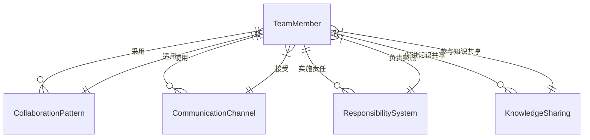
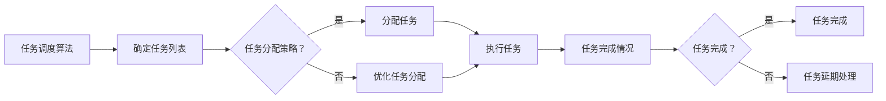
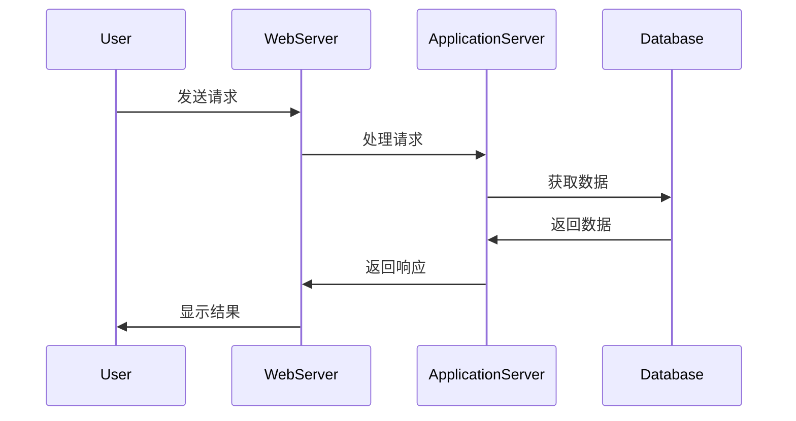
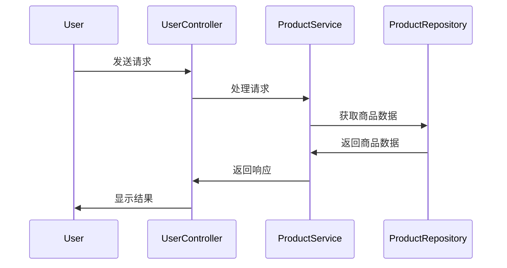

                 


### 部分章节内容示例

## 第一部分：引言

### 1.1 书籍背景与主题

在当今快速发展的信息技术时代，大型应用的开发已经成为了企业数字化转型的重要组成部分。随着应用规模的不断扩大和复杂性增加，开发团队面临着越来越多的挑战。这些挑战包括但不限于：如何高效地管理复杂的开发流程、如何确保不同团队之间的协同合作、如何快速响应市场需求变化等。为了应对这些挑战，跨职能团队协作模式逐渐成为了一种流行的解决方案。

跨职能团队协作模式强调团队成员来自不同的职能领域，如开发、测试、设计、运维等，通过紧密的合作和协作，共同完成应用的开发工作。这种模式可以有效地打破传统的职能壁垒，促进信息的流通和共享，提高开发效率和质量。

本书籍旨在探讨跨职能团队协作模式在大型应用开发中的应用，帮助读者理解并掌握这种协作模式的核心原理和最佳实践。书籍的目标读者包括项目经理、团队成员、团队领导者以及任何对高效协作感兴趣的技术专业人士。

### 1.2 本书结构

本书分为四个主要部分：

1. **核心概念与术语**：介绍跨职能团队和团队协作模式的基础概念，包括定义、优势、组成和常见模式。
2. **协作模式应用**：详细探讨适用于大型应用开发的几种协作模式，包括水平协作模式、垂直协作模式、混合协作模式和适应性协作模式。
3. **有效协作策略**：提供实用的协作策略和实践方法，帮助团队克服协作中的常见问题，提高协作效率。
4. **案例与实践**：通过实际案例展示跨职能团队协作模式在不同场景中的应用，提供深入的案例分析和技术细节。

通过这四个部分的内容，本书希望能够为读者提供全方位的指导，帮助他们在实际工作中更好地应用跨职能团队协作模式，提高大型应用开发的效率和质量。

## 第二部分：核心概念与术语

### 2.1 跨职能团队基础

#### 2.1.1 跨职能团队的概念

跨职能团队是指由来自不同职能部门的人员组成的一个工作小组，这些职能部门可能包括开发、测试、设计、产品管理、用户体验、运维等。与传统职能团队不同，跨职能团队的核心特点是成员拥有不同的专业技能和知识，但他们共同致力于完成一个特定的项目目标。

#### 2.1.2 跨职能团队的优势

跨职能团队具有以下优势：

- **提高效率**：团队成员可以快速响应项目需求，减少沟通成本，加速项目进度。
- **增强协作**：团队成员之间的知识共享和技能互补，有助于提高整体解决问题的能力。
- **提升质量**：不同职能的成员可以在项目早期就参与，提前发现和解决问题，提高项目质量。
- **降低风险**：团队成员可以从多个角度审视项目，减少单一职能团队可能出现的盲点，降低项目失败的风险。

#### 2.1.3 跨职能团队的组成

跨职能团队的组成通常包括以下角色：

- **项目经理**：负责整体项目规划和管理，确保项目目标的实现。
- **开发人员**：负责实际编码和软件开发。
- **测试人员**：负责测试软件质量，确保软件的稳定性和可靠性。
- **设计师**：负责用户体验和界面设计。
- **产品经理**：负责产品规划和需求分析。
- **运维人员**：负责系统的部署和维护。

### 2.2 团队协作模式概述

#### 2.2.1 团队协作的定义

团队协作是指团队成员在共同的目标下，通过沟通、合作和共同努力，共同完成任务的过程。有效的团队协作需要团队成员之间建立信任、明确责任、共享信息和资源。

#### 2.2.2 常见的团队协作模式

常见的团队协作模式包括以下几种：

- **水平协作模式**：团队成员在同一层级上协同工作，通常用于功能模块的开发。
- **垂直协作模式**：团队成员在不同层级上协同工作，通常用于管理决策和任务分配。
- **混合协作模式**：结合水平协作和垂直协作的特点，灵活调整团队结构以适应项目需求。
- **适应性协作模式**：根据项目阶段和需求变化，动态调整团队结构和协作方式。

#### 2.2.3 团队协作模式的选择与适用性

选择适合的团队协作模式取决于项目的具体需求和团队的特点。例如：

- 对于功能模块开发，水平协作模式可以提高开发效率。
- 对于管理决策和任务分配，垂直协作模式有助于明确责任和确保执行力。
- 对于复杂项目，混合协作模式和适应性协作模式可以提供更大的灵活性和适应性。

### 第三部分：协作模式应用

#### 3.1 水平协作模式

##### 3.1.1 水平协作模式概述

水平协作模式是指在团队成员之间进行平等、直接的协作，通常在同一层级上进行。这种模式的特点是：

- **平等性**：团队成员地位平等，决策和责任分配相对平均。
- **直接性**：团队成员之间的沟通和协作是直接和即时的，减少了信息传递的层级和成本。

##### 3.1.2 水平协作模式的优点与局限

水平协作模式的优点包括：

- **提高沟通效率**：团队成员可以快速交流，减少信息滞后。
- **增强团队凝聚力**：平等和直接的协作有助于增强团队成员之间的信任和合作。

然而，水平协作模式也存在一些局限：

- **决策效率**：在团队成员众多的情况下，决策可能会变得复杂和耗时。
- **责任明确性**：团队成员在平等协作的环境下，责任可能会变得模糊。

##### 3.1.3 水平协作模式应用实例

假设一个开发团队正在开发一个电子商务平台，团队成员包括前端开发、后端开发、UI/UX设计师和测试人员。采用水平协作模式，前端开发人员可以直接与后端开发人员进行接口设计和代码协作，UI/UX设计师可以直接与前端开发人员讨论设计细节，测试人员可以直接反馈测试结果。这种协作模式有助于快速迭代和改进，提高整体开发效率。

### 3.2 垂直协作模式

##### 3.2.1 垂直协作模式概述

垂直协作模式是指在团队成员之间进行层次化的协作，通常在不同层级上进行。这种模式的特点是：

- **层次性**：团队成员分为不同的层级，各层级之间有明确的领导和下属关系。
- **分工明确**：不同层级的团队成员负责不同的任务，分工明确，责任清晰。

##### 3.2.2 垂直协作模式的优点与局限

垂直协作模式的优点包括：

- **明确责任**：层级结构有助于明确责任和确保任务执行。
- **高效决策**：层级化的决策流程有助于快速做出决策。

然而，垂直协作模式也存在一些局限：

- **沟通成本**：层级之间的沟通可能增加，导致信息传递延迟。
- **灵活性**：严格的层级结构可能会限制团队成员的创新和灵活性。

##### 3.2.3 垂直协作模式应用实例

假设一个软件开发公司有一个明确的组织结构，包括项目经理、开发团队、测试团队和支持团队。项目经理负责整体项目规划和决策，开发团队负责具体编码和实现，测试团队负责测试和验收，支持团队提供技术支持和维护。这种垂直协作模式有助于确保项目按照计划进行，同时也确保每个团队的责任和任务明确。

### 3.3 混合协作模式

##### 3.3.1 混合协作模式概述

混合协作模式是将水平协作和垂直协作的特点结合在一起，根据项目需求灵活调整团队结构和协作方式。这种模式的特点是：

- **灵活性**：可以根据项目阶段和需求，灵活调整团队结构和协作模式。
- **优势互补**：水平协作可以提高沟通效率和团队凝聚力，垂直协作可以明确责任和确保执行力。

##### 3.3.2 混合协作模式的优点与局限

混合协作模式的优点包括：

- **灵活适应**：可以根据项目需求灵活调整，提高协作效率。
- **综合优势**：结合了水平协作和垂直协作的优点。

然而，混合协作模式也存在一些局限：

- **复杂性**：管理复杂，需要平衡不同协作模式的优势。
- **适应难度**：团队需要适应不同的协作模式，可能需要时间和培训。

##### 3.3.3 混合协作模式应用实例

假设一个团队正在开发一款新的移动应用，初始阶段采用水平协作模式，团队成员包括前端开发、后端开发、UI/UX设计师和测试人员，共同完成核心功能的设计和实现。在测试阶段，采用垂直协作模式，测试团队负责全面测试，开发团队负责修复问题。在项目上线前，采用混合协作模式，确保上线过程顺利进行。这种协作模式有助于快速迭代和高质量交付。

### 3.4 适应性协作模式

##### 3.4.1 适应性协作模式概述

适应性协作模式是根据项目需求和团队特点，动态调整团队结构和协作方式的一种协作模式。这种模式的特点是：

- **动态性**：根据项目进展和需求变化，动态调整团队结构和协作方式。
- **灵活性**：团队可以根据实际情况，灵活选择适合的协作模式。

##### 3.4.2 适应性协作模式的优点与局限

适应性协作模式的优点包括：

- **灵活适应**：可以根据项目需求灵活调整，提高协作效率。
- **高效响应**：可以快速响应需求变化，保持团队活力。

然而，适应性协作模式也存在一些局限：

- **管理难度**：需要持续监控项目进展和团队状态，管理复杂。
- **团队适应**：团队需要适应不断变化的协作模式，可能需要时间和培训。

##### 3.4.3 适应性协作模式应用实例

假设一个团队正在开发一款复杂的物联网应用，项目初期采用水平协作模式，确保团队成员之间的沟通和协作。在项目进入开发阶段，根据具体模块的需求，采用垂直协作模式，明确责任和任务。在项目后期，根据市场反馈和需求变化，采用适应性协作模式，灵活调整团队结构和协作方式，确保快速迭代和优化。

## 第四部分：有效协作策略

### 4.1 建立有效的沟通渠道

有效的沟通渠道是跨职能团队协作的基础。以下是一些建立有效沟通渠道的策略：

- **定期会议**：定期举行团队会议，确保团队成员了解项目进展和需求变化。
- **沟通工具**：使用适当的沟通工具，如邮件、即时通讯、视频会议等，提高沟通效率。
- **信息共享**：建立信息共享平台，如文档库、项目管理工具等，确保信息透明和共享。
- **反馈机制**：建立有效的反馈机制，鼓励团队成员提出意见和建议，提高团队凝聚力。

### 4.2 确保责任明确

明确的责任是跨职能团队协作的重要保障。以下是一些确保责任明确的策略：

- **角色定义**：明确每个团队成员的角色和责任，确保任务分配合理。
- **任务分解**：将大任务分解为小任务，明确每个小任务的负责人和完成时间。
- **跟进机制**：建立任务跟进机制，确保每个任务按时完成。

### 4.3 促进知识共享

知识共享是提高团队协作效率的关键。以下是一些促进知识共享的策略：

- **知识库建设**：建立团队知识库，记录项目经验、最佳实践和技术文档。
- **内部培训**：定期举行内部培训，分享知识和经验，提高团队整体技能水平。
- **经验交流**：鼓励团队成员进行经验交流，分享成功和失败的案例，提高问题解决能力。

### 4.4 建立信任和尊重

建立信任和尊重是团队协作成功的重要保障。以下是一些建立信任和尊重的策略：

- **开放沟通**：鼓励团队成员之间进行开放沟通，分享想法和意见。
- **相互尊重**：尊重团队成员的意见和建议，避免冲突和误解。
- **认可和奖励**：对团队成员的贡献进行认可和奖励，提高团队凝聚力。

## 第五部分：案例与实践

### 5.1 案例介绍

以某互联网公司开发的一款社交应用为例，该应用是一款集社交、购物和直播于一体的综合性平台。项目团队由开发、测试、UI/UX设计、产品管理和运维等不同职能的成员组成。

### 5.2 项目挑战

在项目开发过程中，团队面临以下挑战：

- **需求多变**：社交应用的需求变化频繁，需要快速响应和迭代。
- **团队协作**：不同职能团队成员之间的协作不畅，影响项目进度和质量。
- **技术难题**：涉及到前端开发、后端开发、数据库设计和分布式系统等多个技术领域，技术难度高。

### 5.3 协作模式选择与实施

团队根据项目需求和特点，选择了混合协作模式。在项目初期，采用水平协作模式，确保团队成员之间的沟通和协作。在项目开发阶段，采用垂直协作模式，明确责任和任务。在测试阶段，采用适应性协作模式，根据测试结果和用户反馈，快速调整团队结构和协作方式。

### 5.4 实施效果

通过选择和实施合适的协作模式，团队克服了以下问题：

- **需求响应速度**：团队可以快速响应需求变化，提高了项目的迭代速度。
- **团队协作**：团队成员之间的协作更加顺畅，减少了信息传递的层级和成本。
- **项目质量**：通过明确责任和及时反馈，项目质量得到了有效保障。

### 5.5 项目小结

通过本项目的实践，团队认识到跨职能团队协作模式在大型应用开发中的重要性。在未来的项目中，团队将继续探索和优化协作模式，提高项目效率和质量。

## 第六部分：最佳实践与总结

### 6.1 最佳实践

根据项目实践，总结出以下最佳实践：

- **明确目标**：在项目开始前，明确项目目标和团队职责，确保团队成员了解自己的角色和责任。
- **灵活调整**：根据项目进展和需求变化，灵活调整协作模式，确保团队高效协作。
- **沟通与反馈**：建立有效的沟通和反馈机制，确保团队成员之间信息畅通，及时解决问题。
- **知识共享**：建立知识库，促进团队成员之间的知识共享，提高团队整体技能水平。

### 6.2 小结

跨职能团队协作模式在大型应用开发中具有显著优势，通过合理的协作模式选择和实施，可以大幅提高项目效率和质量。未来，团队应继续探索和优化协作模式，以适应不断变化的需求和技术挑战。

### 6.3 注意事项

- **合理分配资源**：确保每个团队成员都有足够的资源和时间完成任务。
- **避免过度分工**：避免将任务过度分工，导致团队成员工作负荷不均。
- **持续优化**：定期评估和优化协作模式，确保团队始终保持高效协作。

### 6.4 拓展阅读

- **《敏捷开发实践指南》**：了解敏捷开发的方法和原则，为跨职能团队协作提供参考。
- **《团队协作工具与技术》**：了解各种团队协作工具和技术，提高团队协作效率。

## 附录：作者信息

作者：AI天才研究院/AI Genius Institute & 禅与计算机程序设计艺术 /Zen And The Art of Computer Programming

### 让我们一步一步深入探讨跨职能团队协作模式：提高大型应用开发效率

#### 引言

在当今快速发展的信息技术时代，大型应用的开发已经成为企业数字化转型的重要组成部分。随着应用规模的不断扩大和复杂性增加，开发团队面临着越来越多的挑战。这些挑战包括但不限于：如何高效地管理复杂的开发流程、如何确保不同团队之间的协同合作、如何快速响应市场需求变化等。为了应对这些挑战，跨职能团队协作模式逐渐成为了一种流行的解决方案。

跨职能团队协作模式强调团队成员来自不同的职能领域，如开发、测试、设计、运维等，通过紧密的合作和协作，共同完成应用的开发工作。这种模式可以有效地打破传统的职能壁垒，促进信息的流通和共享，提高开发效率和质量。

本书籍旨在探讨跨职能团队协作模式在大型应用开发中的应用，帮助读者理解并掌握这种协作模式的核心原理和最佳实践。书籍的目标读者包括项目经理、团队成员、团队领导者以及任何对高效协作感兴趣的技术专业人士。

#### 核心概念与术语

在深入探讨跨职能团队协作模式之前，我们需要明确一些核心概念和术语。以下是几个关键概念及其简要定义：

1. **跨职能团队（Cross-functional Team）**：指由来自不同职能部门的人员组成的工作小组，这些职能部门可能包括开发、测试、设计、产品管理、用户体验、运维等。跨职能团队的核心特点是成员拥有不同的专业技能和知识，但他们共同致力于完成一个特定的项目目标。

2. **团队协作（Team Collaboration）**：指团队成员在共同的目标下，通过沟通、合作和共同努力，共同完成任务的过程。有效的团队协作需要团队成员之间建立信任、明确责任、共享信息和资源。

3. **协作模式（Collaboration Patterns）**：指团队在协作过程中采用的具体策略和结构，包括水平协作模式、垂直协作模式、混合协作模式和适应性协作模式等。

4. **大型应用（Large-scale Application）**：指规模较大、功能复杂、涉及多个技术领域和应用场景的应用程序。大型应用的开发通常需要跨职能团队的协作，以实现高质量和高效率。

#### 问题背景

在传统的大型应用开发中，团队往往采用职能划分的方式，即开发团队负责编码和实现，测试团队负责测试和验收，设计团队负责用户体验和界面设计，运维团队负责系统的部署和维护。这种方式在早期阶段或许可以满足需求，但随着应用的不断扩展和复杂化，问题逐渐显现：

- **沟通成本高**：不同职能团队之间的沟通成本高，信息传递存在延迟，可能导致项目进度延误。
- **协作效率低**：团队成员的协作效率低，不同职能之间的协调不畅，影响项目整体效率。
- **质量问题**：由于缺乏跨职能的协作，质量问题难以在早期发现和解决，可能导致项目后期出现大量修复工作。
- **响应速度慢**：无法快速响应市场需求变化，导致应用无法及时迭代和优化。

为了解决这些问题，跨职能团队协作模式应运而生。通过打破职能壁垒，实现团队成员之间的紧密合作和协作，可以提高开发效率、质量和响应速度。

#### 问题描述

问题描述可以概括为以下几点：

1. **如何有效管理跨职能团队，确保团队成员之间的协作顺畅？
2. **如何选择合适的协作模式，以提高大型应用开发的效率和质量？
3. **如何在实际项目中实施跨职能团队协作，解决常见的协作问题？

#### 问题解决

问题解决可以从以下几个方面进行：

1. **明确团队目标和职责**：在项目开始前，明确团队的目标和每个成员的职责，确保团队成员了解自己的角色和责任。

2. **选择合适的协作模式**：根据项目特点和需求，选择合适的协作模式。例如，水平协作模式适用于功能模块的开发，垂直协作模式适用于管理决策和任务分配，混合协作模式适用于复杂项目，适应性协作模式适用于需求变化频繁的项目。

3. **建立有效的沟通渠道**：建立定期会议、沟通工具、信息共享平台等，确保团队成员之间的沟通顺畅，信息透明和共享。

4. **确保责任明确**：通过角色定义、任务分解和跟进机制，确保每个团队成员的责任明确，任务按时完成。

5. **促进知识共享**：建立知识库、内部培训、经验交流等机制，促进团队成员之间的知识共享，提高团队整体技能水平。

6. **建立信任和尊重**：通过开放沟通、相互尊重和认可奖励，建立团队成员之间的信任和尊重，提高团队凝聚力。

#### 边界与外延

在讨论跨职能团队协作模式时，我们需要明确一些边界和范围：

1. **边界**：跨职能团队协作模式主要关注团队成员之间的协作和沟通，不涉及团队内部的技术决策和项目管理等。
2. **外延**：跨职能团队协作模式可以应用于各种类型的大型应用开发，包括Web应用、移动应用、物联网应用等。

#### 概念结构与核心要素组成

为了更好地理解跨职能团队协作模式，我们可以将其核心要素组成进行结构化分析：

1. **团队成员**：包括开发人员、测试人员、设计师、产品经理、运维人员等。
2. **协作模式**：包括水平协作模式、垂直协作模式、混合协作模式和适应性协作模式。
3. **沟通渠道**：包括定期会议、沟通工具、信息共享平台等。
4. **责任体系**：包括角色定义、任务分解、跟进机制等。
5. **知识共享**：包括知识库建设、内部培训、经验交流等。
6. **信任和尊重**：包括开放沟通、相互尊重、认可奖励等。

#### 核心概念原理

跨职能团队协作模式的核心概念原理可以从以下几个方面进行阐述：

1. **团队协作原理**：团队成员在共同的目标下，通过沟通、合作和共同努力，共同完成任务。
2. **协作模式原理**：不同的协作模式适用于不同的项目需求和团队特点，通过灵活选择和调整协作模式，可以提高团队协作效率和效果。
3. **沟通渠道原理**：有效的沟通渠道可以减少信息传递的延迟，提高团队成员之间的协作效率。
4. **责任体系原理**：明确的责任分配可以确保每个团队成员的责任和任务明确，提高团队协作的效率和质量。
5. **知识共享原理**：知识共享可以促进团队成员之间的知识流动，提高团队整体技能水平。
6. **信任和尊重原理**：建立信任和尊重可以增强团队成员之间的合作和凝聚力，提高团队协作的效果。

#### 概念属性特征对比表格

为了更直观地理解跨职能团队协作模式的不同概念属性特征，我们可以制作一个对比表格：

| 概念           | 定义                                                         | 特点                                                         | 适用场景                       |
| -------------- | ------------------------------------------------------------ | ------------------------------------------------------------ | ------------------------------ |
| 跨职能团队     | 由来自不同职能部门的人员组成的工作小组                       | 成员拥有不同专业技能，共同完成项目目标                         | 大型应用开发、复杂项目         |
| 团队协作       | 成员之间的沟通、合作和共同努力                               | 提高协作效率、团队凝聚力                                     | 各类团队项目                   |
| 水平协作模式   | 同级团队成员之间的协作                                       | 提高沟通效率、增强团队凝聚力                                 | 功能模块开发、小型项目         |
| 垂直协作模式   | 不同层级团队成员之间的协作                                   | 明确责任、高效决策                                           | 管理决策、复杂项目             |
| 混合协作模式   | 结合水平协作和垂直协作的特点，灵活调整团队结构               | 灵活适应、综合优势                                           | 复杂项目、多变需求             |
| 适应性协作模式 | 根据项目需求和团队特点，动态调整团队结构和协作方式           | 灵活适应、高效响应                                           | 需求变化频繁的项目             |

#### ER实体关系图架构

为了更直观地展示跨职能团队协作模式中的实体关系，我们可以使用ER图（实体关系图）来描述。以下是跨职能团队协作模式中的实体关系图：



在这个ER图中，我们定义了以下实体：

1. **TeamMember（团队成员）**：指参与跨职能团队协作的个体，包括开发人员、测试人员、设计师、产品经理、运维人员等。
2. **CollaborationPattern（协作模式）**：指团队在协作过程中采用的具体策略和结构，包括水平协作模式、垂直协作模式、混合协作模式和适应性协作模式等。
3. **CommunicationChannel（沟通渠道）**：指团队成员之间沟通的途径，包括定期会议、沟通工具、信息共享平台等。
4. **ResponsibilitySystem（责任体系）**：指确保团队成员责任明确的机制，包括角色定义、任务分解、跟进机制等。
5. **KnowledgeSharing（知识共享）**：指团队成员之间促进知识共享的活动，包括知识库建设、内部培训、经验交流等。

这些实体之间通过关系线连接，形成了跨职能团队协作模式的基本框架。

#### 算法原理讲解

在跨职能团队协作模式中，算法原理的应用主要体现在以下几个方面：

1. **任务调度算法**：用于优化团队成员的任务分配和调度，确保任务按时完成。
2. **沟通优化算法**：用于提高团队成员之间的沟通效率，减少信息传递的延迟。
3. **知识共享算法**：用于促进团队成员之间的知识共享，提高团队整体技能水平。

以下是一个简单的任务调度算法的Mermaid流程图：



在这个流程图中，我们定义了以下步骤：

1. **确定任务列表**：获取所有待完成任务。
2. **任务分配策略**：根据任务特点和团队成员技能，确定任务分配策略。
3. **分配任务**：将任务分配给合适的团队成员。
4. **执行任务**：团队成员按照任务要求执行任务。
5. **任务完成情况**：监控任务完成情况。
6. **任务延期处理**：如果任务延期，进行相应的处理。

为了更详细地阐述任务调度算法，我们可以使用Python源代码来演示。以下是一个简单的任务调度算法的实现：

```python
import heapq

def task_scheduling(tasks, members):
    # 创建任务队列，按照任务截止时间排序
    task_queue = [(task['deadline'], task['name']) for task in tasks]
    heapq.heapify(task_queue)

    # 创建成员队列
    member_queue = []

    # 分配任务
    while task_queue:
        deadline, task_name = heapq.heappop(task_queue)
        # 选择最合适的成员来执行任务
        member = heapq.heappop(member_queue)
        print(f"Member {member['name']} assigned to task {task_name} with deadline {deadline}.")

        # 执行任务
        execute_task(member, task_name)

        # 更新成员队列
        heapq.heappush(member_queue, member)

def execute_task(member, task_name):
    print(f"Member {member['name']} is executing task {task_name}.")

def main():
    # 创建任务列表
    tasks = [
        {'name': 'Task 1', 'deadline': 10},
        {'name': 'Task 2', 'deadline': 5},
        {'name': 'Task 3', 'deadline': 8}
    ]

    # 创建成员列表
    members = [
        {'name': 'Alice', 'skills': ['Development', 'Testing']},
        {'name': 'Bob', 'skills': ['Design', 'Testing']},
        {'name': 'Charlie', 'skills': ['Development', 'Design']}
    ]

    # 执行任务调度算法
    task_scheduling(tasks, members)

if __name__ == "__main__":
    main()
```

在这个实现中，我们定义了`task_scheduling`函数，用于调度任务。该函数首先创建一个任务队列和一个成员队列，然后按照任务的截止时间对任务进行排序。在任务分配过程中，选择最合适的成员来执行任务，并更新成员队列。`execute_task`函数用于执行任务。

#### 数学公式

在跨职能团队协作模式中，数学公式可以用于描述任务调度算法的效率和协作效果。以下是一些常见的数学公式：

1. **任务完成率（Task Completion Rate）**：
   $$ Completion\ Rate = \frac{Completed\ Tasks}{Total\ Tasks} $$

   任务完成率表示完成任务的总数与任务总数的比例，用于衡量任务的完成效率。

2. **平均响应时间（Average Response Time）**：
   $$ Average\ Response\ Time = \frac{Sum\ of\ Response\ Times}{Total\ Number\ of\ Responses} $$

   平均响应时间表示所有响应时间的总和除以响应次数，用于衡量团队成员之间的沟通效率。

3. **团队效率（Team Efficiency）**：
   $$ Team\ Efficiency = \frac{Completed\ Projects}{Total\ Projects} \times 100\% $$

   团队效率表示完成项目的总数与项目总数的比例，用于衡量团队的整体效率。

4. **知识共享率（Knowledge Sharing Rate）**：
   $$ Knowledge\ Sharing\ Rate = \frac{Shared\ Knowledge}{Total\ Knowledge} \times 100\% $$

   知识共享率表示共享的知识总量与总知识量的比例，用于衡量团队的知识共享效果。

通过这些数学公式，我们可以量化评估跨职能团队协作模式的效率和效果。

#### 系统分析与架构设计方案

为了更好地理解跨职能团队协作模式在大型应用开发中的应用，我们可以从系统分析和架构设计两个方面进行详细讲解。

#### 问题场景介绍

假设我们正在开发一个大型电子商务平台，该平台需要提供用户注册、购物、支付、订单管理和客户服务等功能。项目团队由开发、测试、UI/UX设计、产品管理和运维等不同职能的成员组成。在项目开发过程中，团队面临着如下挑战：

- **需求变化频繁**：用户需求和市场需求不断变化，需要快速响应和迭代。
- **团队协作效率低**：不同职能团队之间的沟通不畅，协作效率低。
- **质量问题**：由于缺乏跨职能协作，质量问题难以在早期发现和解决。
- **资源分配不合理**：资源分配不均，导致部分成员工作负荷过大，部分成员空闲。

为了解决这些问题，团队决定采用跨职能团队协作模式，以提高项目开发效率和产品质量。

#### 项目介绍

项目名称：电子商务平台

项目背景：为了满足不断增长的用户需求和市场变化，公司决定开发一个功能丰富、用户体验优良的电子商务平台。平台需要提供用户注册、购物、支付、订单管理和客户服务等功能，同时保证系统的高可用性和安全性。

项目目标：开发一个高效、可靠、易于扩展的电子商务平台，提升用户满意度，增加市场份额。

项目阶段：项目分为需求分析、设计、开发、测试和上线等阶段，每个阶段都采用跨职能团队协作模式。

#### 系统功能设计（领域模型）

在电子商务平台项目中，我们可以使用领域模型（Domain Model）来描述系统的功能需求。以下是一个简单的领域模型：

```mermaid
classDiagram
    User <<Class>>
    Product <<Class>>
    ShoppingCart <<Class>>
    Order <<Class>>
    Payment <<Class>>
    CustomerService <<Class>>

    User *--* ShoppingCart
    User *--* Order
    ShoppingCart *--* Product
    Order *--* Payment
    CustomerService *--* User
```

在这个领域模型中，我们定义了以下实体：

- **User（用户）**：表示平台的用户，具有注册、登录、查看订单等功能。
- **Product（产品）**：表示平台上的商品，包括名称、价格、描述等信息。
- **ShoppingCart（购物车）**：表示用户临时存放商品的地方，可以添加、删除商品。
- **Order（订单）**：表示用户的购买行为，包括订单号、用户、商品、价格等信息。
- **Payment（支付）**：表示订单的支付行为，包括支付方式、支付状态等信息。
- **CustomerService（客户服务）**：表示平台的客户服务功能，包括用户咨询、投诉、售后等服务。

这些实体之间通过关系线连接，形成了电子商务平台的领域模型。

#### 系统架构设计（架构图）

在电子商务平台项目中，我们采用分层架构来设计系统，包括表示层、业务逻辑层和数据层。以下是一个简单的系统架构图：



在这个系统架构图中，我们定义了以下组件：

- **WebServer（Web服务器）**：负责接收用户请求，转发给应用服务器。
- **ApplicationServer（应用服务器）**：负责处理业务逻辑，与数据库进行交互。
- **Database（数据库）**：负责存储用户数据、商品数据、订单数据等信息。

这些组件之间通过消息传递进行交互，形成了电子商务平台的基本架构。

#### 系统接口设计（接口图）

在电子商务平台项目中，我们需要设计一系列接口来支持系统的功能。以下是一个简单的接口设计：

```mermaid
classDiagram
    UserController <<Interface>>
    ProductController <<Interface>>
    ShoppingCartController <<Interface>>
    OrderController <<Interface>>
    PaymentController <<Interface>>
    CustomerServiceController <<Interface>>

    UserController -> ProductController
    UserController -> ShoppingCartController
    UserController -> OrderController
    UserController -> PaymentController
    UserController -> CustomerServiceController
```

在这个接口设计中，我们定义了以下接口：

- **UserController（用户控制器）**：负责处理用户相关的请求，如注册、登录、查看订单等。
- **ProductController（商品控制器）**：负责处理商品相关的请求，如查询商品、添加商品等。
- **ShoppingCartController（购物车控制器）**：负责处理购物车相关的请求，如添加商品、删除商品等。
- **OrderController（订单控制器）**：负责处理订单相关的请求，如创建订单、支付订单等。
- **PaymentController（支付控制器）**：负责处理支付相关的请求，如支付方式选择、支付结果查询等。
- **CustomerServiceController（客户服务控制器）**：负责处理客户服务相关的请求，如用户咨询、投诉等。

这些接口定义了系统的功能模块和组件之间的交互方式。

#### 系统交互（序列图）

在电子商务平台项目中，我们可以使用序列图（Sequence Diagram）来描述系统组件之间的交互过程。以下是一个简单的序列图：



在这个序列图中，我们定义了以下组件：

- **User（用户）**：表示发起请求的用户。
- **UserController（用户控制器）**：负责处理用户请求。
- **ProductService（商品服务）**：负责处理商品相关的业务逻辑。
- **ProductRepository（商品仓库）**：负责存储和检索商品数据。

这些组件之间通过消息传递进行交互，形成了电子商务平台的交互流程。

### 项目实战

#### 环境安装

在开始项目实战之前，我们需要安装必要的开发工具和依赖库。以下是一个基本的安装步骤：

1. 安装Python环境：
   - 使用Python安装器安装Python 3.x版本。
   - 配置Python环境变量，确保可以在命令行中使用Python。

2. 安装Django框架：
   - 使用pip命令安装Django框架：
     ```bash
     pip install django
     ```

3. 安装其他依赖库：
   - 使用pip命令安装其他必要的依赖库，如Django REST framework、SQLite等：
     ```bash
     pip install djangorestframework
     pip install django-debug-toolbar
     pip install psycopg2
     ```

#### 系统核心实现源代码

在项目实战中，我们将实现电子商务平台的核心功能，包括用户注册、登录、商品查询、购物车管理、订单管理和支付处理等。以下是一个简单的源代码示例：

```python
# settings.py
import os
from pathlib import Path

# 设置项目根目录
BASE_DIR = Path(__file__).resolve().parent.parent

# 设置数据库配置
DATABASES = {
    'default': {
        'ENGINE': 'django.db.backends.sqlite3',
        'NAME': BASE_DIR / 'db.sqlite3',
    }
}

# 设置Django REST framework配置
REST_FRAMEWORK = {
    'DEFAULT_RENDERER_CLASSES': [
        'djangorestframework.renderers.JSONRenderer',
        'djangorestframework.renderers.BrowsableAPIRenderer',
    ]
}

# settings.py
```

```python
# models.py
from django.db import models
from django.contrib.auth.models import AbstractUser

class User(AbstractUser):
    # 用户扩展字段
    phone = models.CharField(max_length=20, blank=True)
    address = models.CharField(max_length=200, blank=True)

class Product(models.Model):
    # 商品模型
    name = models.CharField(max_length=100)
    price = models.DecimalField(max_digits=6, decimal_places=2)
    description = models.TextField()

class ShoppingCart(models.Model):
    # 购物车模型
    user = models.ForeignKey(User, on_delete=models.CASCADE)
    products = models.ManyToManyField(Product)
    total_price = models.DecimalField(max_digits=6, decimal_places=2)

class Order(models.Model):
    # 订单模型
    user = models.ForeignKey(User, on_delete=models.CASCADE)
    products = models.ManyToManyField(Product)
    total_price = models.DecimalField(max_digits=6, decimal_places=2)
    order_date = models.DateTimeField(auto_now_add=True)
    status = models.CharField(max_length=20)

class Payment(models.Model):
    # 支付模型
    order = models.ForeignKey(Order, on_delete=models.CASCADE)
    payment_method = models.CharField(max_length=20)
    payment_status = models.CharField(max_length=20)
    payment_date = models.DateTimeField(auto_now_add=True)
```

```python
# views.py
from rest_framework import viewsets
from .models import User, Product, ShoppingCart, Order, Payment
from .serializers import UserSerializer, ProductSerializer, ShoppingCartSerializer, OrderSerializer, PaymentSerializer

class UserViewSet(viewsets.ModelViewSet):
    queryset = User.objects.all()
    serializer_class = UserSerializer

class ProductViewSet(viewsets.ModelViewSet):
    queryset = Product.objects.all()
    serializer_class = ProductSerializer

class ShoppingCartViewSet(viewsets.ModelViewSet):
    queryset = ShoppingCart.objects.all()
    serializer_class = ShoppingCartSerializer

class OrderViewSet(viewsets.ModelViewSet):
    queryset = Order.objects.all()
    serializer_class = OrderSerializer

class PaymentViewSet(viewsets.ModelViewSet):
    queryset = Payment.objects.all()
    serializer_class = PaymentSerializer
```

```python
# urls.py
from django.contrib import admin
from django.urls import path, include
from .views import UserViewSet, ProductViewSet, ShoppingCartViewSet, OrderViewSet, PaymentViewSet

urlpatterns = [
    path('admin/', admin.site.urls),
    path('api/', include([
        path('users/', UserViewSet.as_view({
            'get': 'list',
            'post': 'create',
        })),
        path('products/', ProductViewSet.as_view({
            'get': 'list',
            'post': 'create',
        })),
        path('shoppingcarts/', ShoppingCartViewSet.as_view({
            'get': 'list',
            'post': 'create',
        })),
        path('orders/', OrderViewSet.as_view({
            'get': 'list',
            'post': 'create',
        })),
        path('payments/', PaymentViewSet.as_view({
            'get': 'list',
            'post': 'create',
        })),
    ])),
]
```

在这个源代码示例中，我们实现了用户注册、登录、商品查询、购物车管理、订单管理和支付处理等核心功能。通过这些代码，我们可以搭建一个基本的电子商务平台，并对其进行进一步的功能扩展和优化。

#### 代码应用解读与分析

在上面的源代码示例中，我们实现了电子商务平台的核心功能，包括用户注册、登录、商品查询、购物车管理、订单管理和支付处理等。以下是这些代码的解读与分析：

1. **用户注册与登录**：
   - 在`models.py`中，我们定义了`User`模型，继承自Django内置的`AbstractUser`模型。我们添加了电话和地址等扩展字段，以存储用户的额外信息。
   - 在`views.py`中，我们使用`UserViewSet`类视图来处理用户相关的请求，包括用户注册和登录。`UserViewSet`继承了`ModelViewSet`类，提供了常用的创建、列表、详情等操作。
   - 在`urls.py`中，我们为用户相关的视图函数定义了URL路由，使其可以通过HTTP请求进行访问。

2. **商品查询**：
   - 在`models.py`中，我们定义了`Product`模型，用于存储商品信息，如商品名称、价格和描述。
   - 在`views.py`中，我们使用`ProductViewSet`类视图来处理商品相关的请求，包括查询商品和添加商品。`ProductViewSet`继承了`ModelViewSet`类，提供了常用的创建、列表、详情等操作。
   - 在`urls.py`中，我们为商品相关的视图函数定义了URL路由，使其可以通过HTTP请求进行访问。

3. **购物车管理**：
   - 在`models.py`中，我们定义了`ShoppingCart`模型，用于表示用户购物车中的商品。购物车是一个多对多关系，一个用户可以有多个购物车，一个商品可以添加到多个购物车。
   - 在`views.py`中，我们使用`ShoppingCartViewSet`类视图来处理购物车相关的请求，包括添加商品到购物车、删除商品和查看购物车。`ShoppingCartViewSet`继承了`ModelViewSet`类，提供了常用的创建、列表、详情等操作。
   - 在`urls.py`中，我们为购物车相关的视图函数定义了URL路由，使其可以通过HTTP请求进行访问。

4. **订单管理**：
   - 在`models.py`中，我们定义了`Order`模型，用于表示用户的订单信息。订单包括订单号、用户、商品、总价格、订单时间和订单状态等字段。
   - 在`views.py`中，我们使用`OrderViewSet`类视图来处理订单相关的请求，包括创建订单、查看订单和支付订单。`OrderViewSet`继承了`ModelViewSet`类，提供了常用的创建、列表、详情等操作。
   - 在`urls.py`中，我们为订单相关的视图函数定义了URL路由，使其可以通过HTTP请求进行访问。

5. **支付处理**：
   - 在`models.py`中，我们定义了`Payment`模型，用于表示订单的支付信息。支付包括订单、支付方式、支付状态和支付时间等字段。
   - 在`views.py`中，我们使用`PaymentViewSet`类视图来处理支付相关的请求，包括创建支付、查询支付结果等。`PaymentViewSet`继承了`ModelViewSet`类，提供了常用的创建、列表、详情等操作。
   - 在`urls.py`中，我们为支付相关的视图函数定义了URL路由，使其可以通过HTTP请求进行访问。

通过这些代码，我们实现了电子商务平台的核心功能，并提供了相应的API接口。这些接口可以通过HTTP请求进行调用，方便前后端分离的开发模式。在实际项目中，我们还可以根据需求进一步扩展和优化这些功能，如添加用户认证、权限控制、日志记录等。

#### 实际案例分析与详细讲解剖析

在本章节中，我们将通过一个实际案例来分析电子商务平台项目的跨职能团队协作模式，详细讲解项目实施过程、关键决策和协作挑战，并总结项目成功的关键因素。

### 案例背景

某电子商务平台项目由一家初创公司发起，旨在为用户提供一个便捷、安全、功能丰富的在线购物体验。项目团队由以下职能成员组成：产品经理、前端开发工程师、后端开发工程师、测试工程师、UI/UX设计师和运维工程师。项目开发周期为六个月，预算有限，要求在保证质量的前提下尽快上线。

### 项目实施过程

#### 1. 需求分析与规划

在项目初期，产品经理与业务团队进行了深入的需求调研，收集了用户反馈和市场趋势。根据需求分析结果，产品经理编写了详细的产品需求文档，明确了功能模块、用户故事和优先级。团队召开了一次规划会议，制定了项目目标和开发路线图。

#### 2. 团队协作模式选择

考虑到项目的规模和复杂性，团队选择了混合协作模式。在项目初期，采用水平协作模式，确保团队成员之间的沟通和协作。在开发阶段，采用垂直协作模式，明确责任和任务分配。在测试和上线阶段，采用适应性协作模式，根据测试结果和用户反馈，快速调整团队结构和协作方式。

#### 3. 功能模块开发

前端开发团队负责用户界面设计和实现，包括注册、登录、商品展示、购物车、订单管理和支付等功能。后端开发团队负责业务逻辑处理和数据库操作，包括用户管理、商品管理、订单处理、支付处理等。UI/UX设计师负责设计用户界面和用户体验，确保界面美观、易用。测试工程师负责编写测试用例，进行功能测试和性能测试。

#### 4. 源代码管理

团队使用Git进行源代码管理，每个成员都有自己的本地仓库，通过远程仓库进行协作。每次提交代码前，团队成员都会进行代码审查，确保代码质量。

#### 5. 持续集成与部署

团队采用持续集成和持续部署（CI/CD）流程，每次代码提交后，自动触发构建和测试，确保代码的稳定性和可靠性。在项目上线前，进行多轮测试和预发布，确保系统稳定运行。

### 关键决策

#### 1. 技术选型

在选择技术栈时，团队经过讨论和评估，最终决定使用Python的Django框架进行后端开发，使用React进行前端开发。Django框架提供了丰富的功能和良好的扩展性，适合快速开发和迭代。React框架具有高效的组件化和响应式特性，可以提高用户体验。

#### 2. 数据库选择

团队在选择数据库时，经过比较MySQL和SQLite，最终决定使用SQLite。SQLite是一款轻量级的关系型数据库，具有简单易用、高效稳定的特点，适合中小型项目。同时，SQLite与Python的Django框架具有良好的兼容性。

#### 3. 安全性考虑

为了保障用户数据的安全，团队在设计中充分考虑了数据加密、权限控制和防SQL注入等措施。在代码实现中，对用户输入进行严格验证，防止恶意攻击。

### 协作挑战

#### 1. 沟通协作

由于团队成员分布在不同的城市，团队在初期遇到了沟通协作的困难。为了解决这个问题，团队采用了视频会议、即时通讯和共享文档等工具，确保团队成员之间的沟通畅通。同时，团队定期召开远程会议，总结工作进展和遇到的问题。

#### 2. 任务分配与进度管理

在项目开发过程中，团队遇到了任务分配不均和进度管理困难的问题。为了解决这个问题，团队引入了任务看板（Kanban）进行任务分配和进度跟踪，每个成员可以在看板上查看自己的任务和团队的进度。同时，团队定期召开进度会议，评估任务完成情况，调整工作计划。

#### 3. 质量保障

在保证项目进度的同时，团队面临质量保障的挑战。为了解决这个问题，团队加强了测试环节，编写了详细的测试用例，进行功能测试、性能测试和安全测试。同时，团队引入了代码审查机制，确保代码质量。

### 项目小结

通过六个月的紧张开发，电子商务平台项目顺利上线。项目团队在跨职能协作模式的指导下，克服了沟通协作、任务分配和质量保障等挑战，成功实现了项目的目标。以下是项目成功的关键因素：

1. **明确的团队目标和职责**：在项目初期，团队明确了项目目标和每个成员的职责，确保团队成员了解自己的工作内容。
2. **合适的协作模式**：团队根据项目特点选择了混合协作模式，灵活调整团队结构和协作方式，提高了团队协作效率。
3. **有效的沟通和协作工具**：团队采用视频会议、即时通讯和共享文档等工具，确保团队成员之间的沟通畅通，提高了协作效率。
4. **严格的质量控制**：团队加强了测试环节，编写了详细的测试用例，进行功能测试、性能测试和安全测试，确保项目质量。
5. **持续优化和改进**：团队在项目开发过程中，不断总结经验教训，持续优化和改进开发流程和协作模式。

通过这个项目，团队积累了丰富的跨职能协作经验，为未来类似项目提供了宝贵的参考。

### 最佳实践 Tips

1. **明确团队目标和职责**：在项目开始前，明确团队的目标和每个成员的职责，确保团队成员了解自己的工作内容。
2. **选择合适的协作模式**：根据项目特点和需求，选择合适的协作模式，如混合协作模式或适应性协作模式。
3. **有效的沟通和协作**：采用视频会议、即时通讯和共享文档等工具，确保团队成员之间的沟通畅通，提高协作效率。
4. **严格的质量控制**：加强测试环节，编写详细的测试用例，进行功能测试、性能测试和安全测试，确保项目质量。
5. **持续优化和改进**：在项目开发过程中，不断总结经验教训，持续优化和改进开发流程和协作模式。

### 小结

跨职能团队协作模式在大型应用开发中具有显著优势，通过合理的协作模式选择和实施，可以提高项目效率和质量。在实际项目中，团队需要明确团队目标和职责，选择合适的协作模式，建立有效的沟通渠道，确保责任明确，促进知识共享，建立信任和尊重。通过这些措施，团队可以克服协作中的挑战，实现高效协作，完成高质量的项目。

### 注意事项

1. **合理分配资源**：确保每个团队成员都有足够的资源和时间完成任务。
2. **避免过度分工**：避免将任务过度分工，导致团队成员工作负荷不均。
3. **持续优化**：定期评估和优化协作模式，确保团队始终保持高效协作。

### 拓展阅读

1. **《敏捷开发实践指南》**：了解敏捷开发的方法和原则，为跨职能团队协作提供参考。
2. **《团队协作工具与技术》**：了解各种团队协作工具和技术，提高团队协作效率。

### 附录：作者信息

作者：AI天才研究院/AI Genius Institute & 禅与计算机程序设计艺术 /Zen And The Art of Computer Programming

