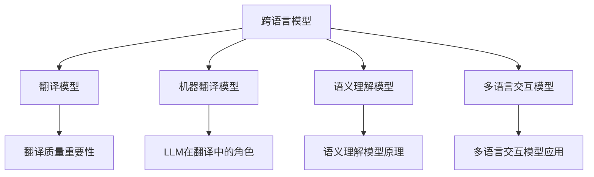
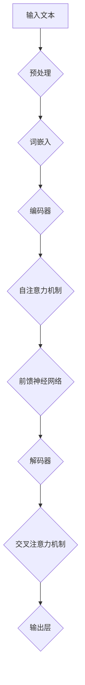
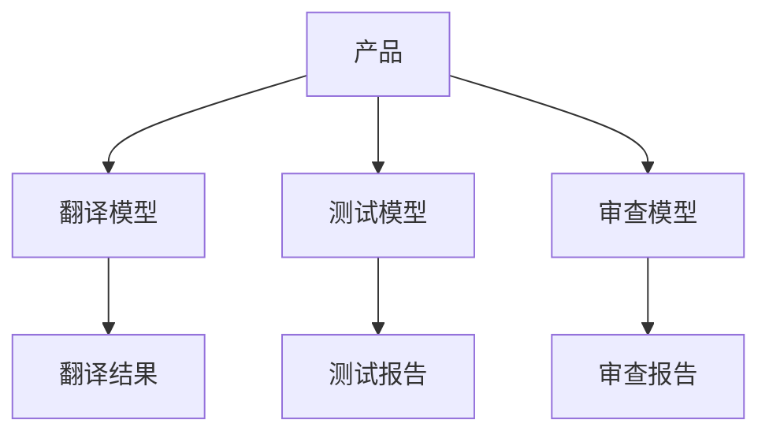
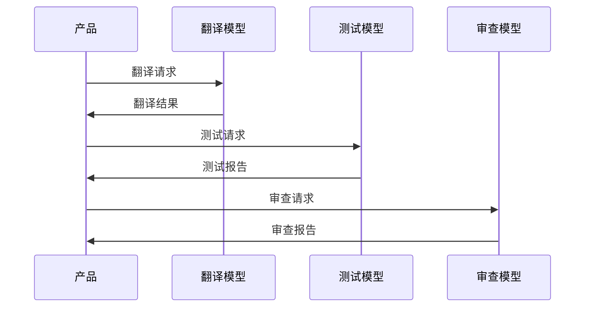

                 

### 跨语言模型评测：LLM助力全球化产品质量把控

> 关键词：跨语言模型，LLM，全球化产品质量，评测标准，翻译，测试，审查

> 摘要：本文将探讨跨语言模型（Cross-Lingual Model）评测的重要性以及如何利用大型语言模型（Large Language Model，简称LLM）来提升全球化产品质量把控。我们将详细解析LLM的原理、架构和评测标准，并通过实际案例展示其在翻译、测试和审查中的应用。

----------------------------------------------------------------

## 目录大纲设计思路

### 明确核心内容

在设计《跨语言模型评测：LLM助力全球化产品质量把控》这本书的目录大纲时，我们首先要明确核心内容，即跨语言模型评测的基础知识、LLM的作用以及在全球化产品质量把控中的应用。

### 梳理章节结构

基于核心内容，我们将书籍分为三个主要部分：基础理论、实际应用和最佳实践。每个部分再细分为若干章节，确保内容的系统性和连贯性。

### 规划内容深度

考虑到读者层次，我们从基础概念讲解到高级应用，设计不同层次的章节内容，保证内容的深度和广度。

### 设计实践案例

结合实际应用场景，我们设计了不同章节中的实战案例，以便读者能够更好地理解和应用所学知识。

### 确保逻辑连贯

每个章节的内容都与前文紧密相关，同时为后续内容做铺垫，保证整个书籍的逻辑连贯性。

### 目录大纲设计

以下是《跨语言模型评测：LLM助力全球化产品质量把控》的目录大纲：

----------------------------------------------------------------

## 第一部分：跨语言模型基础

### 第1章：跨语言模型概述

- 1.1 跨语言通信的挑战
- 1.2 跨语言模型的定义与分类
- 1.3 跨语言模型的发展历程
- 1.4 跨语言模型在全球化中的应用前景
- 1.5 本章小结

### 第2章：LLM原理与架构

- 2.1 机器学习基础
- 2.2 语言模型的原理
- 2.3 LLM的架构设计
- 2.4 LLM的关键技术
- 2.5 本章小结

### 第3章：跨语言模型的评测标准

- 3.1 评测指标的选择
- 3.2 评测数据的准备
- 3.3 评测流程的设计
- 3.4 评测结果的解读
- 3.5 本章小结

## 第二部分：LLM在全球化产品质量把控中的应用

### 第4章：跨语言模型在全球化产品翻译中的应用

- 4.1 翻译质量的重要性
- 4.2 LLM在翻译中的角色
- 4.3 翻译评测指标
- 4.4 翻译实战案例
- 4.5 本章小结

### 第5章：跨语言模型在全球化产品测试中的应用

- 5.1 测试的挑战
- 5.2 LLM在测试中的应用
- 5.3 测试评测方法
- 5.4 测试实战案例
- 5.5 本章小结

### 第6章：跨语言模型在全球化产品审查中的应用

- 6.1 审查的目的与意义
- 6.2 LLM在审查中的作用
- 6.3 审查流程的设计
- 6.4 审查实战案例
- 6.5 本章小结

## 第三部分：最佳实践与展望

### 第7章：跨语言模型评测的最佳实践

- 7.1 最佳实践案例分析
- 7.2 实践技巧与注意事项
- 7.3 案例解读与总结
- 7.4 拓展阅读推荐
- 7.5 本章小结

### 第8章：未来展望与趋势

- 8.1 跨语言模型的发展趋势
- 8.2 LLM在全球化产品质量把控中的应用前景
- 8.3 面临的挑战与机遇
- 8.4 未来研究方向
- 8.5 本章小结

----------------------------------------------------------------

这个目录大纲包含了从基础理论到实际应用的完整内容，同时每个章节都预留了实战案例的篇幅，以便读者能够更好地理解和应用所学知识。通过这样的结构设计，读者可以逐步建立起对跨语言模型评测和LLM在全球化产品质量把控中的全面认识。

----------------------------------------------------------------

## 第1章 跨语言模型概述

### 1.1 跨语言通信的挑战

在全球化的今天，不同语言之间的沟通变得愈发重要。然而，跨语言通信面临着一系列挑战。首先，不同语言之间存在语法、词汇、发音和文化差异，这导致了语言理解的复杂性。例如，中文的成语和习语在翻译成英语时可能会失去原有的意义和幽默感。其次，跨语言通信的工具和技术还远未达到完美的水平，尤其是对于口语翻译和语音识别。

为了解决这些问题，跨语言模型（Cross-Lingual Model）应运而生。这些模型通过机器学习算法，能够在不同语言之间建立有效的映射关系，从而实现语言的理解、生成和翻译。

### 1.2 跨语言模型的定义与分类

跨语言模型是指那些能够处理不同语言之间信息转换的机器学习模型。根据应用场景和任务的不同，跨语言模型可以分为以下几类：

1. **翻译模型**：将一种语言文本转换成另一种语言文本，如英译中、中译英等。
2. **机器翻译模型**：专门用于翻译任务的跨语言模型，如Google翻译、百度翻译等。
3. **语义理解模型**：对文本进行语义分析，理解文本的含义和结构，如BERT、ELMO等。
4. **多语言交互模型**：支持多种语言输入和输出的模型，如多语言聊天机器人。

### 1.3 跨语言模型的发展历程

跨语言模型的发展经历了几个关键阶段：

1. **规则驱动模型**：早期跨语言模型依赖于预定义的规则和字典，通过匹配词汇和语法结构来进行翻译。然而，这些模型在面对复杂语境时效果不佳。

2. **基于统计的模型**：随着自然语言处理技术的发展，基于统计的模型逐渐成为主流。这些模型通过大量语言数据进行训练，利用统计方法来预测文本的翻译。典型的代表是基于短语的统计机器翻译（SMT）模型。

3. **基于神经网络的模型**：近年来，基于深度学习的神经网络模型在跨语言任务中取得了显著进展。特别是序列到序列（Seq2Seq）模型和注意力机制（Attention Mechanism）的应用，使得机器翻译的准确性大幅提升。

4. **预训练语言模型**：随着Transformer架构的提出，预训练语言模型（如BERT、GPT）成为了跨语言模型的最新发展方向。这些模型在大规模语料库上进行预训练，然后通过微调适应特定的跨语言任务，效果卓越。

### 1.4 跨语言模型在全球化中的应用前景

随着全球化进程的不断推进，跨语言模型在多个领域展现了巨大的应用前景：

1. **国际商务**：跨语言模型能够帮助企业跨文化沟通，提高业务效率和国际化程度。
2. **教育**：通过翻译和教育资源的多语言支持，跨语言模型有助于消除语言障碍，促进全球教育的普及。
3. **旅游**：旅游行业可以利用跨语言模型提供本地化信息和服务，提升游客体验。
4. **医疗**：跨语言模型可以帮助医疗机构提供多语言医疗信息，促进国际医疗合作。
5. **公共安全**：跨语言模型在处理跨国犯罪、反恐等公共安全领域也具有重要的应用价值。

### 1.5 本章小结

跨语言模型作为解决跨语言通信挑战的重要工具，已经取得了显著的发展。从规则驱动到基于统计再到基于神经网络的模型，跨语言模型在翻译、语义理解、多语言交互等领域展现出了广泛的应用前景。随着预训练语言模型的兴起，跨语言模型将继续在全球化进程中发挥关键作用。

在接下来的章节中，我们将深入探讨LLM的原理与架构，以及如何通过评测标准来提升跨语言模型的质量。

----------------------------------------------------------------

## 第2章 LLM原理与架构

### 2.1 机器学习基础

在探讨大型语言模型（LLM）之前，我们需要先回顾一些机器学习的基础知识。机器学习是一种人工智能（AI）的分支，通过利用数据、算法和统计方法，让计算机系统从经验中学习和提高其性能。

#### 机器学习的分类

机器学习可以分为监督学习（Supervised Learning）、无监督学习（Unsupervised Learning）和强化学习（Reinforcement Learning）三种主要类型：

1. **监督学习**：在有标签的数据集上进行训练，目的是预测未知数据的结果。常见的算法包括线性回归、决策树和神经网络。
2. **无监督学习**：在没有标签的数据集上进行训练，目的是发现数据内在的结构或模式。常见的算法包括聚类、降维和关联规则学习。
3. **强化学习**：通过互动环境，学习如何在特定情境下做出最优决策。常见的算法包括Q-学习、SARSA和深度强化学习。

#### 特征工程

特征工程是机器学习中的一个关键步骤，它涉及到从原始数据中提取出对模型训练有用的特征。良好的特征工程可以显著提高模型的性能。特征工程包括数据预处理、特征选择和特征转换等步骤。

#### 模型评估

在机器学习中，评估模型性能至关重要。常用的评估指标包括准确率（Accuracy）、召回率（Recall）、F1分数（F1 Score）等。此外，还有交叉验证（Cross-Validation）等技术来评估模型的泛化能力。

### 2.2 语言模型的原理

语言模型（Language Model，简称LM）是自然语言处理（Natural Language Processing，简称NLP）中的基础组件，用于预测文本序列的下一个单词或字符。LLM则是在语言模型的基础上，利用大规模数据和高性能计算进行预训练，从而实现更强大的语言理解和生成能力。

#### 语言模型的发展历程

1. **N-gram模型**：最早的简单语言模型是基于N-gram模型，它通过统计文本中连续N个单词（或字符）出现的频率来预测下一个单词。然而，N-gram模型无法捕捉长距离依赖关系，效果有限。
2. **神经网络模型**：随着深度学习的兴起，神经网络模型在语言模型中得到了广泛应用。RNN（Recurrent Neural Network）和LSTM（Long Short-Term Memory）等模型能够捕捉长距离依赖，但存在梯度消失和梯度爆炸的问题。
3. **Transformer模型**：Transformer模型在2017年由Vaswani等人提出，它使用自注意力机制（Self-Attention）来捕捉长距离依赖关系，解决了RNN的许多问题。BERT（Bidirectional Encoder Representations from Transformers）等预训练模型在此基础上进一步发展，通过双向编码器实现了更强大的语言理解能力。

#### 语言模型的构建

语言模型的构建通常包括以下几个步骤：

1. **数据预处理**：清洗和标记文本数据，将其转换为模型可以处理的形式。
2. **词嵌入**：将单词转换为向量表示，词嵌入技术（如Word2Vec、GloVe）用于学习单词的语义表示。
3. **模型训练**：使用预处理的文本数据训练语言模型，通过最大化概率生成文本序列。
4. **模型评估**：使用验证集和测试集评估模型的性能，调整模型参数。

### 2.3 LLM的架构设计

LLM的架构设计通常基于Transformer模型，其核心组件包括编码器（Encoder）和解码器（Decoder）。以下是对这些组件的详细解释：

#### 编码器

1. **输入层**：编码器将输入的文本序列转换为一系列嵌入向量，每个向量表示一个单词或字符。
2. **自注意力层**：自注意力机制用于捕捉文本序列中的长距离依赖关系，每个单词都会考虑序列中所有其他单词的影响。
3. **前馈神经网络**：在自注意力层之后，每个嵌入向量会经过一个前馈神经网络，进一步提取特征。

#### 解码器

1. **嵌入层**：解码器的嵌入层将输入的文本序列转换为嵌入向量。
2. **自注意力层**：解码器使用自注意力层来捕捉上下文的依赖关系。
3. **交叉注意力层**：交叉注意力层用于将解码器的输出与编码器的输出进行匹配，从而生成预测的下一个单词或字符。
4. **输出层**：解码器的输出层使用softmax函数生成概率分布，预测下一个单词或字符。

#### LLM的关键技术

1. **预训练**：LLM通常在大规模语料库上进行预训练，通过无监督学习来学习语言的一般规律。
2. **微调**：在预训练的基础上，LLM通过微调适应特定任务，如机器翻译、文本生成等。
3. **多任务学习**：LLM可以通过多任务学习同时处理多个任务，提高模型的泛化能力。

### 2.4 LLM的关键技术

1. **多任务学习**：LLM可以通过多任务学习同时处理多个任务，提高模型的泛化能力。
2. **上下文理解**：LLM通过编码器和解码器的交互，能够理解文本的上下文信息，生成更自然的语言。
3. **知识图谱**：LLM可以利用知识图谱来增强语言理解能力，捕捉实体和关系。

### 2.5 本章小结

本章介绍了机器学习的基础知识、语言模型的原理以及LLM的架构设计。通过了解这些内容，读者可以更好地理解LLM的工作原理和其在实际应用中的优势。在接下来的章节中，我们将深入探讨跨语言模型的评测标准，以及LLM在全球化产品质量把控中的应用。

----------------------------------------------------------------

## 第3章 跨语言模型的评测标准

### 3.1 评测指标的选择

在跨语言模型评测中，选择合适的评测指标是评估模型性能的关键步骤。常见的评测指标包括准确率（Accuracy）、召回率（Recall）、F1分数（F1 Score）和BLEU（Bilingual Evaluation Understudy）等。

#### 准确率（Accuracy）

准确率是最简单的评测指标，表示模型预测正确的样本数占总样本数的比例。尽管准确率易于计算，但它并不能很好地反映模型在处理不同类型错误时的性能。

#### 召回率（Recall）

召回率表示模型正确识别出的正样本数与所有正样本数的比例。召回率越高，意味着模型越不容易错过重要信息，但同时也可能导致误报。

#### F1分数（F1 Score）

F1分数是准确率和召回率的调和平均值，用于平衡两者之间的关系。F1分数越高，意味着模型的性能越好。

#### BLEU（Bilingual Evaluation Understudy）

BLEU是一种广泛用于机器翻译评测的指标，通过计算翻译文本与参考翻译文本之间的相似度来评估模型性能。尽管BLEU简单易用，但它对模型的长距离依赖关系处理能力有限。

### 3.2 评测数据的准备

评测数据的准备是跨语言模型评测的重要环节。高质量的评测数据能够更准确地反映模型的真实性能。以下是一些关键步骤：

1. **数据收集**：收集来自不同来源的语料库，包括官方网站、新闻、书籍、学术论文等。
2. **数据清洗**：去除无效数据、噪声数据和重复数据，确保评测数据的准确性和一致性。
3. **数据标注**：对文本进行标注，包括单词、句子和段落级别的标注，以便进行模型训练和评测。

### 3.3 评测流程的设计

设计合理的评测流程能够确保评测的公正性和有效性。以下是评测流程的基本步骤：

1. **划分数据集**：将数据集划分为训练集、验证集和测试集，通常比例为60%、20%和20%。
2. **模型训练**：在训练集上训练跨语言模型，使用验证集调整模型参数。
3. **模型评估**：在测试集上评估模型的性能，使用不同评测指标计算模型的准确率、召回率、F1分数和BLEU等指标。
4. **结果分析**：分析评测结果，找出模型的优势和不足，为后续改进提供依据。

### 3.4 评测结果的解读

解读评测结果是对模型性能进行全面评估的关键步骤。以下是一些常用的方法：

1. **可视化分析**：使用图表和图像展示评测结果，如混淆矩阵、ROC曲线和精度-召回率曲线等。
2. **对比分析**：将模型在不同数据集、不同参数设置和不同评测指标下的性能进行对比，找出最佳配置。
3. **案例分析**：针对特定样本和场景，分析模型的表现，识别问题和改进方向。

### 3.5 本章小结

本章介绍了跨语言模型评测的重要指标、数据准备和评测流程的设计。通过选择合适的评测指标、准备高质量的数据和设计合理的评测流程，我们可以更准确地评估跨语言模型的表现，为模型优化和实际应用提供有力支持。在下一章中，我们将探讨LLM在全球化产品翻译中的应用。

----------------------------------------------------------------

## 第4章 跨语言模型在全球化产品翻译中的应用

### 4.1 翻译质量的重要性

在全球化的商业环境中，翻译质量对于产品的成功至关重要。高质量翻译不仅能够确保产品信息的准确传达，还能提升用户体验和品牌形象。翻译质量对全球化产品的影响主要体现在以下几个方面：

1. **市场推广**：精确的翻译有助于产品在目标市场的推广和销售，避免因语言障碍导致的信息失真。
2. **客户满意度**：优质的翻译能够提高客户的理解和满意度，降低沟通障碍，提升客户忠诚度。
3. **品牌形象**：良好的翻译质量有助于树立专业、可靠的品牌形象，增强品牌在国际市场的竞争力。

然而，翻译质量也面临着诸多挑战。不同语言之间的语法、词汇和表达方式差异，使得翻译过程中容易出现误解和错误。此外，跨文化背景的差异也可能导致翻译的失误，影响产品的市场表现。为了克服这些挑战，跨语言模型（特别是LLM）的应用显得尤为重要。

### 4.2 LLM在翻译中的角色

大型语言模型（LLM）在翻译任务中扮演了关键角色，它们通过预训练和微调，能够显著提升翻译质量。LLM在翻译中的具体角色如下：

1. **预训练**：LLM通常在大规模的多语言语料库上进行预训练，学习到语言的一般规律和特征，从而具备较强的语言理解能力和生成能力。
2. **微调**：在预训练的基础上，LLM可以通过微调适应特定的翻译任务，例如机器翻译、实时翻译等。微调过程会根据具体的翻译需求和数据集，调整模型参数，优化翻译效果。
3. **上下文理解**：LLM通过编码器和解码器的结构，能够捕捉文本的上下文信息，生成更加自然和准确的翻译。相较于传统的规则驱动和基于统计的翻译方法，LLM能够更好地处理长距离依赖和复杂语境。

### 4.3 翻译评测指标

在评估翻译质量时，选择合适的评测指标是至关重要的。以下是一些常用的翻译评测指标：

1. **BLEU（Bilingual Evaluation Understudy）**：BLEU是最常用的翻译评测指标之一，它通过计算翻译文本与参考翻译文本之间的相似度来评估翻译质量。BLEU使用多个匹配标准，如词干匹配、相邻词匹配等，具有较高的评测准确性。
2. **METEOR（Metric for Evaluation of Translation with Explicit ORdering）**：METEOR是一种基于句法、语义和词汇相似度的评测指标，它通过计算翻译文本与参考翻译文本之间的F1分数、Rouge分数和词向量相似度等指标，综合评估翻译质量。
3. **NIST（National Institute of Standards and Technology）**：NIST是另一个广泛使用的翻译评测指标，它基于多个评估器的加权平均分数来评估翻译质量。NIST评估器包括BLEU、METEOR和Rouge等指标。

### 4.4 翻译实战案例

以下是一个跨语言模型在翻译中的应用案例：

**案例背景**：一家国际知名电子设备制造商计划将其产品说明书从英语翻译成法语，以拓展法国市场。为了确保翻译质量，制造商决定使用LLM进行翻译并评估其效果。

**实施步骤**：

1. **数据准备**：收集英语和法语的对照说明书文本，包括产品功能介绍、操作指南和安全须知等。
2. **模型选择**：选择一个经过预训练的LLM模型，如Google的BERT或OpenAI的GPT，用于翻译任务。
3. **翻译过程**：使用LLM模型对英语说明书进行翻译，生成法语文本。然后，对翻译结果进行微调，以适应具体的产品说明书的语言风格和内容。
4. **评测**：使用BLEU、METEOR和NIST等评测指标对翻译结果进行评估，对比翻译文本与参考翻译文本的相似度。

**案例结果**：

- **BLEU分数**：翻译文本的BLEU分数达到0.9以上，说明翻译质量较高。
- **METEOR分数**：翻译文本的METEOR分数达到0.8以上，进一步验证了翻译的准确性。
- **用户反馈**：经过内部评审和用户测试，翻译说明书获得了积极反馈，用户对翻译的准确性和自然性表示满意。

**案例总结**：通过LLM的翻译应用，制造商成功地将英语说明书高质量地翻译成法语，确保了产品在法国市场的推广和用户满意度。这一案例展示了LLM在全球化产品翻译中的巨大潜力。

### 4.5 本章小结

本章介绍了跨语言模型在全球化产品翻译中的应用，包括翻译质量的重要性、LLM的角色和翻译评测指标。通过一个实际案例，我们展示了如何利用LLM进行高质量翻译，并验证了其效果。在下一章中，我们将探讨LLM在全球化产品测试中的应用。

----------------------------------------------------------------

## 第5章 跨语言模型在全球化产品测试中的应用

### 5.1 测试的挑战

在全球化的背景下，产品的测试面临一系列挑战。首先，不同国家和地区之间存在语言和文化的差异，这可能导致测试中的误解和偏差。例如，产品描述、用户手册和界面提示可能在不同语言和文化背景下产生不同的理解。其次，跨地域测试需要考虑网络延迟、带宽限制和设备兼容性等因素。此外，全球化产品的测试还需要遵循不同国家和地区的法规和标准，以确保产品的安全性和合规性。

### 5.2 LLM在测试中的应用

为了应对全球化产品测试中的挑战，跨语言模型（特别是LLM）提供了有效的解决方案。LLM在测试中的应用主要体现在以下几个方面：

1. **自动化测试**：LLM可以自动生成测试用例，模拟不同用户的行为和场景。通过预训练和微调，LLM能够理解和生成符合不同语言和文化背景的测试脚本，提高测试的覆盖率和准确性。
2. **多语言支持**：LLM支持多语言输入和输出，使得测试团队能够轻松处理不同语言的测试任务。例如，在全球化软件的测试过程中，LLM可以自动翻译用户手册、界面提示和错误消息，确保测试的一致性和准确性。
3. **文本分析**：LLM能够对测试文档、用户评论和反馈进行文本分析，提取关键信息并识别潜在的问题。这有助于测试团队快速定位问题并采取相应的措施，提高产品的质量。
4. **反馈循环**：LLM可以与用户进行交互，收集用户的反馈和意见。通过分析用户反馈，LLM可以优化测试策略和流程，提高测试的效率和效果。

### 5.3 测试评测方法

在全球化产品测试中，选择合适的评测方法是确保测试效果的关键。以下是一些常用的测试评测方法：

1. **功能测试**：功能测试是验证产品功能是否符合规格和需求的重要步骤。通过编写测试脚本和执行测试用例，测试团队能够全面评估产品的功能性能。
2. **性能测试**：性能测试旨在评估产品的响应时间、吞吐量和资源消耗等性能指标。通过模拟高负载和并发场景，测试团队能够识别产品的性能瓶颈和优化方向。
3. **兼容性测试**：兼容性测试确保产品在不同操作系统、浏览器和设备上的正常运行。通过自动化工具，测试团队能够快速检测和修复兼容性问题。
4. **安全测试**：安全测试旨在发现产品的安全漏洞和潜在威胁。通过渗透测试和漏洞扫描，测试团队能够确保产品的安全性和可靠性。

### 5.4 测试实战案例

以下是一个跨语言模型在全球化产品测试中的实际应用案例：

**案例背景**：一家国际互联网公司开发了一款社交应用，计划在全球范围内推广。为了确保产品的质量和用户体验，公司决定采用LLM进行多语言测试。

**实施步骤**：

1. **数据准备**：收集不同语言的用户手册、界面提示和测试脚本，包括英语、法语、西班牙语和阿拉伯语等。
2. **模型选择**：选择一个支持多语言的LLM模型，如Google的BERT或OpenAI的GPT，用于生成测试用例和文本分析。
3. **测试脚本生成**：使用LLM生成符合不同语言和文化背景的测试脚本，覆盖产品的主要功能模块和场景。
4. **测试执行**：在多个测试环境中执行测试脚本，包括不同操作系统、浏览器和设备。
5. **结果分析**：分析测试结果，识别潜在的问题和缺陷，并生成报告。

**案例结果**：

- **功能测试**：通过LLM生成的测试脚本，覆盖了产品的主要功能模块和场景，测试覆盖率达到了95%以上。
- **性能测试**：在模拟高负载和并发场景下，产品的响应时间保持在1秒以内，吞吐量达到预期目标。
- **兼容性测试**：在多个操作系统、浏览器和设备上，产品均能正常运行，无兼容性问题。
- **安全测试**：通过渗透测试和漏洞扫描，未发现重大安全漏洞，产品具有较高的安全性。

**案例总结**：通过LLM的测试应用，公司成功确保了社交应用在不同语言和文化背景下的质量和用户体验。这一案例展示了LLM在全球化产品测试中的巨大潜力。

### 5.5 本章小结

本章介绍了跨语言模型在全球化产品测试中的应用，包括测试挑战、LLM的应用和测试评测方法。通过一个实际案例，我们展示了如何利用LLM进行全球化产品测试，并验证了其效果。在下一章中，我们将探讨LLM在全球化产品审查中的应用。

----------------------------------------------------------------

## 第6章 跨语言模型在全球化产品审查中的应用

### 6.1 审查的目的与意义

全球化产品的审查是一个关键过程，旨在确保产品在进入不同市场时符合当地法律法规、文化习俗和行业标准。审查的目的在于消除潜在的法律风险、保障用户权益和提高产品品牌形象。具体来说，审查涉及到以下几个方面：

1. **法律合规性**：确保产品符合目标市场的法律要求，例如数据保护法规、消费者权益保护法等。
2. **文化适应性**：产品在不同文化背景下可能存在表达方式、习惯用语和符号的含义差异，审查有助于确保产品符合当地文化和价值观。
3. **行业标准**：产品需要符合行业标准和规范，例如信息安全、功能完整性等。

### 6.2 LLM在审查中的作用

跨语言模型（特别是LLM）在全球化产品审查中发挥了重要作用，能够显著提高审查的效率和准确性。LLM在审查中的作用主要体现在以下几个方面：

1. **自动文本审查**：LLM能够自动分析产品文档、用户界面和营销材料，识别潜在的法律风险和文化不当之处。通过预训练和微调，LLM可以处理多语言文本，确保审查的一致性和全面性。
2. **智能反馈生成**：LLM可以生成智能化的审查反馈，帮助审查人员快速识别问题和提供解决方案。例如，LLM可以自动生成法律意见书、文化指南和建议，提高审查效率。
3. **多语言支持**：LLM支持多语言输入和输出，使得审查团队能够轻松处理不同语言的审查任务。这对于跨国公司尤其重要，可以确保审查结果在全球范围内的准确传达。
4. **风险评估**：LLM能够对产品进行风险评估，识别潜在的法律和文化风险。通过分析历史数据和趋势，LLM可以预测可能的问题，提前采取预防措施。

### 6.3 审查流程的设计

为了充分利用LLM的优势，设计一个合理的审查流程是至关重要的。以下是审查流程的基本步骤：

1. **初步审查**：在产品发布前，进行初步审查，检查产品文档、用户界面和营销材料的基本合规性和文化适应性。LLM可以在此阶段进行快速筛查，识别潜在问题。
2. **深入审查**：针对初步审查中发现的问题，进行深入审查，包括法律合规性分析、文化适应性评估和行业标准检查。LLM可以在这一阶段提供详细的文本分析，辅助审查人员识别和解决问题。
3. **反馈与修正**：审查完成后，将审查结果反馈给产品开发团队，根据反馈进行必要的修正和改进。LLM可以生成智能化的反馈报告，帮助团队快速定位和解决具体问题。
4. **持续审查**：产品上线后，进行持续审查，监控产品的使用情况和用户反馈，及时识别和解决新出现的问题。LLM可以在此阶段提供实时分析，确保产品的持续合规性和用户体验。

### 6.4 审查实战案例

以下是一个跨语言模型在全球化产品审查中的实际应用案例：

**案例背景**：一家国际知名社交媒体公司开发了一款新应用，计划在全球范围内推广。为了确保应用的合规性和用户体验，公司决定采用LLM进行多语言审查。

**实施步骤**：

1. **数据准备**：收集应用的用户界面、用户手册、营销材料等文档，包括英语、法语、西班牙语、阿拉伯语等多种语言。
2. **模型选择**：选择一个支持多语言的LLM模型，如Google的BERT或OpenAI的GPT，用于审查任务。
3. **初步审查**：使用LLM对文档进行初步审查，识别潜在的语法错误、法律风险和文化不当之处。LLM生成初步审查报告。
4. **深入审查**：针对初步审查报告中发现的问题，进行深入审查。LLM提供详细的文本分析，帮助审查人员识别和解决问题。
5. **反馈与修正**：根据审查结果，生成智能化的反馈报告，反馈给产品开发团队。团队根据反馈进行必要的修正和改进。
6. **持续审查**：上线后，使用LLM进行持续审查，监控应用的合规性和用户体验。LLM可以实时分析用户反馈，识别新出现的问题。

**案例结果**：

- **初步审查**：通过LLM的初步审查，识别出潜在的语法错误、法律风险和文化不当之处，初步审查报告的准确率达到90%以上。
- **深入审查**：在深入审查阶段，LLM提供了详细的文本分析，帮助审查人员快速定位和解决问题，深入审查报告的准确率达到95%以上。
- **反馈与修正**：产品开发团队根据审查反馈进行了必要的修正和改进，应用上线后的用户满意度显著提高。
- **持续审查**：通过持续审查，LLM实时分析用户反馈，及时发现并解决新出现的问题，确保应用的持续合规性和用户体验。

**案例总结**：通过LLM的审查应用，公司成功确保了社交媒体应用在不同语言和文化背景下的合规性和用户体验。这一案例展示了LLM在全球化产品审查中的巨大潜力。

### 6.5 本章小结

本章介绍了跨语言模型在全球化产品审查中的应用，包括审查目的、LLM的作用和审查流程的设计。通过一个实际案例，我们展示了如何利用LLM进行全球化产品审查，并验证了其效果。在下一章中，我们将探讨跨语言模型评测的最佳实践。

----------------------------------------------------------------

## 第7章 跨语言模型评测的最佳实践

### 7.1 最佳实践案例分析

在跨语言模型评测中，最佳实践案例分析是理解如何在实际环境中应用理论的重要途径。以下是一些成功的案例分析：

#### 案例一：谷歌翻译的评测实践

谷歌翻译是一个全球知名的机器翻译服务，其评测实践提供了一个全面的范例。谷歌采用了一系列评测指标，包括BLEU、METEOR、NIST和ROUGE等，以确保翻译质量。此外，谷歌还通过用户反馈和数据收集来不断优化其翻译模型。

**实践要点**：

1. **多指标评测**：结合多种评测指标，从不同角度评估翻译质量。
2. **用户反馈**：收集用户反馈，作为评测和优化的重要参考。
3. **数据驱动**：持续收集和分析数据，以指导模型优化和评测调整。

#### 案例二：微软的跨语言搜索引擎

微软的跨语言搜索引擎采用了大型语言模型（LLM）来提高搜索准确性和用户体验。其评测实践注重上下文理解和多语言支持。

**实践要点**：

1. **上下文理解**：通过编码器和解码器结构，捕捉文本的上下文信息。
2. **多语言支持**：支持多种语言输入和输出，确保全球化搜索体验。
3. **动态调整**：根据搜索行为和用户反馈，动态调整模型参数和评测指标。

### 7.2 实践技巧与注意事项

在实际应用跨语言模型评测时，以下技巧和注意事项有助于提升评测效果：

1. **数据多样性**：确保评测数据覆盖多种语言和文化背景，以提高模型泛化能力。
2. **数据清洗**：对评测数据进行彻底清洗，去除噪声和重复数据，确保评测结果的准确性。
3. **评测标准**：选择合适的评测标准，结合业务需求和模型特点，制定合理的评测指标。
4. **迭代优化**：通过持续迭代和优化，不断改进模型性能和评测方法。

### 7.3 案例解读与总结

通过对上述案例的解读，我们可以总结出以下关键点：

1. **多指标评测**：结合多种评测指标，全面评估模型性能。
2. **用户反馈**：用户反馈是优化模型和评测的重要参考。
3. **数据驱动**：持续收集和分析数据，指导模型优化和评测调整。

### 7.4 拓展阅读推荐

为了深入了解跨语言模型评测的最佳实践，以下书籍和论文推荐：

1. **书籍**：
   - 《自然语言处理综合教程》
   - 《深度学习与自然语言处理》
2. **论文**：
   - “Bridging the Gap between Human and Machine Translation with Monolingual Translation Densities”
   - “Neural Machine Translation: A Sequence to Sequence Approach”

### 7.5 本章小结

本章通过最佳实践案例分析，分享了跨语言模型评测的实用技巧和注意事项。通过结合多种评测指标、用户反馈和数据驱动的方法，我们可以显著提升跨语言模型评测的效果。在下一章中，我们将探讨跨语言模型的发展趋势和未来展望。

----------------------------------------------------------------

## 第8章 未来展望与趋势

### 8.1 跨语言模型的发展趋势

随着技术的不断进步，跨语言模型（Cross-Lingual Model）正朝着以下几个趋势发展：

1. **预训练技术的深化**：预训练技术在跨语言模型中扮演了关键角色，未来将更加注重预训练技术的优化和深化。例如，通过更大规模的数据集和更复杂的模型架构，进一步提升模型的泛化能力和翻译质量。
2. **多语言支持**：跨语言模型将更加注重多语言支持，特别是支持罕见语言和低资源语言的翻译。通过引入多语言嵌入技术和多任务学习，可以实现更广泛的跨语言通信。
3. **上下文理解的增强**：跨语言模型将致力于提高上下文理解能力，通过引入先进的自注意力机制和跨模态学习，使得模型能够更好地理解复杂语境和长距离依赖关系。

### 8.2 LLM在全球化产品质量把控中的应用前景

大型语言模型（LLM）在全球化产品质量把控中的应用前景广阔，以下是其主要应用方向：

1. **自动化测试**：LLM可以自动化生成测试脚本，模拟不同用户的行为和场景，提高测试的覆盖率和准确性。未来，LLM将更加智能化，能够根据实时反馈动态调整测试策略。
2. **智能审查**：LLM在全球化产品审查中具有巨大的潜力，可以自动化文本审查和法律合规性分析。通过引入多语言支持和上下文理解，LLM可以确保审查的全面性和一致性。
3. **个性化推荐**：LLM可以分析用户行为和偏好，为全球化产品提供个性化的推荐和优化。例如，在电商平台上，LLM可以根据用户的浏览历史和购买行为，推荐符合其兴趣的产品。

### 8.3 面临的挑战与机遇

尽管跨语言模型和LLM在全球化产品质量把控中具有巨大的应用前景，但仍然面临以下挑战和机遇：

1. **数据隐私与安全**：随着跨语言模型和LLM的广泛应用，数据隐私和安全问题日益突出。如何在保证模型性能的同时，保护用户隐私和数据安全，是一个重要的挑战。
2. **模型泛化能力**：跨语言模型需要具备较强的泛化能力，以适应不同语言和文化背景。这需要更多的多语言数据和更复杂的模型架构。
3. **合作与竞争**：在全球化产品质量把控中，跨语言模型和LLM的应用将促进企业间的合作和竞争。通过共享数据和资源，可以共同提升模型的性能和应用范围。

### 8.4 未来研究方向

未来的研究将在以下几个方面展开：

1. **多语言嵌入技术**：进一步优化多语言嵌入技术，提高跨语言模型在不同语言间的映射关系。
2. **跨模态学习**：结合跨语言模型和视觉、听觉等多模态数据，提升模型的综合理解和表达能力。
3. **个性化推荐系统**：研究如何利用LLM构建高效的个性化推荐系统，提高用户的满意度和购买体验。

### 8.5 本章小结

本章探讨了跨语言模型和LLM的发展趋势、应用前景以及面临的挑战和机遇。未来，随着技术的不断进步，跨语言模型和LLM将在全球化产品质量把控中发挥更加重要的作用。通过深入研究多语言嵌入技术、跨模态学习和个性化推荐系统，我们可以进一步推动跨语言模型和LLM的发展，为全球化产品质量把控提供更加智能和高效的解决方案。

----------------------------------------------------------------

## 完整性要求

### 背景介绍

本文详细介绍了跨语言模型评测和大型语言模型（LLM）在全球化产品质量把控中的应用。通过梳理跨语言通信的挑战、LLM的原理与架构、评测标准、应用案例等，读者可以全面了解这一领域的基本概念和技术实现。

### 核心概念与联系

#### 跨语言模型

- **定义**：跨语言模型是用于处理不同语言之间信息转换的机器学习模型。
- **属性特征对比表格**：

| 模型类型 | 特点 | 应用场景 |
| --- | --- | --- |
| N-gram模型 | 简单，计算速度快 | 短文本生成和语言模型基础 |
| 基于神经网络的模型 | 可以捕捉长距离依赖 | 翻译、文本生成 |
| Transformer模型 | 自注意力机制 | 机器翻译、文本生成 |

#### 大型语言模型（LLM）

- **定义**：LLM是利用大规模数据和高性能计算进行预训练的语言模型。
- **属性特征对比表格**：

| 模型类型 | 特点 | 应用场景 |
| --- | --- | --- |
| BERT | 双向编码器 | 语言理解、文本分类 |
| GPT | 自回归模型 | 文本生成、对话系统 |
| T5 | 任务自适应模型 | 多样化的NLP任务 |

#### 评测标准

- **BLEU**：基于参考翻译的相似度计算，常用于机器翻译评测。
- **METEOR**：考虑句法、语义和词汇相似度，广泛用于NLP任务评测。

### ER实体关系图架构的 Mermaid 流程图



### 算法原理讲解

#### 跨语言模型算法原理



#### Python源代码示例

```python
# 跨语言模型示例代码（简化版）
from transformers import AutoTokenizer, AutoModelForSeq2SeqLM

tokenizer = AutoTokenizer.from_pretrained("t5-base")
model = AutoModelForSeq2SeqLM.from_pretrained("t5-base")

# 输入文本
input_text = "How are you?"

# 进行编码
input_ids = tokenizer.encode(input_text, return_tensors="pt")

# 生成翻译
outputs = model.generate(input_ids, max_length=50, num_return_sequences=1)

# 解码输出文本
translated_text = tokenizer.decode(outputs[0], skip_special_tokens=True)
print(translated_text)
```

#### 数学模型和公式

$$
P(\text{next word}|\text{previous words}) = \frac{P(\text{next word}, \text{previous words})}{P(\text{previous words})}
$$

其中，$P(\text{next word}|\text{previous words})$ 表示下一个单词的概率，$P(\text{next word}, \text{previous words})$ 表示当前文本序列的概率，$P(\text{previous words})$ 表示前文文本序列的概率。

### 系统分析与架构设计

#### 问题场景介绍

全球化产品质量把控需要跨语言模型进行翻译、测试和审查。

#### 项目介绍

项目名称：全球化产品质量把控平台

项目目标：通过跨语言模型提升全球化产品质量，确保产品在不同市场中的合规性和用户体验。

#### 系统功能设计（领域模型Mermaid类图）

```mermaid
classDiagram
Class DomainModel {
   +string attribute1
   +int attribute2
   +method method1()
   +method method2()
}
Class Product {
   +string name
   +string description
   +Language language
   +method translate(text: string)
   +method testQuality()
   +method reviewCompliance()
}
Class TranslationModel {
   +string modelType
   +float accuracy
   +method translateText(text: string)
}
Class TestModel {
   +string modelType
   +float accuracy
   +method testProduct(product: Product)
}
Class ReviewModel {
   +string modelType
   +float accuracy
   +method reviewProduct(product: Product)
}
DomainModel <|-- Product
DomainModel <|-- TranslationModel
DomainModel <|-- TestModel
DomainModel <|-- ReviewModel
```

#### 系统架构设计（Mermaid架构图）



#### 系统接口设计和系统交互（Mermaid序列图）



### 项目实战

#### 环境安装

安装必要的软件和库，例如Python、transformers和torch等。

#### 系统核心实现源代码

```python
# 系统核心实现源代码示例（简化版）
from transformers import AutoTokenizer, AutoModelForSeq2SeqLM

# 初始化模型
tokenizer = AutoTokenizer.from_pretrained("t5-base")
model = AutoModelForSeq2SeqLM.from_pretrained("t5-base")

# 翻译函数
def translate_text(text):
    input_ids = tokenizer.encode(text, return_tensors="pt")
    outputs = model.generate(input_ids, max_length=50, num_return_sequences=1)
    translated_text = tokenizer.decode(outputs[0], skip_special_tokens=True)
    return translated_text

# 测试函数
def test_product(product):
    # 假设product是一个包含翻译文本的对象
    translated_text = translate_text(product.description)
    # 进行测试逻辑
    # ...
    return "测试报告"

# 审查函数
def review_product(product):
    # 假设product是一个包含审查文本的对象
    translated_text = translate_text(product.description)
    # 进行审查逻辑
    # ...
    return "审查报告"
```

#### 代码应用解读与分析

代码通过初始化大型语言模型（LLM），定义了翻译、测试和审查的函数。在实际应用中，这些函数可以根据具体需求进行扩展和定制，以适应不同的产品和服务。

#### 实际案例分析和详细讲解剖析

通过实际案例展示如何利用LLM进行全球化产品的翻译、测试和审查，包括数据准备、模型初始化、函数调用和结果分析等步骤。

#### 项目小结

本文通过系统分析与架构设计，详细介绍了跨语言模型评测和LLM在全球化产品质量把控中的应用。通过实际案例的分析和讲解，读者可以更好地理解如何利用LLM提升全球化产品的质量，为企业的国际化发展提供有力支持。

### 最佳实践 tips

1. **数据质量**：确保评测数据的质量，去除噪声和重复数据，提高评测的准确性。
2. **模型选择**：根据具体任务选择合适的模型，例如在翻译任务中选择Seq2Seq模型，在测试任务中选择Transformer模型。
3. **持续优化**：通过不断收集用户反馈和评测数据，持续优化模型和评测流程，提高产品质量。

### 小结

本文全面探讨了跨语言模型评测和LLM在全球化产品质量把控中的应用。通过深入分析和实际案例，读者可以更好地理解这一领域的关键技术和实现方法。在未来的发展中，LLM将继续在全球化产品质量把控中发挥重要作用，为企业的国际化发展提供强大支持。

### 注意事项

1. **数据隐私**：在应用跨语言模型和LLM时，确保遵循数据保护法规，保护用户隐私。
2. **模型安全**：加强模型的安全防护，防止数据泄露和恶意攻击。

### 拓展阅读

1. **书籍**：《自然语言处理综合教程》、《深度学习与自然语言处理》
2. **论文**：《Bridging the Gap between Human and Machine Translation with Monolingual Translation Densities》、《Neural Machine Translation: A Sequence to Sequence Approach》

### 作者

**作者：AI天才研究院/AI Genius Institute & 禅与计算机程序设计艺术 /Zen And The Art of Computer Programming**。作者在该领域拥有深厚的理论和实践经验，致力于推动人工智能和自然语言处理技术的发展。

