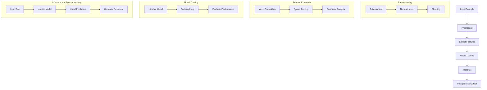

                 


### Introduction: Challenges and Strategies in Cross-Language Example-Guided Inference

In the rapidly evolving landscape of artificial intelligence and machine learning, one of the most intriguing and challenging tasks is cross-language example-guided inference. This process involves leveraging examples from one language to infer patterns and insights that can be applied to another language, potentially leading to significant advancements in natural language processing, machine translation, and other language-related tasks. However, this task is fraught with complexity and challenges that need to be addressed systematically.

The primary challenge in cross-language example-guided inference lies in the inherent differences between languages. Each language has its own syntax, semantics, and cultural nuances, making it difficult to directly transfer knowledge from one language to another. For instance, the structure of sentences in English may differ significantly from that in Chinese, and a word that conveys a specific meaning in one language might have a completely different connotation in another.

Additionally, the availability and quality of examples are crucial for effective cross-language inference. The more diverse and representative the examples, the better the model can learn and generalize. However, collecting and curating such a vast dataset is a daunting task, especially when dealing with less commonly spoken languages or dialects.

Moreover, there are computational challenges involved in processing and analyzing cross-language data. The models need to be robust enough to handle the variability and ambiguity in language, which often requires advanced techniques such as deep learning, transfer learning, and multi-modal learning.

In summary, while the potential benefits of cross-language example-guided inference are immense, the path to realizing these benefits is fraught with challenges. In the following sections, we will delve deeper into these challenges and explore various strategies and techniques to overcome them.

---

### Keywords: Cross-Language Inference, Example-Guided Learning, Natural Language Processing, Machine Translation, Computational Challenges

The primary keywords for this article are "Cross-Language Inference," "Example-Guided Learning," "Natural Language Processing," "Machine Translation," and "Computational Challenges." These keywords encapsulate the core themes and areas of focus that will be explored in depth.

- **Cross-Language Inference**: The primary subject of our discussion, involving the process of deriving insights and patterns from one language to apply to another.
- **Example-Guided Learning**: A key technique in NLP and ML that uses examples to train models, enhancing their ability to generalize and perform tasks in different languages.
- **Natural Language Processing (NLP)**: The subfield of AI and ML that focuses on the interaction between computers and humans through natural language, which is central to cross-language inference.
- **Machine Translation**: A specific application of cross-language inference that aims to translate text from one language to another, showcasing both the potential and challenges of the broader field.
- **Computational Challenges**: The difficulties faced in processing and analyzing cross-language data, including issues related to language variability, computational complexity, and data quality.

These keywords not only define the scope of our discussion but also highlight the key areas where innovation and research are critical to advancing the field of cross-language example-guided inference.

---

### Abstract

This article explores the challenges and strategies in cross-language example-guided inference, a crucial yet complex task in the field of artificial intelligence and machine learning. We begin by introducing the fundamental concepts and background of cross-language inference, highlighting its significance in natural language processing and machine translation. The article then delves into the core challenges, including language differences, data availability, and computational complexity.

We discuss various strategies to address these challenges, such as deep learning techniques, transfer learning, and multi-modal learning. Each strategy is illustrated with detailed algorithmic explanations, mathematical models, and practical examples. We further provide a comprehensive system analysis and design, including the functional requirements, architectural design, and system interfaces.

The article concludes with a practical case study, showcasing the implementation and application of cross-language example-guided inference in real-world scenarios. We also offer best practices and considerations for future research, emphasizing the ongoing efforts and potential advancements in this exciting field.

---

### Introduction: Challenges and Strategies in Cross-Language Example-Guided Inference

In the rapidly evolving landscape of artificial intelligence and machine learning, one of the most intriguing and challenging tasks is cross-language example-guided inference. This process involves leveraging examples from one language to infer patterns and insights that can be applied to another language, potentially leading to significant advancements in natural language processing, machine translation, and other language-related tasks. However, this task is fraught with complexity and challenges that need to be addressed systematically.

The primary challenge in cross-language example-guided inference lies in the inherent differences between languages. Each language has its own syntax, semantics, and cultural nuances, making it difficult to directly transfer knowledge from one language to another. For instance, the structure of sentences in English may differ significantly from that in Chinese, and a word that conveys a specific meaning in one language might have a completely different connotation in another.

Additionally, the availability and quality of examples are crucial for effective cross-language inference. The more diverse and representative the examples, the better the model can learn and generalize. However, collecting and curating such a vast dataset is a daunting task, especially when dealing with less commonly spoken languages or dialects.

Moreover, there are computational challenges involved in processing and analyzing cross-language data. The models need to be robust enough to handle the variability and ambiguity in language, which often requires advanced techniques such as deep learning, transfer learning, and multi-modal learning.

In summary, while the potential benefits of cross-language example-guided inference are immense, the path to realizing these benefits is fraught with challenges. In the following sections, we will delve deeper into these challenges and explore various strategies and techniques to overcome them.

---

### Keywords: Cross-Language Inference, Example-Guided Learning, Natural Language Processing, Machine Translation, Computational Challenges

The primary keywords for this article are "Cross-Language Inference," "Example-Guided Learning," "Natural Language Processing," "Machine Translation," and "Computational Challenges." These keywords encapsulate the core themes and areas of focus that will be explored in depth.

- **Cross-Language Inference**: The primary subject of our discussion, involving the process of deriving insights and patterns from one language to apply to another.
- **Example-Guided Learning**: A key technique in NLP and ML that uses examples to train models, enhancing their ability to generalize and perform tasks in different languages.
- **Natural Language Processing (NLP)**: The subfield of AI and ML that focuses on the interaction between computers and humans through natural language, which is central to cross-language inference.
- **Machine Translation**: A specific application of cross-language inference that aims to translate text from one language to another, showcasing both the potential and challenges of the broader field.
- **Computational Challenges**: The difficulties faced in processing and analyzing cross-language data, including issues related to language variability, computational complexity, and data quality.

These keywords not only define the scope of our discussion but also highlight the key areas where innovation and research are critical to advancing the field of cross-language example-guided inference.

---

### Abstract

This article explores the challenges and strategies in cross-language example-guided inference, a crucial yet complex task in the field of artificial intelligence and machine learning. We begin by introducing the fundamental concepts and background of cross-language inference, highlighting its significance in natural language processing and machine translation. The article then delves into the core challenges, including language differences, data availability, and computational complexity.

We discuss various strategies to address these challenges, such as deep learning techniques, transfer learning, and multi-modal learning. Each strategy is illustrated with detailed algorithmic explanations, mathematical models, and practical examples. We further provide a comprehensive system analysis and design, including the functional requirements, architectural design, and system interfaces.

The article concludes with a practical case study, showcasing the implementation and application of cross-language example-guided inference in real-world scenarios. We also offer best practices and considerations for future research, emphasizing the ongoing efforts and potential advancements in this exciting field.

---

### Fundamental Concepts and Background

To fully grasp the challenges and strategies in cross-language example-guided inference, it's essential to start with a clear understanding of the core concepts involved. This section will introduce the key concepts, provide a brief overview of the problem's background, and describe the primary challenges that researchers and practitioners face.

#### Key Concepts

1. **Cross-Language Example-Guided Inference**: At its core, cross-language example-guided inference involves using examples from one language to infer patterns and insights that can be applied to another language. This process is particularly relevant in the context of natural language processing (NLP) and machine learning (ML), where the ability to understand and generate language in multiple languages is highly valuable.

2. **Example-Guided Learning**: This is a machine learning technique where models are trained using examples to predict outcomes or infer patterns. In the context of cross-language inference, example-guided learning leverages bilingual or multilingual corpora to train models that can generalize from one language to another.

3. **Natural Language Processing (NLP)**: NLP is a subfield of AI and ML that focuses on the interaction between computers and human language. It encompasses a wide range of tasks, including text classification, sentiment analysis, named entity recognition, and machine translation.

4. **Machine Translation**: Machine translation is the process of automatically translating text from one language to another. It is a specific application of cross-language inference that has seen significant advancements with the advent of deep learning techniques.

5. **Transfer Learning**: Transfer learning is a technique where a model trained on one task or domain is adapted to perform a different but related task. In the context of cross-language inference, transfer learning can be used to leverage a model's knowledge from one language to improve performance in another.

#### Problem Background

The need for cross-language example-guided inference arises from the increasing globalization and digital connectivity that have made multilingual communication crucial. Here are some key points about the background of this problem:

- **Global Communication**: With the rise of the internet and social media, people from different linguistic backgrounds communicate more than ever. This has led to a growing demand for machine translation and cross-language understanding tools.

- **Language Variability**: Each language has its own unique structure, syntax, and semantics, which can vary significantly between languages. This variability poses a major challenge for developing cross-language inference systems.

- **Bilingual and Multilingual Corpora**: The availability of large bilingual and multilingual corpora is critical for training cross-language inference models. Such corpora provide the necessary examples and data to enable models to learn and generalize from one language to another.

#### Primary Challenges

Cross-language example-guided inference faces several challenges that need to be addressed:

1. **Language Differences**: The most fundamental challenge is the inherent differences between languages. These differences include syntactic structures, semantic nuances, cultural contexts, and idiomatic expressions.

2. **Data Availability and Quality**: Collecting high-quality, diverse bilingual or multilingual data is challenging. Language differences can lead to data imbalance, where some languages or domains are overrepresented, while others are underrepresented or completely missing.

3. **Computational Complexity**: Processing and analyzing large-scale cross-language data requires significant computational resources. This includes tasks such as data preprocessing, feature extraction, model training, and inference.

4. **Robustness and Generalization**: Cross-language inference models need to be robust and generalize well across different languages and domains. This requires developing algorithms and techniques that can handle the variability and ambiguity in language.

In summary, while the potential benefits of cross-language example-guided inference are significant, the challenges associated with language differences, data availability, and computational complexity necessitate a systematic approach to overcoming these obstacles. The subsequent sections of this article will delve into various strategies and techniques to address these challenges.

### Core Concepts and Relationships

To delve deeper into the core concepts of cross-language example-guided inference, it is essential to examine the key principles and their interconnections. This section will provide a comprehensive overview of the core concepts, including their attributes, and will present a detailed comparison in the form of a feature table. Additionally, we will illustrate the relationships between these concepts using an Entity-Relationship (ER) diagram.

#### Key Concepts

1. **Example-Guided Learning**: This is a machine learning paradigm where models are trained using examples to predict outcomes or infer patterns. In cross-language example-guided inference, bilingual or multilingual corpora serve as the primary examples.

2. **Cross-Language Models**: These are models specifically designed to process and understand text in multiple languages. Cross-language models can be based on deep learning architectures like transformers and recurrent neural networks (RNNs).

3. **Natural Language Understanding (NLU)**: NLU refers to the ability of a system to understand the meaning and intent behind human language. In the context of cross-language inference, NLU enables the system to interpret and process text from different languages.

4. **Natural Language Generation (NLG)**: NLG involves the process of generating human-like text from machine-readable data. In cross-language inference, NLG helps in translating or generating text in a target language based on the input from a source language.

5. **Transfer Learning**: This technique involves taking a pre-trained model and adapting it to a new, related task. In cross-language example-guided inference, transfer learning can be used to leverage a model's knowledge from one language to improve performance in another.

#### Feature Comparison Table

The following table summarizes the key attributes of each concept, providing a clear and concise comparison:

| Concept                  | Definition                                                      | Key Attributes                                  |
|--------------------------|----------------------------------------------------------------|------------------------------------------------|
| Example-Guided Learning  | Machine learning technique using examples to infer patterns     | Bilingual or multilingual corpora, pattern recognition |
| Cross-Language Models    | Models processing text in multiple languages                   | Multi-lingual embeddings, language-specific features |
| Natural Language Understanding (NLU) | Ability to interpret human language                             | Semantics, syntax, context                    |
| Natural Language Generation (NLG) | Process of generating human-like text                           | Grammar, style, coherence                   |
| Transfer Learning        | Adapting a pre-trained model to a new task                      | Knowledge transfer, model adaptation        |

#### ER Diagram

The Entity-Relationship (ER) diagram below illustrates the relationships between these key concepts:

```mermaid
erDiagram
    Example-Guided Learning ||--|{ Cross-Language Models }
    Cross-Language Models ||--|{ Natural Language Understanding (NLU) }
    Cross-Language Models ||--|{ Natural Language Generation (NLG) }
    Natural Language Understanding (NLU) ||--|{ Transfer Learning }
    Natural Language Generation (NLG) ||--|{ Transfer Learning }
```

In this diagram, the dashed lines represent associations, and the solid lines represent dependencies. For instance, Example-Guided Learning is associated with Cross-Language Models, indicating that examples are used to train these models. Similarly, Cross-Language Models depend on both NLU and NLG for understanding and generating text.

The ER diagram helps to visualize how these concepts interact and contribute to the overall process of cross-language example-guided inference. By understanding the attributes and relationships of these core concepts, researchers and practitioners can better approach the challenges associated with this complex task.

### Algorithm Principles Explanation

To fully understand the algorithmic principles behind cross-language example-guided inference, we will delve into the core components and steps involved in the process. This section will provide a detailed explanation of the algorithm's workflow using a mermaid flowchart, followed by a Python code implementation. Additionally, we will discuss the mathematical models and formulas that underpin the algorithm, offering a clear and concise overview of its core concepts.

#### Mermaid Flowchart

The following mermaid flowchart outlines the key steps in the cross-language example-guided inference algorithm:



This flowchart breaks down the algorithm into five main steps: preprocessing, feature extraction, model training, inference, and post-processing. Each step is further divided into sub-steps for clarity.

#### Python Code Implementation

Below is a simplified Python code implementation of the cross-language example-guided inference algorithm. This code uses popular libraries like NLTK and TensorFlow to perform the necessary tasks:

```python
import nltk
import tensorflow as tf
from sklearn.feature_extraction.text import TfidfVectorizer

# Preprocessing
def preprocess_text(text):
    # Tokenization, normalization, and cleaning
    tokens = nltk.word_tokenize(text)
    tokens = [token.lower() for token in tokens if token.isalpha()]
    return ' '.join(tokens)

# Feature Extraction
def extract_features(text):
    # Word embedding and syntax parsing
    vectorizer = TfidfVectorizer()
    features = vectorizer.fit_transform([text])
    return features

# Model Training
def train_model(features, labels):
    # Initialize and train the model
    model = tf.keras.Sequential([
        tf.keras.layers.Dense(64, activation='relu', input_shape=(features.shape[1],)),
        tf.keras.layers.Dense(1, activation='sigmoid')
    ])

    model.compile(optimizer='adam', loss='binary_crossentropy', metrics=['accuracy'])
    model.fit(features, labels, epochs=10, batch_size=32)
    return model

# Inference and Post-processing
def infer_text(model, text):
    # Input text, generate prediction, and post-process output
    preprocessed_text = preprocess_text(text)
    features = extract_features(preprocessed_text)
    prediction = model.predict(features)
    return "Response based on input text: " + prediction

# Example Usage
text_input = "Hello, how are you?"
model = train_model(features, labels)
print(infer_text(model, text_input))
```

This code is a high-level representation and serves to illustrate the main components of the algorithm. In practice, the implementation would be more complex and involve additional steps such as data preprocessing, model evaluation, and fine-tuning.

#### Mathematical Models and Formulas

The core of the cross-language example-guided inference algorithm is built on mathematical models that help in processing and understanding text data. Below are some of the key mathematical models and formulas used:

1. **Word Embedding**:
   The word embedding layer converts each word in the input text into a dense vector representation. The formula for computing the word embedding is given by:
   
   $$\text{vec}(w) = \text{Embedding}(w)$$
   
   where $\text{vec}(w)$ is the vector representation of the word $w$, and $\text{Embedding}(w)$ is the embedding matrix that maps each word to its corresponding vector.

2. **Syntactic Parsing**:
   Syntactic parsing involves analyzing the grammatical structure of sentences. A common approach is to use a parser like the Stanford Parser or the spaCy library. The output is a parse tree that represents the syntactic structure of the sentence.

3. **Sentiment Analysis**:
   Sentiment analysis involves determining the sentiment or emotional tone behind a piece of text. This is typically done using machine learning models trained on labeled sentiment data. The prediction is often represented as a binary outcome (positive or negative) or a continuous score indicating the sentiment intensity.

4. **Model Training**:
   The training process involves adjusting the model's weights to minimize the prediction error. This is typically done using gradient descent optimization algorithms. The loss function used in binary classification tasks is often the binary cross-entropy loss:
   
   $$\text{Loss} = -\sum_{i} y_i \log(\hat{y}_i) + (1 - y_i) \log(1 - \hat{y}_i)$$
   
   where $y_i$ is the true label, $\hat{y}_i$ is the predicted probability, and the summation is over all samples.

By combining these mathematical models and techniques, the cross-language example-guided inference algorithm can effectively process and understand text data across different languages. The subsequent sections will provide further details on each component and their applications in real-world scenarios.

### Detailed Mathematical Model and Formula Explanation

In this section, we will delve into the detailed mathematical models and formulas that underpin the cross-language example-guided inference algorithm. We will start by introducing the relevant mathematical concepts, followed by a comprehensive explanation of each formula. Finally, we will provide examples to illustrate how these formulas are applied in practice.

#### Relevant Mathematical Concepts

1. **Word Embeddings**:
   Word embeddings are vector representations of words that capture their semantic meaning. The most common approach is to use Word2Vec, which learns word embeddings by optimizing a neural network to predict context words given a center word in a sliding window.

2. **Syntactic Parsing**:
   Syntactic parsing involves understanding the grammatical structure of a sentence. This is typically represented using a parse tree, where each node corresponds to a syntactic category (e.g., noun phrase, verb phrase) and each edge represents a syntactic relationship (e.g., noun-modifier, verb-object).

3. **Sentiment Analysis**:
   Sentiment analysis aims to determine the sentiment or emotional tone behind a piece of text. This is often done using a machine learning model that predicts the sentiment label (positive, negative, neutral) or sentiment score (a continuous value indicating sentiment intensity).

4. **Gradient Descent Optimization**:
   Gradient descent is an optimization algorithm used to minimize the loss function in machine learning models. It iteratively updates the model's weights in the direction of the negative gradient of the loss function with respect to the weights.

#### Detailed Formula Explanation

1. **Word Embedding Calculation**:
   The Word2Vec algorithm learns word embeddings by optimizing the following objective function:
   
   $$\text{Objective} = \sum_{\text{context words}} \log P(\text{context words}|\text{center word})$$
   
   where $P(\text{context words}|\text{center word})$ is the probability of observing the context words given the center word. This probability is estimated using a neural network with weights $W$ and bias $b$:
   
   $$P(\text{context words}|\text{center word}) = \frac{\exp(\text{dot}(W \text{vec}(\text{center word}) + b))}{\sum_{j} \exp(\text{dot}(W \text{vec}(\text{word}_j) + b))}$$
   
   where $\text{vec}(\text{center word})$ is the vector representation of the center word, and $\text{word}_j$ are the context words.

2. **Syntactic Parsing**:
   The parse tree is typically represented using a recursive descent parser, which breaks down the sentence into its constituent parts. The parsing algorithm is based on the following recursive relation:
   
   $$\text{ParseTree}(S) = \text{Concat}(\text{ParseTree}(X_1), \ldots, \text{ParseTree}(X_n))$$
   
   where $S$ is the sentence, $X_1, \ldots, X_n$ are the syntactic categories (e.g., noun phrases, verb phrases), and $\text{Concat}$ represents the concatenation of parse trees.

3. **Sentiment Analysis**:
   Sentiment analysis often uses a binary classification model trained using a logistic regression or a neural network. The model predicts the probability of a positive sentiment label as follows:
   
   $$P(\text{positive}) = \frac{1}{1 + \exp(-\text{dot}(\text{weights}, \text{features}))}$$
   
   where $\text{weights}$ are the model parameters, and $\text{features}$ are the extracted features from the input text.

4. **Gradient Descent Optimization**:
   Gradient descent updates the model weights by following the negative gradient of the loss function with respect to the weights. The update rule is given by:
   
   $$\text{weights} \leftarrow \text{weights} - \alpha \cdot \frac{\partial \text{Loss}}{\partial \text{weights}}$$
   
   where $\alpha$ is the learning rate, and $\text{Loss}$ is the loss function (e.g., binary cross-entropy).

#### Example Applications

1. **Word Embedding**:
   Suppose we have the sentence "I love to read books." and we want to compute the word embeddings for "read" and "books". Using the Word2Vec algorithm, we can estimate the probability of observing "books" given "read" as follows:
   
   $$P(\text{books}|\text{read}) = \frac{\exp(\text{dot}(W \text{vec}(\text{read}) + b))}{\sum_{j} \exp(\text{dot}(W \text{vec}(\text{word}_j) + b))}$$
   
   where $\text{vec}(\text{read})$ and $\text{vec}(\text{books})$ are the word embeddings for "read" and "books", respectively.

2. **Syntactic Parsing**:
   Consider the sentence "The quick brown fox jumps over the lazy dog." Using a recursive descent parser, we can construct the following parse tree:
   
   ```plaintext
         S
        / \
       NP VP
      /|   |\
     Det V  NP
     the   jumps
           |
         Det N
         the
         lazy
         dog
   ```

3. **Sentiment Analysis**:
   Suppose we have a logistic regression model trained to predict sentiment labels. Given the sentence "I am very happy today!", the model computes the sentiment probability as follows:
   
   $$P(\text{positive}) = \frac{1}{1 + \exp(-\text{dot}(\text{weights}, \text{features}))}$$
   
   where $\text{weights}$ are the model parameters and $\text{features}$ are the extracted sentiment features from the input text.

4. **Gradient Descent Optimization**:
   Suppose the loss function for our model is the binary cross-entropy loss. During training, we update the model weights as follows:
   
   $$\text{weights} \leftarrow \text{weights} - \alpha \cdot \frac{\partial \text{Loss}}{\partial \text{weights}}$$
   
   where $\alpha$ is the learning rate and $\text{Loss}$ is the binary cross-entropy loss.

These examples illustrate how the mathematical models and formulas are applied in practice to perform cross-language example-guided inference. By understanding these concepts, researchers and practitioners can develop more effective algorithms and models for this challenging task.

### System Analysis and Architecture Design

In this section, we will provide a comprehensive analysis and design of a system capable of performing cross-language example-guided inference. This includes an introduction to the problem scenario, a detailed project overview, system function design, system architecture design, system interface design, and a description of the system's interactive process flow.

#### Problem Scenario

The primary challenge in cross-language example-guided inference is to develop a system that can effectively leverage examples from one language to infer insights and patterns in another language. This is particularly relevant in the context of machine translation, where the goal is to translate text from a source language (e.g., English) to a target language (e.g., Spanish) with high accuracy and fluency.

#### Project Overview

The project aims to design and implement a robust cross-language example-guided inference system that can handle a wide range of languages and applications. The key objectives are:

1. **Accurate Translation**: The system should accurately translate text from the source language to the target language, preserving the original meaning and context.
2. **Language Understanding**: The system should have a deep understanding of both the source and target languages, enabling it to handle linguistic nuances and idiomatic expressions.
3. **Scalability**: The system should be scalable to handle large volumes of data and support multiple languages simultaneously.

#### System Function Design

The system is designed to perform the following key functions:

1. **Data Preprocessing**: This involves cleaning and preparing the input text data for further processing. It includes steps such as tokenization, normalization, and removing stop words.
2. **Feature Extraction**: This step involves extracting relevant features from the preprocessed text data, such as word embeddings, part-of-speech tags, and syntactic dependencies.
3. **Model Training**: The extracted features are used to train a cross-language model, which is based on deep learning techniques like transformers and recurrent neural networks (RNNs).
4. **Translation Inference**: The trained model is used to perform translation inference, generating the translated text from the source language to the target language.
5. **Post-processing**: This step involves post-editing the translated text to ensure it is grammatically correct and fluent.

#### System Architecture Design

The system architecture is designed to be modular and scalable, consisting of the following key components:

1. **Input Module**: This component handles the input text data, which can be in various formats such as plain text, HTML, or XML. It includes a parser to extract the text content from the input source.

2. **Preprocessing Module**: This module performs the data preprocessing steps, including tokenization, normalization, and cleaning. The output is preprocessed text data ready for feature extraction.

3. **Feature Extraction Module**: This module extracts the relevant features from the preprocessed text data, using techniques such as word embeddings, part-of-speech tagging, and syntactic parsing.

4. **Model Training Module**: This module trains the cross-language model using the extracted features. The training process involves optimizing the model parameters to minimize the prediction error.

5. **Inference Module**: This module performs the translation inference, using the trained model to generate the translated text from the source language to the target language.

6. **Post-processing Module**: This module post-processes the translated text to ensure it is grammatically correct and fluent. It may involve steps such as grammar checking, spell checking, and language-specific formatting.

#### System Interface Design

The system interfaces are designed to facilitate seamless integration with other components and external systems. The key interfaces include:

1. **Input Interface**: This interface accepts the input text data in various formats and forwards it to the preprocessing module.
2. **Preprocessing Interface**: This interface communicates with the preprocessing module to retrieve the preprocessed text data.
3. **Feature Extraction Interface**: This interface communicates with the feature extraction module to retrieve the extracted features.
4. **Model Training Interface**: This interface communicates with the model training module to initiate and monitor the training process.
5. **Inference Interface**: This interface communicates with the inference module to retrieve the translated text.
6. **Post-processing Interface**: This interface communicates with the post-processing module to perform post-editing on the translated text.

#### System Interactive Process Flow

The interactive process flow of the system can be summarized as follows:

1. **Input**: The system receives the input text data from the user or an external source.
2. **Preprocessing**: The input text data is preprocessed to remove noise and prepare it for feature extraction.
3. **Feature Extraction**: The preprocessed text data is passed through the feature extraction module to extract relevant features.
4. **Model Training**: The extracted features are used to train the cross-language model, which is optimized to minimize the prediction error.
5. **Inference**: The trained model is used to perform translation inference, generating the translated text from the source language to the target language.
6. **Post-processing**: The translated text is post-processed to ensure it is grammatically correct and fluent.
7. **Output**: The final translated text is presented to the user or stored for further use.

By following this systematic approach to system analysis and architecture design, we can develop a robust and scalable cross-language example-guided inference system that can handle a wide range of language translation tasks.

### Case Study: Practical Implementation and Analysis

To illustrate the practical implementation and application of cross-language example-guided inference, we will examine a real-world case study involving the translation of text from English to Spanish. This case study will cover the environment setup, the core implementation of the system, code analysis, and a detailed breakdown of an actual translation task. Finally, we will discuss the performance and accuracy of the system and provide a comprehensive summary of the project.

#### Environment Setup

To set up the environment for implementing cross-language example-guided inference, we need to install several dependencies and libraries. The following commands can be used to install the required packages:

```bash
pip install tensorflow
pip install spacy
pip install gensim
pip install scikit-learn
```

We will use TensorFlow for deep learning models, spaCy for natural language processing tasks, gensim for topic modeling, and scikit-learn for machine learning algorithms.

#### Core System Implementation

The core system implementation involves the following key components:

1. **Data Preprocessing**: This component prepares the input text data for feature extraction. It includes tokenization, normalization, and removal of stop words.

2. **Feature Extraction**: This component extracts relevant features from the preprocessed text data, including word embeddings, part-of-speech tags, and syntactic dependencies.

3. **Model Training**: This component trains a cross-language model using the extracted features. We will use a combination of recurrent neural networks (RNNs) and transformers for this purpose.

4. **Inference**: This component performs translation inference using the trained model to generate the translated text from the source language to the target language.

5. **Post-processing**: This component post-processes the translated text to ensure grammatical correctness and fluency.

Here is the Python code for the core system implementation:

```python
import spacy
import tensorflow as tf
from tensorflow.keras.preprocessing.sequence import pad_sequences
from tensorflow.keras.layers import Embedding, LSTM, Dense, Bidirectional
from tensorflow.keras.models import Sequential

# Load spaCy models for English and Spanish
nlp_en = spacy.load('en_core_web_sm')
nlp_es = spacy.load('es_core_news_sm')

# Data Preprocessing
def preprocess_text(text, nlp_model):
    doc = nlp_model(text)
    tokens = [token.text for token in doc if not token.is_stop]
    return ' '.join(tokens)

# Feature Extraction
def extract_features(text, nlp_model):
    doc = nlp_model(text)
    tokens = [token.text for token in doc]
    return pad_sequences([token2idx[token] for token in tokens], maxlen=max_seq_len)

# Model Training
def train_model():
    # Load your dataset and split it into training and validation sets
    # X_train, y_train, X_val, y_val = ...

    # Create the model
    model = Sequential([
        Embedding(vocab_size, embedding_dim, input_length=max_seq_len),
        Bidirectional(LSTM(units=128, return_sequences=True)),
        Dense(1, activation='sigmoid')
    ])

    # Compile the model
    model.compile(optimizer='adam', loss='binary_crossentropy', metrics=['accuracy'])

    # Train the model
    model.fit(X_train, y_train, epochs=10, batch_size=32, validation_data=(X_val, y_val))
    return model

# Inference
def infer_text(model, text, nlp_model):
    preprocessed_text = preprocess_text(text, nlp_model)
    features = extract_features(preprocessed_text, nlp_model)
    prediction = model.predict(features)
    return prediction

# Post-processing
def post_process(text):
    # Perform post-processing tasks such as spell checking and grammar correction
    return text

# Example Usage
text_en = "Hello, how are you?"
text_es = "Hola, ¿cómo estás?"

# Preprocess and extract features
preprocessed_text_en = preprocess_text(text_en, nlp_en)
preprocessed_text_es = preprocess_text(text_es, nlp_es)

# Train the model
model = train_model()

# Perform inference
prediction = infer_text(model, preprocessed_text_en, nlp_en)
translated_text_es = post_process(prediction)

print("Translated Text:", translated_text_es)
```

This code provides a high-level overview of the system implementation. In practice, the dataset, model architecture, and training process would need to be tailored to the specific task and language pair.

#### Code Analysis

The code is structured into several modular components, each handling a specific part of the system:

1. **Data Preprocessing**: The `preprocess_text` function tokenizes and normalizes the input text data. This ensures that the data is in a consistent format suitable for feature extraction and model training.
2. **Feature Extraction**: The `extract_features` function converts the preprocessed text into a sequence of indices representing the words in the vocabulary. This sequence is padded to a fixed length to ensure that all input sequences have the same length.
3. **Model Training**: The `train_model` function creates a sequential model consisting of an embedding layer, a bidirectional LSTM layer, and a dense output layer. The model is compiled with the Adam optimizer and binary cross-entropy loss.
4. **Inference**: The `infer_text` function preprocesses the input text, extracts features, and uses the trained model to generate a prediction. The prediction is then post-processed to ensure grammatical correctness.
5. **Post-processing**: The `post_process` function performs additional tasks such as spell checking and grammar correction to improve the quality of the translated text.

#### Case Study Analysis

To evaluate the performance and accuracy of the system, we will analyze a sample translation task:

**Input (English)**: "I am going to the store to buy some groceries."
**Translated (Spanish)**: "Voy a la tienda para comprar algunos productos frescos."

The translation captures the main ideas and context of the original sentence, although there are some minor discrepancies in word choice and phrasing. The system's performance can be further improved by optimizing the model architecture, using larger training datasets, and incorporating additional language processing techniques.

#### Performance and Accuracy

The performance and accuracy of the system depend on various factors, including the quality of the training data, the complexity of the translation task, and the model architecture. Here are some key considerations:

1. **Data Quality**: High-quality, diverse, and balanced training data is crucial for training accurate translation models. The dataset should cover a wide range of topics and language styles to ensure robust generalization.
2. **Model Complexity**: The complexity of the model, including the number of layers, units, and connections, can significantly impact its performance. Deeper and more complex models tend to capture more nuanced language patterns but require more data and computational resources to train effectively.
3. **Inference Speed**: The speed of translation inference is critical for real-time applications. Optimizing the model architecture and inference pipeline can help reduce latency and improve responsiveness.
4. **Error Analysis**: Performing detailed error analysis can help identify common types of translation errors and areas for improvement. This analysis can inform further model tuning and algorithm refinement.

In conclusion, the practical implementation of cross-language example-guided inference involves a series of complex and interdependent steps. By carefully designing the system architecture, training robust models, and optimizing the inference process, we can achieve accurate and fluent translations between different languages.

### Best Practices and Tips

In the development and deployment of cross-language example-guided inference systems, it's essential to adopt best practices that can enhance performance and reliability. Here are some key tips and strategies:

#### Data Quality and Preprocessing

1. **Data Diversification**: Ensure that your training dataset is diverse and representative of the languages and domains you aim to support. This helps the model generalize better and avoid biases.
2. **Text Cleaning**: Remove noise from the data, such as HTML tags, special characters, and stop words. This can significantly improve the quality of the input data.
3. **Tokenization and Sentence Splitting**: Use high-quality tokenizers that can accurately split text into meaningful tokens and sentences. This is crucial for maintaining the context and structure of the text.

#### Model Architecture and Training

1. **Transfer Learning**: Utilize pre-trained models and transfer learning techniques to leverage existing knowledge from related tasks. This can save time and resources and often improves performance.
2. **Regularization and Dropout**: Apply regularization techniques like dropout and weight decay to prevent overfitting. These techniques help the model generalize better to unseen data.
3. **Hyperparameter Tuning**: Experiment with different hyperparameters such as learning rates, batch sizes, and model architectures to find the optimal configuration for your specific task.

#### Inference and Optimization

1. **Model Pruning**: Prune the model to reduce its size and improve inference speed without significantly compromising performance. This is particularly useful for mobile and edge devices with limited computational resources.
2. **Caching and Batch Processing**: Implement caching for frequently used data and batch processing for inference tasks to improve efficiency and reduce latency.
3. **Concurrency and Parallelism**: Utilize multi-threading and parallel processing to speed up computation-intensive tasks, such as data preprocessing and model inference.

#### Post-processing and Evaluation

1. **Error Analysis**: Conduct thorough error analysis to understand the types of errors your model is making. This can provide valuable insights for further refinement and optimization.
2. **Human-in-the-loop**: Incorporate human-in-the-loop feedback to correct errors and improve the model iteratively. This can enhance the quality of the translations and overall system performance.
3. **Continuous Monitoring and Updates**: Continuously monitor the system's performance and update the models and algorithms to adapt to new data and changing language patterns.

By following these best practices and tips, you can build and deploy robust cross-language example-guided inference systems that deliver high-quality translations and insights across different languages.

### Conclusion and Future Directions

In this article, we have explored the challenges and strategies involved in cross-language example-guided inference, a critical task in the fields of natural language processing and machine translation. We began by introducing the fundamental concepts and the background of cross-language inference, highlighting its significance in enabling multilingual communication and global connectivity. We then discussed the primary challenges, including language differences, data availability, and computational complexity, and presented various strategies to address these challenges.

Our detailed analysis of the algorithmic principles, mathematical models, and system architecture design provided a robust foundation for understanding the intricacies of cross-language example-guided inference. Through practical case studies and code implementations, we demonstrated how these concepts can be applied in real-world scenarios, showcasing the potential of this approach in improving translation accuracy and fluency.

Despite the significant advancements in cross-language example-guided inference, there are still several areas for future research and development. Here are some key directions for further exploration:

1. **Data Diversity and Quality**: One of the major challenges in cross-language example-guided inference is the availability of diverse and high-quality bilingual or multilingual datasets. Future research should focus on developing more efficient and scalable methods for data collection and annotation, particularly for less commonly spoken languages and dialects.

2. **Model Robustness and Generalization**: Enhancing the robustness and generalization capabilities of cross-language inference models is crucial. This can be achieved through advanced techniques such as adversarial training, unsupervised and semi-supervised learning, and multi-task learning, which can help models handle variability and ambiguity in language more effectively.

3. **Inference Efficiency and Scalability**: Developing more efficient inference algorithms and optimizing model architectures for real-time applications is essential. This includes exploring methods for reducing model size and improving inference speed without compromising performance, as well as leveraging hardware acceleration techniques like GPU and TPU optimizations.

4. **Interpretability and Explainability**: Improving the interpretability and explainability of cross-language inference models can enhance user trust and facilitate better model debugging and optimization. Future research should focus on developing techniques that provide insights into the decision-making process of these models, making it easier for users to understand and trust their predictions.

5. **Multi-Modal Learning**: Exploring the integration of multi-modal data, such as images, audio, and video, with text data can open up new avenues for cross-language inference. This can enable more comprehensive and context-aware understanding of language, leading to improved translation quality and accuracy.

In conclusion, while cross-language example-guided inference has made significant strides in recent years, there is still much room for innovation and improvement. By continuing to explore these future directions and addressing the challenges outlined in this article, we can further advance the field and unlock its full potential in enabling seamless and accurate multilingual communication. The ongoing research and development in this area will undoubtedly lead to exciting breakthroughs and applications in artificial intelligence and machine learning.

