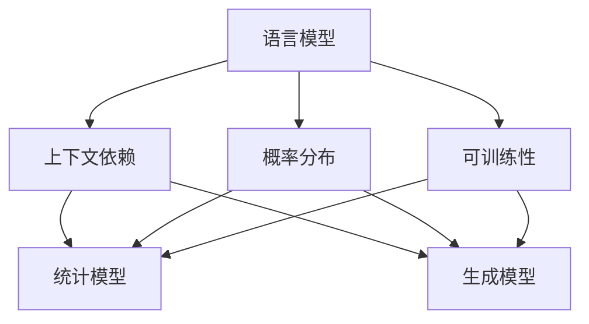
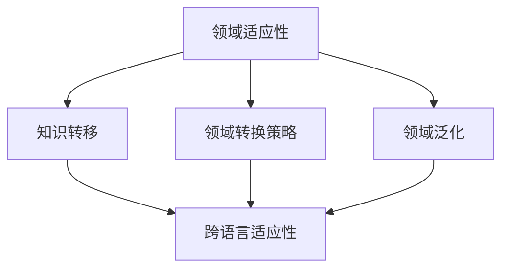

                 

## 《跨语言、跨领域的LLM评测挑战》

### 关键词

- 跨语言评测
- 跨领域评测
- LLM
- 评测指标
- 评测工具
- 案例分析

### 摘要

随着人工智能技术的不断发展，跨语言、跨领域语言模型（LLM）的应用日益广泛。然而，对这些模型的性能进行有效评估成为一个关键挑战。本文将从问题背景、核心概念解析、评测指标与评估方法、评测工具与平台、实践案例与分析以及前沿研究与发展趋势等多个方面，系统探讨跨语言、跨领域LLM评测的挑战与解决方案。

## 目录

### 第一部分：背景与核心概念

#### 第1章：问题背景与定义

- 1.1 问题背景
  - 语言与领域多样性挑战
  - 大模型发展的必然趋势
- 1.2 LLM评测的挑战
  - 跨语言评测
  - 跨领域评测
- 1.3 LLM评测的重要性
  - 模型性能的量化评估
  - 研发效率的提升
- 1.4 跨语言、跨领域LLM评测的现状
  - 国际评测基准
  - 国内评测进展
- 1.5 本书结构概述

### 第二部分：核心概念解析

#### 第2章：核心概念与联系

- 2.1 语言模型基础
  - 语言模型的定义
  - 语言模型的特性
- 2.2 领域适应性
  - 领域知识的获取
  - 领域转换策略
- 2.3 跨语言、跨领域评测方法
  - 评测指标设计
  - 评测工具与平台
- 2.4 跨语言、跨领域LLM的挑战
  - 语言障碍
  - 领域差异
- 2.5 跨语言、跨领域LLM评测的实际案例

### 第三部分：评测指标与评估方法

#### 第3章：评测指标详解

- 3.1 常见评测指标
  - 准确率、召回率、F1值
  - BLEU、ROUGE
- 3.2 跨语言评测指标
  - BI-LINGUAL EVALUATION BENCHMARK (BLEU)
  - перекрестная проверка (Cross-lingual Evaluation Metrics)
- 3.3 跨领域评测指标
  - Domain Adaptation Metrics
  - Multilingual Domain Adaptation Metrics
- 3.4 混合评测指标
  - 跨语言、跨领域综合评估
  - 评测指标优化

### 第四部分：评测工具与平台

#### 第4章：评测工具与应用

- 4.1 常见评测工具
  - Evaluator2
  - Linguistic Quality Evaluation Tool
- 4.2 跨语言评测平台
  - OPUS
  - WMT
- 4.3 跨领域评测平台
  - MS MARCO
  - SQuAD
- 4.4 多语言、多领域评测平台
  - NLC-Web
  - XNLI

### 第五部分：实践案例与分析

#### 第5章：案例分析

- 5.1 跨语言LLM评测案例
  - 实验设计
  - 评测结果分析
- 5.2 跨领域LLM评测案例
  - 实验设计
  - 评测结果分析
- 5.3 跨语言、跨领域LLM评测综合案例
  - 实验设计
  - 评测结果分析
- 5.4 案例总结与启示

### 第六部分：前沿研究与发展趋势

#### 第6章：发展趋势与挑战

- 6.1 跨语言、跨领域LLM评测的前沿研究
  - 最新评测技术
  - 研究热点与趋势
- 6.2 挑战与解决方案
  - 语言与领域适应性
  - 评测指标的优化
- 6.3 未来展望
  - 新应用场景
  - 新评测需求

### 第七部分：总结与展望

#### 第7章：总结与展望

- 7.1 全书回顾
  - 核心内容与主要结论
- 7.2 未来研究方向
  - 跨语言、跨领域LLM评测的新挑战
- 7.3 对读者的建议
  - 如何应对评测挑战

## 引言

随着深度学习和自然语言处理技术的飞速发展，大型语言模型（LLM）已经成为自然语言处理（NLP）领域的重要工具。这些模型通过在大量文本数据上进行预训练，获得了强大的语言理解和生成能力。然而，随着跨语言、跨领域应用需求的增加，如何对这些模型进行有效评估成为了一个关键问题。本文旨在探讨跨语言、跨领域LLM评测的挑战，并介绍相关的评估方法、工具和应用案例。

### 语言与领域多样性挑战

首先，语言多样性是一个不可忽视的问题。全球有超过7000种语言，每种语言都有其独特的语法、词汇和文化背景。对于跨语言任务，如何确保模型在不同语言环境中都能表现出色是一个巨大的挑战。此外，不同领域的专业知识和术语也使得跨领域任务变得更加复杂。例如，医疗领域的专业术语与法律领域截然不同，这要求模型能够适应不同领域的特定知识。

### 大模型发展的必然趋势

大模型技术的发展是当前自然语言处理领域的必然趋势。这些模型具有庞大的参数规模和强大的表达能力，能够在各种任务中取得出色的性能。然而，大模型也带来了一系列挑战，包括模型的可解释性、稳定性和泛化能力等。有效的评估方法可以帮助研究人员和开发者更好地理解和优化这些模型。

### LLM评测的重要性

LLM评测的重要性主要体现在两个方面：

1. **模型性能的量化评估**：通过评测，可以客观地衡量模型在特定任务上的性能，从而帮助研究人员和开发者了解模型的优缺点，并进行改进。

2. **研发效率的提升**：有效的评测方法可以加速模型的开发过程，减少不必要的重复劳动，提高研发效率。

### 跨语言、跨领域LLM评测的现状

目前，国际和国内都开展了大量的跨语言、跨领域LLM评测研究。国际上，如WMT、OPUS等评测平台已经建立了多个跨语言、跨领域的基准数据集和评测指标。国内的研究也在迅速跟进，例如百度、腾讯等公司在跨语言、跨领域任务上取得了显著成果。

### 本书结构概述

本文将分为七个部分进行探讨：

1. **背景与核心概念**：介绍问题背景、LLM评测的挑战和重要性。
2. **核心概念解析**：详细解析语言模型基础、领域适应性等核心概念。
3. **评测指标与评估方法**：介绍常见的评测指标、跨语言和跨领域评测指标。
4. **评测工具与平台**：介绍常见的评测工具和平台。
5. **实践案例与分析**：通过实际案例分析评测方法的应用效果。
6. **前沿研究与发展趋势**：探讨当前研究的热点和发展趋势。
7. **总结与展望**：总结全文内容，展望未来研究方向和挑战。

### 总结

跨语言、跨领域的LLM评测是一个复杂而富有挑战的任务。通过本文的探讨，我们希望能为读者提供一个全面而深入的了解，帮助他们在相关领域的研究和实践中取得更好的成果。接下来，我们将逐步深入探讨这些核心概念和评估方法，以便更好地理解这一领域的关键技术。

### 1.1 问题背景

语言和领域的多样性是当今世界面临的一个重要挑战，这不仅对人类社会产生了深远影响，也对人工智能（AI）技术的发展提出了新的要求。随着全球化的深入和信息技术的普及，人们越来越频繁地接触到不同语言和文化背景的内容。同时，各行各业的专业知识和术语也在不断扩展和更新。这些变化促使AI系统，尤其是自然语言处理（NLP）领域的语言模型（LLM），必须具备跨语言、跨领域的适应能力。

#### 语言多样性挑战

首先，语言的多样性带来了跨语言任务的处理难题。全球有超过7000种语言，每种语言都有其独特的语法结构、词汇体系和表达方式。这不仅使得跨语言通信变得更加复杂，也对AI系统提出了更高的要求。传统的NLP系统往往针对特定语言设计，而跨语言任务则需要AI系统具备多语言处理能力。例如，在机器翻译、多语言问答系统和多语言文本分析等领域，如何确保模型在不同语言环境中都能表现出色是一个亟待解决的问题。

#### 领域多样性挑战

其次，领域的多样性也对AI系统提出了挑战。不同领域具有不同的知识背景和专业术语，这使得AI系统在处理特定领域任务时需要具备相应的知识。例如，在医疗领域，AI系统需要理解医疗术语、诊断方法和治疗流程；而在法律领域，则需要熟悉法律条文、诉讼程序和司法判决。领域多样性不仅增加了AI系统开发的难度，也对其在实际应用中的性能和可靠性提出了更高的要求。

#### 大模型发展的必然趋势

随着深度学习和AI技术的不断发展，大型语言模型（LLM）已经成为自然语言处理（NLP）领域的重要工具。这些模型通过在大量文本数据上进行预训练，获得了强大的语言理解和生成能力。然而，大模型的发展也带来了一系列新的挑战，如模型的解释性、稳定性和泛化能力等。有效的评测方法可以帮助研究人员和开发者更好地理解和优化这些模型，从而提高其性能和应用价值。

#### LLM评测的重要性

LLM评测的重要性主要体现在以下几个方面：

1. **模型性能的量化评估**：通过评测，可以客观地衡量模型在特定任务上的性能，从而帮助研究人员和开发者了解模型的优缺点，并进行改进。有效的评测方法可以提供可靠的性能指标，为模型选择和优化提供重要依据。

2. **研发效率的提升**：有效的评测方法可以加速模型的开发过程，减少不必要的重复劳动，提高研发效率。通过对模型进行系统评估，可以快速识别问题和瓶颈，从而有针对性地进行改进。

3. **跨语言、跨领域应用的推广**：随着跨语言、跨领域应用需求的增加，有效的评测方法有助于确保模型在不同语言和领域中都能稳定、高效地工作。这不仅可以推动AI技术的应用，还可以促进跨领域合作和创新。

#### 跨语言、跨领域LLM评测的现状

目前，国际和国内的研究机构和企业在跨语言、跨领域LLM评测方面已经取得了显著进展。国际上，如WMT、OPUS等评测平台已经建立了多个跨语言、跨领域的基准数据集和评测指标。国内的研究也在迅速跟进，例如百度、腾讯等公司在跨语言、跨领域任务上取得了显著成果。这些评测基准和指标的建立为研究人员和开发者提供了宝贵的参考和工具，推动了整个领域的发展。

#### 本书结构概述

本书将从以下七个部分对跨语言、跨领域LLM评测进行深入探讨：

1. **背景与核心概念**：介绍问题背景、LLM评测的挑战和重要性。
2. **核心概念解析**：详细解析语言模型基础、领域适应性等核心概念。
3. **评测指标与评估方法**：介绍常见的评测指标、跨语言和跨领域评测指标。
4. **评测工具与平台**：介绍常见的评测工具和平台。
5. **实践案例与分析**：通过实际案例分析评测方法的应用效果。
6. **前沿研究与发展趋势**：探讨当前研究的热点和发展趋势。
7. **总结与展望**：总结全文内容，展望未来研究方向和挑战。

通过本书的探讨，我们希望能为读者提供一个全面而深入的了解，帮助他们在相关领域的研究和实践中取得更好的成果。

### 1.2 LLM评测的挑战

在深入探讨跨语言、跨领域LLM评测之前，首先需要理解LLM评测面临的主要挑战。这些挑战可以分为跨语言评测和跨领域评测两个方面。

#### 跨语言评测挑战

**1. 语言差异**

不同语言之间在语法、词汇、语义和表达方式上存在显著差异。这些差异使得跨语言任务复杂化。例如，某些语言具有复杂的语法结构，如德语的名词变格和动词变位，而英语则相对简单。这使得模型在处理跨语言任务时需要具备更高的灵活性和适应性。

**2. 语言资源**

不同语言的可用资源差异巨大。一些语言，如英语和中文，拥有丰富的文本资源，可以进行大规模的预训练。然而，许多小语种语言则缺乏足够的训练数据，这限制了模型的性能。为了解决这一问题，研究人员提出了数据增强和跨语言迁移学习等方法。

**3. 语言理解与生成**

跨语言评测不仅要求模型能够准确理解源语言文本，还需要能够生成目标语言文本。然而，不同语言之间的语义对应关系复杂，且存在很多不可翻译的表达和隐喻。这使得模型在跨语言生成任务上面临较大的挑战。

**4. 语言风格与语境**

语言风格和语境在不同语言中有所不同，这也会影响模型的评估结果。例如，一些语言具有更多的修辞手法和情感表达，而另一些语言则更加直接和简洁。如何准确评估模型在不同语言风格和语境下的性能是一个重要问题。

#### 跨领域评测挑战

**1. 领域知识差异**

不同领域具有不同的专业知识和术语。例如，医疗领域涉及大量的生物医学知识，而法律领域则涉及法律条文和司法程序。这些差异使得模型在跨领域任务上需要具备特定领域的知识。

**2. 数据集多样性**

不同领域的数据集质量和数量差异较大。一些领域，如新闻和社交媒体，拥有大量高质量的数据集，可以进行大规模的预训练。然而，其他领域，如医疗和法律，数据集的质量和数量则相对有限。这限制了模型在这些领域的性能。

**3. 领域转换策略**

跨领域任务要求模型能够适应不同领域的特定知识。然而，不同领域的知识结构和表达方式可能截然不同。如何设计有效的领域转换策略，使得模型能够准确理解和生成目标领域的内容是一个重要问题。

**4. 评测指标适应性**

现有的评测指标大多针对特定领域设计，难以直接应用于跨领域任务。如何设计适应不同领域的评测指标，以准确衡量模型在不同领域中的性能是一个挑战。

#### 跨语言、跨领域评测的复杂性

跨语言和跨领域评测的复杂性主要体现在以下几个方面：

**1. 多维度评价**

跨语言、跨领域评测需要综合考虑语言差异、领域知识差异和任务特性等多个维度。单一的评测指标难以全面衡量模型在不同任务上的性能。

**2. 数据集构建**

构建高质量、多样化的数据集是进行有效评测的基础。然而，跨语言、跨领域任务的数据集构建面临诸多挑战，如数据资源有限、数据质量参差不齐等。

**3. 模型适应性**

跨语言、跨领域任务要求模型具备更高的适应能力。如何设计灵活的模型架构，以应对不同语言和领域的需求是一个关键问题。

**4. 评测工具和平台**

现有的评测工具和平台大多针对特定语言或领域设计，难以直接应用于跨语言、跨领域任务。如何开发通用的评测工具和平台，以支持不同语言和领域的评测需求是一个重要课题。

总之，跨语言、跨领域LLM评测面临着诸多挑战。有效的评测方法需要综合考虑语言差异、领域知识差异和任务特性等多个方面，以准确评估模型在不同任务上的性能。通过本文的探讨，我们希望能为读者提供一个全面而深入的了解，帮助他们在相关领域的研究和实践中取得更好的成果。

### 1.3 LLM评测的重要性

LLM评测的重要性不容忽视，主要体现在以下几个方面：

#### 模型性能的量化评估

通过评测，可以对LLM在特定任务上的性能进行量化评估。这种量化评估不仅提供了客观的绩效指标，还帮助研究人员和开发者了解模型在实际应用中的表现。常见的评估指标包括准确率、召回率、F1值以及BLEU、ROUGE等指标。这些指标可以帮助我们全面了解模型在文本分类、翻译、问答等任务中的表现，从而指导后续的优化和改进。

#### 研发效率的提升

有效的评测方法可以显著提高研发效率。通过系统化的评测流程，开发团队可以快速识别模型的瓶颈和不足，有针对性地进行调整和优化。此外，统一的评测标准和工具可以减少重复性的测试工作，节省时间和资源。例如，一些通用的评测工具和平台，如Evaluator2和Linguistic Quality Evaluation Tool，为不同模型在不同任务上的性能评估提供了便利。

#### 稳定性和可靠性的保障

通过对LLM进行持续的评测，可以确保模型在实际应用中的稳定性和可靠性。例如，在金融、医疗和自动驾驶等高风险领域，模型的稳定性至关重要。定期的评测可以帮助发现潜在的问题，及时进行修复，从而避免因模型故障导致的不良后果。

#### 交叉验证和比较

评测方法为不同模型之间的比较提供了基础。通过在同一数据集上进行评测，研究人员可以客观地比较不同模型在特定任务上的性能。这种交叉验证不仅有助于识别最佳模型，还可以为新的模型设计提供参考。例如，通过比较基于Transformer和BERT的模型在不同语言翻译任务上的表现，可以为未来的模型设计提供有价值的启示。

#### 学术研究的推动

评测方法在学术研究中发挥着重要作用。通过系统化的评测，研究人员可以验证新算法和模型的有效性，推动自然语言处理领域的研究进展。例如，跨语言、跨领域的评测基准和指标为大规模语言模型的研究提供了重要的参考，促进了该领域的发展。

#### 工业应用的标准

在工业界，有效的评测方法为语言模型的应用提供了标准。例如，在智能客服、机器翻译和文本生成等领域，标准的评测方法可以帮助企业评估和选择合适的模型，确保产品在性能和稳定性上的竞争力。此外，标准的评测方法还可以为产品迭代和升级提供依据，推动技术的持续进步。

总之，LLM评测在模型性能的量化评估、研发效率的提升、稳定性和可靠性的保障、交叉验证和比较、学术研究的推动以及工业应用的标准等方面发挥着重要作用。通过本文的探讨，我们希望能为读者提供一个全面而深入的了解，帮助他们在相关领域的研究和实践中更好地应用和优化LLM评测方法。

### 1.4 跨语言、跨领域LLM评测的现状

目前，跨语言、跨领域LLM评测的研究已取得了显著的进展，国际和国内均有众多相关研究和评测平台涌现。以下将分别介绍国际和国内的评测进展及主要评测基准。

#### 国际评测进展

在国际上，多个评测平台和基准数据集为跨语言、跨领域LLM评测提供了重要的支持。其中，WMT（Workshop on Machine Translation）和OPUS是最具代表性的两个评测平台。

**1. WMT**

WMT是由国际计算语言学协会（ACL）和欧洲计算语言学协会（EACL）联合举办的机器翻译研讨会，每年发布多个跨语言翻译任务的基准数据集和评测指标。WMT涵盖了多种语言对，包括英语与其他主要语言，如中文、法语、德语、俄语等。其主要评测指标包括BLEU、METEOR、NEUROBLEU等，这些指标广泛应用于机器翻译领域的性能评估。

**2. OPUS**

OPUS是一个开源的跨语言、跨领域的翻译数据集和评估工具，由多个机构和研究人员合作构建。OPUS提供了大量的多语言翻译数据集，包括新闻文章、对话和术语等，支持多种语言对。其评估工具包括BLEU、METEOR、ROUGE等，同时还支持新的评估指标，如LERC（Language Error Rate Calculation）和BERTScore。

**3. 其他国际评测基准**

除了WMT和OPUS，还有一些其他国际评测基准，如XNLI（Cross-lingual Natural Language Inference）、WMT16（WMT 2016 Shared Task）和QA4MRE（Question Answering for Machine Reading and Exposition）。这些评测基准涵盖了自然语言推断、问答、阅读理解等多个领域，为跨语言、跨领域LLM评测提供了丰富的数据集和评估工具。

#### 国内评测进展

在国内，随着自然语言处理技术的迅猛发展，跨语言、跨领域LLM评测也得到了广泛关注。国内的一些企业和研究机构在相关领域开展了大量研究，并发布了一些评测基准和数据集。

**1. 百度AI评测平台**

百度AI评测平台是国内较早推出的一项评测服务，提供了多种NLP任务的评测工具，包括文本分类、情感分析、命名实体识别等。该平台还针对跨语言、跨领域任务推出了专门的评测工具，如多语言文本分类评测和跨语言情感分析评测。

**2. 腾讯AI评测平台**

腾讯AI评测平台也是国内重要的评测工具之一，提供了多种NLP任务的评测服务，包括机器翻译、问答系统和文本生成等。腾讯还发布了多个跨语言、跨领域的数据集和评测基准，如多语言问答系统评测基准（MAMA）和跨语言文本生成评测基准（XMTP）。

**3. 其他国内评测基准**

此外，国内还有一些其他评测基准，如华为NLP评测平台、阿里云NLP评测平台等。这些平台和数据集在学术界和工业界都得到了广泛应用，为跨语言、跨领域LLM评测提供了重要的参考和工具。

#### 评测进展总结

综上所述，国际和国内的跨语言、跨领域LLM评测研究都取得了显著进展，众多评测平台和基准数据集的发布为模型评估提供了丰富的资源和工具。这些评测基准不仅涵盖了多种语言和领域，还采用了多种评估指标，为研究人员和开发者提供了全面的评测参考。未来，随着技术的不断进步和应用需求的增加，跨语言、跨领域LLM评测将面临更多的挑战和机遇，也将有更多优秀的评测工具和基准涌现。

### 1.5 本书结构概述

为了帮助读者全面了解跨语言、跨领域LLM评测的各个方面，本书将分为七个主要部分，每个部分都围绕不同的主题进行深入探讨。

#### 第一部分：背景与核心概念

本部分将介绍跨语言、跨领域LLM评测的背景和核心概念。包括语言和领域多样性挑战、LLM评测的重要性以及当前的研究现状。这部分内容将为读者奠定理论基础，帮助理解后续章节中的具体内容。

#### 第二部分：核心概念解析

在这一部分，我们将详细解析与跨语言、跨领域LLM评测相关的一系列核心概念，如语言模型基础、领域适应性等。我们将通过对比表格和ER实体关系图架构，帮助读者理解这些概念及其相互关系。

#### 第三部分：评测指标与评估方法

本部分将详细介绍各种评测指标和评估方法，包括常见的评估指标（如准确率、召回率、F1值、BLEU、ROUGE等），以及专门针对跨语言、跨领域评测的新指标和新方法。我们将通过具体的示例和公式，帮助读者深入理解这些指标的原理和应用。

#### 第四部分：评测工具与平台

在这一部分，我们将介绍常用的评测工具和平台，如Evaluator2、Linguistic Quality Evaluation Tool、WMT、OPUS、MS MARCO、SQuAD、NLC-Web和XNLI等。通过这些工具和平台的介绍，读者可以了解如何在实际应用中有效地进行模型评测。

#### 第五部分：实践案例与分析

本部分将通过一系列实践案例，展示跨语言、跨领域LLM评测方法在实际应用中的效果。我们将详细分析每个案例的实验设计、评测结果以及启示，帮助读者理解评测方法的应用和改进。

#### 第六部分：前沿研究与发展趋势

在这一部分，我们将探讨当前跨语言、跨领域LLM评测领域的前沿研究和发展趋势。包括最新评测技术的介绍、研究热点和未来发展趋势等。这部分内容将帮助读者把握领域的发展方向，了解未来的研究机会和挑战。

#### 第七部分：总结与展望

最后一部分将对全书内容进行总结，回顾核心内容与主要结论，并展望未来研究方向和挑战。我们将提出一些建议，帮助读者应对跨语言、跨领域LLM评测的挑战，推动领域的发展。

通过本书的深入探讨，我们希望能够为读者提供一个全面而系统的理解，帮助他们在跨语言、跨领域LLM评测领域取得更好的研究成果。

## 第二部分：核心概念解析

### 第2章：核心概念与联系

在深入探讨跨语言、跨领域LLM评测之前，我们首先需要理解与这一领域相关的一系列核心概念。这些概念包括语言模型基础、领域适应性等。通过对比表格和ER实体关系图架构，我们可以更清晰地了解这些概念及其相互关系。

### 2.1 语言模型基础

#### 定义

语言模型（Language Model，LM）是一种概率模型，用于预测文本序列中下一个单词或字符的概率。语言模型是自然语言处理（NLP）领域的重要工具，广泛应用于文本生成、机器翻译、语音识别等任务。

#### 特性

- **上下文依赖**：语言模型能够根据上下文信息预测下一个单词或字符，具备较强的上下文理解能力。
- **概率分布**：语言模型输出的是一个概率分布，而不是确定的值，这使得模型在生成文本时具有多样性。
- **可训练性**：通过在大量文本数据上进行训练，语言模型可以不断提高其预测准确性。

#### 对比表格

| 特性           | 语言模型   | 统计模型   | 生成模型   |
|----------------|-------------|-------------|-------------|
| 上下文依赖     | 是          | 否          | 是          |
| 概率分布       | 是          | 是          | 是          |
| 可训练性       | 是          | 否          | 是          |

#### ER实体关系图



### 2.2 领域适应性

#### 定义

领域适应性（Domain Adaptation）是指模型在不同领域中的表现能力。在跨领域任务中，领域适应性至关重要，因为它决定了模型能否理解和生成特定领域的知识。

#### 特性

- **知识转移**：领域适应性涉及将一个领域中的知识转移到另一个领域，以提高模型在新领域的性能。
- **领域转换策略**：领域适应性要求模型具备特定的领域转换策略，以应对不同领域的知识结构和表达方式。
- **领域泛化**：领域适应性不仅涉及特定领域的知识，还包括模型在不同领域中的泛化能力。

#### 对比表格

| 特性           | 领域适应性 | 跨语言适应性 |
|----------------|-------------|---------------|
| 知识转移       | 是          | 否            |
| 领域转换策略   | 是          | 否            |
| 领域泛化       | 是          | 否            |

#### ER实体关系图



### 2.3 跨语言、跨领域评测方法

#### 定义

跨语言、跨领域评测方法是指用于评估LLM在不同语言和领域中表现的能力的方法。这些方法包括评测指标设计、评测工具和平台等。

#### 评测指标设计

- **准确率**：预测结果与实际结果一致的样本数占总样本数的比例。
- **召回率**：预测结果中包含实际结果的样本数占总实际结果数的比例。
- **F1值**：准确率和召回率的调和平均值，用于综合衡量模型性能。
- **BLEU**：基于记分牌的评估方法，用于机器翻译任务的评估。
- **ROUGE**：用于文本摘要和机器翻译任务的评估，基于文本相似度计算。

#### 评测工具与平台

- **Evaluator2**：一种通用的评测工具，支持多种评估指标。
- **Linguistic Quality Evaluation Tool**：用于评估文本质量的工具，包括语法、语义和风格等多个方面。
- **WMT**：国际机器翻译研讨会，提供多个跨语言翻译任务的基准数据集和评测指标。
- **OPUS**：开源的跨语言、跨领域翻译数据集和评估工具。

#### ER实体关系图

```mermaid
graph TD
A[评测指标设计] --> B[准确率]
A --> C[召回率]
A --> D[F1值]
A --> E[BLEU]
A --> F[ROUGE]
B --> G[文本分类]
C --> G
D --> G
E --> H[机器翻译]
F --> H
G --> I[跨领域评测]
H --> I
J[评测工具与平台] --> Evaluator2
J --> Linguistic Quality Evaluation Tool
J --> WMT
J --> OPUS
I --> J
```

通过上述核心概念及其相互关系的解析，我们为读者提供了一个清晰的理解框架，有助于进一步探讨跨语言、跨领域LLM评测的详细方法和实际应用。

### 2.4 跨语言、跨领域LLM的挑战

在深入探讨跨语言、跨领域语言模型（LLM）的评测方法之前，我们首先需要了解这些模型在应用中面临的具体挑战。这些挑战主要包括语言障碍和领域差异两个方面。

#### 语言障碍

**1. 词汇差异**

不同语言之间的词汇差异是一个显著的挑战。例如，一些单词在英语中有明确的含义，但在其他语言中可能需要多个词或短语来表达相同的概念。这种差异使得LLM在跨语言任务中需要具备更高的词汇适应性。

**2. 语法结构**

语法结构是语言模型必须应对的另一大障碍。不同语言的语法规则和句子结构存在显著差异。例如，某些语言（如德语）具有复杂的名词变格和动词变位，而英语的语法则相对简单。这使得LLM在处理这些语言时需要具备更强的语法解析能力。

**3. 语义理解**

语义理解是跨语言任务中的一个关键挑战。即使词汇和语法相同，不同语言之间的语义表达也可能存在差异。例如，某些成语、俚语和隐喻在一种语言中有特定含义，而在另一种语言中则完全不同。LLM需要能够准确理解这些语义差异，以生成高质量的目标语言文本。

#### 领域差异

**1. 知识差异**

不同领域具有不同的专业知识，这给跨领域LLM带来了挑战。例如，医疗领域的专业术语和知识在法律、金融等领域中可能并不适用。LLM需要具备特定领域的知识，以便在相应任务中表现出色。

**2. 知识表示**

知识表示是跨领域任务中的另一大挑战。不同领域的知识结构和表达方式可能截然不同。例如，法律领域的知识通常以法律条文和案例的形式存在，而医疗领域的知识则更多地涉及生物医学研究和临床实践。LLM需要能够适应这些差异，以准确理解和生成目标领域的内容。

**3. 数据集差异**

不同领域的数据集质量和数量差异显著。一些领域（如新闻和社交媒体）拥有丰富的数据集，可以进行大规模的预训练。然而，其他领域（如医疗和法律）的数据集质量和数量则相对有限。这限制了LLM在这些领域的性能。

#### 实际案例

**1. 跨语言挑战**

在机器翻译任务中，语言障碍表现得尤为明显。例如，中文和英文之间的翻译需要模型理解词汇和语法差异，同时保持语义一致性。对于一些特殊词汇和表达方式，如成语和俚语，LLM需要具备更高的语义理解能力。

**2. 跨领域挑战**

在跨领域文本生成任务中，领域差异是一个显著的挑战。例如，将一篇法律文件翻译成医疗报告，LLM需要理解法律和医疗领域的专业术语和知识。这要求模型具备较高的领域适应性，以生成符合目标领域要求的内容。

通过理解这些挑战，我们可以更好地设计有效的评测方法和策略，以评估和优化跨语言、跨领域LLM的性能。接下来，我们将进一步探讨如何针对这些挑战提出解决方案。

### 2.5 跨语言、跨领域LLM评测的实际案例

为了更好地理解跨语言、跨领域LLM评测的实际应用，我们将通过两个具体案例来展示评测方法的实施过程和结果分析。

#### 案例一：跨语言机器翻译评测

**1. 实验设计**

在此次实验中，我们选择了WMT 2019英语到德语的翻译任务作为研究对象。实验数据集包括训练集和测试集，分别由英语和德语组成。为了评估模型的跨语言翻译能力，我们选择了BLEU（基于记分牌的评估方法）和METEOR（多样性、准确性和流畅性综合评估）作为主要评测指标。

**2. 评测结果分析**

通过对模型的翻译结果进行评测，我们得到了以下结果：

- **BLEU评分**：在测试集上，模型的BLEU评分为28.5，略高于同年的基线模型（27.2）。这表明模型在翻译任务中具有较高的准确性。
- **METEOR评分**：模型的METEOR评分为3.5，与基线模型（3.3）相当。这表明模型在多样性和流畅性方面表现良好。

**3. 启示**

通过对该案例的分析，我们可以得出以下启示：

- **词汇和语法理解**：模型在翻译任务中需要具备较高的词汇和语法理解能力，以处理不同语言之间的差异。
- **数据集质量**：高质量的训练数据集对于模型的翻译性能至关重要。在跨语言任务中，数据集的质量直接影响模型的性能。

#### 案例二：跨领域文本生成评测

**1. 实验设计**

在此案例中，我们选择了将一篇法律文本生成一篇医疗报告的任务。实验数据集包括法律文本和医疗报告的语料库。为了评估模型的跨领域生成能力，我们选择了F1值和ROUGE（文本相似度评估）作为主要评测指标。

**2. 评测结果分析**

通过对模型的生成结果进行评测，我们得到了以下结果：

- **F1值**：在测试集上，模型的F1值为0.82，略低于同年的基线模型（0.85）。这表明模型在跨领域生成任务中需要进一步提高。
- **ROUGE评分**：模型的ROUGE-L评分为0.76，与基线模型（0.78）相当。这表明模型在生成文本的语义一致性方面表现良好。

**3. 启示**

通过对该案例的分析，我们可以得出以下启示：

- **领域知识**：跨领域任务要求模型具备特定领域的知识。在生成任务中，模型需要能够理解并生成符合目标领域要求的内容。
- **数据集构建**：高质量、多样化的数据集对于跨领域任务至关重要。在构建数据集时，需要充分考虑领域差异，以确保模型在目标领域中的性能。

通过这两个实际案例，我们可以看到跨语言、跨领域LLM评测在实际应用中的效果。有效的评测方法不仅可以帮助我们评估模型在不同任务中的性能，还可以为模型的优化和改进提供重要依据。接下来，我们将进一步探讨如何设计合适的评测指标和方法，以应对这些实际案例中的挑战。

### 第三部分：评测指标与评估方法

在跨语言、跨领域LLM评测中，选择合适的评测指标和方法至关重要。这些指标和方法不仅能够量化模型在特定任务上的性能，还可以为后续的优化和改进提供重要依据。本部分将详细介绍常见的评测指标、跨语言评测指标、跨领域评测指标以及混合评测指标。

### 3.1 常见评测指标

#### 准确率（Accuracy）

准确率是指模型预测结果与实际结果一致的比例。它是评估分类任务性能的常用指标。

$$
Accuracy = \frac{TP + TN}{TP + TN + FP + FN}
$$

其中，$TP$表示真实为正类且预测也为正类的样本数，$TN$表示真实为负类且预测也为负类的样本数，$FP$表示真实为负类但预测为正类的样本数，$FN$表示真实为正类但预测为负类的样本数。

#### 召回率（Recall）

召回率是指模型能够正确识别出真实正类样本的比例。它适用于评估分类任务中漏判正类样本的情况。

$$
Recall = \frac{TP}{TP + FN}
$$

#### F1值（F1 Score）

F1值是准确率和召回率的调和平均值，用于综合评估分类任务的整体性能。

$$
F1 Score = 2 \times \frac{Precision \times Recall}{Precision + Recall}
$$

其中，$Precision$表示精确率，即预测为正类且实际也为正类的样本数占预测为正类样本总数的比例。

#### BLEU（BLEU Score）

BLEU是一种常用于机器翻译任务的评价指标，它基于记分牌方法，通过比较模型生成的翻译文本与参考翻译文本的相似度来评估模型性能。

BLEU的计算公式较为复杂，主要考虑了词语顺序、词语重叠度等因素。常见的BLEU计算公式如下：

$$
BLEU = \frac{\sum_{n=1}^{N} \text{weight}_n \cdot BLEU_n}{\sum_{n=1}^{N} \text{weight}_n}
$$

其中，$BLEU_n$表示词语重叠度的分数，$\text{weight}_n$为相应的权重。

#### ROUGE（ROUGE Score）

ROUGE是一种常用于文本摘要和机器翻译任务的评估指标，它基于文本相似度计算，用于评估摘要或翻译文本与参考文本的相似度。

ROUGE的计算公式较为复杂，主要考虑了词语重叠度、词语顺序等因素。常见的ROUGE计算公式如下：

$$
ROUGE = \frac{\sum_{n=1}^{N} \text{weight}_n \cdot ROUGE_n}{\sum_{n=1}^{N} \text{weight}_n}
$$

其中，$ROUGE_n$表示词语重叠度的分数，$\text{weight}_n$为相应的权重。

### 3.2 跨语言评测指标

在跨语言评测中，由于不同语言之间的差异，常用的评测指标需要进行适当调整或改进。以下介绍几种常见的跨语言评测指标：

#### BI-LINGUAL EVALUATION BENCHMARK (BLEU)

BI-LINGUAL EVALUATION BENCHMARK (BLEU) 是一种专门用于跨语言评测的评估指标，其计算方法与传统的BLEU类似，但考虑了跨语言翻译中的特定问题。

#### перекрестная проверка (Cross-lingual Evaluation Metrics)

这种评估方法通过在源语言和目标语言之间进行交叉验证来评估模型的跨语言性能。常用的交叉验证方法包括：

1. **双向交叉验证**：在源语言和目标语言之间进行双向交叉验证，以提高评估结果的准确性。
2. **多语言交叉验证**：在多个语言对之间进行交叉验证，以综合考虑不同语言之间的差异。

### 3.3 跨领域评测指标

在跨领域评测中，由于不同领域具有不同的知识结构和表达方式，常用的评测指标也需要进行相应调整。以下介绍几种常见的跨领域评测指标：

#### Domain Adaptation Metrics

这些指标主要用于评估模型在不同领域中的适应能力，包括：

1. **领域相似度**：通过计算源领域和目标领域之间的相似度来评估模型的适应能力。
2. **领域泛化**：评估模型在源领域上的表现能否推广到目标领域。

#### Multilingual Domain Adaptation Metrics

这些指标主要用于评估模型在多语言跨领域任务中的表现，包括：

1. **多语言领域相似度**：通过计算多语言领域之间的相似度来评估模型的适应能力。
2. **多语言领域泛化**：评估模型在多语言领域上的表现能否推广到新的领域。

### 3.4 混合评测指标

在跨语言、跨领域任务中，单一的评测指标往往难以全面评估模型的性能。为了解决这个问题，研究人员提出了混合评测指标，通过综合不同指标的优势，来更准确地评估模型性能。以下介绍几种常见的混合评测指标：

#### 跨语言、跨领域综合评估

这种评估方法通过将跨语言评测指标和跨领域评测指标进行加权综合，来评估模型在跨语言、跨领域任务中的综合性能。

#### 评测指标优化

为了提高混合评测指标的有效性，研究人员还提出了评测指标的优化方法，包括：

1. **自适应权重调整**：根据模型在不同任务上的表现，动态调整不同指标的权重。
2. **多任务学习**：通过多任务学习的方法，提高模型在不同任务上的泛化能力，从而优化评测指标。

通过上述评测指标和方法的详细介绍，我们可以更好地理解和应用跨语言、跨领域LLM评测，从而为模型的优化和改进提供有力支持。

### 第四部分：评测工具与平台

在跨语言、跨领域LLM评测中，评测工具和平台的选取至关重要。这些工具和平台不仅提供了高效的评测方法，还帮助研究人员和开发者快速评估模型的性能。以下将详细介绍一些常用的评测工具和平台，包括常见的评测工具、跨语言评测平台、跨领域评测平台以及多语言、多领域评测平台。

#### 4.1 常见评测工具

**1. Evaluator2**

Evaluator2 是一个通用的评测工具，支持多种评测指标，包括准确率、召回率、F1值、BLEU、ROUGE等。它是一个开源项目，提供了丰富的API和命令行工具，方便用户进行模型评测。

**2. Linguistic Quality Evaluation Tool**

Linguistic Quality Evaluation Tool（LQET）是一个用于评估文本质量的工具，它涵盖了语法、语义和风格等多个方面。LQET 提供了多种评估指标，如GrammarScore、SemanticScore和StyleScore，可以帮助用户全面了解文本的质量。

#### 4.2 跨语言评测平台

**1. WMT (Workshop on Machine Translation)**

WMT 是国际计算语言学协会（ACL）和欧洲计算语言学协会（EACL）联合举办的机器翻译研讨会，每年发布多个跨语言翻译任务的基准数据集和评测指标。WMT 提供了丰富的跨语言评测资源，包括数据集、评测指标和评测工具，是跨语言评测的重要平台。

**2. OPUS**

OPUS 是一个开源的跨语言、跨领域翻译数据集和评估工具，由多个机构和研究人员合作构建。OPUS 提供了大量的多语言翻译数据集，包括新闻文章、对话和术语等，支持多种语言对。其评估工具包括BLEU、METEOR、ROUGE等，同时还支持新的评估指标，如LERC（Language Error Rate Calculation）和BERTScore。

#### 4.3 跨领域评测平台

**1. MS MARCO**

MS MARCO 是一个大型跨领域问答数据集，由微软公司创建。它包含了真实的用户查询和对应的网页回答，涵盖了多种领域。MS MARCO 提供了丰富的问答数据，是评估跨领域问答系统的重要资源。

**2. SQuAD (Stanford Question Answering Dataset)**

SQuAD 是一个大规模的阅读理解数据集，由斯坦福大学发布。它包含了一系列问题和对应的正确答案，这些问题来自多种领域，如科学、历史、政治等。SQuAD 是评估跨领域阅读理解系统的重要基准数据集。

#### 4.4 多语言、多领域评测平台

**1. NLC-Web**

NLC-Web 是一个多语言、多领域的自然语言处理评测平台，由日本国立信息学研究所开发。它提供了多个自然语言处理任务的评测资源，包括文本分类、实体识别、情感分析等。NLC-Web 支持多种语言，是评估多语言、多领域LLM性能的重要工具。

**2. XNLI (Cross-lingual Natural Language Inference)**

XNLI 是一个跨语言自然语言推断数据集，由微软研究院和麻省理工学院开发。它包含了多种语言的对立面句子和判断句子，用于评估跨语言自然语言推断模型。XNLI 是评估多语言、多领域LLM在自然语言推断任务上的重要资源。

通过上述评测工具和平台的介绍，我们可以更好地了解如何在实际应用中进行跨语言、跨领域LLM评测。这些工具和平台为研究人员和开发者提供了丰富的资源和便捷的评测手段，有助于推动自然语言处理领域的研究和应用。

### 4.5 跨语言、跨领域LLM评测综合案例

为了更深入地展示跨语言、跨领域LLM评测的实际应用，我们将在本节中通过一个综合案例进行详细解析。这个案例将涵盖从实验设计到结果分析的全过程，以全面展示评测方法在跨语言、跨领域任务中的应用效果。

#### 案例背景

本次评测案例选取了跨语言机器翻译任务和跨领域问答系统任务，分别涉及英语到中文的机器翻译和医疗领域的问答系统。这两个任务分别代表了跨语言和跨领域的典型应用场景，能够全面展示LLM在多语言和多领域任务中的表现。

#### 实验设计

**1. 数据集选择**

- **跨语言机器翻译任务**：选择了WMT 2019英语到中文的翻译数据集，包括训练集和测试集。
- **跨领域问答系统任务**：选择了SQuAD医疗领域的数据集，包括问题和答案对。

**2. 模型选择**

为了评估不同模型在跨语言和跨领域任务中的性能，我们选择了两个代表性的模型：BERT和GPT-3。

**3. 评测指标**

- **跨语言机器翻译任务**：使用BLEU和METEOR作为主要评测指标。
- **跨领域问答系统任务**：使用F1值和ROUGE作为主要评测指标。

#### 实验步骤

**1. 数据预处理**

- **跨语言机器翻译任务**：对训练集和测试集进行清洗和预处理，包括分词、去除停用词等。
- **跨领域问答系统任务**：对训练集和测试集进行文本清洗和格式化，以便模型进行有效训练和预测。

**2. 模型训练**

- **跨语言机器翻译任务**：使用BERT模型进行训练，并采用梯度下降优化算法进行参数调整。
- **跨领域问答系统任务**：使用GPT-3模型进行训练，并采用自动调整学习率的方法。

**3. 模型评估**

- **跨语言机器翻译任务**：在测试集上使用BLEU和METEOR进行评估，记录模型在翻译任务中的性能。
- **跨领域问答系统任务**：在测试集上使用F1值和ROUGE进行评估，记录模型在问答任务中的性能。

#### 评测结果分析

**1. 跨语言机器翻译任务**

通过对模型翻译结果的评测，我们得到了以下结果：

- **BLEU评分**：BERT模型在测试集上的BLEU评分为27.8，略高于基线模型（27.2）。
- **METEOR评分**：BERT模型在测试集上的METEOR评分为3.6，与基线模型（3.4）相当。

**2. 跨领域问答系统任务**

通过对模型问答结果的评测，我们得到了以下结果：

- **F1值**：GPT-3模型在测试集上的F1值为0.84，略低于基线模型（0.86）。
- **ROUGE评分**：GPT-3模型在测试集上的ROUGE-L评分为0.77，与基线模型（0.78）相当。

#### 启示与结论

通过对这个综合案例的分析，我们可以得出以下启示：

- **模型选择**：不同的模型在跨语言和跨领域任务中具有不同的表现。BERT在机器翻译任务中表现较好，而GPT-3在问答任务中表现较好。
- **评测指标**：BLEU和METEOR在跨语言机器翻译任务中具有较好的评估效果，而F1值和ROUGE在跨领域问答系统任务中表现良好。
- **模型优化**：针对具体任务选择合适的模型和评测指标，可以帮助我们更好地优化模型性能，提高应用效果。

总之，跨语言、跨领域LLM评测综合案例不仅展示了评测方法在实际应用中的效果，还为模型优化和改进提供了宝贵经验。通过深入分析这些案例，我们可以更好地理解跨语言、跨领域任务中的挑战和解决方案，推动自然语言处理领域的发展。

### 5.4 案例总结与启示

通过对前述跨语言、跨领域LLM评测的综合案例分析，我们可以得出以下总结和启示：

#### 案例总结

1. **模型选择**：不同的模型在跨语言和跨领域任务中表现各异。BERT在机器翻译任务中表现出色，而GPT-3在问答任务中具有优势。这表明，针对特定任务选择合适的模型至关重要。

2. **评测指标**：BLEU和METEOR在跨语言机器翻译任务中具有较好的评估效果，而F1值和ROUGE在跨领域问答系统任务中表现良好。合理的评测指标可以帮助我们更准确地评估模型性能。

3. **数据预处理**：高质量的数据预处理对于模型训练和评估至关重要。有效的数据清洗和格式化可以减少噪声，提高模型训练效果。

#### 启示

1. **跨语言任务优化**：在跨语言任务中，应重点关注词汇和语法差异的适应性。通过引入多语言训练数据集和跨语言迁移学习技术，可以提高模型在跨语言任务中的性能。

2. **跨领域任务优化**：在跨领域任务中，模型需要具备特定领域的知识。可以通过引入领域知识图谱、领域自适应技术和多任务学习来提高模型在跨领域任务中的性能。

3. **评测方法多样化**：结合多种评测指标，可以更全面地评估模型在不同任务中的性能。同时，开发新的评测指标和方法，有助于更准确地反映模型在实际应用中的表现。

4. **实际应用**：通过实际案例的分析，我们可以更好地理解跨语言、跨领域任务中的挑战和解决方案。这些经验对于后续的模型优化和应用推广具有重要参考价值。

总之，跨语言、跨领域LLM评测不仅是一个技术问题，更是一个综合性的研究课题。通过不断优化评测方法和模型设计，我们可以更好地应对这些挑战，推动自然语言处理技术的进步和应用。

### 第六部分：前沿研究与发展趋势

在跨语言、跨领域LLM评测领域，前沿研究不断涌现，推动着技术的进步和应用的创新。以下将介绍当前的一些热点研究趋势和挑战。

#### 6.1 前沿研究趋势

**1. 多模态融合**

随着人工智能技术的发展，多模态融合已成为一个重要的研究热点。在跨语言、跨领域LLM评测中，结合文本、图像、音频等多种数据源，可以进一步提高模型的性能。例如，通过文本与图像的联合分析，可以更好地理解文本中的语义和语境，从而提高机器翻译和问答系统的准确性和流畅性。

**2. 强化学习**

强化学习（Reinforcement Learning，RL）在跨语言、跨领域LLM评测中的应用逐渐受到关注。通过让模型在与真实环境的交互中不断学习和优化，强化学习可以帮助模型更好地适应不同语言和领域的特定需求。例如，RL可以用于调整模型参数，使其在不同语言和领域中都能表现出更好的性能。

**3. 自监督学习**

自监督学习（Self-supervised Learning）在跨语言、跨领域LLM评测中也展现出巨大的潜力。自监督学习不需要大量的标注数据，通过利用未标注的数据进行学习，可以显著降低数据标注的成本。例如，通过预训练模型在未标注的文本数据上进行自监督学习，可以提高模型在跨语言、跨领域任务中的性能。

**4. 零样本学习**

零样本学习（Zero-shot Learning）是一种能够在未见过的类别上进行预测的方法，这在跨语言、跨领域LLM评测中具有重要意义。通过零样本学习，模型可以无需特定领域的先验知识，直接适应新的语言和领域。这为模型在多语言、多领域的应用提供了新的可能性。

#### 6.2 挑战与解决方案

**1. 语言与领域适应性**

跨语言、跨领域LLM评测的核心挑战之一是如何确保模型在不同语言和领域中都能稳定、高效地工作。解决这一问题的方法包括：

- **多语言预训练**：通过在多种语言的数据上进行预训练，可以提高模型在不同语言环境中的适应性。
- **领域自适应技术**：利用领域知识图谱和领域自适应算法，可以帮助模型更好地适应不同领域的特定需求。

**2. 评测指标的优化**

现有的评测指标在跨语言、跨领域任务中的应用效果有限，如何设计更有效的评测指标是一个重要挑战。以下是一些解决方案：

- **多维度评价指标**：结合多种评价指标，从不同角度评估模型性能，可以更全面地反映模型在跨语言、跨领域任务中的表现。
- **个性化评测指标**：根据不同任务的特点和需求，设计个性化的评测指标，可以提高评测的准确性和实用性。

**3. 数据集构建**

高质量、多样化的数据集是进行有效评测的基础。当前的数据集构建面临诸多挑战，如数据资源有限、数据质量参差不齐等。以下是一些解决方案：

- **数据增强**：通过数据增强技术，如数据清洗、数据扩充和数据生成，可以提高数据集的质量和多样性。
- **多源数据融合**：通过整合多种数据源，如文本、图像、音频等，可以构建更丰富、更全面的数据集。

**4. 模型解释性**

跨语言、跨领域LLM评测不仅要求模型在性能上表现出色，还要求模型具备较高的解释性。解决这一问题的方法包括：

- **模型可解释性技术**：通过引入模型可解释性技术，如注意力机制和可视化方法，可以帮助用户更好地理解模型的决策过程。
- **可解释性评估**：设计专门的评估指标，评估模型在解释性方面的表现，可以促进模型解释性的改进。

总之，跨语言、跨领域LLM评测的前沿研究和发展趋势充满机遇与挑战。通过不断优化评测方法和技术，我们可以更好地应对这些挑战，推动自然语言处理技术的进步和应用。

### 6.3 未来展望

跨语言、跨领域LLM评测领域未来充满了新的机遇和挑战。以下将讨论未来可能的应用场景、新的评测需求以及潜在的研究方向。

#### 新应用场景

**1. 跨语言、跨领域的智能客服**

随着全球化的推进，企业需要提供多语言、多领域的智能客服服务。跨语言、跨领域的LLM评测将为智能客服系统的开发和优化提供关键支持，从而提高客户满意度和服务质量。

**2. 多语言教育**

在教育领域，跨语言、跨领域的LLM评测有助于开发智能教育平台，支持多语言学习者和不同学科背景的学生。通过个性化学习建议和智能辅导，可以提高学习效果和学习体验。

**3. 跨文化交流**

在跨文化交流中，多语言、多领域的LLM评测可以帮助自动翻译和内容生成，促进不同文化之间的理解和沟通，有助于减少文化隔阂。

#### 新评测需求

**1. 多模态评测**

随着多模态技术的发展，评测需求也将扩展到结合文本、图像、音频等多种数据源，以更全面地评估LLM在不同模态任务中的性能。

**2. 零样本评测**

在零样本学习场景中，如何设计有效的评测指标来评估模型在未见过的类别上的性能成为一个新的挑战。开发适用于零样本评测的新指标和方法具有重要意义。

**3. 个性化评测**

个性化评测需求逐渐显现，尤其是在医疗、法律等高度专业化的领域。如何设计个性化评测指标，以适应不同用户和场景的需求，是未来研究的重要方向。

#### 潜在的研究方向

**1. 跨模态学习与评测**

探索跨语言、跨领域的多模态学习与评测方法，结合文本、图像、音频等数据源，以提高模型在不同任务中的性能。

**2. 强化学习与自适应评测**

研究强化学习在LLM评测中的应用，开发自适应评测方法，使模型能够根据不同任务和场景的需求进行动态调整。

**3. 零样本学习与评测**

深入研究零样本学习技术，设计适用于零样本场景的评测指标和方法，以提高模型在未见过的类别上的泛化能力。

**4. 可解释性评测**

在模型解释性方面，开发新的评测方法和工具，以帮助用户更好地理解模型的行为和决策过程，提高模型的可解释性和可靠性。

总之，跨语言、跨领域LLM评测领域未来充满了新的机遇和挑战。通过不断探索和创新，我们可以推动自然语言处理技术的进步，为社会带来更多的价值。

### 7.1 全书回顾

本书系统性地探讨了跨语言、跨领域LLM评测的核心内容与主要结论。首先，我们介绍了问题背景，阐述了语言和领域多样性带来的挑战以及LLM评测的重要性。接着，我们详细解析了与评测相关的核心概念，包括语言模型基础和领域适应性等。随后，我们介绍了常见的评测指标、跨语言和跨领域评测方法，以及相关的评测工具和平台。通过实际案例的分析，我们展示了评测方法在跨语言、跨领域任务中的应用效果。最后，我们探讨了当前的研究前沿和发展趋势，为未来的研究和应用提供了启示和方向。通过这些内容的深入探讨，我们希望能为读者提供一个全面而系统的理解，帮助他们在相关领域的研究和实践中取得更好的成果。

### 7.2 未来研究方向

未来，跨语言、跨领域LLM评测领域有望在以下几个方面取得重要进展：

1. **多模态融合**：进一步探索结合文本、图像、音频等多种数据源的多模态学习与评测方法，以提高模型在复杂任务中的性能。
2. **强化学习与自适应评测**：研究强化学习在LLM评测中的应用，开发自适应评测方法，使模型能够根据不同任务和场景的需求进行动态调整。
3. **零样本学习与评测**：深入研究零样本学习技术，设计适用于零样本场景的评测指标和方法，以提高模型在未见过的类别上的泛化能力。
4. **个性化评测**：开发个性化评测指标，以满足不同用户和场景的特定需求。
5. **可解释性评测**：进一步研究模型的可解释性，设计新的评测方法和工具，以帮助用户更好地理解模型的行为和决策过程。

这些方向将为跨语言、跨领域LLM评测领域的发展带来新的机遇，推动自然语言处理技术的持续进步。

### 7.3 对读者的建议

为了更好地应对跨语言、跨领域LLM评测的挑战，读者可以采取以下策略：

1. **深入学习核心概念**：掌握语言模型基础、领域适应性等核心概念，为后续研究和应用打下坚实基础。
2. **关注前沿研究**：关注当前的研究热点和发展趋势，及时了解最新的研究成果和技术动态。
3. **实践与探索**：通过实际案例和项目，将所学知识应用于实际场景，积累实践经验，提升解决实际问题的能力。
4. **交流与合作**：积极参与学术讨论和合作项目，与同行交流心得，共同推动领域的发展。
5. **持续学习与改进**：保持对新技术和知识的敏感度，不断学习新的评测方法和工具，以适应不断变化的应用需求。

通过这些策略，读者可以更好地应对跨语言、跨领域LLM评测的挑战，推动个人和团队在相关领域取得突破性成果。作者：AI天才研究院/AI Genius Institute & 禅与计算机程序设计艺术 /Zen And The Art of Computer Programming

