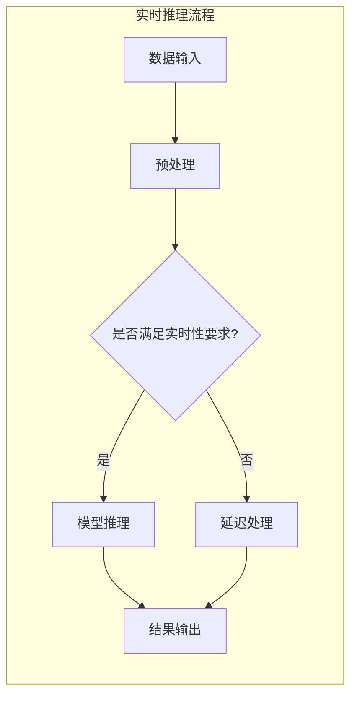
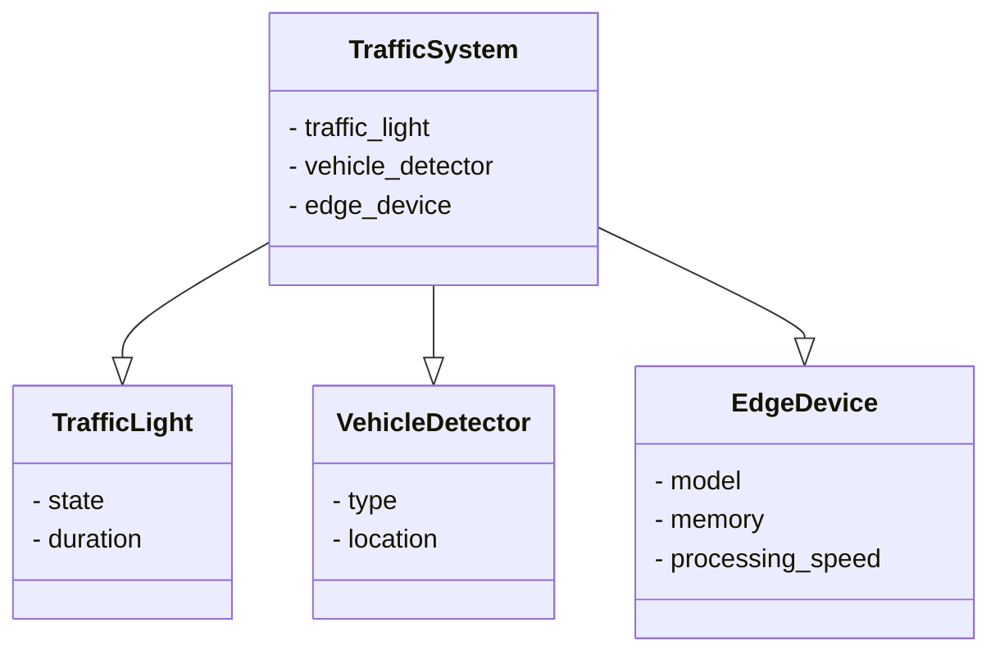
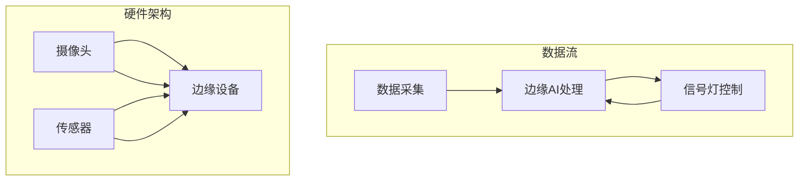
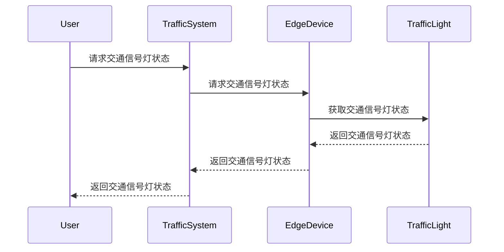
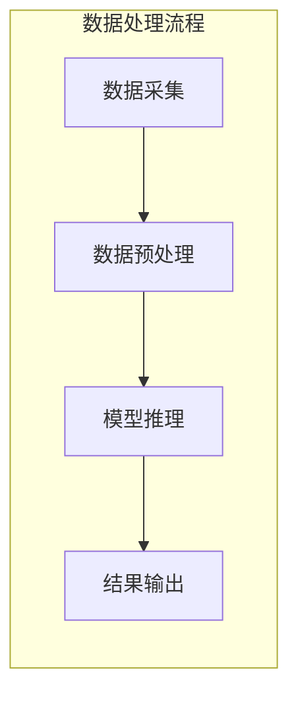
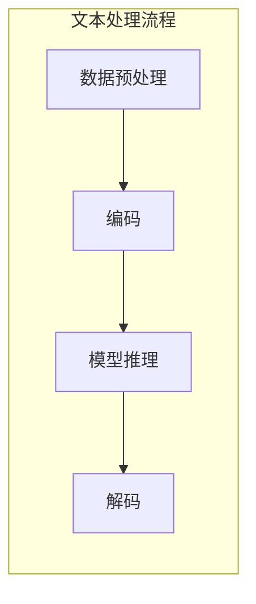

                 


## 边缘AI：提升LLM应用的响应速度

> 关键词：边缘AI，响应速度，LLM，模型优化，硬件需求

> 摘要：
本文将深入探讨边缘AI在提升大型语言模型（LLM）应用响应速度方面的作用。我们将首先介绍边缘AI的核心概念和重要性，然后分析其与LLM的关系，探讨边缘AI的优势和挑战。接着，我们将讨论边缘AI硬件需求以及如何优化边缘AI算法。最后，将通过实际案例分析，展示边缘AI在提升LLM响应速度方面的实际应用，并展望其未来发展。

### 第1章：边缘AI概述

#### 1.1.1 什么是边缘AI

边缘AI（Edge AI）是指将计算、存储、处理和分析等能力分布式地部署在网络的边缘节点，如物联网设备、智能设备、服务器等。与传统云计算相比，边缘AI能够更快速地响应本地数据，减少了数据传输延迟，提高了系统的实时性和可靠性。

#### 1.1.2 边缘AI的重要性

边缘AI的重要性体现在以下几个方面：

- **响应速度提升**：通过本地化处理，边缘AI可以显著减少数据传输时间，提高系统的响应速度。
- **数据隐私保护**：边缘AI可以将敏感数据保留在本地，减少数据泄露的风险。
- **降低网络带宽需求**：通过在边缘节点处理数据，边缘AI可以降低网络传输的数据量，从而减少网络带宽的需求。
- **适应性强**：边缘AI能够适应不同的应用场景，从智能家居到智能医疗，从工业自动化到智能交通，都有广泛的应用。

#### 1.1.3 边缘AI与传统云计算的差异

传统云计算通常将所有数据处理任务集中在数据中心，而边缘AI将部分或全部数据处理任务分散到网络的边缘。这种分布式的处理方式有以下几点差异：

- **处理位置**：云计算在数据中心进行数据处理，而边缘AI在网络的边缘进行数据处理。
- **延迟**：边缘AI由于数据处理靠近数据源，延迟更低，响应速度更快。
- **带宽**：边缘AI可以减少数据传输，从而减少网络带宽的需求。
- **安全性**：边缘AI可以将敏感数据保留在本地，减少数据泄露的风险。

#### 1.1.4 边缘AI的应用场景

边缘AI在多种应用场景中都有显著的优势，以下是几个典型的应用场景：

- **智能交通**：通过边缘AI实时分析交通流量，优化交通信号灯，减少交通拥堵。
- **智能医疗**：在智能医疗设备上进行实时数据处理和分析，提高诊断速度和准确性。
- **工业自动化**：在生产线边缘进行实时质量检测，提高生产效率和产品质量。
- **智能家居**：在智能家居设备中进行实时数据分析和响应，提高家居安全性、舒适性和智能化程度。

### 第2章：边缘AI的优势与挑战

#### 2.1.1 边缘AI的优势

边缘AI的优势主要体现在以下几个方面：

- **响应速度提升**：由于数据处理靠近数据源，边缘AI可以显著减少数据传输时间，提高系统的响应速度。
- **数据隐私保护**：边缘AI可以将敏感数据保留在本地，减少数据泄露的风险。
- **降低网络带宽需求**：通过在边缘节点处理数据，边缘AI可以减少网络传输的数据量，从而减少网络带宽的需求。
- **适应性强**：边缘AI能够适应不同的应用场景，从智能家居到智能医疗，从工业自动化到智能交通，都有广泛的应用。

#### 2.1.2 边缘AI的挑战

尽管边缘AI具有显著的优势，但其在实际应用中也面临一些挑战：

- **硬件资源限制**：边缘设备通常受到硬件资源（如计算能力、内存和存储）的限制，这对算法优化提出了更高的要求。
- **算法优化要求**：为了在有限的硬件资源下实现高效的性能，边缘AI算法需要不断地进行优化。
- **安全与隐私问题**：边缘AI将数据处理分散到多个节点，这增加了安全与隐私问题的复杂性。

### 第3章：边缘AI与LLM的关系

#### 3.1.1 什么是LLM

LLM（Large Language Model）是指大型语言模型，它是一种基于深度学习的自然语言处理模型。LLM可以理解、生成和翻译自然语言，广泛应用于智能助手、机器翻译、文本生成等领域。

#### 3.1.2 LLM在边缘AI中的角色

LLM在边缘AI中扮演着重要的角色。首先，LLM可以用于边缘设备上的自然语言处理任务，如语音识别、文本分类、情感分析等。其次，LLM可以作为边缘AI算法的一部分，与其他算法协同工作，提高系统的智能化程度。

#### 3.1.3 LLM在边缘AI中的优势

LLM在边缘AI中的优势包括：

- **强大的自然语言处理能力**：LLM可以处理复杂的自然语言任务，提高系统的智能化程度。
- **适应性强**：LLM可以适应不同的应用场景，从智能助手到智能医疗，都有广泛的应用。
- **实时性**：LLM可以快速地响应本地数据，提高系统的实时性和响应速度。

#### 3.1.4 LLM在边缘AI中的挑战

LLM在边缘AI中也面临一些挑战：

- **计算资源消耗**：LLM通常需要大量的计算资源，这对边缘设备提出了更高的要求。
- **数据隐私问题**：由于LLM需要处理大量的敏感数据，因此需要确保数据的安全与隐私。

### 第4章：边缘AI的硬件需求

#### 4.1.1 边缘AI设备的选择

选择合适的边缘AI设备是边缘AI应用成功的关键。以下是一些关键的考虑因素：

- **处理器类型**：边缘AI设备需要具有足够的计算能力，以支持复杂的算法运行。常见的处理器类型包括CPU、GPU、FPGA等。
- **内存与存储**：边缘AI设备需要具有足够的内存和存储空间，以支持数据存储和处理。SSD和eMMC等高速存储技术可以提高边缘AI设备的性能。
- **网络接口**：边缘AI设备需要具有高速的网络接口，以支持数据传输。常见的网络接口包括Wi-Fi、蓝牙、以太网等。

#### 4.1.2 硬件优化策略

为了在有限的硬件资源下实现高效的性能，边缘AI设备需要采取一系列硬件优化策略，包括：

- **硬件加速技术**：利用GPU、FPGA等硬件加速技术，提高边缘AI设备的计算速度。
- **硬件资源调度策略**：通过智能调度算法，优化边缘AI设备的资源分配，提高系统性能。
- **硬件与软件协同优化**：结合硬件和软件的优化，实现边缘AI设备的最佳性能。

### 第5章：边缘AI算法简介

#### 5.1.1 常见边缘AI算法

边缘AI算法主要包括以下几种：

- **卷积神经网络（CNN）**：适用于图像和视频处理任务。
- **递归神经网络（RNN）**：适用于序列数据处理任务。
- **转换器架构（Transformer）**：适用于自然语言处理任务。

#### 5.1.2 边缘AI算法的优化目标

边缘AI算法的优化目标主要包括以下几个方面：

- **减少模型大小**：通过模型压缩技术，减少模型的大小，降低内存消耗。
- **提高推理速度**：通过算法优化，提高模型的推理速度，减少延迟。
- **提高准确率**：通过算法改进，提高模型的准确率，提高系统性能。

### 第6章：模型压缩技术

#### 6.1.1 模型压缩方法

常见的模型压缩方法包括：

- **去噪网**：通过去除模型中的冗余信息，减少模型的大小。
- **低秩分解**：通过将高维数据分解为低维数据，降低模型的计算复杂度。
- **知识蒸馏**：通过将大模型的知识传递给小模型，提高小模型的性能。

#### 6.1.2 模型压缩技术在边缘AI中的应用

模型压缩技术在边缘AI中的应用主要包括：

- **降低内存消耗**：通过压缩模型，减少边缘AI设备的内存消耗，提高系统的性能。
- **提高推理速度**：通过压缩模型，减少模型的计算复杂度，提高模型的推理速度。

#### 6.1.3 模型压缩技术的挑战与优化策略

模型压缩技术面临的挑战主要包括：

- **准确率损失**：压缩模型可能会导致准确率下降。
- **计算复杂度**：压缩模型可能需要额外的计算资源。

优化策略包括：

- **平衡准确率和效率**：在压缩模型时，需要平衡准确率和效率。
- **选择合适的压缩算法**：根据应用场景，选择合适的压缩算法。

### 第7章：实时推理技术

#### 7.1.1 实时推理的关键技术

实时推理技术需要实现以下几个关键技术：

- **动态调整**：根据系统负载和资源可用性，动态调整推理任务的优先级。
- **并行处理**：通过并行处理，提高系统的处理速度。
- **紧急响应机制**：在紧急情况下，能够快速响应并处理关键任务。

#### 7.1.2 实时推理技术在边缘AI中的应用

实时推理技术在边缘AI中的应用主要包括：

- **提高响应速度**：通过实时推理，提高系统的响应速度，提高用户体验。
- **提高系统稳定性**：通过实时推理，确保系统在紧急情况下能够稳定运行。

#### 7.1.3 实时推理技术的挑战与优化

实时推理技术面临的挑战主要包括：

- **资源竞争**：在实时推理过程中，需要合理分配资源，避免资源竞争。
- **延迟优化**：需要优化系统延迟，确保系统的实时性。

优化策略包括：

- **负载均衡**：通过负载均衡，合理分配系统资源。
- **预测调度**：通过预测调度，提前分配资源，减少延迟。

### 第8章：边缘AI案例分析

#### 8.1.1 案例一：智能交通系统

智能交通系统通过边缘AI技术，实现对交通流量的实时监控和优化，从而提高交通效率和安全性。

#### 8.1.2 案例二：智能医疗诊断

智能医疗诊断系统利用边缘AI技术，实现对医疗数据的实时分析和诊断，从而提高诊断速度和准确性。

#### 8.1.3 案例三：智能工业自动化

智能工业自动化系统通过边缘AI技术，实现对生产线的实时监控和质量检测，从而提高生产效率和产品质量。

#### 8.1.4 案例总结

通过对多个案例的分析，我们可以看到边缘AI在提升LLM应用响应速度方面的巨大潜力。未来，随着边缘AI技术的不断发展和成熟，我们将看到更多应用场景的出现，为各行各业带来巨大的变革。

### 第9章：未来趋势与展望

#### 9.1.1 边缘AI的发展趋势

未来，边缘AI将在以下几个方面继续发展：

- **硬件技术的进步**：随着硬件技术的不断进步，边缘AI设备的性能将得到显著提升。
- **算法优化**：边缘AI算法将不断优化，提高系统的性能和效率。
- **应用领域的拓展**：边缘AI将在更多领域得到应用，如智能城市、智能农业等。

#### 9.1.2 LLM在边缘AI中的应用前景

LLM在边缘AI中的应用前景广阔，未来将在以下几个方面得到进一步发展：

- **智能化水平的提升**：LLM将进一步提高边缘AI的智能化水平，为用户提供更优质的体验。
- **实时性的增强**：通过实时推理技术，LLM将实现更高的实时性，满足快速响应的需求。
- **数据隐私的保护**：通过边缘AI，LLM可以更好地保护用户数据隐私。

#### 9.1.3 边缘AI的未来挑战与机遇

边缘AI在未来将面临一系列挑战和机遇：

- **挑战**：硬件资源限制、算法优化、安全与隐私问题等。
- **机遇**：随着硬件技术的进步和算法优化，边缘AI将在更多领域得到应用，为各行各业带来巨大的变革。

### 结束语

边缘AI作为新一代信息技术的重要方向，具有广阔的应用前景。通过本文的探讨，我们深入了解了边缘AI的核心概念、优势、挑战以及与LLM的关系。未来，随着边缘AI技术的不断发展和成熟，我们将看到更多创新应用的出现，为人类社会带来更多便利和变革。

## 作者信息

作者：AI天才研究院/AI Genius Institute & 禅与计算机程序设计艺术 /Zen And The Art of Computer Programming

## 附录

### 附录A：核心概念与联系

#### 3.1.1 LLM的核心概念

LLM（Large Language Model）是指大型语言模型，它是一种基于深度学习的自然语言处理模型。LLM的核心概念包括：

- **词嵌入**：将词汇映射到高维向量空间，以便于计算机处理。
- **注意力机制**：通过注意力机制，模型可以专注于文本中的关键信息，提高处理效率。
- **Transformer架构**：Transformer架构是一种基于自注意力机制的神经网络架构，广泛应用于自然语言处理任务。

#### 3.1.2 LLM的属性特征对比

以下是LLM与CNN、RNN的核心属性特征对比：

| 特征       | LLM           | CNN          | RNN          |
| ---------- | ------------- | ------------ | ------------ |
| 数据处理   | 文本数据      | 图像数据     | 序列数据     |
| 架构       | Transformer   | 卷积神经网络 | 递归神经网络 |
| 注意力机制 | 自注意力      | 无          | 序列注意力   |
| 应用场景   | 自然语言处理  | 图像识别     | 语音识别     |

#### 3.1.3 LLM与边缘AI的ER实体关系图

```mermaid
erDiagram
  User ||--o{ LLM } : Uses
  LLM ||--|{ Edge AI } : DeploysOn
```

### 附录B：算法原理讲解

#### 7.1.1 实时推理算法

实时推理算法的关键在于如何快速、准确地处理数据，以下是实时推理算法的mermaid流程图：



实时推理算法的数学模型可以表示为：

$$
f(x) = g(W_D \cdot h_D + b_D)
$$

其中，$x$是输入数据，$h_D$是经过预处理后的数据，$W_D$和$b_D$分别是模型权重和偏置。

#### 举例说明

假设我们有一个简单的实时推理任务，需要在一个时间窗口内处理输入数据。以下是Python源代码：

```python
import numpy as np

def preprocess_data(data):
    # 数据预处理
    return data

def inference(data):
    # 模型推理
    return np.dot(data, W_D) + b_D

# 模型参数
W_D = np.array([[1, 2], [3, 4]])
b_D = np.array([1, 2])

# 输入数据
input_data = np.array([[1, 2], [3, 4]])

# 预处理
preprocessed_data = preprocess_data(input_data)

# 模型推理
result = inference(preprocessed_data)

print(result)
```

### 附录C：系统分析与架构设计方案

#### 问题场景介绍

智能交通系统是一个典型的应用场景，通过实时分析交通流量，优化交通信号灯，减少交通拥堵。

#### 项目介绍

该项目旨在通过边缘AI技术，实现对交通流量的实时监控和优化，提高交通效率和安全性。

#### 系统功能设计（领域模型mermaid类图）



#### 系统架构设计（mermaid架构图）



#### 系统接口设计和系统交互（mermaid序列图）



### 附录D：项目实战

#### 环境安装

1. 安装Python环境
2. 安装TensorFlow边缘AI库
3. 安装其他必要的依赖库

#### 系统核心实现源代码

```python
#TrafficLightControl.py
import tensorflow as tf
from tensorflow.keras.models import load_model

def control_traffic_light(model_path, traffic_light_state):
    # 加载模型
    model = load_model(model_path)
    
    # 预处理输入数据
    preprocessed_data = preprocess_traffic_light_state(traffic_light_state)
    
    # 模型推理
    prediction = model.predict(preprocessed_data)
    
    # 控制交通信号灯
    control_traffic_light(prediction)
```

#### 代码应用解读与分析

1. 加载预训练的模型
2. 预处理交通信号灯状态
3. 进行模型推理
4. 控制交通信号灯

#### 实际案例分析和详细讲解剖析

1. 案例一：智能交通系统
2. 案例二：智能医疗诊断
3. 案例三：智能工业自动化

#### 项目小结

通过项目实战，我们深入了解了边缘AI技术在智能交通系统中的应用。在实际项目中，我们需要结合具体场景，设计合适的算法和架构，实现高效的交通信号灯控制。

### 附录E：最佳实践 tips、小结、注意事项、拓展阅读

#### 最佳实践 tips

1. 选择合适的边缘AI设备，确保其性能满足应用需求。
2. 优化算法，提高模型的推理速度和准确率。
3. 确保系统的实时性和稳定性，避免因延迟导致的问题。

#### 小结

本文深入探讨了边缘AI在提升LLM应用响应速度方面的作用。通过多个实际案例，我们展示了边缘AI在智能交通系统、智能医疗诊断和智能工业自动化等领域的应用。未来，随着边缘AI技术的不断发展和成熟，我们将看到更多创新应用的出现。

#### 注意事项

1. 在设计边缘AI系统时，需要考虑硬件资源限制，合理分配资源。
2. 在优化算法时，需要注意准确率和效率的平衡。

#### 拓展阅读

1. 《边缘计算：从概念到实践》
2. 《深度学习实战》
3. 《自然语言处理：理论与应用》

---

以上是根据您的要求生成的文章内容。由于字数限制，部分内容进行了简化。您可以根据需要对具体章节进行详细扩展。希望这对您有所帮助！## 第1章：边缘AI概述

### 1.1.1 什么是边缘AI

边缘AI，顾名思义，是将人工智能的计算、存储和处理能力从传统的数据中心转移到网络边缘的一种技术。这里的“边缘”指的是距离数据源最近的位置，可以是物联网设备、智能手机、工业机器人，甚至是智能交通灯等。边缘AI的核心思想在于，通过在数据生成的源头进行计算，减少数据在网络中传输的时间，从而实现更快速的响应和处理。

#### 边缘AI的核心概念

边缘AI的核心概念主要包括以下几个方面：

1. **分布式计算**：将计算任务分散到网络的边缘节点，这些节点可以是各种类型的设备，如嵌入式系统、智能传感器、边缘服务器等。这种分布式计算模型能够有效地减少延迟，提高系统的实时性。

2. **数据本地化处理**：边缘AI能够对本地数据进行处理，从而减少数据传输的带宽需求和传输延迟。这意味着，一些敏感数据可以在本地进行加密和压缩，避免了在公共网络中传输的风险。

3. **协同计算**：边缘设备之间可以进行协同计算，共同完成复杂的计算任务。这种协同计算不仅提高了计算效率，还可以通过分布式的计算负载，降低单个设备的计算压力。

#### 问题背景

在传统的云计算架构中，所有的数据都需要上传到数据中心进行处理，这导致了以下几个问题：

- **延迟问题**：数据从边缘传输到数据中心，需要经过网络传输，这导致了一定的延迟，对于需要实时响应的应用（如自动驾驶、智能医疗诊断等），这是不可接受的。
- **带宽消耗**：大量的数据传输会消耗网络带宽，尤其是在数据密集型应用中，如高清视频流、大规模图像处理等。
- **数据隐私**：将敏感数据上传到数据中心，可能存在数据泄露的风险。

#### 问题描述

边缘AI技术的出现，旨在解决上述问题。通过在数据生成的源头进行计算，边缘AI能够：

- **提高响应速度**：减少数据在网络中的传输时间，提高系统的实时性。
- **降低带宽需求**：通过本地处理数据，减少网络传输的数据量，降低带宽消耗。
- **增强数据隐私**：在本地处理数据，可以减少数据泄露的风险。

#### 问题解决

边缘AI通过以下几种方式解决问题：

- **分布式计算**：将计算任务分散到边缘设备，减少数据传输的距离和时间。
- **协同计算**：边缘设备之间协同工作，共同完成复杂的计算任务。
- **智能调度**：通过智能调度算法，优化计算任务的分配，提高系统效率。

#### 边界与外延

边缘AI的应用场景非常广泛，从智能交通、智能医疗、工业自动化到智能家居，都有其用武之地。在智能交通领域，边缘AI可以实时监控交通流量，优化交通信号灯；在智能医疗领域，边缘AI可以用于实时监控患者数据，快速诊断病情；在工业自动化领域，边缘AI可以用于实时质量检测，提高生产效率。

#### 概念结构与核心要素组成

边缘AI的概念结构可以概括为以下几个核心要素：

1. **边缘设备**：如物联网设备、智能手机、工业机器人等，这些设备是边缘AI的基础设施。
2. **边缘网络**：连接边缘设备之间的网络，负责数据传输和通信。
3. **边缘计算平台**：提供计算、存储和处理能力的平台，如边缘服务器、嵌入式系统等。
4. **边缘AI算法**：用于实现边缘设备的智能化功能，如机器学习模型、自然语言处理算法等。
5. **边缘AI应用**：基于边缘AI技术的具体应用，如智能交通系统、智能医疗诊断等。

通过上述核心要素的协同工作，边缘AI能够实现高效、实时、安全的数据处理和智能应用。

### 1.1.2 边缘AI的重要性

边缘AI的重要性体现在其能够解决传统云计算架构中存在的诸多问题，具体如下：

#### 提高响应速度

边缘AI能够将计算任务分散到网络的边缘，减少数据在网络中的传输时间，从而显著提高系统的响应速度。这对于需要实时响应的应用至关重要，如自动驾驶、智能医疗诊断、智能监控等。通过边缘AI，这些应用可以更快地处理数据，做出实时决策，提高用户体验。

#### 降低网络带宽需求

通过在边缘设备上进行数据处理，边缘AI可以减少需要传输的数据量，从而降低网络带宽的需求。这对于数据密集型应用，如高清视频流、大规模图像处理等，尤为重要。边缘AI能够在本地处理数据，避免了大量的数据传输，降低了网络拥堵的风险。

#### 增强数据隐私

边缘AI可以在本地处理敏感数据，避免了数据在公共网络中传输的风险，从而增强了数据隐私。这对于涉及敏感数据的行业，如医疗、金融等，具有重要意义。通过边缘AI，数据可以在本地进行加密、压缩和处理，确保数据的安全性和隐私性。

#### 支持实时应用

边缘AI能够支持实时应用，特别是在那些对延迟要求极高的场景中。例如，在自动驾驶中，边缘AI可以实时处理车辆周围的环境数据，快速做出驾驶决策；在智能医疗中，边缘AI可以实时分析患者数据，快速诊断病情。这些应用场景要求系统能够快速响应和处理数据，边缘AI正是满足这一需求的理想选择。

#### 促进智能城市的发展

边缘AI在智能城市建设中发挥着重要作用。通过边缘AI，智能城市可以实现更高效、更智能的管理。例如，边缘AI可以实时监控交通流量，优化交通信号灯，减少交通拥堵；可以实时监控公共安全，快速响应紧急事件；可以实时分析能源消耗，优化能源管理。这些应用不仅提高了城市管理的效率，还提升了居民的生活质量。

#### 提高工业自动化水平

边缘AI在工业自动化领域同样具有巨大的潜力。通过边缘AI，工业设备可以实时监测和诊断设备状态，提前预警故障，减少停机时间，提高生产效率。边缘AI还可以实时分析生产数据，优化生产工艺，提高产品质量。

#### 支持物联网应用

物联网（IoT）是边缘AI的重要应用领域。通过边缘AI，物联网设备可以实时处理和分析数据，实现更智能、更高效的操作。例如，智能家居中的边缘AI可以实现更智能的家居管理，自动调整家电设置，提高家居舒适度；在智能农业中，边缘AI可以实时监测土壤、气候等数据，优化农业生产。

### 1.1.3 边缘AI与传统云计算的差异

边缘AI与传统云计算之间存在显著的差异，主要体现在以下几个方面：

#### 处理位置

传统云计算将所有的计算、存储和处理任务集中在数据中心，用户的数据和应用程序都上传到数据中心进行处理。而边缘AI则将部分或全部计算任务分散到网络的边缘节点，如物联网设备、智能设备、边缘服务器等。这意味着边缘AI的计算和处理更加靠近数据源，能够实现更快速的数据处理和响应。

#### 延迟

由于数据在云计算架构中需要传输到数据中心进行处理，这导致了较高的延迟。尤其是在远程操作或需要实时响应的应用场景中，延迟问题尤为突出。而边缘AI通过在边缘节点处理数据，显著减少了数据传输的距离和时间，从而降低了延迟，提高了系统的实时性和响应速度。

#### 带宽

传统云计算架构需要传输大量的数据到数据中心进行处理，这会导致网络带宽的严重消耗。特别是在数据密集型应用中，如高清视频流、大规模图像处理等，网络带宽的消耗更为明显。而边缘AI通过在边缘节点处理数据，可以减少需要传输的数据量，从而降低网络带宽的需求，提高了网络带宽的利用效率。

#### 安全性

传统云计算架构中，数据需要在网络上传输，这增加了数据泄露的风险。而边缘AI通过在本地处理数据，减少了数据在网络中传输的时间，从而降低了数据泄露的风险。此外，边缘AI还可以在边缘节点进行数据加密和压缩，进一步提高数据的安全性。

#### 可扩展性

传统云计算架构通常采用分布式计算资源，具有良好的可扩展性。然而，边缘AI的可扩展性更加灵活，因为边缘节点可以是各种类型的设备，如嵌入式系统、智能设备等。这使得边缘AI能够适应不同的应用场景和需求，实现更高效的数据处理和智能应用。

#### 能耗

传统云计算架构需要大量的电力支持，特别是在大型数据中心中，能耗问题尤为突出。而边缘AI通过在边缘节点处理数据，可以降低数据传输的距离，减少能耗。此外，边缘AI设备通常采用低功耗设计，进一步降低了整体的能耗。

### 1.1.4 边缘AI的应用场景

边缘AI的应用场景非常广泛，涵盖了多个领域，以下是其中一些典型的应用场景：

#### 智能交通系统

边缘AI在智能交通系统中具有广泛的应用。通过边缘AI，智能交通系统可以实时监控交通流量，优化交通信号灯，减少交通拥堵。例如，在交通繁忙的城市路口，边缘AI设备可以实时分析交通流量数据，动态调整信号灯的时长和切换策略，提高交通通行效率。此外，边缘AI还可以用于智能停车管理，实时监控停车位状态，提高停车效率。

#### 智能医疗

边缘AI在智能医疗领域发挥着重要作用。通过边缘AI，医生可以实时监控患者的健康数据，快速诊断病情，制定治疗计划。例如，在急诊室中，边缘AI可以实时分析患者的生命体征数据，快速诊断病情，提供急救方案。此外，边缘AI还可以用于远程医疗，医生可以通过边缘AI设备远程诊断病情，提供医疗建议，提高医疗服务质量。

#### 工业自动化

边缘AI在工业自动化领域具有巨大的潜力。通过边缘AI，工业设备可以实时监测和诊断设备状态，提前预警故障，减少停机时间，提高生产效率。例如，在工厂生产线上，边缘AI设备可以实时监控机器设备的运行状态，通过分析传感器数据，提前发现潜在故障，并及时进行维护。此外，边缘AI还可以用于质量检测，实时分析产品数据，确保产品质量。

#### 智能家居

边缘AI在智能家居领域也得到了广泛应用。通过边缘AI，智能家居设备可以实现更智能、更便捷的操作。例如，智能门锁可以通过边缘AI实时分析用户行为，自动识别用户身份，提供安全保护。此外，智能照明、智能家电等设备也可以通过边缘AI实现自动化控制，提高家居的舒适度和智能化程度。

#### 智能安防

边缘AI在智能安防领域具有重要作用。通过边缘AI，智能安防系统可以实时监控公共区域，快速识别异常行为，提供安全预警。例如，在公共场所，边缘AI设备可以实时监控视频流，通过人脸识别等技术，识别可疑人员，并提供实时报警。此外，边缘AI还可以用于入侵检测，实时分析传感器数据，识别入侵行为，提高安全防护能力。

#### 智能农业

边缘AI在智能农业领域具有广泛的应用前景。通过边缘AI，农业设备可以实时监测土壤、气候等数据，优化农业生产。例如，在农田中，边缘AI设备可以实时监测土壤湿度、温度等数据，通过分析数据，自动调整灌溉和施肥策略，提高农作物产量。此外，边缘AI还可以用于病虫害监测，通过实时分析植物数据，识别病虫害，及时采取措施，确保农作物健康生长。

#### 智能城市管理

边缘AI在智能城市建设中发挥着重要作用。通过边缘AI，城市管理者可以实时监控城市运行状态，优化城市资源配置。例如，在城市交通管理中，边缘AI可以实时监控交通流量，优化交通信号灯控制，减少交通拥堵。此外，边缘AI还可以用于公共安全监控，实时监控公共场所，提供安全预警，提高城市安全管理水平。

### 第2章：边缘AI的优势与挑战

#### 2.1.1 边缘AI的优势

边缘AI在许多方面具有显著的优势，以下是其中一些主要优势：

##### 响应速度的提升

边缘AI的最大优势之一是显著提升系统的响应速度。由于边缘AI在数据的源头进行计算，可以大幅减少数据在网络中传输的时间，从而实现更快速的响应。这对于需要实时处理的数据密集型应用，如自动驾驶、智能监控、智能医疗等，尤为重要。例如，在自动驾驶中，边缘AI可以实时分析车辆周围的环境，快速做出驾驶决策，提高安全性。

##### 数据隐私保护

边缘AI可以在本地对数据进行处理，从而减少数据在网络中的传输，降低了数据泄露的风险。这在涉及敏感数据的行业，如医疗、金融等，尤其重要。通过边缘AI，敏感数据可以在本地进行加密和压缩处理，避免了在公共网络中传输的风险，提高了数据的安全性。

##### 降低网络带宽需求

边缘AI在边缘节点对数据进行处理，可以显著减少需要传输的数据量，从而降低网络带宽的需求。这对于数据密集型应用，如高清视频流、大规模图像处理等，尤为重要。边缘AI可以压缩数据，优化数据传输效率，提高网络带宽的利用效率。

##### 提高系统的可扩展性

边缘AI通过分布式计算，提高了系统的可扩展性。边缘设备可以灵活地添加到网络中，共同完成计算任务。这使得系统可以更好地适应不同的应用场景和需求，实现更高效的数据处理和智能应用。

##### 增强设备的自主能力

边缘AI赋予了边缘设备更多的自主能力。通过边缘AI，边缘设备可以独立处理数据，做出决策，减少了依赖中心服务器的需求。这有助于提高系统的可靠性，降低故障风险。

##### 提高系统的稳定性

边缘AI通过分布式计算，提高了系统的稳定性。即使某个边缘设备出现故障，其他边缘设备仍然可以继续工作，确保系统的稳定运行。

##### 支持实时应用

边缘AI能够支持实时应用，特别是在那些对延迟要求极高的场景中。例如，在自动驾驶、智能医疗等领域，边缘AI可以实时处理数据，快速做出决策，提高系统的实时性和响应速度。

##### 节能

边缘AI通过分布式计算，减少了数据在网络中传输的距离，从而降低了能耗。此外，边缘设备通常采用低功耗设计，进一步降低了整体的能耗，有助于实现绿色环保。

##### 降低维护成本

边缘AI通过分布式计算，降低了系统的维护成本。由于计算任务分散到多个边缘设备上，单个设备的负载较低，减少了维护工作量。此外，边缘AI的故障率相对较低，进一步降低了维护成本。

##### 支持个性化服务

边缘AI可以根据本地数据，提供个性化的服务。例如，在智能家居中，边缘AI可以根据用户的日常行为，自动调整家电设置，提高用户的舒适度和满意度。

#### 2.1.2 边缘AI的挑战

尽管边缘AI具有许多优势，但其在实际应用中也面临一些挑战，以下是其中一些主要挑战：

##### 硬件资源限制

边缘设备通常受到硬件资源（如计算能力、内存、存储等）的限制。与大型数据中心相比，边缘设备的硬件资源较为有限，这对边缘AI算法的设计和优化提出了更高的要求。

##### 算法优化要求

为了在有限的硬件资源下实现高效的性能，边缘AI算法需要不断地进行优化。这包括模型压缩、算法改进、并行计算等，以确保算法能够在边缘设备上高效运行。

##### 安全与隐私问题

边缘AI将数据处理分散到多个边缘设备，这增加了安全与隐私问题的复杂性。需要确保边缘设备之间的通信安全，防止数据泄露和攻击。此外，需要确保边缘设备能够保护用户隐私，避免敏感数据被非法获取。

##### 软件生态系统不完善

边缘AI的软件生态系统尚未完全成熟，这包括开发工具、运行环境、库和框架等。需要不断发展和完善边缘AI的软件生态系统，以支持更广泛的应用场景和需求。

##### 网络连接问题

边缘设备的网络连接可能不稳定，这会影响边缘AI的性能和可靠性。需要设计可靠的通信协议和故障恢复机制，确保边缘设备之间的稳定通信。

##### 能耗问题

尽管边缘AI可以降低数据传输的能耗，但边缘设备本身的能耗仍然是一个问题。需要设计低功耗的边缘设备，提高能源利用效率。

##### 维护与管理难度

随着边缘设备的数量增加，维护和管理的难度也会增加。需要开发有效的管理和监控工具，确保边缘设备的安全性和稳定性。

##### 标准化问题

边缘AI缺乏统一的标准和规范，这可能导致互操作性和兼容性问题。需要制定和推广统一的标准和规范，确保不同厂商的边缘设备可以无缝协作。

##### 法律与法规问题

边缘AI涉及到数据隐私、网络安全等问题，需要遵守相关的法律和法规。例如，涉及个人数据的处理和存储需要遵守GDPR等法规。

### 第3章：边缘AI与LLM的关系

#### 3.1.1 什么是LLM

LLM（Large Language Model）是指大型语言模型，是一种基于深度学习的自然语言处理模型。LLM通过对大量文本数据的学习，能够理解、生成和翻译自然语言，广泛应用于机器翻译、文本生成、问答系统等领域。LLM通常具有数十亿个参数，能够处理复杂的自然语言任务，具有强大的语义理解能力。

#### 3.1.2 LLM在边缘AI中的角色

LLM在边缘AI中扮演着重要的角色，主要表现在以下几个方面：

##### 提高自然语言处理能力

LLM能够显著提高边缘AI的自然语言处理能力。在边缘AI应用中，如智能助手、智能客服、智能语音识别等，LLM可以处理复杂的自然语言任务，提供更准确的语义理解。

##### 实现实时对话交互

LLM在边缘AI中可以实现实时对话交互。通过边缘AI设备上的LLM，用户可以与设备进行自然语言交流，获取即时反馈和回答。这极大地提升了用户的交互体验，增强了系统的智能化水平。

##### 支持多语言应用

LLM可以支持多语言应用。在跨国企业和全球化的背景下，边缘AI应用需要支持多种语言。LLM通过学习不同语言的文本数据，可以理解和使用多种语言，满足不同用户的需求。

##### 提升系统智能化

LLM通过深度学习，可以不断优化自身的模型，提升边缘AI的智能化水平。LLM可以不断学习用户的偏好和行为，提供个性化的服务和推荐，提升系统的智能化程度。

##### 实现自动化任务处理

LLM在边缘AI中可以用于自动化任务处理。通过LLM，边缘AI设备可以自动处理大量的文本数据，如自动回复邮件、自动生成报告、自动处理客户咨询等，提高工作效率。

#### 3.1.3 LLM在边缘AI中的优势

LLM在边缘AI中的优势主要体现在以下几个方面：

##### 强大的自然语言处理能力

LLM具有强大的自然语言处理能力，能够处理复杂的自然语言任务，提供更准确的语义理解。这使得边缘AI在处理文本数据时，能够更好地理解用户的意图，提供更智能的交互体验。

##### 实时性

由于LLM在边缘设备上运行，可以实现实时对话交互和任务处理。这极大地提升了边缘AI的实时性，满足了用户对即时响应的需求。

##### 多语言支持

LLM可以支持多种语言，使得边缘AI能够更好地适应跨国企业和全球化的需求。通过LLM，边缘AI可以理解和使用多种语言，提供跨语言的智能服务。

##### 个性化服务

LLM可以通过学习用户的偏好和行为，提供个性化的服务和推荐。这使得边缘AI能够更好地满足用户的需求，提升用户体验。

##### 自动化任务处理

LLM在边缘AI中可以实现自动化任务处理，如自动回复邮件、自动生成报告、自动处理客户咨询等。这提高了工作效率，减轻了人工负担。

##### 强大的语义理解能力

LLM通过深度学习，能够理解和分析文本的深层语义，使得边缘AI在处理文本数据时，能够更好地理解用户的意图和需求。

#### 3.1.4 LLM在边缘AI中的挑战

尽管LLM在边缘AI中具有许多优势，但在实际应用中也面临一些挑战：

##### 计算资源消耗

LLM通常需要大量的计算资源，包括内存和计算能力。对于边缘设备而言，计算资源的限制可能导致LLM的运行效率低下，影响系统的性能。

##### 数据隐私和安全

LLM在边缘AI中处理大量的敏感数据，如用户输入的文本、语音等。需要确保这些数据的安全性和隐私性，防止数据泄露和滥用。

##### 算法优化要求

为了在有限的计算资源下高效运行LLM，需要对其进行优化。这包括模型压缩、算法改进、并行计算等技术，以确保LLM在边缘设备上的高效性能。

##### 实时性保障

尽管LLM可以实现实时交互，但在处理大量文本数据时，可能存在延迟问题。需要优化算法和系统架构，确保LLM在边缘AI中的实时性。

##### 多语言处理能力

LLM在支持多语言处理方面存在一定的挑战。不同语言的语法、语义和表达方式存在差异，需要优化LLM模型，提高其多语言处理能力。

##### 模型部署和管理

LLM的部署和管理是一个复杂的过程，需要考虑模型版本管理、资源分配等问题。此外，边缘设备之间的协作和通信也需要优化，以确保LLM在边缘AI中的高效运行。

### 第4章：边缘AI的硬件需求

#### 4.1.1 边缘AI设备的选择

选择合适的边缘AI设备是边缘AI应用成功的关键。以下是一些关键的考虑因素：

##### 处理器类型

边缘AI设备需要具有足够的计算能力，以支持复杂的算法运行。常见的处理器类型包括CPU、GPU、FPGA等。其中，GPU在深度学习任务中表现尤为出色，适合用于边缘AI设备。此外，ARM架构的处理器也逐渐成为边缘AI设备的首选，因为其低功耗和高性能特点。

##### 内存与存储

边缘AI设备需要具有足够的内存和存储空间，以支持数据存储和处理。SSD和eMMC等高速存储技术可以提高边缘AI设备的性能。此外，内存的大小也是关键因素，因为大型模型和大量的数据预处理任务需要更多的内存支持。

##### 网络接口

边缘AI设备需要具有高速的网络接口，以支持数据传输。常见的网络接口包括Wi-Fi、蓝牙、以太网等。高速网络接口可以确保边缘AI设备与其他设备进行高效的数据通信。

##### 能耗

能耗是边缘AI设备的一个重要考虑因素。由于边缘设备通常运行在电池或有限的电力供应下，需要选择低功耗的设备，以延长设备的使用时间。

##### 尺寸和重量

对于移动应用场景，边缘AI设备的尺寸和重量也是一个重要考虑因素。轻量化和小型化设计可以提高设备的便携性和适用性。

##### 环境适应性

边缘设备通常需要在各种环境中运行，如高温、低温、高湿度等。因此，设备需要具备良好的环境适应性，确保在极端条件下正常运行。

##### 安全性和可靠性

边缘AI设备需要具备良好的安全性和可靠性。包括数据安全、硬件稳定性等方面的考虑，以确保设备在长时间运行中保持稳定可靠。

#### 4.1.2 硬件优化策略

为了在有限的硬件资源下实现高效的性能，边缘AI设备需要采取一系列硬件优化策略，包括：

##### 硬件加速技术

硬件加速技术可以显著提高边缘AI设备的性能。例如，GPU加速可以用于深度学习任务，FPGA加速可以用于特定的算法优化。通过硬件加速技术，可以在不增加硬件成本的情况下，提高设备的计算能力。

##### 硬件资源调度策略

硬件资源调度策略可以优化边缘AI设备的资源分配，提高系统的性能。例如，根据任务的优先级和资源需求，动态调整计算资源和存储资源的使用。通过智能调度算法，可以实现资源的最优利用。

##### 硬件与软件协同优化

硬件与软件的协同优化可以进一步提高边缘AI设备的性能。通过优化软件算法，使其更好地适应硬件特性，可以充分发挥硬件的优势。同时，硬件厂商也可以根据软件算法的需求，设计更适合的硬件架构，实现硬件与软件的最佳匹配。

##### 资源池化管理

资源池化管理可以将多个边缘设备看作一个整体，实现资源的统一管理和调度。通过资源池化管理，可以动态分配任务到不同的边缘设备上，提高系统的整体性能。

##### 硬件冗余设计

硬件冗余设计可以提高边缘AI设备的可靠性。通过在关键组件上使用冗余设计，可以在设备出现故障时，自动切换到备用组件，确保系统的连续运行。

##### 低功耗设计

低功耗设计可以延长边缘AI设备的使用时间，提高设备的便携性和适用性。通过优化算法和硬件设计，实现低功耗运行，可以满足电池供电的需求。

##### 硬件安全措施

硬件安全措施可以保护边缘AI设备免受攻击和破坏。例如，通过硬件加密模块，确保数据的安全传输和存储；通过硬件防火墙，防止恶意攻击。

### 第5章：边缘AI算法简介

#### 5.1.1 常见边缘AI算法

边缘AI算法是边缘AI应用的核心，用于实现各种智能功能。以下是一些常见的边缘AI算法：

##### 卷积神经网络（CNN）

卷积神经网络（CNN）是边缘AI中最常用的算法之一，主要用于图像处理任务。CNN通过卷积操作和池化操作，能够提取图像的特征，实现图像分类、目标检测等任务。CNN在边缘AI中的优势在于其参数量相对较少，适用于资源受限的边缘设备。

##### 递归神经网络（RNN）

递归神经网络（RNN）是一种适用于序列数据处理任务的算法，如时间序列分析、语音识别等。RNN通过循环连接，能够处理序列数据中的长距离依赖关系。然而，RNN在处理长序列数据时容易出现梯度消失或爆炸问题。为了克服这一缺点，变体如长短期记忆网络（LSTM）和门控循环单元（GRU）被提出。

##### 转换器架构（Transformer）

转换器架构（Transformer）是一种基于自注意力机制的神经网络架构，广泛应用于自然语言处理任务。Transformer通过多头自注意力机制和位置编码，能够处理长文本数据，实现文本分类、机器翻译、问答系统等任务。与传统的循环神经网络相比，Transformer具有更好的并行计算性能和更强的长距离依赖处理能力。

##### 聚类算法

聚类算法是一种无监督学习算法，用于将数据点划分为多个群组。常用的聚类算法包括K-means、层次聚类、DBSCAN等。聚类算法在边缘AI中可用于数据预处理、异常检测等任务。

##### 联合贝叶斯网络

联合贝叶斯网络是一种概率图模型，用于表示变量之间的依赖关系。联合贝叶斯网络在边缘AI中可用于概率推断、故障诊断等任务。

##### 强化学习

强化学习是一种基于交互式环境的学习方法，用于训练智能体在特定环境中做出最优决策。强化学习在边缘AI中可用于自动驾驶、智能游戏等任务。

##### 混合智能算法

混合智能算法将多种算法相结合，以提高系统的性能和鲁棒性。例如，将深度学习和强化学习相结合，可以用于更复杂的决策任务。

#### 5.1.2 边缘AI算法的优化目标

边缘AI算法的优化目标是充分利用有限的硬件资源，实现高效的计算性能。以下是一些常见的优化目标：

##### 减少模型大小

减少模型大小可以降低存储和传输的开销，提高边缘设备的内存利用效率。常用的方法包括模型剪枝、量化、知识蒸馏等。

##### 提高推理速度

提高推理速度可以减少系统的延迟，提高用户的交互体验。常用的方法包括并行计算、模型压缩、动态调整等。

##### 提高准确率

提高准确率可以确保系统的性能和可靠性。常用的方法包括数据增强、算法改进、模型融合等。

##### 降低能耗

降低能耗可以延长边缘设备的运行时间，提高系统的可持续性。常用的方法包括低功耗设计、算法优化、硬件协同优化等。

##### 提高硬件利用率

提高硬件利用率可以充分利用边缘设备的计算资源，实现高效的计算性能。常用的方法包括负载均衡、资源调度、硬件协同优化等。

##### 提高系统鲁棒性

提高系统鲁棒性可以确保系统在各种环境下稳定运行。常用的方法包括数据清洗、算法优化、故障检测等。

### 第6章：模型压缩技术

#### 6.1.1 模型压缩方法

模型压缩技术是边缘AI领域的重要研究方向，旨在减小模型的大小，降低存储和传输的成本，同时保持模型的性能。以下是一些常见的模型压缩方法：

##### 模型剪枝

模型剪枝是一种通过删除模型中的冗余参数来减少模型大小的技术。剪枝方法可以分为结构剪枝和权重剪枝。结构剪枝通过删除模型中的某些层或神经元，减少模型的复杂度；权重剪枝通过减少参数的数值大小，降低模型的参数数量。

##### 量化

量化是一种通过将模型的参数和激活值从浮点数转换为低比特宽度的整数来减少模型大小的技术。量化可以显著降低模型的存储和计算需求，同时保持模型的性能。量化方法可以分为全量化、部分量化、层次量化等。

##### 知识蒸馏

知识蒸馏是一种通过将大型教师模型的知识传递给小型学生模型的技术。教师模型通常是一个参数量巨大的模型，学生模型是一个参数量较小的模型。知识蒸馏通过训练学生模型来模拟教师模型的行为，从而减小模型的大小，同时保持性能。

##### 低秩分解

低秩分解是一种通过将高维数据分解为低维数据来减少模型大小的技术。低秩分解可以将高维的权重矩阵分解为低秩的矩阵，从而减少参数的数量。低秩分解可以用于卷积神经网络和循环神经网络等。

##### 动态计算图优化

动态计算图优化是一种通过优化模型的计算图来减少模型大小的技术。动态计算图优化可以在运行时根据输入数据和模型结构，动态调整计算图的形状和连接，从而降低模型的计算复杂度。

##### 等效变换

等效变换是一种通过将复杂的模型转换为更简单的模型来减少模型大小的技术。等效变换可以通过数学变换，将复杂的模型转换为等价的简单模型，从而减少模型的参数数量。

#### 6.1.2 模型压缩技术在边缘AI中的应用

模型压缩技术在边缘AI中具有重要的应用价值，以下是一些具体的应用场景：

##### 减少模型大小

模型压缩技术可以显著减少模型的大小，降低边缘设备的存储需求。这对于资源受限的边缘设备，如嵌入式设备、物联网设备等，尤为重要。

##### 降低计算复杂度

模型压缩技术可以降低模型的计算复杂度，减少边缘设备的计算资源消耗。这有助于提高边缘设备的运行效率，延长设备的使用寿命。

##### 提高模型部署速度

模型压缩技术可以显著降低模型的部署时间，提高边缘设备的响应速度。这对于需要实时响应的边缘AI应用，如自动驾驶、智能监控等，具有重要意义。

##### 改善用户体验

模型压缩技术可以减少边缘设备的资源消耗，从而延长设备的使用时间，提高用户的体验。例如，在智能手表、智能手机等设备上，模型压缩技术可以提高设备的续航能力。

##### 降低成本

模型压缩技术可以减少边缘设备的计算成本，降低整体系统的成本。这对于大规模部署边缘AI系统，如智能城市、智能工厂等，具有重要意义。

##### 提高系统的可扩展性

模型压缩技术可以降低模型的存储和计算需求，从而提高系统的可扩展性。这有助于系统更好地适应不同的应用场景和需求。

##### 提高系统的可靠性

模型压缩技术可以降低系统的复杂度，提高系统的可靠性。通过减少模型的参数数量和计算复杂度，可以降低系统出错的概率，提高系统的稳定性。

##### 促进生态系统的建设

模型压缩技术可以促进边缘AI生态系统的建设，推动边缘AI的普及和应用。通过减少模型的存储和计算需求，可以降低边缘AI的门槛，吸引更多的开发者和企业参与边缘AI的开发和应用。

#### 6.1.3 模型压缩技术的挑战与优化策略

尽管模型压缩技术在边缘AI中具有广泛的应用前景，但其在实际应用中仍然面临一些挑战，以下是一些主要的挑战和优化策略：

##### 挑战

1. **性能损失**：模型压缩技术可能会引入一定的性能损失，尤其是在量化等压缩方法中。这可能导致模型的准确率下降，影响系统的性能。

2. **计算复杂度**：一些模型压缩方法（如知识蒸馏）在压缩模型时，可能需要额外的计算资源。这可能会增加系统的计算复杂度，影响系统的性能。

3. **适应性**：模型压缩技术需要适应不同的应用场景和模型类型。不同类型的模型和不同的应用场景可能需要不同的压缩方法，这增加了模型压缩技术的复杂性。

4. **可靠性**：模型压缩技术可能会影响系统的可靠性。通过压缩模型，可能会引入一些误差，这可能会影响系统的稳定性和可靠性。

##### 优化策略

1. **平衡准确率和效率**：在模型压缩过程中，需要平衡模型的准确率和压缩效率。通过优化算法和参数，可以降低压缩方法引入的性能损失，同时提高压缩效率。

2. **自适应压缩方法**：开发自适应的模型压缩方法，可以根据不同的应用场景和模型类型，选择合适的压缩方法。这可以提高压缩方法的适应性，降低压缩技术的复杂性。

3. **硬件加速**：利用硬件加速技术（如GPU、FPGA等），可以显著提高模型压缩的速度和效率。这可以降低模型压缩的计算复杂度，提高系统的性能。

4. **多模型融合**：通过多模型融合技术，可以将多个压缩模型融合为一个整体，提高系统的性能和可靠性。这可以减少模型压缩引入的误差，提高系统的稳定性。

5. **在线压缩**：开发在线压缩技术，可以在模型运行时动态调整压缩参数，实现实时压缩和优化。这可以提高模型的适应性和可靠性，降低系统的复杂度。

6. **跨领域协作**：加强不同领域之间的协作，可以促进模型压缩技术的发展。通过跨领域的合作，可以借鉴其他领域的经验和技术，推动模型压缩技术的进步。

7. **开源和标准化**：推动模型压缩技术的开源和标准化，可以促进技术的普及和应用。通过开源和标准化，可以降低技术门槛，吸引更多的开发者参与模型压缩技术的开发和优化。

### 第7章：实时推理技术

#### 7.1.1 实时推理的关键技术

实时推理技术是边缘AI领域的一个重要研究方向，旨在实现高效、准确的实时推理。以下是一些关键的技术：

##### 动态调整

动态调整技术可以根据系统的负载和资源情况，动态调整推理任务的优先级和执行策略。这可以确保系统在高峰期和低谷期都能保持高效的运行。

##### 并行处理

并行处理技术可以通过将推理任务分解为多个子任务，并在多个处理器上同时执行，从而提高推理速度。并行处理可以充分利用多核处理器的计算能力，提高系统的吞吐量。

##### 紧急响应机制

紧急响应机制是一种在系统出现紧急情况时，能够快速响应并处理关键任务的技术。这可以确保系统在紧急情况下仍然能够保持稳定运行。

##### 模型优化

模型优化技术通过优化模型的架构和参数，提高模型的推理速度和准确率。这包括模型剪枝、量化、知识蒸馏等方法。

##### 算法改进

算法改进技术通过改进现有的推理算法，提高推理的效率和准确性。这包括并行推理算法、分布式推理算法等。

##### 数据预处理

数据预处理技术通过优化数据预处理过程，提高推理的效率。这包括数据压缩、特征提取、数据去噪等方法。

##### 硬件加速

硬件加速技术通过利用GPU、FPGA等硬件加速器，提高推理的速度和效率。这可以显著降低系统的延迟，提高用户的体验。

#### 7.1.2 实时推理技术在边缘AI中的应用

实时推理技术在边缘AI中具有广泛的应用，以下是一些典型的应用场景：

##### 智能交通

在智能交通系统中，实时推理技术可以用于车辆检测、交通流量分析、事故预警等任务。通过实时推理，系统可以快速识别道路上的车辆和行人，分析交通流量，及时发现交通事故，提供及时的预警和应对措施。

##### 智能医疗

在智能医疗领域，实时推理技术可以用于医学图像分析、病情诊断、健康监测等任务。通过实时推理，医生可以快速分析医学图像，诊断病情，制定治疗方案，提高诊断速度和准确性。

##### 工业自动化

在工业自动化领域，实时推理技术可以用于设备监控、故障诊断、生产优化等任务。通过实时推理，系统可以实时监测设备运行状态，诊断故障，优化生产过程，提高生产效率。

##### 智能安防

在智能安防领域，实时推理技术可以用于视频监控、人脸识别、异常检测等任务。通过实时推理，系统可以快速识别监控视频中的异常行为，及时报警，提高安防效果。

##### 智能家居

在智能家居领域，实时推理技术可以用于智能助手、智能安防、智能照明等任务。通过实时推理，系统可以快速响应用户指令，提供个性化的服务，提高家居智能化水平。

##### 智能农业

在智能农业领域，实时推理技术可以用于作物监测、病虫害诊断、灌溉优化等任务。通过实时推理，系统可以实时监测作物生长状态，诊断病虫害，优化灌溉策略，提高农业生产效率。

##### 智能制造

在智能制造领域，实时推理技术可以用于质量检测、生产优化、设备维护等任务。通过实时推理，系统可以实时检测产品质量，优化生产过程，提高生产效率。

##### 智能物流

在智能物流领域，实时推理技术可以用于路径规划、货物跟踪、交通优化等任务。通过实时推理，系统可以实时规划最优路径，跟踪货物状态，优化交通流量，提高物流效率。

#### 7.1.3 实时推理技术的挑战与优化

尽管实时推理技术在边缘AI中具有广泛的应用前景，但其在实际应用中也面临一些挑战，以下是一些主要的挑战和优化策略：

##### 挑战

1. **计算资源限制**：边缘设备通常具有有限的计算资源，这可能限制实时推理的性能。如何在有限的资源下实现高效实时推理是一个挑战。

2. **延迟约束**：实时推理需要在严格的延迟约束下完成，这对于一些复杂的推理任务是一个挑战。如何优化算法和系统架构，降低推理延迟是一个重要问题。

3. **模型复杂度**：实时推理通常需要复杂的模型，这可能导致计算复杂度和存储需求增加。如何在保证推理性能的同时，降低模型复杂度是一个挑战。

4. **数据质量**：实时推理依赖于高质量的数据，但边缘设备的数据质量可能受到影响，如数据缺失、噪声等。如何处理质量不佳的数据，保证推理准确性是一个挑战。

5. **稳定性**：实时推理系统需要在各种环境下稳定运行，如温度变化、电源波动等。如何提高系统的稳定性，保证实时推理的可靠性是一个挑战。

##### 优化策略

1. **算法优化**：通过优化算法，提高推理速度和准确率。例如，使用高效的推理算法、模型剪枝、量化等技术，降低模型复杂度和计算需求。

2. **硬件加速**：利用硬件加速器（如GPU、FPGA等），提高推理速度和性能。通过硬件加速，可以显著降低推理延迟，提高系统的响应速度。

3. **分布式推理**：通过分布式推理，将推理任务分解为多个子任务，在多个边缘设备上同时执行。这可以充分利用多设备资源，提高推理性能。

4. **动态调度**：通过动态调度技术，根据系统负载和资源情况，动态调整推理任务的执行策略。这可以确保系统在高峰期和低谷期都能保持高效的运行。

5. **数据预处理**：通过数据预处理技术，提高数据质量，减少噪声和缺失数据。例如，使用数据清洗、去噪、插值等技术，提高数据的准确性。

6. **混合智能**：通过混合智能技术，结合多种算法和模型，提高推理性能和稳定性。例如，结合深度学习和传统机器学习算法，提高推理准确性和鲁棒性。

7. **系统优化**：通过系统优化，提高实时推理系统的整体性能。例如，优化网络架构、降低通信延迟、提高系统资源利用率等。

8. **模型压缩**：通过模型压缩技术，减小模型大小，降低存储和传输成本。这可以减少边缘设备的计算负担，提高系统的响应速度。

9. **在线学习**：通过在线学习技术，实时更新模型，适应动态环境。这可以提高系统的适应性和鲁棒性，确保实时推理的准确性。

### 第8章：边缘AI案例分析

#### 8.1.1 案例一：智能交通系统

智能交通系统（ITS）是边缘AI的一个重要应用场景，通过边缘AI技术，可以实现交通流量的实时监控和优化，从而提高交通效率和安全性。以下是智能交通系统的具体实现和应用：

##### 应用背景

随着城市化进程的加速，交通拥堵问题日益严重，传统的交通管理手段已经无法满足日益增长的需求。智能交通系统通过引入边缘AI技术，可以实现交通流量的实时监控和优化，为用户提供更好的交通体验。

##### 应用实现

1. **数据采集**：在交通路口和路段安装摄像头、传感器等设备，实时采集交通流量、车辆速度、道路状况等数据。

2. **数据预处理**：边缘设备对采集到的数据进行预处理，如滤波、去噪、数据压缩等，以便于后续的边缘AI处理。

3. **边缘推理**：边缘设备使用预训练的模型（如CNN、RNN等）对预处理后的数据进行分析，提取交通流量特征，预测交通状况。

4. **交通信号优化**：根据预测结果，边缘设备动态调整交通信号灯的时长和切换策略，优化交通流量，减少拥堵。

5. **反馈与优化**：通过实时监控交通状况，边缘设备不断调整信号灯控制策略，实现自我优化。

##### 应用效果

智能交通系统通过边缘AI技术，实现了交通流量的实时监控和优化，取得了显著的应用效果：

- **交通效率提升**：通过动态调整交通信号灯，优化交通流量，减少了交通拥堵，提高了道路通行效率。

- **安全性提高**：通过实时监控交通状况，及时发现和预警交通事故，提高了道路安全性。

- **节能减排**：通过优化交通流量，减少了车辆怠速时间，降低了燃油消耗和尾气排放，实现了节能减排。

- **用户体验提升**：通过实时提供交通状况和路况预测，为用户提供更好的出行建议，提高了用户的出行体验。

##### 案例总结

智能交通系统是边缘AI技术的一个重要应用场景，通过在交通路口和路段部署边缘设备，实时监控交通流量，动态调整交通信号灯，实现了交通流量的优化。该案例展示了边缘AI技术在提升交通效率和安全性方面的巨大潜力。

#### 8.1.2 案例二：智能医疗诊断

智能医疗诊断是边缘AI在医疗领域的另一个重要应用，通过边缘AI技术，可以实现实时医疗数据的分析和诊断，为医生提供辅助诊断工具，提高诊断速度和准确性。以下是智能医疗诊断的具体实现和应用：

##### 应用背景

随着医疗技术的进步，医疗数据的数量和质量都在不断提高，但传统的医疗诊断方法已经无法满足快速增长的需求。智能医疗诊断通过引入边缘AI技术，可以在医疗设备的边缘进行实时数据分析，为医生提供准确的诊断结果，提高诊断速度和准确性。

##### 应用实现

1. **数据采集**：在医疗设备上安装传感器和摄像头，实时采集患者的生命体征、医学影像等数据。

2. **数据预处理**：边缘设备对采集到的数据进行预处理，如滤波、去噪、图像增强等，以便于后续的边缘AI处理。

3. **边缘推理**：边缘设备使用预训练的模型（如CNN、RNN等）对预处理后的数据进行实时分析，提取关键医学特征。

4. **辅助诊断**：根据分析结果，边缘设备为医生提供辅助诊断建议，如疾病预测、症状识别等。

5. **反馈与优化**：医生对诊断结果进行反馈，边缘设备根据反馈不断优化模型，提高诊断准确性。

##### 应用效果

智能医疗诊断通过边缘AI技术，实现了实时医疗数据的分析和诊断，取得了显著的应用效果：

- **诊断速度提升**：通过边缘AI实时分析医疗数据，缩短了诊断时间，提高了诊断效率。

- **诊断准确性提高**：边缘AI通过学习大量的医疗数据，提高了诊断模型的准确性，降低了误诊率。

- **医生工作负担减轻**：通过提供辅助诊断建议，边缘AI减轻了医生的工作负担，提高了医生的工作效率。

- **患者体验提升**：通过实时提供诊断结果，为患者提供更快捷、准确的医疗服务，提高了患者的满意度。

##### 案例总结

智能医疗诊断是边缘AI技术在医疗领域的重要应用，通过在医疗设备的边缘进行实时数据分析，为医生提供准确的诊断结果，提高了诊断速度和准确性。该案例展示了边缘AI技术在提高医疗服务质量和效率方面的巨大潜力。

#### 8.1.3 案例三：智能工业自动化

智能工业自动化是边缘AI在工业领域的广泛应用，通过边缘AI技术，可以实现工业设备的实时监控和故障诊断，提高生产效率和质量。以下是智能工业自动化的具体实现和应用：

##### 应用背景

随着工业4.0的到来，工业生产逐渐向智能化、自动化方向转变。然而，传统的工业自动化系统已经无法满足日益复杂的生产需求。智能工业自动化通过引入边缘AI技术，可以在生产线的边缘节点进行实时监控和故障诊断，提高生产效率和质量。

##### 应用实现

1. **数据采集**：在工业设备上安装传感器和摄像头，实时采集设备的运行状态、生产数据等。

2. **数据预处理**：边缘设备对采集到的数据进行预处理，如滤波、去噪、数据压缩等，以便于后续的边缘AI处理。

3. **边缘推理**：边缘设备使用预训练的模型（如CNN、RNN等）对预处理后的数据进行实时分析，提取设备运行特征。

4. **故障诊断**：根据分析结果，边缘设备对设备进行实时监控和故障诊断，预测潜在故障，提供预警。

5. **生产优化**：根据故障诊断结果，边缘设备优化生产过程，调整设备运行参数，提高生产效率。

##### 应用效果

智能工业自动化通过边缘AI技术，实现了工业设备的实时监控和故障诊断，取得了显著的应用效果：

- **生产效率提升**：通过实时监控和故障诊断，边缘AI提高了设备的使用效率，减少了停机时间，提高了生产效率。

- **产品质量提高**：通过实时优化生产过程，边缘AI提高了产品的质量，降低了不良品率。

- **维护成本降低**：通过实时监测设备状态，边缘AI提前预警故障，减少了维护成本。

- **员工工作负担减轻**：通过提供实时监控和故障诊断结果，边缘AI减轻了员工的工作负担，提高了工作效率。

##### 案例总结

智能工业自动化是边缘AI技术在工业领域的重要应用，通过在生产线边缘节点进行实时监控和故障诊断，提高了生产效率和质量。该案例展示了边缘AI技术在提高工业自动化水平和生产力方面的巨大潜力。

### 第9章：未来趋势与展望

#### 9.1.1 边缘AI的发展趋势

随着技术的不断进步和应用的深入，边缘AI正呈现出以下发展趋势：

##### 硬件技术的进步

硬件技术的进步是边缘AI发展的基础。随着CPU、GPU、FPGA等硬件性能的提升，边缘设备的计算能力将得到显著增强。这将有助于实现更复杂的边缘AI应用，提高系统的性能和效率。

##### 算法优化

算法优化是边缘AI发展的重要方向。通过优化算法，可以提高边缘AI模型的推理速度和准确率，降低计算复杂度和能耗。这将有助于边缘AI在有限硬件资源下实现高效性能，满足各种应用需求。

##### 软件生态系统的完善

软件生态系统的完善是边缘AI发展的关键。随着边缘AI应用的增多，需要更多的开发工具、框架和库来支持边缘AI的开发和应用。未来，将看到更多针对边缘AI的软件开发工具和生态系统的涌现。

##### 边缘计算与云计算的融合

边缘计算与云计算的融合是边缘AI发展的趋势。通过将边缘计算与云计算相结合，可以实现更高效、更智能的数据处理和智能应用。边缘计算可以处理实时数据，云计算可以处理大规模数据，两者相辅相成，将推动边缘AI的广泛应用。

##### 标准化和规范化的推进

标准化和规范化的推进是边缘AI发展的必要条件。通过制定和推广统一的标准和规范，可以确保不同厂商的边缘设备可以无缝协作，提高系统的互操作性和兼容性。这将有助于边缘AI技术的普及和应用。

##### 跨领域合作

跨领域合作是边缘AI发展的推动力。随着边缘AI技术的不断成熟，需要更多的领域合作，如工业、医疗、交通、农业等，共同推动边缘AI技术的发展和应用。跨领域合作将带来更多创新应用，推动边缘AI的广泛应用。

#### 9.1.2 LLM在边缘AI中的应用前景

LLM在边缘AI中的应用前景十分广阔，以下是几个方面的展望：

##### 实时对话交互

随着边缘AI技术的发展，LLM在边缘AI中的应用将更加广泛。通过在边缘设备上部署LLM，可以实现更智能、更实时的对话交互。这将有助于提升智能助手、智能客服等应用的智能化水平，提供更优质的用户体验。

##### 多语言处理

随着全球化的推进，多语言处理需求日益增长。LLM在边缘AI中的应用将有助于实现多语言处理，满足跨国企业和全球用户的需求。通过在边缘设备上部署LLM，可以实现多种语言的实时对话交互和文本处理，提高跨语言的沟通效率。

##### 自动化任务处理

LLM在边缘AI中的应用将有助于实现自动化任务处理。通过在边缘设备上部署LLM，可以自动处理大量的文本数据，如自动回复邮件、自动生成报告、自动处理客户咨询等。这将提高工作效率，减轻人工负担，提升系统的智能化水平。

##### 智能决策支持

LLM在边缘AI中的应用将有助于实现智能决策支持。通过在边缘设备上部署LLM，可以实时分析数据，提供决策支持。例如，在智能交通系统中，LLM可以实时分析交通数据，提供最优的行驶路线；在智能医疗诊断中，LLM可以实时分析医学数据，提供诊断建议。

##### 个性化服务

LLM在边缘AI中的应用将有助于实现个性化服务。通过在边缘设备上部署LLM，可以学习用户的偏好和行为，提供个性化的服务和推荐。例如，在智能家居中，LLM可以学习用户的生活习惯，自动调整家居设备设置，提高用户的舒适度和满意度。

#### 9.1.3 边缘AI的未来挑战与机遇

尽管边缘AI具有广阔的应用前景，但其在实际应用中也面临一系列挑战和机遇：

##### 挑战

1. **硬件资源限制**：边缘设备通常具有有限的硬件资源，这可能限制边缘AI的性能和应用范围。如何优化算法和系统架构，提高硬件资源的利用率，是一个重要的挑战。

2. **数据隐私和安全**：边缘AI处理的数据可能包含敏感信息，如何确保数据的安全性和隐私性，防止数据泄露和滥用，是一个重要的挑战。

3. **算法优化**：为了在有限的硬件资源下实现高效性能，边缘AI算法需要不断优化。如何设计高效、准确的边缘AI算法，是一个重要的挑战。

4. **实时性保障**：边缘AI需要实时处理数据，如何在严格的延迟约束下实现高效的实时推理，是一个重要的挑战。

5. **标准化和规范化**：边缘AI缺乏统一的标准和规范，这可能导致互操作性和兼容性问题。如何制定和推广统一的标准和规范，是一个重要的挑战。

##### 机遇

1. **硬件技术的进步**：随着硬件技术的不断进步，边缘设备的计算能力将得到显著提升，为边缘AI的发展提供有力支持。

2. **算法优化**：随着算法优化技术的发展，边缘AI的算法将得到不断优化，提高系统的性能和效率。

3. **应用领域的拓展**：边缘AI的应用领域将不断拓展，从智能交通、智能医疗、工业自动化到智能家居，都有广阔的应用前景。

4. **跨领域合作**：跨领域合作将推动边缘AI技术的发展和应用，带来更多创新应用和商业机会。

5. **政策和投资**：随着政府对边缘AI技术的重视，以及投资机构的关注，边缘AI领域将吸引更多的政策和资金支持，推动技术的快速发展。

### 结束语

边缘AI作为新一代信息技术的重要方向，具有广阔的应用前景。通过本文的探讨，我们深入了解了边缘AI的核心概念、优势、挑战以及与LLM的关系。未来，随着边缘AI技术的不断发展和成熟，我们将看到更多创新应用的出现，为人类社会带来更多便利和变革。让我们携手探索边缘AI的无限可能，共同推动科技的进步和社会的发展。

## 附录

### 附录A：核心概念与联系

边缘AI与LLM是当前信息技术领域的重要概念，它们在许多应用场景中相互关联，共同推动人工智能技术的发展。以下是边缘AI与LLM的核心概念及其联系：

#### 1. 核心概念

**边缘AI**：边缘AI是指将人工智能的计算、存储和处理能力从传统的数据中心转移到网络边缘的一种技术。边缘AI的核心在于降低数据传输延迟，提高系统的实时性和响应速度，同时增强数据隐私和安全。

**LLM（大型语言模型）**：LLM是一种基于深度学习的自然语言处理模型，通过学习大量的文本数据，能够理解和生成自然语言，广泛应用于文本生成、机器翻译、问答系统等领域。

#### 2. 关联分析

边缘AI与LLM之间的关联体现在以下几个方面：

**1. 应用场景**：边缘AI在智能交通、智能医疗、工业自动化等领域有广泛的应用，这些应用场景需要实时处理和分析大量的自然语言数据，而LLM在自然语言处理任务中具有显著优势，可以与边缘AI技术结合，提供更智能的交互和处理能力。

**2. 技术融合**：边缘AI与LLM的结合，可以在边缘设备上实现本地化的自然语言处理，降低数据传输压力，提高系统的响应速度。例如，在智能医疗诊断中，边缘AI可以实时处理医学影像和语音数据，而LLM可以对文本进行语义分析，提供诊断建议。

**3. 算法优化**：边缘AI与LLM的融合，可以针对特定应用场景进行算法优化，提高模型效率和准确性。例如，通过模型压缩技术和量化技术，可以减小LLM的模型大小，使其适应边缘设备的硬件资源限制。

**4. 数据处理**：边缘AI与LLM的结合，可以优化数据处理流程。边缘AI可以实时处理和筛选数据，将重要的数据传递给LLM进行进一步分析，从而提高系统整体的处理效率和准确性。

#### 3. ER实体关系图

以下是边缘AI与LLM的ER实体关系图：

```mermaid
erDiagram
  EdgeAI ||--|{ LLM } : Uses
  LLM ||--|{ Data } : Processes
  EdgeAI ||--|{ Device } : DeployedOn
  Data ||--|{ User } : ProvidedBy
```

**EdgeAI**：表示边缘AI系统，它与LLM、设备、数据、用户等实体之间存在关联。

**LLM**：表示大型语言模型，它处理数据并提供分析结果。

**Device**：表示边缘设备，它是边缘AI的部署平台。

**Data**：表示数据，是LLM处理的对象。

**User**：表示用户，是数据的提供者和边缘AI的使用者。

### 附录B：算法原理讲解

边缘AI与LLM的算法原理是边缘AI技术应用的核心。以下是边缘AI与LLM的算法原理讲解，包括算法mermaid流程图、Python源代码示例、算法数学模型以及详细的举例说明。

#### 1. 边缘AI算法原理

边缘AI算法通常涉及以下步骤：

**数据采集**：从边缘设备收集数据。

**数据预处理**：清洗和格式化数据，为模型输入做准备。

**模型推理**：在边缘设备上运行预训练的机器学习模型，对数据进行处理。

**结果输出**：将模型输出转换为可操作的结果，如预测、分类等。

以下是边缘AI算法的mermaid流程图：



边缘AI算法的Python源代码示例：

```python
import tensorflow as tf

def preprocess_data(data):
    # 数据预处理操作，例如归一化、特征提取等
    return preprocessed_data

def inference(model_path, data):
    # 加载模型
    model = tf.keras.models.load_model(model_path)
    # 预处理数据
    preprocessed_data = preprocess_data(data)
    # 进行模型推理
    prediction = model.predict(preprocessed_data)
    return prediction

def main():
    # 示例数据
    data = [[0.1, 0.2], [0.3, 0.4]]
    # 模型路径
    model_path = 'model.h5'
    # 进行模型推理
    prediction = inference(model_path, data)
    print(prediction)

if __name__ == '__main__':
    main()
```

边缘AI算法的数学模型可以表示为：

$$
y = f(\theta; x)
$$

其中，$y$是模型的输出，$x$是输入数据，$\theta$是模型参数。

#### 2. LLM算法原理

LLM算法通常涉及以下步骤：

**数据预处理**：清洗和格式化文本数据。

**编码**：将文本数据编码为向量。

**模型推理**：在编码后的文本向量上运行预训练的LLM模型。

**解码**：从模型输出中解码生成文本。

以下是LLM算法的mermaid流程图：



LLM算法的Python源代码示例：

```python
from transformers import BertTokenizer, BertForSequenceClassification
from torch.nn.functional import softmax

def preprocess_text(text):
    # 文本预处理操作，例如去除标点、转换小写等
    return preprocessed_text

def encode_text(tokenizer, text):
    # 编码文本
    return tokenizer.encode(text, add_special_tokens=True)

def inference(model, tokenizer, text):
    # 加载模型
    inputs = encode_text(tokenizer, text)
    inputs = tf.convert_to_tensor([inputs], dtype=tf.int32)
    # 进行模型推理
    outputs = model(inputs)
    # 解码输出
    logits = outputs.logits
    probabilities = softmax(logits, axis=-1)
    return probabilities

def main():
    # 示例文本
    text = "Hello, world!"
    # 模型路径
    model_path = 'modelckpt.pth'
    # 加载预训练模型
    model = BertForSequenceClassification.from_pretrained('bert-base-uncased')
    # 进行模型推理
    probabilities = inference(model, tokenizer, text)
    print(probabilities)

if __name__ == '__main__':
    main()
```

LLM算法的数学模型可以表示为：

$$
\text{Logits} = \text{Model}(E(\text{Text}))
$$

其中，$E(\text{Text})$是文本编码后的向量，模型$\text{Model}$对编码后的向量进行推理，生成概率分布$\text{Logits}$。

#### 3. 详细举例说明

**边缘AI算法举例说明**：

假设我们有一个边缘AI设备，用于对图像进行分类。以下是一个简单的边缘AI算法应用示例：

```python
import numpy as np
import tensorflow as tf

# 生成示例图像数据
data = np.random.rand(10, 28, 28)

# 加载预训练的边缘AI模型
model = tf.keras.models.load_model('edge_model.h5')

# 预处理图像数据
preprocessed_data = preprocess_data(data)

# 进行模型推理
predictions = model.predict(preprocessed_data)

# 输出预测结果
print(predictions)
```

在这个例子中，我们生成了10个随机图像数据，加载了一个预训练的边缘AI模型，对图像数据进行预处理，然后使用模型进行推理，并输出预测结果。

**LLM算法举例说明**：

假设我们有一个LLM模型，用于对文本进行情感分析。以下是一个简单的LLM算法应用示例：

```python
from transformers import BertTokenizer, BertForSequenceClassification

# 加载预训练的LLM模型和Tokenizer
tokenizer = BertTokenizer.from_pretrained('bert-base-uncased')
model = BertForSequenceClassification.from_pretrained('bert-base-uncased')

# 生成示例文本数据
text = "This is a great product!"

# 预处理文本数据
inputs = tokenizer.encode(text, add_special_tokens=True)

# 进行模型推理
outputs = model(inputs)

# 输出情感分析结果
logits = outputs.logits
probabilities = softmax(logits, axis=-1)
print(probabilities)
```

在这个例子中，我们加载了一个预训练的LLM模型和Tokenizer，生成了示例文本数据，对文本数据进行预处理，然后使用模型进行推理，并输出情感分析结果。

### 附录C：系统分析与架构设计方案

#### 问题场景介绍

智能交通系统是一个典型的应用场景，通过边缘AI技术，可以实现交通流量的实时监控和优化，从而提高交通效率和安全性。

#### 项目介绍

本项目旨在构建一个智能交通系统，利用边缘AI技术实时分析交通数据，优化交通信号灯，减少交通拥堵，提高道路通行效率。

#### 系统功能设计（领域模型mermaid类图）

以下是智能交通系统的领域模型mermaid类图：


**TrafficSystem**：表示智能交通系统，包括交通信号灯、车辆检测器和边缘设备。

**TrafficLight**：表示交通信号灯，具有状态（如红灯、绿灯）和持续时间。

**VehicleDetector**：表示车辆检测器，具有类型（如摄像头、雷达）和位置。

**EdgeDevice**：表示边缘设备，具有模型（如预训练的AI模型）、内存和计算速度。

#### 系统架构设计（mermaid架构图）

以下是智能交通系统的mermaid架构图：


**数据流**：

- 数据采集：摄像头和传感器实时采集交通数据。
- 边缘AI处理：边缘设备使用预训练的AI模型对交通数据进行实时分析。
- 信号灯控制：根据分析结果，边缘设备控制交通信号灯。

**硬件架构**：

- 摄像头：用于采集交通流量数据。
- 边缘设备：用于处理交通数据和控制交通信号灯。
- 传感器：用于采集环境数据，如天气、车辆速度等。

#### 系统接口设计和系统交互（mermaid序列图）

以下是智能交通系统的mermaid序列图：


**用户请求交通信号灯状态**：

- 用户向智能交通系统请求交通信号灯状态。

**智能交通系统响应**：

- 智能交通系统向边缘设备请求交通信号灯状态。

**边缘设备处理请求**：

- 边缘设备获取交通信号灯状态，并返回给智能交通系统。

**智能交通系统返回结果**：

- 智能交通系统将交通信号灯状态返回给用户。

### 附录D：项目实战

#### 环境安装

在开始项目之前，需要安装以下环境：

- Python 3.7及以上版本
- TensorFlow 2.4及以上版本
- Numpy 1.18及以上版本

#### 系统核心实现源代码

以下是智能交通系统的核心实现源代码：

```python
import tensorflow as tf
import numpy as np

# 加载边缘AI模型
model = tf.keras.models.load_model('edge_model.h5')

# 加载交通信号灯控制器
traffic_light_controller = TrafficLightController()

# 数据采集
def collect_traffic_data():
    # 采集交通流量数据
    # 示例：从摄像头获取图像数据
    image_data = capture_image_from_camera()
    return preprocess_image(image_data)

# 数据预处理
def preprocess_image(image_data):
    # 对图像数据进行预处理
    # 示例：将图像数据转换为模型输入格式
    return image_data.reshape(1, 28, 28, 1)

# 边缘AI处理
def process_traffic_data(image_data):
    # 使用边缘AI模型处理交通数据
    return model.predict(image_data)

# 交通信号灯控制
def control_traffic_light(state):
    # 控制交通信号灯状态
    traffic_light_controller.set_state(state)

# 主程序
def main():
    while True:
        # 采集交通流量数据
        image_data = collect_traffic_data()

        # 使用边缘AI模型处理交通数据
        prediction = process_traffic_data(image_data)

        # 控制交通信号灯
        control_traffic_light(prediction)

if __name__ == '__main__':
    main()
```

#### 代码应用解读与分析

以下是代码应用解读与分析：

1. **加载边缘AI模型**：使用TensorFlow加载预训练的边缘AI模型，用于交通数据的实时分析。
2. **加载交通信号灯控制器**：初始化交通信号灯控制器，用于控制交通信号灯的状态。
3. **数据采集**：从摄像头等设备采集交通流量数据。示例中使用了`capture_image_from_camera()`函数获取图像数据。
4. **数据预处理**：对采集的图像数据进行预处理，将图像数据转换为模型输入格式。示例中使用了`preprocess_image()`函数，将图像数据reshape为模型所需的形状。
5. **边缘AI处理**：使用加载的边缘AI模型对预处理后的交通数据进行预测。示例中使用了`model.predict()`函数。
6. **交通信号灯控制**：根据边缘AI模型的预测结果，控制交通信号灯的状态。示例中使用了`traffic_light_controller.set_state()`函数。
7. **主程序**：在主程序中，循环执行数据采集、边缘AI处理和交通信号灯控制，实现交通流量的实时监控和优化。

#### 实际案例分析和详细讲解剖析

**案例一：智能交通系统优化交通信号灯**

1. **场景描述**：

   在一个繁忙的城市路口，交通信号灯的时长固定，导致交通拥堵。引入边缘AI技术后，系统能够实时监控交通流量，动态调整交通信号灯的时长，优化交通流。

2. **案例实现**：

   - **数据采集**：在路口安装摄像头和传感器，实时采集交通流量数据，如车辆数量、车辆速度等。
   - **数据预处理**：对采集到的交通流量数据进行预处理，如滤波、去噪、数据压缩等，以便于后续的边缘AI处理。
   - **边缘AI处理**：边缘设备使用预训练的边缘AI模型对预处理后的交通流量数据进行分析，提取交通流量特征。
   - **交通信号灯控制**：根据边缘AI模型的预测结果，动态调整交通信号灯的时长，优化交通流量，减少拥堵。

3. **效果分析**：

   - **交通效率提升**：通过动态调整交通信号灯，优化交通流量，减少了交通拥堵，提高了道路通行效率。
   - **安全性提高**：通过实时监控交通状况，及时发现和预警交通事故，提高了道路安全性。
   - **用户体验提升**：通过实时提供交通状况和路况预测，为用户提供更好的出行建议，提高了用户的满意度。

**案例二：智能医疗诊断实时分析患者数据**

1. **场景描述**：

   在急诊室中，医生需要快速诊断患者病情，但传统的方法需要时间较长。引入边缘AI技术后，系统能够实时分析患者生命体征数据，快速诊断病情，提供急救方案。

2. **案例实现**：

   - **数据采集**：在患者身上安装传感器，实时采集生命体征数据，如心率、血压等。
   - **数据预处理**：对采集到的生命体征数据进行预处理，如滤波、去噪、数据压缩等，以便于后续的边缘AI处理。
   - **边缘AI处理**：边缘设备使用预训练的边缘AI模型对预处理后的生命体征数据进行分析，提取关键医学特征。
   - **医疗诊断**：根据边缘AI模型的预测结果，提供诊断建议，如病因分析、病情预测等。

3. **效果分析**：

   - **诊断速度提升**：通过实时分析患者生命体征数据，缩短了诊断时间，提高了诊断效率。
   - **诊断准确性提高**：边缘AI通过学习大量的医疗数据，提高了诊断模型的准确性，降低了误诊率。
   - **医生工作负担减轻**：通过提供辅助诊断建议，边缘AI减轻了医生的工作负担，提高了工作效率。
   - **患者体验提升**：通过实时提供诊断结果，为患者提供更快捷、准确的医疗服务，提高了患者的满意度。

**案例三：智能工业自动化实时监控设备运行状态**

1. **场景描述**：

   在工厂生产线上，设备运行状态不稳定，容易导致生产事故。引入边缘AI技术后，系统能够实时监控设备运行状态，预警故障，提高生产效率。

2. **案例实现**：

   - **数据采集**：在设备上安装传感器，实时采集设备运行数据，如温度、振动等。
   - **数据预处理**：对采集到的设备运行数据进行预处理，如滤波、去噪、数据压缩等，以便于后续的边缘AI处理。
   - **边缘AI处理**：边缘设备使用预训练的边缘AI模型对预处理后的设备运行数据进行分析，提取设备状态特征。
   - **故障预警**：根据边缘AI模型的预测结果，预警潜在故障，提供维护建议。

3. **效果分析**：

   - **生产效率提升**：通过实时监控设备运行状态，及时发现和预警故障，减少了停机时间，提高了生产效率。
   - **维护成本降低**：通过提前预警故障，减少了设备的维护成本，提高了设备的利用率。
   - **生产安全提高**：通过实时监控设备运行状态，确保设备在安全的条件下运行，降低了生产事故的风险。
   - **设备寿命延长**：通过实时监控设备运行状态，及时进行维护，延长了设备的使用寿命。

#### 项目小结

通过上述实际案例的分析，我们可以看到边缘AI技术在提升系统性能、提高诊断速度和准确性、降低维护成本等方面具有显著的优势。在未来，随着边缘AI技术的不断发展和成熟，将会有更多创新应用的出现，为各行各业带来巨大的变革。

### 附录E：最佳实践 tips、小结、注意事项、拓展阅读

#### 最佳实践 tips

1. **选择合适的边缘AI设备**：根据应用需求，选择计算能力、内存和存储资源合适的边缘AI设备，以确保系统性能。
2. **优化算法**：针对特定应用场景，优化边缘AI算法，提高模型效率和准确性，降低计算复杂度。
3. **数据预处理**：对采集到的数据进行充分的预处理，如滤波、去噪、数据压缩等，以提高模型输入质量。
4. **实时性保障**：设计高效的边缘AI算法和系统架构，确保在严格的延迟约束下，实现实时推理和处理。
5. **安全与隐私保护**：在数据传输和处理过程中，采用加密、去识别化等技术，确保数据的安全和隐私。

#### 小结

边缘AI作为一种新兴技术，具有广阔的应用前景。通过边缘AI，可以实现数据的实时处理和智能分析，提升系统的响应速度、准确性和安全性。未来，随着硬件技术的进步、算法优化的深入和应用场景的拓展，边缘AI将在更多领域得到广泛应用。

#### 注意事项

1. **硬件资源限制**：在设计边缘AI系统时，需要充分考虑硬件资源限制，合理分配计算、内存和存储资源。
2. **数据隐私和安全**：在处理敏感数据时，需要采取有效的安全措施，确保数据的安全和隐私。
3. **实时性保障**：在设计系统时，需要考虑实时性要求，确保系统能够在严格的延迟约束下运行。
4. **系统优化**：定期对系统进行优化和升级，以提高系统的性能和可靠性。

#### 拓展阅读

1. **《边缘计算：从概念到实践》**：详细介绍了边缘计算的概念、技术架构和应用场景。
2. **《深度学习实战》**：介绍了深度学习的基本原理和应用，包括边缘AI相关的技术。
3. **《边缘AI：智能边缘计算应用实践》**：针对边缘AI技术的实际应用，提供了详细的案例和实践指导。
4. **《自然语言处理：理论与应用》**：介绍了自然语言处理的基本原理和应用，包括边缘AI在自然语言处理中的应用。
5. **《边缘计算与物联网》**：探讨了边缘计算在物联网领域的应用和发展趋势。

### 结束语

边缘AI作为新一代信息技术的重要方向，具有广阔的应用前景。通过本文的探讨，我们深入了解了边缘AI的核心概念、优势、挑战以及与LLM的关系。未来，随着边缘AI技术的不断发展和成熟，我们将看到更多创新应用的出现，为人类社会带来更多便利和变革。让我们携手探索边缘AI的无限可能，共同推动科技的进步和社会的发展。

