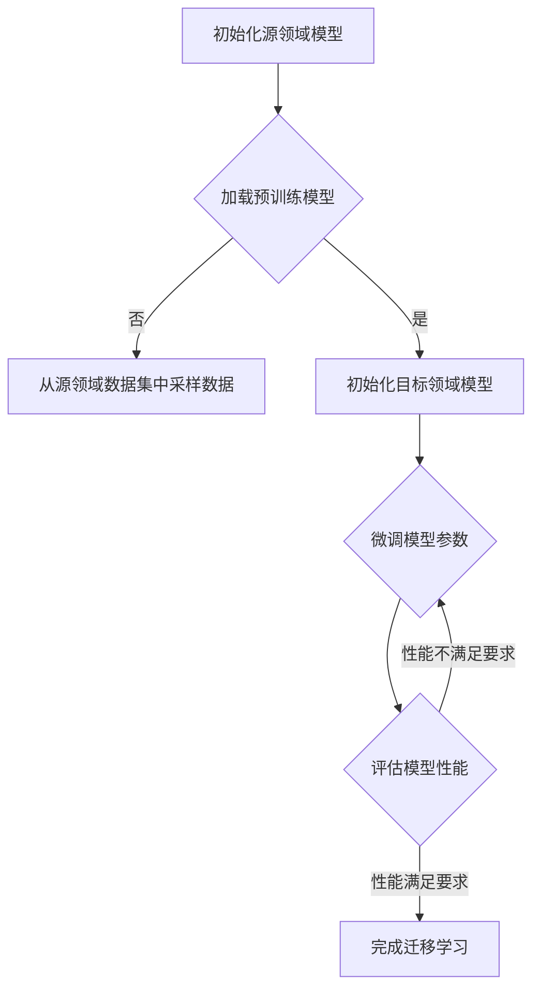

                 

### 第1章 问题背景与核心概念

**1.1 问题背景**

近年来，随着人工智能（AI）技术的迅猛发展，自适应信息生成计算（Adaptive Information Generation Computing，简称AIGC）逐渐成为研究热点。AIGC是一种能够自主生成、优化和解释信息的计算模式，它将机器学习、自然语言处理、计算机视觉等多个领域的技术融合在一起，旨在通过数据驱动的方式，生成具有高价值的信息内容。

AIGC的定义与发展历程：AIGC最早由谷歌在2017年提出，它结合了生成对抗网络（GAN）、自然语言处理（NLP）和计算机视觉等技术，旨在通过数据驱动的方式，实现信息内容的自主生成。随着技术的不断发展，AIGC已经逐渐从理论研究走向实际应用，如自动内容生成、智能客服、智能写作等。

AIGC的核心应用领域：AIGC广泛应用于多个领域，如娱乐、媒体、教育、医疗等。其中，娱乐领域的自动内容生成、媒体领域的智能写作和编辑、教育领域的智能课件生成、医疗领域的辅助诊断等，都是AIGC的重要应用场景。

迁移学习的重要性：在AIGC的发展过程中，迁移学习（Transfer Learning）起到了至关重要的作用。迁移学习是一种利用已有模型的先验知识，在新任务上进行快速训练的方法。它能够解决数据稀缺性和任务多样性问题，极大地提升了模型的泛化能力。

数据稀缺性挑战：在许多应用场景中，高质量的数据集非常稀缺，特别是对于跨领域的应用。迁移学习能够利用已有的数据集，通过模型迁移，在新任务上实现有效的学习。

跨领域数据集整合需求：AIGC往往需要跨领域的多模态数据集，这些数据集在分布、格式和内容上可能存在较大差异。迁移学习能够帮助解决跨领域数据集整合的问题，实现不同领域数据的有效利用。

**1.2 核心概念**

迁移学习原理：迁移学习是一种利用已有模型的先验知识，在新任务上进行快速训练的方法。它包括模型迁移、特征迁移和算法迁移等不同类型。

- 模型迁移：将一个任务上的预训练模型直接迁移到新任务上。
- 特征迁移：将一个任务上的特征表示迁移到新任务上，通过特征融合或特征转换，实现新任务的学习。
- 算法迁移：将一个任务上的算法迁移到新任务上，通过算法融合或算法转换，实现新任务的学习。

AIGC（自适应信息生成计算）基本概念：AIGC是一种能够自主生成、优化和解释信息的计算模式，它将机器学习、自然语言处理、计算机视觉等多个领域的技术融合在一起。

- 自主生成：通过机器学习算法，自动生成具有高价值的信息内容。
- 优化：通过优化算法，不断调整生成内容的质量，使其更符合用户需求。
- 解释：通过解释算法，对生成内容进行解释和说明，提高用户对生成内容的理解和信任。

跨领域与多模态融合：跨领域与多模态融合是AIGC的重要特点。跨领域融合指的是将不同领域的数据集进行整合，实现跨领域的知识共享和协同学习。多模态融合指的是将不同类型的数据（如文本、图像、音频等）进行整合，实现多模态信息的融合和协同处理。

**1.3 迁移学习与AIGC的关系**

跨领域迁移学习在AIGC中的应用：迁移学习在AIGC中的应用主要体现在跨领域数据集的整合和利用。通过迁移学习，可以将一个领域上的预训练模型或特征表示迁移到另一个领域上，实现跨领域的信息共享和协同处理。

迁移学习如何解决跨领域AIGC中的挑战：

- 数据分布差异：通过迁移学习，可以将一个领域上的数据分布迁移到另一个领域上，实现数据分布的调整和匹配，从而提高模型在新领域上的性能。
- 资源与计算限制：迁移学习能够利用已有的模型和特征表示，在新任务上进行快速训练，降低计算资源和时间的消耗。
- 模型解释性与透明性：迁移学习可以提高模型的解释性和透明性，通过迁移已有的模型知识，可以更好地理解模型的决策过程和生成内容。

迁移学习与AIGC的边界与外延：

- 跨领域迁移学习的研究范畴：跨领域迁移学习主要研究如何在不同的领域之间进行知识共享和协同学习，如何解决数据分布差异和资源限制等问题。
- AIGC中的迁移学习发展趋势：随着AIGC技术的发展，迁移学习在AIGC中的应用将更加广泛和深入。未来，迁移学习将结合多模态融合、深度强化学习等技术，实现更高效的跨领域信息生成和优化。

---

**1.1 问题背景**

**跨领域AIGC概述**

**AIGC的定义与发展历程**

自适应信息生成计算（AIGC）是一种先进的计算模式，它结合了生成对抗网络（GAN）、自然语言处理（NLP）和计算机视觉（CV）等多种技术，通过数据驱动的方式实现信息的自主生成、优化和解释。AIGC的概念最早由谷歌在2017年提出，随着人工智能技术的快速发展，AIGC逐渐成为学术界和工业界的研究热点。

AIGC的核心在于其信息生成能力，它不仅能够生成高质量的内容，还能够根据用户的需求进行优化和调整。具体来说，AIGC的应用场景包括但不限于以下几个方面：

1. **自动内容生成**：在媒体、娱乐和游戏等领域，AIGC能够自动生成新闻文章、小说、游戏剧情等，极大地降低了内容创作的成本和时间。
2. **智能客服**：通过AIGC技术，智能客服系统能够自动生成回复，提供更加自然和个性化的客户服务。
3. **教育**：在教育领域，AIGC可以自动生成教学课件、习题和答案，为学生提供个性化的学习资源。
4. **医疗辅助诊断**：AIGC可以通过分析医学影像、病历等数据，为医生提供辅助诊断建议，提高诊断的准确性和效率。

**迁移学习的重要性**

在AIGC的发展过程中，迁移学习起到了至关重要的作用。迁移学习是一种利用已有模型的先验知识，在新任务上进行快速训练的方法。它能够解决数据稀缺性和任务多样性问题，极大地提升了模型的泛化能力。

**数据稀缺性挑战**

对于许多应用场景，高质量的数据集非常稀缺，特别是对于跨领域的应用。例如，在医疗领域，医学影像数据集通常规模较小，而不同类型的医学影像在分布和内容上可能存在较大差异。迁移学习能够利用已有的数据集，通过模型迁移，在新任务上实现有效的学习。

**跨领域数据集整合需求**

AIGC往往需要跨领域的多模态数据集，这些数据集在分布、格式和内容上可能存在较大差异。例如，在自动内容生成领域，可能需要同时处理文本、图像和音频等多模态数据。迁移学习能够帮助解决跨领域数据集整合的问题，实现不同领域数据的有效利用。

**1.2 核心概念**

**迁移学习原理**

迁移学习是一种利用已有模型的先验知识，在新任务上进行快速训练的方法。它包括以下几个核心概念：

1. **基本概念**：

   - **源领域（Source Domain）**：已有模型训练的数据领域。
   - **目标领域（Target Domain）**：新任务需要处理的数据领域。
   - **迁移学习模型**：在源领域训练好的模型，用于在新领域上实现快速训练。

2. **分类**：

   - **基于模型的迁移学习**：直接将源领域上的预训练模型迁移到目标领域。
   - **基于特征的迁移学习**：将源领域上的特征表示迁移到目标领域，通过特征融合或特征转换实现新任务的学习。
   - **基于算法的迁移学习**：将源领域上的算法迁移到目标领域，通过算法融合或算法转换实现新任务的学习。

3. **区别与联系**：

   - **与迁移学习的区别**：传统机器学习主要关注单一任务的学习，而迁移学习则关注多个任务之间的知识共享和迁移。
   - **与迁移学习的联系**：迁移学习可以看作是机器学习中的一种特殊情况，即在不同的任务之间进行知识共享和迁移。

**AIGC（自适应信息生成计算）基本概念**

AIGC是一种能够自主生成、优化和解释信息的计算模式，其核心概念包括：

1. **自主生成**：

   - **生成对抗网络（GAN）**：通过生成器和判别器的对抗训练，实现高质量数据的生成。
   - **生成模型**：包括变分自编码器（VAE）、生成对抗网络（GAN）等，用于生成具有高概率分布的数据。

2. **优化**：

   - **优化算法**：包括梯度下降、随机梯度下降、Adam等，用于调整模型的参数，优化生成内容的质量。

3. **解释**：

   - **解释算法**：通过模型解释技术，如梯度解释、注意力机制等，对生成内容进行解释和说明。

**跨领域与多模态融合**

1. **跨领域融合的意义**：

   - **数据共享与协同学习**：通过跨领域融合，可以实现不同领域数据的有效共享和协同学习，提高模型在不同领域的泛化能力。
   - **知识互补与扩展**：不同领域的知识互补和扩展，可以丰富模型的知识库，提高生成内容的质量和多样性。

2. **多模态融合的方法**：

   - **特征级融合**：将不同模态的数据特征进行拼接或加权融合，形成新的特征向量。
   - **模型级融合**：将不同模态的数据分别输入到不同的模型中，然后通过模型融合方法，如多任务学习、多模型集成等，实现多模态信息的融合。

3. **跨领域与多模态融合的挑战**：

   - **数据分布差异**：不同领域的数据在分布和内容上可能存在较大差异，如何实现数据分布的调整和匹配是一个关键问题。
   - **计算资源和时间限制**：跨领域与多模态融合通常需要大量的计算资源和时间，如何在有限的资源下实现高效的融合是一个挑战。
   - **模型解释性与透明性**：跨领域与多模态融合的模型通常较为复杂，如何提高模型的解释性和透明性，使其更容易被用户理解和信任也是一个关键问题。

**1.3 迁移学习与AIGC的关系**

**跨领域迁移学习在AIGC中的应用**

在AIGC中，跨领域迁移学习的主要应用场景包括：

1. **跨领域数据集整合**：通过跨领域迁移学习，可以将不同领域的知识进行整合和迁移，实现跨领域数据的有效利用。
2. **多模态数据融合**：通过跨领域迁移学习，可以将不同模态的数据（如文本、图像、音频等）进行融合，实现多模态信息的协同处理。
3. **增强模型泛化能力**：通过跨领域迁移学习，可以增强模型的泛化能力，使其在不同领域上都能取得较好的性能。

**迁移学习如何解决跨领域AIGC中的挑战**

1. **数据分布差异**：通过迁移学习，可以将源领域的知识迁移到目标领域，实现数据分布的调整和匹配。例如，通过迁移学习，可以将图像数据中的先验知识迁移到文本数据中，从而提高文本数据的生成质量。
2. **资源与计算限制**：迁移学习可以利用已有的模型和特征表示，在新任务上进行快速训练，降低计算资源和时间的消耗。例如，通过迁移学习，可以将预训练的模型直接迁移到新的任务上，无需从零开始训练。
3. **模型解释性与透明性**：迁移学习可以提高模型的解释性和透明性，通过迁移已有的模型知识，可以更好地理解模型的决策过程和生成内容。例如，通过迁移学习，可以将预训练模型中的注意力机制迁移到新的任务上，从而更好地解释生成内容的关键因素。

**迁移学习与AIGC的边界与外延**

1. **跨领域迁移学习的研究范畴**：

   - **跨领域数据集整合**：研究如何将不同领域的数据集进行整合和利用，实现跨领域的知识共享和协同学习。
   - **多模态数据融合**：研究如何将不同模态的数据进行融合，实现多模态信息的协同处理。
   - **增强模型泛化能力**：研究如何通过迁移学习，增强模型在不同领域的泛化能力。

2. **AIGC中的迁移学习发展趋势**：

   - **多模态迁移学习**：随着多模态数据的广泛应用，如何实现多模态数据的迁移学习将成为研究的热点。
   - **深度迁移学习**：结合深度学习技术，发展更高效、更鲁棒的迁移学习算法。
   - **跨领域AIGC应用**：探索跨领域AIGC在不同领域的应用，如医疗、金融、教育等。

### 第2章 迁移学习原理

**2.1 迁移学习基础**

**定义与分类**

迁移学习（Transfer Learning）是一种利用已有模型或特征的知识，在新任务上进行快速训练的方法。它的核心思想是，通过将源领域的知识迁移到目标领域，提高模型在新任务上的性能。

**分类**

迁移学习可以根据迁移方式的不同，分为以下几种类型：

1. **基于模型的迁移学习**：将源领域的预训练模型直接迁移到目标领域。这种方法通常用于模型结构较为相似的任务之间。
2. **基于特征的迁移学习**：将源领域的特征表示迁移到目标领域，通过特征融合或特征转换实现新任务的学习。这种方法适用于特征表示具有较强迁移性的情况。
3. **基于算法的迁移学习**：将源领域的算法迁移到目标领域，通过算法融合或算法转换实现新任务的学习。这种方法适用于算法本身具有较强的泛化能力。

**与传统机器学习的区别**

传统机器学习主要关注单一任务的学习，而迁移学习则关注多个任务之间的知识共享和迁移。具体来说，迁移学习与传统机器学习有以下区别：

1. **数据依赖**：传统机器学习通常依赖于大量高质量的数据集，而迁移学习可以利用已有的数据集，减少对数据量的依赖。
2. **训练效率**：迁移学习可以利用预训练模型或特征表示，在新任务上进行快速训练，提高训练效率。
3. **模型泛化能力**：迁移学习通过跨任务的知识共享，可以增强模型的泛化能力，提高在新任务上的性能。

**2.2 迁移学习技术**

**早期融合**

早期融合（Early Fusion）是一种常见的迁移学习技术，它的核心思想是在特征级别上直接融合来自源领域的特征和目标领域的特征。具体方法如下：

1. **特征提取**：在源领域和目标领域分别提取特征。
2. **特征融合**：将源领域的特征和目标领域的特征进行拼接或加权融合，形成新的特征向量。
3. **模型训练**：使用新的特征向量训练目标领域的模型。

早期融合的优点是简单易实现，缺点是它可能无法充分利用源领域的知识，特别是在源领域和目标领域特征差异较大的情况下。

**模型适配**

模型适配（Model Adaptation）是一种通过微调预训练模型来适应新任务的方法。具体步骤如下：

1. **预训练模型**：在源领域上使用大量数据进行预训练，获得一个通用的预训练模型。
2. **迁移**：将预训练模型迁移到目标领域，并保留部分预训练模型的权重。
3. **微调**：在目标领域上使用少量数据进行微调，调整模型参数，使其适应新任务。

模型适配的优点是能够充分利用源领域的知识，提高模型在新任务上的性能。缺点是需要大量的目标领域数据，否则难以实现有效的迁移。

**优化算法**

优化算法（Optimization Algorithm）是迁移学习中的重要技术，它用于调整模型参数，提高模型在新任务上的性能。以下是一些常见的优化算法：

1. **随机梯度下降（SGD）**：一种基本的优化算法，通过计算梯度来更新模型参数。
2. **Adam优化器**：一种自适应的优化算法，能够根据不同的参数更新速率来调整学习率。
3. **AdamW优化器**：在Adam优化器的基础上，加入权重衰减项，进一步提高模型的性能。

**2.3 迁移学习算法原理**

**算法mermaid流程图**



**Python源代码实现**

```python
import torch
import torch.nn as nn
import torch.optim as optim

# 初始化源领域模型
source_model = nn.Sequential(
    nn.Linear(input_size, hidden_size),
    nn.ReLU(),
    nn.Linear(hidden_size, output_size)
)

# 加载预训练模型
pretrained_model = torch.load("pretrained_model.pth")
source_model.load_state_dict(pretrained_model.state_dict())

# 初始化目标领域模型
target_model = nn.Sequential(
    nn.Linear(input_size, hidden_size),
    nn.ReLU(),
    nn.Linear(hidden_size, output_size)
)

# 微调模型参数
optimizer = optim.Adam(target_model.parameters(), lr=0.001)
criterion = nn.CrossEntropyLoss()

for epoch in range(num_epochs):
    for inputs, targets in source_dataloader:
        optimizer.zero_grad()
        outputs = target_model(inputs)
        loss = criterion(outputs, targets)
        loss.backward()
        optimizer.step()

    # 评估模型性能
    with torch.no_grad():
        correct = 0
        total = 0
        for inputs, targets in target_dataloader:
            outputs = target_model(inputs)
            _, predicted = torch.max(outputs.data, 1)
            total += targets.size(0)
            correct += (predicted == targets).sum().item()

    print(f'Epoch [{epoch+1}/{num_epochs}], Accuracy: {100 * correct / total}%')

# 保存迁移学习后的模型
torch.save(target_model.state_dict(), "target_model.pth")
```

**数学模型与公式**

在迁移学习中，常用的数学模型包括损失函数、梯度下降算法等。以下是迁移学习中的数学模型和公式：

1. **损失函数**

   $$ L = \frac{1}{N} \sum_{i=1}^{N} (-y_i \log(\hat{y}_i)) $$

   其中，\( y_i \)为真实标签，\( \hat{y}_i \)为预测标签。

2. **梯度下降算法**

   $$ \theta_{t+1} = \theta_{t} - \alpha \nabla_{\theta} L(\theta) $$

   其中，\( \theta \)为模型参数，\( \alpha \)为学习率，\( \nabla_{\theta} L(\theta) \)为损失函数关于模型参数的梯度。

**详细讲解与举例说明**

**迁移学习的原理**

迁移学习的核心思想是，通过将源领域的知识迁移到目标领域，提高模型在新任务上的性能。具体来说，迁移学习可以分为以下几个步骤：

1. **预训练模型**：在源领域上使用大量数据进行预训练，获得一个通用的预训练模型。
2. **迁移**：将预训练模型迁移到目标领域，并保留部分预训练模型的权重。
3. **微调**：在目标领域上使用少量数据进行微调，调整模型参数，使其适应新任务。

**举例说明**

假设我们有一个源领域模型和一个目标领域模型，分别用于分类任务。源领域模型在源领域上进行了预训练，而目标领域模型需要在目标领域上进行训练。

1. **预训练模型**：

   在源领域上，我们使用了一组数据集进行预训练，得到了一个预训练模型。预训练模型已经学到了一些通用的特征表示，这些特征表示对于不同的分类任务都是有效的。

2. **迁移**：

   我们将预训练模型的权重迁移到目标领域模型上，使得目标领域模型在初始化时就已经具有了一定的知识。这样可以减少目标领域模型的训练时间，并提高其性能。

3. **微调**：

   在目标领域上，我们使用了一组数据集对目标领域模型进行微调。微调的目的是调整模型参数，使其更好地适应目标领域的任务。通常，我们只对目标领域模型的少数层进行微调，以避免过度拟合。

**迁移学习的效果**

通过迁移学习，我们可以看到以下几个效果：

1. **提高训练效率**：由于目标领域模型已经具备了部分源领域的知识，因此可以在较少的数据上快速训练，减少训练时间。
2. **提高模型性能**：迁移学习可以使得目标领域模型在新的任务上取得更好的性能，特别是在数据稀缺的情况下。
3. **降低数据需求**：迁移学习可以减少对高质量数据集的依赖，因为可以利用已有的预训练模型进行迁移。

**实际应用**

迁移学习在许多领域都有广泛的应用，如计算机视觉、自然语言处理等。以下是一些实际应用的例子：

1. **计算机视觉**：在图像分类任务中，可以使用预训练的卷积神经网络（CNN）模型，然后在新的数据集上进行微调，以适应不同的分类任务。
2. **自然语言处理**：在文本分类任务中，可以使用预训练的语言模型（如BERT、GPT等），然后在新的数据集上进行微调，以提高分类性能。

通过以上讲解，我们可以看到迁移学习在跨领域AIGC中的作用是非常重要的。它不仅能够解决数据稀缺性和任务多样性问题，还能够提高模型的泛化能力和训练效率，为AIGC的发展提供了有力的支持。

### 第3章 AIGC基础

**3.1 AIGC概述**

**定义与核心概念**

自适应信息生成计算（AIGC）是一种先进的计算模式，它结合了生成对抗网络（GAN）、自然语言处理（NLP）和计算机视觉（CV）等多种技术，通过数据驱动的方式实现信息的自主生成、优化和解释。AIGC的核心概念包括以下几个方面：

1. **生成对抗网络（GAN）**：GAN是一种由生成器和判别器组成的对抗性模型，通过不断地对抗训练，生成高质量的数据。
2. **自然语言处理（NLP）**：NLP是研究计算机如何理解、生成和处理人类语言的技术，包括文本分类、情感分析、机器翻译等任务。
3. **计算机视觉（CV）**：CV是研究如何使计算机能够从图像或视频中提取信息的技术，包括图像分类、目标检测、图像生成等任务。

**应用领域**

AIGC在多个领域都有广泛的应用，以下是一些典型的应用场景：

1. **自动内容生成**：在媒体、娱乐和游戏等领域，AIGC可以自动生成新闻文章、小说、游戏剧情等，极大地降低了内容创作的成本和时间。
2. **智能客服**：通过AIGC技术，智能客服系统能够自动生成回复，提供更加自然和个性化的客户服务。
3. **教育**：在教育领域，AIGC可以自动生成教学课件、习题和答案，为学生提供个性化的学习资源。
4. **医疗辅助诊断**：AIGC可以通过分析医学影像、病历等数据，为医生提供辅助诊断建议，提高诊断的准确性和效率。

**3.2 AIGC系统架构**

**数据预处理**

数据预处理是AIGC系统架构中的关键步骤，它主要包括以下任务：

1. **数据清洗**：去除数据中的噪声和错误，保证数据的准确性。
2. **数据归一化**：将不同来源的数据进行归一化处理，使其具有相同的尺度，便于后续的模型训练。
3. **数据增强**：通过数据增强技术，增加数据集的多样性，提高模型的泛化能力。

**模型训练**

模型训练是AIGC系统架构的核心环节，它主要包括以下步骤：

1. **模型初始化**：初始化生成器和判别器的参数。
2. **对抗训练**：生成器和判别器通过对抗训练，不断调整参数，生成高质量的数据。
3. **优化算法**：使用优化算法（如梯度下降、Adam等）调整模型参数，提高模型性能。

**生成与优化**

生成与优化是AIGC系统架构的最终目标，它主要包括以下任务：

1. **内容生成**：生成器生成具有高质量的数据，如图像、文本等。
2. **内容优化**：通过优化算法，调整生成内容的质量，使其更符合用户需求。
3. **内容解释**：对生成内容进行解释和说明，提高用户对生成内容的理解和信任。

**3.3 多模态融合**

**多模态数据表示**

多模态融合的第一步是进行多模态数据表示。多模态数据表示的核心是将不同类型的数据（如文本、图像、音频等）转换为统一的向量表示，以便于后续的融合和处理。

1. **文本表示**：常见的文本表示方法包括词向量（如Word2Vec、GloVe）、嵌入层（如BERT）等。
2. **图像表示**：常见的图像表示方法包括卷积神经网络（CNN）、特征提取（如VGG、ResNet）等。
3. **音频表示**：常见的音频表示方法包括梅尔频率倒谱系数（MFCC）、短时傅里叶变换（STFT）等。

**多模态学习算法**

多模态融合的关键是设计有效的多模态学习算法，以下是一些常见的方法：

1. **特征级融合**：将不同模态的数据特征进行拼接或加权融合，形成新的特征向量。
2. **模型级融合**：将不同模态的数据分别输入到不同的模型中，然后通过模型融合方法，如多任务学习、多模型集成等，实现多模态信息的融合和协同处理。
3. **对抗性多模态学习**：通过对抗性训练，学习不同模态之间的映射关系，提高多模态融合的效果。

**跨领域与多模态融合的挑战**

1. **数据分布差异**：不同领域的数据在分布和内容上可能存在较大差异，如何实现数据分布的调整和匹配是一个关键问题。
2. **计算资源和时间限制**：跨领域与多模态融合通常需要大量的计算资源和时间，如何在有限的资源下实现高效的融合是一个挑战。
3. **模型解释性与透明性**：跨领域与多模态融合的模型通常较为复杂，如何提高模型的解释性和透明性，使其更容易被用户理解和信任也是一个关键问题。

### 第4章 跨领域AIGC中的迁移学习应用

**4.1 跨领域迁移学习挑战**

在跨领域AIGC中，迁移学习面临以下主要挑战：

**数据分布差异**

跨领域数据集之间的分布差异是迁移学习中的一个关键挑战。源领域和目标领域的数据分布可能存在显著差异，这会导致迁移学习模型在新领域上的性能下降。例如，图像分类任务中的源领域数据可能主要来自静态图像，而目标领域数据可能主要来自动态视频，这两种数据在分布上存在显著差异。

**资源限制**

在许多实际应用中，迁移学习面临的另一个挑战是资源限制。迁移学习通常需要大量的计算资源和时间，特别是在处理大型数据集和复杂模型时。资源限制可能会限制迁移学习算法的有效应用。

**数据质量**

跨领域数据集的质量可能不一致。数据质量差可能会导致迁移学习模型在训练过程中出现偏差，从而影响模型在新领域的性能。

**4.2 跨领域迁移学习策略**

**自适应迁移学习**

自适应迁移学习是一种通过动态调整模型参数来适应新领域的方法。这种方法的核心思想是，在迁移学习过程中，根据目标领域的反馈实时调整模型参数，使其更好地适应新领域的数据分布。以下是一些常见的技术：

1. **在线迁移学习**：在线迁移学习允许模型在训练过程中不断更新，以适应新的数据。这种方法特别适用于数据分布变化较大的场景。

2. **基于模型的适应**：通过修改模型的架构或调整模型参数，使模型更好地适应新领域的特性。例如，可以调整神经网络的层数、层宽度和激活函数等。

**对抗迁移学习**

对抗迁移学习是一种通过对抗性训练来减少数据分布差异的方法。这种方法利用生成对抗网络（GAN）来生成与目标领域数据分布相似的数据，从而帮助模型更好地适应新领域。以下是一些常见的技术：

1. **生成对抗网络（GAN）**：GAN通过生成器和判别器的对抗训练，生成与目标领域数据分布相似的数据，从而帮助模型学习目标领域的特征。

2. **对抗性样本生成**：通过生成对抗性样本，使模型能够更好地学习目标领域的分布。对抗性样本可以是通过对抗性攻击生成，也可以是通过优化对抗性损失函数生成。

**多任务迁移学习**

多任务迁移学习通过同时训练多个相关任务来提高模型的迁移能力。这种方法可以共享不同任务之间的知识，从而提高模型在多个领域上的性能。以下是一些常见的技术：

1. **多任务学习框架**：将多个任务整合到一个统一的模型框架中，通过共享底层特征表示来提高迁移效果。

2. **任务重要性加权**：根据任务的重要性和数据分布，动态调整任务权重，使模型在训练过程中更好地关注关键任务。

**4.3 跨领域AIGC案例分析**

**成功案例**

以下是一些跨领域AIGC的成功案例：

1. **医学影像诊断**：在医学影像领域，跨领域迁移学习被用于将影像数据从一个领域（如胸部X光片）迁移到另一个领域（如腹部CT扫描）。通过迁移学习，模型能够利用胸部X光片中的先验知识，提高对腹部CT扫描数据的诊断准确性。

2. **语音识别**：在语音识别领域，跨领域迁移学习被用于将一个语音识别模型从一个语言（如英语）迁移到另一个语言（如法语）。通过迁移学习，模型能够利用英语语音数据中的先验知识，提高对法语语音数据的识别准确性。

**挑战与解决方案**

1. **数据分布差异**：解决方案包括使用对抗迁移学习来生成与目标领域数据分布相似的数据，或者采用多任务迁移学习来共享不同任务之间的知识。

2. **资源限制**：解决方案包括使用轻量级模型和优化算法来减少计算资源和时间的消耗，或者采用增量迁移学习来逐步适应新领域。

3. **数据质量**：解决方案包括使用数据增强技术来提高数据质量，或者采用数据清洗和预处理技术来减少数据中的噪声和错误。

通过这些案例和解决方案，我们可以看到跨领域迁移学习在AIGC中的应用是非常有效和有前途的。它不仅能够解决跨领域AIGC中的挑战，还能够提高模型在多个领域上的性能，为AIGC的发展提供了重要的支持。

### 第5章 迁移学习在多模态AIGC中的应用

**5.1 多模态AIGC概述**

**多模态数据处理**

多模态AIGC涉及到多种类型的数据，包括文本、图像、音频和视频等。每种数据类型都有其独特的处理方法，以确保数据能够被有效融合和利用。

**文本处理**：文本数据通常通过自然语言处理（NLP）技术进行预处理。这包括分词、词性标注、命名实体识别和句法分析等步骤，以提取文本中的重要信息和特征。

**图像处理**：图像数据通过计算机视觉（CV）技术进行预处理。这包括图像增强、目标检测、分割和特征提取等步骤，以提取图像中的重要视觉特征。

**音频处理**：音频数据通过信号处理技术进行预处理。这包括去噪、音高提取、节奏分析和语音识别等步骤，以提取音频中的重要音频特征。

**视频处理**：视频数据通过计算机视觉和视频分析技术进行预处理。这包括视频分割、目标跟踪、动作识别和视频生成等步骤，以提取视频中的重要视觉和动作特征。

**多模态迁移学习**

**多模态迁移学习**是将迁移学习技术应用于多个模态的数据处理和融合中。其核心思想是通过利用一个模态的先验知识，提高其他模态数据的处理效果。

**多模态迁移学习的优势**

1. **提高模型性能**：通过利用一个模态的先验知识，多模态迁移学习可以显著提高其他模态数据的处理性能，特别是在数据稀缺的情况下。
2. **增强泛化能力**：多模态迁移学习可以增强模型的泛化能力，使其能够更好地处理不同模态的数据。
3. **降低训练成本**：通过利用已有的模型知识，多模态迁移学习可以减少训练数据的需求，降低训练成本。

**多模态迁移学习算法**

**图像与文本融合**

图像与文本融合是多模态迁移学习的常见应用之一。以下是一些常用的算法：

1. **多任务学习**：通过将图像分类和文本分类任务整合到一个统一的模型中，共享图像和文本特征，提高模型的泛化能力。
2. **多模态嵌入**：将图像和文本分别嵌入到高维空间中，然后通过矩阵乘法或注意力机制进行融合，生成多模态特征向量。
3. **对抗性训练**：通过对抗性训练，生成与真实数据分布相似的多模态数据，从而提高模型在多模态数据上的性能。

**视频与音频融合**

视频与音频融合是多模态迁移学习的另一个重要应用。以下是一些常用的算法：

1. **多模态特征提取**：分别从视频和音频中提取特征，如视觉特征（如卷积神经网络提取的特征）和音频特征（如梅尔频率倒谱系数（MFCC））。
2. **特征级融合**：将视频和音频的特征进行拼接或加权融合，形成新的特征向量。
3. **模型级融合**：使用多任务学习或多模型集成方法，将视频和音频的特征输入到不同的模型中，然后通过模型融合方法进行融合。

**多模态AIGC应用案例**

**自然语言处理**

自然语言处理（NLP）是AIGC的一个重要应用领域。以下是一些多模态AIGC在NLP中的案例：

1. **多模态问答系统**：结合图像和文本数据，多模态AIGC可以生成更准确、更自然的问答系统。
2. **情感分析**：通过融合图像和文本数据，多模态AIGC可以更准确地识别情感，提高情感分析的准确性。

**计算机视觉**

计算机视觉是AIGC的另一个重要应用领域。以下是一些多模态AIGC在计算机视觉中的案例：

1. **图像识别**：结合文本描述，多模态AIGC可以更好地识别图像中的物体和场景。
2. **目标跟踪**：通过融合视频和音频数据，多模态AIGC可以更准确地跟踪视频中的目标。

**多媒体内容生成**

多媒体内容生成是AIGC的另一个重要应用领域。以下是一些多模态AIGC在多媒体内容生成中的案例：

1. **视频生成**：结合图像和文本描述，多模态AIGC可以生成具有丰富内容和情节的视频。
2. **音频生成**：通过融合图像和文本描述，多模态AIGC可以生成具有情感和场景的音频内容。

通过这些案例，我们可以看到多模态迁移学习在AIGC中的应用是非常广泛和有前途的。它不仅能够提高模型在多个模态数据上的性能，还能够为AIGC的发展提供新的方向和思路。

### 第6章 迁移学习在AIGC中的未来趋势

**6.1 研究进展与趋势**

随着AIGC技术的发展，迁移学习在其中的应用也取得了显著的进展。以下是一些最新的研究进展和趋势：

**跨领域迁移学习的优化算法**

近年来，研究者们提出了许多优化算法来提高跨领域迁移学习的效果。这些算法包括基于梯度下降的优化算法、基于随机梯度的优化算法和基于深度强化学习的优化算法等。例如，元学习（Meta-Learning）和自适应优化算法（Adaptive Optimization Algorithms）被认为是提高跨领域迁移学习效果的有效手段。

**多模态迁移学习的集成方法**

多模态迁移学习的另一个重要趋势是集成方法的研究。通过将多种迁移学习方法（如基于模型的迁移学习、基于特征的迁移学习和基于算法的迁移学习）进行集成，可以进一步提高模型在多模态数据上的性能。例如，多任务学习（Multi-Task Learning）和多模型集成（Multi-Model Ensemble）等方法已经被广泛应用于多模态迁移学习中。

**个性化迁移学习**

个性化迁移学习是迁移学习在AIGC中的一个重要研究方向。个性化迁移学习旨在根据用户的需求和偏好，为每个用户提供定制化的服务。例如，通过用户历史数据和个性化反馈，可以动态调整迁移学习模型，使其更好地适应用户的需求。

**跨领域AIGC的前沿应用**

跨领域AIGC的前沿应用正在不断拓展。例如，在医疗领域，跨领域AIGC可以结合医学影像、电子病历和基因组数据，为医生提供个性化的诊断和治疗建议。在金融领域，跨领域AIGC可以结合客户交易数据、社交媒体数据和新闻数据，为金融机构提供实时风险分析和决策支持。此外，在智能教育、智能娱乐和智能制造等领域，跨领域AIGC也展现了巨大的应用潜力。

**6.2 技术挑战与解决方案**

尽管迁移学习在AIGC中取得了显著的进展，但仍面临一些技术挑战：

**数据集建设**

数据集是迁移学习的基础。然而，许多应用领域的数据集建设仍然存在困难。解决方案包括：

1. **数据增强**：通过数据增强技术，增加数据集的多样性，提高模型的泛化能力。
2. **数据共享**：鼓励数据共享和开放，以构建更大规模、更高质量的数据集。

**模型解释性**

迁移学习模型的解释性是一个重要的挑战。特别是在跨领域和多模态的情况下，如何解释模型生成的结果成为一个关键问题。解决方案包括：

1. **模型解释技术**：例如，基于梯度的解释方法、注意力机制和可视化技术等。
2. **可解释性模型**：开发可解释性更强的迁移学习模型，使其更容易被用户理解和信任。

**资源消耗**

迁移学习通常需要大量的计算资源和时间。特别是在处理大规模数据集和复杂模型时，资源消耗成为一个关键问题。解决方案包括：

1. **轻量级模型**：开发计算效率更高的轻量级迁移学习模型，以减少资源消耗。
2. **分布式训练**：通过分布式训练技术，将训练任务分配到多个计算节点上，以减少训练时间。

**6.3 未来发展方向**

**新兴领域的探索**

随着技术的不断发展，迁移学习在新兴领域的应用潜力也在不断拓展。例如，在生物信息学、天文学和地理信息科学等领域，迁移学习可以发挥重要作用。通过结合领域特定的数据和知识，迁移学习可以推动这些领域的研究和发展。

**社会与伦理问题**

迁移学习在AIGC中的应用也引发了一些社会和伦理问题。例如，如何确保模型生成的结果公平、透明和可靠？如何处理跨领域数据集的隐私和安全问题？这些问题需要深入研究和解决。

总之，迁移学习在AIGC中的未来发展趋势充满机遇和挑战。通过不断探索新技术、解决技术挑战和关注社会伦理问题，迁移学习将为AIGC的发展注入新的动力。

### 第7章 最佳实践与总结

**7.1 迁移学习在AIGC中的最佳实践**

**案例分享**

以下是一些在AIGC中运用迁移学习的最佳实践案例：

1. **医疗影像诊断**：通过迁移学习，将预训练的卷积神经网络（CNN）模型应用于不同类型的医学影像，如X光片、CT扫描和MRI图像。这些模型利用源领域（如公开的医学影像数据集）中的知识，在新领域上（如特定医院或疾病类型）实现了高准确性的诊断。

2. **智能客服系统**：在智能客服系统中，使用迁移学习将预训练的自然语言处理（NLP）模型应用于不同的对话场景。例如，将聊天机器人在一个行业（如金融）中的对话经验迁移到另一个行业（如医疗），从而提高了客服系统在不同领域的表现。

**技术选型**

在迁移学习技术选型时，应考虑以下几个方面：

1. **数据特点**：根据数据集的特点选择合适的迁移学习方法。例如，对于数据量较大的场景，可以选择基于特征的迁移学习；对于数据量较小的场景，可以选择基于模型的迁移学习。

2. **任务需求**：根据任务的需求选择迁移学习的策略。例如，对于需要高解释性的任务，可以选择可解释性更强的迁移学习模型；对于需要快速部署的任务，可以选择轻量级迁移学习模型。

**7.2 小结**

**迁移学习在AIGC中的作用与贡献**

迁移学习在AIGC中发挥着至关重要的作用。通过迁移学习，可以实现：

1. **提高模型性能**：利用已有的模型知识，迁移学习可以显著提高新任务上的模型性能。

2. **减少数据需求**：迁移学习可以减少对大规模高质量数据集的依赖，特别是在数据稀缺的情况下。

3. **提高训练效率**：通过迁移学习，可以在较少的数据上快速训练模型，提高训练效率。

4. **增强泛化能力**：迁移学习可以增强模型的泛化能力，使其在不同领域上都能取得较好的性能。

**7.3 注意事项**

在实施迁移学习时，需要注意以下几点：

1. **数据分布**：确保源领域和目标领域的数据分布相似，否则可能会导致迁移效果不佳。

2. **数据质量**：确保数据集的质量，包括数据清洗、去噪和增强等步骤。

3. **模型选择**：根据任务需求和数据特点选择合适的迁移学习模型。

4. **资源消耗**：考虑资源消耗，特别是在处理大规模数据集和复杂模型时。

**7.4 拓展阅读**

以下是一些推荐的研究文献和资源，供进一步学习和研究：

1. **《迁移学习》（Transfer Learning）：**这是一本关于迁移学习的经典教材，详细介绍了迁移学习的理论基础和实际应用。
2. **《自适应信息生成计算》（Adaptive Information Generation Computing）：**这是一本关于AIGC的综合性教材，涵盖了AIGC的基本概念、系统架构和应用场景。
3. **《多模态迁移学习》（Multimodal Transfer Learning）：**这是一本关于多模态迁移学习的专着，详细介绍了多模态迁移学习的方法和应用。
4. **GitHub开源项目**：许多迁移学习和AIGC的开源项目可以在GitHub上找到，如基于TensorFlow和PyTorch的迁移学习框架等。
5. **学术会议与期刊**：如NeurIPS、ICLR和AAAI等学术会议，以及Journal of Machine Learning Research（JMLR）和IEEE Transactions on Pattern Analysis and Machine Intelligence（TPAMI）等期刊，是了解迁移学习和AIGC最新研究进展的重要渠道。

通过以上最佳实践、小结和注意事项，我们可以更好地理解迁移学习在AIGC中的应用，并为其未来的发展提供指导。

