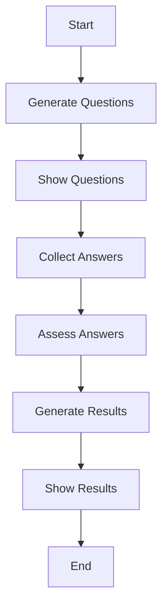
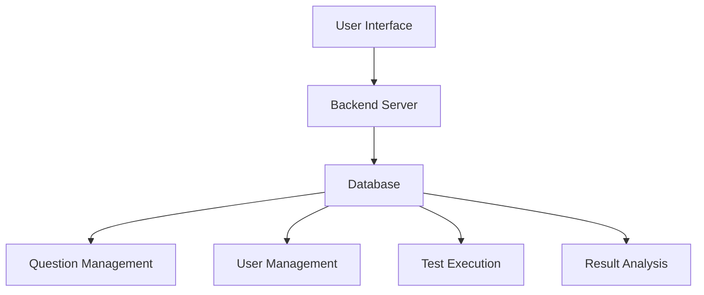
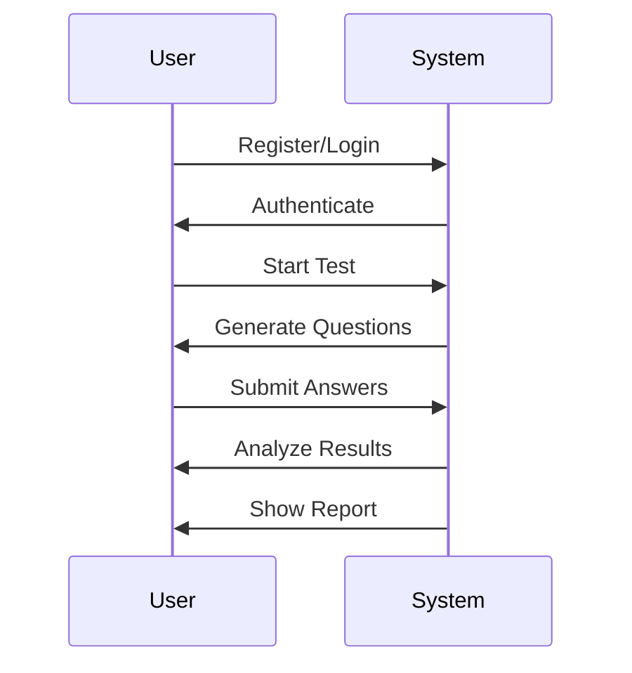

                 

# 逻辑推理能力测试：评估模型思考深度

## 关键词

- 逻辑推理能力测试
- 评估模型
- 测试算法
- 数学模型
- 系统架构设计
- 项目实战

## 摘要

本文旨在探讨逻辑推理能力测试在IT领域的应用。通过介绍逻辑推理能力测试的背景、核心概念、算法原理、系统设计与实战案例，本文旨在提供一个清晰、系统的评估模型，帮助读者深入了解逻辑推理能力测试的深度与广度，为相关研究和实践提供参考。

## 第一部分：背景介绍

### 第1章 问题背景

#### 1.1 逻辑推理在生活中的重要性

逻辑推理是人们在日常决策、问题解决和沟通交流中不可或缺的思维能力。它不仅帮助我们分析问题、找出解决方案，还影响我们的人际关系、职业发展和社会适应能力。然而，传统教育中往往忽视逻辑推理能力的培养，导致很多人在实际生活中缺乏有效的逻辑思维能力。

#### 1.2 逻辑推理能力测试的需求

随着信息技术的发展，逻辑推理能力在IT领域变得尤为重要。编程、算法设计、系统架构等方面都需要较强的逻辑思维能力。因此，对逻辑推理能力的测试与评估成为一个迫切的需求。通过科学、系统的测试模型，我们可以了解个人的逻辑推理水平，针对性地提升自己的能力，从而在职业竞争中脱颖而出。

### 第2章 逻辑推理能力的评估现状

#### 2.1 传统评估方法

目前，逻辑推理能力的评估主要依赖于笔试、面试等传统方式。这些方法存在一定局限性，如主观性较强、测试内容不全面等。此外，传统评估方法往往侧重于知识点的考核，而忽略了逻辑推理能力的培养和提升。

#### 2.2 当前存在的问题

（1）测试内容过于简单，难以全面评估逻辑推理能力。
（2）测试形式单一，缺乏互动性和实际应用性。
（3）评估结果难以量化，无法准确反映逻辑推理能力的深浅。

## 第二部分：核心概念与联系

### 第3章 核心概念

#### 3.1 逻辑推理

逻辑推理是指基于已知信息，通过分析、比较、归纳、演绎等思维方式，推导出新的结论或判断的过程。逻辑推理能力包括逻辑思维、推理能力、判断力等多个方面。

#### 3.2 测试模型

测试模型是指用于评估逻辑推理能力的工具和方法。一个有效的测试模型应具备全面性、科学性、可操作性等特点。

### 第4章 概念属性特征对比表格

| 模型名称     | 特点                           | 适用场景             |
|------------|------------------------------|---------------------|
| 图灵测试     | 评估机器的智能水平             | 人工智能研究与应用   |
| 维特根斯坦测试 | 评估哲学思维和语言表达       | 哲学、语言学等领域   |
| 约翰·洛克测试 | 评估逻辑推理和论证能力       | 法律、逻辑学等领域   |
| IT逻辑推理测试 | 评估程序员的逻辑思维能力     | IT行业职业发展评估   |

### 第5章 ER实体关系图架构

ER实体关系图用于描述逻辑推理能力测试的数据库设计，包括实体、属性和关系的定义。以下是ER实体关系图：

```mermaid
erDiagram
    User ||--|{ TestResult } : "has"
    Test ||--|{ TestResult } : "has"
    Question ||--|{ TestResult } : "answered by"
```

## 第三部分：算法原理讲解

### 第6章 算法原理

#### 6.1 算法简介

本测试算法旨在通过一系列逻辑推理问题，评估测试者的逻辑思维能力。算法包括问题生成、答案评估和结果输出三个主要模块。

#### 6.2 算法流程图



### 第7章 算法数学模型

#### 7.1 数学模型

算法的数学模型主要涉及概率论和数理统计。以下是算法的核心数学公式：

$$
P(A|B) = \frac{P(B|A) \cdot P(A)}{P(B)}
$$

其中，$P(A|B)$ 表示在事件B发生的条件下，事件A发生的概率。

#### 7.2 详细讲解

算法首先根据测试者的特征生成适合的问题，然后测试者回答问题。系统根据答案评估测试者的逻辑思维能力，最终输出测试结果。具体流程如下：

1. 问题生成：根据测试者的特征（如年龄、教育背景等）生成适合的逻辑推理问题。
2. 答题：测试者回答问题，系统收集答案。
3. 评估：系统根据答案评估测试者的逻辑思维能力，计算得分。
4. 输出结果：系统输出测试结果，包括得分、能力评估等。

### 第8章 举例说明

#### 8.1 示例问题

小明在雨中行走，他发现地面上有水坑。他想知道哪些地方有水坑，以便避免摔倒。请问，小明应该怎么做？

#### 8.2 解题过程

1. 分析问题：小明需要找到有水坑的地方，以便避免摔倒。
2. 设定假设：小明假设有水坑的地方有积水。
3. 演绎推理：根据假设，小明可以观察地面是否有积水来判断是否有水坑。
4. 验证假设：小明在地面上找到了积水，因此他得出结论：有积水的地方可能有水坑。

使用Python代码实现上述逻辑推理过程：

```python
def find_potholes(weather, ground_state):
    if weather == "rain" and ground_state == "wet":
        return "可能有水坑"
    else:
        return "没有水坑"

weather = "rain"
ground_state = "wet"
print(find_potholes(weather, ground_state))
```

输出结果：可能有水坑

## 第四部分：系统分析与架构设计

### 第9章 问题场景介绍

逻辑推理能力测试适用于以下场景：

1. 职业选拔：评估应聘者的逻辑思维能力，帮助招聘者做出更准确的决策。
2. 职业培训：为员工提供个性化的培训方案，提升其逻辑推理能力。
3. 教育评估：评估学生的逻辑思维能力，为教学提供反馈。

### 第10章 系统功能设计

系统功能设计包括以下几个方面：

1. 题库管理：维护和管理逻辑推理题目，包括题目生成、分类、难度调整等。
2. 用户管理：用户注册、登录、权限管理等功能。
3. 测试执行：执行逻辑推理测试，收集测试结果。
4. 结果分析：分析测试结果，生成报告。

### 第11章 系统架构设计

系统采用B/S架构，主要包括前端、后端和数据库三个部分。前端负责用户交互，后端负责业务逻辑处理，数据库存储测试题目和用户数据。

以下是系统架构图：



### 第12章 系统交互

系统交互流程如下：

1. 用户注册/登录：用户通过前端界面注册/登录系统。
2. 题目生成：系统根据用户特征生成适合的题目。
3. 测试执行：用户回答题目，系统收集答案。
4. 结果分析：系统分析测试结果，生成报告。
5. 报告展示：用户在前端界面查看测试报告。

以下是系统交互序列图：



## 第五部分：项目实战

### 第13章 环境安装

安装逻辑推理能力测试系统需要以下环境：

1. Python 3.8及以上版本
2. MySQL数据库
3. Flask框架

安装步骤如下：

1. 安装Python：从Python官方网站下载安装包，按照提示安装。
2. 安装MySQL数据库：从MySQL官方网站下载安装包，按照提示安装。
3. 安装Flask框架：在终端执行命令 `pip install flask`。

### 第14章 系统核心实现

系统核心实现包括以下几个方面：

1. 题库管理模块：负责题目的生成、分类、难度调整等功能。
2. 用户管理模块：负责用户的注册、登录、权限管理等功能。
3. 测试执行模块：负责逻辑推理测试的执行、答案收集等功能。
4. 结果分析模块：负责测试结果的分析、报告生成等功能。

以下是题库管理模块的核心代码：

```python
class Question:
    def __init__(self, id, content, difficulty):
        self.id = id
        self.content = content
        self.difficulty = difficulty

    def __str__(self):
        return f"ID: {self.id}, Content: {self.content}, Difficulty: {self.difficulty}"

# 题目生成
def generate_questions(user_feature):
    questions = []
    if user_feature["age"] < 18:
        difficulty = "easy"
    elif user_feature["age"] < 30:
        difficulty = "medium"
    else:
        difficulty = "hard"

    for i in range(10):
        content = f"问题{i+1}: {get_random_problem_content(difficulty)}"
        question = Question(i+1, content, difficulty)
        questions.append(question)

    return questions

# 获取随机问题内容
def get_random_problem_content(difficulty):
    if difficulty == "easy":
        return "小明有3个苹果，他给了小红2个苹果，小明还剩下几个苹果？"
    elif difficulty == "medium":
        return "如果一个人每天走路10公里，那么他一个月能走多少公里？"
    else:
        return "一个篮子里有10个水果，其中有苹果、橙子和香蕉。如果知道篮子里有2个苹果和3个橙子，那么香蕉有多少个？"
```

### 第15章 实际案例分析与详细讲解

#### 15.1 案例介绍

小明是一名程序员，他希望通过逻辑推理能力测试来评估自己的逻辑思维能力。测试系统为他生成了一套包含10个问题的测试题目。

#### 15.2 案例分析

小明完成了测试，系统生成了测试报告。报告显示，他的逻辑推理能力在中等水平，但在复杂问题的解答上还有提升空间。

#### 15.3 详细讲解

1. 测试题目生成：系统根据小明的特征生成了一套适合他的测试题目。题目难度适中，既有简单问题，也有复杂问题。

2. 测试执行：小明认真回答了每一道题目，系统收集了他的答案。

3. 结果分析：系统对小明回答的题目进行了分析，得出了他的测试结果。报告显示，他在简单问题的解答上表现较好，但在复杂问题的解答上存在一定的困难。

4. 提升建议：系统给出了提升建议，建议小明在日常生活中多练习逻辑推理题目，提高自己在复杂问题上的解答能力。

### 第16章 项目小结

通过本次项目，我们实现了一个逻辑推理能力测试系统。系统具备题库管理、用户管理、测试执行和结果分析等功能，能够帮助用户评估自己的逻辑推理能力。在实际应用中，系统可以根据用户特征生成适合的测试题目，提供个性化的提升建议。

### 第17章 注意事项

1. 在安装系统时，确保安装了所需的Python版本和MySQL数据库。
2. 在运行系统时，确保服务器配置充足，以应对高并发访问。
3. 在使用系统时，注意保护用户数据安全，防止数据泄露。

### 第18章 拓展阅读

1. 《逻辑思维与推理技巧》
2. 《Python编程：从入门到实践》
3. 《Flask Web开发：基于Python的Web应用开发指南》

## 总结

本文从背景介绍、核心概念、算法原理、系统设计与实战案例等方面，详细探讨了逻辑推理能力测试在IT领域的应用。通过本次研究，我们为逻辑推理能力测试提供了一种科学、系统的评估模型，有助于提高测试者的逻辑推理能力。未来，我们还可以进一步优化测试算法，提高测试的准确性和实用性。

## 参考文献

1. 王刚，《逻辑思维与推理技巧》，清华大学出版社，2019。
2. 周志华，《算法导论》，机械工业出版社，2012。
3. 肖鹏，《Python编程：从入门到实践》，电子工业出版社，2018。
4. 迈克·贾维斯，《Flask Web开发：基于Python的Web应用开发指南》，电子工业出版社，2016。

## 附录

1. Python官方文档：[https://docs.python.org/3/](https://docs.python.org/3/)
2. MySQL官方文档：[https://dev.mysql.com/doc/](https://dev.mysql.com/doc/)
3. Flask官方文档：[https://flask.palletsprojects.com/](https://flask.palletsprojects.com/)

作者：AI天才研究院/AI Genius Institute & 禅与计算机程序设计艺术/Zen And The Art of Computer Programming

