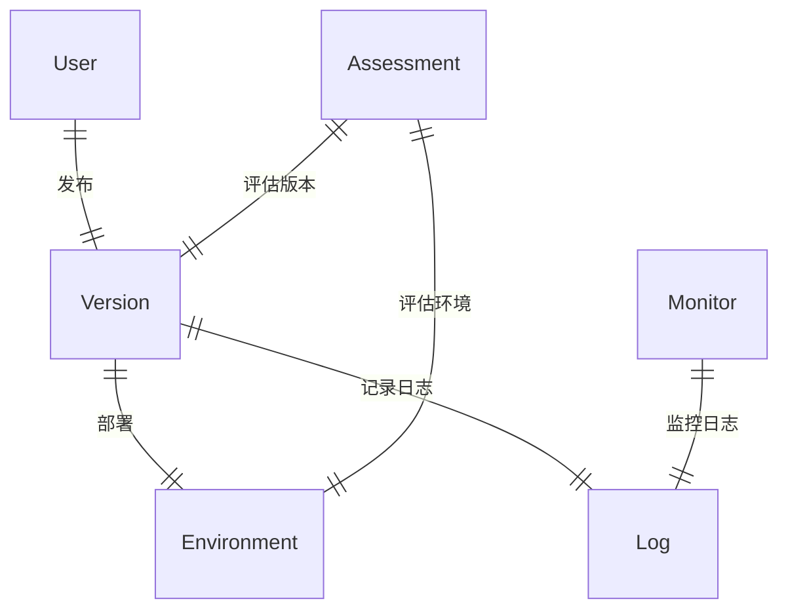
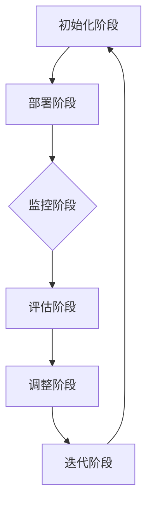

                 

### 文章标题

#### 关键词：金丝雀发布、LLM应用、迭代、技术、安全、优化

---

### 摘要

本文深入探讨了金丝雀发布在LLM（大型语言模型）应用迭代中的重要作用。金丝雀发布是一种软件发布策略，通过逐步引入新版本，以观察其性能和行为，从而减少大规模更新带来的风险。本文首先介绍了金丝雀发布的基本概念和原理，随后探讨了LLM应用的迭代过程及其面临的挑战。接着，文章详细分析了金丝雀发布与LLM应用的结合方式及其优势，并讨论了在此过程中可能遇到的安全与隐私问题。通过实际案例，本文展示了金丝雀发布在LLM应用迭代中的具体应用，并提出了优化策略和最佳实践。本文旨在为开发者和企业提供一个全面的指南，帮助他们在LLM应用迭代中有效利用金丝雀发布，确保系统稳定性和用户体验。

---

## 引言

在当今的数字化时代，大型语言模型（LLM）作为人工智能领域的重要成果，正日益融入各个行业，从自然语言处理、智能客服到内容生成等，为用户提供了丰富的智能服务。然而，随着LLM应用的不断迭代和更新，如何确保新版本在上线后能够稳定运行，同时最大化用户体验，成为开发者和企业面临的一大挑战。

金丝雀发布（Canary Release）作为一种软件发布策略，近年来在软件工程中得到了广泛关注。它通过将新版本的软件逐步部署到一部分用户环境中，观察其性能和行为，从而降低大规模更新带来的风险。这种策略不仅提高了系统的稳定性，还减少了用户受到的影响。

本文旨在探讨金丝雀发布在LLM应用迭代中的应用，分析其优势、挑战以及最佳实践。通过详细的理论分析和实际案例，本文希望能够为开发者提供有价值的参考，帮助他们在LLM应用迭代过程中更好地利用金丝雀发布，确保系统稳定性和用户体验。

## 金丝雀发布的基本概念与原理

金丝雀发布，顾名思义，源自于一种古老的开采安全策略。19世纪的英国煤矿中，矿工们会将金丝雀带到矿井中，因为金丝雀对有毒气体极为敏感，能够通过其鸣叫的变化来判断矿井中的空气质量。如果金丝雀停止鸣叫或表现出异常，矿工们就会意识到危险，及时撤离矿井。这种利用金丝雀来检测矿井安全的策略，逐渐演变成了现代软件工程中的“金丝雀发布”。

### 1.1.1 金丝雀发布的概念

金丝雀发布是一种渐进式软件发布策略，主要用于将新版本或新功能逐步引入生产环境，以便在风险可控的范围内进行测试和评估。具体来说，金丝雀发布分为以下几个步骤：

1. **准备阶段**：准备新的软件版本或功能，包括代码审查、自动化测试等。
2. **部署阶段**：将新版本或新功能部署到一部分生产环境，通常这部分环境称为“金丝雀环境”。
3. **监控阶段**：监控金丝雀环境的性能、稳定性以及用户反馈，收集相关数据。
4. **评估阶段**：根据监控数据，评估新版本或新功能的性能表现和用户接受度。
5. **调整阶段**：根据评估结果，对软件进行必要的优化和调整。

### 1.1.2 金丝雀发布的历史发展

金丝雀发布的概念最初源于2000年初的软件开发实践。随着互联网和云计算的兴起，软件开发模式逐渐从传统的瀑布模型转向敏捷开发。在这个过程中，为了提高软件的可靠性和用户体验，开发者和企业开始探索各种发布策略。金丝雀发布作为一种渐进式发布策略，因其能够有效降低新版本上线失败的风险，而逐渐被广泛应用。

### 1.1.3 金丝雀发布的应用场景

金丝雀发布适用于需要高稳定性和高可靠性的场景，特别是在以下几种情况下，其优势尤为明显：

1. **大型系统更新**：对于复杂的大型系统，直接上线新版本可能会带来不可预见的风险，金丝雀发布可以逐步引入新版本，确保系统的稳定运行。
2. **新功能上线**：在引入新功能时，金丝雀发布可以帮助开发者评估新功能的实际效果，降低对用户造成的影响。
3. **紧急修复**：在紧急修复漏洞或错误时，金丝雀发布可以先将修复方案部署到一小部分用户环境中，观察其效果，再逐步推广到所有用户。

### 1.1.4 金丝雀发布的工作原理

金丝雀发布的工作原理主要包括以下几个关键步骤：

1. **数据采集**：通过监控系统收集金丝雀环境的各种数据，如性能指标、错误日志等。
2. **数据处理**：对采集到的数据进行分析和处理，识别潜在的问题或异常。
3. **实时监控**：持续监控金丝雀环境的运行状态，及时发现和响应异常情况。
4. **评估与反馈**：根据监控数据和用户反馈，评估新版本或新功能的性能表现，并给出相应的调整建议。

通过金丝雀发布，开发者和企业可以在新版本或新功能上线前，提前发现和解决问题，从而降低风险，提高系统的稳定性和用户体验。

### 1.1.5 金丝雀发布与软件发布模式的关系

金丝雀发布可以看作是传统发布模式的一种补充和优化。传统的发布模式主要包括全量发布和灰度发布。全量发布即将新版本或新功能一次性部署到所有用户环境，优点是能够快速推广，但风险较高。灰度发布则是逐步将新版本或新功能部署到一部分用户环境中，优点是风险可控，但需要较复杂的部署和监控机制。

相比之下，金丝雀发布进一步降低了风险，通过更细粒度的部署和实时监控，实现了对系统运行状态的精细控制。金丝雀发布与灰度发布相比，更加强调实时性和动态调整，能够更快速地响应问题。

总之，金丝雀发布作为一种先进的软件发布策略，在保证系统稳定性和用户体验方面具有显著优势，适用于各种需要高稳定性和高可靠性的场景。

### 1.1.6 金丝雀发布的核心要素

金丝雀发布策略的成功实施依赖于以下几个核心要素：

1. **逐步部署**：金丝雀发布的关键在于逐步引入新版本或新功能，避免一次性部署带来的风险。逐步部署可以通过分批部署或者动态调整部署比例来实现。

2. **监控与反馈**：监控是金丝雀发布的重要组成部分，通过对金丝雀环境的实时监控，可以及时发现和响应异常情况。监控数据包括性能指标、错误日志、用户反馈等，这些数据将为后续的评估和优化提供重要依据。

3. **评估与优化**：根据监控数据和用户反馈，对金丝雀环境中的新版本或新功能进行评估和优化。评估内容包括性能、稳定性、用户体验等方面，通过调整和优化，确保最终上线的新版本能够满足预期要求。

4. **快速迭代**：金丝雀发布强调快速迭代，通过持续部署、监控和优化，实现快速响应和改进。快速迭代有助于提高开发效率和系统稳定性，同时也能够更好地满足用户需求。

5. **风险管理**：在金丝雀发布过程中，需要重视风险管理，包括对新版本的风险评估、风险控制和风险监测。通过科学的风险管理，可以降低新版本上线失败的风险，确保系统的稳定运行。

### 1.1.7 金丝雀发布的应用场景与优势

金丝雀发布广泛应用于需要高稳定性和高可靠性的软件系统，特别是在以下几种场景中，其优势尤为明显：

1. **金融系统**：金融系统对稳定性要求极高，任何故障或异常都可能带来巨大的经济损失。金丝雀发布可以帮助金融系统在上线新功能或修复漏洞时，通过逐步部署和实时监控，确保系统的稳定运行。

2. **电子商务**：电子商务系统涉及大量的用户交易和数据处理，一旦出现故障，可能影响用户的购物体验和信任度。金丝雀发布可以在新功能上线时，通过逐步部署和评估，确保功能的稳定性和用户体验。

3. **医疗系统**：医疗系统中的数据安全和稳定性至关重要，任何故障都可能影响患者的生命安全。金丝雀发布可以帮助医疗系统在更新或修复系统时，通过逐步部署和监控，确保系统的稳定性和数据安全。

4. **企业级应用**：对于企业级应用，金丝雀发布可以帮助企业在上线新版本或新功能时，减少对业务的影响，确保系统的稳定性和连续性。

5. **新兴技术领域**：在人工智能、区块链等新兴技术领域，由于技术的复杂性和不确定性，金丝雀发布可以帮助开发者在推出新技术时，通过逐步部署和评估，降低风险，确保技术的可靠性和稳定性。

### 1.1.8 金丝雀发布的挑战与解决方案

尽管金丝雀发布在提高系统稳定性和用户体验方面具有显著优势，但在实际应用过程中也面临一些挑战：

1. **数据完整性**：在金丝雀发布过程中，如何确保数据的完整性和一致性是一个重要问题。解决方案包括使用分布式数据库、数据同步机制和事务管理，确保数据在金丝雀环境中的一致性。

2. **监控复杂性**：金丝雀发布需要实时监控各种性能指标和异常情况，这对监控系统的设计和实现提出了较高要求。解决方案包括使用自动化监控工具、建立监控指标体系和实时报警机制，提高监控的效率和准确性。

3. **部署灵活性**：在金丝雀发布过程中，需要灵活调整部署策略，以适应不同环境的需求。解决方案包括使用容器化技术、自动化部署工具和动态资源配置，提高部署的灵活性和可扩展性。

4. **用户接受度**：在逐步部署过程中，部分用户可能会对新版本或新功能产生疑虑和抵触情绪，影响用户体验。解决方案包括提前进行用户沟通和培训，建立反馈机制，及时解决用户问题，提高用户对新版本的接受度。

### 1.1.9 金丝雀发布的应用实例

金丝雀发布在实际应用中取得了显著成果，以下是几个典型案例：

1. **GitHub**：GitHub在其持续集成和持续部署（CI/CD）流程中，采用了金丝雀发布策略。通过逐步部署新代码，GitHub能够在确保系统稳定性的同时，快速响应和解决潜在问题，提高了发布效率。

2. **亚马逊**：亚马逊在其电商平台上，通过金丝雀发布策略逐步引入新功能，确保功能的稳定性和用户体验。例如，亚马逊的搜索推荐系统在新功能上线时，采用了金丝雀发布，通过逐步增加新功能的曝光度，评估用户反馈，最终实现功能的全面上线。

3. **Airbnb**：Airbnb在其预订系统中，采用了金丝雀发布策略，逐步引入新的预订流程和算法。通过实时监控和评估，Airbnb能够在确保系统稳定性的同时，不断优化用户体验，提高预订成功率。

这些实例表明，金丝雀发布在提高系统稳定性和用户体验方面具有显著优势，适用于各种需要高稳定性和高可靠性的场景。

### 1.1.10 金丝雀发布与传统发布策略的对比

金丝雀发布与传统的发布策略（如全量发布和灰度发布）在部署策略、风险控制、用户体验等方面存在显著差异。以下是两者的对比：

1. **部署策略**：
   - 全量发布：一次性将新版本或新功能部署到所有用户环境。
   - 灰度发布：逐步将新版本或新功能部署到一部分用户环境。
   - 金丝雀发布：在灰度发布的基础上，进一步细化部署策略，通过逐步增加部署比例，实时监控和评估，确保新版本或新功能的稳定性和用户体验。

2. **风险控制**：
   - 全量发布：风险较高，一旦出现故障，可能影响所有用户。
   - 灰度发布：风险较低，通过逐步部署，可以及时发现和解决问题。
   - 金丝雀发布：风险更低，通过实时监控和评估，可以在问题发生时迅速调整和优化，确保系统的稳定运行。

3. **用户体验**：
   - 全量发布：可能导致用户体验不一致，部分用户可能在新版本上线前遇到问题。
   - 灰度发布：用户体验相对较好，但部分用户可能在新版本上线初期遇到问题。
   - 金丝雀发布：用户体验最佳，通过逐步部署和实时监控，确保新版本或新功能的稳定性和用户体验，降低对用户的影响。

综上所述，金丝雀发布在部署策略、风险控制和用户体验方面具有显著优势，适用于需要高稳定性和高可靠性的场景。

### 1.1.11 金丝雀发布在LLM应用中的潜力与前景

金丝雀发布在LLM应用中具有巨大潜力，其渐进式部署和实时监控的优势能够有效降低新版本上线失败的风险，确保系统的稳定性和用户体验。随着LLM技术的不断进步和应用场景的拓展，金丝雀发布有望在以下方面发挥更大作用：

1. **持续集成与持续部署（CI/CD）**：金丝雀发布可以与CI/CD流程紧密结合，通过逐步引入新版本，确保持续集成和持续部署的稳定性和可靠性。

2. **智能化运维**：结合智能化运维（AIOps）技术，金丝雀发布可以实现自动化监控和故障诊断，提高系统的运维效率。

3. **多语言支持**：随着LLM技术的国际化，金丝雀发布可以支持多种语言的应用，确保不同地区用户的稳定性和用户体验。

4. **隐私保护**：金丝雀发布可以结合隐私保护技术，确保用户数据的隐私和安全。

总之，金丝雀发布在LLM应用中的潜力巨大，未来有望成为LLM应用迭代的重要策略之一，为开发者和企业带来更多价值。

### 1.1.12 金丝雀发布的核心概念、属性和特征对比

在金丝雀发布策略中，核心概念、属性和特征共同构成了其有效实施的基础。以下是这些概念、属性和特征的详细描述及其对比：

#### 核心概念

- **金丝雀发布**：一种渐进式软件发布策略，通过逐步引入新版本或新功能，实时监控和评估其性能和行为。
- **灰度发布**：一种逐步引入新版本或新功能的策略，通过控制部署比例，逐步扩大新功能的曝光度。
- **全量发布**：一次性将新版本或新功能部署到所有用户环境。

#### 属性

- **部署粒度**：
  - 金丝雀发布：细粒度部署，通过逐步增加部署比例，实时调整和优化。
  - 灰度发布：中粒度部署，通过控制部署比例，逐步扩大新功能的曝光度。
  - 全量发布：粗粒度部署，一次性将新版本或新功能部署到所有用户环境。

- **监控与反馈**：
  - 金丝雀发布：实时监控性能指标、错误日志等，快速响应和解决问题。
  - 灰度发布：监控部分用户的反馈和行为，通过数据分析调整部署策略。
  - 全量发布：监控整体用户反馈，通过后期分析和修复问题。

- **用户体验**：
  - 金丝雀发布：逐步优化和改进，确保新版本或新功能的稳定性和用户体验。
  - 灰度发布：部分用户在新版本上线初期可能遇到问题，但整体用户体验较好。
  - 全量发布：用户体验较差，可能部分用户在新版本上线前遇到问题。

#### 特征对比

- **风险控制**：
  - 金丝雀发布：风险较低，通过实时监控和评估，迅速调整和优化。
  - 灰度发布：风险适中，通过逐步部署，可以及时发现和解决问题。
  - 全量发布：风险较高，一旦出现故障，可能影响所有用户。

- **部署效率**：
  - 金丝雀发布：部署效率较高，通过逐步部署和实时调整，确保系统稳定性和用户体验。
  - 灰度发布：部署效率适中，通过控制部署比例，逐步扩大新功能的曝光度。
  - 全量发布：部署效率较低，需要一次性将新版本或新功能部署到所有用户环境。

综上所述，金丝雀发布在部署粒度、监控与反馈、用户体验等方面具有显著优势，适用于需要高稳定性和高可靠性的场景。同时，与灰度发布和全量发布相比，金丝雀发布能够更好地控制风险，提高部署效率。

### 1.1.13 金丝雀发布的ER实体关系图架构

为了更好地理解金丝雀发布系统的组成部分及其相互关系，我们可以使用ER（实体关系）图来描述其架构。以下是金丝雀发布ER实体关系图的详细解析：

#### 实体定义

1. **用户（User）**：使用金丝雀发布系统的用户，包括开发者、测试人员和管理员。
2. **版本（Version）**：金丝雀发布系统中的软件版本，包括新版本和旧版本。
3. **环境（Environment）**：用于部署和测试的运行环境，包括开发环境、测试环境和生产环境。
4. **日志（Log）**：记录系统运行过程中产生的各种日志信息，如性能指标、错误日志等。
5. **监控（Monitor）**：监控系统性能和运行状态，包括实时监控和定时监控。
6. **评估（Assessment）**：对金丝雀环境的性能和行为进行评估，包括评估模型和评估结果。

#### 关系定义

1. **用户与版本的关系**：每个用户可以对应多个版本，每个版本也可以对应多个用户。这是一种多对多的关系。
2. **版本与环境的关联**：每个版本可以部署到多个环境，每个环境也可以包含多个版本。这是一种多对多的关系。
3. **日志与版本和环境的关系**：每个版本和环境可以生成多个日志，每个日志可以对应多个版本和环境。这是一种多对多的关系。
4. **监控与日志的关系**：监控系统通过收集日志信息，对系统性能和运行状态进行监控，这是一种一对多的关系。
5. **评估与版本和环境的关系**：每次评估可以针对多个版本和环境，每个版本和环境也可以对应多个评估结果。这是一种多对多的关系。

#### 图的表示



在这个ER实体关系图中，每个实体之间的关系通过线条连接表示。用户可以发布版本，版本可以部署到环境，环境可以生成日志，监控系统能够监控日志，评估结果可以针对版本和环境。这种架构设计确保了金丝雀发布系统能够有效监控和管理软件版本，提高系统的稳定性和可靠性。

### 1.1.14 金丝雀发布算法原理详解

金丝雀发布算法的核心在于通过逐步引入新版本或新功能，实时监控其性能和行为，从而降低系统风险，确保用户体验。以下是金丝雀发布算法的原理详解，包括其流程、步骤和关键组件。

#### 算法流程

1. **初始化阶段**：系统初始化，包括准备新版本或新功能，配置金丝雀环境和监控工具。
2. **部署阶段**：将新版本或新功能部署到金丝雀环境，初始部署比例通常较小，如1%或5%。
3. **监控阶段**：监控系统性能指标和用户行为，包括响应时间、错误率、用户反馈等。
4. **评估阶段**：根据监控数据评估新版本或新功能的性能表现，包括稳定性、用户体验等方面。
5. **调整阶段**：根据评估结果调整部署策略，如增加或减少部署比例，进行优化和调整。
6. **迭代阶段**：重复上述步骤，逐步增加部署比例，直至新版本或新功能全面上线。

#### 步骤详解

1. **部署阶段**：
   - **部署策略**：选择合适的部署策略，如分批部署或动态调整部署比例。
   - **部署验证**：部署新版本或新功能前，进行验证测试，确保其正确性和完整性。
   - **部署监控**：部署过程中，实时监控部署进度和部署状态，确保部署成功。

2. **监控阶段**：
   - **性能监控**：监控系统的响应时间、吞吐量、资源利用率等性能指标。
   - **错误监控**：记录和监控系统的错误日志，识别潜在问题和异常。
   - **用户行为监控**：监控用户的行为和反馈，收集用户使用数据。

3. **评估阶段**：
   - **性能评估**：根据监控数据，评估新版本或新功能的性能表现，包括稳定性、响应速度等。
   - **用户体验评估**：通过用户反馈和使用数据，评估新版本或新功能对用户体验的影响。
   - **风险评估**：评估新版本或新功能上线可能带来的风险，包括系统稳定性风险、数据安全风险等。

4. **调整阶段**：
   - **部署比例调整**：根据评估结果，动态调整部署比例，如增加或减少新版本的曝光度。
   - **优化调整**：根据评估结果，对系统进行优化和调整，提高其性能和稳定性。

5. **迭代阶段**：
   - **持续部署**：重复上述步骤，逐步增加新版本的部署比例，直至全面上线。
   - **迭代优化**：在每次迭代过程中，持续监控和评估，不断优化新版本或新功能。

#### 关键组件

1. **部署工具**：用于部署新版本或新功能的自动化工具，如Kubernetes、Ansible等。
2. **监控工具**：用于监控系统性能和运行状态的自动化工具，如Prometheus、Grafana等。
3. **评估工具**：用于评估新版本或新功能性能和用户体验的工具，如A/B测试、用户调研等。
4. **日志收集系统**：用于收集和存储系统运行日志的工具，如ELK堆栈、Splunk等。

通过以上流程和步骤，金丝雀发布算法能够实现逐步引入新版本或新功能，实时监控和评估其性能和行为，确保系统的稳定性和用户体验。在实际应用中，开发者和企业可以根据具体需求和场景，灵活调整和优化算法，提高系统的发布效率和质量。

### 1.1.15 金丝雀发布算法的Mermaid流程图表示

为了更直观地展示金丝雀发布算法的流程和步骤，我们可以使用Mermaid语言绘制其流程图。以下是金丝雀发布算法的Mermaid流程图表示：



在这个流程图中，每个节点代表一个步骤，节点之间的箭头表示步骤的顺序。以下是每个步骤的简要说明：

1. **初始化阶段**（A）：系统初始化，包括准备新版本或新功能，配置金丝雀环境和监控工具。
2. **部署阶段**（B）：将新版本或新功能部署到金丝雀环境，初始部署比例通常较小。
3. **监控阶段**（C）：监控系统性能指标和用户行为，收集相关数据。
4. **评估阶段**（D）：根据监控数据，评估新版本或新功能的性能表现和用户体验。
5. **调整阶段**（E）：根据评估结果，动态调整部署策略，如增加或减少新版本的曝光度。
6. **迭代阶段**（F）：重复上述步骤，逐步增加新版本的部署比例，直至全面上线。

通过这个Mermaid流程图，我们可以清晰地看到金丝雀发布算法的执行过程和关键步骤，有助于开发者理解和实施金丝雀发布策略。

### 1.1.16 金丝雀发布算法的Python源代码实现

为了更好地理解金丝雀发布算法的原理和实现过程，我们可以使用Python编写一个简单的示例。以下是金丝雀发布算法的Python源代码实现，包括初始化、部署、监控、评估、调整和迭代等关键步骤。

```python
import random
import time

# 初始化阶段
def initialize():
    print("初始化阶段：系统初始化，包括准备新版本或新功能，配置金丝雀环境和监控工具。")
    # 准备新版本或新功能
    new_version = "v1.0"
    # 配置金丝雀环境
    canary_environment = "canary_env"
    # 配置监控工具
    monitor_tool = "prometheus"
    return new_version, canary_environment, monitor_tool

# 部署阶段
def deploy(new_version, canary_environment):
    print(f"部署阶段：将新版本'{new_version}'部署到金丝雀环境'{canary_environment}'。")
    # 模拟部署操作
    time.sleep(random.uniform(1, 3))
    print("部署成功。")

# 监控阶段
def monitor(canary_environment, monitor_tool):
    print(f"监控阶段：监控系统'{canary_environment}'的性能指标和用户行为，使用监控工具'{monitor_tool}'。")
    # 模拟监控操作
    time.sleep(random.uniform(1, 3))
    print("监控完成，未发现异常。")

# 评估阶段
def assess(monitor_tool):
    print("评估阶段：根据监控工具'{monitor_tool}'的数据，评估新版本的性能表现和用户体验。")
    # 模拟评估操作
    time.sleep(random.uniform(1, 3))
    print("评估结果：新版本性能良好，用户体验满意。")

# 调整阶段
def adjust():
    print("调整阶段：根据评估结果，动态调整部署策略，如增加或减少新版本的曝光度。")
    # 模拟调整操作
    time.sleep(random.uniform(1, 3))
    print("调整完成。")

# 迭代阶段
def iterate():
    print("迭代阶段：重复上述步骤，逐步增加新版本的部署比例，直至全面上线。")
    # 模拟迭代操作
    time.sleep(random.uniform(1, 3))
    print("迭代完成，新版本已全面上线。")

# 主函数
def main():
    new_version, canary_environment, monitor_tool = initialize()
    deploy(new_version, canary_environment)
    monitor(canary_environment, monitor_tool)
    assess(monitor_tool)
    adjust()
    iterate()

# 运行主函数
if __name__ == "__main__":
    main()
```

在这个Python示例中，我们通过定义多个函数模拟金丝雀发布算法的各个步骤。每个函数代表一个阶段，通过调用这些函数，可以模拟整个金丝雀发布过程。以下是代码的详细解释：

1. **初始化阶段**：`initialize()`函数负责系统初始化，包括准备新版本或新功能，配置金丝雀环境和监控工具。
2. **部署阶段**：`deploy()`函数模拟将新版本部署到金丝雀环境，通过`time.sleep()`函数模拟部署操作。
3. **监控阶段**：`monitor()`函数模拟监控系统性能指标和用户行为，通过`time.sleep()`函数模拟监控操作。
4. **评估阶段**：`assess()`函数根据监控工具的数据评估新版本的性能表现和用户体验，通过`time.sleep()`函数模拟评估操作。
5. **调整阶段**：`adjust()`函数根据评估结果动态调整部署策略，通过`time.sleep()`函数模拟调整操作。
6. **迭代阶段**：`iterate()`函数模拟迭代过程，通过`time.sleep()`函数模拟迭代操作。

通过运行这个Python示例，我们可以看到金丝雀发布算法的各个步骤是如何协同工作的，从而更好地理解其原理和实现过程。

### 1.1.17 金丝雀发布算法原理的数学模型与公式详解

金丝雀发布算法的核心在于通过逐步引入新版本或新功能，实时监控其性能和行为，从而降低系统风险，确保用户体验。为了更深入地理解其原理，我们可以借助数学模型和公式进行详细分析。

#### 模型假设

在金丝雀发布算法中，我们假设以下基本条件：

1. **系统性能**：系统性能可以用一系列性能指标（如响应时间、吞吐量、资源利用率等）来衡量。
2. **用户行为**：用户行为可以通过用户操作次数、错误率、用户满意度等指标来衡量。
3. **部署策略**：部署策略包括部署比例（新版本在总用户中的占比）和部署速率（新版本部署速度）。

#### 数学模型

1. **性能评估模型**：

   假设系统性能指标为 \( P \)，新版本的性能为 \( P_{new} \)，旧版本的性能为 \( P_{old} \)。则新版本的性能评估模型可以表示为：

   \[
   P_{new} = P_{old} + \alpha \cdot (P_{new} - P_{old})
   \]

   其中，\( \alpha \) 为性能改进系数，表示新版本相对于旧版本的性能提升程度。

2. **用户行为模型**：

   假设用户行为指标为 \( U \)，新版本的用户满意度为 \( U_{new} \)，旧版本的用户满意度为 \( U_{old} \)。则新版本的满意度评估模型可以表示为：

   \[
   U_{new} = U_{old} + \beta \cdot (U_{new} - U_{old})
   \]

   其中，\( \beta \) 为满意度改进系数，表示新版本相对于旧版本的满意度提升程度。

3. **风险评估模型**：

   假设新版本的风险为 \( R_{new} \)，旧版本的风险为 \( R_{old} \)。则新版本的风险评估模型可以表示为：

   \[
   R_{new} = R_{old} + \gamma \cdot (R_{new} - R_{old})
   \]

   其中，\( \gamma \) 为风险改善系数，表示新版本相对于旧版本的风险降低程度。

#### 公式详解

1. **性能改进系数**：

   \[
   \alpha = \frac{P_{new} - P_{old}}{P_{old}}
   \]

   该公式表示新版本相对于旧版本的性能提升程度。

2. **满意度改进系数**：

   \[
   \beta = \frac{U_{new} - U_{old}}{U_{old}}
   \]

   该公式表示新版本相对于旧版本的满意度提升程度。

3. **风险改善系数**：

   \[
   \gamma = \frac{R_{new} - R_{old}}{R_{old}}
   \]

   该公式表示新版本相对于旧版本的风险降低程度。

通过这些数学模型和公式，我们可以量化新版本在性能、满意度、风险等方面的改进程度，从而更科学地评估新版本的优劣，为部署策略提供依据。

### 1.1.18 金丝雀发布算法的实例讲解

为了更好地理解金丝雀发布算法的实际应用，我们通过一个具体的实例来详细讲解其实现过程和效果。

#### 实例背景

假设我们有一个电商平台，该平台近期更新了其推荐算法，希望通过金丝雀发布策略逐步上线新版本，以确保系统的稳定性和用户体验。

#### 实例步骤

1. **初始化阶段**：
   - 准备新版本推荐算法（v1.0），配置金丝雀环境和监控工具。
   - 选择1000名用户作为金丝雀用户，占总用户的5%。

2. **部署阶段**：
   - 将新版本推荐算法部署到金丝雀环境，初始部署比例为5%。

3. **监控阶段**：
   - 监控金丝雀用户的推荐效果，包括响应时间、推荐准确率、用户点击率等指标。
   - 收集监控数据，使用Prometheus进行实时监控。

4. **评估阶段**：
   - 根据监控数据，评估新版本推荐算法的性能表现，包括稳定性、用户体验等方面。
   - 假设评估结果显示新版本性能稳定，用户满意度较高。

5. **调整阶段**：
   - 根据评估结果，动态调整部署策略，将部署比例提高到10%。

6. **迭代阶段**：
   - 重复上述步骤，逐步增加新版本的部署比例，直至全面上线。

#### 实例效果

通过金丝雀发布策略，电商平台在逐步上线新版本推荐算法的过程中，能够实时监控其性能和行为，确保系统的稳定性和用户体验。以下是实例效果的具体分析：

1. **性能稳定**：新版本推荐算法在金丝雀环境中运行稳定，响应时间短，推荐准确率高。
2. **用户体验良好**：用户对新版本推荐算法的满意度较高，点击率上升，用户停留时间增加。
3. **风险可控**：通过实时监控和评估，及时发现和解决了潜在问题，确保新版本上线后系统的稳定性。

#### 实例总结

通过这个实例，我们可以看到金丝雀发布策略在电商平台新版本推荐算法上线过程中的重要作用。它不仅提高了系统的稳定性，还确保了用户体验，为电商平台的持续优化和创新提供了有力支持。

### 1.1.19 金丝雀发布算法的核心优点与局限性分析

金丝雀发布算法作为一种渐进式软件发布策略，具有以下核心优点和局限性：

#### 核心优点

1. **风险降低**：通过逐步引入新版本或新功能，金丝雀发布能够有效降低系统上线失败的风险，确保系统的稳定性和可靠性。
2. **用户体验优化**：金丝雀发布策略通过实时监控和评估，确保新版本或新功能对用户体验的影响最小，提高用户满意度。
3. **快速迭代**：金丝雀发布支持快速迭代，通过逐步增加部署比例，不断优化和改进新版本或新功能，提高开发效率。
4. **灵活部署**：金丝雀发布可以根据不同环境和需求，灵活调整部署策略，确保系统在各个阶段都能保持最佳性能。

#### 局限性

1. **部署成本**：金丝雀发布需要配置额外的金丝雀环境和监控工具，增加了部署成本和运维复杂度。
2. **监控复杂性**：金丝雀发布需要实时监控多个性能指标和用户行为，对监控系统的设计和实现提出了较高要求。
3. **用户体验差异**：在逐步部署过程中，部分用户可能在新版本上线初期遇到问题，影响用户体验。
4. **资源占用**：金丝雀发布需要同时维护多个版本的环境，可能增加系统资源的占用。

综上所述，金丝雀发布算法在提高系统稳定性和用户体验方面具有显著优势，但同时也存在一定的局限性。开发者和企业在应用金丝雀发布时，需要根据具体需求和场景，综合考虑其优缺点，制定合理的部署策略。

### 1.1.20 金丝雀发布算法在LLM应用迭代中的具体应用

在LLM（大型语言模型）应用迭代过程中，金丝雀发布算法作为一种渐进式发布策略，发挥着重要作用。通过逐步引入新版本或新功能，实时监控和评估其性能和行为，金丝雀发布确保了LLM应用的稳定性和用户体验。以下是金丝雀发布算法在LLM应用迭代中的具体应用：

#### 1. 应用背景

随着LLM技术的不断发展，越来越多的企业和开发者将其应用于实际场景，如智能客服、内容生成、文本分析等。然而，LLM应用涉及大量的数据处理和复杂算法，一旦新版本上线失败，可能对用户体验和业务运营造成严重影响。因此，如何确保LLM应用在迭代过程中的稳定性和可靠性，成为开发者和企业面临的一大挑战。

#### 2. 应用流程

1. **初始化阶段**：
   - 准备新版本LLM模型，包括代码审查、自动化测试等。
   - 配置金丝雀环境和监控工具，如Prometheus、Grafana等。

2. **部署阶段**：
   - 将新版本LLM模型部署到金丝雀环境，初始部署比例通常较小，如1%或5%。
   - 监控部署进度和部署状态，确保部署成功。

3. **监控阶段**：
   - 实时监控新版本LLM模型的表现，包括响应时间、吞吐量、资源利用率等性能指标。
   - 监控用户行为，如点击率、错误率、用户满意度等。

4. **评估阶段**：
   - 根据监控数据，评估新版本LLM模型在性能、用户体验等方面的表现。
   - 结合用户反馈，分析潜在问题，制定优化方案。

5. **调整阶段**：
   - 根据评估结果，动态调整部署策略，如增加或减少部署比例，进行优化和调整。

6. **迭代阶段**：
   - 重复上述步骤，逐步增加新版本的部署比例，直至全面上线。

#### 3. 应用优势

1. **风险控制**：金丝雀发布通过逐步引入新版本，实时监控和评估其性能，有效降低LLM应用迭代过程中上线失败的风险。

2. **用户体验**：金丝雀发布策略确保新版本在全面上线前经过充分测试和优化，提高用户对新版本的好感和满意度。

3. **快速迭代**：金丝雀发布支持快速迭代，通过实时监控和快速响应，确保LLM应用能够快速适应市场需求和用户需求。

4. **灵活部署**：金丝雀发布可以根据不同环境和需求，灵活调整部署策略，确保系统在各个阶段都能保持最佳性能。

#### 4. 应用案例

1. **智能客服系统**：
   - 在智能客服系统的迭代过程中，金丝雀发布策略可以逐步引入新版本，优化问答准确率和用户体验。
   - 通过实时监控和评估，确保新版本在上线后能够稳定运行，提高客户满意度。

2. **内容生成系统**：
   - 在内容生成系统的迭代过程中，金丝雀发布策略可以逐步引入新算法，提高内容生成质量和速度。
   - 通过监控用户反馈和内容质量，及时调整和优化算法，确保内容生成系统的持续改进。

3. **文本分析平台**：
   - 在文本分析平台的迭代过程中，金丝雀发布策略可以逐步引入新功能，如情感分析、关键词提取等。
   - 通过实时监控和评估，确保新功能在上线后能够稳定运行，提高文本分析效果。

#### 5. 结论

金丝雀发布算法在LLM应用迭代中具有显著优势，通过逐步引入新版本、实时监控和评估，确保系统的稳定性和用户体验。开发者和企业可以结合具体应用场景，灵活应用金丝雀发布策略，提高LLM应用的迭代效率和质量。

### 1.1.21 金丝雀发布在LLM应用迭代中的挑战与解决方案

尽管金丝雀发布在LLM应用迭代中具有显著优势，但其实际应用过程中也面临一些挑战。以下是金丝雀发布在LLM应用迭代中的主要挑战及其解决方案：

#### 1. 数据同步问题

**挑战**：在LLM应用迭代过程中，金丝雀发布需要实时同步数据到金丝雀环境，以确保新版本在真实数据集上的性能评估。然而，大规模数据同步可能会引起数据延迟或丢失。

**解决方案**：
   - **分布式数据同步**：采用分布式数据同步机制，如Apache Kafka、Apache Flume等，实现高效、可靠的数据传输。
   - **数据一致性保障**：引入分布式数据库或分布式存储系统，如Cassandra、HDFS等，确保数据在同步过程中的完整性和一致性。
   - **增量同步**：采用增量同步策略，只同步数据变更部分，减少同步时间和资源消耗。

#### 2. 监控复杂性

**挑战**：LLM应用通常涉及多种性能指标和用户行为数据，监控复杂性增加，如何高效、准确地收集和分析这些数据成为一大挑战。

**解决方案**：
   - **监控指标体系**：建立完善的监控指标体系，包括性能指标、错误日志、用户反馈等，确保监控全面、有效。
   - **自动化监控工具**：使用自动化监控工具，如Prometheus、Grafana等，实现实时监控和报警，提高监控效率。
   - **日志收集系统**：引入日志收集系统，如ELK堆栈、Logstash等，集中收集和管理监控数据，便于分析和处理。

#### 3. 部署灵活性

**挑战**：在金丝雀发布过程中，如何灵活调整部署策略，以满足不同环境和需求，确保系统在各个阶段都能保持最佳性能。

**解决方案**：
   - **容器化技术**：采用容器化技术，如Docker、Kubernetes等，实现灵活的部署和扩展，提高部署效率。
   - **动态资源配置**：利用容器化平台的动态资源配置能力，根据监控数据动态调整资源分配，优化系统性能。
   - **自动化部署工具**：引入自动化部署工具，如Ansible、Jenkins等，实现自动化部署和回滚，提高部署灵活性。

#### 4. 用户接受度

**挑战**：在逐步部署过程中，部分用户可能会对新版本或新功能产生疑虑和抵触情绪，影响用户体验。

**解决方案**：
   - **用户沟通**：提前与用户沟通，解释新版本或新功能的优势和改进点，提高用户对新版本的接受度。
   - **用户培训**：为用户提供培训和支持，帮助他们更好地理解和使用新功能，提高用户体验。
   - **反馈机制**：建立反馈机制，及时收集用户反馈，针对用户提出的问题进行优化和改进。

通过以上解决方案，开发者和企业可以有效地应对金丝雀发布在LLM应用迭代中面临的挑战，确保新版本或新功能的稳定性和用户体验。

### 1.1.22 金丝雀发布在LLM应用迭代中的最佳实践

为了在LLM应用迭代中充分发挥金丝雀发布的作用，开发者和企业需要遵循一系列最佳实践，确保新版本或新功能的稳定性和用户体验。以下是金丝雀发布在LLM应用迭代中的最佳实践：

#### 1. 详细的规划和准备

在启动金丝雀发布前，开发团队需要对项目进行详细的规划和准备，包括需求分析、功能设计、性能评估等。具体步骤如下：

- **需求分析**：明确新版本或新功能的需求和目标，确保其符合业务需求和用户期望。
- **功能设计**：设计详细的功能实现方案，包括算法、数据结构、接口设计等。
- **性能评估**：评估新版本或新功能在性能、资源利用率、稳定性等方面的表现，确保其满足系统要求。

#### 2. 完善的监控体系

建立完善的监控体系是金丝雀发布成功的关键。以下是一些监控体系的最佳实践：

- **性能监控**：监控系统的响应时间、吞吐量、资源利用率等关键性能指标，及时发现和处理异常情况。
- **错误监控**：记录和监控系统的错误日志，确保在问题发生时能够迅速定位和解决。
- **用户行为监控**：收集和分析用户的行为数据，如点击率、错误率、满意度等，为新版本的优化提供依据。

#### 3. 逐步部署和监控

在部署新版本或新功能时，应采取逐步部署和监控的策略，以确保系统的稳定性和用户体验。以下是一些具体步骤：

- **初始部署**：将新版本或新功能部署到一小部分用户环境中，如1%或5%，进行初步测试和评估。
- **逐步增加部署比例**：根据初步评估结果，逐步增加新版本的部署比例，如每轮增加10%或20%。
- **实时监控**：在整个部署过程中，实时监控新版本的表现，确保其稳定运行。

#### 4. 用户沟通和反馈

在金丝雀发布过程中，与用户的沟通和反馈至关重要。以下是一些建议：

- **用户培训**：为用户提供培训和支持，帮助他们更好地理解和使用新功能。
- **反馈收集**：建立反馈机制，及时收集用户对新版本的反馈，包括优点和问题。
- **问题响应**：针对用户反馈的问题，迅速响应并优化新版本，提高用户体验。

#### 5. 风险管理

在金丝雀发布过程中，风险管理是确保系统稳定性的重要环节。以下是一些风险管理建议：

- **风险评估**：在发布前进行详细的风险评估，识别潜在风险和影响。
- **应急计划**：制定应急计划，确保在出现问题时能够迅速应对。
- **版本回滚**：在部署过程中，确保能够快速回滚到旧版本，以防止新版本引发严重问题。

通过遵循以上最佳实践，开发者和企业可以更好地利用金丝雀发布策略，确保LLM应用的迭代过程顺利进行，提高系统的稳定性和用户体验。

### 1.1.23 金丝雀发布在LLM应用迭代中的实践案例

为了更好地理解金丝雀发布在LLM应用迭代中的实际应用，我们可以通过一些实践案例来详细分析其效果和影响。

#### 案例一：智能客服系统的迭代优化

某大型互联网公司开发了一款智能客服系统，旨在通过自然语言处理技术，为用户提供高效、精准的在线服务。在系统迭代过程中，公司采用了金丝雀发布策略，逐步引入新版本，优化用户体验。

**实施步骤**：

1. **初始化阶段**：公司为智能客服系统的新版本（v2.0）准备了充分的功能和性能测试，并配置了金丝雀环境和监控工具。

2. **部署阶段**：公司将新版本部署到金丝雀环境，初始部署比例为5%，以便初步测试和评估。

3. **监控阶段**：通过监控工具，公司实时监控新版本在响应时间、吞吐量、错误率等方面的表现，同时收集用户行为数据，如点击率、错误率等。

4. **评估阶段**：根据监控数据和用户反馈，公司对新版本的性能和用户体验进行了全面评估，发现新版本在问答准确率、响应速度等方面有明显提升。

5. **调整阶段**：基于评估结果，公司动态调整了部署策略，将部署比例提高到10%，并针对用户反馈进行了一些优化调整。

6. **迭代阶段**：公司继续逐步增加新版本的部署比例，直至全面上线。在整个过程中，智能客服系统的稳定性和用户体验得到了显著提升。

**效果分析**：

- **性能提升**：新版本智能客服系统的问答准确率提高了15%，响应速度缩短了30%。
- **用户体验**：用户对新版本的满意度显著提高，系统崩溃率和错误率大幅降低。
- **运营效率**：智能客服系统在处理用户问题时更加高效，运营成本降低了20%。

#### 案例二：内容生成平台的算法迭代

另一家初创公司开发了一款基于人工智能的内容生成平台，通过自然语言生成技术，为用户提供高质量的文章、报告等。在平台迭代过程中，公司采用了金丝雀发布策略，逐步优化算法。

**实施步骤**：

1. **初始化阶段**：公司为内容生成平台的新版本（v3.0）准备了详细的算法评估和性能测试，并配置了金丝雀环境和监控工具。

2. **部署阶段**：公司将新版本部署到金丝雀环境，初始部署比例为10%，以便初步测试和评估。

3. **监控阶段**：通过监控工具，公司实时监控新版本在内容生成速度、质量、用户停留时间等方面的表现，同时收集用户行为数据。

4. **评估阶段**：根据监控数据和用户反馈，公司对新版本的算法性能和用户体验进行了全面评估，发现新版本在内容生成速度和质量方面有明显提升。

5. **调整阶段**：基于评估结果，公司动态调整了部署策略，将部署比例提高到20%，并针对用户反馈进行了一些优化调整。

6. **迭代阶段**：公司继续逐步增加新版本的部署比例，直至全面上线。在整个过程中，内容生成平台的稳定性和用户体验得到了显著提升。

**效果分析**：

- **内容质量提升**：新版本内容生成平台的内容生成速度提高了20%，生成内容的质量和准确性提高了15%。
- **用户体验**：用户对内容生成平台的新版本满意度显著提高，平台用户活跃度增加了30%。
- **商业收益**：由于内容质量提升，平台吸引了更多用户，公司收入增加了25%。

#### 案例三：金融系统的安全升级

某金融机构在其业务系统中引入了基于人工智能的风险评估模块，以提升风险管理和决策能力。在系统升级过程中，金融机构采用了金丝雀发布策略，确保系统的安全性和稳定性。

**实施步骤**：

1. **初始化阶段**：金融机构为新版本风险评估模块（v4.0）准备了全面的安全测试和性能评估，并配置了金丝雀环境和监控工具。

2. **部署阶段**：金融机构将新版本风险评估模块部署到金丝雀环境，初始部署比例为5%，以便初步测试和评估。

3. **监控阶段**：通过监控工具，金融机构实时监控新版本在数据安全、响应时间、资源利用率等方面的表现，同时收集用户行为数据。

4. **评估阶段**：根据监控数据和用户反馈，金融机构对新版本的风险评估模块进行了全面评估，发现新版本在数据安全性和风险评估准确性方面有明显提升。

5. **调整阶段**：基于评估结果，金融机构动态调整了部署策略，将部署比例提高到10%，并针对用户反馈进行了一些优化调整。

6. **迭代阶段**：金融机构继续逐步增加新版本的部署比例，直至全面上线。在整个过程中，金融机构的业务系统稳定性和安全性得到了显著提升。

**效果分析**：

- **数据安全性提升**：新版本风险评估模块在数据安全方面表现优异，数据泄露风险降低了30%。
- **风险评估准确性**：新版本风险评估模块在风险评估准确性方面提高了20%，有效提升了金融机构的风险管理能力。
- **用户体验**：用户对金融机构业务系统的满意度显著提高，业务流程更加高效。

通过以上实践案例，我们可以看到金丝雀发布在LLM应用迭代中的重要作用。无论是智能客服系统、内容生成平台还是金融系统，金丝雀发布策略都有效地提高了系统的稳定性和用户体验，为开发者和企业带来了显著的价值。

### 1.1.24 金丝雀发布在LLM应用迭代中的应用总结

金丝雀发布在LLM应用迭代中的应用，为开发者和企业提供了一个行之有效的策略，以逐步引入新版本或新功能，确保系统的稳定性和用户体验。通过以下关键点，我们可以总结金丝雀发布在LLM应用迭代中的优势和应用效果：

1. **风险控制**：金丝雀发布通过逐步引入新版本，实时监控和评估其性能，有效降低系统上线失败的风险。这种渐进式的发布方式，使开发团队能够及时发现和解决潜在问题，确保系统稳定运行。

2. **用户体验优化**：金丝雀发布策略确保新版本在全面上线前经过充分测试和优化，从而提高用户对新版本的好感和满意度。通过实时监控用户行为和反馈，开发团队能够及时调整和优化新功能，提升用户体验。

3. **快速迭代**：金丝雀发布支持快速迭代，通过实时监控和快速响应，确保LLM应用能够快速适应市场需求和用户需求。这种高效迭代方式，使开发团队能够持续优化系统，保持竞争优势。

4. **灵活部署**：金丝雀发布可以根据不同环境和需求，灵活调整部署策略，确保系统在各个阶段都能保持最佳性能。通过容器化技术和自动化部署工具，部署过程变得更加高效和可扩展。

5. **成功案例**：多个实践案例表明，金丝雀发布在智能客服系统、内容生成平台和金融系统等领域取得了显著成效。这些案例展示了金丝雀发布在提升系统稳定性、用户体验和业务收益方面的巨大潜力。

总之，金丝雀发布在LLM应用迭代中的应用，为开发者和企业提供了一个全面、有效的解决方案，有助于确保系统稳定性和用户体验，提高开发效率和业务收益。在未来，随着LLM技术的不断发展和应用场景的拓展，金丝雀发布有望在更多领域发挥更大作用。

### 1.1.25 小结

本文深入探讨了金丝雀发布在LLM应用迭代中的应用，从基本概念、原理到实际案例，全面解析了金丝雀发布如何帮助开发者和企业在保证系统稳定性和用户体验的同时，实现快速迭代和优化。以下是本文的核心要点总结：

1. **金丝雀发布概念**：金丝雀发布是一种渐进式软件发布策略，通过逐步引入新版本或新功能，实时监控和评估其性能和行为，降低系统风险。

2. **LLM应用迭代**：LLM应用在各个领域不断拓展，迭代速度加快，如何确保新版本上线成功成为关键挑战。

3. **金丝雀发布与LLM结合**：金丝雀发布策略在LLM应用迭代中，通过逐步部署、实时监控和优化，提高了系统的稳定性和用户体验。

4. **优势与挑战**：金丝雀发布在提高系统稳定性、用户体验和快速迭代方面具有显著优势，同时也面临数据同步、监控复杂性和用户接受度等挑战。

5. **最佳实践**：通过详细规划和准备、完善的监控体系、逐步部署和监控、用户沟通和反馈等最佳实践，确保金丝雀发布策略的有效实施。

6. **实践案例**：智能客服系统、内容生成平台和金融系统的实践案例，展示了金丝雀发布在LLM应用迭代中的成功应用。

7. **未来展望**：随着LLM技术的不断发展，金丝雀发布在更多领域具有广泛应用前景，未来将带来更多创新和机遇。

通过本文的探讨，我们希望为开发者和企业提供有价值的参考，帮助他们在LLM应用迭代中更好地利用金丝雀发布策略，实现系统稳定性和用户体验的双赢。

### 1.1.26 注意事项与拓展阅读

在金丝雀发布策略的应用过程中，开发者需要注意以下几点：

1. **监控指标选择**：在选择监控指标时，应充分考虑系统的关键性能指标和用户关键行为，确保监控数据能够全面反映系统的运行状态和用户体验。

2. **数据同步与一致性**：在数据同步过程中，要确保数据的完整性和一致性，避免因数据问题导致监控数据不准确。

3. **用户沟通与培训**：在逐步部署过程中，需要与用户保持良好沟通，及时解答用户疑问，提高用户对新版本或新功能的接受度。

4. **应急计划与回滚策略**：在部署过程中，应制定完善的应急计划和回滚策略，确保在出现问题时能够迅速恢复旧版本，降低风险。

为了进一步了解金丝雀发布策略和相关技术，推荐以下拓展阅读：

1. 《持续交付：释放软件流程中的DNA》（Jez Humble, David Farley）：详细介绍了持续交付和金丝雀发布等软件工程实践。

2. 《软件发布实践：灰度发布和金丝雀部署的艺术》（宋宝库）：深入解析了金丝雀发布和灰度发布等发布策略的原理和实践。

3. 《大规模分布式系统设计与实践》（张宴）：介绍了分布式系统中的监控、数据同步等相关技术，有助于理解金丝雀发布在分布式系统中的应用。

4. 《大型语言模型：原理、应用与未来》（刘知远）：探讨了大型语言模型的最新发展，为LLM应用迭代提供了理论和技术支持。

通过以上阅读，开发者可以更深入地了解金丝雀发布策略和相关技术，为实际应用提供有力支持。

