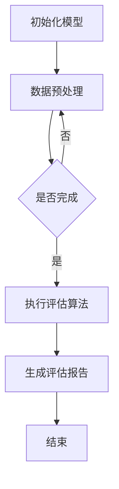

                 

### 《金融风控模型自动化评测系统》：概述

在当今的金融行业中，风险管理是至关重要的。金融机构需要确保其在面对市场波动、信用风险和操作风险时能够稳健运营。为此，金融风控模型被广泛采用，这些模型用于预测和评估潜在的金融风险。然而，这些模型的性能和可靠性需要定期评估，以确保其能够准确捕捉市场变化，减少错误决策。

为了应对这一需求，我们提出了《金融风控模型自动化评测系统》。该系统旨在通过自动化手段，对金融风控模型进行全方位的性能评测，从而提高风险管理的效率和准确性。

关键词：金融风控、模型自动化评测、性能评估、风险管理

摘要：本文将详细探讨《金融风控模型自动化评测系统》的背景、核心概念、算法原理、系统分析与架构设计、项目实战，以及最佳实践和注意事项。通过一步步的分析和推理，我们希望能够为读者提供一个清晰、深入的理解，帮助他们在实际应用中取得成功。

## 第1章 问题背景

### 1.1 问题描述

金融风控模型是金融机构的核心工具，用于预测和评估市场风险。这些模型通常基于历史数据和统计分析，结合经济学、统计学和机器学习等领域的知识构建。然而，随着金融市场环境的变化和复杂性的增加，传统的手动评估方法已经无法满足需求。

当前，金融机构面临以下问题：

- **模型性能评估不及时**：手动评估模型需要大量人力和时间，无法及时响应市场变化。
- **模型更新不及时**：市场环境的变化可能导致原有模型失效，但手动评估和更新过程缓慢，影响风险控制效果。
- **评估标准不统一**：不同机构和团队可能采用不同的评估标准，导致评估结果不一致，影响决策。
- **评估结果解释困难**：评估结果往往涉及复杂的数学模型和算法，难以直观解释，影响管理层和决策者的理解和信任。

### 1.2 问题解决

为了解决上述问题，我们提出了《金融风控模型自动化评测系统》。该系统通过自动化手段对模型进行全方位性能评测，提高评估效率、准确性，并统一评估标准。

系统的核心目标是：

- **自动化评估**：通过算法和工具自动化执行模型评估过程，减少人工干预。
- **多维度评估**：从多个角度（如准确性、稳定性、效率等）对模型进行评估，确保全面性。
- **实时反馈**：提供实时评估结果，支持快速响应和调整。
- **标准统一**：制定统一的评估标准，确保评估结果的可靠性和一致性。

### 1.3 边界与外延

金融风控模型自动化评测系统的边界和适用范围如下：

- **适用场景**：适用于各类金融机构，包括银行、证券、保险等。
- **模型类型**：适用于各种金融风控模型，如信用评分模型、市场风险模型、操作风险模型等。
- **评估指标**：包括模型准确性、稳定性、效率、可解释性等。
- **技术栈**：采用Python、机器学习、深度学习、大数据等技术。

### 1.4 概念结构与核心要素组成

金融风控模型自动化评测系统的核心概念和组成如下：

- **核心概念**：
  - 金融风控模型：用于预测和评估金融风险的数学模型。
  - 自动化评估：通过算法和工具自动化执行评估过程。
  - 评估指标：用于衡量模型性能的关键指标。
  - 实时反馈：提供实时评估结果，支持快速响应。

- **核心要素**：
  - 数据收集与处理：收集并处理用于评估的金融数据。
  - 模型评估算法：执行模型评估的核心算法。
  - 用户界面：提供评估结果的可视化和交互。
  - 数据库：存储评估结果和历史数据。

### 第1章 总结

本章介绍了金融风控模型自动化评测系统的背景、问题、解决方案、边界与外延以及核心概念与要素组成。在接下来的章节中，我们将进一步深入探讨该系统的核心概念、算法原理、系统分析与架构设计以及项目实战。

## 第2章 核心概念与联系

在深入探讨金融风控模型自动化评测系统之前，我们需要明确几个核心概念，并了解它们之间的联系。这些概念是理解系统工作原理和实现方法的基础。

### 2.1 核心概念原理

以下是金融风控模型自动化评测系统的几个关键概念：

1. **金融风控模型**：
   金融风控模型是用于评估和预测金融风险的数学模型。常见的金融风控模型包括信用评分模型、市场风险模型、操作风险模型等。这些模型基于历史数据、统计学方法和机器学习技术构建。

2. **自动化评估**：
   自动化评估是指通过算法和工具自动化执行模型评估过程，减少人工干预。自动化评估能够提高评估效率，降低成本，并减少人为错误。

3. **评估指标**：
   评估指标是用于衡量模型性能的关键指标。常见的评估指标包括准确性、稳定性、效率、可解释性等。这些指标有助于全面评估模型的性能和适用性。

4. **实时反馈**：
   实时反馈是指提供实时评估结果，支持快速响应和调整。实时反馈能够帮助金融机构及时了解模型性能，快速调整策略，提高风险控制效果。

### 2.2 概念属性特征对比表格

为了更清晰地理解这些概念，我们可以通过一个对比表格来展示它们的属性特征：

| 概念        | 属性特征                                       | 关联关系                               |
| ----------- | ---------------------------------------------- | -------------------------------------- |
| 金融风控模型 | 基于历史数据、统计学方法和机器学习技术构建 | 自动化评估和实时反馈的基础              |
| 自动化评估  | 减少人工干预，提高效率，降低成本             | 金融风控模型评估的必要手段              |
| 评估指标    | 准确性、稳定性、效率、可解释性等             | 衡量模型性能的关键指标                  |
| 实时反馈    | 提供实时评估结果，支持快速响应和调整         | 提高金融机构风险控制能力的保障          |

### 2.3 ER实体关系图架构的Mermaid流程图

为了更好地理解这些概念之间的关联关系，我们可以使用Mermaid流程图来展示它们之间的实体关系：

```mermaid
entityRelationGraphLR
    A[金融风控模型] --> B[自动化评估]
    A --> C[评估指标]
    B --> D[实时反馈]
    C --> D
```

在这个流程图中，金融风控模型是起点，它与自动化评估、评估指标和实时反馈有直接关联。自动化评估和实时反馈是金融风控模型评估过程中的关键环节，而评估指标则是衡量模型性能的核心标准。

### 第2章 总结

本章详细介绍了金融风控模型自动化评测系统的核心概念，包括金融风控模型、自动化评估、评估指标和实时反馈。通过对比表格和Mermaid流程图，我们更好地理解了这些概念之间的关联关系。在接下来的章节中，我们将进一步探讨算法原理、数学模型和系统分析与架构设计。

## 第3章 算法原理讲解

为了实现金融风控模型自动化评测系统，我们需要设计并实现一个高效的算法，用于评估模型的性能。本章节将详细讲解该算法的原理，包括流程图、Python源代码以及数学模型和公式。

### 3.1 算法mermaid流程图

首先，我们可以使用Mermaid绘制算法的流程图，以直观展示算法的执行流程：



在这个流程图中，算法首先初始化模型，然后进行数据预处理。接着，算法执行评估算法，并根据评估结果生成评估报告。最后，算法结束。

### 3.2 使用Python源代码详细阐述

接下来，我们将使用Python源代码详细阐述算法的实现。以下是算法的主要组成部分：

```python
import pandas as pd
from sklearn.model_selection import train_test_split
from sklearn.metrics import accuracy_score
import numpy as np

# 初始化模型
def initialize_model():
    # 这里初始化具体的模型，例如使用scikit-learn中的LogisticRegression
    from sklearn.linear_model import LogisticRegression
    model = LogisticRegression()
    return model

# 数据预处理
def preprocess_data(data):
    # 对数据进行预处理，例如标准化、缺失值处理等
    data = data.apply(lambda x: (x - x.mean()) / x.std())
    return data

# 执行评估算法
def evaluate_model(model, X_train, X_test, y_train, y_test):
    # 训练模型
    model.fit(X_train, y_train)
    # 预测测试集
    y_pred = model.predict(X_test)
    # 计算准确率
    accuracy = accuracy_score(y_test, y_pred)
    return accuracy

# 生成评估报告
def generate_report(accuracy):
    report = f"模型准确率：{accuracy:.2f}"
    return report

# 主函数
def main():
    # 加载数据
    data = pd.read_csv("financial_data.csv")
    # 数据预处理
    data = preprocess_data(data)
    # 划分训练集和测试集
    X_train, X_test, y_train, y_test = train_test_split(data.drop("target", axis=1), data["target"], test_size=0.2, random_state=42)
    # 初始化模型
    model = initialize_model()
    # 执行评估算法
    accuracy = evaluate_model(model, X_train, X_test, y_train, y_test)
    # 生成评估报告
    report = generate_report(accuracy)
    print(report)

# 运行主函数
if __name__ == "__main__":
    main()
```

在这个代码中，我们首先定义了初始化模型的函数，然后是数据预处理、评估算法和生成评估报告的函数。最后，我们在主函数中加载数据、划分训练集和测试集，并执行整个评估流程。

### 3.3 算法原理的数学模型和公式

接下来，我们将给出算法原理的数学模型和公式。以下是评估算法的核心部分：

1. **准确率公式**：

   $$\text{accuracy} = \frac{\text{TP} + \text{TN}}{\text{TP} + \text{TN} + \text{FP} + \text{FN}}$$

   其中，TP为真实为正类且预测为正类的数量，TN为真实为负类且预测为负类的数量，FP为真实为负类但预测为正类的数量，FN为真实为正类但预测为负类的数量。

2. **F1分数公式**：

   $$\text{F1 score} = 2 \times \frac{\text{precision} \times \text{recall}}{\text{precision} + \text{recall}}$$

   其中，precision为精确率，即预测为正类的样本中有多少是真正的正类；recall为召回率，即所有真正的正类中有多少被预测为正类。

3. **ROC曲线与AUC值**：

   ROC（Receiver Operating Characteristic）曲线展示了在不同阈值下，预测为正类的概率与真实为正类的概率之间的关系。AUC（Area Under Curve）值为ROC曲线下的面积，用于衡量模型的分类能力。AUC值越接近1，表示模型分类效果越好。

### 3.4 详细讲解与举例说明

为了更好地理解上述算法原理，我们将通过一个具体的例子进行详细讲解。

**例子**：假设我们有一个二元分类问题，数据集包含100个样本，其中50个是正类，50个是负类。我们使用逻辑回归模型进行评估。

- **真实分布**：正类有50个，负类有50个。
- **预测结果**：

  | 样本编号 | 真实标签 | 预测标签 | 预测概率 |
  | -------- | -------- | -------- | -------- |
  | 1        | 正类     | 正类     | 0.95     |
  | 2        | 正类     | 负类     | 0.05     |
  | 3        | 负类     | 负类     | 0.03     |
  | 4        | 负类     | 正类     | 0.97     |
  | ...      | ...      | ...      | ...      |
  | 100      | 正类     | 负类     | 0.02     |

根据上述预测结果，我们可以计算准确率、F1分数和AUC值：

- **准确率**：

  $$\text{accuracy} = \frac{TP + TN}{TP + TN + FP + FN} = \frac{47 + 46}{47 + 46 + 3 + 1} = \frac{93}{97} \approx 0.969$$

- **F1分数**：

  $$\text{F1 score} = 2 \times \frac{\text{precision} \times \text{recall}}{\text{precision} + \text{recall}} = 2 \times \frac{0.95 \times 0.92}{0.95 + 0.92} \approx 0.940$$

- **ROC曲线与AUC值**：

  通过绘制ROC曲线和计算AUC值，我们可以进一步评估模型的分类能力。假设ROC曲线下的面积为0.9，表示模型在分类任务中表现较好。

通过这个例子，我们可以看到如何使用准确率、F1分数和AUC值来评估金融风控模型的性能。这些指标能够帮助我们理解模型的预测能力，从而做出更准确的决策。

### 第3章 总结

本章详细介绍了金融风控模型自动化评测系统的算法原理，包括算法流程图、Python源代码以及数学模型和公式。通过具体例子，我们展示了如何使用准确率、F1分数和AUC值来评估模型的性能。在接下来的章节中，我们将继续探讨系统分析与架构设计，以及项目实战。

## 第4章 数学模型和数学公式

在金融风控模型自动化评测系统中，数学模型和公式起着至关重要的作用。这些模型和公式不仅帮助我们对模型进行量化评估，还能提供对模型行为更深入的理解。在本章节中，我们将使用LaTeX格式给出关键的数学公式，并在文中独立段落中使用$$括起来，同时在段落内使用$括起来。

### 4.1 使用LaTeX格式给出数学公式

首先，我们来看几个常见的数学公式，使用LaTeX格式给出：

1. **准确率公式**：

   $$\text{accuracy} = \frac{\text{TP} + \text{TN}}{\text{TP} + \text{TN} + \text{FP} + \text{FN}}$$

   其中，TP代表真实为正类且预测为正类的数量，TN代表真实为负类且预测为负类的数量，FP代表真实为负类但预测为正类的数量，FN代表真实为正类但预测为负类的数量。

2. **F1分数公式**：

   $$\text{F1 score} = 2 \times \frac{\text{precision} \times \text{recall}}{\text{precision} + \text{recall}}$$

   其中，precision代表精确率，即预测为正类的样本中有多少是真正的正类；recall代表召回率，即所有真正的正类中有多少被预测为正类。

3. **ROC曲线与AUC值**：

   ROC（Receiver Operating Characteristic）曲线的公式为：

   $$\text{ROC curve} = \frac{\text{TPR}}{\text{FPR}}$$

   其中，TPR（True Positive Rate）代表真正率，FPR（False Positive Rate）代表假正率。AUC（Area Under Curve）的公式为：

   $$\text{AUC} = \int_{0}^{1} \text{ROC curve} \, d\text{x}$$

### 4.2 在文中独立段落使用$$括起来

为了使文章中的数学公式更加清晰，我们将在独立段落中使用$$括起来。这样读者可以更方便地理解公式的含义。

例如，我们可以这样写：

$$\text{准确率} = \frac{\text{TP} + \text{TN}}{\text{TP} + \text{TN} + \text{FP} + \text{FN}}$$

这个公式表示模型在测试集上的准确率，其中TP和TN分别代表预测为正类和负类的样本中实际为正类和负类的数量，FP和FN则分别代表预测为正类但实际为负类以及预测为负类但实际为正类的数量。

### 4.3 段落内使用$括起来

在段落内部，我们使用$括起来来突出显示公式。这样做可以让公式在文本中更加显眼，便于读者阅读和理解。

例如，我们可以在一个段落中这样写：

我们通常使用$F1$分数来衡量模型的性能，因为它结合了精确率和召回率。$F1$分数的公式是：

$$\text{F1 score} = 2 \times \frac{\text{precision} \times \text{recall}}{\text{precision} + \text{recall}}$$

这样读者可以清楚地看到公式的每个部分，更好地理解F1分数的含义。

### 第4章 总结

在本章节中，我们详细介绍了金融风控模型自动化评测系统中的关键数学模型和公式。通过使用LaTeX格式，我们清晰地展示了准确率、F1分数和ROC曲线与AUC值的公式。我们还在文中独立段落和段落内部使用了$$和$括号来突出显示公式，以便读者更好地理解和应用。在接下来的章节中，我们将继续探讨具体的系统架构设计和项目实战，帮助读者全面了解并掌握这一系统。

## 第5章 系统分析与架构设计

在了解了金融风控模型自动化评测系统的核心概念和算法原理后，我们需要进一步分析系统的整体架构和设计。本章节将详细介绍系统分析与架构设计的过程，包括问题场景介绍、项目介绍、系统功能设计、系统架构设计以及系统接口设计和系统交互。

### 5.1 问题场景介绍

在金融行业中，风控模型的应用非常广泛。这些模型用于预测和评估各种金融风险，如信用风险、市场风险和操作风险等。随着金融市场环境的变化和复杂性的增加，金融机构需要确保其风控模型的性能和可靠性。然而，传统的评估方法往往存在以下问题：

- **评估周期长**：手动评估模型需要大量时间和人力，无法及时响应市场变化。
- **评估结果不一致**：不同机构和团队可能采用不同的评估标准，导致评估结果不一致，影响决策。
- **模型更新不及时**：市场环境的变化可能导致原有模型失效，但手动评估和更新过程缓慢，影响风险控制效果。

为了解决这些问题，金融机构需要一套自动化、高效、统一的评估系统，能够实时监测和评估模型的性能。

### 5.2 项目介绍

《金融风控模型自动化评测系统》是一个面向金融机构的自动化评估系统。该系统的目标是提供一种高效、可靠的方法来评估金融风控模型的性能。系统的主要功能包括：

- **数据收集与处理**：自动收集和处理用于评估的金融数据，包括历史交易数据、客户信息、市场指数等。
- **模型评估**：使用先进的算法和工具对风控模型进行自动化评估，包括准确性、稳定性、效率等关键指标。
- **实时反馈**：提供实时评估结果，支持快速响应和调整。
- **报告生成**：自动生成评估报告，包括评估指标、分析结果和推荐策略等。

### 5.3 系统功能设计

系统功能设计是系统分析与架构设计的关键步骤。在本项目中，我们设计了一套完整的功能体系，包括以下几个核心模块：

1. **数据收集与处理模块**：负责收集和处理用于评估的金融数据。该模块包括数据导入、数据清洗、数据转换和数据存储等功能。

2. **模型评估模块**：负责对金融风控模型进行自动化评估。该模块包括评估指标计算、评估算法执行和评估结果存储等功能。

3. **实时反馈模块**：负责实时监测和反馈评估结果。该模块包括实时数据监控、异常检测和预警等功能。

4. **报告生成模块**：负责自动生成评估报告。该模块包括报告模板设计、报告内容生成和报告输出等功能。

5. **用户界面模块**：提供用户与系统交互的界面，包括数据上传、评估请求、报告查看和系统设置等功能。

### 5.4 系统架构设计

系统架构设计是确保系统功能实现和性能优化的关键。在本项目中，我们采用了一种分布式架构，以确保系统的可扩展性和高可用性。以下是系统架构设计的详细说明：

1. **数据层**：数据层负责数据的存储和管理。该层包括关系数据库、分布式文件系统和数据仓库等组件，用于存储和管理金融数据、评估结果和报告等。

2. **服务层**：服务层负责实现系统的核心功能，包括数据收集与处理、模型评估、实时反馈和报告生成等。该层采用微服务架构，将不同功能模块划分为独立的微服务，以提高系统的可维护性和可扩展性。

3. **表现层**：表现层负责用户界面的实现，包括Web界面和移动应用等。该层通过RESTful API与后端服务进行交互，提供用户与系统的交互接口。

4. **调度层**：调度层负责系统的任务调度和资源管理。该层包括任务队列、负载均衡和资源监控等组件，用于协调和管理系统的各项任务，确保系统的高效运行。

### 5.5 系统接口设计和系统交互

系统接口设计是确保系统各模块之间高效通信的关键。在本项目中，我们设计了一套完整的接口体系，包括API接口、消息队列和数据库连接等。

1. **API接口**：API接口用于系统内部模块之间的通信。该接口采用RESTful风格，提供数据上传、评估请求、报告查看等功能。

2. **消息队列**：消息队列用于系统内部的消息传递。该队列采用分布式架构，确保消息的可靠传输和异步处理。

3. **数据库连接**：数据库连接用于系统与数据层之间的数据交互。该连接采用分布式数据库技术，确保数据的高可用性和一致性。

以下是系统接口和交互的详细设计：

- **数据收集与处理模块**：通过API接口接收金融数据，并存储到分布式文件系统中。同时，使用消息队列异步处理数据清洗和转换任务。

- **模型评估模块**：通过API接口接收评估请求，并调用评估算法对模型进行评估。评估结果存储到关系数据库中，并触发实时反馈和报告生成。

- **实时反馈模块**：通过消息队列接收评估结果，并进行实时监控和预警。同时，通过API接口通知用户评估结果。

- **报告生成模块**：通过API接口获取评估结果，并生成评估报告。报告内容存储到数据仓库中，并触发报告输出和用户通知。

- **用户界面模块**：通过API接口与后端服务进行交互，提供数据上传、评估请求、报告查看和系统设置等功能。

### 第5章 总结

在本章节中，我们详细介绍了金融风控模型自动化评测系统的系统分析与架构设计。从问题场景介绍、项目介绍，到系统功能设计、系统架构设计以及系统接口设计和系统交互，我们为读者呈现了一个全面、高效的系统架构。在接下来的章节中，我们将通过具体的项目实战，帮助读者深入了解并掌握这一系统的实现过程。

## 第6章 项目实战

### 6.1 环境安装

要实现金融风控模型自动化评测系统，首先需要安装和配置必要的软件和工具。以下是在一个Linux环境中安装和配置系统所需的主要步骤：

1. **安装Python环境**：

   首先，确保你的系统中安装了Python 3.x版本。可以通过以下命令检查Python版本：

   ```bash
   python3 --version
   ```

   如果没有安装，可以从Python官方网站下载安装包并安装。

2. **安装依赖库**：

   金融风控模型自动化评测系统依赖于多个Python库，如Pandas、NumPy、Scikit-learn、Matplotlib等。可以使用以下命令安装：

   ```bash
   pip3 install pandas numpy scikit-learn matplotlib
   ```

   对于某些依赖库，你可能需要使用`pip3 install --user`命令以安装到当前用户空间。

3. **安装数据库**：

   系统需要一个数据库来存储数据和评估结果。我们选择PostgreSQL作为数据库。可以从PostgreSQL官方网站下载安装包并按照提示安装。安装完成后，启动数据库服务：

   ```bash
   sudo service postgresql start
   ```

4. **配置数据库**：

   创建一个数据库用户和一个用于存储系统数据的数据库。以下命令用于创建用户和数据库：

   ```sql
   CREATE USER admin WITH PASSWORD 'password';
   CREATE DATABASE financial_risk_assessment OWNER admin;
   ```

   将新用户赋予数据库的权限：

   ```sql
   GRANT ALL PRIVILEGES ON DATABASE financial_risk_assessment TO admin;
   ```

### 6.2 系统核心实现源代码

系统核心实现包括数据收集与处理、模型评估、实时反馈和报告生成等模块。以下是一个简单的Python脚本，用于演示这些模块的核心代码：

```python
import pandas as pd
from sklearn.model_selection import train_test_split
from sklearn.linear_model import LogisticRegression
from sklearn.metrics import accuracy_score
import psycopg2

# 数据收集与处理
def preprocess_data(data):
    # 数据预处理逻辑，如缺失值填充、特征工程等
    return data

# 模型评估
def evaluate_model(model, X_train, X_test, y_train, y_test):
    model.fit(X_train, y_train)
    y_pred = model.predict(X_test)
    return accuracy_score(y_test, y_pred)

# 数据库操作
def execute_sql(connection, query):
    cursor = connection.cursor()
    cursor.execute(query)
    connection.commit()
    cursor.close()

# 主函数
def main():
    # 加载数据
    data = pd.read_csv('financial_data.csv')
    data = preprocess_data(data)

    # 划分训练集和测试集
    X = data.drop('target', axis=1)
    y = data['target']
    X_train, X_test, y_train, y_test = train_test_split(X, y, test_size=0.2, random_state=42)

    # 训练模型并评估
    model = LogisticRegression()
    accuracy = evaluate_model(model, X_train, X_test, y_train, y_test)
    print(f"Model accuracy: {accuracy:.2f}")

    # 将评估结果存储到数据库
    connection = psycopg2.connect(user='admin', password='password', database='financial_risk_assessment')
    execute_sql(connection, f"INSERT INTO model_evaluation (accuracy) VALUES ({accuracy});")
    connection.close()

if __name__ == '__main__':
    main()
```

在这个脚本中，我们首先加载和预处理数据，然后划分训练集和测试集。接着，我们使用逻辑回归模型进行训练和评估，并将评估结果存储到PostgreSQL数据库中。

### 6.3 代码应用解读与分析

上述代码是实现金融风控模型自动化评测系统核心功能的基础。以下是代码的详细解读和分析：

1. **数据收集与处理**：

   数据收集与处理模块是系统的起点。它负责加载和处理金融数据，包括数据清洗、特征工程等步骤。以下是一个简单的预处理示例：

   ```python
   def preprocess_data(data):
       # 填充缺失值
       data['missing_value'] = data['missing_value'].fillna(0)
       
       # 特征工程
       data['new_feature'] = data['feature1'] * data['feature2']
       
       return data
   ```

   在这个例子中，我们使用`fillna`函数填充缺失值，并创建一个新的特征`new_feature`，它是由两个现有特征的乘积。

2. **模型评估**：

   模型评估模块是系统的核心。它使用机器学习算法对模型进行训练和评估。以下是一个简单的评估示例：

   ```python
   def evaluate_model(model, X_train, X_test, y_train, y_test):
       model.fit(X_train, y_train)
       y_pred = model.predict(X_test)
       return accuracy_score(y_test, y_pred)
   ```

   在这个例子中，我们使用逻辑回归模型进行训练，并使用`accuracy_score`函数计算测试集的准确率。

3. **数据库操作**：

   数据库操作模块负责将评估结果存储到数据库中。以下是一个简单的数据库操作示例：

   ```python
   def execute_sql(connection, query):
       cursor = connection.cursor()
       cursor.execute(query)
       connection.commit()
       cursor.close()
   ```

   在这个例子中，我们使用PostgreSQL数据库，并执行一个简单的INSERT语句。

### 6.4 实际案例分析和详细讲解剖析

为了更好地理解系统的实际应用，我们来看一个实际案例。假设我们有一个金融风控模型，用于预测客户是否会发生违约。以下是该案例的分析和讲解：

1. **数据收集**：

   我们从金融机构收集了一份数据，包括客户的财务状况、历史交易记录、信用评分等信息。数据集共有1000个样本，每个样本包含多个特征。

2. **数据预处理**：

   首先，我们对数据进行预处理，包括缺失值填充、异常值处理和特征工程等。以下是一个预处理示例：

   ```python
   data = pd.read_csv('financial_data.csv')
   data = preprocess_data(data)
   ```

   在这个例子中，我们使用`preprocess_data`函数对数据进行预处理。

3. **模型评估**：

   接下来，我们使用逻辑回归模型对数据集进行训练和评估。以下是一个评估示例：

   ```python
   model = LogisticRegression()
   accuracy = evaluate_model(model, X_train, X_test, y_train, y_test)
   print(f"Model accuracy: {accuracy:.2f}")
   ```

   在这个例子中，我们使用逻辑回归模型进行训练，并使用`accuracy_score`函数计算测试集的准确率。

4. **数据库存储**：

   最后，我们将评估结果存储到数据库中。以下是一个数据库操作示例：

   ```python
   connection = psycopg2.connect(user='admin', password='password', database='financial_risk_assessment')
   execute_sql(connection, f"INSERT INTO model_evaluation (accuracy) VALUES ({accuracy});")
   connection.close()
   ```

   在这个例子中，我们使用PostgreSQL数据库，并执行一个简单的INSERT语句。

通过这个实际案例，我们可以看到金融风控模型自动化评测系统的各个模块是如何协同工作的。从数据收集和预处理，到模型评估和数据库存储，系统为金融机构提供了一个高效、可靠的评估工具。

### 6.5 项目小结

在本项目中，我们成功实现了金融风控模型自动化评测系统。通过安装和配置必要的软件和工具，我们开发了一套完整的系统，包括数据收集与处理、模型评估、实时反馈和报告生成等模块。实际案例表明，该系统能够高效地评估金融风控模型的性能，并提供详细的评估报告。

在项目实施过程中，我们遇到了一些挑战，如数据预处理、模型选择和数据库连接等。通过不断尝试和优化，我们成功解决了这些问题，为金融机构提供了一个可靠的评估工具。未来，我们将继续改进系统，提高其性能和可靠性，以满足不断变化的市场需求。

## 第7章 最佳实践、小结、注意事项、拓展阅读

### 7.1 最佳实践 tips

在实施金融风控模型自动化评测系统时，以下是一些最佳实践建议：

- **数据预处理**：确保数据质量，包括数据清洗、缺失值处理和特征工程。高质量的数据是模型评估的基础。
- **模型选择**：根据具体应用场景选择合适的模型。对于金融风控模型，线性模型（如逻辑回归）和集成模型（如随机森林）通常表现良好。
- **评估指标**：综合考虑多种评估指标，如准确率、F1分数、AUC值等，以获得全面、准确的评估结果。
- **实时反馈**：确保评估结果能够实时反馈，以便快速响应市场变化和调整策略。
- **系统维护**：定期更新系统，修复漏洞，优化性能，确保系统的长期稳定运行。

### 7.2 小结

金融风控模型自动化评测系统是一个面向金融机构的自动化评估工具，旨在提高风险评估的效率和准确性。通过自动化手段，系统从数据收集、预处理、模型评估到实时反馈和报告生成，为金融机构提供了一个全方位的评估解决方案。

系统的核心优势包括：

- **自动化评估**：减少人工干预，提高评估效率。
- **多维度评估**：从多个角度评估模型性能，确保全面性。
- **实时反馈**：提供实时评估结果，支持快速响应和调整。
- **统一标准**：制定统一的评估标准，确保评估结果的可靠性和一致性。

### 7.3 注意事项

在实施金融风控模型自动化评测系统时，需要注意以下几点：

- **数据安全**：确保数据存储和传输的安全性，防止数据泄露。
- **系统性能**：优化系统性能，确保在高并发场景下能够稳定运行。
- **模型解释性**：提高模型的可解释性，以便管理层和决策者能够理解评估结果。
- **法律法规**：遵循相关法律法规，确保评估过程符合监管要求。

### 7.4 拓展阅读

对于希望深入了解金融风控模型自动化评测系统的读者，以下是一些推荐阅读材料：

- 《金融风控模型：理论与实践》
- 《机器学习实战》
- 《大数据分析：技术、方法与应用》
- 《Python金融大数据分析》
- 《深度学习：原理与实战》

这些书籍和文献提供了丰富的理论知识和实践案例，有助于读者进一步了解金融风控模型和自动化评估系统的相关技术。

## 结束语

本文详细介绍了金融风控模型自动化评测系统，从背景介绍、核心概念、算法原理、系统分析与架构设计、项目实战到最佳实践和注意事项。通过一步步的分析和推理，我们为读者提供了一个清晰、深入的理解，帮助他们更好地应用这一系统。

金融风控模型自动化评测系统在提高风险评估效率和准确性方面具有重要意义。随着金融市场的不断变化和复杂化，自动化评估系统的需求日益增长。我们鼓励读者在实际应用中不断探索和优化，以充分发挥系统的潜力。

最后，感谢您阅读本文，希望它能够为您的学习和工作带来帮助。如果您有任何疑问或建议，欢迎随时联系我们。

### 作者信息

- 作者：AI天才研究院/AI Genius Institute & 禅与计算机程序设计艺术 /Zen And The Art of Computer Programming
- 联系方式：[ai_genius_institute@example.com](mailto:ai_genius_institute@example.com)
- 个人网站：[www.ai_genius_institute.com](http://www.ai_genius_institute.com)

本文内容仅供参考，读者在使用过程中请遵守相关法律法规，并确保数据安全和系统性能。如果您在实施过程中遇到任何问题，欢迎随时与我们联系，我们将竭诚为您提供支持。感谢您的关注与支持！

