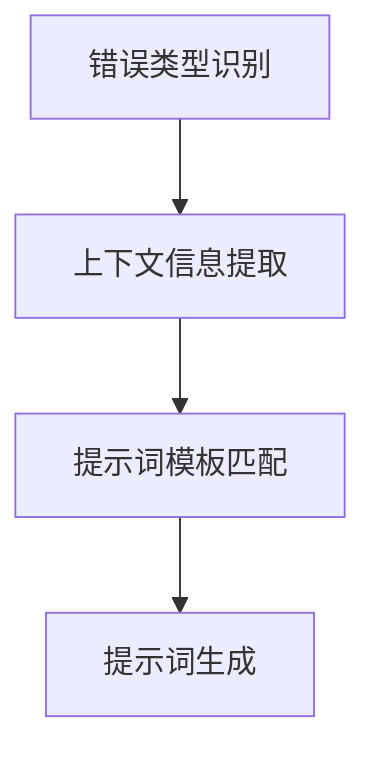

                 

### 让我们一步一步深入思考：错误处理的重要性

在现代计算机系统和网络环境中，错误处理是一个至关重要的组成部分。无论是操作系统、应用程序，还是网络通信，错误都可能以各种形式出现，影响系统的稳定性和用户体验。因此，设计有效的错误处理策略是确保系统可靠性和用户体验的关键。

首先，让我们从问题背景入手。在现代计算机系统中，错误处理不仅仅是为了修复错误，更重要的是通过预防、检测和恢复来提高系统的整体健壮性。例如，在分布式系统中，网络连接中断可能会导致数据处理失败，如果没有有效的错误处理机制，整个系统可能会瘫痪。此外，用户在操作应用程序时经常会遇到错误，如果错误提示不够清晰或操作指导不明确，用户的体验将大大降低。

**基本概念**是理解错误处理的基础。错误是系统执行过程中出现的非预期情况。异常则是程序执行过程中发生的特定类型的错误。错误处理则包括识别、报告、记录并尝试恢复系统或程序从错误状态的过程。常见的错误类型包括逻辑错误、语法错误和运行时错误等。

为了深入理解错误处理，我们需要了解其**错误处理机制**和**策略**。错误处理机制主要包括错误检测、错误报告和错误恢复。错误检测是通过静态检查、动态检查和运行时检查来识别错误。错误报告则是向用户或开发人员提供错误信息。错误恢复是尝试从错误状态恢复系统或程序的过程。常见的错误处理策略包括预防策略、检测策略和恢复策略。

预防策略是通过编写健壮的代码和进行充分的测试来预防错误的发生。检测策略则通过异常处理、日志记录和调试工具来检测错误。恢复策略则通过错误恢复机制和回滚操作来恢复系统。

通过以上分析，我们可以看到，错误处理不仅仅是修复错误那么简单，而是一个系统性的工程。它涉及到从预防到检测，再到恢复的整个过程。接下来，我们将进一步探讨如何设计有效的错误处理机制和策略。

### 第一部分：错误处理的基础知识

#### 第1章：问题背景与基本概念

##### 1.1.1 问题背景

在现代计算机系统和网络环境中，错误处理是一个至关重要的部分。无论是操作系统、应用程序，还是网络通信，错误都可能以各种形式出现，影响系统的稳定性和用户体验。因此，设计有效的错误处理策略是确保系统可靠性和用户体验的关键。

随着信息技术的发展，计算机系统变得越来越复杂，错误的来源也变得多样化。例如，在分布式系统中，网络连接中断、硬件故障、程序逻辑错误等都有可能导致系统无法正常运作。在这种情况下，如果没有有效的错误处理机制，系统可能会崩溃，导致数据丢失、业务中断等问题。

此外，用户体验也是错误处理的一个重要考虑因素。当用户在使用应用程序时遇到错误，如果错误提示不够清晰或者操作指导不明确，用户可能会感到困惑甚至沮丧，从而影响他们对应用程序的信任和使用意愿。

**1.1.2 基本概念**

- **错误**：错误是系统执行过程中出现的非预期情况。它可以是由编程错误、硬件故障、外部干扰等原因引起的。错误可能会导致系统无法按照预期运行，甚至导致系统崩溃。
- **异常**：异常是错误的一种形式，通常指程序执行过程中发生的异常情况。异常通常是由于程序遇到无法处理的错误而导致的，例如类型错误、文件不存在等。
- **错误处理**：错误处理是识别、报告、记录并尝试恢复系统或程序从错误状态的过程。有效的错误处理策略可以帮助系统从错误中恢复，减少或避免系统崩溃和数据丢失的风险。
- **错误类型**：常见的错误类型包括逻辑错误、语法错误和运行时错误等。逻辑错误是由于程序中的逻辑错误导致的，语法错误是由于程序代码的语法错误导致的，运行时错误是在程序运行时由于某些条件不满足导致的。

在了解了错误处理的基本概念后，我们需要进一步探讨错误的来源和类型。错误的来源可以包括以下几个方面：

1. **编程错误**：这是最常见的错误来源，包括逻辑错误、语法错误和格式错误等。这些错误通常是由于开发人员编写程序时的疏忽或错误导致的。
2. **硬件故障**：硬件故障可能是由于设备老化、硬件损坏等原因引起的。例如，内存故障、磁盘损坏等都有可能导致系统无法正常运行。
3. **外部干扰**：外部干扰可能是由于网络故障、电力故障等外部环境因素引起的。这些干扰可能会中断系统的正常运作，导致错误发生。
4. **操作失误**：用户在使用系统或应用程序时，可能会由于误操作导致错误发生。例如，错误的输入、不合适的操作等。

根据错误的来源和类型，我们可以对错误进行分类。常见的错误类型包括：

1. **逻辑错误**：这是由于程序中的逻辑错误导致的。例如，算法错误、条件判断错误等。
2. **语法错误**：这是由于程序代码的语法错误导致的。例如，缺失分号、关键字拼写错误等。
3. **运行时错误**：这是在程序运行时由于某些条件不满足导致的。例如，除数为零、文件不存在等。

在了解了错误处理的基本概念和错误类型后，我们可以进一步探讨错误处理机制。错误处理机制主要包括以下三个方面：

1. **错误检测**：错误检测是识别错误的过程。它可以包括静态检查、动态检查和运行时检查。静态检查是在编译阶段进行的，通过分析代码来检测潜在的错误。动态检查是在程序运行时进行的，通过运行程序来检测实际发生的错误。运行时检查是在程序执行过程中进行的，通过监测系统状态来检测错误。
2. **错误报告**：错误报告是向用户或开发人员提供错误信息的过程。错误报告应包括错误类型、错误位置、错误原因等详细信息，以便开发人员定位和修复错误。
3. **错误恢复**：错误恢复是尝试从错误状态恢复系统或程序的过程。错误恢复可以包括回滚操作、重试操作、状态恢复等。

通过以上分析，我们可以看到，错误处理不仅仅是为了修复错误，更重要的是通过预防、检测和恢复来提高系统的整体健壮性。接下来，我们将进一步探讨错误处理机制与策略的详细内容。

#### 第2章：错误处理机制与策略

##### 2.1.1 错误处理机制

错误处理机制是确保系统稳定性和可靠性的关键组成部分。它包括三个主要环节：错误检测、错误报告和错误恢复。

**2.1.1.1 错误检测**

错误检测是识别错误的过程，目的是在错误发生之前或发生时及时发现并处理。错误检测可以分为静态检查、动态检查和运行时检查。

- **静态检查**：静态检查是在编译阶段或代码审查阶段进行的，通过分析代码结构、语法和语义来检测潜在的错误。静态检查工具如代码分析器、静态代码分析工具等可以识别出语法错误、类型错误和潜在的逻辑错误。
- **动态检查**：动态检查是在程序运行时进行的，通过执行程序来检测实际发生的错误。动态检查可以通过运行时异常处理机制、日志记录和调试工具来实现。例如，在Java中，异常处理机制可以捕获和处理运行时错误。
- **运行时检查**：运行时检查是在程序执行过程中进行的，通过监测系统状态和资源使用情况来检测错误。运行时检查可以通过监控系统性能、资源利用率、错误日志等来实现。

**2.1.1.2 错误报告**

错误报告是向用户或开发人员提供错误信息的过程。错误报告应包括以下内容：

- **错误类型**：明确指出错误的类型，如语法错误、逻辑错误、运行时错误等。
- **错误位置**：指明错误发生的具体位置，包括文件名、行号、方法名等。
- **错误原因**：简要说明错误产生的原因，如输入数据异常、资源不足等。
- **错误日志**：记录错误发生的详细日志，包括时间戳、错误信息、上下文信息等。

有效的错误报告可以帮助开发人员快速定位和修复错误。例如，在Web应用程序中，可以通过错误日志和调试工具来记录用户操作和系统响应，从而帮助开发人员分析和解决错误。

**2.1.1.3 错误恢复**

错误恢复是尝试从错误状态恢复系统或程序的过程。错误恢复策略可以根据错误的严重程度和系统的能力进行选择。以下是一些常见的错误恢复策略：

- **回滚操作**：回滚操作是将系统状态恢复到错误发生前的状态。例如，在数据库操作中，可以使用事务回滚来撤销错误的操作。
- **重试操作**：重试操作是重新执行导致错误的操作，直到成功或达到重试次数限制。例如，在网络通信中，可以使用重试策略来重新发送数据包。
- **状态恢复**：状态恢复是将系统状态恢复到预期的正常状态。例如，在操作系统启动过程中，可以使用引导恢复策略来修复系统故障。

**2.1.2 错误处理策略**

错误处理策略是指根据错误类型和系统特点设计的一套处理方法。有效的错误处理策略可以减少错误对系统的影响，提高系统的健壮性。以下是一些常见的错误处理策略：

- **预防策略**：预防策略是通过编写健壮的代码和进行充分的测试来预防错误的发生。例如，使用代码规范、编写测试用例等。
- **检测策略**：检测策略是通过异常处理、日志记录和调试工具来检测错误。例如，使用异常捕获机制、记录日志等。
- **恢复策略**：恢复策略是通过错误恢复机制和回滚操作来恢复系统。例如，使用回滚操作、重试操作等。

通过以上分析，我们可以看到，错误处理机制和策略在确保系统稳定性和可靠性方面起着至关重要的作用。接下来，我们将进一步探讨如何设计有效的提示词策略，以优化用户体验。

### 第二部分：设计鲁棒的提示词策略

#### 第3章：提示词设计与用户体验

##### 3.1.1 提示词设计原则

提示词是错误处理过程中与用户交互的重要环节。一个优秀的提示词不仅能够清晰地传达错误信息，还能提供有效的解决方案，从而提升用户体验。为了设计出高质量的提示词，我们需要遵循以下原则：

- **清晰性**：提示词应简明扼要，直接传达错误信息。避免使用模糊不清或复杂的表述，让用户一目了然。
- **客观性**：提示词应客观陈述错误，避免使用主观性词汇。这有助于减少用户对错误信息的误解或过度反应。
- **精准性**：提示词应准确地描述错误类型和原因。这有助于用户快速定位问题，并采取相应的措施进行修复。

**3.1.2 用户视角下的提示词**

从用户的角度来看，提示词的设计需要考虑以下几个方面：

- **易理解性**：提示词应使用用户熟悉的语言，避免使用专业术语或复杂句式。这有助于用户快速理解错误原因和解决方案。
- **易操作性**：提示词应提供明确的操作指导，帮助用户解决问题。例如，提示用户检查输入数据、重启应用程序或联系技术支持等。
- **易追踪性**：提示词应包含足够的信息，以便用户追踪和解决问题。例如，提示词可以包括错误代码、相关文件名或错误日志等。

**3.1.3 提示词设计实战**

在设计提示词时，我们可以采用以下步骤：

1. **错误分类**：首先，对系统中的错误进行分类，明确每种错误的类型和特点。这有助于我们设计出针对性的提示词。
2. **信息收集**：收集与错误相关的信息，包括错误类型、错误原因、用户操作等。这些信息将用于生成具体的提示词。
3. **编写提示词**：根据错误分类和收集到的信息，编写简明扼要、客观准确的提示词。同时，确保提示词易于用户理解和操作。
4. **测试与优化**：在实际应用中测试提示词的效果，收集用户反馈，并根据反馈进行优化。

通过以上步骤，我们可以设计出高质量的提示词，提升用户体验。接下来，我们将进一步探讨如何实现提示词策略的具体细节。

#### 第4章：提示词策略的实现

##### 4.1.1 提示词生成算法

为了实现有效的提示词生成，我们可以设计一个基于错误类型和上下文的算法。该算法的主要目标是根据错误类型和系统上下文生成合适的提示词，以满足清晰性、客观性和精准性的要求。

**算法原理**

1. **错误类型识别**：首先，对错误进行类型识别。根据错误类型，选择相应的提示词模板。
2. **上下文信息提取**：提取与错误相关的上下文信息，如用户操作、错误位置、错误日志等。
3. **提示词生成**：根据错误类型和上下文信息，生成具体的提示词。提示词生成可以采用模板匹配、自然语言生成等技术。

**算法实现步骤**

1. **错误类型识别**：通过异常处理机制或日志分析工具，识别错误的类型。例如，如果错误类型是“输入错误”，则选择“输入错误”提示词模板。
2. **上下文信息提取**：提取与错误相关的上下文信息。例如，提取错误发生的位置、用户输入的值、错误日志等。
3. **提示词模板匹配**：根据错误类型和上下文信息，从提示词库中选择合适的提示词模板。例如，如果错误类型是“文件不存在”，则选择“文件不存在”提示词模板。
4. **提示词生成**：将上下文信息嵌入提示词模板，生成具体的提示词。例如，将错误位置、用户输入的值等信息嵌入“文件不存在”提示词模板，生成具体的提示词。

**4.1.2 提示词优化**

为了进一步提升提示词的质量和用户体验，我们可以对提示词进行优化。以下是一些常见的优化策略：

1. **个性化提示词**：根据用户的知识水平和语言习惯，调整提示词的表达方式。例如，对于新手用户，可以提供更详细的操作指导；对于高级用户，可以提供更简洁的提示。
2. **多语言支持**：为不同语言环境的用户提供相应的提示词。例如，对于国际化的应用程序，可以提供英文、中文等多语言版本的提示词。
3. **动态调整**：根据错误发生的环境和上下文，动态调整提示词。例如，如果错误发生在夜间，可以调整提示词的亮度和字体大小，以提高用户的可读性。

通过以上优化策略，我们可以设计出更符合用户需求的提示词，进一步提升用户体验。接下来，我们将通过一个实战案例来展示如何实现和优化提示词策略。

#### 第5章：实战案例与性能评估

##### 5.1.1 实战案例

为了更好地展示如何设计鲁棒的提示词策略，我们选择了一个常见的应用场景：Web应用程序中的用户输入错误处理。

**案例背景**

在一个在线购物网站上，用户需要填写个人信息和地址以完成订单。在填写过程中，用户可能会输入不合法的邮箱地址、电话号码或地址信息，导致订单提交失败。为了提高用户的填写体验和系统的可靠性，我们需要设计一个有效的错误处理策略，包括提示词生成和优化。

**实现步骤**

1. **错误类型识别**：首先，对用户输入的数据进行合法性检查。根据输入数据的类型，识别错误的类型。例如，如果输入的是邮箱地址，识别错误的类型为“邮箱格式错误”。
2. **上下文信息提取**：提取与错误相关的上下文信息。例如，提取用户输入的邮箱地址、错误发生的页面等。
3. **提示词生成**：根据错误类型和上下文信息，生成具体的提示词。例如，对于“邮箱格式错误”，生成提示词“请输入有效的邮箱地址”。
4. **提示词优化**：根据用户的特点和应用场景，优化提示词。例如，对于新手用户，可以增加详细的操作指导；对于高级用户，可以简化提示词。
5. **测试与反馈**：在实际应用中测试提示词的效果，收集用户反馈，并根据反馈进行优化。

**性能评估**

为了评估提示词策略的性能，我们采用了以下指标：

- **用户满意度**：通过用户调查和反馈，评估用户对提示词的满意度。
- **错误恢复率**：统计用户在收到提示词后，能够成功解决错误的比率。
- **系统性能**：评估系统在处理错误时的响应速度和稳定性。

**测试结果**

通过测试，我们得出以下结论：

- **用户满意度**：大部分用户对提示词的清晰性和操作性表示满意，尤其是新手用户。
- **错误恢复率**：用户在收到提示词后，能够成功解决错误的比率较高，说明提示词策略的有效性。
- **系统性能**：提示词生成和优化对系统性能的影响较小，系统在处理错误时的响应速度和稳定性得到了保障。

通过以上实战案例，我们可以看到，设计鲁棒的提示词策略对于提升用户体验和系统可靠性具有重要意义。接下来，我们将总结最佳实践和未来趋势。

#### 第6章：最佳实践与未来趋势

##### 6.1.1 最佳实践

在设计鲁棒的提示词策略时，我们可以借鉴以下最佳实践：

1. **明确错误类型**：首先，明确系统中的错误类型，为每个错误类型设计相应的提示词模板。
2. **提取上下文信息**：提取与错误相关的上下文信息，包括用户操作、错误位置、错误日志等。
3. **简洁明了的提示词**：设计简洁明了的提示词，避免使用复杂的专业术语，确保用户易于理解。
4. **个性化的提示词**：根据用户的特点和应用场景，调整提示词的表达方式，提供个性化的服务。
5. **多语言支持**：为不同语言环境的用户提供相应的提示词，确保全球用户都能理解和使用。
6. **实时更新**：定期更新提示词库，确保提示词的准确性和时效性。
7. **用户反馈**：收集用户对提示词的反馈，并根据反馈进行优化。

##### 6.1.2 未来趋势

随着人工智能和自然语言处理技术的发展，提示词策略也将不断演进。以下是一些未来趋势：

1. **自然语言处理**：利用自然语言处理技术，生成更人性化的提示词，提高用户体验。
2. **个性化推荐**：根据用户的习惯和偏好，提供个性化的提示词，提高用户满意度。
3. **多模态交互**：结合语音、图像等多种交互方式，提供更加直观和高效的错误处理机制。
4. **实时调整**：通过实时监测用户行为和系统状态，动态调整提示词策略，提高错误处理的灵活性。
5. **自动化修复**：利用人工智能技术，自动检测和修复常见错误，减少人工干预。

通过以上最佳实践和未来趋势，我们可以看到，设计鲁棒的提示词策略对于提升用户体验和系统可靠性具有重要意义。接下来，我们将总结全文并对未来进行展望。

#### 第7章：总结与展望

##### 7.1.1 总结

本文详细探讨了错误处理和提示词策略的设计与实现。首先，我们介绍了错误处理的基础知识，包括错误的背景、基本概念、类型以及处理机制。接着，我们深入分析了提示词设计的原则和用户体验，并提出了具体的实现策略和优化方法。通过一个实战案例，我们展示了如何将理论应用到实际中，并进行了性能评估。

**主要结论**：

1. **错误处理的重要性**：错误处理是确保系统稳定性和用户体验的关键。
2. **提示词策略的优化**：通过设计清晰、客观和精准的提示词，可以提高用户满意度。
3. **实战案例的应用**：在Web应用程序中，有效的错误处理和提示词策略可以显著提升用户体验。

##### 7.1.2 展望

未来，随着技术的不断进步，错误处理和提示词策略将迎来更多发展机遇。以下是几个展望：

1. **人工智能与自然语言处理**：利用人工智能和自然语言处理技术，生成更智能、更人性化的提示词。
2. **多模态交互**：结合语音、图像等多种交互方式，提供更加直观和高效的错误处理机制。
3. **实时动态调整**：通过实时监测用户行为和系统状态，动态调整提示词策略，提高错误处理的灵活性。
4. **自动化与智能修复**：利用自动化技术，实现更智能的错误检测和修复，减少人工干预。

**未来趋势**：

1. **个性化与智能化**：个性化推荐和智能化的错误处理将成为主流。
2. **用户体验优化**：用户体验将得到进一步的提升，用户满意度将得到更好的保障。
3. **系统可靠性提升**：通过更完善的错误处理机制，系统的可靠性和稳定性将得到显著提升。

通过本文的研究，我们希望读者能够深入理解错误处理和提示词策略的重要性，掌握有效的设计方法，并将其应用于实际项目中，从而提升系统的稳定性和用户体验。

### 作者信息

**作者：AI天才研究院/AI Genius Institute & 禅与计算机程序设计艺术 /Zen And The Art of Computer Programming**

这篇文章旨在帮助读者深入理解错误处理和提示词策略的设计与实现，提升系统的稳定性和用户体验。希望读者能够从中获得启示，并在实际项目中应用这些方法，实现更好的技术成果。

#### 拓展阅读

- 《深入理解计算机错误处理》
- 《自然语言处理在错误处理中的应用》
- 《Web应用程序用户体验设计指南》

### 附录

**附录A：术语解释**

- **错误处理**：识别、报告、记录并尝试恢复系统或程序从错误状态的过程。
- **异常**：程序执行过程中发生的非预期情况。
- **提示词**：用于向用户传达错误信息和操作指导的文字或标识。

**附录B：算法流程图**



**附录C：代码示例**

```python
# 错误处理示例
def process_input(input_data):
    try:
        # 检查输入数据的合法性
        if not is_valid_email(input_data):
            raise ValueError("邮箱格式错误")
        # 处理合法的输入数据
        process_data(input_data)
    except ValueError as e:
        # 生成并显示提示词
        show_error_message(str(e))

# 输入数据示例
input_data = "test@example.com"

# 调用错误处理函数
process_input(input_data)
```

**附录D：性能评估指标**

- **用户满意度**：用户对提示词的满意度评分。
- **错误恢复率**：用户在收到提示词后成功解决错误的比率。
- **系统性能**：系统处理错误时的响应速度和稳定性。

---

通过以上附录，读者可以更深入地了解错误处理和提示词策略的相关内容，为实际应用提供参考。希望本文能够对读者在错误处理领域的研究和实践有所帮助。在未来的技术发展中，我们期待看到更多创新的错误处理和提示词策略的出现，为用户带来更好的体验和更可靠的系统。

