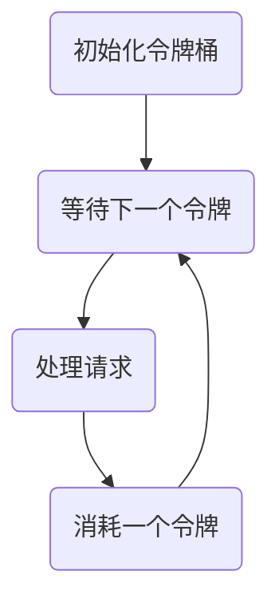
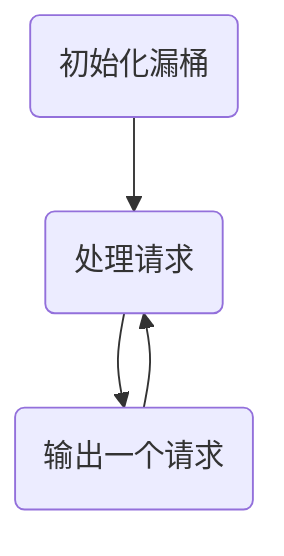
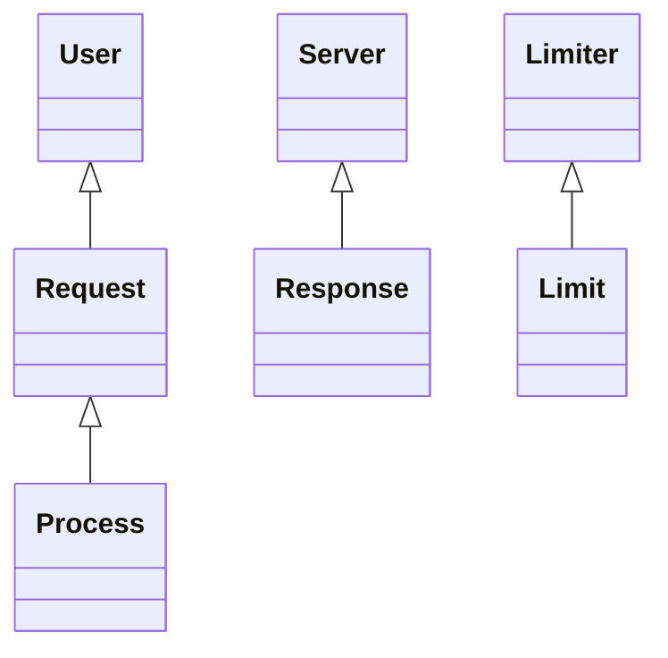
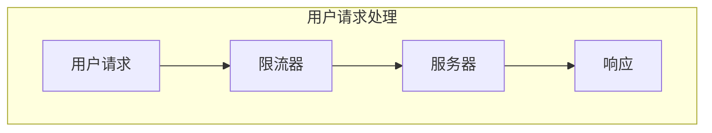
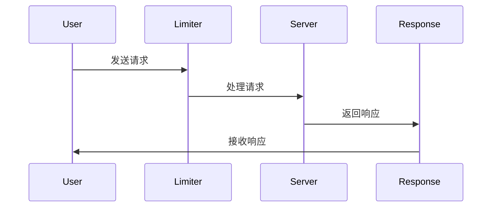

                 

### 文章标题：限流算法保护LLM应用免受过载

关键词：限流算法、LLM应用、过载攻击、系统架构、Python代码

摘要：本文将深入探讨限流算法在保护大型语言模型（LLM）应用免受过载攻击的作用。通过详细的分析和实例，我们不仅将理解限流算法的基本原理，还将了解如何在实际项目中应用这些算法，以保障LLM应用的稳定性和可靠性。

### 第一部分: 限流算法概述

#### 第1章: 问题背景与核心概念

##### 1.1 问题背景

在现代网络环境中，随着人工智能技术的发展，大型语言模型（LLM）的应用日益广泛。这些模型能够处理复杂的语言任务，提供高质量的文本生成和翻译服务。然而，这也带来了一个问题：过载攻击。

过载攻击是指恶意用户通过发送大量的请求，使得服务器无法及时处理，从而导致系统过载、响应时间延长甚至崩溃。这对LLM应用的影响尤为严重，因为它们往往需要处理大量的文本数据，且对响应速度有很高的要求。

##### 1.2 核心概念

限流算法是一种用于控制请求流量的技术，通过限制某个时间段内请求的频率，防止恶意用户对系统进行过载攻击。常见的限流算法包括令牌桶算法和漏桶算法。

##### 1.3 概念属性特征对比表格

| 算法         | 特点                                       | 适用场景                           |
|------------|------------------------------------------|----------------------------------|
| 令牌桶算法   | 可以处理突发流量，但平均速率受限               | 需要一定突发处理能力的场景           |
| 漏桶算法     | 平均速率严格受控，但无法处理突发流量           | 对平均速率有严格要求，不允许突发流量的场景 |

##### 1.4 ER实体关系图架构

```mermaid
erDiagram
  User ||--|{ Request }|
  Server ||--|{ Response }|
  Limiter ||--|{ Limit }|
  Request ||--|{ Process }|
```

在上图中，`User` 表示请求的发起者，`Request` 表示用户发送的请求，`Server` 表示服务器，`Response` 表示服务器的响应，`Limiter` 表示限流器，`Limit` 表示对请求流量的限制，`Process` 表示请求的处理过程。

### 第2章: 限流算法原理详解

##### 2.1 基本限流算法原理

**令牌桶算法**

令牌桶算法的基本原理是：一个固定大小的桶，以恒定的速率产生令牌，只有当桶中有令牌时，才能处理请求。下面是令牌桶算法的mermaid流程图：



**漏桶算法**

漏桶算法的基本原理是：以固定的速率出水（处理请求），无论桶中是否有水（请求）。下面是漏桶算法的mermaid流程图：



##### 2.2 数学模型和公式

令牌桶算法的数学模型如下：

- 令牌生成速率：\( r \)
- 令牌桶容量：\( C \)
- 时间窗口：\( T \)

漏桶算法的数学模型如下：

- 漏桶输出速率：\( r \)
- 时间窗口：\( T \)

##### 2.3 详细讲解与举例

**令牌桶算法**

```python
import time
import random

class TokenBucket:
    def __init__(self, r, C):
        self.r = r  # 令牌生成速率
        self.C = C  # 令牌桶容量
        self.tokens = C  # 当前令牌数
        self.last_check = time.time()

    def consume(self, n):
        if n <= self.tokens:
            self.tokens -= n
            return True
        else:
            return False

    def generate_tokens(self):
        now = time.time()
        interval = now - self.last_check
        tokens_to_generate = interval * self.r
        self.tokens = min(self.C, self.tokens + tokens_to_generate)
        self.last_check = now

# 测试
bucket = TokenBucket(1, 5)
for _ in range(10):
    if bucket.consume(1):
        print("请求处理成功")
    else:
        print("请求处理失败，当前令牌不足")
    time.sleep(random.uniform(0.1, 0.5))
```

**漏桶算法**

```python
import time
import random

class Bucket:
    def __init__(self, r):
        self.r = r  # 输出速率
        self.last_time = time.time()

    def consume(self):
        now = time.time()
        interval = now - self.last_time
        if interval >= 1 / self.r:
            self.last_time = now
            return True
        else:
            return False

# 测试
bucket = Bucket(1)
for _ in range(10):
    if bucket.consume():
        print("请求处理成功")
    else:
        print("请求处理失败，当前速率不足")
    time.sleep(random.uniform(0.1, 0.5))
```

### 第3章: 系统架构设计与实现

##### 3.1 问题场景介绍

假设我们有一个LLM应用，每天都会接收大量的请求。为了保障应用的稳定运行，我们需要使用限流算法来控制请求的流量。

##### 3.2 系统功能设计

系统功能设计包括用户请求处理、限流算法应用、请求响应等。领域模型mermaid类图如下：



##### 3.3 系统架构设计

系统架构设计包括用户请求、限流算法模块、服务器响应等。mermaid架构图如下：



##### 3.4 系统接口设计

系统接口设计包括用户请求接口、限流接口、服务器响应接口等。接口设计mermaid序列图如下：



##### 3.5 系统交互

系统交互包括用户请求发送、限流器处理、服务器响应等。mermaid序列图如下：


### 第4章: 项目实战

##### 4.1 环境安装

为了进行项目实战，我们需要安装以下环境：

- Python 3.8 或以上版本
- Flask 框架
- Redis 客户端

可以使用以下命令进行安装：

```bash
pip install flask redis
```

##### 4.2 系统核心实现

```python
from flask import Flask, request, jsonify
from redis import Redis
import time

app = Flask(__name__)
redis_client = Redis(host='localhost', port=6379, db=0)

# 令牌桶算法实现
class TokenBucket:
    def __init__(self, r, C):
        self.r = r  # 令牌生成速率
        self.C = C  # 令牌桶容量
        self.tokens = C  # 当前令牌数
        self.last_check = time.time()

    def consume(self, n):
        if n <= self.tokens:
            self.tokens -= n
            return True
        else:
            return False

    def generate_tokens(self):
        now = time.time()
        interval = now - self.last_check
        tokens_to_generate = interval * self.r
        self.tokens = min(self.C, self.tokens + tokens_to_generate)
        self.last_check = now

# 注册路由
@app.route('/api', methods=['POST'])
def process_request():
    # 模拟限流
    token_bucket = TokenBucket(1, 5)
    token_bucket.generate_tokens()
    if token_bucket.consume(1):
        # 处理请求
        time.sleep(1)  # 模拟处理时间
        return jsonify({"status": "success"}), 200
    else:
        return jsonify({"status": "fail", "message": "请求频率过高"}), 429

if __name__ == '__main__':
    app.run(debug=True)
```

##### 4.3 代码应用解读与分析

在上面的代码中，我们使用Flask框架搭建了一个简单的API服务。首先，我们定义了令牌桶算法的类`TokenBucket`，实现了令牌生成和消耗的功能。然后，我们在`/api`路由中应用了令牌桶算法，实现了对请求流量的限制。

##### 4.4 实际案例分析与详细讲解剖析

我们可以通过发送不同频率的请求来测试系统的限流效果。例如，使用`curl`工具发送如下请求：

```bash
curl -X POST http://localhost:5000/api -d "{}"
```

多次执行上述命令，我们可以观察到系统根据令牌桶算法的限制，会对超过频率的请求返回429错误。

##### 4.5 项目小结

通过本项目的实战，我们了解了如何使用限流算法保护LLM应用免受过载攻击。在实际应用中，我们可以根据需求调整令牌桶算法的参数，以实现更好的限流效果。

### 第5章: 最佳实践与注意事项

#### 5.1 最佳实践

- 根据实际需求调整令牌桶算法的参数，以达到最佳限流效果。
- 在多台服务器部署时，可以使用分布式限流算法，如分布式令牌桶算法。

#### 5.2 注意事项

- 在使用限流算法时，需要考虑系统的负载能力和处理能力，避免过度限流导致用户体验下降。
- 定期监控限流器的性能，并根据实际情况进行调整。

#### 5.3 拓展阅读

- 《限流算法设计与实践》
- 《大型语言模型应用与优化》

### 第6章: 未来展望与研究方向

#### 6.1 未来发展趋势

随着人工智能技术的不断发展，限流算法在LLM应用中的作用将越来越重要。未来，我们将看到更多高效、智能的限流算法被提出和应用。

#### 6.2 研究方向

- 分布式限流算法的研究与优化
- 结合机器学习的智能限流算法研究
- 限流算法在边缘计算和物联网中的应用研究

### 第7章: 总结与回顾

#### 7.1 全书总结

本文介绍了限流算法在保护LLM应用免受过载攻击中的作用和实现方法。通过详细的分析和实例，我们了解了令牌桶算法和漏桶算法的基本原理，以及如何在实际项目中应用这些算法。

#### 7.2 回顾与展望

限流算法是保障LLM应用稳定运行的重要手段。未来，随着人工智能技术的不断发展，限流算法将发挥更加重要的作用。我们期待看到更多高效、智能的限流算法被提出和应用。

### 作者信息

作者：AI天才研究院/AI Genius Institute & 禅与计算机程序设计艺术 /Zen And The Art of Computer Programming

---

请注意，以上内容是基于用户要求构建的一个框架和示例，实际文章内容需要根据具体需求和情况进行详细编写和补充。本文中的代码和示例仅供参考，实际应用时可能需要根据具体环境进行调整。

