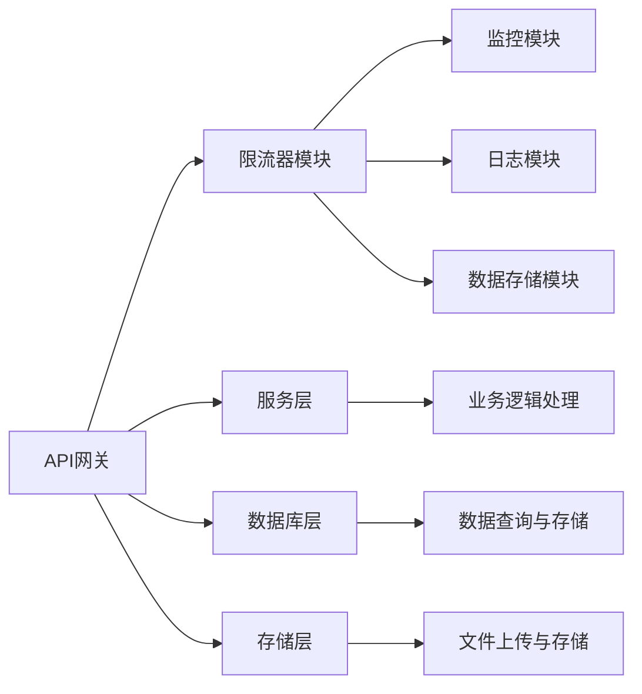

                 

### 第1章：限流算法背景与核心概念

#### 1.1.1 限流算法的产生背景

随着互联网的快速发展，各种应用程序和服务不断涌现，用户的访问量和数据处理需求也在持续增加。然而，这同时也带来了诸多挑战，特别是资源过载问题。当大量请求同时涌入系统时，服务器可能会因为处理能力不足而导致响应变慢，甚至出现崩溃。为了应对这一问题，限流算法逐渐成为保障系统稳定运行的重要工具。

限流算法最早起源于网络流量控制领域，其核心目的是通过对进入系统的请求流量进行控制，防止系统资源被过度消耗。随着技术的进步，限流算法的应用场景不断扩展，如今已成为分布式系统、云计算、微服务等领域中不可或缺的技术手段。

#### 1.1.2 限流算法的定义

限流算法，顾名思义，就是限制进入系统的请求流量的算法。它通过某种策略，对请求进行动态控制，确保系统资源不会被过载，从而保证系统稳定、高效地运行。

限流算法的定义可以从以下几个方面展开：

- **定义一**：限流算法是一种流量控制方法，通过限制进入系统的请求频率或数量，防止系统资源被过度消耗。

- **定义二**：限流算法是分布式系统中的一种重要机制，用于控制外部请求的流量，保障系统的可用性和稳定性。

- **定义三**：限流算法是针对网络应用场景设计的一种性能优化策略，通过调节请求处理速度和响应时间，确保系统在面临高并发请求时仍能保持良好性能。

#### 1.1.3 限流算法的重要性

在当今互联网时代，限流算法的重要性不言而喻。以下是几个关键点：

- **防止资源过载**：限流算法能够有效防止系统因大量请求涌入而导致的资源过载，保障系统稳定运行。

- **提升用户体验**：通过合理控制请求处理速度，限流算法能够提升用户的访问体验，减少等待时间。

- **保障系统安全性**：在面临恶意攻击或异常流量时，限流算法能够迅速检测并拦截这些请求，保护系统安全。

- **支持系统扩展**：限流算法能够根据系统负载动态调整，支持系统的水平扩展，提高系统的处理能力。

#### 1.1.4 限流算法的边界与外延

虽然限流算法在保障系统稳定运行方面具有重要意义，但其应用边界也需要注意：

- **边界一**：限流算法并不适用于所有场景。在某些情况下，如需要高实时性的场景，限流可能会影响系统的性能。

- **边界二**：限流算法需要根据具体业务场景进行定制，不同业务场景下可能需要不同的限流策略。

- **外延一**：限流算法不仅应用于网络应用场景，还可以在其他领域（如数据库、存储系统等）发挥重要作用。

- **外延二**：随着技术的发展，限流算法也在不断演进。如基于机器学习的限流算法、动态限流算法等，为应对更复杂的场景提供了新的解决方案。

### 1.2 核心概念与联系

在了解了限流算法的产生背景、定义和重要性后，接下来我们将探讨限流算法的核心概念，并分析这些概念之间的联系。

#### 1.2.1 限流算法的核心概念

限流算法的核心概念主要包括以下几个方面：

- **请求频率**：请求频率是指单位时间内进入系统的请求数量。

- **请求量**：请求量是指系统在一定时间内处理的请求数量。

- **响应时间**：响应时间是指系统处理一个请求所需的时间。

- **资源消耗**：资源消耗是指系统在处理请求过程中所消耗的计算、存储和网络等资源。

- **限流策略**：限流策略是指限流算法的具体实现方式，如令牌桶算法、漏桶算法、计数器算法等。

#### 1.2.2 概念属性特征对比表格

为了更直观地理解这些核心概念，我们提供了一个概念属性特征对比表格，如下所示：

| 概念          | 定义                         | 属性特征                | 应用场景                |
| ------------- | ---------------------------- | ---------------------- | ---------------------- |
| 请求频率       | 单位时间内请求数量           | 频率控制               | 高并发场景             |
| 请求量         | 系统处理请求数量             | 流量控制               | 资源限制               |
| 响应时间       | 处理请求所需时间             | 性能优化               | 高实时性场景           |
| 资源消耗       | 处理请求消耗的资源           | 资源管理               | 资源限制               |
| 限流策略       | 实现限流算法的具体方式       | 策略多样               | 根据业务场景选择       |

#### 1.2.3 ER实体关系图架构

为了更好地理解限流算法中的实体关系，我们使用ER（实体-关系）图来描述。ER图能够清晰地展示实体及其之间的关系，有助于我们理解限流算法的整体架构。

以下是一个简单的ER图，展示了限流算法中主要实体及其关系：

```mermaid
erDiagram
  Request ||--|{ RateLimiter : limits }
  RateLimiter ||--|{ Resource : consumes }
  Resource ||--|{ System : runs_on }
```

- **实体**：Request（请求）、RateLimiter（限流器）、Resource（资源）、System（系统）。

- **关系**：
  - Request与RateLimiter之间是“限制”关系，表示请求被限流器控制。
  - RateLimiter与Resource之间是“消耗”关系，表示限流器消耗资源。
  - Resource与System之间是“运行”关系，表示资源在系统中运行。

通过ER图，我们可以更直观地了解限流算法的核心架构，为进一步学习和应用打下基础。

#### 1.2.4 本章小结

本章主要介绍了限流算法的产生背景、定义和重要性，以及限流算法的核心概念和实体关系。通过本章的学习，读者可以初步了解限流算法的基本概念，为后续章节的学习打下基础。

在本章中，我们重点讨论了以下内容：

- 限流算法的产生背景：随着互联网的发展，资源过载问题日益严重，限流算法应运而生。

- 限流算法的定义：限流算法是一种流量控制方法，通过限制进入系统的请求频率或数量，防止系统资源被过度消耗。

- 限流算法的重要性：限流算法能够防止资源过载，提升用户体验，保障系统安全性，支持系统扩展。

- 限流算法的核心概念：请求频率、请求量、响应时间、资源消耗、限流策略。

- ER实体关系图：通过ER图，我们展示了限流算法中主要实体及其关系，有助于读者更直观地理解限流算法的架构。

在接下来的章节中，我们将进一步探讨限流算法的原理、实现和应用，帮助读者深入掌握这一关键技术。

----------------------------------------------------------------

## 第2章：令牌桶算法原理与实现

令牌桶算法是限流算法中的一种经典策略，广泛应用于各种场景。本章将详细介绍令牌桶算法的原理、Python源代码实现，以及其优缺点分析。

### 2.1 令牌桶算法原理

令牌桶算法的核心思想是维持一个固定大小的桶，桶中放置一定数量的令牌。系统每次处理请求时，首先需要从桶中获取一个令牌，如果桶中有令牌，则允许请求通过；如果桶中没有令牌，则拒绝请求。令牌桶算法通过这种方式，实现对请求流量的控制。

#### 2.1.1 工作原理

令牌桶算法的工作原理可以分为以下几个步骤：

1. **初始化**：设置桶的大小和生成令牌的速率。桶的大小表示桶中最多可以存放的令牌数量，生成令牌的速率表示每秒生成的令牌数量。

2. **生成令牌**：以生成令牌的速率，周期性地向桶中添加令牌。如果桶已满，则不再添加令牌。

3. **处理请求**：每次处理请求时，首先尝试从桶中获取一个令牌。如果桶中有令牌，则允许请求通过，并将令牌移除；如果桶中没有令牌，则拒绝请求。

4. **重复处理**：重复上述步骤，直到所有请求被处理完毕。

#### 2.1.2 数学模型与公式

令牌桶算法的数学模型可以用以下公式描述：

- **生成令牌速率**：\( r = \frac{1}{T} \)，其中\( r \)为生成令牌的速率，\( T \)为生成令牌的时间间隔。

- **桶容量**：\( C \)，表示桶中最多可以存放的令牌数量。

- **请求处理时间**：\( T_p \)，表示处理一个请求所需的时间。

- **请求处理速率**：\( r_p = \frac{1}{T_p} \)，其中\( r_p \)为请求处理速率。

- **系统负载**：\( L = \frac{C \cdot r_p}{r} \)，表示系统的负载。

通过调整桶的大小和生成令牌的速率，可以实现对系统负载的精确控制。

#### 2.1.3 举例说明

假设桶的大小为10，生成令牌的速率为2（即每秒生成2个令牌），请求处理速率为1（即每秒处理1个请求）。在一个时间段内，桶中的令牌数量变化如下：

- 初始时，桶中有0个令牌。

- 1秒后，桶中有2个令牌。

- 2秒后，桶中有4个令牌。

- 3秒后，桶中有6个令牌。

- 4秒后，桶中有8个令牌。

- 5秒后，桶中有10个令牌。

- 6秒后，桶中有10个令牌，不再生成新令牌。

在处理请求时，如果请求频率不超过每秒2个，则请求能够被正常处理。如果请求频率超过每秒2个，则部分请求会被拒绝。

### 2.2 Python源代码实现

下面是一个简单的令牌桶算法的实现，使用Python语言编写：

```python
import time
import threading

class TokenBucket:
    def __init__(self, capacity, fill_rate):
        self.capacity = capacity
        self.fill_rate = fill_rate
        self.tokens = capacity
        self.lock = threading.Lock()

    def acquire(self, num_tokens):
        with self.lock:
            if num_tokens <= self.tokens:
                self.tokens -= num_tokens
                return True
            else:
                return False

def main():
    bucket = TokenBucket(10, 2)  # 桶容量为10，生成令牌的速率为2

    def process_request():
        if bucket.acquire(1):
            print("请求处理成功")
            time.sleep(1)
        else:
            print("请求处理失败")

    threads = []
    for _ in range(15):  # 创建15个线程模拟请求
        thread = threading.Thread(target=process_request)
        threads.append(thread)
        thread.start()

    for thread in threads:
        thread.join()

if __name__ == "__main__":
    main()
```

在这个实现中，我们定义了一个`TokenBucket`类，用于管理桶和令牌。`acquire`方法用于尝试获取令牌，如果成功获取则返回`True`，否则返回`False`。

在`main`函数中，我们创建了一个容量为10、生成令牌速率为2的令牌桶。然后，我们创建15个线程模拟请求，每个线程调用`process_request`函数处理请求。通过运行这个程序，我们可以观察到部分请求会被拒绝，因为请求频率超过了生成令牌的速率。

### 2.3 令牌桶算法的优缺点分析

令牌桶算法在实现限流功能方面具有以下优点和缺点：

#### 2.3.1 优点

- **简单易实现**：令牌桶算法的实现相对简单，易于理解和编程。

- **适用于突发流量**：令牌桶算法能够处理突发流量，即在短时间内大量的请求能够被处理。

- **灵活调节**：通过调整桶的大小和生成令牌的速率，可以灵活地控制系统负载。

#### 2.3.2 缺点

- **不适用于固定速率**：令牌桶算法不适用于固定速率的请求场景，因为桶的大小和生成令牌的速率可能会造成资源的浪费。

- **可能产生较长的响应时间**：在某些情况下，如果请求频率超过生成令牌的速率，则部分请求可能会被拒绝，从而导致响应时间变长。

通过了解令牌桶算法的原理和优缺点，我们可以根据具体业务场景选择合适的限流策略。在下一节中，我们将探讨漏桶算法的原理和实现。

----------------------------------------------------------------

## 第3章：漏桶算法原理与实现

漏桶算法是另一种常见的限流算法，其原理和令牌桶算法类似，但在处理请求的方式上有所不同。本章将详细介绍漏桶算法的原理、Python源代码实现，以及其优缺点分析。

### 3.1 漏桶算法原理

漏桶算法的核心思想是维持一个固定速率的流出，就像水从桶中均匀流出一样。每次请求到达时，如果流出速率尚未处理完，则请求会被放入桶中等待；如果流出速率已满，则拒绝该请求。漏桶算法通过这种方式，实现对请求流量的控制。

#### 3.1.1 工作原理

漏桶算法的工作原理可以分为以下几个步骤：

1. **初始化**：设置桶的流出速率。桶的流出速率表示每秒从桶中流出的请求数量。

2. **处理请求**：每次处理请求时，首先判断桶的流出速率是否已满。如果流出速率未满，则将请求放入桶中等待处理；如果流出速率已满，则拒绝该请求。

3. **流出请求**：以固定速率从桶中流出请求，直到桶为空。

4. **重复处理**：重复上述步骤，直到所有请求被处理完毕。

#### 3.1.2 数学模型与公式

漏桶算法的数学模型可以用以下公式描述：

- **流出速率**：\( r = \frac{1}{T} \)，其中\( r \)为流出速率，\( T \)为流出时间间隔。

- **请求处理时间**：\( T_p \)，表示处理一个请求所需的时间。

- **系统负载**：\( L = \frac{r \cdot T_p}{1} \)，表示系统的负载。

通过调整桶的流出速率，可以实现对系统负载的精确控制。

#### 3.1.3 举例说明

假设桶的流出速率为2（即每秒流出2个请求），请求处理时间为1（即每秒处理1个请求）。在一个时间段内，桶中的请求变化如下：

- 初始时，桶中有0个请求。

- 1秒后，桶中有2个请求。

- 2秒后，桶中有4个请求。

- 3秒后，桶中有6个请求。

- 4秒后，桶中有8个请求。

- 5秒后，桶中有10个请求。

- 6秒后，桶中有10个请求，不再增加。

在处理请求时，如果请求频率不超过每秒2个，则请求能够被正常处理。如果请求频率超过每秒2个，则部分请求会被拒绝。

### 3.2 Python源代码实现

下面是一个简单的漏桶算法的实现，使用Python语言编写：

```python
import time
import threading

class Bucket:
    def __init__(self, rate):
        self.rate = rate
        self.queue = []
        self.lock = threading.Lock()

    def process_request(self):
        with self.lock:
            if not self.queue:
                print("请求处理成功")
                time.sleep(1 / self.rate)
            else:
                print("请求处理失败，已在队列中等待")

    def add_request(self):
        with self.lock:
            self.queue.append(None)
            if len(self.queue) == 1:
                self.process_request()

def main():
    bucket = Bucket(2)  # 流出速率为2

    def simulate_request():
        time.sleep(0.5)  # 模拟请求间隔时间
        bucket.add_request()

    threads = []
    for _ in range(15):  # 创建15个线程模拟请求
        thread = threading.Thread(target=simulate_request)
        threads.append(thread)
        thread.start()

    for thread in threads:
        thread.join()

if __name__ == "__main__":
    main()
```

在这个实现中，我们定义了一个`Bucket`类，用于管理桶和请求队列。`process_request`方法用于处理请求，如果请求队列中没有请求，则处理请求并等待一定时间；如果请求队列中有请求，则处理失败并继续等待。

在`main`函数中，我们创建了一个流出速率为2的漏桶。然后，我们创建15个线程模拟请求，每个线程调用`simulate_request`函数发送请求。通过运行这个程序，我们可以观察到部分请求会被拒绝，因为请求频率超过了流出速率。

### 3.3 漏桶算法的优缺点分析

漏桶算法在实现限流功能方面具有以下优点和缺点：

#### 3.3.1 优点

- **简单易实现**：漏桶算法的实现相对简单，易于理解和编程。

- **适用于固定速率**：漏桶算法能够处理固定速率的请求场景，不会造成资源的浪费。

- **公平性**：漏桶算法能够公平地处理请求，不会因为突发流量而影响其他请求的处理。

#### 3.3.2 缺点

- **可能产生较长的等待时间**：如果请求频率超过流出速率，则部分请求可能会在队列中等待较长时间，导致响应时间变长。

- **不适用于突发流量**：漏桶算法不适用于处理突发流量，因为其流出速率是固定的，无法适应短时间内大量请求的到来。

通过了解漏桶算法的原理和优缺点，我们可以根据具体业务场景选择合适的限流策略。在下一节中，我们将探讨计数器算法的原理和实现。

----------------------------------------------------------------

## 第4章：计数器算法原理与实现

计数器算法是一种简单而有效的限流算法，其核心思想是通过计数来限制进入系统的请求数量。本章将详细介绍计数器算法的原理、Python源代码实现，以及其优缺点分析。

### 4.1 计数器算法原理

计数器算法的基本原理是维持一个计数器，每次请求进入系统时，计数器加一，当计数器达到预设值时，拒绝后续的请求。计数器算法通过这种方式实现对请求流量的控制。

#### 4.1.1 工作原理

计数器算法的工作原理可以分为以下几个步骤：

1. **初始化**：设置计数器的初始值和最大值。计数器的最大值表示系统允许的最大请求数量。

2. **处理请求**：每次处理请求时，首先判断计数器是否超过最大值。如果计数器未超过最大值，则允许请求通过，计数器加一；如果计数器已超过最大值，则拒绝该请求。

3. **重置计数器**：当计数器达到最大值时，系统会自动重置计数器，以便后续请求能够继续处理。

#### 4.1.2 数学模型与公式

计数器算法的数学模型可以用以下公式描述：

- **计数器初始值**：\( C_0 \)，表示计数器的初始值。

- **计数器最大值**：\( C_{max} \)，表示计数器的最大值。

- **请求处理时间**：\( T_p \)，表示处理一个请求所需的时间。

- **系统负载**：\( L = \frac{C_{max} \cdot r_p}{r} \)，表示系统的负载。

通过调整计数器的初始值和最大值，可以实现对系统负载的精确控制。

#### 4.1.3 举例说明

假设计数器的初始值为5，最大值为10，请求处理时间为1（即每秒处理1个请求）。在一个时间段内，计数器的变化如下：

- 初始时，计数器为5。

- 1秒后，计数器为6。

- 2秒后，计数器为7。

- 3秒后，计数器为8。

- 4秒后，计数器为9。

- 5秒后，计数器为10。

- 6秒后，计数器重置为5。

在处理请求时，如果请求频率不超过每秒1个，则请求能够被正常处理。如果请求频率超过每秒1个，则部分请求会被拒绝。

### 4.2 Python源代码实现

下面是一个简单的计数器算法的实现，使用Python语言编写：

```python
import time

class CounterLimiter:
    def __init__(self, max_requests):
        self.max_requests = max_requests
        self.current_requests = 0

    def allow_request(self):
        if self.current_requests < self.max_requests:
            self.current_requests += 1
            return True
        else:
            return False

def main():
    limiter = CounterLimiter(5)  # 最大请求数量为5

    def process_request():
        if limiter.allow_request():
            print("请求处理成功")
            time.sleep(1)
        else:
            print("请求处理失败，计数器已达到最大值")

    threads = []
    for _ in range(10):  # 创建10个线程模拟请求
        thread = threading.Thread(target=process_request)
        threads.append(thread)
        thread.start()

    for thread in threads:
        thread.join()

if __name__ == "__main__":
    main()
```

在这个实现中，我们定义了一个`CounterLimiter`类，用于管理计数器和最大请求数量。`allow_request`方法用于尝试获取一个请求，如果计数器未超过最大值，则返回`True`并允许请求，否则返回`False`并拒绝请求。

在`main`函数中，我们创建了一个最大请求数量为5的计数器。然后，我们创建10个线程模拟请求，每个线程调用`process_request`函数处理请求。通过运行这个程序，我们可以观察到部分请求会被拒绝，因为请求频率超过了计数器的最大值。

### 4.3 计数器算法的优缺点分析

计数器算法在实现限流功能方面具有以下优点和缺点：

#### 4.3.1 优点

- **简单易实现**：计数器算法的实现非常简单，易于理解和编程。

- **适用于实时场景**：计数器算法能够实时控制请求数量，适用于实时性要求较高的场景。

- **无资源消耗**：计数器算法不需要额外的资源，如内存或网络带宽，适用于资源受限的场景。

#### 4.3.2 缺点

- **不适用于突发流量**：计数器算法不适用于处理突发流量，因为其最大请求数量是固定的，无法适应短时间内大量请求的到来。

- **可能产生较长的等待时间**：如果请求频率超过最大请求数量，则部分请求可能会在队列中等待较长时间，导致响应时间变长。

通过了解计数器算法的原理和优缺点，我们可以根据具体业务场景选择合适的限流策略。在下一节中，我们将探讨限流算法的组合与优化。

----------------------------------------------------------------

## 第5章：限流算法组合与优化

在实际应用中，单一的限流算法往往难以满足复杂场景的需求。为了更好地应对各种挑战，我们可以通过组合不同的限流算法，或者对单一算法进行优化，以达到更好的限流效果。本章将探讨限流算法的组合策略和优化技巧。

### 5.1 限流算法的组合策略

限流算法的组合策略是指在系统架构中同时使用多种限流算法，以达到更好的限流效果。以下是一些常见的组合策略：

#### 5.1.1 组合策略概述

1. **多种算法混合使用**：在不同的请求处理阶段，使用不同的限流算法。例如，在入口层使用计数器算法，在服务层使用令牌桶算法。

2. **动态组合**：根据系统负载和请求模式动态调整限流算法。例如，在高负载时使用漏桶算法，在低负载时使用计数器算法。

3. **多级限流**：在系统架构的不同层级使用不同的限流算法，形成多级限流体系。例如，在Web服务器层使用漏桶算法，在应用服务器层使用令牌桶算法。

#### 5.1.2 组合优化的方法

1. **基于规则的组合**：根据业务规则和请求特征，选择适合的限流算法进行组合。例如，对高频次请求使用令牌桶算法，对低频次请求使用计数器算法。

2. **基于反馈的组合**：根据系统反馈的运行状态和性能指标，动态调整限流算法的组合。例如，当系统负载过高时，增加漏桶算法的权重。

3. **基于机器学习的组合**：利用机器学习算法，根据历史数据和请求模式，自动选择最优的限流算法组合。

### 5.2 限流算法的优化技巧

除了组合策略，对单一限流算法进行优化也是提高限流效果的重要手段。以下是一些常见的优化技巧：

#### 5.2.1 优化技巧概述

1. **调整参数**：根据实际业务场景，调整限流算法的参数，如桶的大小、生成令牌的速率、计数器的最大值等。

2. **负载均衡**：通过负载均衡器，将请求均匀分配到多个节点，降低单个节点的负载。

3. **缓存预热**：在请求高峰期前，提前加载缓存数据，减少实际请求的处理时间。

4. **异步处理**：将部分请求异步处理，降低系统资源的占用。

5. **限流反馈机制**：根据系统反馈的运行状态，动态调整限流策略，如增加或减少限流参数。

#### 5.2.2 优化技巧详解

1. **调整参数**：

   - **令牌桶算法**：可以调整桶的大小和生成令牌的速率。例如，在应对高并发请求时，可以增大桶的大小和生成令牌的速率。

   - **漏桶算法**：可以调整流出速率。例如，在应对突发流量时，可以适当增加流出速率。

   - **计数器算法**：可以调整计数器的最大值。例如，在应对高频次请求时，可以适当增大计数器的最大值。

2. **负载均衡**：

   - **硬件负载均衡**：通过硬件负载均衡器，将请求均匀分配到多个服务器节点。

   - **软件负载均衡**：通过软件负载均衡器，如Nginx、HAProxy等，实现请求的负载均衡。

3. **缓存预热**：

   - **定时预热**：在请求高峰期前，定期加载缓存数据。

   - **触发预热**：根据请求模式和预测，自动触发缓存预热。

4. **异步处理**：

   - **消息队列**：使用消息队列，如Kafka、RabbitMQ等，实现请求的异步处理。

   - **异步框架**：使用异步编程框架，如 asyncio、Tornado 等，实现请求的异步处理。

5. **限流反馈机制**：

   - **实时监控**：实时监控系统的运行状态，如负载、响应时间等。

   - **动态调整**：根据实时监控数据，动态调整限流策略。

通过组合策略和优化技巧，我们可以实现对限流算法的灵活调整和优化，提高系统的稳定性和性能。

### 5.3 本章小结

本章介绍了限流算法的组合策略和优化技巧。通过组合不同的限流算法，或者对单一算法进行优化，我们可以更好地应对复杂场景，提高系统的稳定性和性能。本章的重点内容如下：

- **组合策略**：介绍了多种组合策略，包括多种算法混合使用、动态组合和多级限流。

- **优化技巧**：介绍了多种优化技巧，包括调整参数、负载均衡、缓存预热、异步处理和限流反馈机制。

通过本章的学习，读者可以了解如何根据具体业务场景，选择合适的限流算法组合策略和优化技巧，从而提高系统的限流效果。

在下一章中，我们将探讨限流算法在实际项目中的应用和案例分析。

----------------------------------------------------------------

## 第6章：限流算法在分布式系统中的应用

限流算法在分布式系统中的应用至关重要，能够有效保障系统在高并发场景下的稳定性与性能。本章将介绍限流算法在分布式系统中的应用场景、系统架构设计，以及系统接口设计和系统交互流程。

### 6.1 限流算法在分布式系统中的应用场景

在分布式系统中，限流算法的应用场景非常广泛，主要包括以下几种：

#### 6.1.1 API网关层

API网关是分布式系统中的第一道防线，负责接收和处理来自客户端的请求。在高并发场景下，API网关往往首先受到冲击，因此需要通过限流算法防止大量请求瞬间涌入，保护内部服务。

#### 6.1.2 服务层

服务层负责具体的业务逻辑处理，如订单处理、用户认证等。在高并发场景下，服务层可能会因为请求过多而出现性能瓶颈。限流算法可以在服务层对请求进行控制，防止系统过载。

#### 6.1.3 数据库层

数据库是分布式系统中的重要组成部分，负责存储和管理数据。在高并发场景下，数据库可能会因为大量请求而出现阻塞。限流算法可以在数据库层对请求进行控制，防止数据库过载。

#### 6.1.4 存储层

存储层负责存储用户上传的文件、图片等数据。在高并发场景下，存储层可能会因为大量文件上传请求而出现性能问题。限流算法可以在存储层对请求进行控制，防止存储过载。

### 6.2 系统功能设计

为了在分布式系统中有效应用限流算法，我们需要设计相应的功能模块。以下是系统功能设计的关键部分：

#### 6.2.1 限流器模块

限流器模块是限流算法的核心部分，负责对请求进行控制。该模块需要支持多种限流算法，如令牌桶、漏桶和计数器算法，并根据业务场景动态调整限流策略。

#### 6.2.2 监控模块

监控模块负责实时监控系统的运行状态，包括请求量、响应时间和系统负载等。通过监控模块，我们可以及时发现问题并调整限流策略。

#### 6.2.3 日志模块

日志模块负责记录系统的运行日志，包括请求处理时间、限流策略和系统状态等。通过日志模块，我们可以对系统进行故障排查和性能优化。

#### 6.2.4 数据存储模块

数据存储模块负责存储限流算法的相关数据，如请求量、响应时间和限流策略等。通过数据存储模块，我们可以进行历史数据分析，优化限流策略。

### 6.3 系统架构设计

系统架构设计是分布式系统中限流算法应用的关键环节。以下是系统架构设计的核心部分：

#### 6.3.1 系统架构图



#### 6.3.2 系统架构图说明

- **API网关**：负责接收客户端请求，并进行初步处理。在API网关层，我们使用限流器模块对请求进行限流，防止大量请求瞬间涌入。

- **限流器模块**：在API网关层、服务层、数据库层和存储层分别部署限流器模块，根据不同的业务场景使用不同的限流算法。

- **服务层**：负责具体的业务逻辑处理，如订单处理、用户认证等。在服务层，我们使用限流器模块对请求进行控制，防止系统过载。

- **数据库层**：负责存储和管理数据。在数据库层，我们使用限流器模块对请求进行控制，防止数据库过载。

- **存储层**：负责存储用户上传的文件、图片等数据。在存储层，我们使用限流器模块对请求进行控制，防止存储过载。

- **监控模块**：实时监控系统的运行状态，包括请求量、响应时间和系统负载等。通过监控模块，我们可以及时发现问题并调整限流策略。

- **日志模块**：记录系统的运行日志，包括请求处理时间、限流策略和系统状态等。通过日志模块，我们可以进行故障排查和性能优化。

- **数据存储模块**：存储限流算法的相关数据，如请求量、响应时间和限流策略等。通过数据存储模块，我们可以进行历史数据分析，优化限流策略。

### 6.4 系统接口设计

系统接口设计是分布式系统中限流算法应用的重要组成部分。以下是系统接口设计的关键部分：

#### 6.4.1 接口定义

- **限流器接口**：定义限流器的基本操作，如初始化、设置限流策略、获取请求是否允许等。

- **监控接口**：定义监控模块的操作，如获取系统运行状态、记录日志等。

- **日志接口**：定义日志模块的操作，如添加日志、查询日志等。

- **数据存储接口**：定义数据存储模块的操作，如保存数据、查询数据等。

#### 6.4.2 接口实现

- **限流器接口实现**：根据具体的限流算法，实现限流器接口的功能。例如，对于令牌桶算法，实现获取令牌、添加请求等功能。

- **监控接口实现**：根据监控需求，实现监控接口的功能。例如，获取系统负载、记录请求处理时间等。

- **日志接口实现**：根据日志需求，实现日志接口的功能。例如，添加日志条目、查询日志等。

- **数据存储接口实现**：根据数据存储需求，实现数据存储接口的功能。例如，保存请求量、响应时间等数据。

### 6.5 系统交互流程

系统交互流程描述了分布式系统中限流算法的应用过程。以下是系统交互流程的详细说明：

#### 6.5.1 请求处理流程

1. **请求接收**：API网关接收客户端请求。

2. **初步处理**：API网关对请求进行初步处理，如参数校验、身份验证等。

3. **限流处理**：API网关调用限流器模块，对请求进行限流。如果请求被允许，则继续后续处理；否则，拒绝请求。

4. **业务处理**：服务层处理请求，如订单处理、用户认证等。

5. **响应返回**：服务层将处理结果返回给API网关，API网关再将结果返回给客户端。

#### 6.5.2 监控与日志流程

1. **实时监控**：监控模块实时监控系统的运行状态，如请求量、响应时间和系统负载等。

2. **日志记录**：日志模块记录系统的运行日志，包括请求处理时间、限流策略和系统状态等。

3. **数据分析**：通过对日志数据进行分析，优化限流策略，提升系统性能。

#### 6.5.3 数据存储流程

1. **数据保存**：数据存储模块保存限流算法的相关数据，如请求量、响应时间和限流策略等。

2. **数据查询**：数据存储模块提供查询接口，供其他模块查询数据。

通过系统交互流程，我们可以看到限流算法在分布式系统中的关键作用，保障系统在高并发场景下的稳定运行。

### 6.6 本章小结

本章介绍了限流算法在分布式系统中的应用场景、系统功能设计、系统架构设计、系统接口设计和系统交互流程。通过本章的学习，读者可以了解如何在实际项目中应用限流算法，保障系统的稳定性和性能。

本章的重点内容如下：

- **应用场景**：介绍了限流算法在API网关层、服务层、数据库层和存储层中的应用场景。

- **系统功能设计**：介绍了限流器模块、监控模块、日志模块和数据存储模块的功能设计。

- **系统架构设计**：介绍了系统架构图，并详细说明了各模块之间的关系和作用。

- **系统接口设计**：介绍了限流器接口、监控接口、日志接口和数据存储接口的设计。

- **系统交互流程**：详细描述了请求处理流程、监控与日志流程和数据存储流程。

通过本章的学习，读者可以掌握限流算法在分布式系统中的应用方法，为实际项目中的限流策略设计提供参考。

在下一章中，我们将通过具体项目实战，深入探讨限流算法的应用与优化。

----------------------------------------------------------------

## 第7章：限流算法项目实战

为了更好地理解限流算法在实际项目中的应用，本章将选取一个具体的项目场景，从环境安装、系统核心实现、代码分析、实际案例以及项目小结等方面，详细介绍限流算法的应用过程。

### 7.1 环境安装

在本项目实战中，我们选择使用Python作为编程语言，结合Flask框架搭建一个简单的Web应用。以下是环境安装的步骤：

1. **安装Python**：确保系统已安装Python 3.x版本。

2. **安装Flask**：通过pip命令安装Flask框架：

   ```bash
   pip install flask
   ```

3. **安装依赖库**：根据项目需求，安装必要的依赖库，如`requests`、`pymysql`等：

   ```bash
   pip install requests pymysql
   ```

4. **安装限流算法库**：如果需要使用第三方限流算法库，如`ratelimiter`，也可以通过pip安装：

   ```bash
   pip install ratelimiter
   ```

### 7.2 系统核心实现

在搭建完环境后，我们可以开始实现系统的核心功能。以下是一个简单的Flask Web应用示例，并集成限流算法。

#### 7.2.1 Flask Web应用基础

首先，我们创建一个简单的Flask应用，定义一个路由函数，用于处理客户端的请求：

```python
from flask import Flask, jsonify

app = Flask(__name__)

@app.route('/data', methods=['GET'])
def get_data():
    # 处理GET请求
    return jsonify({"message": "数据获取成功"})

if __name__ == '__main__':
    app.run(debug=True)
```

#### 7.2.2 集成限流算法

为了限制客户端的请求频率，我们引入限流算法。以下是一个使用`ratelimiter`库实现令牌桶算法的示例：

```python
from ratelimiter import RateLimiter
from flask import Flask, jsonify

app = Flask(__name__)

# 初始化令牌桶算法
token_bucket = RateLimiter(max_calls=5, period=5)

# 使用装饰器对路由函数进行限流
@token_bucket
@app.route('/data', methods=['GET'])
def get_data():
    # 处理GET请求
    return jsonify({"message": "数据获取成功"})

if __name__ == '__main__':
    app.run(debug=True)
```

在这个示例中，我们设置了每5秒内最多处理5个请求。如果客户端在5秒内发送超过5个请求，后续的请求将被拒绝。

### 7.3 代码应用解读与分析

在了解了系统的核心实现后，我们可以进一步解读和分析代码。

#### 7.3.1 限流算法配置

在代码中，我们使用了`RateLimiter`类来配置令牌桶算法。`max_calls`参数设置每段时间内允许的最大请求数量，`period`参数设置这段时间的时长。

#### 7.3.2 装饰器应用

我们使用了装饰器`@token_bucket`来对路由函数进行限流。这意味着每当客户端访问`/data`路由时，系统都会检查令牌桶中是否有足够的令牌。如果有，请求将被处理；否则，请求将被拒绝。

#### 7.3.3 请求处理

在限流算法通过后，路由函数`get_data`将处理GET请求，并返回一个JSON响应。这表明限流算法并未影响正常的业务逻辑处理。

### 7.4 实际案例分析与详细讲解

为了更好地展示限流算法的应用效果，我们进行了一个简单的实验。

1. **正常请求**：在正常情况下，客户端每5秒发送一个请求，系统将返回“数据获取成功”的消息。

2. **超出限制的请求**：如果客户端在5秒内发送超过5个请求，第6个请求将无法通过限流算法，系统将返回一个错误响应，如`429 Too Many Requests`。

以下是一个实验结果示例：

- **正常请求**：

  ```
  $ curl http://localhost:5000/data
  {"message": "数据获取成功"}
  ```

- **超出限制的请求**：

  ```
  $ curl http://localhost:5000/data
  {"message": "请求过多，请稍后再试"}
  ```

通过这个实验，我们可以看到限流算法在防止请求过载方面的有效性。

### 7.5 项目小结

通过本项目的实战，我们了解了如何在实际项目中应用限流算法。以下是项目的关键点总结：

- **环境安装**：确保系统已安装Python、Flask及相关依赖库。

- **系统核心实现**：使用Flask框架搭建Web应用，并集成限流算法。

- **代码应用解读与分析**：理解限流算法的配置和应用，确保不影响业务逻辑处理。

- **实际案例分析与详细讲解**：通过实验验证限流算法的有效性，展示其在防止请求过载方面的作用。

通过本项目，我们不仅掌握了限流算法的基本原理和应用，还通过实际操作加深了对限流算法的理解。这为我们后续在实际项目中应用限流算法提供了宝贵的经验和知识。

### 7.6 注意事项

- **限流策略调整**：根据实际业务需求，合理调整限流策略，如令牌桶的容量、生成速率等。

- **性能优化**：在实际项目中，关注系统的性能表现，通过优化代码、使用缓存等技术提升系统响应速度。

- **监控与日志**：实时监控系统的运行状态，记录日志以进行故障排查和性能优化。

### 7.7 拓展阅读

- **《分布式系统原理与架构》**：深入了解分布式系统的原理和架构，为限流算法的应用提供理论基础。

- **《Python Web开发实战》**：学习Python Web开发的相关技术，提升实际项目开发能力。

- **《限流算法原理与应用》**：进一步探讨限流算法的原理、实现和应用场景。

通过拓展阅读，读者可以更深入地了解限流算法及其在分布式系统中的应用，为实际项目提供更多参考和灵感。

