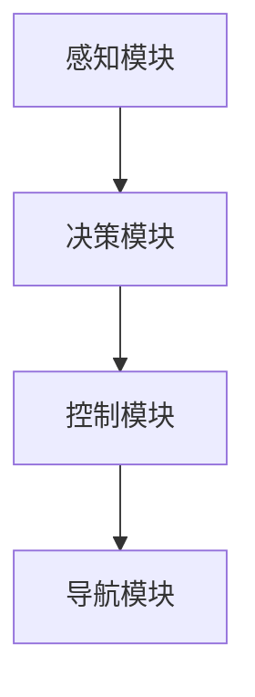

                 

### 《集成测试：验证AI系统整体功能的关键步骤》

关键词：集成测试、AI系统、功能验证、测试策略、最佳实践

摘要：本文旨在深入探讨集成测试在人工智能系统开发中的关键作用，通过详细分析AI系统的架构、集成过程以及测试方法，提供一系列步骤和最佳实践，帮助开发者在AI系统的开发周期中实现有效的功能验证。

### 前言

随着人工智能（AI）技术的迅速发展，AI系统已经成为现代科技的重要组成部分。这些系统广泛应用于从自动驾驶汽车到智能医疗诊断，从智能家居到工业自动化等多个领域。然而，AI系统的复杂性和高度依赖数据质量的特点，使得确保其功能的正确性和可靠性变得至关重要。在这其中，集成测试扮演了不可替代的角色。

集成测试是一种验证AI系统各个组件和子系统之间协同工作的方法。它不仅关注单个组件的功能，更重要的是检验这些组件在集成后能否无缝协作，实现整体系统的预期功能。本文将逐步探讨集成测试的定义、重要性、AI系统架构、测试策略、面临的挑战以及最佳实践，旨在为开发者提供一套完整的集成测试指南。

### 目录

1. 引言：集成测试的背景和意义
2. AI系统架构与集成
3. 集成测试的关键概念
4. 集成测试的方法论
5. 集成测试的挑战与解决方案
6. 案例研究：集成测试在AI系统中的应用
7. 最佳实践与总结

### 1. 引言：集成测试的背景和意义

#### 1.1 集成测试的定义

集成测试是一种测试方法，旨在验证不同模块或组件在集成后的行为是否符合预期。与单元测试（关注单个模块的功能）和系统测试（关注整个系统的功能）相比，集成测试介于这两者之间，它专注于模块之间的交互和集成点。

#### 1.2 集成测试在AI系统开发中的重要性

AI系统的复杂性通常远超传统软件系统，它们包含了大量的数据处理、机器学习算法、深度学习模型等。这使得AI系统在集成过程中容易出现各种问题，如模块之间的不兼容、数据流中断、算法性能下降等。集成测试正是为了解决这些问题而存在的。

- **验证模块协作**：集成测试能够确保各个模块在集成后能够协同工作，实现整体系统的功能。
- **发现隐藏缺陷**：在单元测试阶段可能被忽略的问题，在集成测试中往往会暴露出来，从而提前发现并修复。
- **提高系统稳定性**：通过集成测试，开发者可以提前验证系统的稳定性，减少系统上线后的故障率。

#### 1.3 集成测试在AI开发周期中的位置

在AI系统的开发周期中，集成测试通常处于以下位置：

- **开发中期**：在各个模块初步开发完成后，进行集成测试，确保它们之间的交互正常。
- **系统整合阶段**：在多个子系统集成到一起，形成完整的AI系统时，进行集成测试，验证整体系统的功能。
- **持续集成/持续交付（CI/CD）流程**：在每次代码提交后，自动执行集成测试，确保系统的稳定性和可靠性。

#### 1.4 集成测试与单元测试、系统测试的关系

- **与单元测试的关系**：集成测试依赖于单元测试的结果，只有当单元测试通过后，模块才被认为是可集成的。因此，单元测试是集成测试的基础。
- **与系统测试的关系**：系统测试是在集成测试之后进行的，它主要关注整个系统的功能是否满足需求，而集成测试则更侧重于模块之间的交互。

通过理解集成测试的定义、重要性以及在开发周期中的位置，开发者可以更好地规划集成测试工作，确保AI系统的功能得到有效验证。接下来，我们将进一步探讨AI系统架构和集成过程，为后续的集成测试打下基础。

### 2. AI系统架构与集成

#### 2.1 AI系统架构概述

AI系统通常由多个关键组件组成，包括数据收集与预处理、特征提取、机器学习模型训练、模型评估、模型部署等。每个组件在系统中扮演着特定的角色，它们之间的紧密协作决定了整个系统的性能和可靠性。

- **数据收集与预处理**：这是AI系统的第一步，数据的质量直接影响后续的模型训练效果。此阶段的任务包括数据清洗、归一化、缺失值填充等。
- **特征提取**：通过提取数据中的关键特征，将原始数据转换为适合机器学习模型训练的形式。
- **模型训练**：使用机器学习算法对特征数据进行训练，生成预测模型。
- **模型评估**：通过测试集对模型进行评估，确保其准确性和泛化能力。
- **模型部署**：将训练好的模型部署到生产环境中，供实际应用使用。

#### 2.2 集成过程

AI系统的集成是一个复杂的过程，涉及多个组件的协调和优化。以下是集成过程中的关键步骤：

- **模块划分**：根据系统架构，将AI系统划分为多个模块，每个模块负责特定的功能。
- **接口定义**：定义模块之间的接口，确保数据传输的标准化和一致性。
- **模块集成**：将各个模块集成到一起，进行初步测试，确保它们能够协同工作。
- **系统集成**：在模块集成完成后，对整个系统进行集成测试，验证系统的整体功能。
- **持续集成**：通过自动化工具，将集成测试嵌入到持续集成/持续交付（CI/CD）流程中，确保每次代码提交后的系统稳定性。

#### 2.3 集成过程中的挑战

在AI系统的集成过程中，开发者可能会面临以下挑战：

- **复杂性**：AI系统通常包含多个复杂组件，它们之间的集成可能需要大量时间和精力。
- **数据兼容性**：不同模块使用的数据格式、数据标准可能不一致，导致数据传输和处理的困难。
- **性能问题**：集成后的系统可能会出现性能瓶颈，需要优化和调整。
- **测试覆盖**：集成测试需要覆盖各个模块之间的交互，这通常比单元测试更复杂。

#### 2.4 集成测试策略

为了有效地应对集成过程中的挑战，开发者需要制定一套全面的集成测试策略，包括：

- **早期集成**：在模块开发早期就开始集成，尽早发现并解决问题。
- **逐步集成**：逐步将各个模块集成到一起，每次集成一小部分，确保问题能够及时被发现和解决。
- **自动化测试**：使用自动化工具进行集成测试，提高测试效率和覆盖率。
- **回归测试**：在每次集成后，执行回归测试，确保新集成不会破坏现有功能。

通过理解AI系统架构、集成过程以及面临的挑战，开发者可以更好地规划集成测试工作，确保AI系统的功能得到有效验证。接下来，我们将深入探讨集成测试中的关键概念和方法论。

### 3. 集成测试的关键概念

#### 3.1 测试用例和测试覆盖

**测试用例**是集成测试的核心元素，它定义了需要执行的具体测试操作，以验证系统的特定功能。一个有效的测试用例应该包括以下内容：

- **功能描述**：详细描述测试用例要验证的功能。
- **输入条件**：测试用例的输入条件，包括数据、参数等。
- **执行步骤**：执行测试用例的具体步骤。
- **预期结果**：测试用例预期产生的结果。
- **实际结果**：执行测试用例后实际观察到的结果。
- **测试结果记录**：记录测试结果，包括成功、失败或异常。

**测试覆盖**是衡量测试充分性的一个重要指标，它表示测试用例对系统功能的覆盖程度。常用的测试覆盖指标包括：

- **语句覆盖**：测试用例覆盖了所有可执行语句。
- **分支覆盖**：测试用例覆盖了所有分支条件。
- **路径覆盖**：测试用例覆盖了所有可能的程序执行路径。

为了确保集成测试的全面性，开发者需要设计足够的测试用例，并使用覆盖率工具监控测试覆盖情况，及时补充遗漏的测试用例。

#### 3.2 测试数据管理

**测试数据管理**是集成测试中的一个关键环节，它涉及测试数据的设计、存储、处理和分发。有效的测试数据管理可以提高测试效率，确保测试数据的可靠性和一致性。

- **测试数据设计**：根据测试用例的需求，设计合适的测试数据，包括正常数据、异常数据和边界数据。
- **测试数据存储**：存储测试数据，确保数据的安全性和可访问性。
- **测试数据处理**：对测试数据进行预处理，包括数据清洗、转换和格式化。
- **测试数据分发**：将测试数据分发到测试环境中，确保测试数据的可用性。

测试数据管理还需要考虑数据隐私和合规性问题，确保测试数据不会泄露或违反相关法规。

#### 3.3 测试自动化

**测试自动化**是提高集成测试效率和质量的重要手段。通过自动化工具，可以大幅减少手工测试的工作量，提高测试的重复性和一致性。自动化测试的关键要素包括：

- **自动化测试框架**：构建一个通用的测试框架，用于管理测试用例、执行测试和生成测试报告。
- **测试脚本开发**：编写自动化测试脚本，模拟手工测试的操作，执行测试用例。
- **测试环境配置**：配置测试环境，确保测试脚本能够在不同的环境下执行。
- **持续集成**：将自动化测试集成到CI/CD流程中，确保每次代码提交后的系统稳定性。

通过实施测试自动化，开发者可以显著提高测试效率，缩短测试周期，降低测试成本。

### 4. 集成测试的方法论

#### 4.1 传统集成测试方法

传统的集成测试方法主要基于瀑布模型，其流程如下：

1. **模块划分**：根据系统需求，将系统划分为多个模块。
2. **模块接口定义**：定义模块之间的接口，确保数据传输的标准化和一致性。
3. **逐步集成**：从最简单的模块开始，逐步集成其他模块，每次集成一小部分。
4. **集成测试**：对集成后的模块进行测试，验证系统的整体功能。
5. **回归测试**：在每次集成后，执行回归测试，确保新集成不会破坏现有功能。

传统集成测试方法的优点是结构清晰、步骤明确，但缺点是测试周期较长，难以适应快速迭代的开发模式。

#### 4.2 Agile和DevOps在集成测试中的应用

随着敏捷开发和DevOps实践的普及，集成测试的方法也在不断演变。

- **敏捷集成测试**：在敏捷开发中，集成测试通常与开发周期紧密结合，采用迭代和增量式的方法。每次迭代结束时，进行一次集成测试，确保系统的稳定性。
- **DevOps集成测试**：DevOps强调开发与运维的协同工作，将集成测试嵌入到CI/CD流程中。通过自动化测试工具，实现快速、连续的集成测试，确保系统在每次代码提交后的稳定性。

#### 4.3 持续集成和持续测试

**持续集成（CI）**和**持续测试（CT）**是DevOps实践的核心。CI/CT流程包括以下步骤：

1. **代码提交**：开发者将代码提交到版本控制系统中。
2. **构建**：自动化工具从版本控制系统中获取最新的代码，进行编译和构建。
3. **测试**：执行自动化测试，包括单元测试、集成测试和性能测试，确保系统的功能和质量。
4. **反馈**：将测试结果反馈给开发者，包括成功、失败和警告信息。
5. **部署**：在测试通过后，将代码部署到测试或生产环境中。

CI/CT的优势在于：

- **快速反馈**：每次代码提交后，立即进行测试和反馈，确保问题能够被及时发现和修复。
- **自动化**：通过自动化工具执行测试，提高测试效率和覆盖率。
- **稳定性**：通过持续的测试和部署，确保系统的稳定性和可靠性。

通过理解传统集成测试方法、敏捷和DevOps集成测试的应用，以及持续集成和持续测试的重要性，开发者可以制定更有效的集成测试策略，提高AI系统的开发效率和质量。接下来，我们将探讨集成测试中面临的挑战和解决方案。

### 5. 集成测试的挑战与解决方案

#### 5.1 复杂性

AI系统的复杂性是其集成测试面临的最大挑战之一。AI系统通常由多个组件组成，这些组件可能使用不同的编程语言、框架和工具。这种多样性增加了集成测试的复杂性，使得测试用例的设计和执行变得更加困难。

**解决方案**：

- **标准化接口**：定义统一的接口和通信协议，确保不同组件之间的交互标准化，减少集成过程中的不一致性。
- **模块化设计**：采用模块化设计原则，将系统划分为可独立测试的模块，降低整体复杂性。

#### 5.2 数据兼容性

AI系统依赖大量的数据，而这些数据可能来自不同的数据源，格式和数据标准可能不一致。数据兼容性问题可能导致集成测试失败，影响系统的整体功能。

**解决方案**：

- **数据转换**：设计数据转换模块，将不同格式的数据转换为统一的格式，确保数据在系统中的兼容性。
- **数据质量管理**：实施数据质量管理策略，确保数据的质量和一致性，减少数据兼容性问题。

#### 5.3 性能问题

集成后的系统可能会出现性能瓶颈，影响系统的响应速度和稳定性。性能问题可能是由于资源不足、算法优化不当或系统架构设计不合理引起的。

**解决方案**：

- **性能测试**：在集成测试阶段，进行全面的性能测试，识别和解决性能瓶颈。
- **系统优化**：对系统进行优化，包括代码优化、资源分配优化和架构调整，提高系统的性能。

#### 5.4 测试覆盖不足

测试覆盖不足可能导致部分功能未得到充分验证，从而影响系统的稳定性和可靠性。在AI系统中，由于模型复杂性和数据多样性，测试覆盖不足的问题尤为突出。

**解决方案**：

- **增加测试用例**：设计更多的测试用例，覆盖系统的各个功能点和边界情况。
- **自动化测试**：使用自动化测试工具，提高测试的覆盖率和执行效率。

#### 5.5 人力和时间成本

集成测试需要投入大量的人力和时间，特别是在AI系统中，由于测试用例的设计和执行复杂，测试周期往往较长。这可能导致项目延期和预算超支。

**解决方案**：

- **自动化测试**：通过自动化测试工具，减少手工测试的工作量，提高测试效率。
- **敏捷测试**：采用敏捷测试方法，将集成测试与开发周期紧密结合，缩短测试周期。

通过解决这些集成测试中的挑战，开发者可以确保AI系统的功能得到有效验证，提高系统的稳定性和可靠性。接下来，我们将通过一个实际案例研究，展示集成测试在AI系统中的应用和实践。

### 6. 案例研究：集成测试在AI系统中的应用

#### 6.1 案例背景

我们选择一个自动驾驶汽车系统作为案例，这个系统包括多个子模块，如感知、决策、控制和导航。每个子模块都有其特定的功能和复杂性，它们需要在集成后协同工作，实现自动驾驶的功能。

#### 6.2 系统功能设计

自动驾驶系统的功能可以分为以下几部分：

- **感知模块**：负责收集车辆周围的环境信息，包括道路、车辆、行人等。
- **决策模块**：基于感知模块提供的信息，做出行驶决策，如加速、减速、转向等。
- **控制模块**：执行决策模块的决策，控制车辆的加速度和转向。
- **导航模块**：规划车辆的行驶路径，确保车辆按照预定路线行驶。

#### 6.3 系统架构设计

自动驾驶系统的架构设计采用模块化方法，每个模块独立开发，通过标准化的接口进行集成。系统架构图如下：

#### 6.4 集成测试实施

在系统开发过程中，我们按照以下步骤进行集成测试：

1. **单元测试**：对每个子模块进行单元测试，确保其功能独立正确。
2. **接口测试**：测试各个模块之间的接口，确保数据传输的标准化和一致性。
3. **初步集成测试**：将感知、决策、控制、导航模块初步集成，进行功能测试，验证系统的基础功能。
4. **系统集成测试**：对整个系统进行集成测试，验证系统的整体功能，包括路径规划、车辆控制、环境感知和决策逻辑等。
5. **回归测试**：在每次代码提交后，执行回归测试，确保新功能不会破坏现有功能。

#### 6.5 挑战与解决方案

在集成测试过程中，我们遇到了以下挑战：

- **数据兼容性问题**：感知模块和控制模块的数据格式不一致，导致集成测试失败。
  - **解决方案**：设计数据转换模块，将不同格式的数据转换为统一的格式。

- **性能瓶颈**：决策模块在处理大量感知数据时，出现性能瓶颈。
  - **解决方案**：优化决策模块的算法，提高其处理效率。

- **测试覆盖不足**：部分功能点未得到充分验证，导致系统稳定性下降。
  - **解决方案**：设计更多测试用例，增加测试覆盖率。

通过上述解决方案，我们成功解决了集成测试中的问题，确保了自动驾驶系统的功能正确性和稳定性。

#### 6.6 项目小结

本项目通过详细的集成测试，确保了自动驾驶系统的各个模块在集成后能够协同工作，实现了预期的功能。集成测试不仅帮助我们发现了潜在的问题，还提高了系统的稳定性和可靠性。这个案例表明，集成测试是确保AI系统功能正确性的关键步骤，对于复杂AI系统的开发尤为重要。

### 7. 最佳实践与总结

#### 7.1 最佳实践

在AI系统的集成测试中，以下最佳实践可以帮助开发者提高测试效率和质量：

- **早期集成**：在模块开发初期就开始集成测试，尽早发现问题。
- **逐步集成**：逐步集成各个模块，每次集成一小部分，确保问题能够及时被发现和解决。
- **自动化测试**：使用自动化测试工具，提高测试效率和覆盖率。
- **数据质量管理**：确保测试数据的质量和一致性，减少数据兼容性问题。
- **性能优化**：在集成测试中，进行全面的性能测试，识别和解决性能瓶颈。

#### 7.2 总结

本文通过逐步分析AI系统架构、集成过程、测试策略、挑战和解决方案，展示了集成测试在AI系统开发中的关键作用。集成测试不仅能够确保系统功能的正确性，还能提高系统的稳定性和可靠性。开发者应重视集成测试，并遵循最佳实践，确保AI系统的成功开发和应用。

### 作者信息

作者：AI天才研究院/AI Genius Institute & 禅与计算机程序设计艺术 /Zen And The Art of Computer Programming

