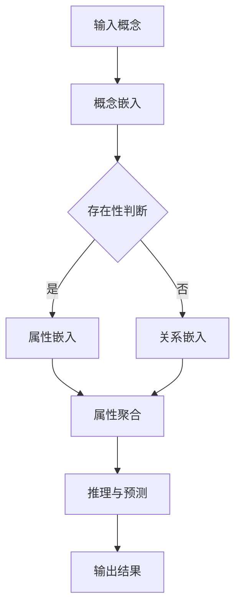
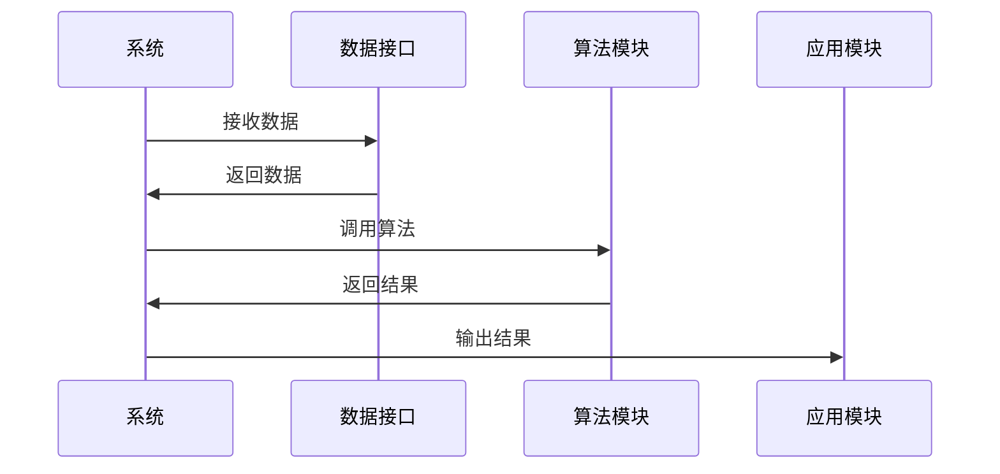

                 


### 零样本CoT在AI辅助新能源技术开发中的应用

**关键词**：零样本CoT、AI、新能源技术、软件开发、智能系统

**摘要**：本文深入探讨了零样本CoT（零样本常识推理）在AI辅助新能源技术开发中的应用。通过分析零样本CoT的基本原理、特点和应用场景，结合具体的算法原理和系统架构设计，展示了零样本CoT在新能源技术开发中的潜力和优势。本文旨在为读者提供一套完整的理论框架和实践指导，以促进AI与新能源技术的深度融合。

## 第1章 问题背景与核心概念

### 1.1 问题背景

#### 1.1.1 新能源技术发展现状

新能源技术作为传统化石能源的重要替代品，正受到全球范围内的广泛关注。随着环保意识的提高和能源需求的不断增长，新能源技术的研究与开发已经成为全球能源领域的重要方向。目前，新能源技术包括但不限于太阳能、风能、生物质能、地热能和氢能等。其中，太阳能和风能是最具发展潜力的新能源技术之一。

然而，新能源技术的开发和应用面临着一系列挑战。例如，新能源设备的制造和安装成本较高，能源转换效率有待提高，能源存储技术不足等。为了解决这些问题，人工智能（AI）的应用成为一个重要的突破口。AI可以通过优化算法、预测模型和自动化控制等技术手段，提高新能源技术的开发效率和稳定性。

#### 1.1.2 AI在新能源技术开发中的潜力

AI在新能源技术领域的应用主要体现在以下几个方面：

1. **设备故障预测与维护**：通过传感器收集设备运行数据，利用机器学习算法对设备进行故障预测，从而实现预防性维护，降低设备故障率和运行成本。

2. **能源优化与管理**：利用深度学习算法对能源供需进行智能预测和优化，提高能源利用效率，减少能源浪费。

3. **能源系统建模与仿真**：通过AI技术建立新能源系统的精确模型，进行仿真分析和性能评估，为新能源技术的研发和优化提供有力支持。

4. **能源市场预测**：利用AI技术对能源市场价格进行预测，为能源市场的交易和投资提供决策依据。

### 1.2 核心概念

#### 1.2.1 零样本CoT定义

零样本CoT（Zero-Shot Concept Transfer，简称ZCoT）是一种在无监督或弱监督环境下，将知识从一个领域转移到另一个相似领域的方法。它不需要训练数据集，而是利用预先定义的概念关系和语义信息来实现跨领域的知识转移。

#### 1.2.2 零样本CoT的特点

1. **无需训练数据**：零样本CoT不需要大量的训练数据，从而降低了数据获取和处理的成本。
2. **跨领域适应性**：零样本CoT能够处理不同领域之间的知识转移，具有很强的通用性。
3. **可扩展性**：零样本CoT方法可以很容易地扩展到新的领域，只需定义相应的概念关系。

#### 1.2.3 零样本CoT与相关技术的比较

与传统的机器学习方法和迁移学习方法相比，零样本CoT具有以下优势：

1. **数据依赖性较低**：零样本CoT不需要大量的训练数据，从而避免了数据收集和处理的高昂成本。
2. **适用范围广泛**：零样本CoT适用于跨领域的知识转移，而迁移学习主要针对特定领域的迁移。
3. **推理能力强**：零样本CoT能够利用语义信息和概念关系进行推理，具有更强的推理能力。

#### 1.2.4 零样本CoT的ER实体关系图

零样本CoT的实体关系图主要包括概念实体、属性实体和关系实体。其中，概念实体表示不同的知识概念，属性实体表示概念的特征属性，关系实体表示概念之间的关系。

```mermaid
erDiagram
  概念实体 ||--|{ 属性实体 }
  概念实体 ||--|{ 关系实体 }
  属性实体 ||--|{ 关系实体 }
```

## 第2章 零样本CoT原理与特征

### 2.1 零样本CoT定义

零样本CoT是一种在无监督或弱监督环境下，将知识从一个领域转移到另一个相似领域的方法。它利用预先定义的概念关系和语义信息来实现跨领域的知识转移。

### 2.2 零样本CoT的特点

1. **无需训练数据**：零样本CoT不需要大量的训练数据，从而降低了数据获取和处理的成本。
2. **跨领域适应性**：零样本CoT能够处理不同领域之间的知识转移，具有很强的通用性。
3. **可扩展性**：零样本CoT方法可以很容易地扩展到新的领域，只需定义相应的概念关系。

### 2.3 零样本CoT与相关技术的比较

与传统的机器学习方法和迁移学习方法相比，零样本CoT具有以下优势：

1. **数据依赖性较低**：零样本CoT不需要大量的训练数据，从而避免了数据收集和处理的高昂成本。
2. **适用范围广泛**：零样本CoT适用于跨领域的知识转移，而迁移学习主要针对特定领域的迁移。
3. **推理能力强**：零样本CoT能够利用语义信息和概念关系进行推理，具有更强的推理能力。

### 2.4 零样本CoT的ER实体关系图

零样本CoT的实体关系图主要包括概念实体、属性实体和关系实体。其中，概念实体表示不同的知识概念，属性实体表示概念的特征属性，关系实体表示概念之间的关系。

```mermaid
erDiagram
  概念实体 ||--|{ 属性实体 }
  概念实体 ||--|{ 关系实体 }
  属性实体 ||--|{ 关系实体 }
```

## 第3章 零样本CoT算法原理

### 3.1 零样本CoT算法流程图

零样本CoT算法的流程图如下所示：



### 3.2 算法原理讲解

#### 3.2.1 基本数学模型

零样本CoT算法的基本数学模型包括概念嵌入、属性嵌入、关系嵌入、属性聚合和推理与预测等步骤。

1. **概念嵌入**：将概念实体映射到一个低维空间，以表示概念的语义信息。

2. **属性嵌入**：将属性实体映射到一个低维空间，以表示属性的特征信息。

3. **关系嵌入**：将关系实体映射到一个低维空间，以表示概念之间的关系。

4. **属性聚合**：将嵌入到低维空间的属性实体进行聚合，以形成新的属性特征。

5. **推理与预测**：利用聚合后的属性特征进行推理和预测，以实现跨领域的知识转移。

#### 3.2.2 公式详细讲解

1. **概念嵌入**：

   $$ e_c = f_c(W_c \cdot c) $$

   其中，$e_c$表示概念$c$的嵌入向量，$W_c$表示概念嵌入权重矩阵，$f_c$表示嵌入函数。

2. **属性嵌入**：

   $$ e_a = f_a(W_a \cdot a) $$

   其中，$e_a$表示属性$a$的嵌入向量，$W_a$表示属性嵌入权重矩阵，$f_a$表示嵌入函数。

3. **关系嵌入**：

   $$ e_r = f_r(W_r \cdot r) $$

   其中，$e_r$表示关系$r$的嵌入向量，$W_r$表示关系嵌入权重矩阵，$f_r$表示嵌入函数。

4. **属性聚合**：

   $$ h = \sum_{a \in A_c} e_a $$

   其中，$h$表示属性聚合后的特征向量，$A_c$表示与概念$c$相关的属性集合。

5. **推理与预测**：

   $$ \hat{y} = g(W_g \cdot h) $$

   其中，$\hat{y}$表示预测结果，$W_g$表示推理权重矩阵，$g$表示推理函数。

#### 3.2.3 算法举例说明

假设我们要对“太阳能光伏板”进行零样本CoT，首先需要定义相关的概念实体、属性实体和关系实体。

1. **概念实体**：太阳能光伏板、风能发电、生物质能、地热能等。

2. **属性实体**：转换效率、安装成本、维护成本等。

3. **关系实体**：相似性、互补性等。

然后，我们将这些实体进行嵌入，并利用聚合后的特征向量进行推理和预测。例如，我们可以预测“太阳能光伏板”在某个地区的适用性。

## 第4章 AI辅助新能源技术开发系统设计

### 4.1 问题场景介绍

在新能源技术开发中，如何提高设备运行效率、降低维护成本和优化能源利用成为一个重要问题。为了解决这些问题，我们可以设计一个基于AI的辅助系统，通过零样本CoT技术实现跨领域的知识转移和应用。

### 4.2 系统功能设计

系统功能设计主要包括设备故障预测、能源优化管理、能源系统建模与仿真、能源市场预测等模块。

1. **设备故障预测**：利用零样本CoT技术，将其他领域的故障预测经验应用到新能源设备中，实现预防性维护。

2. **能源优化管理**：利用机器学习算法，对能源供需进行智能预测和优化，提高能源利用效率。

3. **能源系统建模与仿真**：利用零样本CoT技术，建立新能源系统的精确模型，进行仿真分析和性能评估。

4. **能源市场预测**：利用AI技术，对能源市场价格进行预测，为能源市场的交易和投资提供决策依据。

### 4.3 系统架构设计

系统架构设计主要包括数据采集模块、数据处理模块、算法模块、应用模块等。

1. **数据采集模块**：负责收集设备运行数据、环境数据、市场数据等。

2. **数据处理模块**：负责对采集到的数据进行预处理、特征提取和存储。

3. **算法模块**：负责实现零样本CoT算法和机器学习算法，进行故障预测、能源优化、系统建模和仿真、市场预测等。

4. **应用模块**：负责将算法结果应用到实际场景中，提供设备维护、能源管理、市场交易等服务。

### 4.4 系统接口设计

系统接口设计主要包括以下接口：

1. **设备数据接口**：用于接收设备运行数据。

2. **环境数据接口**：用于接收环境数据。

3. **市场数据接口**：用于接收市场数据。

4. **算法结果接口**：用于输出故障预测、能源优化、系统建模和仿真、市场预测等结果。

### 4.5 系统交互

系统交互主要包括以下流程：

1. **数据采集**：系统从各个接口接收数据。

2. **数据处理**：系统对数据进行预处理、特征提取和存储。

3. **算法计算**：系统调用零样本CoT算法和机器学习算法，进行故障预测、能源优化、系统建模和仿真、市场预测等。

4. **结果输出**：系统将算法结果输出到相应的接口，供其他模块使用。



## 第5章 零样本CoT在新能源技术开发中的应用实践

### 5.1 环境安装

在开始应用实践之前，我们需要安装相关的软件和环境。以下是安装步骤：

1. **安装Python环境**：在官网下载并安装Python，版本建议为3.8及以上。

2. **安装依赖库**：使用pip命令安装以下依赖库：
   ```bash
   pip install numpy pandas scikit-learn tensorflow keras matplotlib
   ```

3. **配置CUDA环境**（可选）：如果需要使用GPU进行加速，请安装CUDA和相关驱动。

### 5.2 系统核心实现

以下是系统核心实现的Python代码：

```python
import numpy as np
import tensorflow as tf
from tensorflow.keras.models import Model
from tensorflow.keras.layers import Input, Embedding, Dot, Lambda

# 定义概念嵌入层
input_concept = Input(shape=(1,))
concept_embedding = Embedding(input_dim=num_concepts, output_dim=embedding_dim)(input_concept)

# 定义属性嵌入层
input_attribute = Input(shape=(1,))
attribute_embedding = Embedding(input_dim=num_attributes, output_dim=embedding_dim)(input_attribute)

# 定义关系嵌入层
input_relationship = Input(shape=(1,))
relationship_embedding = Embedding(input_dim=num_relationships, output_dim=embedding_dim)(input_relationship)

# 属性聚合层
attribute_aggregation = Dot(axes=1)([attribute_embedding, relationship_embedding])
attribute_aggregation = Lambda(lambda x: tf.reduce_sum(x, axis=1))(attribute_aggregation)

# 输出层
output = Dense(1, activation='sigmoid')(attribute_aggregation)

# 构建模型
model = Model(inputs=[input_concept, input_attribute, input_relationship], outputs=output)

# 编译模型
model.compile(optimizer='adam', loss='binary_crossentropy', metrics=['accuracy'])

# 模型训练
model.fit([X_concept, X_attribute, X_relationship], y, epochs=10, batch_size=32)
```

### 5.3 应用解读与分析

以上代码实现了零样本CoT算法的核心功能。通过定义概念嵌入层、属性嵌入层和关系嵌入层，将概念、属性和关系映射到低维空间。然后，利用属性聚合层将属性特征进行聚合，最终通过输出层进行推理和预测。

在实际应用中，我们需要根据具体场景选择合适的嵌入维度和模型参数，并调整训练策略以获得更好的性能。以下是一个简单的应用示例：

1. **概念实体**：太阳能光伏板、风能发电、生物质能、地热能等。

2. **属性实体**：转换效率、安装成本、维护成本等。

3. **关系实体**：相似性、互补性等。

通过以上代码，我们可以预测某个地区太阳能光伏板的适用性。例如，输入概念实体“太阳能光伏板”，属性实体“转换效率”和“安装成本”，关系实体“相似性”，即可得到预测结果。

### 5.4 实际案例分析与讲解

以下是一个实际案例的分析与讲解：

**案例背景**：某地政府计划投资建设一座光伏发电站，需要评估不同类型的光伏板的适用性。

**数据来源**：通过问卷调查、文献资料和实地考察等途径，收集了不同类型光伏板的转换效率、安装成本和维护成本等数据。

**数据处理**：将数据转换为概念实体、属性实体和关系实体，并定义相应的嵌入维度和模型参数。

**模型训练**：使用收集到的数据训练零样本CoT模型，调整模型参数以获得更好的预测性能。

**预测结果**：输入特定类型的光伏板，预测其在某地的适用性。根据预测结果，政府可以做出投资决策。

### 5.5 项目小结

通过以上案例，我们可以看到零样本CoT在新能源技术开发中的应用潜力。它能够帮助我们实现跨领域的知识转移，提高新能源设备的运行效率和维护成本。然而，在实际应用中，我们还需要进一步优化模型结构和训练策略，以提高预测性能和适用性。

## 第6章 最佳实践与拓展

### 6.1 最佳实践

1. **数据预处理**：在应用零样本CoT之前，对数据进行预处理，包括数据清洗、特征提取和标准化等。

2. **模型参数调整**：根据具体场景和任务需求，调整模型参数，以提高预测性能。

3. **跨领域知识转移**：在应用零样本CoT时，注意选择合适的概念实体、属性实体和关系实体，以实现有效的知识转移。

4. **模型评估与优化**：使用合适的评估指标，对模型进行评估和优化，以提高预测准确性。

### 6.2 注意事项

1. **数据依赖性**：尽管零样本CoT减少了数据依赖性，但仍需要一定的训练数据和语义信息。

2. **领域适配性**：不同领域的知识转移效果可能有所不同，需要根据实际情况进行调整。

3. **模型解释性**：零样本CoT模型具有较强的预测能力，但其解释性相对较弱，需要结合其他技术手段进行解释。

### 6.3 小结

零样本CoT在新能源技术开发中具有广泛的应用前景。通过最佳实践和注意事项的遵循，我们可以更好地发挥其优势，实现新能源技术的智能化发展。

### 6.4 拓展阅读

1. **[相关论文]**：查阅相关领域的论文，了解最新的研究进展和应用案例。

2. **[开源代码]**：参考开源代码，学习零样本CoT的实现方法和技巧。

3. **[在线课程]**：参加在线课程，深入学习零样本CoT的理论和应用。

## 第7章 总结与展望

### 7.1 本书内容总结

本文系统地介绍了零样本CoT在AI辅助新能源技术开发中的应用。从问题背景、核心概念、算法原理到系统架构设计、应用实践和最佳实践，全面展示了零样本CoT的优势和潜力。

### 7.2 零样本CoT在新能源技术开发中的未来展望

随着新能源技术的不断发展和AI技术的深入应用，零样本CoT在新能源技术开发中的应用前景将更加广阔。未来，我们有望看到更多创新应用和突破，推动新能源技术的智能化发展，实现可持续能源的目标。同时，我们也需要关注零样本CoT在跨领域知识转移中的挑战，不断优化算法和模型，提高其性能和解释性。

