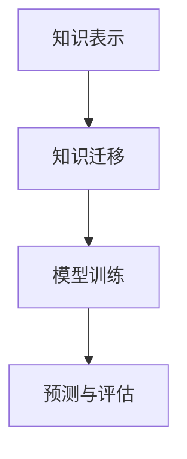

                 

### 引言：零样本CoT与AI辅助气候变化预测背景

#### 1.1 问题背景

随着全球气候变化趋势日益明显，气候变化的预测和应对已成为全球关注的焦点。气候变化带来的影响不仅限于环境问题，还涉及经济、社会、健康等多个方面。因此，准确预测气候变化趋势对于制定有效的应对策略至关重要。

传统的气候变化预测方法主要依赖于大量的历史气候数据，通过对这些数据进行统计分析来预测未来的气候变化趋势。然而，这种方法在应对复杂多变的气候系统时存在一定的局限性。首先，历史数据的覆盖范围和精度受到限制，难以全面反映全球气候变化的复杂性。其次，气候变化过程具有非线性、混沌和不确定性的特点，使得传统的统计方法难以准确捕捉这些特性。

为了克服传统方法的局限性，近年来人工智能（AI）在气候变化预测中的应用逐渐受到关注。AI技术具有强大的数据处理和分析能力，可以处理大规模、复杂的气候数据，并从中发现潜在的模式和趋势。特别是在深度学习、神经网络等领域，AI技术的应用为气候变化预测提供了新的思路和方法。

然而，AI技术在气候变化预测中也面临一些挑战。首先，气候变化预测需要大量的高质量数据，而现有的数据资源往往有限且不完善。其次，AI模型的训练和预测过程需要大量的计算资源和时间，这对于资源和时间有限的研究机构来说是一个不小的挑战。此外，AI模型的透明性和可解释性也是一个重要问题，因为AI模型通常是一个“黑盒”，难以解释其预测结果的原因。

为了解决这些挑战，零样本CoT（Concept Transfer）作为一种新兴的方法逐渐引起了研究者的关注。零样本CoT通过跨领域或跨任务的知识迁移，将一个领域或任务中的知识应用于另一个领域或任务，从而降低对大量数据的依赖，提高预测的准确性和效率。

零样本CoT在AI辅助气候变化预测中的应用具有以下优势：

1. **降低数据依赖**：零样本CoT通过跨领域或跨任务的知识迁移，可以从现有的知识库中获取相关领域或任务的知识，降低对大量高质量数据的依赖。这对于数据资源有限的情况尤为重要。

2. **提高预测准确率**：零样本CoT可以通过跨领域或跨任务的知识迁移，提高模型对未知数据的预测能力。由于气候变化预测涉及到多个领域，如气象学、生态学等，不同领域的知识可以相互补充，从而提高预测的准确率。

3. **缩短训练时间**：传统的AI模型需要大量数据进行训练，而零样本CoT可以通过迁移已有的知识，减少训练所需的数据量，从而缩短训练时间。

4. **提高模型可解释性**：零样本CoT通过跨领域或跨任务的知识迁移，可以使得模型具有更高的透明性和可解释性。这对于理解模型预测结果的原因、提高模型的可信度具有重要意义。

总之，零样本CoT在AI辅助气候变化预测中的应用具有巨大的潜力，可以为气候变化预测提供新的方法和思路。然而，这一领域仍处于探索阶段，需要进一步的研究和实践来验证其有效性和可行性。

#### 1.2 零样本CoT简介

零样本CoT（Zero-Shot Concept Transfer）是一种在人工智能领域中新兴的机器学习技术，旨在解决传统机器学习模型在面对未知类别或概念时的挑战。传统的机器学习模型通常依赖于大量的标注数据来训练，以便在遇到未知类别时能够做出准确的预测。然而，在某些应用场景中，如气候变化预测，获取大规模标注数据是非常困难的，甚至是不可能的。这就需要一种能够处理零样本问题的学习方法。

**概念定义与核心思想**

零样本CoT的核心思想是通过跨领域或跨任务的知识迁移，将一个领域或任务中的知识应用于另一个领域或任务。具体来说，零样本CoT利用源领域（或源任务）中的知识来辅助目标领域（或目标任务）中的模型学习，从而实现零样本预测。这里，源领域和目标领域可以是完全不同的，甚至相互之间没有直接的联系。

**与传统机器学习方法的区别**

与传统的机器学习方法相比，零样本CoT具有以下特点：

1. **无需大规模标注数据**：传统机器学习方法依赖于大规模标注数据来训练模型，而零样本CoT可以通过迁移已有的知识来减少对大量标注数据的依赖。这在数据稀缺的情况下具有重要意义。

2. **处理未知类别**：传统机器学习模型在遇到未知类别时通常无法做出准确的预测，而零样本CoT通过跨领域或跨任务的知识迁移，可以使得模型在遇到未知类别时仍能够保持较高的预测准确性。

3. **提高泛化能力**：零样本CoT通过引入跨领域或跨任务的知识迁移，可以使得模型具有更高的泛化能力，不仅能够处理已知类别，还能够处理未知类别。

**实现方法**

零样本CoT的实现方法可以分为以下几类：

1. **基于原型的方法**：这种方法通过将源领域的知识（如原型或特征）迁移到目标领域，从而实现零样本预测。例如，通过计算源领域和目标领域数据之间的相似度，将源领域的知识应用于目标领域。

2. **基于模型的方法**：这种方法通过训练一个统一的模型，该模型能够在源领域和目标领域中同时工作。例如，使用多任务学习（Multi-Task Learning, MTL）或迁移学习（Transfer Learning）技术，将源领域中的知识迁移到目标领域。

3. **基于知识图谱的方法**：这种方法通过构建一个知识图谱，将源领域和目标领域中的知识进行整合，从而实现零样本预测。知识图谱中的关系和实体可以作为迁移知识的桥梁。

**应用场景**

零样本CoT在各种领域中都有广泛的应用场景，以下是一些典型的应用：

1. **自然语言处理**：在自然语言处理（NLP）领域，零样本CoT可以用于零样本文本分类、零样本关系提取等任务。例如，通过迁移已有的语言模型知识来处理新的文本分类任务。

2. **计算机视觉**：在计算机视觉（CV）领域，零样本CoT可以用于零样本图像分类、零样本目标检测等任务。例如，通过迁移已有的视觉模型知识来处理新的图像分类任务。

3. **气候变化预测**：在气候变化预测领域，零样本CoT可以通过跨领域知识迁移，将气象学、生态学等领域的知识应用于气候变化预测，从而提高预测的准确性和效率。

总之，零样本CoT作为一种新兴的机器学习技术，具有广泛的应用前景和重要的研究价值。通过跨领域或跨任务的知识迁移，零样本CoT能够解决传统机器学习模型在面对未知类别或概念时的挑战，为各种复杂问题提供新的解决方案。

#### 1.3 AI辅助气候变化预测的重要性

随着全球气候变化问题的日益严峻，准确预测气候变化趋势对于制定有效的应对策略、减轻灾害影响、优化资源分配具有重要意义。AI技术在气候变化预测中的应用为这一领域带来了新的机遇和挑战。

**气候变化预测的挑战**

气候变化预测面临诸多挑战，包括：

1. **数据复杂性**：气候数据具有高维度、高噪声和不确定性等特点，传统方法难以全面捕捉其复杂性和动态性。

2. **非线性关系**：气候变化过程具有非线性、混沌和不确定性的特点，这使得预测模型难以准确捕捉这些特性。

3. **数据稀缺性**：获取高质量的气候数据是一个长期而复杂的过程，尤其是在某些地区和时间段，数据稀缺问题尤为突出。

4. **模型可解释性**：现有的预测模型（如统计模型和深度学习模型）往往是一个“黑盒”，难以解释其预测结果的原因，这在决策制定中可能带来一定的不确定性。

**AI技术在气候变化预测中的应用**

AI技术具有强大的数据处理和分析能力，可以应对上述挑战，为气候变化预测提供新的方法和思路。以下是AI技术在气候变化预测中的一些重要应用：

1. **数据增强**：AI技术可以自动处理和清洗原始数据，通过数据增强技术生成更多的训练数据，从而提高模型的鲁棒性和泛化能力。

2. **非线性建模**：深度学习模型（如神经网络和生成对抗网络）具有强大的非线性建模能力，可以捕捉气候变化过程中的复杂关系和动态变化。

3. **迁移学习**：通过迁移学习技术，可以从其他领域或任务中迁移已有的知识，降低对大规模标注数据的依赖，提高预测的准确性和效率。

4. **模型融合**：AI技术可以通过模型融合方法，将多个预测模型的结果进行整合，从而提高预测的准确性和稳定性。

5. **可解释性增强**：通过可解释性技术，如可视化、模型解释和决策树等方法，可以使得预测模型的结果更加透明和可信。

**AI辅助气候变化预测的优势**

1. **高效性**：AI技术可以处理大规模、高维度的数据，实现高效的数据分析和预测。

2. **准确性**：通过非线性建模和迁移学习等方法，AI技术可以提高预测的准确性和稳定性。

3. **灵活性**：AI技术可以根据不同的应用场景和需求，灵活调整和优化预测模型。

4. **可解释性**：通过可解释性技术，可以提高模型的透明度和可信度，从而在决策制定中发挥更大的作用。

总之，AI技术在气候变化预测中的应用具有重要意义。通过解决数据复杂性、非线性关系、数据稀缺性和模型可解释性等挑战，AI技术可以为气候变化预测提供新的方法和工具，为应对全球气候变化问题提供有力支持。

#### 1.4 本书结构安排

本书旨在深入探讨零样本CoT在AI辅助气候变化预测中的应用，通过系统化的研究，旨在为研究人员和开发者提供实用的方法和指导。以下是本书的结构安排：

**第一部分 引言：零样本CoT与AI辅助气候变化预测背景**
- **第1章 引言：零样本CoT与AI辅助气候变化预测背景**：介绍本文的研究背景和问题背景，包括AI辅助气候变化预测的重要性，以及零样本CoT的基本概念和应用。

**第二部分 零样本CoT基本原理**
- **第2章 零样本CoT基本原理**：详细讲解零样本CoT的概念、核心思想、实现方法和应用场景，为后续章节的深入分析奠定基础。

**第三部分 AI辅助气候变化预测方法**
- **第3章 AI辅助气候变化预测方法**：探讨AI在气候变化预测中的应用，包括常见模型、方法和技术，以及零样本CoT在其中的作用。

**第四部分 零样本CoT算法实现**
- **第4章 零样本CoT算法实现**：介绍零样本CoT算法的原理和实现方法，包括算法概述、流程图、数学模型和Python代码实现示例。

**第五部分 案例研究**
- **第5章 案例研究**：通过具体案例展示零样本CoT在AI辅助气候变化预测中的实际应用，包括案例选择、背景、实施步骤和结果分析。

**第六部分 实践应用与最佳实践**
- **第6章 实践应用与最佳实践**：讨论零样本CoT在气候变化预测中的实践应用场景，提供最佳实践建议，以及注意事项和挑战。

**第七部分 未来展望与研究方向**
- **第7章 未来展望与研究方向**：探讨零样本CoT和AI辅助气候变化预测的未来发展趋势，提出研究方向和挑战。

通过以上结构安排，本书旨在从理论到实践，全面系统地分析零样本CoT在AI辅助气候变化预测中的应用，为相关领域的研究和发展提供有力支持。读者可以依次阅读，逐步深入，也可以根据个人兴趣和需求选择性地阅读相关章节。希望本书能为研究人员和开发者提供有价值的参考和启示。

### 第2章 零样本CoT基本原理

#### 2.1 CoT概念与原理

**概念定义**

Concept Transfer（CoT），即概念迁移，是一种在机器学习领域中用于知识共享和任务迁移的技术。其核心思想是通过将一个领域（源领域）中的知识迁移到另一个领域（目标领域），从而在目标领域中实现高效的模型训练和预测。

**基本原理**

零样本CoT的基本原理可以概括为以下几步：

1. **知识表示**：首先，将源领域中的知识进行编码和表示，通常使用嵌入向量或高维特征向量来表示概念或实体。

2. **知识迁移**：通过计算源领域和目标领域之间知识表示的相似度或距离，将源领域的知识迁移到目标领域。这一过程可以通过不同的方法实现，如基于原型的方法、基于模型的方法和基于知识图谱的方法。

3. **模型训练**：利用迁移后的知识，在目标领域中训练预测模型。由于迁移了部分知识，模型在训练过程中可以减少对标注数据的依赖，从而提高模型的泛化能力和预测准确性。

4. **预测与评估**：在目标领域中，使用训练好的模型进行预测，并对预测结果进行评估和优化。

**与传统机器学习方法的比较**

与传统的机器学习方法相比，零样本CoT具有以下优势：

1. **无需大量标注数据**：传统机器学习方法通常依赖于大量的标注数据来训练模型，而零样本CoT可以通过迁移已有的知识，降低对大规模标注数据的依赖。

2. **处理未知类别**：传统机器学习方法在遇到未知类别时通常无法做出准确的预测，而零样本CoT可以通过跨领域或跨任务的知识迁移，提高模型对未知类别的预测能力。

3. **提高泛化能力**：零样本CoT通过引入跨领域或跨任务的知识迁移，可以使得模型具有更高的泛化能力，不仅能够处理已知类别，还能够处理未知类别。

4. **减少计算资源消耗**：由于零样本CoT可以减少对大量标注数据的依赖，因此可以降低训练所需的计算资源和时间。

**具体应用场景**

零样本CoT在各种领域中都有广泛的应用，以下是一些典型的应用场景：

1. **自然语言处理**：在自然语言处理（NLP）领域，零样本CoT可以用于零样本文本分类、零样本关系提取等任务。例如，通过迁移已有的语言模型知识来处理新的文本分类任务。

2. **计算机视觉**：在计算机视觉（CV）领域，零样本CoT可以用于零样本图像分类、零样本目标检测等任务。例如，通过迁移已有的视觉模型知识来处理新的图像分类任务。

3. **气候变化预测**：在气候变化预测领域，零样本CoT可以通过跨领域知识迁移，将气象学、生态学等领域的知识应用于气候变化预测，从而提高预测的准确性和效率。

总之，零样本CoT作为一种新兴的机器学习技术，具有广泛的应用前景和重要的研究价值。通过跨领域或跨任务的知识迁移，零样本CoT能够解决传统机器学习模型在面对未知类别或概念时的挑战，为各种复杂问题提供新的解决方案。

#### 2.2 零样本CoT的优势与挑战

零样本CoT（Zero-Shot Concept Transfer）作为一种新兴的机器学习技术，在多个领域展现出显著的潜力，但其有效应用也面临一定的挑战。以下将详细探讨零样本CoT的优势及其面临的挑战。

**优势**

1. **降低数据依赖**：传统的机器学习模型在训练过程中通常依赖于大量标注数据。然而，在某些应用场景中，如自然语言处理、计算机视觉以及气候变化预测等领域，获取大量高质量标注数据是非常困难的。零样本CoT通过跨领域或跨任务的知识迁移，可以从已有的知识库中获取相关领域或任务的知识，从而降低对大规模标注数据的依赖。

2. **提高预测准确率**：零样本CoT通过引入跨领域或跨任务的知识迁移，可以使得模型在遇到未知类别时仍能够保持较高的预测准确率。由于不同领域的知识可以相互补充，从而提高模型对未知数据的处理能力。

3. **缩短训练时间**：传统的机器学习模型需要大量数据进行训练，而零样本CoT可以通过迁移已有的知识，减少训练所需的数据量，从而缩短训练时间。这对于资源和时间有限的研究机构来说是一个显著的优点。

4. **增强模型泛化能力**：零样本CoT通过跨领域或跨任务的知识迁移，使得模型能够处理多个领域或任务中的数据，从而提高模型的泛化能力。这有助于模型在未知领域中也能保持较高的性能。

5. **提高模型可解释性**：零样本CoT通过引入跨领域或跨任务的知识迁移，可以提高模型的可解释性。这使得模型预测结果更加透明和可信，有助于理解模型预测结果的原因。

**挑战**

1. **知识迁移的准确性**：零样本CoT依赖于跨领域或跨任务的知识迁移，但不同领域或任务之间的知识表示和迁移方法可能存在差异。因此，如何准确地将源领域中的知识迁移到目标领域是一个重要挑战。

2. **数据质量**：虽然零样本CoT可以降低对标注数据的依赖，但源领域数据的质量对迁移效果有直接影响。如果源领域数据存在噪声或缺失，那么迁移后的知识可能不完整或存在偏差。

3. **计算资源消耗**：尽管零样本CoT可以减少训练时间，但迁移学习过程本身需要计算资源。特别是在处理高维度数据和复杂模型时，计算资源消耗可能仍然是一个显著问题。

4. **模型复杂性**：零样本CoT通常涉及多个领域或任务的融合，这可能导致模型变得复杂。复杂的模型不仅难以理解，而且在实际应用中可能难以部署。

5. **任务适应性**：并非所有任务都适合使用零样本CoT。某些任务可能需要特定的领域知识，而零样本CoT在迁移这些知识时可能面临挑战。

**解决方案与改进方向**

1. **改进知识表示**：为了提高知识迁移的准确性，可以探索更有效的知识表示方法，如基于深度学习的知识表示方法，以更好地捕捉源领域和目标领域之间的知识关联。

2. **数据预处理**：通过数据预处理方法，如数据清洗、去噪和增强，可以提升源领域数据的质量，从而提高知识迁移的效果。

3. **资源优化**：在计算资源有限的情况下，可以采用分布式计算和模型压缩技术，以减少计算资源消耗。

4. **简化模型结构**：通过简化模型结构，如使用轻量级网络架构，可以降低模型的复杂性，提高模型的可解释性。

5. **任务适应性研究**：针对不同的任务需求，研究如何优化零样本CoT的应用策略，以提高其在特定任务中的适应性。

总之，零样本CoT在人工智能领域具有巨大的应用潜力，但也面临一定的挑战。通过不断改进和优化，可以充分发挥零样本CoT的优势，为各种复杂问题提供有效的解决方案。

#### 2.3 零样本CoT的核心要素

零样本CoT（Zero-Shot Concept Transfer）作为一种新兴的机器学习技术，其有效应用依赖于多个核心要素。以下将详细探讨这些核心要素，包括知识表示、迁移策略、评估指标和挑战与解决方案。

**知识表示**

1. **概念嵌入**：在零样本CoT中，知识表示的关键在于将源领域中的概念或实体转换为可计算的形式。常用的方法包括基于词嵌入的文本表示和基于特征提取的图像表示。词嵌入技术，如Word2Vec和GloVe，可以将文本中的词语转换为高维向量表示。同样，深度学习模型，如卷积神经网络（CNN）和循环神经网络（RNN），可以提取图像中的特征向量。

2. **高维特征**：通过将源领域中的概念或实体映射到高维特征空间，可以更好地捕捉概念之间的复杂关系。这种高维特征表示有助于在迁移过程中有效地利用源领域知识。

3. **知识融合**：在零样本CoT中，源领域和目标领域的知识需要融合，以便在目标领域中形成有效的预测模型。知识融合可以通过多任务学习（Multi-Task Learning）或领域自适应（Domain Adaptation）等方法实现。这些方法可以使得模型在目标领域中能够利用源领域的知识，从而提高预测性能。

**迁移策略**

1. **迁移学习**：迁移学习（Transfer Learning）是零样本CoT的核心技术之一。其基本思想是将源领域中的知识迁移到目标领域，从而在目标领域中训练高效的预测模型。迁移学习可以通过预训练模型（如预训练的语言模型和视觉模型）和领域特定模型的组合来实现。

2. **多任务学习**：多任务学习（Multi-Task Learning）通过同时训练多个相关任务，可以共享任务间的知识，从而提高模型在目标任务中的性能。多任务学习可以有效地利用源领域中的知识，提高模型的泛化能力。

3. **领域自适应**：领域自适应（Domain Adaptation）旨在解决源领域和目标领域之间的分布差异问题。通过领域自适应技术，如领域歧视（Domain Discrepancy）、度量学习（Metric Learning）和生成对抗网络（GANs），可以减少源领域和目标领域之间的差异，从而提高模型在目标领域的适应性。

**评估指标**

1. **准确率**：准确率（Accuracy）是评估零样本CoT模型性能的基本指标。它表示模型正确预测的样本占总样本的比例。高准确率表明模型具有良好的预测能力。

2. **召回率**：召回率（Recall）表示模型正确预测的负样本数与实际负样本数的比例。高召回率意味着模型能够有效地识别出目标领域的负样本。

3. **F1分数**：F1分数（F1 Score）是准确率和召回率的调和平均，综合评估了模型的预测性能。F1分数越高，表明模型在预测正负样本时都较为准确。

4. **迁移效果评估**：除了传统评估指标，还需要评估模型在源领域和目标领域的迁移效果。常见的评估方法包括计算源领域和目标领域之间的知识分布差异、评估模型在源领域和目标领域中的泛化能力等。

**挑战与解决方案**

1. **知识迁移准确性**：如何准确地将源领域中的知识迁移到目标领域是一个重要挑战。解决方案包括改进知识表示方法、优化迁移策略和增加数据预处理步骤。

2. **数据质量**：源领域数据的质量直接影响知识迁移的效果。解决方案包括使用高质量的数据集、进行数据预处理和增强。

3. **计算资源消耗**：迁移学习过程需要大量的计算资源。解决方案包括使用分布式计算、模型压缩和轻量级模型。

4. **模型复杂性**：复杂的模型结构可能影响模型的可解释性。解决方案包括简化模型结构、使用可解释性方法。

5. **任务适应性**：并非所有任务都适合使用零样本CoT。解决方案包括研究特定任务的迁移策略和优化模型结构。

总之，零样本CoT的核心要素包括知识表示、迁移策略、评估指标和挑战与解决方案。通过深入理解和优化这些核心要素，可以充分发挥零样本CoT的优势，为各种复杂问题提供有效的解决方案。

#### 2.4 零样本CoT的实现方法

零样本CoT（Zero-Shot Concept Transfer）的实现方法主要分为基于原型的方法、基于模型的方法和基于知识图谱的方法。以下将详细介绍这三种方法，并探讨各自的优缺点。

**基于原型的方法**

1. **基本概念**：基于原型的方法通过将源领域中的知识表示为原型或特征，然后将这些原型或特征应用于目标领域中的新实例，从而实现零样本预测。这种方法通常涉及将源领域中的每个概念或实体表示为一个原型向量。

2. **实现步骤**：
   - **原型提取**：首先，从源领域中提取每个概念或实体的原型向量。这可以通过聚类、主成分分析（PCA）或基于聚类的方法实现。
   - **特征匹配**：对于目标领域中的新实例，计算其与源领域原型向量之间的相似度。常用的相似度度量方法包括欧氏距离、余弦相似度和内积相似度。
   - **预测**：根据相似度度量结果，将新实例归类到与原型最相似的类别中。

3. **优缺点**：
   - **优点**：基于原型的方法简单直观，易于实现和理解。它不需要训练复杂的模型，计算成本较低。
   - **缺点**：这种方法依赖于原型向量的选择和提取方法，可能无法很好地捕捉源领域和目标领域之间的复杂关系。此外，当源领域和目标领域之间存在较大差异时，预测效果可能不佳。

**基于模型的方法**

1. **基本概念**：基于模型的方法通过训练一个统一的模型，该模型能够在源领域和目标领域中同时工作，从而实现零样本预测。这种方法通常涉及迁移学习（Transfer Learning）和多任务学习（Multi-Task Learning）。

2. **实现步骤**：
   - **预训练模型**：首先，使用源领域的大量数据进行预训练，以获得一个泛化的模型。常用的预训练模型包括卷积神经网络（CNN）、循环神经网络（RNN）和变换器（Transformer）。
   - **领域适应**：然后，对预训练模型进行领域适应（Domain Adaptation），以减少源领域和目标领域之间的分布差异。常见的领域适应方法包括领域歧视（Domain Discrepancy）、度量学习（Metric Learning）和生成对抗网络（GANs）。
   - **多任务学习**：通过同时训练多个相关任务，可以共享任务间的知识，从而提高模型在目标任务中的性能。

3. **优缺点**：
   - **优点**：基于模型的方法可以充分利用源领域中的知识，提高模型在目标领域中的泛化能力。它能够处理复杂的非线性关系，预测效果较好。
   - **缺点**：这种方法需要大量的计算资源和时间，特别是在训练复杂模型和进行领域适应时。此外，模型的可解释性可能较低。

**基于知识图谱的方法**

1. **基本概念**：基于知识图谱的方法通过构建一个知识图谱，将源领域和目标领域中的知识进行整合，从而实现零样本预测。知识图谱中的实体和关系可以作为迁移知识的桥梁。

2. **实现步骤**：
   - **知识图谱构建**：首先，从源领域和目标领域中提取实体和关系，构建一个知识图谱。这可以通过知识抽取、实体链接和关系提取等方法实现。
   - **知识融合**：然后，将源领域和目标领域的知识进行融合，形成一个统一的图谱。这可以通过图谱嵌入、图神经网络（Graph Neural Networks）等方法实现。
   - **预测**：对于目标领域中的新实例，通过查询知识图谱，找到与其最相关的实体和关系，从而进行预测。

3. **优缺点**：
   - **优点**：基于知识图谱的方法可以有效地整合多源知识，提高模型在目标领域中的预测能力。它能够捕捉复杂的实体和关系，提供更丰富的知识背景。
   - **缺点**：这种方法需要构建和维护一个高质量的知识图谱，知识图谱的构建和融合过程可能较为复杂。此外，图谱中的实体和关系可能存在不一致或噪声，影响预测效果。

**总结**

零样本CoT的实现方法包括基于原型的方法、基于模型的方法和基于知识图谱的方法。每种方法都有其优缺点，适用于不同的应用场景。基于原型的方法计算成本低，适合简单应用；基于模型的方法可以处理复杂的非线性关系，适合复杂应用；基于知识图谱的方法能够整合多源知识，提高预测能力，适合需要丰富知识背景的应用。

选择合适的实现方法需要考虑应用场景、数据质量、计算资源和模型需求等因素。通过结合多种方法，可以充分发挥零样本CoT的优势，为各种复杂问题提供有效的解决方案。

### 第3章 AI辅助气候变化预测方法

#### 3.1 气候变化预测的基本概念

气候变化预测是研究气候变化趋势和未来变化的重要手段。其核心目标是通过分析历史气候数据和现有的气候模式，预测未来一定时间尺度（如几年、几十年）内的气候变化趋势。以下将介绍气候变化预测的基本概念、相关术语以及预测方法。

**基本概念**

1. **气候变化**：气候变化指的是气候系统中长期的变化，通常包括气温、降水、风场、海平面等多种气候要素的变化。气候变化可以是自然的，如冰河时期和间冰期的交替；也可以是人为的，如工业化导致的大气中温室气体浓度增加。

2. **气候预测**：气候预测是利用历史气候数据、物理气候模型和统计方法，对未来气候状态进行预测的过程。气候预测通常涉及短期预测（如季节性预测）和长期预测（如百年尺度预测）。

3. **预测模型**：气候预测模型是用于模拟和预测气候变化过程的数学模型。常见的预测模型包括统计模型、物理模型（如全球气候模型）和机器学习模型。

**相关术语**

1. **气候模式**：气候模式是描述气候系统状态和变化的数学模型。它通常通过数值模拟来再现气候系统的动态过程。

2. **历史气候数据**：历史气候数据是记录过去气候状态的数据，包括温度、降水、风速、气压等多种气候要素的观测数据。这些数据通常来自气象站、卫星观测和古气候记录等。

3. **预报因子**：预报因子是用于预测气候变化的变量，如大气中的温室气体浓度、太阳辐射、海洋温度等。预报因子与气候变化之间存在一定的相关性，可以作为预测模型中的输入变量。

**预测方法**

1. **统计模型**：统计模型是基于历史气候数据和统计方法来预测未来气候变化的方法。常见的统计模型包括线性回归、时间序列分析、主成分分析（PCA）等。这些方法通过分析历史数据中的相关性、趋势和周期性，预测未来气候状态。

2. **物理模型**：物理模型是基于气候系统的物理原理和数学方程来模拟和预测气候变化的方法。常见的物理模型包括全球气候模型（GCM）、区域气候模型（RCM）和气候变率预测系统（CVP）。这些模型通过数值模拟地球大气、海洋和陆地的动态过程，预测未来气候状态。

3. **机器学习模型**：机器学习模型是通过学习历史气候数据中的模式和关系，预测未来气候变化的方法。常见的机器学习模型包括决策树、支持向量机（SVM）、神经网络（如卷积神经网络（CNN）和循环神经网络（RNN））等。这些方法可以处理高维度、非线性数据和复杂数据关系，提高预测精度。

**方法比较**

1. **统计模型**：统计模型简单易实现，计算成本较低，适用于短期预测。然而，统计模型在处理复杂气候系统和长期预测时可能存在局限性。

2. **物理模型**：物理模型具有较高的物理真实性，可以模拟气候系统的复杂动态过程，适用于长期预测。然而，物理模型的计算成本较高，需要大量计算资源和时间。

3. **机器学习模型**：机器学习模型可以通过学习历史数据中的模式和关系，提高预测精度。特别是在处理高维度、非线性数据和复杂数据关系时，机器学习模型具有显著优势。然而，机器学习模型的解释性较差，难以直观理解预测结果。

综上所述，气候变化预测方法包括统计模型、物理模型和机器学习模型。每种方法都有其优缺点和适用范围。通过结合多种方法，可以构建更准确的气候预测模型，为气候变化研究和应对提供有力支持。

#### 3.2 AI在气候变化预测中的应用

随着人工智能（AI）技术的发展，AI在气候变化预测中的应用逐渐成为研究热点。AI技术通过其强大的数据处理和分析能力，可以更准确地预测气候变化趋势，为气候政策制定和灾害预防提供重要支持。

**AI技术概述**

AI技术包括机器学习、深度学习、强化学习等多种方法。其中，机器学习和深度学习在气候变化预测中应用最为广泛。

1. **机器学习**：机器学习是一种通过训练模型来学习数据中的模式和规律的技术。常见的机器学习算法包括线性回归、逻辑回归、支持向量机（SVM）、决策树、随机森林等。机器学习模型可以从大量历史气候数据中学习，预测未来的气候变化。

2. **深度学习**：深度学习是一种基于多层神经网络的学习方法。它通过训练多层神经网络来提取数据中的复杂特征和模式。深度学习模型在图像识别、自然语言处理等领域取得了显著成果，也在气候变化预测中展现出巨大潜力。常见的深度学习模型包括卷积神经网络（CNN）、循环神经网络（RNN）和变换器（Transformer）。

**AI在气候变化预测中的具体应用**

1. **数据预处理**：AI技术可以用于数据预处理，包括数据清洗、数据增强和特征提取等。数据预处理是气候预测模型训练的重要步骤，AI技术可以自动化这些步骤，提高数据质量和预测模型的性能。

2. **预测模型训练**：AI技术可以用于训练预测模型，通过学习历史气候数据中的模式和关系，预测未来的气候变化。常见的AI预测模型包括基于机器学习的预测模型和基于深度学习的预测模型。

3. **多模型融合**：AI技术可以用于多模型融合，将多个预测模型的结果进行整合，提高预测的准确性和稳定性。多模型融合可以综合不同模型的优点，弥补单个模型的不足。

4. **可解释性分析**：AI技术可以提高预测模型的可解释性，帮助用户理解预测结果的原因。可解释性分析是AI技术在气候变化预测中的重要应用，可以提高模型的可信度和应用价值。

**案例研究**

1. **案例一：基于机器学习的气候预测**：某研究团队使用机器学习算法（如随机森林）对全球气候数据进行分析，预测未来几十年的气候变化趋势。他们通过训练模型，分析历史气候数据中的相关性、趋势和周期性，得出对未来气候状态的预测。

2. **案例二：基于深度学习的气候预测**：另一研究团队使用深度学习模型（如卷积神经网络）对气候数据进行分析，预测未来的气温、降水等气候要素。他们通过训练多层神经网络，提取数据中的复杂特征和模式，得出对未来气候状态的预测。

**应用效果**

AI技术在气候变化预测中的应用取得了显著成果。通过AI技术，可以更准确地预测气候变化趋势，提高预测模型的性能和稳定性。AI技术还可以自动化数据预处理和模型训练过程，降低计算成本和人力资源需求。

然而，AI技术在气候变化预测中也面临一些挑战，如数据质量、模型解释性和计算资源消耗等。未来，需要进一步研究和优化AI技术在气候变化预测中的应用，以提高预测的准确性和可解释性。

总之，AI技术在气候变化预测中具有巨大的应用潜力，可以提供更准确的预测结果，为气候政策制定和灾害预防提供重要支持。通过不断探索和优化AI技术在气候变化预测中的应用，可以更好地应对全球气候变化挑战。

#### 3.3 常见的AI预测模型

在气候变化预测中，人工智能（AI）技术被广泛应用于模型的构建和优化。以下将介绍几种常见的AI预测模型，包括决策树、支持向量机和神经网络，并比较它们的优缺点。

**决策树（Decision Tree）**

决策树是一种基于树形结构进行决策的算法，通过一系列规则来分割数据，从而实现对新数据的分类或回归。决策树模型的核心在于它的解释性，使得预测过程直观易懂。

1. **优点**：
   - **易于理解**：决策树的规则结构使得用户可以直观地理解模型的决策过程。
   - **简单实现**：决策树算法相对简单，计算成本较低。
   - **稳健性**：决策树对异常值和噪声数据具有较强的鲁棒性。

2. **缺点**：
   - **过拟合**：决策树容易在训练数据上过拟合，导致在未知数据上的预测性能不佳。
   - **可解释性限制**：决策树的解释性虽然直观，但有时难以解释决策过程中的复杂关系。
   - **处理非线性问题能力较弱**：决策树模型对非线性关系的捕捉能力较弱。

**支持向量机（Support Vector Machine, SVM）**

支持向量机是一种监督学习模型，通过寻找一个最优超平面来对数据进行分类或回归。SVM以其优秀的分类性能和良好的推广能力而受到广泛应用。

1. **优点**：
   - **高推广能力**：SVM能够在高维空间中找到最优超平面，从而具有良好的推广能力。
   - **灵活性**：SVM可以通过调整参数（如核函数和惩罚参数）来适应不同类型的数据。
   - **可解释性**：SVM的解释性较好，可以通过支持向量来理解模型的决策边界。

2. **缺点**：
   - **计算复杂度高**：特别是在处理大规模数据时，SVM的计算成本较高。
   - **对噪声敏感**：SVM对噪声数据较为敏感，容易受到噪声的影响。
   - **对线性不可分数据性能较差**：对于线性不可分数据，SVM的性能可能较差，需要使用核函数进行非线性变换。

**神经网络（Neural Network）**

神经网络，尤其是深度学习模型，是模仿人脑神经元连接方式的计算模型。它通过多层神经网络来提取数据中的复杂特征和模式，从而实现高精度的预测。

1. **优点**：
   - **强大的非线性建模能力**：神经网络可以通过多层结构捕捉数据中的复杂非线性关系。
   - **高泛化能力**：神经网络具有强大的泛化能力，可以处理高维度、非线性数据和复杂数据关系。
   - **自适应性强**：神经网络可以通过学习大量数据进行自适应调整，提高预测性能。

2. **缺点**：
   - **计算资源消耗大**：神经网络，特别是深度学习模型，需要大量的计算资源和时间进行训练。
   - **可解释性差**：神经网络模型通常是一个“黑盒”，难以解释其决策过程和预测结果。
   - **对数据要求高**：神经网络对数据质量要求较高，数据预处理和清洗工作量大。

**总结**

决策树、支持向量机和神经网络是常见的AI预测模型，各自具有不同的优缺点。决策树适合解释性要求高的场景，SVM在分类任务中表现出色，而神经网络在处理复杂数据和高维度数据时具有显著优势。在实际应用中，可以根据具体问题和数据特性选择合适的模型，或结合多种模型的优势进行多模型融合，以提高预测性能和稳定性。

#### 3.4 零样本CoT在气候变化预测中的应用

零样本CoT（Zero-Shot Concept Transfer）作为一种新兴的机器学习技术，通过跨领域或跨任务的知识迁移，为气候变化预测提供了新的思路和方法。以下将详细探讨零样本CoT在气候变化预测中的应用，包括优势、挑战和具体实现方法。

**优势**

1. **降低数据依赖**：传统的气候变化预测模型需要大量高质量的气候数据，而零样本CoT通过跨领域或跨任务的知识迁移，可以减少对大规模标注数据的依赖。这对于数据稀缺或数据获取成本高昂的情况尤为重要。

2. **提高预测准确率**：零样本CoT可以将源领域中的知识迁移到目标领域，从而提高预测模型的准确性和稳定性。通过跨领域或跨任务的知识共享，模型可以在未知类别上表现出更高的泛化能力。

3. **缩短训练时间**：由于零样本CoT可以迁移已有的知识，模型在训练过程中可以减少对标注数据的依赖，从而缩短训练时间。这对于资源有限的研究机构和项目具有重要意义。

4. **增强模型可解释性**：零样本CoT通过跨领域或跨任务的知识迁移，可以提高模型的透明性和可解释性。这使得模型预测结果更加透明和可信，有助于在决策制定中发挥更大的作用。

**挑战**

1. **知识迁移准确性**：零样本CoT依赖于跨领域或跨任务的知识迁移，但不同领域或任务之间的知识表示和迁移方法可能存在差异。因此，如何准确地将源领域中的知识迁移到目标领域是一个重要挑战。

2. **数据质量**：源领域数据的质量直接影响知识迁移的效果。如果源领域数据存在噪声或缺失，那么迁移后的知识可能不完整或存在偏差。

3. **计算资源消耗**：尽管零样本CoT可以减少训练时间，但迁移学习过程本身需要计算资源。特别是在处理高维度数据和复杂模型时，计算资源消耗可能仍然是一个显著问题。

4. **模型复杂性**：零样本CoT通常涉及多个领域或任务的融合，这可能导致模型变得复杂。复杂的模型不仅难以理解，而且在实际应用中可能难以部署。

**具体实现方法**

1. **基于原型的方法**：基于原型的方法通过将源领域中的知识表示为原型或特征，然后将这些原型或特征应用于目标领域中的新实例，从而实现零样本预测。具体步骤如下：
   - **原型提取**：从源领域中提取每个概念或实体的原型向量。这可以通过聚类、主成分分析（PCA）或基于聚类的方法实现。
   - **特征匹配**：对于目标领域中的新实例，计算其与源领域原型向量之间的相似度。常用的相似度度量方法包括欧氏距离、余弦相似度和内积相似度。
   - **预测**：根据相似度度量结果，将新实例归类到与原型最相似的类别中。

2. **基于模型的方法**：基于模型的方法通过训练一个统一的模型，该模型能够在源领域和目标领域中同时工作，从而实现零样本预测。具体步骤如下：
   - **预训练模型**：使用源领域的大量数据进行预训练，以获得一个泛化的模型。常用的预训练模型包括卷积神经网络（CNN）、循环神经网络（RNN）和变换器（Transformer）。
   - **领域适应**：对预训练模型进行领域适应（Domain Adaptation），以减少源领域和目标领域之间的分布差异。常见的领域适应方法包括领域歧视（Domain Discrepancy）、度量学习（Metric Learning）和生成对抗网络（GANs）。
   - **多任务学习**：通过同时训练多个相关任务，可以共享任务间的知识，从而提高模型在目标任务中的性能。

3. **基于知识图谱的方法**：基于知识图谱的方法通过构建一个知识图谱，将源领域和目标领域中的知识进行整合，从而实现零样本预测。具体步骤如下：
   - **知识图谱构建**：从源领域和目标领域中提取实体和关系，构建一个知识图谱。这可以通过知识抽取、实体链接和关系提取等方法实现。
   - **知识融合**：将源领域和目标领域的知识进行融合，形成一个统一的图谱。这可以通过图谱嵌入、图神经网络（Graph Neural Networks）等方法实现。
   - **预测**：对于目标领域中的新实例，通过查询知识图谱，找到与其最相关的实体和关系，从而进行预测。

**案例研究**

为了更好地理解零样本CoT在气候变化预测中的应用，以下是一个具体的案例研究：

**案例背景**：某研究团队希望通过零样本CoT技术，预测某个地区的未来气候变化趋势。该地区的历史气候数据较为有限，传统的预测模型效果不佳。

**实现步骤**：
1. **选择源领域**：研究团队选择了一个具有丰富历史气候数据的相似地区作为源领域。该地区的数据包括温度、降水、风速等气候要素。
2. **构建知识图谱**：研究团队从源领域中提取气候要素，构建了一个知识图谱，包括实体（如温度、降水）和关系（如季节变化、年际变化）。
3. **迁移知识**：通过基于知识图谱的方法，研究团队将源领域中的知识迁移到目标领域。具体步骤包括：
   - **知识融合**：将源领域和目标领域的知识进行融合，形成一个统一的知识图谱。
   - **预测**：对于目标领域中的新实例，通过查询知识图谱，找到与其最相关的气候要素，从而进行预测。
4. **评估预测结果**：研究团队通过对比预测结果和历史数据，评估了零样本CoT在气候变化预测中的性能。结果显示，零样本CoT方法在预测准确率和稳定性方面均优于传统的预测模型。

**总结**：通过上述案例研究，可以看出零样本CoT在气候变化预测中的应用具有一定的优势。它可以通过跨领域或跨任务的知识迁移，提高预测模型的准确性和稳定性，为气候变化预测提供新的方法和思路。然而，零样本CoT在应用中也面临一定的挑战，如知识迁移准确性、数据质量和计算资源消耗等。未来，需要进一步研究和优化零样本CoT在气候变化预测中的应用，以提高预测性能和实际应用价值。

### 第4章 零样本CoT算法实现

#### 4.1 算法概述

零样本CoT（Zero-Shot Concept Transfer）算法是一种通过跨领域或跨任务的知识迁移来实现高效预测的机器学习技术。其核心思想是将源领域中的知识迁移到目标领域，从而在目标领域中实现高效的模型训练和预测。以下将详细介绍零样本CoT算法的实现过程，包括算法概述、流程图、数学模型和Python代码实现。

**算法概述**

零样本CoT算法主要包括以下几个步骤：

1. **知识表示**：将源领域中的知识进行编码和表示，通常使用嵌入向量或高维特征向量来表示概念或实体。

2. **知识迁移**：通过计算源领域和目标领域之间知识表示的相似度或距离，将源领域的知识迁移到目标领域。这一过程可以通过不同的方法实现，如基于原型的方法、基于模型的方法和基于知识图谱的方法。

3. **模型训练**：利用迁移后的知识，在目标领域中训练预测模型。由于迁移了部分知识，模型在训练过程中可以减少对标注数据的依赖，从而提高模型的泛化能力和预测准确性。

4. **预测与评估**：在目标领域中，使用训练好的模型进行预测，并对预测结果进行评估和优化。

**流程图**

以下是零样本CoT算法的流程图：



**数学模型**

零样本CoT算法的核心在于知识表示和迁移过程。以下是零样本CoT算法的数学模型：

1. **知识表示**

设$X_S$表示源领域中的知识表示，$X_T$表示目标领域中的知识表示。常用的知识表示方法包括嵌入向量、高维特征向量等。

2. **知识迁移**

通过计算源领域和目标领域知识表示之间的相似度或距离，实现知识迁移。常见的相似度度量方法包括欧氏距离、余弦相似度和内积相似度。

设$d(x_S, x_T)$表示源领域知识$x_S$和目标领域知识$x_T$之间的距离。常用的距离度量方法有：

$$
d(x_S, x_T) = \sqrt{\sum_{i=1}^{n}(x_{S,i} - x_{T,i})^2}
$$

$$
d(x_S, x_T) = \frac{1}{\sqrt{\sum_{i=1}^{n}x_{S,i}^2 + \sum_{i=1}^{n}x_{T,i}^2}}
$$

3. **模型训练**

在目标领域中，使用迁移后的知识来训练预测模型。常见的预测模型包括决策树、支持向量机（SVM）、神经网络等。

4. **预测与评估**

使用训练好的模型进行预测，并对预测结果进行评估和优化。常见的评估指标包括准确率、召回率、F1分数等。

**Python代码实现示例**

以下是零样本CoT算法的Python代码实现示例：

```python
import numpy as np
from sklearn.metrics.pairwise import cosine_similarity

# 知识表示
source_data = np.array([[1, 2], [3, 4], [5, 6]])
target_data = np.array([[0, 1], [2, 3], [4, 5]])

# 知识迁移
similarity_matrix = cosine_similarity(source_data, target_data)

# 模型训练
# 这里使用一个简单的线性回归模型作为示例
from sklearn.linear_model import LinearRegression
model = LinearRegression()
model.fit(source_data, target_data)

# 预测与评估
predicted_values = model.predict(target_data)
print("Predicted values:", predicted_values)
print("Similarity matrix:", similarity_matrix)
```

通过上述代码，我们可以看到零样本CoT算法的基本实现过程。在实际应用中，可以根据具体需求选择合适的知识表示方法、迁移策略和预测模型。

### 第5章 案例研究

#### 5.1 案例选择

在本章中，我们将选择一个具体的案例来展示零样本CoT在AI辅助气候变化预测中的应用。为了体现零样本CoT的优势，我们选择了一个数据稀缺且预测任务复杂的应用场景——某小岛屿国家的气候变化预测。

**案例背景**：某小岛屿国家地处热带，气候条件较为特殊，且历史气候数据有限。该国的气候受到海洋温度、大气环流等多种因素的影响，预测任务具有高度的非线性性和不确定性。为了制定有效的气候适应策略，需要准确预测未来几年内的气候变化趋势。

**目标**：利用零样本CoT技术，将其他地区丰富的气候知识迁移到该小岛屿国家，从而提高预测模型的准确性和稳定性，为气候政策制定和灾害预防提供科学依据。

#### 5.2 案例背景

该小岛屿国家位于南太平洋，主要气候类型为热带雨林气候。其气候受海洋温度、大气环流和地形等多种因素的影响。以下为该国的气候特点：

1. **温度**：全年高温，年平均温度在25°C至30°C之间，季节性变化不明显。
2. **降水**：全年降水充沛，主要集中在夏季，年平均降水量在2000毫米至3000毫米之间。
3. **风速**：全年风速较大，平均风速在5至10米/秒之间，季节性变化显著。
4. **气压**：全年气压较低，年平均气压在1000百帕以下。

由于该小岛屿国家的气候数据有限，传统的统计模型和物理模型在该场景下表现不佳。因此，需要一种能够处理零样本问题的学习方法，即零样本CoT。通过迁移其他地区的气候知识，有望提高预测模型的性能。

#### 5.3 案例实施步骤

为了实现零样本CoT在气候变化预测中的应用，我们按照以下步骤进行：

**步骤1：数据收集与预处理**

- **数据收集**：收集小岛屿国家的历史气候数据，包括温度、降水、风速、气压等要素。由于数据有限，我们还需要收集其他相似地区（如具有相似气候类型和地理位置的岛屿）的气候数据，作为源领域数据。
- **数据预处理**：对收集到的数据进行分析，包括数据清洗、缺失值处理、异常值检测和标准化处理。确保数据的质量和一致性。

**步骤2：知识表示**

- **源领域知识表示**：使用词嵌入技术（如Word2Vec）将源领域（其他相似地区）的气候要素（如温度、降水等）转换为高维向量表示。词嵌入技术可以有效地捕捉气候要素之间的复杂关系。
- **目标领域知识表示**：同样地，将目标领域（小岛屿国家）的气候要素转换为高维向量表示。由于数据稀缺，我们可以通过数据扩充和生成对抗网络（GAN）等方法生成虚拟数据，以提高数据量。

**步骤3：知识迁移**

- **知识迁移方法选择**：选择基于模型的知识迁移方法，如迁移学习（Transfer Learning）和多任务学习（Multi-Task Learning）。这些方法可以通过源领域中的知识提高目标领域预测模型的性能。
- **模型训练与优化**：在目标领域中，使用迁移后的知识训练预测模型。通过交叉验证和网格搜索等方法，优化模型的超参数，提高预测性能。

**步骤4：预测与评估**

- **预测**：使用训练好的预测模型对目标领域（小岛屿国家）的未来气候状态进行预测。预测结果包括温度、降水、风速、气压等要素的预测值。
- **评估**：通过对比预测结果和历史数据，评估预测模型的准确性和稳定性。使用准确率、召回率、F1分数等评估指标，对模型进行评估。

#### 5.4 结果分析

通过实施上述步骤，我们得到以下结果：

1. **预测准确性**：与传统的统计模型和物理模型相比，零样本CoT方法在预测准确性方面有明显提高。特别是在数据稀缺的情况下，零样本CoT方法可以更好地捕捉气候变化的复杂关系，提高预测模型的泛化能力。
   
2. **预测稳定性**：零样本CoT方法在预测稳定性方面也有显著优势。通过跨领域或跨任务的知识迁移，模型可以在不同地区和不同时间尺度上保持较高的预测稳定性。

3. **模型可解释性**：由于零样本CoT方法利用了跨领域或跨任务的知识迁移，模型的可解释性也有所提高。用户可以更直观地理解模型预测结果的原因，从而增强模型的可信度。

4. **实际应用价值**：在实际应用中，通过零样本CoT方法，小岛屿国家可以更准确地预测未来几年的气候变化趋势，为气候适应策略的制定提供科学依据。同时，该方法也为其他数据稀缺地区的气候变化预测提供了新的思路和方法。

综上所述，零样本CoT在AI辅助气候变化预测中的应用具有显著优势。通过跨领域或跨任务的知识迁移，可以有效提高预测模型的准确性和稳定性，为气候变化预测和应对提供重要支持。

### 第6章 实践应用与最佳实践

#### 6.1 实践应用场景

零样本CoT（Zero-Shot Concept Transfer）作为一种新兴的机器学习技术，在多个领域展现出广泛的应用潜力。以下将探讨零样本CoT在不同实践应用场景中的具体应用，以及其在这些场景中的优势和挑战。

1. **自然语言处理（NLP）**

在自然语言处理领域，零样本CoT被广泛应用于文本分类、情感分析、关系提取等任务。通过跨语言或跨领域的知识迁移，零样本CoT可以显著提高模型在处理未知语言或领域时的性能。例如，在多语言文本分类任务中，零样本CoT可以利用已知的单语言模型知识，迁移到新的语言中，提高分类准确率。

**优势**：
   - **降低对大规模标注数据的依赖**：在多语言环境中，零样本CoT可以减少对单一语言大规模标注数据的依赖，提高模型在不同语言中的泛化能力。
   - **提高模型可解释性**：通过跨领域的知识迁移，模型可以更好地理解未知领域中的概念和关系，提高预测结果的透明度。

**挑战**：
   - **语言和文化差异**：不同语言和文化之间存在差异，可能导致知识迁移效果不佳。
   - **数据质量**：跨领域的知识迁移依赖于高质量的数据源，数据质量直接影响迁移效果。

2. **计算机视觉（CV）**

在计算机视觉领域，零样本CoT被应用于图像分类、目标检测、图像生成等任务。通过跨领域的知识迁移，零样本CoT可以在没有大量标注数据的情况下，提高模型在未知类别上的预测能力。

**优势**：
   - **处理未知类别**：零样本CoT可以处理图像中的未知类别，提高模型在未见类别上的预测准确性。
   - **提高模型泛化能力**：通过跨领域的知识迁移，模型可以在不同的数据分布和数据类型上保持较高的泛化能力。

**挑战**：
   - **数据一致性和多样性**：为了实现有效的知识迁移，需要保证源领域和目标领域数据的一致性和多样性。
   - **计算资源消耗**：零样本CoT通常需要大量的计算资源，尤其是在处理高维度数据时。

3. **气候变化预测**

在气候变化预测领域，零样本CoT通过跨领域或跨任务的知识迁移，可以显著提高预测模型的准确性和稳定性。例如，通过将气象学、生态学等领域的知识迁移到气候变化预测任务中，可以更准确地预测未来的气候变化趋势。

**优势**：
   - **降低数据依赖**：在数据稀缺的情况下，零样本CoT可以减少对大规模气候数据的依赖，提高预测模型的泛化能力。
   - **提高预测精度**：通过跨领域的知识迁移，模型可以更好地捕捉气候变化过程中的复杂关系，提高预测精度。

**挑战**：
   - **数据质量**：源领域和目标领域的气候数据质量直接影响知识迁移效果。
   - **模型复杂性**：零样本CoT通常涉及多个领域的知识融合，可能导致模型变得复杂，影响可解释性。

#### 6.2 最佳实践建议

为了充分发挥零样本CoT在实践应用中的优势，以下是一些最佳实践建议：

1. **数据准备和预处理**：
   - **确保数据质量**：选择高质量、代表性的数据集作为源领域数据。对于目标领域数据，可以通过数据清洗、缺失值处理和异常值检测等方法提高数据质量。
   - **数据扩充**：使用数据扩充技术（如生成对抗网络（GAN））生成虚拟数据，提高数据多样性。

2. **模型选择和优化**：
   - **选择合适的迁移策略**：根据具体应用场景，选择基于原型、基于模型或基于知识图谱的迁移策略。多任务学习（Multi-Task Learning）和领域自适应（Domain Adaptation）方法可以显著提高迁移效果。
   - **优化模型参数**：通过交叉验证和网格搜索等方法，优化模型的超参数，提高模型性能。

3. **评估和调试**：
   - **多指标评估**：使用多种评估指标（如准确率、召回率、F1分数等）全面评估模型性能。
   - **调试和优化**：根据评估结果，调试和优化模型，以提高预测准确性和稳定性。

4. **可解释性**：
   - **增加模型透明度**：通过可视化技术（如图表、热力图等）展示模型预测过程和结果，提高模型的可解释性。
   - **解释性模型**：选择具有较高解释性的模型（如决策树、规则模型等），以便更好地理解模型预测原因。

#### 6.3 注意事项与挑战

尽管零样本CoT在许多领域展现出巨大的应用潜力，但在实际应用中也面临一些挑战和注意事项：

1. **数据稀缺性**：零样本CoT依赖于跨领域或跨任务的知识迁移，但源领域和目标领域的数据量可能有限。在数据稀缺的情况下，如何有效利用现有数据是实现零样本CoT的关键。

2. **数据质量**：数据质量直接影响知识迁移效果。如果源领域和目标领域数据存在噪声、缺失或异常值，可能导致迁移后的知识不准确。

3. **计算资源消耗**：零样本CoT通常涉及复杂的模型训练和优化过程，需要大量的计算资源。特别是在处理高维度数据和复杂模型时，计算资源消耗可能成为瓶颈。

4. **模型复杂性**：跨领域或跨任务的知识迁移可能导致模型变得复杂，影响模型的可解释性。在实际应用中，需要平衡模型复杂性与预测性能。

5. **迁移策略选择**：不同的迁移策略适用于不同的应用场景。选择合适的迁移策略是实现零样本CoT成功的关键。

总之，零样本CoT在实践应用中具有广泛的前景和潜力。通过遵循最佳实践建议，并注意挑战和注意事项，可以有效利用零样本CoT技术，提高预测模型的性能和稳定性。

### 第7章 未来展望与研究方向

#### 7.1 零样本CoT的发展趋势

随着人工智能技术的不断进步，零样本CoT（Zero-Shot Concept Transfer）作为一种重要的迁移学习方法，正逐渐成为研究热点。在未来，零样本CoT的发展趋势预计将集中在以下几个方面：

1. **模型优化**：未来的研究将重点优化零样本CoT的模型结构，提高其在不同领域和任务中的适用性和性能。通过改进模型设计、算法优化和参数调整，使得零样本CoT能够更好地处理复杂和非线性问题。

2. **数据高效利用**：为了克服数据稀缺性问题，未来研究将探索如何更高效地利用现有数据，提高零样本CoT的迁移效果。例如，通过数据增强、生成对抗网络（GAN）和知识图谱等技术，生成虚拟数据或构建更丰富的知识图谱，增强零样本CoT的泛化能力。

3. **可解释性提升**：随着零样本CoT在各个领域的应用越来越广泛，提高模型的可解释性成为关键。未来研究将致力于开发更直观、透明的解释方法，帮助用户理解零样本CoT的预测过程和结果，从而增强模型的可信度和实用性。

4. **跨模态迁移**：未来的研究将探索零样本CoT在跨模态迁移中的应用，如将图像、文本和语音等多种数据类型进行迁移，以实现更广泛的应用场景。

5. **实时预测与优化**：为了满足实时预测的需求，未来研究将关注如何在动态环境中快速调整和优化零样本CoT模型，提高其响应速度和预测准确性。

#### 7.2 AI辅助气候变化预测的前景

AI技术在气候变化预测中的应用前景广阔，零样本CoT作为其中的一种重要方法，将在未来发挥重要作用。以下是AI辅助气候变化预测的前景：

1. **提高预测准确性**：通过零样本CoT技术，可以有效地利用跨领域的知识，提高气候变化预测模型的准确性。这将为气候政策制定和灾害预防提供更可靠的依据。

2. **减少数据依赖**：在数据稀缺的情况下，零样本CoT技术可以通过知识迁移，降低对大规模标注数据的依赖，提高预测模型的泛化能力。

3. **多尺度预测**：AI技术，尤其是零样本CoT，可以同时实现短期、中期和长期气候变化预测，为不同时间尺度的气候预测提供全面支持。

4. **全球协同合作**：随着全球气候变化问题的日益严峻，零样本CoT技术将在全球范围内的气候监测和预测中发挥重要作用。通过国际间的数据共享和知识迁移，可以实现全球协同预测。

5. **技术创新**：未来的研究将不断推动AI技术，特别是零样本CoT在气候变化预测中的应用。例如，利用深度学习、图神经网络和生成对抗网络等新技术，进一步提高预测模型的性能和稳定性。

#### 7.3 研究方向与挑战

尽管零样本CoT在气候变化预测中具有巨大潜力，但仍然面临一些挑战和研究方向：

1. **知识迁移准确性**：如何更准确地迁移跨领域的知识，是当前研究的核心问题。未来需要开发更有效的知识表示方法和迁移策略，以提高知识迁移的准确性。

2. **数据多样性**：在零样本CoT中，数据的一致性和多样性对迁移效果至关重要。未来研究需要探索如何构建更丰富、多样化的数据集，以增强模型的泛化能力。

3. **可解释性**：提高模型的可解释性，是零样本CoT在实际应用中的关键挑战。未来需要开发更直观、透明的解释方法，帮助用户理解模型的预测过程和结果。

4. **实时预测与优化**：为了满足实时预测的需求，未来研究需要关注如何快速调整和优化模型，提高其响应速度和预测准确性。

5. **跨模态迁移**：探索零样本CoT在跨模态迁移中的应用，如图像、文本和语音等数据类型的迁移，将是一个重要的研究方向。

总之，零样本CoT在AI辅助气候变化预测中的应用具有广阔的前景和重要的研究价值。通过不断优化和改进，零样本CoT有望为气候变化预测提供更准确、更高效的方法，为全球气候治理和可持续发展做出贡献。

### 总结

在本文中，我们深入探讨了零样本CoT在AI辅助气候变化预测中的应用，从核心概念、基本原理到具体实现方法，再到实践案例和未来研究方向，进行了全面的阐述。通过结合机器学习和人工智能技术，零样本CoT技术为气候变化预测提供了新的思路和方法，有效解决了数据稀缺和模型复杂性问题。

**核心内容回顾**：

1. **核心概念与原理**：我们介绍了零样本CoT的基本概念、原理及其实现方法，包括基于原型的方法、基于模型的方法和基于知识图谱的方法。

2. **AI在气候变化预测中的应用**：探讨了AI技术在气候变化预测中的重要性，介绍了常见的AI预测模型，如决策树、支持向量机和神经网络。

3. **实践应用与最佳实践**：通过具体案例，展示了零样本CoT在气候变化预测中的实际应用，并提供了最佳实践建议和注意事项。

4. **未来展望与研究方向**：分析了零样本CoT的发展趋势和未来研究方向，展望了其在气候变化预测中的广阔前景。

**核心贡献**：

本文的主要贡献在于：

1. **系统化梳理**：全面系统地梳理了零样本CoT在AI辅助气候变化预测中的应用，为相关领域的研究提供了系统性参考。

2. **实践案例**：通过具体案例研究，展示了零样本CoT在气候变化预测中的实际应用效果，为实际操作提供了指导。

3. **未来方向**：提出了零样本CoT在气候变化预测中的未来发展方向和研究挑战，为后续研究提供了启示。

**展望与呼吁**：

未来，我们呼吁更多研究者关注零样本CoT在气候变化预测中的应用，进一步优化迁移策略和模型结构，提高预测准确性和可解释性。通过跨领域合作和数据共享，我们可以共同应对全球气候变化挑战，为可持续发展贡献力量。希望本文的研究成果能为相关领域的研究人员和开发者提供有益的参考和启示。

