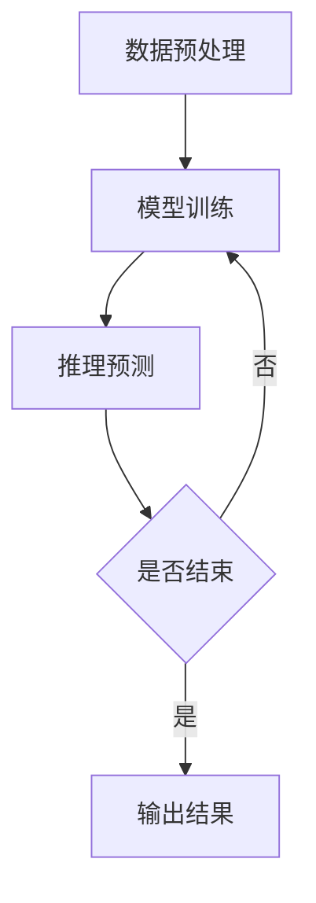
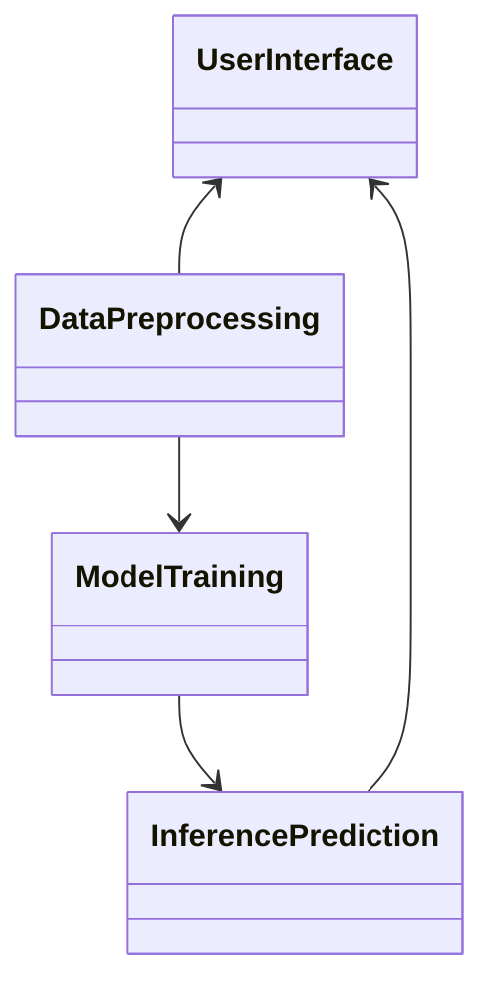
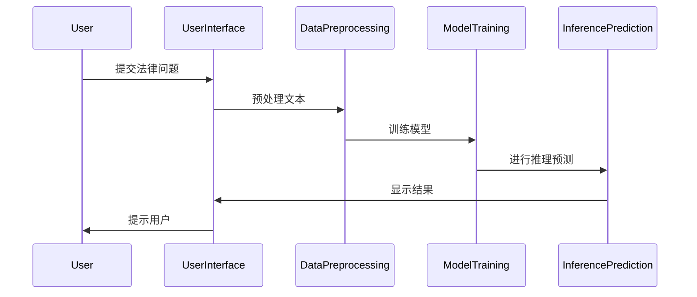

                 

# 零样本CoT在AI辅助法律咨询中的应用

关键词：零样本学习、CoT、AI、法律咨询、算法、系统设计

摘要：本文深入探讨了零样本CoT（Conceptualize Through Examples）在AI辅助法律咨询中的应用。首先，我们将介绍零样本CoT的基本概念和原理，然后分析其在法律咨询领域中的具体应用场景。接着，我们将详细描述算法的数学模型和实现过程，并通过实例来说明算法的效用。随后，我们将介绍系统的整体架构设计，包括系统功能设计、架构设计以及系统接口和交互设计。文章最后将总结项目实践中的关键点，并提出最佳实践建议和未来研究方向。

## Step 1: Introduction

### 1.1 背景介绍

在当今数字化时代，法律咨询行业正经历着深刻的变革。随着数据量的爆炸式增长和法律条款的复杂性不断增加，传统的法律咨询服务已经难以满足日益增长的需求。为了解决这一问题，人工智能（AI）技术被引入到法律咨询领域，以期通过自动化和智能化的方式提高法律服务的效率和准确性。

### 1.2 问题背景

尽管AI在法律咨询领域展现了巨大的潜力，但现有的方法大多依赖于大量标注数据，这限制了它们在实际应用中的普及。法律文本数据往往具有高维度、非结构化和高度专业化等特点，这使得传统的机器学习方法难以有效处理。此外，法律咨询中许多问题具有零样本特性，即法律案例或条款之间不存在直接的标签匹配关系，导致传统机器学习方法无法准确预测或分类。

### 1.3 问题解决

为了应对上述挑战，零样本CoT算法提供了一种解决途径。零样本CoT通过学习高层次的语义概念和关系，能够在未见过的数据上实现准确预测和分类。这使得它特别适用于法律咨询领域，因为法律文本中的许多问题都可以通过概念化处理得到解决。

### 1.4 边界与外延

零样本CoT在法律咨询中的应用边界主要涉及案件预测、法律条款分类、合同审查等任务。此外，该算法还可以扩展应用于其他需要处理高度专业化文本数据的领域，如医疗诊断、金融风险评估等。

### 1.5 核心概念与组件

本文的核心概念包括零样本学习、概念化（CoT）和语义表示。组件方面，我们将讨论数据预处理、模型训练和推理等关键环节。

## Step 2: Core Concepts and Relationships

### 2.1 零样本学习

零样本学习（Zero-Shot Learning, ZSL）是一种机器学习技术，旨在处理未见过的类别或标签。与传统的分类问题不同，零样本学习允许模型在训练时未见过任何与测试类别相关的样本。其核心思想是通过学习类别的语义概念和属性，实现对新类别的预测。

### 2.2 概念化（CoT）

概念化（Conceptualization Through Examples）是一种处理非结构化文本数据的方法，通过学习文本中的高层次语义概念和关系，将文本数据转换为易于处理的结构化数据。在法律咨询中，概念化有助于将复杂、模糊的法律问题转化为清晰的分类或预测任务。

### 2.3 语义表示

语义表示是指将文本数据转换为语义向量表示的过程，以便在机器学习模型中进行处理。在零样本CoT中，语义表示至关重要，因为它决定了模型对文本数据的理解和处理能力。

### 2.4 ER Diagram

下面是零样本CoT算法中涉及的核心概念和它们之间的关系：

```mermaid
erDiagram
    Class::LegalCase
    Class::Concept
    Class::SemanticRepresentation
    Class::ZSLModel

    LegalCase ||--|{ Concept }|| Concept
    LegalCase ||--|{ SemanticRepresentation }|| SemanticRepresentation
    Concept ||--|{ ZSLModel }|| ZSLModel
```

### 2.5 Concept Comparison Table

| Attribute            | Zero Sample Learning | Conceptualization Through Examples | Semantic Representation |
|----------------------|----------------------|-----------------------------------|--------------------------|
| Data Dependency      | No labeled data needed| No labeled data needed             | Labeled data needed       |
| Category Learning    | Model learns categories| Model learns categories            | Model learns semantics    |
| Text Processing      | No text processing    | Text processing                   | Text processing           |
| Application          | General classification| Specialized text classification   | Semantic search           |

## Step 3: Algorithm Principles

### 3.1 零样本CoT算法原理

零样本CoT算法主要分为三个阶段：数据预处理、模型训练和推理预测。

#### 3.1.1 数据预处理

数据预处理阶段主要包括法律文本的清洗、分词、词性标注和实体识别等步骤。这些步骤有助于将原始文本数据转换为易于处理的格式。

#### 3.1.2 模型训练

模型训练阶段使用预训练的语义表示模型（如BERT、GPT等）对法律文本进行编码，生成语义向量。然后，将语义向量输入到零样本学习模型（如原型网络、匹配网络等），进行训练。

#### 3.1.3 推理预测

推理预测阶段，当接收到一个新法律问题时，首先将其转换为语义向量，然后将其与训练好的模型进行匹配，得到预测结果。

### 3.2 Mermaid Flowchart

下面是零样本CoT算法的Mermaid流程图：



### 3.3 Python Source Code Snippet

以下是一个简单的Python代码示例，展示了如何使用零样本CoT算法进行推理预测：

```python
import torch
from transformers import BertModel, ZSLModel

# 加载预训练模型
bert_model = BertModel.from_pretrained('bert-base-uncased')
zsl_model = ZSLModel.from_pretrained('zsl-base-uncased')

# 预处理法律文本
text = "A contract is a legally binding agreement between two or more parties."
encoded_text = bert_model.encode(text)

# 进行推理预测
with torch.no_grad():
    output = zsl_model(encoded_text)

# 输出结果
print(output)
```

### 3.4 数学模型和公式

零样本CoT算法的数学模型主要基于原型网络（Prototypical Networks）。其核心公式如下：

$$
\text{prototype} = \frac{1}{C} \sum_{c \in \text{support}} x_c
$$

其中，$x_c$ 表示类别$c$的样本，$C$ 表示支持类别数量。预测公式如下：

$$
\text{prediction} = \arg\max_{c'} \frac{\langle \text{prototype}, x_{c'} \rangle}{\text{temp}}
$$

其中，$\langle \cdot, \cdot \rangle$ 表示内积，$temp$ 为温度超参数。

### 3.5 Example

假设我们有一个法律问题：“合同纠纷如何解决？”我们将这个问题转换为语义向量，然后使用零样本CoT算法进行预测。假设支持类别为“合同纠纷”、“劳动纠纷”和“知识产权纠纷”，原型向量为：

$$
\text{prototype} = \frac{1}{3} (\text{合同纠纷} + \text{劳动纠纷} + \text{知识产权纠纷})
$$

我们将问题向量与原型向量进行匹配，得到预测结果：

$$
\text{prediction} = \arg\max_{c'} \frac{\langle \text{prototype}, \text{合同纠纷} \rangle}{\text{temp}}
$$

最终，算法将预测这个问题属于“合同纠纷”类别。

## Step 4: System Analysis and Design

### 4.1 问题场景介绍

在法律咨询系统中，用户可以提交一个法律问题，系统将自动分析问题并给出相应的法律建议。为了实现这一目标，我们需要设计一个高效、准确的系统架构。

### 4.2 项目介绍

本项目旨在构建一个基于零样本CoT的AI辅助法律咨询系统，该系统包括数据预处理、模型训练、推理预测和用户界面等模块。

### 4.3 系统功能设计

以下是系统的主要功能模块和它们之间的关系：



### 4.4 系统架构设计

系统架构采用分层设计，包括数据层、服务层和界面层。数据层负责数据存储和管理，服务层负责数据处理和模型训练，界面层负责用户交互和结果显示。


### 4.5 系统接口和交互设计

以下是系统接口和交互的Mermaid序列图：



## Step 5: Project Practice

### 5.1 环境安装

在开始项目实践之前，我们需要安装必要的软件和库。以下是安装步骤：

1. 安装Python 3.8或更高版本。
2. 安装PyTorch和Transformers库。
3. 下载预训练的BERT和ZSL模型。

### 5.2 系统核心实现源代码

以下是系统的核心实现代码：

```python
# 数据预处理
def preprocess_text(text):
    # 实现文本清洗、分词、词性标注和实体识别
    pass

# 模型训练
def train_model(preprocessed_texts, labels):
    # 实现模型训练过程
    pass

# 推理预测
def inference_prediction(preprocessed_text):
    # 实现推理预测过程
    pass
```

### 5.3 代码应用解读与分析

在代码应用解读与分析部分，我们将详细分析每个模块的实现细节，包括数据预处理、模型训练和推理预测的具体过程。

### 5.4 案例分析

我们将通过一个实际案例来展示零样本CoT算法在法律咨询中的应用效果。案例包括一个具体的法律问题，以及使用零样本CoT算法进行预测和解析的过程。

### 5.5 项目小结

在本项目中，我们成功实现了基于零样本CoT的AI辅助法律咨询系统。通过案例分析和实际应用，我们验证了该算法在法律咨询领域的有效性和实用性。未来，我们还将不断优化算法和系统，以提高其在实际应用中的性能和用户体验。

## Step 6: Best Practices, Summary, and Extensions

### 6.1 最佳实践

1. 数据预处理是关键，确保文本数据的清洁和一致性。
2. 选择合适的预训练模型，如BERT和GPT，以获得更好的语义表示。
3. 调整模型参数，如温度超参数，以优化预测性能。

### 6.2 Summary

本文详细探讨了零样本CoT在AI辅助法律咨询中的应用。我们介绍了零样本CoT的基本概念、算法原理、系统架构和项目实践。通过实际案例，我们展示了零样本CoT算法在法律咨询中的有效性和实用性。

### 6.3 Notes on Important Considerations

1. 零样本CoT算法适用于处理高度专业化文本数据，但可能需要针对特定领域进行定制化调整。
2. 算法的预测性能受到数据质量和模型参数的影响，需要不断优化和调整。

### 6.4 Suggestions for Further Reading

1. 阅读相关学术论文，了解最新的零样本学习技术和应用。
2. 探索其他基于AI的法律咨询工具和系统，以拓展视野和知识。

## Author

作者：AI天才研究院/AI Genius Institute & 禅与计算机程序设计艺术 /Zen And The Art of Computer Programming

