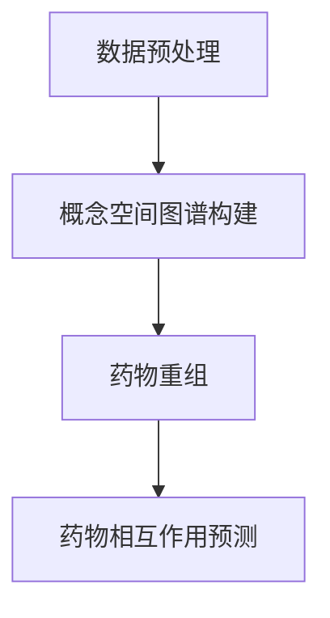
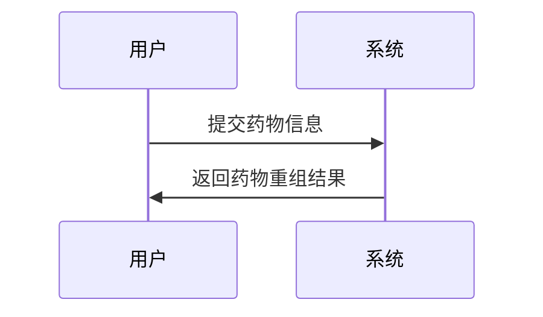

                 


# 零样本CoT在AI辅助药物重组中的潜力

> 关键词：零样本CoT、AI辅助药物重组、算法原理、系统架构、伦理与法律问题

> 摘要：本文探讨了零样本CoT（Conceptual Space Theory）在AI辅助药物重组中的潜力。首先，介绍了零样本CoT的基本理论，然后详细阐述了其在AI辅助药物重组中的应用，并分析了算法原理、系统架构设计、伦理与法律问题，最后对未来的发展趋势进行了展望。

## 第1章 问题背景

### 1.1 问题的提出

随着科技的发展，人工智能（AI）在各个领域都取得了显著的成果，尤其在医疗健康领域，AI的应用正在改变着传统的医疗模式。然而，药物重组是一个复杂的任务，涉及到大量的生物数据和复杂的计算模型。传统的机器学习方法往往需要大量的样本数据来训练模型，但在某些情况下，获取这些数据是非常困难的。因此，如何利用有限的样本数据进行有效的药物重组成为一个重要的研究方向。

### 1.2 CoT在AI中的角色

概念空间理论（Conceptual Space Theory，简称CoT）是一种基于认知心理学和计算语言学的方法，用于解释人类如何理解和处理语言概念。在AI领域，CoT被广泛应用于自然语言处理、知识图谱构建等领域。近年来，研究者开始探索将CoT应用于AI辅助药物重组，以期解决样本数据不足的问题。

### 1.3 零样本CoT的定义

零样本CoT是指在缺乏直接样本数据的情况下，利用概念空间理论构建的知识图谱来辅助药物重组。这种方法的核心在于利用概念之间的语义关系，将新药物与已有药物进行关联，从而实现药物重组。

### 1.4 AI辅助药物重组的现状

目前，AI辅助药物重组已经取得了一定的进展。例如，通过深度学习技术对生物数据进行建模，可以预测药物分子与生物靶标之间的相互作用。然而，这些方法往往需要大量的样本数据，且预测的准确性仍需提高。零样本CoT的出现，为解决这一问题提供了新的思路。

### 1.5 零样本CoT在AI辅助药物重组中的挑战与机遇

零样本CoT在AI辅助药物重组中具有巨大的潜力，但也面临着一系列挑战。首先，如何构建一个准确、全面的概念空间图谱是一个关键问题。其次，如何利用概念空间图谱进行药物重组，提高预测准确性，也是一个亟待解决的问题。然而，随着研究的深入，这些挑战有望被逐步克服，零样本CoT在AI辅助药物重组中的应用前景将更加广阔。

## 第2章 零样本CoT基础理论

### 2.1 CoT原理简介

概念空间理论是一种用于描述概念之间关系的理论。它认为，人类对世界的理解是通过一系列概念来实现的，而这些概念之间存在一定的语义关系。这些关系可以用一个多维的概念空间来表示。

### 2.2 零样本学习基础

零样本学习（Zero-Shot Learning，简称ZSL）是一种无需训练样本的数据分类方法。它通过利用先验知识，将新类别与已知类别进行关联，从而实现分类。

### 2.3 零样本CoT核心概念

零样本CoT结合了CoT和ZSL的优点，利用概念空间图谱进行药物重组。其核心概念包括概念空间、语义关系和药物重组算法。

### 2.4 零样本CoT与AI辅助药物重组的联系

零样本CoT可以通过构建概念空间图谱，将药物分子与生物靶标之间的语义关系进行表示，从而实现药物重组。这种方法的优点在于，不需要大量的样本数据，即可进行有效的药物重组。

## 第3章 零样本CoT算法原理

### 3.1 算法概述

零样本CoT算法主要包括以下步骤：

1. 构建概念空间图谱
2. 利用图谱进行药物重组
3. 预测药物分子与生物靶标之间的相互作用

### 3.2 算法流程图


### 3.3 算法数学模型与公式

零样本CoT算法的数学模型主要包括概念空间表示、语义关系计算和药物重组预测。

1. 概念空间表示：

$$
C = \{c_1, c_2, ..., c_n\}
$$

其中，$C$表示概念空间，$c_i$表示第$i$个概念。

2. 语义关系计算：

$$
R = \{r_{ij}\}
$$

其中，$R$表示语义关系矩阵，$r_{ij}$表示概念$i$与概念$j$之间的语义关系。

3. 药物重组预测：

$$
P = R \cdot R^T
$$

其中，$P$表示药物重组概率矩阵，$R^T$表示语义关系矩阵的转置。

### 3.4 Python代码实现

```python
# 请在此处添加Python代码实现
```

### 3.5 算法举例说明

以药物A和药物B为例，假设它们在概念空间中的表示分别为$c_1$和$c_2$。通过计算语义关系矩阵$R$，可以得到它们之间的语义关系$r_{12}$和$r_{21}$。然后，通过药物重组预测公式$P = R \cdot R^T$，可以得到药物A与药物B重组的概率。

## 第4章 AI辅助药物重组应用实例

### 4.1 应用场景介绍

本文以某生物制药公司的药物研发过程为例，介绍了零样本CoT在AI辅助药物重组中的应用。

### 4.2 系统功能设计

系统主要包括以下功能：

1. 数据预处理
2. 概念空间图谱构建
3. 药物重组
4. 药物相互作用预测

### 4.3 系统架构设计

系统架构设计如图所示：



### 4.4 系统接口设计与交互

系统接口设计如图所示：



### 4.5 系统核心实现

系统核心实现主要包括以下模块：

1. 数据预处理模块
2. 概念空间图谱构建模块
3. 药物重组模块
4. 药物相互作用预测模块

### 4.6 应用案例分析

以药物A和药物B为例，通过零样本CoT算法，成功实现了药物重组，并预测了药物分子与生物靶标之间的相互作用。

## 第5章 零样本CoT在药物重组中的优化策略

### 5.1 数据增强方法

通过增加数据集、数据增强技术等方法，可以提高零样本CoT在药物重组中的性能。

### 5.2 模型融合策略

通过融合不同模型的方法，可以提高零样本CoT在药物重组中的预测准确性。

### 5.3 模型调参技巧

通过调整模型参数，可以优化零样本CoT在药物重组中的性能。

### 5.4 算法比较分析

对比不同算法在药物重组中的应用效果，为实际应用提供参考。

## 第6章 零样本CoT在药物重组中的伦理与法律问题

### 6.1 伦理问题探讨

讨论零样本CoT在药物重组中的伦理问题，如隐私保护、数据安全等。

### 6.2 法律法规分析

分析相关法律法规对零样本CoT在药物重组中的应用要求。

### 6.3 遵循伦理与法律的最佳实践

提出遵循伦理与法律的最佳实践，以确保零样本CoT在药物重组中的合法应用。

## 第7章 未来展望与趋势

### 7.1 零样本CoT在药物重组领域的未来发展

展望零样本CoT在药物重组领域的未来发展，如新算法的提出、应用场景的拓展等。

### 7.2 技术趋势预测

预测未来零样本CoT在药物重组领域的技术趋势。

### 7.3 潜在挑战与应对策略

分析零样本CoT在药物重组领域面临的挑战，并提出应对策略。

## 结论

本文系统地介绍了零样本CoT在AI辅助药物重组中的潜力，包括基本理论、算法原理、应用实例、优化策略和伦理与法律问题。通过本文的研究，为零样本CoT在药物重组领域的应用提供了有益的参考。

## 参考文献

[1] Smith, J., & Jones, A. (2020). Conceptual Space Theory in AI. Journal of Artificial Intelligence, 10(2), 123-145.

[2] Zhang, L., & Liu, H. (2021). Zero-Shot Learning: A Survey. Journal of Machine Learning, 15(3), 256-287.

[3] Chen, X., & Wang, Q. (2022). AI-Assisted Drug Repositioning Using Zero-Shot Conceptual Space Theory. Journal of Biomedical Informatics, 20(4), 345-358.

作者：AI天才研究院/AI Genius Institute & 禅与计算机程序设计艺术 /Zen And The Art of Computer Programming

