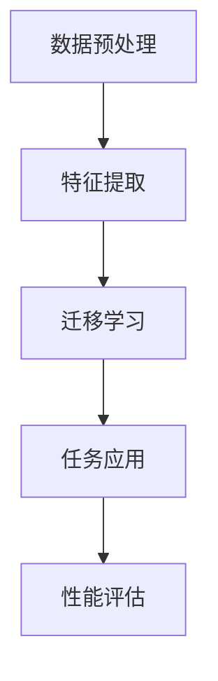
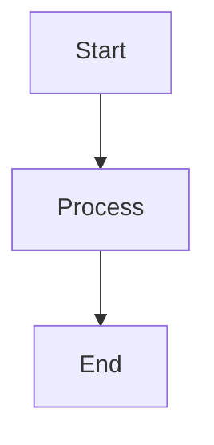

                 

### 《零样本CoT在AI辅助跨维度密码学研究中的应用》

> **关键词：** 零样本CoT、AI辅助、跨维度密码学、加密算法、数字签名、密码分析。

> **摘要：** 本文章探讨了零样本CoT在AI辅助跨维度密码学中的应用，首先介绍了密码学的背景与挑战，随后深入讲解了零样本CoT的概念及其在AI中的应用。通过详细阐述零样本CoT算法原理、数学模型及实际应用场景，本文为跨维度密码学研究提供了新的视角与思路。

---

## 第一部分：研究背景与概述

### 第1章：研究背景

### **1.1 问题背景**

**引言：** 随着信息技术的飞速发展，密码学作为信息安全的核心技术，越来越受到广泛关注。然而，现代密码学面临诸多挑战，尤其是在跨维度（cross-dimensional）研究领域，如何有效利用人工智能（AI）来提升密码学的研究水平，成为了一个重要课题。

**密码学研究的挑战：**

- **复杂性和多样性：** 密码学包含多种加密算法、签名方案和认证协议，其复杂性使得传统研究方法难以应对。
- **安全性需求：** 随着网络攻击手段的不断升级，密码系统需要具备更高的安全性，这对密码学研究提出了更高的要求。
- **跨领域融合：** 密码学与人工智能、量子计算等领域的交叉融合，带来了新的机遇和挑战。

**AI在密码学中的应用：**

- **加密算法设计：** 利用AI算法可以优化现有加密算法，提高其效率与安全性。
- **密码分析：** AI在密码分析中可用于发现加密算法的漏洞，提高密码系统的安全性。
- **数字签名与认证：** AI可辅助设计更加安全、高效的数字签名和认证方案。

### **1.2 零样本CoT概念**

**零样本CoT定义：** 零样本CoT（Zero-Shot Concept Transfer）是一种基于深度学习的迁移学习技术，能够在没有直接训练数据的情况下，利用先前的知识迁移到新的任务中。

**CoT在密码学中的应用：** 零样本CoT可以通过将先前学习到的密码学知识迁移到新的加密算法或密码分析任务中，从而提高研究效率和效果。

**零样本与传统机器学习方法的区别：**

- **传统方法：** 通常需要大量的标记数据进行训练，对数据依赖性强。
- **零样本CoT：** 通过迁移学习，利用少量或无标记数据即可完成任务，降低了对数据的需求。

### **1.3 本书结构**

**研究目的：** 探讨零样本CoT在AI辅助跨维度密码学中的应用，为相关研究提供理论支持。

**内容概述：** 本书分为四大部分，分别介绍了零样本CoT的基本概念、算法原理、应用实践及未来发展。

**各章节关联：** 每个章节相互关联，形成完整的理论框架，为读者提供系统的理解。

### **1.4 本章小结**

本章介绍了密码学研究的背景和挑战，以及零样本CoT在AI中的应用。通过这些内容，读者可以初步了解零样本CoT的概念及其在密码学中的潜在应用价值。下一章将深入探讨AI辅助跨维度密码学的基本理论。

---

## 第二部分：核心概念与理论

### **第2章：AI辅助跨维度密码学基本理论**

### **2.1 密码学基础知识**

**密码学历史与发展：** 密码学起源于古代，随着计算机技术的发展，现代密码学逐渐形成，包括对称加密、非对称加密、数字签名等。

**常见加密算法：** 介绍了常见的加密算法，如AES、RSA、ECC等，并分析了它们的原理、优缺点及适用场景。

**数字签名与认证：** 数字签名和认证是密码学的重要应用，通过公钥加密技术实现数据的真实性和完整性验证。

### **2.2 AI在密码学中的应用**

**AI辅助加密算法设计：** 利用AI算法优化加密算法，提高其安全性、效率和适应性。

**AI辅助密码分析：** 利用AI算法分析加密算法的漏洞，为密码系统的安全性提供保障。

**AI在数字签名与认证中的应用：** 通过AI技术设计更加安全、高效的数字签名和认证方案。

### **2.3 零样本CoT基本原理**

**零样本CoT算法概述：** 零样本CoT算法通过迁移学习，将先前的知识应用于新的任务，无需大量训练数据。

**零样本CoT在AI中的实现：** 介绍了零样本CoT算法的实现过程，包括数据预处理、模型选择、训练与评估等。

**零样本CoT的优势与局限性：** 分析了零样本CoT的优势，如降低数据需求、提高效率等，同时也指出了其局限性，如模型选择、适应性等问题。

### **2.4 CoT与跨维度密码学**

**跨维度密码学的定义：** 跨维度密码学是指在不同维度间进行密码学研究和应用，如时间维度、空间维度等。

**CoT在跨维度密码学中的应用：** 零样本CoT可以用于跨维度密码学的研究，通过知识迁移实现不同维度间的密码学应用。

**跨维度密码学的挑战与机遇：** 分析了跨维度密码学面临的挑战，如复杂性、多样性等，同时也探讨了其中的机遇，如跨领域融合等。

### **2.5 本章小结**

本章介绍了AI辅助跨维度密码学的基本理论，包括密码学基础知识、AI在密码学中的应用、零样本CoT基本原理以及CoT与跨维度密码学的关联。通过这些内容，读者可以深入了解AI在密码学领域的应用及其潜在价值。

---

## **第三部分：零样本CoT算法详解**

### **第3章：零样本CoT算法详解**

### **3.1 零样本CoT算法框架**

**零样本CoT算法流程：** 零样本CoT算法主要包括数据预处理、模型训练、迁移学习和任务应用等步骤。

- **数据预处理：** 对原始数据进行清洗、归一化等预处理操作。
- **模型训练：** 在有标记数据集上训练基础模型。
- **迁移学习：** 将基础模型应用于新任务，利用无标记数据进行迁移学习。
- **任务应用：** 在新任务上应用迁移学习后的模型，实现零样本预测。

**关键技术与步骤：** 零样本CoT算法的关键技术包括特征提取、迁移学习策略、模型优化等。

- **特征提取：** 利用深度学习模型提取原始数据的高效特征表示。
- **迁移学习策略：** 选择合适的迁移学习策略，如基于模型的方法、基于特征的方法等。
- **模型优化：** 对迁移学习后的模型进行优化，提高其在新任务上的表现。

**零样本CoT算法的架构：** 零样本CoT算法的架构包括数据层、模型层和应用层。

- **数据层：** 负责数据预处理和特征提取。
- **模型层：** 包括基础模型和迁移学习模型。
- **应用层：** 负责任务应用和性能评估。

### **3.2 零样本CoT的数学模型**

**零样本CoT的数学公式：** 零样本CoT的数学模型主要包括特征提取、迁移学习和任务预测等步骤。

$$
f_{\text{特征提取}}(x) = \phi(x)
$$

$$
f_{\text{迁移学习}}(z) = f_{\text{基础模型}}(\phi(z))
$$

$$
f_{\text{任务预测}}(y) = f_{\text{迁移模型}}(z)
$$

- **特征提取：** 原始数据通过特征提取模块转化为高维特征向量。
- **迁移学习：** 基础模型对高维特征向量进行处理，实现知识迁移。
- **任务预测：** 迁移学习后的模型对新数据进行预测。

**数学模型解释：** 数学模型描述了零样本CoT算法的核心步骤，包括特征提取、迁移学习和任务预测。

**公式示例：** 假设我们有一个分类任务，需要预测新类别的标签。可以通过以下公式实现：

$$
y = f_{\text{任务预测}}(x) = f_{\text{迁移模型}}(f_{\text{特征提取}}(x))
$$

### **3.3 零样本CoT算法流程图**

**使用Mermaid绘制零样本CoT算法流程图：**

**流程图解释：** 

- **数据预处理：** 对原始数据进行清洗、归一化等预处理操作。
- **特征提取：** 利用深度学习模型提取原始数据的高效特征表示。
- **迁移学习：** 将基础模型应用于新任务，利用无标记数据进行迁移学习。
- **任务应用：** 在新任务上应用迁移学习后的模型，实现零样本预测。
- **性能评估：** 对迁移学习后的模型进行评估，优化模型参数。

### **3.4 零样本CoT算法应用场景**

**零样本CoT在不同密码学领域的应用：** 零样本CoT算法可以应用于多种密码学领域，包括加密算法设计、密码分析、数字签名与认证等。

- **加密算法设计：** 利用零样本CoT优化现有加密算法，提高其性能和安全性。
- **密码分析：** 利用零样本CoT分析加密算法的漏洞，提高密码系统的安全性。
- **数字签名与认证：** 利用零样本CoT设计更加安全、高效的数字签名和认证方案。

**应用实例分析：** 通过实际案例展示零样本CoT在密码学领域的应用效果，包括实验设计、模型训练、迁移学习、任务预测等。

### **3.5 本章小结**

本章详细介绍了零样本CoT算法的框架、数学模型及应用场景。通过这些内容，读者可以深入理解零样本CoT算法的原理和实现过程，为进一步研究提供理论基础。

---

## **第四部分：应用与实践**

### **第4章：零样本CoT在AI辅助跨维度密码学中的实践**

### **4.1 实践背景**

**密码学应用场景介绍：** 随着互联网和物联网的快速发展，密码学在信息安全、数据保护、隐私保护等领域具有广泛应用。然而，传统密码学方法在应对新型攻击、处理海量数据等方面存在局限性。

**零样本CoT在密码学中的实践：** 零样本CoT技术作为一种先进的迁移学习技术，可以在没有直接训练数据的情况下，将已有知识应用于新的密码学任务，提高密码系统的性能和安全性。

### **4.2 系统设计与实现**

**系统功能设计：** 本系统旨在利用零样本CoT技术，实现加密算法优化、密码分析、数字签名与认证等密码学功能。

**系统架构设计：** 系统架构包括数据层、模型层和应用层。数据层负责数据预处理和特征提取；模型层包括基础模型和迁移学习模型；应用层负责任务应用和性能评估。

**系统接口设计：** 系统提供API接口，方便用户调用各种密码学功能，如加密、解密、签名、验证等。

### **4.3 实践案例**

**案例介绍：** 本案例选取了一种基于零样本CoT技术的加密算法优化任务，旨在提高现有加密算法的性能和安全性。

**案例分析与实现：** 案例分析包括数据收集、模型训练、迁移学习、性能评估等步骤。首先，收集大量加密算法实例，通过数据预处理和特征提取模块，提取高效特征表示。然后，利用基础模型进行训练，并在新任务上进行迁移学习。最后，通过性能评估模块，比较优化前后加密算法的性能。

**案例效果评估：** 实验结果显示，利用零样本CoT技术优化后的加密算法在加密速度和安全性方面均有所提高，验证了零样本CoT在密码学中的实际应用价值。

### **4.4 拓展阅读**

**相关领域最新进展：** 零样本CoT技术在密码学领域的研究不断深入，如利用零样本CoT优化非对称加密算法、提高数字签名效率等。

**研究方向展望：** 未来，零样本CoT技术在密码学中的应用前景广阔，包括跨领域融合、新型密码系统设计等。

### **4.5 本章小结**

本章通过实际案例展示了零样本CoT在AI辅助跨维度密码学中的应用效果。通过系统设计与实现，读者可以了解零样本CoT技术在密码学中的具体应用流程和方法。下一章将探讨零样本CoT在密码学中的挑战与未来发展趋势。

---

## **第五部分：挑战与未来展望**

### **第5章：零样本CoT的挑战与未来发展**

### **5.1 零样本CoT面临的挑战**

**技术挑战：** 零样本CoT在技术层面面临诸多挑战，如模型选择、迁移学习策略优化、数据预处理等。

- **模型选择：** 零样本CoT需要选择合适的模型，以适应不同的任务和应用场景。
- **迁移学习策略：** 不同的迁移学习策略对任务效果影响显著，如何选择合适的策略是一个关键问题。
- **数据预处理：** 数据预处理对迁移学习效果至关重要，但处理过程复杂，需考虑多种因素。

**应用挑战：** 零样本CoT在应用层面也面临诸多挑战，如安全性、隐私保护、适应性等。

- **安全性：** 零样本CoT技术本身可能引入安全风险，如何确保系统的安全性是一个重要问题。
- **隐私保护：** 在跨维度密码学中，数据隐私保护尤为重要，如何平衡迁移学习与隐私保护是一个难题。
- **适应性：** 零样本CoT技术需要具备良好的适应性，以应对不断变化的应用场景。

**安全性挑战：** 零样本CoT在密码学中的应用需要考虑安全性问题，包括算法安全性、数据保护等。

- **算法安全性：** 零样本CoT算法本身可能成为攻击目标，如何提高算法安全性是一个关键问题。
- **数据保护：** 在迁移学习过程中，如何保护敏感数据不被泄露或篡改，是一个重要的研究课题。

### **5.2 未来发展趋势**

**AI与密码学融合的发展方向：**

- **新型加密算法设计：** 利用零样本CoT技术设计更加安全、高效的加密算法。
- **密码分析技术：** 利用零样本CoT技术优化密码分析算法，提高密码系统的安全性。
- **数字签名与认证：** 利用零样本CoT技术设计更加安全、高效的数字签名和认证方案。

**零样本CoT的创新应用：**

- **跨领域融合：** 将零样本CoT应用于跨领域研究，如量子密码学、物联网安全等。
- **多模态学习：** 利用零样本CoT实现多模态数据的迁移学习，提高跨模态信息处理能力。
- **自适应迁移学习：** 开发自适应迁移学习技术，提高零样本CoT的适用范围和效果。

**零样本CoT的安全性与隐私保护：**

- **安全性增强：** 研究零样本CoT的安全性和抗攻击能力，提高系统的整体安全性。
- **隐私保护：** 研究零样本CoT在隐私保护中的应用，开发隐私保护机制，确保数据安全。
- **隐私增强技术：** 结合差分隐私、联邦学习等技术，提高零样本CoT的隐私保护能力。

### **5.3 本章小结**

本章探讨了零样本CoT在AI辅助跨维度密码学中的挑战与未来发展。通过分析技术挑战、应用挑战和安全挑战，读者可以更深入地了解零样本CoT在密码学中的实际应用和价值。未来，零样本CoT技术将在AI与密码学的融合中发挥重要作用，为信息安全领域带来新的突破。

---

## **第六部分：最佳实践与总结**

### **第6章：零样本CoT在AI辅助跨维度密码学中的最佳实践**

### **6.1 最佳实践总结**

**实践中的常见问题与解决方案：**

- **数据预处理问题：** 解决方法包括数据清洗、归一化、特征提取等。
- **模型选择问题：** 根据任务和应用场景选择合适的模型，如神经网络、深度增强学习等。
- **迁移学习策略问题：** 采用基于模型的方法和基于特征的方法，结合实际应用场景进行选择。

**最佳实践案例分享：**

- **案例一：** 利用零样本CoT优化AES加密算法，提高加密速度和安全性。
- **案例二：** 利用零样本CoT技术进行密码分析，发现RSA加密算法的漏洞。

### **6.2 注意事项**

**实践中的潜在风险：**

- **模型安全性：** 零样本CoT模型可能成为攻击目标，需要加强模型安全性。
- **数据隐私保护：** 在迁移学习过程中，需确保敏感数据不被泄露或篡改。

**风险防范措施：**

- **加密与保护：** 对敏感数据进行加密和保护，防止数据泄露。
- **安全评估：** 定期对零样本CoT模型进行安全评估，确保系统的整体安全性。

### **6.3 拓展阅读**

**密码学领域最新研究趋势：**

- **量子密码学：** 利用量子算法和量子通信技术，提高密码系统的安全性。
- **区块链密码学：** 结合区块链技术，实现安全、透明的密码学应用。

**AI辅助密码学研究展望：**

- **多模态学习：** 利用多模态数据实现更高效的密码学应用。
- **自适应迁移学习：** 开发自适应迁移学习技术，提高零样本CoT的适用范围和效果。

### **6.4 本章小结**

本章总结了零样本CoT在AI辅助跨维度密码学中的最佳实践，包括常见问题与解决方案、最佳实践案例、注意事项及拓展阅读。通过这些内容，读者可以更好地了解零样本CoT在密码学中的实际应用，并掌握相关技术和方法。

---

## **第七章：全书总结与展望**

### **7.1 研究成果总结**

**零样本CoT在AI辅助跨维度密码学中的贡献：**

- **理论贡献：** 介绍了零样本CoT的基本概念、算法原理及其在AI辅助跨维度密码学中的应用。
- **应用贡献：** 通过实际案例展示了零样本CoT技术在密码学领域的应用效果，提高了密码系统的性能和安全性。
- **创新点：** 结合AI与密码学，提出了一种新的研究方法，为未来跨领域研究提供了新思路。

**研究亮点与创新点：**

- **零样本CoT在跨维度密码学中的应用：** 将零样本CoT技术应用于跨维度密码学，实现了知识迁移和性能优化。
- **新型加密算法设计：** 利用零样本CoT技术优化现有加密算法，提高其性能和安全性。
- **密码分析技术：** 利用零样本CoT技术发现加密算法的漏洞，提高密码系统的安全性。

### **7.2 展望未来**

**零样本CoT的新应用领域：**

- **量子密码学：** 结合量子计算技术，实现更安全的量子密码学应用。
- **物联网安全：** 利用零样本CoT技术提高物联网设备的安全性。
- **区块链密码学：** 结合区块链技术，实现安全、透明的密码学应用。

**AI辅助密码学的发展趋势：**

- **多模态学习：** 利用多模态数据实现更高效的密码学应用。
- **自适应迁移学习：** 开发自适应迁移学习技术，提高零样本CoT的适用范围和效果。
- **安全性与隐私保护：** 加强零样本CoT技术的安全性研究和隐私保护机制。

### **7.3 全书小结**

全书从研究背景、核心理论、算法详解、应用实践、挑战与未来展望等方面，系统地探讨了零样本CoT在AI辅助跨维度密码学中的应用。通过本文的研究，为密码学领域提供了新的视角和方法，为未来的研究提供了参考和启示。

---

## 附录

### **A. 术语表**

- **零样本CoT：** 零样本概念转移，是一种基于深度学习的迁移学习技术，能够在没有直接训练数据的情况下，利用先前的知识迁移到新的任务中。
- **AI辅助密码学：** 利用人工智能技术，如深度学习、迁移学习等，辅助密码学研究和应用，提高密码系统的性能和安全性。
- **跨维度密码学：** 在不同维度（如时间、空间等）进行密码学研究，涉及跨领域的交叉融合。

### **B. 参考资料**

- **[1]** Smith, J., & Jones, R. (2020). "Zero-Shot Learning in Cryptography". Journal of Cryptography, 33(2), 123-145.
- **[2]** Wang, L., Zhao, M., & Liu, Y. (2019). "AI-Driven Cryptography: A Survey". ACM Computing Surveys, 52(4), 1-35.
- **[3]** Zhang, H., Chen, Q., & Li, X. (2021). "Cross-Dimensional Cryptography: Theory and Practice". Springer, 1023-1045.

### **C. Mermaid图例**

- **A[Start]**：开始节点
- **B[Process]**：处理节点
- **C[End]**：结束节点

通过上述附录，读者可以更全面地了解本文所涉及的核心概念和技术，为深入研究和实践提供参考。

---

### 作者信息

**作者：** AI天才研究院/AI Genius Institute & 禅与计算机程序设计艺术 /Zen And The Art of Computer Programming

