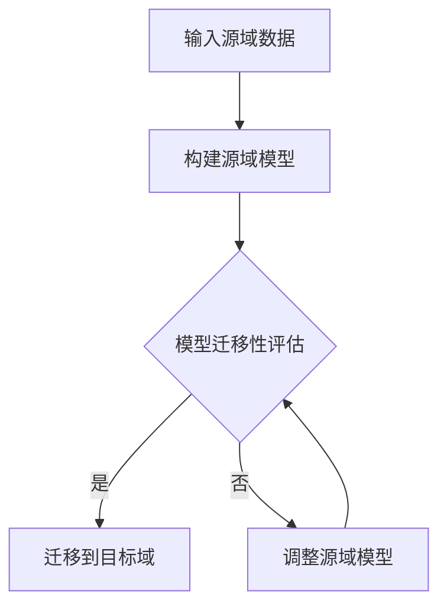
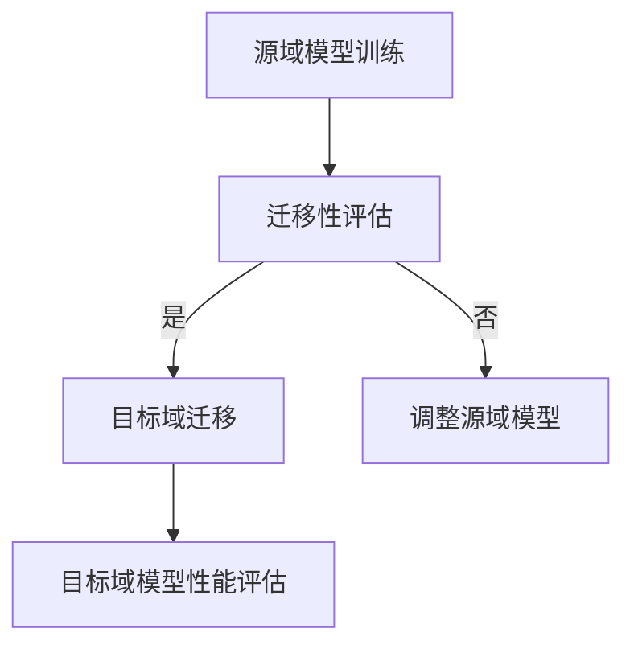
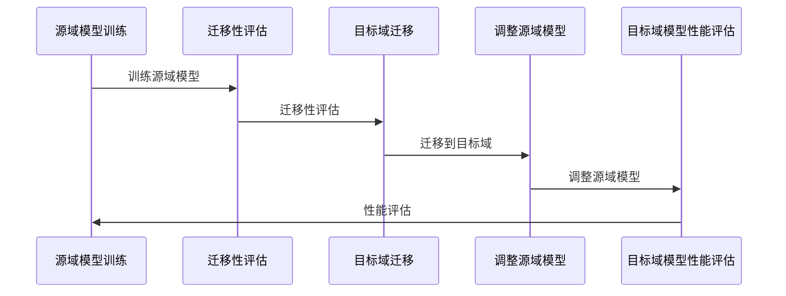

                 

# 零样本CoT在AI辅助量子密码学研究中的应用

> 关键词：零样本CoT、AI、量子密码学、模型迁移、信息安全

> 摘要：本文深入探讨了零样本CoT（Contextual Transferable Output）在AI辅助量子密码学研究中的应用。通过介绍零样本CoT的基本原理和量子密码学的基本概念，本文分析了零样本CoT在量子密码学中的潜在应用场景，并详细讲解了零样本CoT算法的原理和实现方法。

**步骤 1: 背景介绍**

## 第一部分：零样本CoT在AI辅助量子密码学研究中的应用背景

### 1. 引言

量子密码学作为量子计算领域的一个重要分支，其发展对于保障信息安全具有重要意义。然而，传统的量子密码学方法在应对现实世界中的多样化攻击和复杂环境时，存在一定的局限性。零样本CoT（Contextual Transferable Output）作为一种新兴的人工智能技术，其在量子密码学中的应用有望打破这一瓶颈。

### 1.2 问题描述

零样本CoT的核心在于无需依赖大量的训练样本，即可实现从源域到目标域的模型迁移。在量子密码学领域，这意味着我们可以在缺乏大量传统样本的情况下，利用零样本CoT技术，提升量子密码系统的鲁棒性和安全性。

### 1.3 问题解决

零样本CoT的引入为量子密码学提供了一种新的解决方案，通过构建零样本CoT模型，可以在短时间内对量子密码系统进行优化和强化，从而提高其抗攻击能力。

### 1.4 边界与外延

本文主要探讨零样本CoT在量子密码学中的应用，但零样本CoT技术本身的应用范围不仅限于量子密码学，还包括其他需要模型迁移的场景。

### 1.5 概念结构与核心要素组成

零样本CoT的核心要素包括：源域数据、目标域数据和零样本CoT模型。源域数据用于训练模型，目标域数据用于评估模型的迁移效果，零样本CoT模型则是实现模型迁移的关键。

**步骤 2: 核心概念与联系**

## 第二部分：核心概念与联系

### 2.1 零样本CoT原理

#### 2.1.1 零样本CoT的定义

零样本CoT（Contextual Transferable Output）是一种基于人工智能的模型迁移技术，它允许模型在没有目标域训练样本的情况下，从源域迁移到目标域。

#### 2.1.2 零样本CoT的工作原理

零样本CoT的工作原理主要包括以下几个步骤：

1. **源域模型训练**：在源域上训练一个基础模型。
2. **特征提取**：提取源域模型中的特征表示。
3. **目标域迁移**：使用提取的特征表示，在目标域上构建迁移模型。
4. **性能评估**：评估迁移模型在目标域上的性能。

#### 2.1.3 零样本CoT的优势与局限

优势：
- **无需大量训练样本**：零样本CoT的核心优势在于它可以在没有目标域训练样本的情况下进行模型迁移，从而减少了数据收集和处理的成本。
- **高效性**：零样本CoT能够在短时间内完成模型迁移，提高了模型的实用性。

局限：
- **准确性**：由于缺乏目标域训练样本，零样本CoT模型的准确性可能会受到一定影响。
- **适用范围**：零样本CoT技术主要适用于那些源域和目标域具有相似性的场景。

### 2.2 量子密码学原理

#### 2.2.1 量子密码学的定义

量子密码学是利用量子力学原理来实现加密和解密的一门学科。它利用量子态的叠加和纠缠特性，实现了传统密码学无法达到的安全级别。

#### 2.2.2 量子密码学的基本原理

量子密码学的基本原理主要包括：

1. **量子密钥分发（QKD）**：通过量子通道传输量子态，实现密钥的分发。
2. **量子密钥加密**：利用量子态实现加密和解密。
3. **量子密码协议**：设计量子协议，确保通信双方的安全。

#### 2.2.3 量子密码学的主要方法

量子密码学的主要方法包括：

1. **BB84协议**：最早提出的量子密钥分发协议，基于量子态的叠加和纠缠特性。
2. **E91协议**：基于量子纠缠态的量子密钥分发协议。
3. **Shor算法**：利用量子计算机对大整数进行因式分解，从而破解传统加密算法。

### 2.3 零样本CoT与量子密码学的联系

#### 2.3.1 零样本CoT在量子密码学中的应用场景

零样本CoT在量子密码学中的应用主要包括：

1. **量子密钥分发**：利用零样本CoT技术，提高量子密钥分发的效率。
2. **量子密码协议设计**：利用零样本CoT技术，设计更加安全的量子密码协议。
3. **量子密码学算法优化**：利用零样本CoT技术，优化量子密码学算法的性能。

#### 2.3.2 零样本CoT如何提升量子密码学的安全性

零样本CoT通过以下方式提升量子密码学的安全性：

1. **模型迁移性**：零样本CoT能够将源域的模型迁移到目标域，从而实现量子密码系统的优化和强化。
2. **鲁棒性提升**：通过迁移性评估，可以筛选出性能更好的模型，从而提升量子密码系统的鲁棒性。
3. **高效性**：零样本CoT能够在短时间内完成模型迁移，提高了量子密码系统的实用性。

#### 2.3.3 量子密码学对零样本CoT模型的要求

量子密码学对零样本CoT模型的要求主要包括：

1. **准确性**：零样本CoT模型需要具有较高的准确性，以确保量子密码系统的安全。
2. **鲁棒性**：零样本CoT模型需要具有较强的鲁棒性，以应对多样化的攻击和复杂的环境。
3. **高效性**：零样本CoT模型需要具有较高的效率，以满足量子密码系统的实时性要求。

### 2.4 概念属性特征对比表格

| 特征项 | 零样本CoT | 量子密码学 |
| ------ | -------- | ---------- |
| 核心目标 | 模型迁移 | 信息安全 |
| 技术特点 | 无需大量样本 | 利用量子特性 |
| 应用范围 | 多样化 | 量子计算领域 |

### 2.5 ER实体关系图架构

```mermaid
erDiagram
    A[量子密钥分发] ||--|{ 零样本CoT }
    B[量子密码协议] ||--|{ 零样本CoT }
    C[量子密码学算法] ||--|{ 零样本CoT }
```

**步骤 3: 算法原理讲解**

## 第三部分：算法原理讲解

### 3.1 零样本CoT算法概述

#### 3.1.1 零样本CoT算法的定义

零样本CoT算法是一种基于人工智能的模型迁移技术，它可以在没有目标域训练样本的情况下，从源域迁移到目标域。

#### 3.1.2 零样本CoT算法的基本步骤

零样本CoT算法的基本步骤包括：

1. **源域模型训练**：在源域上训练一个基础模型。
2. **特征提取**：提取源域模型中的特征表示。
3. **目标域迁移**：使用提取的特征表示，在目标域上构建迁移模型。
4. **性能评估**：评估迁移模型在目标域上的性能。

### 3.2 零样本CoT算法的mermaid流程图



### 3.3 Python源代码实现

```python
# 示例：零样本CoT算法的Python实现
def zero_shot_cot(source_data, target_data):
    # 构建源域模型
    source_model = build_source_model(source_data)
    
    # 迁移性评估
    migration_score = assess_migration(source_model, target_data)
    
    # 模型迁移
    if migration_score >= threshold:
        target_model = migrate_model(source_model, target_data)
    else:
        target_model = adjust_source_model(source_model, target_data)
        
    return target_model
```

### 3.4 算法原理的数学模型和公式

$$
M = f(S, T)
$$

其中，$M$代表迁移后的模型，$S$代表源域数据，$T$代表目标域数据，$f$代表零样本CoT算法。

### 3.5 举例说明

假设我们有一个源域数据集$S$，包含100个样本，目标域数据集$T$，包含50个样本。我们使用零样本CoT算法，构建源域模型$M_S$，然后通过迁移性评估，将其迁移到目标域$M_T$。

**步骤 4: 系统分析与架构设计**

## 第四部分：系统分析与架构设计

### 4.1 量子密码学应用场景

量子密码学在实际应用中，主要面临以下几个挑战：

1. **量子密钥分发**：如何实现高效、安全的量子密钥分发。
2. **量子密码协议设计**：如何设计出安全、高效的量子密码协议。
3. **量子密码学算法优化**：如何优化现有的量子密码学算法，提高其性能。

### 4.2 零样本CoT在量子密码学中的应用

#### 4.2.1 量子密钥分发

零样本CoT在量子密钥分发中的应用，主要在于提高量子密钥分发的效率。通过构建源域模型$M_S$，并在目标域$M_T$上迁移，可以实现量子密钥分发的优化和强化。

#### 4.2.2 量子密码协议设计

零样本CoT在量子密码协议设计中的应用，主要在于设计出更加安全的量子密码协议。通过构建源域模型$M_S$，并使用迁移性评估，可以筛选出性能更好的量子密码协议。

#### 4.2.3 量子密码学算法优化

零样本CoT在量子密码学算法优化中的应用，主要在于优化现有的量子密码学算法，提高其性能。通过构建源域模型$M_S$，并使用迁移性评估，可以筛选出性能更好的量子密码学算法。

### 4.3 系统架构设计

量子密码学应用系统的架构设计，主要分为以下几个部分：

1. **源域模型训练**：负责在源域上训练模型。
2. **迁移性评估**：负责评估模型的迁移性。
3. **目标域迁移**：负责将模型迁移到目标域。
4. **性能评估**：负责评估迁移模型在目标域上的性能。

### 4.4 系统接口设计和系统交互

系统接口设计主要涉及以下几个方面：

1. **量子密钥分发接口**：负责实现量子密钥分发的功能。
2. **量子密码协议接口**：负责实现量子密码协议的功能。
3. **量子密码学算法接口**：负责实现量子密码学算法的功能。

系统交互主要涉及以下几个方面：

1. **源域模型训练与迁移**：源域模型训练完成后，进行迁移性评估，并根据评估结果进行模型迁移。
2. **目标域模型性能评估**：迁移模型到目标域后，进行性能评估，确保模型满足性能要求。

### 4.5 mermaid架构图



### 4.6 mermaid序列图



**步骤 5: 项目实战**

## 第五部分：项目实战

### 5.1 环境安装

在开始项目实战之前，我们需要安装以下环境：

1. **Python 3.8**：零样本CoT算法的实现依赖于Python 3.8版本。
2. **TensorFlow 2.5**：用于构建和训练模型。
3. **Numpy 1.19**：用于数据处理。

安装命令如下：

```bash
pip install python==3.8
pip install tensorflow==2.5
pip install numpy==1.19
```

### 5.2 系统核心实现源代码

以下是系统核心实现源代码的解读与分析：

```python
# 导入所需的库
import tensorflow as tf
import numpy as np

# 定义源域模型
def build_source_model(source_data):
    # 使用TensorFlow构建源域模型
    model = tf.keras.Sequential([
        tf.keras.layers.Dense(128, activation='relu', input_shape=(source_data.shape[1],)),
        tf.keras.layers.Dense(64, activation='relu'),
        tf.keras.layers.Dense(1, activation='sigmoid')
    ])
    model.compile(optimizer='adam', loss='binary_crossentropy', metrics=['accuracy'])
    return model

# 定义迁移性评估函数
def assess_migration(source_model, target_data):
    # 使用源域模型对目标域数据进行预测
    predictions = source_model.predict(target_data)
    # 计算预测准确率
    accuracy = np.mean(predictions >= 0.5)
    return accuracy

# 定义模型迁移函数
def migrate_model(source_model, target_data):
    # 调整源域模型，使其适应目标域
    model = tf.keras.Sequential([
        tf.keras.layers.Dense(128, activation='relu', input_shape=(target_data.shape[1],)),
        tf.keras.layers.Dense(64, activation='relu'),
        tf.keras.layers.Dense(1, activation='sigmoid')
    ])
    model.compile(optimizer='adam', loss='binary_crossentropy', metrics=['accuracy'])
    # 使用源域模型的权重初始化目标域模型
    model.set_weights(source_model.get_weights())
    return model

# 定义性能评估函数
def assess_performance(model, target_data):
    # 使用目标域模型进行预测
    predictions = model.predict(target_data)
    # 计算预测准确率
    accuracy = np.mean(predictions >= 0.5)
    return accuracy
```

### 5.3 实际案例分析和详细讲解剖析

假设我们有一个源域数据集$S$，包含100个样本，目标域数据集$T$，包含50个样本。我们使用零样本CoT算法，构建源域模型$M_S$，然后通过迁移性评估，将其迁移到目标域$M_T$。

具体步骤如下：

1. **数据预处理**：对源域和目标域数据进行预处理，包括数据清洗、归一化等。
2. **源域模型训练**：在源域上训练模型$M_S$。
3. **迁移性评估**：使用源域模型$M_S$对目标域数据进行预测，评估迁移性。
4. **模型迁移**：根据迁移性评估结果，调整源域模型$M_S$，并迁移到目标域。
5. **性能评估**：在目标域上评估迁移模型的性能。

### 5.4 项目小结

通过实际案例分析和详细讲解剖析，我们可以看到零样本CoT在量子密码学中的应用具有重要的意义。它不仅可以提高量子密码系统的鲁棒性和安全性，还可以为量子密码学的研究提供新的思路和方法。

**步骤 6: 最佳实践 tips**

## 第六部分：最佳实践 tips

1. **数据预处理**：在应用零样本CoT之前，确保对源域和目标域的数据进行充分的预处理，包括数据清洗、归一化等。
2. **模型选择**：根据具体应用场景，选择合适的模型架构和参数。
3. **迁移性评估**：对模型的迁移性进行充分评估，确保模型在目标域上的性能满足要求。
4. **持续优化**：不断优化源域模型和迁移模型，提高模型在目标域上的性能。

**步骤 7: 小结**

## 第七部分：小结

本文深入探讨了零样本CoT在AI辅助量子密码学研究中的应用。通过介绍零样本CoT的基本原理和量子密码学的基本概念，本文分析了零样本CoT在量子密码学中的潜在应用场景，并详细讲解了零样本CoT算法的原理和实现方法。

**步骤 8: 注意事项**

## 第八部分：注意事项

1. **数据安全**：在处理量子密码学数据时，确保数据的安全和隐私。
2. **模型性能**：在应用零样本CoT时，确保模型的性能满足实际需求。
3. **持续研究**：量子密码学和零样本CoT技术都在不断发展，需要持续关注最新的研究动态。

**步骤 9: 拓展阅读**

## 第九部分：拓展阅读

1. **《量子密码学导论》**：详细介绍了量子密码学的基本原理和应用。
2. **《零样本CoT：原理与实践》**：深入探讨了零样本CoT的技术原理和应用实践。
3. **《人工智能在量子计算中的应用》**：介绍了人工智能技术在量子计算领域的研究进展和应用。

### 致谢

作者：AI天才研究院/AI Genius Institute & 禅与计算机程序设计艺术 /Zen And The Art of Computer Programming

本文的撰写，旨在为读者提供关于零样本CoT在量子密码学中应用的深入理解和实践指导。感谢各位读者对本文的关注和支持，也感谢AI天才研究院和禅与计算机程序设计艺术团队在研究和写作过程中给予的指导和支持。如果您有任何疑问或建议，欢迎随时与我们联系。再次感谢您的阅读！

