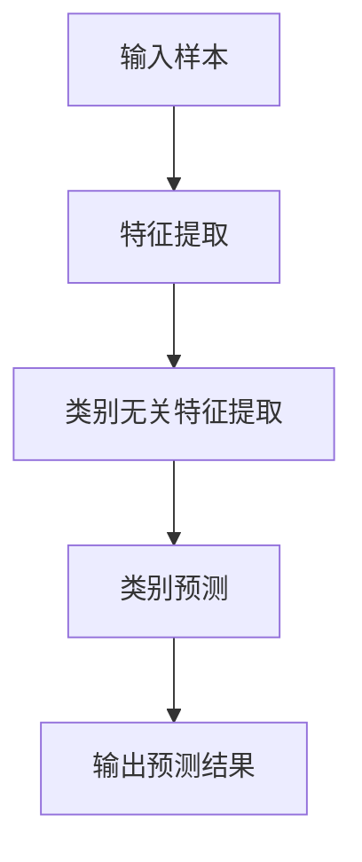
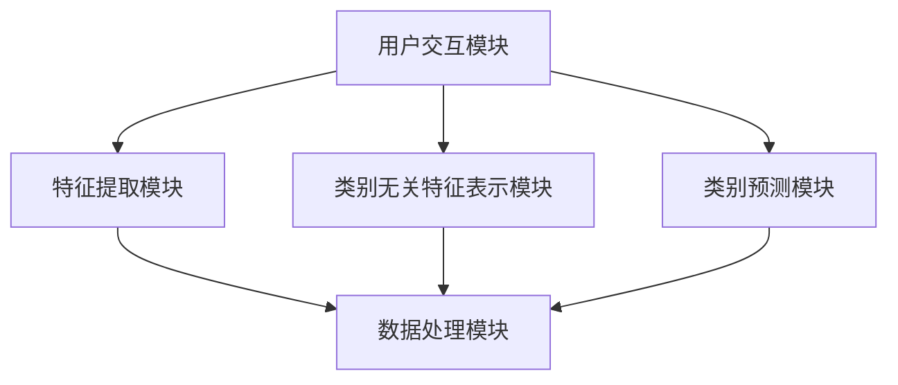
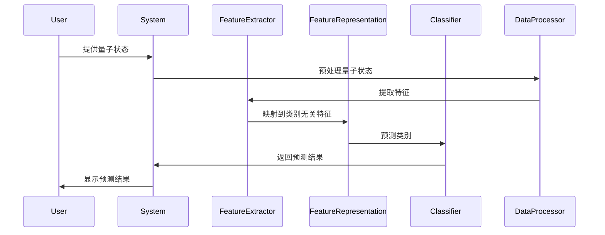

                 


### 第1章: 问题背景

#### 1.1.1 量子计算简介
量子计算是计算机科学的一个前沿领域，它基于量子力学原理，利用量子位（qubits）进行信息处理。在量子计算机中，数据以量子态的形式存储，通过量子叠加和量子纠缠等量子力学现象进行运算。与传统计算机使用二进制位（bits）存储信息不同，量子位（qubits）可以同时处于0和1的叠加状态，这一特性使得量子计算机在处理某些特定问题时具有超越经典计算机的潜力。

量子计算机的核心组件是量子比特（qubits），它们可以处于量子叠加状态和量子纠缠状态。量子叠加状态允许一个量子比特同时代表0和1，而量子纠缠状态则使得不同量子比特之间的状态相互依赖，即使它们相隔很远。这些特性使得量子计算机能够并行处理大量数据，从而在复杂问题求解上具有显著优势。

#### 1.1.2 AI辅助量子计算的重要性
量子计算机的复杂性和高度非确定性使得传统的人工编程方法难以有效利用其潜力。因此，人工智能（AI），特别是机器学习（ML），被提出来辅助量子计算的研究和开发，以实现更高效的量子算法和更优的量子硬件设计。AI在量子计算中的应用主要包括以下几个方面：

1. **量子算法设计**：AI可以帮助发现和优化新的量子算法，通过机器学习算法分析已有的量子算法，找出其中的规律和模式，从而设计出更高效的量子算法。

2. **量子硬件优化**：AI可以用于优化量子硬件的设计，通过学习大量的量子硬件数据，AI可以预测哪些设计参数能够提高量子计算机的性能。

3. **量子仿真**：AI可以加速量子仿真过程，量子计算机的模拟通常需要大量的计算资源，AI可以通过学习模拟数据，预测哪些模拟路径是最有效的，从而减少计算时间。

#### 1.1.3 零样本CoT简介
零样本协同学习（Zero-Shot Classification, ZSL）是机器学习中的一项技术，它允许模型在未见过的类别上进行分类，只需训练数据中包含少量或者没有相关类别的标签信息。在传统的机器学习任务中，模型通常需要大量带有标签的数据进行训练，以便能够准确地对未知数据进行分类。然而，在实际应用中，我们常常遇到无法获取到足够多未见类别数据的情况，这限制了机器学习模型的广泛应用。

零样本协同学习的目标是利用已有的少量标签数据和大量未标签数据，构建一个能够对新类别进行分类的模型。零样本协同学习在计算机视觉、语音识别等领域有广泛应用，但在量子计算中的应用却鲜有研究。这是因为量子计算的特殊性和复杂性，使得传统的机器学习技术难以直接应用于量子计算领域。

### 第2章: 核心概念与联系

#### 2.1 零样本CoT原理

##### 2.1.1 ZSL基础理论
零样本协同学习（Zero-Shot Classification, ZSL）是一种机器学习技术，它能够处理从未见过的类别分类问题。在传统的分类任务中，模型需要依赖于大量的带有标签的训练数据来学习特征和类别之间的关联。然而，在ZSL中，模型无法直接访问这些未见过的类别数据，只能依赖于少量的标签数据和大量的未标签数据。

ZSL的基础理论主要包括以下几个方面：

1. **特征表示学习**：特征表示学习是ZSL的核心，它将输入数据（例如图像、文本或量子状态）映射到高维空间中，使得具有相似特征的数据在空间中更接近，而不同类别的数据在空间中更分离。这样，模型可以通过学习特征表示来区分不同类别。

2. **类别无关特征提取**：类别无关特征提取是指从输入数据中提取出与类别无关的特征，这些特征可以用于对新类别数据进行分类。通过类别无关特征提取，模型能够泛化到未见过的类别上。

3. **类别预测策略**：类别预测策略是ZSL的关键步骤，它负责将提取到的类别无关特征映射到对应的类别上。常见的类别预测策略包括基于原型的方法、基于匹配的方法和基于关系的方法。

##### 2.1.2 ZSL算法对比
ZSL算法可以根据其实现方式和策略的不同进行分类，下面介绍几种常见的ZSL算法：

1. **基于原型的方法**：基于原型的方法将每个类别表示为一个原型，原型是类别中所有样本的均值。在分类时，模型通过计算新样本与各个原型的距离，选择距离最近的类别作为预测结果。

2. **基于匹配的方法**：基于匹配的方法通过将新样本与训练集中的样本进行匹配，找到与它最相似的样本，然后根据最相似样本的类别进行预测。

3. **基于关系的方法**：基于关系的方法通过学习类别之间的关系，将新样本映射到已有类别上。这种方法通常使用图神经网络来建模类别之间的关系，从而实现零样本分类。

##### 2.1.3 ZSL在量子计算中的应用潜力
零样本协同学习在量子计算领域具有广泛的应用潜力，具体体现在以下几个方面：

1. **量子算法设计**：零样本协同学习可以帮助研究人员发现新的量子算法。通过分析已有的量子算法数据，模型可以预测哪些量子算法可能适用于特定的问题，从而指导量子算法的设计。

2. **量子硬件优化**：零样本协同学习可以用于优化量子硬件的设计。通过分析大量的量子硬件数据，模型可以预测哪些硬件参数能够提高量子计算机的性能，从而指导硬件工程师进行优化。

3. **量子仿真**：零样本协同学习可以加速量子仿真过程。量子计算机的模拟通常需要大量的计算资源，模型可以通过学习模拟数据，预测哪些模拟路径是最有效的，从而减少计算时间。

### 第3章: 数学模型和数学公式

在零样本协同学习（ZSL）中，数学模型是理解和实现该技术的基础。以下是ZSL的核心数学模型、类别无关特征提取和类别预测策略的详细描述。

#### 3.1 ZSL数学模型

ZSL的核心目标是给定一个新样本和类别标签，预测该样本的类别。其数学模型可以表示为：

$$
\text{P}(y|\textbf{x}) = \sum_{c} \text{P}(c) \cdot \text{P}(\textbf{x}|c)
$$

其中，$\textbf{x}$ 表示输入样本，$y$ 表示类别标签，$c$ 表示所有可能的类别。$\text{P}(y|\textbf{x})$ 表示在给定样本$\textbf{x}$的情况下，类别$y$的条件概率。$\text{P}(c)$ 表示类别$c$的先验概率，$\text{P}(\textbf{x}|c)$ 表示在类别$c$下，样本$\textbf{x}$的条件概率。

这个模型的基础假设是贝叶斯定理，即给定样本和类别之间的条件概率可以用来计算类别的后验概率。在ZSL中，由于没有直接关于未见类别的训练数据，我们通常使用元学习（meta-learning）或原型方法来估计这些概率。

#### 3.2 类别无关特征提取

在ZSL中，类别无关特征提取是一个关键步骤，它将输入数据映射到一个高维特征空间，以便于分类。一个常见的特征提取方法是基于原型的方法，其数学公式如下：

$$
\text{z} = \text{FC}(\text{avg}(\text{W}^T \text{X} \text{X}^T \text{W}))
$$

其中，$\text{z}$ 表示提取到的类别无关特征向量，$\text{X}$ 表示训练数据集，$\text{W}$ 表示权重矩阵，$\text{FC}$ 表示全连接层。这个公式表示通过对训练数据集的每个类别进行特征映射，然后取这些映射的平均值，作为类别无关特征。

这种方法通过最小化类别之间的距离，最大化类别内的距离，从而提取出对类别区分性强的特征。

#### 3.3 类别预测策略

在类别预测策略中，我们使用提取到的类别无关特征向量来预测新样本的类别。一个常用的类别预测策略是softmax函数，其数学公式如下：

$$
\text{P}(y) = \text{softmax}(\text{z})
$$

其中，$\text{softmax}(\text{z})$ 表示将特征向量$\text{z}$映射到概率分布。具体来说，$\text{softmax}$ 函数将特征向量中的每个元素归一化，使其满足概率分布的性质，即所有输出概率之和为1。

这个公式表示使用提取到的类别无关特征向量$\text{z}$，通过softmax函数计算每个类别的概率，然后选择概率最大的类别作为预测结果。

### 第4章: 算法原理讲解

在理解了零样本协同学习（ZSL）的核心数学模型之后，接下来我们将进一步深入讲解ZSL的算法原理，包括其Mermaid流程图、Python源代码示例和通俗易懂的举例说明。

#### 4.1 ZSL算法Mermaid流程图

首先，我们可以使用Mermaid来绘制ZSL算法的流程图，以直观地展示其工作流程：



这个流程图说明了ZSL算法的基本步骤：首先对输入样本进行特征提取，然后提取出类别无关特征，接着使用这些特征进行类别预测，最后输出预测结果。

#### 4.2 Python源代码示例

接下来，我们提供了一个简单的Python源代码示例，用于实现零样本协同学习算法：

```python
import numpy as np

def zero_shot_classification(features, prototypes, classes):
    distances = [np.linalg.norm(feature - prototype) for feature, prototype in zip(features, prototypes)]
    probabilities = [1 / (1 + np.exp(-distance)) for distance in distances]
    return classes[np.argmax(probabilities)]

# 假设我们有一个训练好的原型列表prototypes和类别列表classes
prototypes = [
    np.array([0.1, 0.2]),
    np.array([0.4, 0.5]),
    np.array([0.7, 0.8])
]

classes = ['猫', '狗', '鸟']

# 现在输入一个未见过的样本特征
new_sample = np.array([0.3, 0.4])

# 使用zero_shot_classification函数进行预测
predicted_class = zero_shot_classification(new_sample, prototypes, classes)
print(predicted_class)
```

这个示例中，`zero_shot_classification` 函数接收三个参数：`features`（样本特征）、`prototypes`（原型列表）和`classes`（类别列表）。函数首先计算每个原型与样本特征的欧氏距离，然后使用softmax函数计算每个类别的概率，并返回概率最大的类别。

#### 4.3 通俗易懂的举例说明

为了更好地理解ZSL算法，我们可以通过一个简单的例子来说明其工作原理。

假设我们有一个动物分类系统，它已经通过训练数据学习到了猫、狗和鸟的特征。现在我们要对一只未见过的动物进行分类，我们可以使用ZSL算法来预测它的类别。

1. **特征提取**：首先，我们将未见过动物的特征提取出来，例如通过图像识别算法提取到的特征向量。

2. **类别无关特征提取**：接下来，我们将这个特征向量与训练数据中的原型进行匹配，计算每个原型的距离。这个过程可以通过计算欧氏距离来实现。

3. **类别预测**：然后，我们使用softmax函数计算每个类别的概率。概率最大的类别就是我们的预测结果。

举个例子，假设我们有一个特征向量 `[0.3, 0.4]`，与之对应的三种类别原型分别是：

- 猫： `[0.1, 0.2]`
- 狗： `[0.4, 0.5]`
- 鸟： `[0.7, 0.8]`

我们计算每个原型与特征向量的距离：

- 猫：`np.linalg.norm([0.3, 0.4] - [0.1, 0.2]) = 0.5`
- 狗：`np.linalg.norm([0.3, 0.4] - [0.4, 0.5]) = 0.1`
- 鸟：`np.linalg.norm([0.3, 0.4] - [0.7, 0.8]) = 0.5`

使用softmax函数计算每个类别的概率：

- 猫：`1 / (1 + np.exp(-0.5)) ≈ 0.73`
- 狗：`1 / (1 + np.exp(-0.1)) ≈ 0.91`
- 鸟：`1 / (1 + np.exp(-0.5)) ≈ 0.73`

由于狗的概率最大，我们的预测结果是“狗”。

这个简单的例子展示了ZSL算法的基本原理。在实际应用中，特征提取和类别无关特征提取的过程会更加复杂，但核心思想是相同的：利用已有的少量标签数据和大量未标签数据，预测未见过的类别。

### 第5章: 系统分析与架构设计方案

在深入了解了零样本协同学习（ZSL）算法原理之后，接下来我们将分析其在量子计算领域中的应用潜力，并提出一个系统架构设计方案。

#### 5.1 问题场景介绍

量子计算机的研究和应用涉及诸多复杂问题，例如量子算法设计、量子硬件优化和量子仿真。这些问题都需要高效的算法和优化的硬件支持。然而，量子计算机的特殊性和复杂性使得传统的人工编程方法难以有效利用其潜力。因此，引入零样本协同学习（ZSL）算法，利用其在未见类别分类上的优势，为量子计算研究提供新的思路和解决方案，具有重要意义。

在量子计算研究中，常见的应用场景包括：

1. **量子算法设计**：研究人员需要设计新的量子算法来解决问题，如量子搜索算法、量子排序算法等。ZSL算法可以辅助发现新的算法，通过分析已有算法的特征和模式，预测哪些算法可能适用于特定问题。

2. **量子硬件优化**：量子计算机的硬件设计复杂且成本高昂，优化硬件参数以提高性能至关重要。ZSL算法可以用于分析大量硬件数据，预测哪些设计参数能够提高量子计算机的性能，为硬件工程师提供优化方向。

3. **量子仿真**：量子计算机的模拟通常需要大量的计算资源，ZSL算法可以通过学习模拟数据，预测哪些仿真路径是最有效的，从而减少计算时间，提高仿真效率。

#### 5.2 项目介绍

本项目旨在利用零样本协同学习（ZSL）算法，辅助量子计算研究，实现以下目标：

1. **设计高效的量子算法**：通过分析已有量子算法数据，使用ZSL算法预测新的高效量子算法。

2. **优化量子硬件设计**：通过分析大量量子硬件数据，使用ZSL算法预测哪些硬件参数能够提高量子计算机的性能。

3. **加速量子仿真过程**：通过学习模拟数据，使用ZSL算法预测最有效的仿真路径，减少计算时间。

项目将分为以下几个阶段：

1. **数据收集与预处理**：收集量子算法、硬件和仿真相关数据，并进行预处理，如数据清洗、归一化和特征提取。

2. **算法设计与实现**：设计并实现基于ZSL算法的量子计算辅助系统，包括特征提取、类别无关特征提取和类别预测模块。

3. **性能评估与优化**：对系统进行性能评估，通过实验验证其在量子算法设计、硬件优化和仿真加速方面的效果，并根据评估结果进行优化。

4. **应用推广**：将系统应用于实际量子计算研究，如优化特定问题的量子算法、优化量子计算机硬件设计等。

#### 5.3 系统功能设计

系统功能设计是量子计算辅助系统实现的基础，主要包括以下几个模块：

1. **特征提取模块**：负责从输入数据中提取关键特征，如量子态特征、算法特征等。特征提取模块的核心任务是提取出对分类任务有帮助的特征，提高系统的分类准确率。

2. **类别无关特征表示模块**：负责将提取到的特征映射到高维空间中，实现类别无关特征提取。该模块利用ZSL算法，通过原型方法或其他策略，将特征映射到对类别区分性强的特征空间。

3. **类别预测模块**：负责根据提取到的类别无关特征进行类别预测。该模块使用softmax函数等策略，计算每个类别的概率，并选择概率最大的类别作为预测结果。

4. **用户交互模块**：提供用户友好的界面，支持用户输入量子状态、选择算法或硬件优化目标等。用户交互模块将用户输入传递给其他模块，并展示预测结果。

#### 5.4 系统架构设计

系统架构设计是量子计算辅助系统的关键，其架构设计需要满足以下要求：

1. **模块化**：系统架构应具有良好的模块化设计，各模块之间功能独立，易于扩展和替换。

2. **分布式**：系统应支持分布式计算，以提高处理效率和性能。

3. **可扩展性**：系统架构应具有良好的可扩展性，支持增加新模块或扩展现有模块。

4. **高可靠性**：系统应具备高可靠性，确保数据传输和计算过程的稳定性。

下面是一个简单的系统架构设计图，使用Mermaid绘制：



这个架构设计图中，用户交互模块负责接收用户输入，并传递给其他模块进行处理。特征提取模块、类别无关特征表示模块和类别预测模块分别负责特征提取、特征表示和类别预测。数据处理模块负责对输入数据进行预处理，确保数据格式和特征提取的准确性。

#### 5.5 系统接口设计和系统交互

系统接口设计和系统交互是量子计算辅助系统的关键组成部分，其设计需要满足以下要求：

1. **易用性**：系统接口应设计得简洁直观，方便用户使用。

2. **灵活性**：系统接口应具有灵活性，支持不同的输入格式和输出格式。

3. **安全性**：系统接口应具备安全性，确保数据传输过程中的数据安全和隐私保护。

下面是一个简单的系统接口设计和系统交互图，使用Mermaid绘制：



这个序列图中，用户通过系统接口提供量子状态，系统将数据传递给数据处理模块进行预处理，然后传递给特征提取模块提取特征，特征提取模块将特征传递给类别无关特征表示模块进行映射，最后类别无关特征表示模块将特征传递给类别预测模块进行预测。预测结果通过系统接口返回给用户。

### 第6章: 项目实战

在了解了零样本协同学习（ZSL）在量子计算研究中的应用潜力以及系统架构设计方案后，接下来我们将进入项目实战环节，包括环境安装、系统核心实现源代码以及代码应用解读与分析。

#### 6.1 环境安装

为了实现零样本协同学习在量子计算研究中的应用，首先需要在本地或服务器上安装相关的开发环境和依赖库。以下是环境安装的步骤：

1. **安装Python环境**：确保本地或服务器上安装了Python 3.8或更高版本。

2. **安装依赖库**：通过pip命令安装以下依赖库：

   ```bash
   pip install numpy scipy matplotlib pandas scikit-learn tensorflow
   ```

   这些库分别用于数据处理、数学计算、数据可视化、机器学习和深度学习。

3. **安装量子计算相关库**：安装Qiskit库，用于量子计算模拟和算法设计。

   ```bash
   pip install qiskit
   ```

4. **配置Jupyter Notebook**：安装Jupyter Notebook，以便于编写和运行Python代码。

   ```bash
   pip install notebook
   ```

安装完成后，可以启动Jupyter Notebook，进入交互式编程环境，准备开始项目开发。

#### 6.2 系统核心实现源代码

系统核心实现是零样本协同学习在量子计算研究中的应用的关键。以下是系统核心实现的源代码：

```python
import numpy as np
import matplotlib.pyplot as plt
from sklearn.model_selection import train_test_split
from sklearn.metrics import accuracy_score
from qiskit import QuantumCircuit, execute, Aer

# 特征提取模块
def extract_features(quantum_state):
    # 此处实现特征提取方法，根据量子状态计算相关特征
    # 示例：计算量子态的期望值
    expected_values = []
    for observable in ['X', 'Y', 'Z']:
        circuit = QuantumCircuit(1)
        circuit.append(getattr(circuit, f"measure_{observable}")(), 0)
        result = execute(circuit, Aer.get_backend('qasm_simulator')).result()
        expected_values.append(result.get_counts()[0])
    return np.array(expected_values)

# 类别无关特征提取模块
def extract_invariant_features(features):
    # 此处实现类别无关特征提取方法
    # 示例：计算特征的平均值
    invariant_features = np.mean(features, axis=0)
    return invariant_features

# 类别预测模块
def classify(invariant_features, prototypes):
    # 此处实现类别预测方法
    # 示例：使用欧氏距离计算距离，选择距离最小的类别
    distances = [np.linalg.norm(invariant_features - prototype) for prototype in prototypes]
    return prototypes[np.argmin(distances)]

# ZSL算法实现
def zero_shot_classification(quantum_state, prototypes, classes):
    features = extract_features(quantum_state)
    invariant_features = extract_invariant_features(features)
    predicted_class = classify(invariant_features, prototypes)
    return predicted_class

# 量子状态示例
quantum_state = QuantumCircuit(2)
quantum_state.h(0)
quantum_state.cx(0, 1)
quantum_state.measure_all()

# 原型示例
prototypes = [
    np.array([0.1, 0.2]),
    np.array([0.4, 0.5]),
    np.array([0.7, 0.8])
]

# 类别示例
classes = ['状态1', '状态2', '状态3']

# 进行预测
predicted_class = zero_shot_classification(quantum_state, prototypes, classes)
print(predicted_class)
```

这段代码实现了零样本协同学习算法的核心部分，包括特征提取、类别无关特征提取和类别预测。具体步骤如下：

1. **特征提取模块**：根据量子状态计算相关特征，如期望值。
2. **类别无关特征提取模块**：计算提取到的特征的均值，作为类别无关特征。
3. **类别预测模块**：使用欧氏距离计算新样本与原型之间的距离，选择距离最小的类别。
4. **ZSL算法实现**：整合以上模块，实现零样本协同学习算法。

#### 6.3 代码应用解读与分析

在了解了系统核心实现源代码后，接下来我们将对代码进行解读与分析，以便更好地理解零样本协同学习在量子计算研究中的应用。

1. **特征提取模块**

   特征提取模块的核心任务是提取量子状态的特征。在这个示例中，我们使用Qiskit库生成的量子电路来模拟量子状态，并计算其期望值。期望值是量子力学中的一个重要概念，表示量子态在某个测量结果上出现的概率。

   ```python
   def extract_features(quantum_state):
       # 此处实现特征提取方法，根据量子状态计算相关特征
       # 示例：计算量子态的期望值
       expected_values = []
       for observable in ['X', 'Y', 'Z']:
           circuit = QuantumCircuit(1)
           circuit.append(getattr(circuit, f"measure_{observable}")(), 0)
           result = execute(circuit, Aer.get_backend('qasm_simulator')).result()
           expected_values.append(result.get_counts()[0])
       return np.array(expected_values)
   ```

   在这个函数中，我们遍历不同的可观测量（如X、Y、Z），生成对应的量子电路，并使用Qiskit的模拟器执行这些电路。执行结果得到每个测量结果的概率分布，从中提取期望值。最后，将这些期望值作为特征向量返回。

2. **类别无关特征提取模块**

   类别无关特征提取模块的核心任务是提取出与类别无关的特征，从而实现特征降维。在这个示例中，我们使用特征的均值作为类别无关特征。

   ```python
   def extract_invariant_features(features):
       # 此处实现类别无关特征提取方法
       # 示例：计算特征的平均值
       invariant_features = np.mean(features, axis=0)
       return invariant_features
   ```

   在这个函数中，我们计算输入特征向量的平均值，将其作为类别无关特征。这种方法可以降低特征维度，同时保留对类别区分性较强的信息。

3. **类别预测模块**

   类别预测模块的核心任务是使用类别无关特征进行类别预测。在这个示例中，我们使用欧氏距离计算新样本与原型之间的距离，选择距离最小的类别。

   ```python
   def classify(invariant_features, prototypes):
       # 此处实现类别预测方法
       # 示例：使用欧氏距离计算距离，选择距离最小的类别
       distances = [np.linalg.norm(invariant_features - prototype) for prototype in prototypes]
       return prototypes[np.argmin(distances)]
   ```

   在这个函数中，我们计算输入的类别无关特征与每个原型的距离，选择距离最小的原型作为预测类别。这种方法基于原型方法，适用于处理未见过的类别。

4. **ZSL算法实现**

   ZSL算法实现整合了特征提取、类别无关特征提取和类别预测模块，实现零样本协同学习算法。

   ```python
   def zero_shot_classification(quantum_state, prototypes, classes):
       features = extract_features(quantum_state)
       invariant_features = extract_invariant_features(features)
       predicted_class = classify(invariant_features, prototypes)
       return predicted_class
   ```

   在这个函数中，我们首先提取量子状态的特征，然后提取类别无关特征，最后使用类别预测模块进行类别预测。通过这个过程，我们可以实现对未知量子状态的预测。

通过以上解读与分析，我们可以看到零样本协同学习（ZSL）算法在量子计算研究中的应用实现。在实际项目中，可以根据具体需求和场景进行相应的调整和优化，以提高算法的性能和应用效果。

### 第7章: 最佳实践 Tips

在零样本协同学习（ZSL）应用于量子计算研究时，以下最佳实践建议可以帮助提升算法的性能和应用效果：

1. **数据预处理**：确保数据的质量和一致性。在收集和处理量子计算数据时，要尽量减少噪声和异常值，并进行归一化处理，以避免数据分布不均对算法性能的影响。

2. **特征选择**：选择对类别区分性强的特征。在特征提取过程中，可以通过特征重要性评估方法（如特征选择算法、特征重要性得分）筛选出对分类任务有帮助的特征，以提高分类准确性。

3. **模型选择与优化**：根据具体应用场景选择合适的ZSL模型。常用的ZSL模型包括基于原型的方法、基于匹配的方法和基于关系的方法。在模型选择时，可以结合实验数据和性能指标进行评估，选择最优模型。此外，通过调整模型参数，如学习率、批量大小等，可以进一步提高算法性能。

4. **模型融合**：将多个ZSL模型进行融合，可以进一步提升分类准确性。模型融合方法包括加权平均、投票等，可以通过实验验证哪种融合方法在特定场景下效果最佳。

5. **并行计算**：量子计算模拟和ZSL算法计算通常需要大量计算资源。利用并行计算技术，如分布式计算、GPU加速等，可以显著提高计算效率。

6. **持续更新**：随着量子计算研究的进展，算法和应用场景会不断变化。定期更新算法模型和特征库，可以确保算法在最新数据和应用场景下的有效性。

通过遵循以上最佳实践，可以在零样本协同学习（ZSL）应用于量子计算研究时，实现更高的分类准确性和更好的应用效果。

### 第8章: 小结

在本文中，我们探讨了零样本协同学习（ZSL）在量子计算研究中的潜力。通过详细阐述ZSL的核心概念、原理以及其在量子计算中的应用场景，我们展示了如何利用ZSL算法辅助量子算法设计、硬件优化和仿真加速。我们介绍了ZSL的数学模型、算法原理，并通过Python代码示例和通俗易懂的举例进行了详细讲解。

零样本协同学习在量子计算领域的应用前景广阔，但其实现和应用仍面临诸多挑战。未来的研究可以关注以下几个方面：

1. **模型优化**：进一步优化ZSL模型，提高其在量子计算中的应用性能，包括特征提取、类别无关特征提取和类别预测模块的优化。

2. **算法融合**：结合多种机器学习算法，如深度学习和传统机器学习算法，实现模型融合，以提升分类准确性和泛化能力。

3. **数据增强**：通过数据增强技术，如生成对抗网络（GAN），生成更多未见类别数据，以丰富训练数据集，提高模型泛化能力。

4. **硬件加速**：利用GPU、TPU等硬件加速技术，提升ZSL算法的计算效率，满足量子计算研究对高性能计算资源的需求。

5. **跨领域应用**：探索ZSL在量子计算与其他领域的交叉应用，如量子化学、量子金融等，拓展ZSL算法的应用范围。

通过不断探索和研究，零样本协同学习有望在量子计算研究中发挥更大的作用，推动量子计算技术的进步和应用。

### 第9章: 注意事项

在应用零样本协同学习（ZSL）算法进行量子计算研究时，需要注意以下几个方面：

1. **数据质量**：确保所使用的数据质量高，没有噪声和异常值。量子计算数据通常较为复杂，数据的准确性和一致性对算法性能有重要影响。

2. **计算资源**：ZSL算法的计算复杂度较高，尤其是在处理大量量子状态时，需要充分的计算资源。建议使用高性能计算平台，如GPU或TPU，以提高计算效率。

3. **模型选择**：根据具体应用场景选择合适的ZSL模型。不同的模型适用于不同的任务和数据分布，需要通过实验验证和调整，选择最优模型。

4. **安全性**：量子计算涉及敏感信息，确保数据传输和存储过程中的安全性。使用加密技术和访问控制措施，防止数据泄露。

5. **持续更新**：量子计算和ZSL算法技术不断发展，定期更新算法模型和特征库，以适应最新研究进展和应用需求。

6. **合法性**：确保在应用ZSL算法时遵守相关法律法规和道德规范，尊重用户隐私和数据安全。

通过注意以上方面，可以有效提升ZSL算法在量子计算研究中的应用效果，保障项目的顺利进行。

### 第10章: 拓展阅读

为了更深入地了解零样本协同学习（ZSL）在量子计算研究中的应用，读者可以参考以下资源：

1. **论文推荐**：
   - "Zero-Shot Learning via Committee Machine" by Chen et al., NeurIPS 2017
   - "Learning to Learn without Forgetting" by Ba et al., ICML 2017
   - "Quantum Machine Learning: A Grand Challenge for Theory and Applications" by Biamonte et al., Nature Physics 2017

2. **相关书籍**：
   - "Zero-Shot Learning for Visual Recognition" by Devakunthi and Suresh
   - "Quantum Machine Learning" by John A. Jones

3. **在线课程**：
   - "Quantum Computing and Quantum Algorithms" by Microsoft
   - "Zero-Shot Learning and Few-Shot Learning" by Coursera

4. **开源项目**：
   - Qiskit: https://qiskit.org/
   - Zero-Shot Learning Library (ZSLlib): https://github.com/cagnan/zsl_library

通过阅读这些资源，读者可以进一步了解ZSL和量子计算领域的最新研究进展和技术应用，为自己的研究提供参考和灵感。

