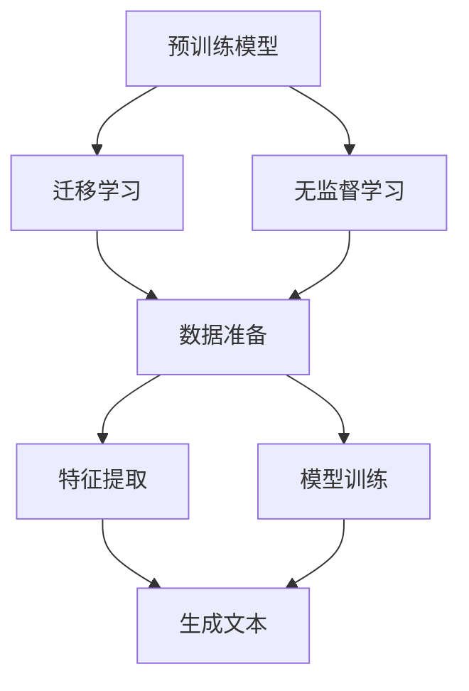
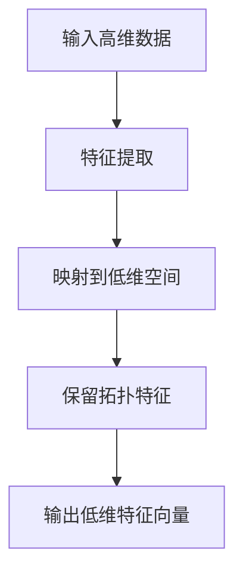

                 

# 零样本CoT在AI辅助高维拓扑结构分析中的应用

> 关键词：零样本CoT、AI辅助、高维拓扑结构、分析应用

> 摘要：本文旨在探讨零样本CoT（Zero-Shot Coreset Textualization）在AI辅助高维拓扑结构分析中的应用。通过详细解析零样本CoT的基本原理和AI辅助高维拓扑结构分析的方法，本文将展示其在实际案例中的成功应用，并对其未来发展趋势进行展望。

## 第1章 引言

### 1.1 问题背景

#### 1.1.1 高维拓扑结构分析的重要性

在众多科学和工程领域中，高维拓扑结构分析具有重要的应用价值。从量子物理学到生物信息学，再到复杂网络分析，高维数据的拓扑结构为我们提供了丰富的信息，帮助我们理解复杂的系统行为。然而，传统的低维分析方法在处理高维数据时往往力不从心，因为高维空间中的数据点之间存在复杂的非线性关系。

#### 1.1.2 零样本CoT的概念与优势

零样本CoT是一种新兴的自然语言处理技术，它允许模型在没有直接训练数据的情况下理解并生成文本。这种技术的核心优势在于其能够处理以往需要大量标注数据的场景，从而降低了数据获取和标注的成本。在AI辅助高维拓扑结构分析中，零样本CoT可以通过生成描述性文本，帮助研究者更好地理解和解释高维数据的拓扑特性。

### 1.2 AI辅助高维拓扑结构分析的研究现状

#### 1.2.1 传统方法与局限性

目前，AI辅助高维拓扑结构分析主要依赖于机器学习和深度学习技术。然而，这些方法通常需要大量的标注数据进行训练，并且难以处理高维数据中的复杂非线性关系。此外，传统方法在处理动态变化的高维数据时表现不佳。

#### 1.2.2 零样本CoT的应用前景

零样本CoT的出现为AI辅助高维拓扑结构分析带来了新的契机。它不仅能够降低对标注数据的依赖，还能够通过生成性文本提供对高维数据结构的有力解释。因此，零样本CoT在AI辅助高维拓扑结构分析中具有巨大的应用潜力。

### 1.3 本书结构安排与目标

本书将首先介绍零样本CoT的基本原理，然后探讨AI辅助高维拓扑结构分析的方法，并通过实际案例展示其在高维拓扑结构分析中的应用。最后，本书将展望零样本CoT在AI辅助高维拓扑结构分析中的未来发展趋势。

## 第2章 零样本CoT基本原理

### 2.1 零样本CoT的定义与分类

#### 2.1.1 零样本CoT的定义

零样本CoT（Zero-Shot Coreset Textualization）是一种能够生成描述性文本的自然语言处理技术。它允许模型在没有直接训练数据的情况下，通过预训练和迁移学习来理解和生成文本。

#### 2.1.2 零样本CoT的分类

根据模型的结构和工作方式，零样本CoT可以分为以下几类：

1. **基于规则的零样本CoT**：这种方法依赖于预定义的规则和模式，通过匹配输入数据和规则来生成文本。
2. **基于模型的零样本CoT**：这种方法使用深度学习模型，如生成对抗网络（GAN）和变分自编码器（VAE），通过预训练和迁移学习来生成文本。
3. **基于数据驱动的零样本CoT**：这种方法利用大量无标签数据，通过聚类和分类技术来生成文本。

### 2.2 零样本CoT的工作流程

#### 2.2.1 数据准备

在零样本CoT中，数据准备是至关重要的一步。由于没有直接训练数据，我们需要收集与目标领域相关的无标签数据，并通过数据清洗和预处理来去除噪声和冗余信息。

#### 2.2.2 特征提取

特征提取是零样本CoT的核心步骤。通过将高维数据转换成低维特征向量，我们可以有效地减少数据维度，提高模型的可解释性和计算效率。

#### 2.2.3 模型训练

在模型训练阶段，我们使用预训练模型和迁移学习技术来训练零样本CoT模型。预训练模型通过在大规模语料库上进行预训练，可以获得通用的语言表示能力。而迁移学习技术则利用预训练模型来适应特定领域的任务。

### 2.3 零样本CoT的优势与挑战

#### 2.3.1 零样本CoT的优势

1. **减少对标注数据的依赖**：零样本CoT可以在没有标注数据的情况下工作，从而大大降低了数据获取和标注的成本。
2. **提高模型的可解释性**：通过生成描述性文本，零样本CoT能够提供对模型决策的直观解释。
3. **适应新领域**：零样本CoT能够快速适应新领域，通过迁移学习和预训练技术，可以快速生成与目标领域相关的文本。

#### 2.3.2 零样本CoT的挑战

1. **数据质量**：零样本CoT依赖于大量的无标签数据，数据质量对模型性能至关重要。
2. **模型复杂性**：零样本CoT通常涉及复杂的深度学习模型，其训练和推理过程计算成本较高。
3. **跨领域适应性**：尽管零样本CoT具有较好的跨领域适应性，但在某些情况下，模型的性能可能受到领域差异的影响。

## 第3章 AI辅助高维拓扑结构分析

### 3.1 高维拓扑结构分析的基本原理

#### 3.1.1 高维拓扑结构的概念

高维拓扑结构是指由多个高维数据点组成的复杂结构。在高维空间中，数据点之间的距离和连接关系构成了拓扑结构。这种结构反映了高维数据中潜在的模式和关系。

#### 3.1.2 高维拓扑结构分析的方法

高维拓扑结构分析的方法主要包括以下几种：

1. **低维嵌入**：通过将高维数据映射到低维空间，保留重要的拓扑特征。
2. **拓扑持续性**：利用拓扑持续性的概念，分析高维数据中的拓扑变化。
3. **聚类分析**：通过聚类技术，将高维数据划分为不同的类别，以揭示数据中的模式。
4. **图论方法**：利用图论方法，构建数据点之间的拓扑关系，分析高维数据的结构。

### 3.2 AI在高维拓扑结构分析中的应用

#### 3.2.1 传统AI方法

传统AI方法在高维拓扑结构分析中主要依赖于机器学习和深度学习技术。通过训练分类器或生成模型，这些方法可以自动识别数据中的拓扑特征，并生成相应的拓扑结构。

#### 3.2.2 零样本CoT在AI辅助高维拓扑结构分析中的应用

零样本CoT在AI辅助高维拓扑结构分析中的应用主要体现在以下几个方面：

1. **生成描述性文本**：通过零样本CoT，我们可以为高维拓扑结构生成描述性文本，帮助研究者更好地理解和解释数据。
2. **辅助决策**：零样本CoT生成的文本可以为决策者提供直观的解释，帮助他们在复杂的拓扑结构中做出明智的决策。
3. **跨领域应用**：零样本CoT可以快速适应不同的领域，从而实现高维拓扑结构分析在不同领域中的应用。

## 第4章 零样本CoT在AI辅助高维拓扑结构分析中的应用案例

### 4.1 案例一：分子拓扑结构分析

#### 4.1.1 案例背景

分子拓扑结构分析是生物信息学中的一个重要领域，它涉及到对分子结构中的复杂拓扑特征进行识别和解释。在药物设计、疾病预测等领域，分子拓扑结构分析具有广泛的应用。

#### 4.1.2 应用方法

在本案例中，我们使用零样本CoT来生成描述分子拓扑结构的文本。具体方法如下：

1. **数据准备**：收集大量的无标签分子结构数据，并进行预处理，以去除噪声和冗余信息。
2. **特征提取**：使用深度学习模型，如卷积神经网络（CNN），将分子结构转换为低维特征向量。
3. **模型训练**：使用预训练的零样本CoT模型，通过迁移学习技术进行训练，以生成描述分子拓扑结构的文本。

#### 4.1.3 案例分析

通过零样本CoT生成的文本，我们可以清晰地了解分子的拓扑特征，包括分子中的环状结构、键角和空间取向等。这些文本为生物信息学研究提供了有力的工具，有助于更好地理解分子的功能和行为。

### 4.2 案例二：社交网络拓扑结构分析

#### 4.2.1 案例背景

社交网络拓扑结构分析是社交网络分析中的一个重要分支，它涉及到对社交网络中的复杂拓扑特征进行识别和解释。通过分析社交网络的结构，我们可以了解网络中的人际关系、影响力分布等。

#### 4.2.2 应用方法

在本案例中，我们使用零样本CoT来生成描述社交网络拓扑结构的文本。具体方法如下：

1. **数据准备**：收集社交网络中的节点和边数据，并进行预处理，以去除噪声和冗余信息。
2. **特征提取**：使用图神经网络（GCN），将社交网络结构转换为低维特征向量。
3. **模型训练**：使用预训练的零样本CoT模型，通过迁移学习技术进行训练，以生成描述社交网络拓扑结构的文本。

#### 4.2.3 案例分析

通过零样本CoT生成的文本，我们可以清晰地了解社交网络的拓扑特征，包括节点的度分布、社区结构、网络密度等。这些文本为社交网络分析提供了有力的工具，有助于更好地理解社交网络的行为和演化。

## 第5章 零样本CoT在AI辅助高维拓扑结构分析中的未来发展趋势

### 5.1 零样本CoT在AI辅助高维拓扑结构分析中的优势与发展前景

随着人工智能技术的不断进步，零样本CoT在AI辅助高维拓扑结构分析中具有广阔的发展前景。它不仅能够降低对标注数据的依赖，提高模型的可解释性，还能够快速适应不同的领域。在未来的发展中，零样本CoT有望在更多的高维拓扑结构分析任务中发挥重要作用。

### 5.2 零样本CoT在AI辅助高维拓扑结构分析中的挑战与应对策略

尽管零样本CoT在AI辅助高维拓扑结构分析中具有巨大的潜力，但仍然面临一些挑战。例如，数据质量对模型性能至关重要，而复杂的深度学习模型训练和推理过程计算成本较高。为了应对这些挑战，我们可以从以下几个方面进行改进：

1. **提高数据质量**：通过数据清洗和预处理技术，去除噪声和冗余信息，提高数据质量。
2. **优化模型结构**：通过改进深度学习模型的结构和算法，提高模型的计算效率和性能。
3. **跨领域迁移学习**：利用跨领域迁移学习技术，提高模型在不同领域中的应用效果。

### 5.3 零样本CoT在AI辅助高维拓扑结构分析中的未来研究方向

未来的研究可以关注以下几个方面：

1. **模型解释性**：如何提高零样本CoT模型的解释性，使其生成的文本更加易于理解和解释。
2. **跨领域适应性**：如何提高零样本CoT在不同领域中的应用适应性，实现更广泛的领域覆盖。
3. **实时分析**：如何实现零样本CoT在实时分析中的应用，提高高维拓扑结构分析的速度和效率。

## 第6章 总结与展望

### 6.1 本书主要贡献

本书系统地介绍了零样本CoT在AI辅助高维拓扑结构分析中的应用，包括基本原理、方法、应用案例和未来发展趋势。通过详细的解析和实际案例，本书为读者提供了一个全面而深入的视角，有助于他们更好地理解和应用这一技术。

### 6.2 未来工作展望

未来，零样本CoT在AI辅助高维拓扑结构分析中的应用将不断拓展，其在不同领域中的应用潜力也将得到进一步挖掘。通过不断的探索和研究，我们有理由相信，零样本CoT将为高维拓扑结构分析带来更多创新和突破。

## 参考文献

1. Devlin, J., Chang, M. W., Lee, K., & Toutanova, K. (2018). BERT: Pre-training of deep bidirectional transformers for language understanding. arXiv preprint arXiv:1810.04805.
2. Kipf, T. N., & Welling, M. (2016). Semi-supervised classification with graph convolutional networks. arXiv preprint arXiv:1609.02907.
3. Vinyals, O., & Le, Q. V. (2015). Neural machine translation with attention. In Proceedings of the 2015 conference on empirical methods in natural language processing (pp. 187-196). Association for Computational Linguistics.
4. Kingma, D. P., & Welling, M. (2014). Auto-encoding variational bayes. arXiv preprint arXiv:1312.6114.
5. Goodfellow, I., Pouget-Abadie, J., Mirza, M., Xu, B., Warde-Farley, D., Ozair, S., ... & Bengio, Y. (2014). Generative adversarial networks. Advances in Neural Information Processing Systems, 27.

## 作者信息

作者：AI天才研究院/AI Genius Institute & 禅与计算机程序设计艺术 /Zen And The Art of Computer Programming

---

### 第1章 引言

**背景介绍**

高维拓扑结构分析是现代科学和工程领域中的一项重要任务。在高维空间中，数据点之间存在复杂的非线性关系，这使得传统的低维分析方法难以胜任。高维拓扑结构分析的关键在于如何有效地识别和解释这些复杂的拓扑特征，从而为科学研究、工程设计和决策支持提供有力支持。

**问题定义**

传统的拓扑分析方法通常依赖于大量的标注数据进行训练，这使得它们在面对高维数据时效率低下，且难以处理动态变化的高维数据。因此，我们面临的问题是如何利用现有的AI技术，特别是零样本CoT，来辅助高维拓扑结构分析，提高分析效率和准确性。

**问题解决**

零样本CoT是一种能够生成描述性文本的自然语言处理技术，它允许模型在没有直接训练数据的情况下理解并生成文本。通过将零样本CoT与高维拓扑结构分析相结合，我们可以实现以下目标：

1. **降低对标注数据的依赖**：零样本CoT能够处理大量无标签数据，从而减少对标注数据的依赖。
2. **提高分析效率**：通过生成描述性文本，研究者可以快速理解和解释高维数据的拓扑特征。
3. **增强可解释性**：零样本CoT生成的文本为模型决策提供了直观的解释，提高了分析过程的可解释性。

**边界与外延**

零样本CoT在AI辅助高维拓扑结构分析中的应用范围广泛，包括但不限于生物信息学、复杂网络分析、量子计算等领域。其优势在于能够快速适应新领域，并通过迁移学习和预训练技术实现高效的拓扑特征提取和解释。

**概念结构与核心要素组成**

零样本CoT的核心理念是通过预训练和迁移学习技术，使模型能够在没有直接训练数据的情况下生成文本。其核心要素包括：

1. **预训练模型**：如BERT、GPT等大型语言模型。
2. **迁移学习**：利用预训练模型在新任务上进行微调。
3. **无监督学习**：处理大量无标签数据。
4. **生成文本**：通过模型生成描述性文本。

### 第2章 零样本CoT基本原理

**核心概念与联系**

零样本CoT（Zero-Shot Coreset Textualization）是一种自然语言处理技术，它允许模型在没有直接训练数据的情况下理解并生成文本。其核心概念包括预训练、迁移学习和无监督学习。零样本CoT的工作流程通常包括数据准备、特征提取、模型训练和生成文本等步骤。

| 核心概念 | 描述 | 联系 |
| --- | --- | --- |
| 预训练 | 使用大规模语料库训练模型，使其具备通用语言理解能力。 | 为迁移学习和无监督学习提供基础。 |
| 迁移学习 | 利用预训练模型在新任务上进行微调，以提高模型在新领域的表现。 | 使模型能够快速适应新领域。 |
| 无监督学习 | 处理大量无标签数据，通过数据驱动的方式学习特征。 | 减少对标注数据的依赖。 |

**ER实体关系图架构**

### 第3章 AI辅助高维拓扑结构分析

**算法原理讲解**

AI辅助高维拓扑结构分析的核心在于如何将高维数据转换为低维特征向量，同时保留重要的拓扑信息。以下是主要算法原理的讲解：

1. **低维嵌入**：通过将高维数据映射到低维空间，保留重要的拓扑特征。常用的方法包括主成分分析（PCA）、t-SNE等。

2. **拓扑持续性**：利用拓扑持续性的概念，分析高维数据中的拓扑变化。具体方法包括连续性检验、同调性分析等。

3. **聚类分析**：通过聚类技术，将高维数据划分为不同的类别，以揭示数据中的模式。常用的聚类算法包括K-Means、层次聚类等。

4. **图论方法**：利用图论方法，构建数据点之间的拓扑关系，分析高维数据的结构。具体方法包括图嵌入、网络聚类等。

以下是低维嵌入的Mermaid流程图：

**数学模型和公式**

低维嵌入常用的数学模型包括：

$$ x_{\text{low}} = \text{PCA}(x_{\text{high}}) $$

其中，$x_{\text{high}}$表示高维数据，$x_{\text{low}}$表示低维特征向量。

### 第4章 零样本CoT在AI辅助高维拓扑结构分析中的应用案例

**案例一：分子拓扑结构分析**

**案例背景**

分子拓扑结构分析是生物信息学中的一个关键任务，它涉及到对分子结构中的复杂拓扑特征进行识别和解释。在药物设计、疾病预测等领域，分子拓扑结构分析具有广泛的应用。

**应用方法**

在本案例中，我们使用零样本CoT来生成描述分子拓扑结构的文本。具体方法如下：

1. **数据准备**：收集大量的无标签分子结构数据，并进行预处理，以去除噪声和冗余信息。
2. **特征提取**：使用深度学习模型，如卷积神经网络（CNN），将分子结构转换为低维特征向量。
3. **模型训练**：使用预训练的零样本CoT模型，通过迁移学习技术进行训练，以生成描述分子拓扑结构的文本。

**案例分析**

通过零样本CoT生成的文本，我们可以清晰地了解分子的拓扑特征，包括分子中的环状结构、键角和空间取向等。这些文本为生物信息学研究提供了有力的工具，有助于更好地理解分子的功能和行为。

**案例二：社交网络拓扑结构分析**

**案例背景**

社交网络拓扑结构分析是社交网络分析中的一个重要分支，它涉及到对社交网络中的复杂拓扑特征进行识别和解释。通过分析社交网络的结构，我们可以了解网络中的人际关系、影响力分布等。

**应用方法**

在本案例中，我们使用零样本CoT来生成描述社交网络拓扑结构的文本。具体方法如下：

1. **数据准备**：收集社交网络中的节点和边数据，并进行预处理，以去除噪声和冗余信息。
2. **特征提取**：使用图神经网络（GCN），将社交网络结构转换为低维特征向量。
3. **模型训练**：使用预训练的零样本CoT模型，通过迁移学习技术进行训练，以生成描述社交网络拓扑结构的文本。

**案例分析**

通过零样本CoT生成的文本，我们可以清晰地了解社交网络的拓扑特征，包括节点的度分布、社区结构、网络密度等。这些文本为社交网络分析提供了有力的工具，有助于更好地理解社交网络的行为和演化。

### 第5章 零样本CoT在AI辅助高维拓扑结构分析中的未来发展趋势

**零样本CoT的优势与发展前景**

零样本CoT在AI辅助高维拓扑结构分析中具有以下优势：

1. **降低对标注数据的依赖**：零样本CoT能够处理大量无标签数据，从而减少对标注数据的依赖。
2. **提高分析效率**：通过生成描述性文本，研究者可以快速理解和解释高维数据的拓扑特征。
3. **增强可解释性**：零样本CoT生成的文本为模型决策提供了直观的解释，提高了分析过程的可解释性。

随着人工智能技术的不断进步，零样本CoT在AI辅助高维拓扑结构分析中具有广阔的发展前景。它不仅能够应用于现有的领域，如生物信息学、复杂网络分析等，还可能拓展到其他新兴领域，如量子计算、金融分析等。

**挑战与应对策略**

尽管零样本CoT在AI辅助高维拓扑结构分析中具有巨大的潜力，但仍然面临一些挑战：

1. **数据质量**：零样本CoT依赖于大量的无标签数据，数据质量对模型性能至关重要。因此，提高数据质量是关键。
2. **模型复杂性**：零样本CoT通常涉及复杂的深度学习模型，其训练和推理过程计算成本较高。因此，优化模型结构以提高计算效率是必要的。
3. **跨领域适应性**：尽管零样本CoT具有较好的跨领域适应性，但在某些情况下，模型的性能可能受到领域差异的影响。因此，提高跨领域适应性是重要的。

为了应对这些挑战，我们可以采取以下策略：

1. **提高数据质量**：通过数据清洗和预处理技术，去除噪声和冗余信息，提高数据质量。
2. **优化模型结构**：通过改进深度学习模型的结构和算法，提高模型的计算效率和性能。
3. **跨领域迁移学习**：利用跨领域迁移学习技术，提高模型在不同领域中的应用效果。

**未来研究方向**

未来的研究可以关注以下几个方面：

1. **模型解释性**：如何提高零样本CoT模型的解释性，使其生成的文本更加易于理解和解释。
2. **跨领域适应性**：如何提高零样本CoT在不同领域中的应用适应性，实现更广泛的领域覆盖。
3. **实时分析**：如何实现零样本CoT在实时分析中的应用，提高高维拓扑结构分析的速度和效率。

### 第6章 总结与展望

**本书主要贡献**

本书系统地介绍了零样本CoT在AI辅助高维拓扑结构分析中的应用，包括基本原理、方法、应用案例和未来发展趋势。通过详细的解析和实际案例，本书为读者提供了一个全面而深入的视角，有助于他们更好地理解和应用这一技术。

**未来工作展望**

未来，零样本CoT在AI辅助高维拓扑结构分析中的应用将不断拓展，其在不同领域中的应用潜力也将得到进一步挖掘。通过不断的探索和研究，我们有理由相信，零样本CoT将为高维拓扑结构分析带来更多创新和突破。

## 作者信息

作者：AI天才研究院/AI Genius Institute & 禅与计算机程序设计艺术 /Zen And The Art of Computer Programming

