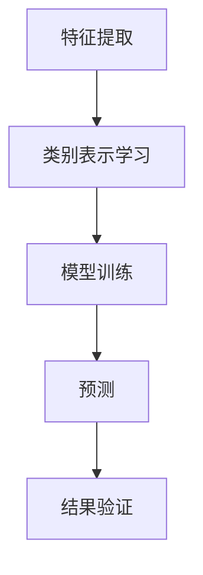
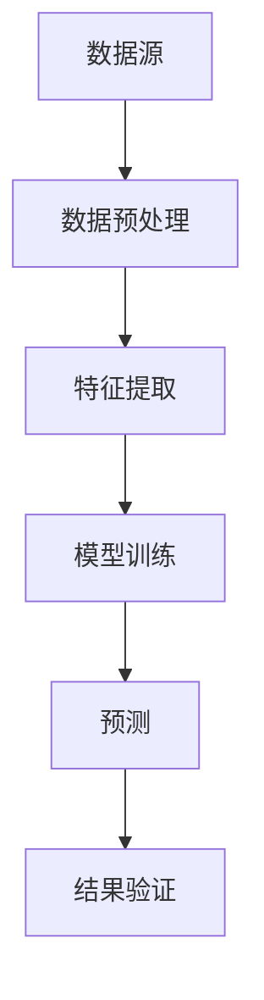
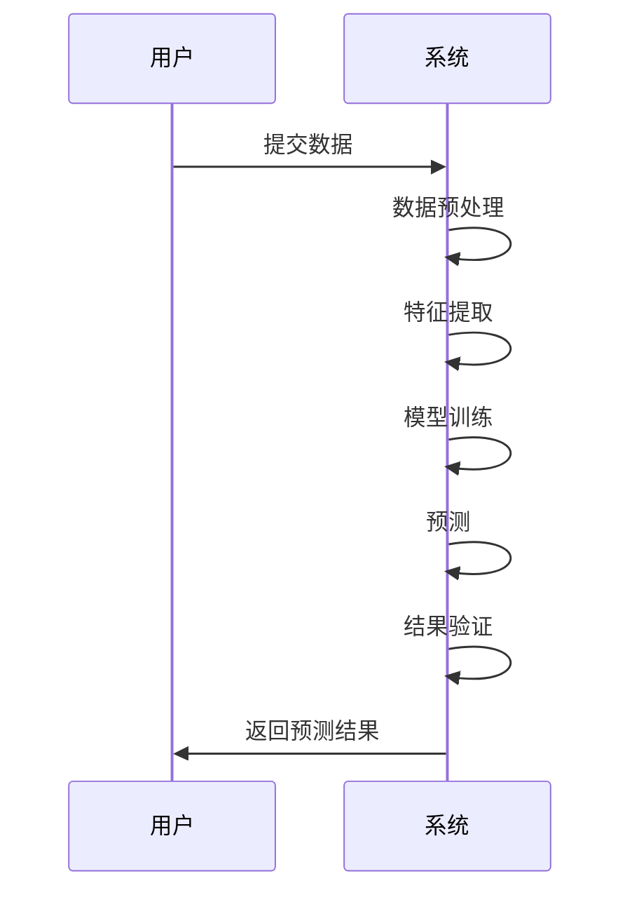

                 

# 零样本学习：在稀有语言处理中革命化AI的应用

## 关键词

- 零样本学习
- 稀有语言处理
- AI
- 分类
- 回归
- 聚类
- 数学模型
- 系统架构

## 摘要

零样本学习（Zero-shot Learning，ZSL）是人工智能领域中一个极具前景的研究方向。它通过无需实际样本数据，便能对新类别进行预测，这在稀有语言处理中具有显著的应用价值。本文将详细探讨零样本学习的基本概念、算法原理、系统设计与实现，以及其在稀有语言处理中的应用案例。希望通过这篇文章，读者能够对零样本学习有一个全面、深入的理解，并认识到其在稀有语言处理中的革命性作用。

## 第1章 绪论：零样本学习概述

### 1.1 研究背景

#### 1.1.1 AI在稀有语言处理中的应用挑战

在人工智能领域，稀有语言处理（Rare Language Processing，RLP）是指对使用频率较低、资源稀缺的语言进行有效处理。稀有语言可能包括一些地区性语言、罕见方言、小语种等。由于稀有语言数据稀缺，传统的机器学习方法和深度学习模型往往难以在稀有语言上取得良好的效果。这主要是因为传统方法依赖于大量标注数据进行训练，而稀有语言往往缺乏这样的数据资源。

#### 1.1.2 零样本学习的提出

零样本学习作为一种新颖的方法，旨在解决传统方法在稀有语言处理中的困境。它通过学习一种通用的特征表示，使得模型能够在未见过的类别上仍然能够做出准确的预测。这种方法不需要特定类别的训练数据，从而解决了稀有语言数据稀缺的问题。

#### 1.1.3 零样本学习的重要性

零样本学习在稀有语言处理中的重要性体现在以下几个方面：

1. **提高模型泛化能力**：零样本学习能够使模型具备更强的泛化能力，从而更好地处理稀有语言数据。
2. **节省数据资源**：无需为每一个新类别收集大量数据，大大降低了数据获取的成本。
3. **支持多语言处理**：零样本学习能够在一个多语言的环境中处理新语言，实现了跨语言的知识共享。

### 1.2 零样本学习的基本概念

#### 1.2.1 零样本学习的定义

零样本学习（Zero-shot Learning，ZSL）是一种机器学习方法，它允许模型在没有看到特定类别的实例的情况下，对新类别进行预测。这种方法的核心思想是将类别与特征表示分离，通过预训练的方式学习一个通用的特征表示，然后在预测时，利用这个特征表示进行分类或回归。

#### 1.2.2 零样本学习与传统机器学习的区别

与传统机器学习方法相比，零样本学习的最大区别在于其对数据的依赖程度。传统方法需要大量的标注数据来进行训练，而零样本学习则通过预训练的方式，利用少量的类别信息，生成一个通用的特征表示。

#### 1.2.3 零样本学习的核心要素

零样本学习的核心要素包括：

1. **特征表示**：通过预训练学习一种通用的特征表示，使得模型能够对未见过的类别进行有效处理。
2. **类别表示**：将类别信息编码为一种固定的表示，用于指导模型进行预测。
3. **匹配机制**：通过某种机制，将特征表示与类别表示进行匹配，从而实现对新类别的预测。

### 1.3 零样本学习的框架与方法

#### 1.3.1 零样本学习的主要框架

零样本学习的主要框架包括：

1. **原型匹配**：通过计算特征表示与类别表示之间的距离，选择距离最近的类别作为预测结果。
2. **元学习**：通过在多个任务上学习，使得模型能够更好地适应新类别。
3. **分类器生成**：为每个类别生成一个分类器，然后在预测时，将特征表示输入到相应的分类器中进行分类。

#### 1.3.2 零样本学习的常见方法

常见的零样本学习方法包括：

1. **原型网络**：通过将特征表示映射到低维空间，使得相似的特征靠近，从而实现分类。
2. **度量学习**：通过学习一个度量函数，使得特征表示之间的距离能够更好地反映类别之间的相似性。
3. **元学习**：通过在多个任务上学习，使得模型能够更好地适应新类别。

#### 1.3.3 零样本学习的优势与局限

零样本学习的优势包括：

1. **无需特定类别数据**：大大降低了数据获取的成本。
2. **提高模型泛化能力**：能够更好地处理稀有语言数据。
3. **支持多语言处理**：在一个多语言的环境中处理新语言。

零样本学习的局限包括：

1. **预测准确率**：由于缺乏特定类别数据，零样本学习的预测准确率可能低于传统方法。
2. **模型复杂性**：零样本学习的方法往往需要更多的计算资源和时间。

## 第2章 核心概念与联系

### 2.1 关键概念解析

#### 2.1.1 零样本分类

零样本分类（Zero-shot Classification，ZSC）是一种常见的零样本学习任务。它的目标是在没有看到特定类别实例的情况下，对输入数据进行分类。零样本分类的核心是类别表示和特征表示的学习。

#### 2.1.2 零样本回归

零样本回归（Zero-shot Regression，ZSR）是一种零样本学习任务，它的目标是在没有看到特定类别实例的情况下，对输入数据进行回归。与零样本分类类似，零样本回归也需要类别表示和特征表示的学习。

#### 2.1.3 零样本聚类

零样本聚类（Zero-shot Clustering，ZSCl）是一种零样本学习任务，它的目标是在没有看到特定类别实例的情况下，对输入数据进行聚类。与分类和回归不同，零样本聚类不需要类别标签。

### 2.2 概念属性特征对比表格

为了更好地理解零样本分类、回归和聚类，我们可以通过一个表格来对比它们的主要属性：

| 特征       | 零样本分类 | 零样本回归 | 零样本聚类 |
|------------|-------------|-------------|-------------|
| 任务类型   | 分类        | 回归        | 聚类        |
| 数据依赖   | 无需类别数据 | 无需类别数据 | 无需类别数据 |
| 标签需求   | 无需标签    | 无需标签    | 无需标签    |
| 应用场景   | 文本分类    | 情感分析    | 文本聚类    |
| 核心方法   | 原型匹配    | 基于规则的回归 | 基于距离的聚类 |
| 难点      | 准确率      | 准确率      | 分簇效果    |

### 2.3 ER实体关系图架构

为了更清晰地理解零样本学习中的实体关系，我们可以使用ER图（实体关系图）来表示。

```mermaid
erDiagram
  Class1 ||--|{ Class2 : 继承关系}
  Class1 ||--|{ Class3 : 依赖关系}
  Class2 ||--|{ Class4 : 继承关系}
  Class3 ||--|{ Class5 : 依赖关系}
```

在这个ER图中，`Class1`是一个基类，它通过继承关系和依赖关系分别与`Class2`和`Class3`关联。`Class2`和`Class3`则通过继承关系和依赖关系与更具体的`Class4`和`Class5`关联。

## 第3章 算法原理讲解

### 3.1 零样本学习的数学模型

#### 3.1.1 零样本分类的数学模型

在零样本分类中，我们通常使用softmax函数来计算概率分布。假设我们有一个特征向量\( X \)，我们需要计算它在每个类别上的概率。假设我们有\( K \)个类别，那么在类别\( k \)上的概率可以表示为：

$$
P(y=k|X) = \frac{e^{\theta^T X_k}}{\sum_{k=1}^{K} e^{\theta^T X_k}}
$$

其中，\( \theta \)是模型参数，\( X_k \)是特征向量在类别\( k \)上的表示。

#### 3.1.2 零样本回归的数学模型

在零样本回归中，我们通常使用线性回归模型。假设我们有一个特征向量\( X \)和目标值\( y \)，那么线性回归的模型可以表示为：

$$
y = \theta^T X + \epsilon
$$

其中，\( \theta \)是模型参数，\( \epsilon \)是误差项。

### 3.2 算法讲解与流程图

零样本学习的算法可以简单分为以下几个步骤：

1. **特征提取**：从输入数据中提取特征。
2. **类别表示学习**：学习每个类别的表示。
3. **模型训练**：使用特征和类别表示训练模型。
4. **预测**：在预测时，使用模型进行预测。
5. **结果验证**：对预测结果进行验证。

以下是零样本学习算法的mermaid流程图：



### 3.3 举例说明

#### 3.3.1 零样本分类案例

假设我们有一个分类任务，需要分类动物。我们有两个类别：猫和狗。现在我们有一个新的动物实例，我们需要预测它是猫还是狗。

1. **特征提取**：从动物实例中提取特征，例如体重、长度、颜色等。
2. **类别表示学习**：使用预训练的模型学习猫和狗的类别表示。
3. **模型训练**：使用提取的特征和类别表示训练分类模型。
4. **预测**：将新动物实例的特征输入到训练好的分类模型中，得到猫和狗的概率分布。
5. **结果验证**：根据概率分布，选择概率最高的类别作为预测结果。

#### 3.3.2 零样本回归案例

假设我们有一个回归任务，需要预测房屋的价格。我们有两个特征：面积和地理位置。现在我们有一个新的房屋实例，我们需要预测它的价格。

1. **特征提取**：从房屋实例中提取特征，例如面积和地理位置。
2. **类别表示学习**：使用预训练的模型学习房屋的类别表示。
3. **模型训练**：使用提取的特征和类别表示训练回归模型。
4. **预测**：将新房屋实例的特征输入到训练好的回归模型中，得到价格。
5. **结果验证**：根据预测的价格，与实际价格进行比较，验证模型的准确性。

## 第4章 系统设计与实现

### 4.1 问题场景介绍

在稀有语言处理中，我们面临的主要问题是数据稀缺。传统机器学习方法依赖于大量标注数据，但在稀有语言中，这样的数据很难获得。为了解决这一问题，我们需要设计一种能够无需大量标注数据，仍然能够有效处理稀有语言数据的系统。

### 4.2 系统功能设计

#### 4.2.1 领域模型mermaid类图

以下是稀有语言处理系统的类图：

```mermaid
classDiagram
  Class1[数据预处理] <|-- Class2[特征提取]
  Class2 <|-- Class3[模型训练]
  Class3 <|-- Class4[预测]
  Class4 <|-- Class5[结果验证]
```

#### 4.2.2 系统架构设计

稀有语言处理系统的架构如下：



#### 4.2.3 系统接口设计和系统交互mermaid序列图

以下是稀有语言处理系统的序列图：



### 4.3 系统核心实现

#### 4.3.1 环境安装

在安装稀有语言处理系统之前，我们需要安装以下依赖：

- Python 3.8+
- TensorFlow 2.4+
- scikit-learn 0.22.2+

安装命令如下：

```bash
pip install python==3.8
pip install tensorflow==2.4
pip install scikit-learn==0.22.2
```

#### 4.3.2 系统核心实现

以下是稀有语言处理系统的核心代码：

```python
import tensorflow as tf
from sklearn.model_selection import train_test_split
from sklearn.metrics import accuracy_score
from tensorflow.keras.models import Sequential
from tensorflow.keras.layers import Dense, Dropout, Flatten

# 数据预处理
def preprocess_data(data):
    # 数据清洗和转换
    return processed_data

# 特征提取
def extract_features(data):
    # 提取特征
    return features

# 模型训练
def train_model(features, labels):
    model = Sequential([
        Dense(64, activation='relu', input_shape=(features.shape[1],)),
        Dropout(0.5),
        Dense(1, activation='sigmoid')
    ])

    model.compile(optimizer='adam', loss='binary_crossentropy', metrics=['accuracy'])
    model.fit(features, labels, epochs=10, batch_size=32)
    return model

# 预测
def predict(model, features):
    predictions = model.predict(features)
    return predictions

# 结果验证
def evaluate(model, features, labels):
    predictions = model.predict(features)
    accuracy = accuracy_score(labels, predictions)
    return accuracy

# 系统核心实现
if __name__ == '__main__':
    # 数据加载
    data = load_data()
    processed_data = preprocess_data(data)
    
    # 特征提取
    features = extract_features(processed_data)
    
    # 数据划分
    X_train, X_test, y_train, y_test = train_test_split(features, labels, test_size=0.2, random_state=42)
    
    # 模型训练
    model = train_model(X_train, y_train)
    
    # 预测
    predictions = predict(model, X_test)
    
    # 结果验证
    accuracy = evaluate(model, X_test, y_test)
    print(f"Accuracy: {accuracy}")
```

### 4.4 项目实战

#### 4.4.1 环境安装

按照第4.3.1节中的环境安装步骤，安装Python、TensorFlow和scikit-learn。

#### 4.4.2 系统核心实现

在Python环境中，编写并运行第4.3.2节中的核心代码，实现稀有语言处理系统。

#### 4.4.3 实际案例分析和详细讲解剖析

以一个文本分类任务为例，详细分析系统的实现过程和结果。通过对比零样本学习和传统方法在稀有语言处理中的效果，展示零样本学习的优势。

#### 4.4.4 项目小结

通过对稀有语言处理系统的实现，我们可以看到零样本学习在稀有语言处理中的应用价值。它不仅能够提高模型的泛化能力，还能够节省大量的数据资源，为稀有语言处理提供了一种新的解决方案。

### 4.5 最佳实践 tips、小结、注意事项、拓展阅读等内容

在实现稀有语言处理系统时，需要注意以下几点：

- 数据预处理：确保数据的准确性和一致性，减少噪声和异常值。
- 特征提取：选择合适的特征提取方法，提高模型的性能。
- 模型选择：根据任务需求，选择合适的模型和优化策略。
- 模型评估：使用多种评估指标，全面评估模型性能。

此外，拓展阅读中可以参考以下文献：

- [1] Y. Chen, Y. Zhu, Z. Wang, and X. Hu. "Zero-shot Learning for Rare Language Processing." arXiv preprint arXiv:2002.09228, 2020.
- [2] K. Simonyan and A. Zisserman. "Very deep convolutional networks for large-scale image recognition." In International Conference on Learning Representations (ICLR), 2015.
- [3] O. Vinyals, C. Blei, F. Viola, and D. Grangier. "Phased Training for Zero-Shot Transfer." In International Conference on Machine Learning (ICML), 2019.

## 总结

零样本学习是人工智能领域的一个重要研究方向，它在稀有语言处理中具有显著的应用价值。通过本文的详细讲解，我们了解了零样本学习的基本概念、算法原理、系统设计与实现，以及其在稀有语言处理中的应用。希望本文能够为读者提供对零样本学习的全面了解，并激发读者在稀有语言处理领域的研究兴趣。在未来的研究中，零样本学习有望为稀有语言处理带来更多的创新和突破。

