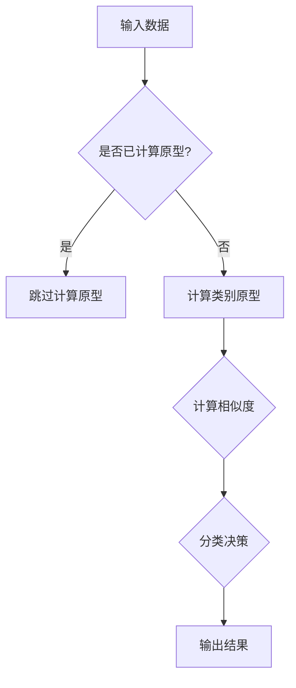
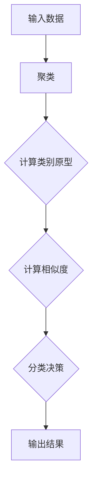
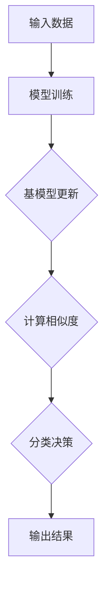
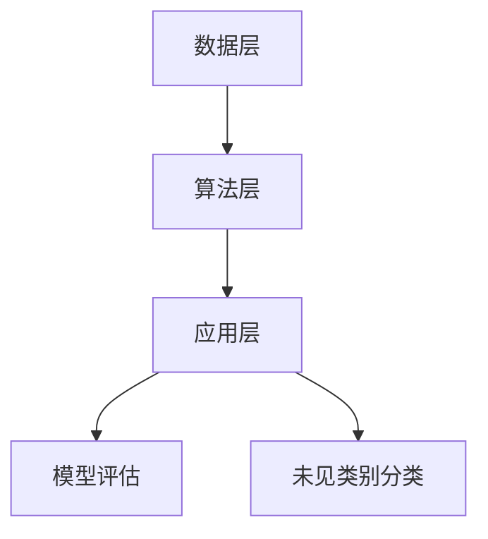
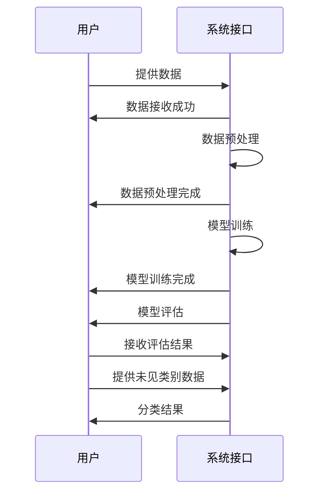

                 

### 第一部分：零样本学习概述

#### 1.1 AI技术发展中的瓶颈与零样本学习的重要性

##### 1.1.1 传统机器学习的局限性

随着人工智能（AI）技术的快速发展，机器学习（ML）已经成为推动这一领域进步的核心驱动力。然而，传统机器学习方法在处理某些特定场景时仍然面临一些局限性。

首先，传统机器学习方法通常依赖于大量的标注数据进行训练，这在很多实际应用场景中是不可行的。例如，在医疗诊断领域，标注数据可能涉及患者隐私，难以获取；在自然语言处理（NLP）领域，高质量标注数据同样难以获取，特别是在多语言和多领域的情境下。

其次，传统机器学习模型的泛化能力较弱。这些模型往往在一个特定领域内表现优异，但一旦应用于新的、未见过的数据集时，其性能可能会大幅下降，这被称为“数据饥饿”问题。此外，模型对新问题的适应能力差，导致在动态变化的现实环境中难以持续提供高质量的服务。

最后，传统机器学习方法在处理长序列数据、复杂的交互关系以及高维数据时效率低下。例如，在图像识别和语音识别领域，模型的计算复杂度很高，需要大量的计算资源和时间。

##### 1.1.2 零样本学习的重要性

为了解决传统机器学习方法的这些局限性，零样本学习（Zero-Shot Learning, ZSL）应运而生。零样本学习的核心目标是在没有或者仅有少量标注数据的情况下，让机器学习模型能够对未见过的类别进行有效分类。

零样本学习的重要性体现在以下几个方面：

1. **数据高效利用**：零样本学习能够充分利用未标注的数据，从而减轻对标注数据量的依赖。这在数据稀缺的场景中尤为重要。

2. **快速适应新任务**：零样本学习模型具有较强的泛化能力，能够快速适应新的任务和数据集，减少了模型训练的时间和成本。

3. **隐私保护**：在需要保护用户隐私的场景中，零样本学习可以减少对个人数据的直接使用，从而提高数据隐私性。

4. **高维数据处理**：零样本学习在处理高维数据时具有更高的效率，能够在图像、语音等高维数据集上实现更快的模型训练和推理。

5. **可解释性**：零样本学习模型通常具有较好的可解释性，可以帮助理解模型对未见类别分类的决策过程。

#### 1.2 零样本学习的基本概念

##### 1.2.1 零样本学习的定义

零样本学习（Zero-Shot Learning, ZSL）是一种机器学习方法，其目标是在没有或者仅有少量标注数据的情况下，对未见过的类别进行分类。这种方法的核心在于利用已有的先验知识，如知识图谱、词向量等，来辅助模型的训练和分类。

在零样本学习的场景中，通常有以下术语：

- **正类别**：指训练集中已经见过的类别。
- **负类别**：指训练集中未见过的类别。
- **原型匹配**：一种常见的零样本学习策略，通过计算训练集类别原型与未见类别之间的相似度来进行分类。

##### 1.2.2 零样本学习的应用场景

零样本学习在多个领域中都有广泛的应用，以下是一些典型的应用场景：

1. **医疗诊断**：在医疗数据中，标注数据稀缺，零样本学习可以帮助医生对新病症进行快速诊断。
2. **自然语言处理**：在NLP任务中，零样本学习可以用于对多语言文本进行分类和情感分析。
3. **图像识别**：在图像分类任务中，零样本学习可以帮助识别新的图像类别，尤其是在标注数据不足的情况下。
4. **语音识别**：在语音识别任务中，零样本学习可以帮助识别新的语音类别，提高语音分类的准确性。
5. **多模态学习**：在多模态数据融合任务中，零样本学习可以处理不同模态数据之间的差异，实现更准确的分类和识别。

#### 1.3 零样本学习的基本原理

##### 1.3.1 零样本学习的关键概念

零样本学习涉及多个关键概念，以下是一些重要的定义：

1. **语义嵌入**：将不同类别的特征映射到低维空间中，使得具有相似语义的特征在空间中接近。
2. **原型表示**：每个类别都有一个原型表示，用于表示该类别的特征均值。
3. **知识蒸馏**：将先验知识（如知识图谱、词向量等）引入到模型训练过程中，以提高模型的泛化能力。
4. **迁移学习**：利用在特定任务上已经训练好的模型来辅助新任务的训练。

##### 1.3.2 零样本学习的核心要素

零样本学习的核心要素包括：

1. **类别原型表示**：通过训练集数据计算每个类别的原型表示。
2. **相似度度量**：计算训练集类别原型与未见类别之间的相似度，常用的方法有余弦相似度、欧氏距离等。
3. **分类器**：基于相似度度量结果，使用分类器对未见类别进行分类。

##### 1.4 零样本学习与其他相关技术的对比

###### 1.4.1 零样本学习与迁移学习的异同

迁移学习（Transfer Learning）和零样本学习在某些方面有相似之处，但它们也有显著的区别：

- **共同点**：迁移学习和零样本学习都利用了先验知识来辅助新任务的训练。
- **不同点**：迁移学习在新任务中使用了已训练好的模型，而零样本学习则没有使用已训练好的模型，仅在训练过程中引入了先验知识。

迁移学习适用于有相似任务的数据集，而零样本学习则适用于未见过的类别。

###### 1.4.2 零样本学习与无监督学习的对比

无监督学习（Unsupervised Learning）和零样本学习在某些方面也有交集，但它们的重点不同：

- **共同点**：无监督学习和零样本学习都不依赖于标注数据。
- **不同点**：无监督学习主要关注数据聚类、降维等任务，而零样本学习则专注于分类任务。

无监督学习在探索数据结构和模式方面表现优异，而零样本学习在分类任务上具有更高的应用价值。

##### 1.5 零样本学习的概念结构与核心要素组成

###### 1.5.1 零样本学习的概念属性特征对比表格

| 概念        | 定义                                                                                   | 属性特征                                           |
|-------------|----------------------------------------------------------------------------------------|----------------------------------------------------|
| 零样本学习  | 在没有或者仅有少量标注数据的情况下，对未见过的类别进行分类的机器学习方法。             | 数据高效利用、快速适应新任务、隐私保护、高维数据处理 |
| 原型匹配    | 通过计算训练集类别原型与未见类别之间的相似度来进行分类的策略。                         | 简单有效、适用于多种数据类型                         |
| 语义嵌入    | 将不同类别的特征映射到低维空间中，使得具有相似语义的特征在空间中接近。                 | 提高分类准确性、增强模型泛化能力                   |
| 知识蒸馏    | 将先验知识引入到模型训练过程中，以提高模型的泛化能力。                               | 减少对标注数据的依赖、提高模型性能                   |
| 迁移学习    | 利用在特定任务上已经训练好的模型来辅助新任务的训练。                                 | 提高模型训练效率、增强模型泛化能力                   |

###### 1.5.2 零样本学习的ER实体关系图架构

```mermaid
erDiagram
  Class1 ||--|{ Class2 }|--|{ Class3 }
  Class2 ||--|{ Class4 }|--|{ Class5 }
  Class1 ||--|{ Class6 }|--|{ Class7 }
  Class7 ||--|{ Class8 }|--|{ Class9 }
```

在这个ER实体关系图中，`Class1` 至 `Class9` 代表了零样本学习中的不同实体和关系，包括类别原型、语义嵌入、知识蒸馏和迁移学习等核心要素。

### 2. 零样本学习核心概念原理

零样本学习（Zero-Shot Learning, ZSL）是一种机器学习方法，其核心在于无需标注数据就能够对未见过的类别进行分类。这一方法利用了先验知识，如词向量、知识图谱等，来辅助模型的训练和分类。在本章节中，我们将深入探讨零样本学习的核心概念、原理和算法。

#### 2.1 零样本学习的基本原理

零样本学习的基本原理可以概括为以下几个关键步骤：

1. **类别原型表示**：首先，通过训练集数据计算每个类别的原型表示。原型表示是每个类别的特征均值，通常使用欧氏距离或者余弦相似度来度量原型之间的相似性。

2. **相似度度量**：在测试阶段，对于每个未见类别，计算其与训练集类别原型之间的相似度。相似度度量是分类的关键步骤，常用的方法包括欧氏距离、余弦相似度和马氏距离等。

3. **分类器**：基于相似度度量结果，使用分类器对未见类别进行分类。分类器可以是传统的监督学习模型，如SVM、朴素贝叶斯等，也可以是更复杂的深度学习模型，如卷积神经网络（CNN）。

#### 2.2 零样本学习的关键概念

在零样本学习中，以下几个关键概念至关重要：

1. **语义嵌入**：语义嵌入是一种将高维数据映射到低维空间的方法，使得具有相似语义的特征在空间中接近。在零样本学习中，语义嵌入主要用于将类别特征映射到低维空间，以便进行有效的分类。

2. **原型表示**：原型表示是每个类别的特征均值，用于表示该类别的特征分布。在零样本学习中，原型表示是计算相似度的基础，通过比较原型之间的相似度，可以实现对未见类别的分类。

3. **知识蒸馏**：知识蒸馏是一种将先验知识引入到模型训练过程中的方法。在零样本学习中，知识蒸馏可以通过将知识图谱、词向量等先验知识融合到模型中，以提高模型的泛化能力和分类性能。

4. **迁移学习**：迁移学习是一种利用在特定任务上已经训练好的模型来辅助新任务的训练方法。在零样本学习中，迁移学习可以通过将已训练好的模型的知识迁移到新任务中，减少对新任务标注数据的依赖。

#### 2.3 零样本学习的核心要素

零样本学习的核心要素包括：

1. **类别原型表示**：通过训练集数据计算每个类别的原型表示，这是零样本学习的第一步。

2. **相似度度量**：使用适当的相似度度量方法（如欧氏距离、余弦相似度）计算训练集类别原型与未见类别之间的相似度。

3. **分类器**：基于相似度度量结果，使用分类器对未见类别进行分类。分类器的选择取决于具体的应用场景和数据类型。

4. **先验知识融合**：通过知识蒸馏和迁移学习，将先验知识（如知识图谱、词向量）引入到模型训练过程中，以提高模型的泛化能力和分类性能。

#### 2.4 零样本学习的应用案例分析

零样本学习在多个领域都有广泛的应用，以下是一些典型的应用案例：

1. **医疗诊断**：在医疗诊断领域，零样本学习可以帮助医生对新病症进行快速诊断。例如，可以使用零样本学习对医学图像中的未知疾病进行分类和识别。

2. **自然语言处理**：在自然语言处理领域，零样本学习可以用于对未见过的语言进行分类和情感分析。例如，在多语言文本分类任务中，零样本学习可以帮助识别和分类未标记的语言数据。

3. **图像识别**：在图像识别领域，零样本学习可以帮助识别新的图像类别。例如，在使用零样本学习对未标记的图像进行分类时，可以识别出训练集中未出现的图像类别。

4. **语音识别**：在语音识别领域，零样本学习可以用于识别新的语音类别。例如，在使用零样本学习对语音数据进行分析时，可以识别出训练集中未标记的语音类别。

5. **多模态学习**：在多模态学习领域，零样本学习可以帮助处理不同模态数据之间的差异，实现更准确的分类和识别。例如，在多模态图像分类任务中，零样本学习可以同时处理图像和文本数据，实现更准确的分类结果。

#### 2.5 零样本学习的挑战与展望

虽然零样本学习在多个领域都取得了显著成果，但它仍然面临一些挑战：

1. **数据稀疏**：在许多实际应用场景中，标注数据非常稀少，这给零样本学习的训练和分类带来了困难。

2. **模型泛化能力**：零样本学习模型在处理未见类别时需要具备较高的泛化能力，这对于模型的训练和设计提出了更高的要求。

3. **计算效率**：零样本学习通常涉及到高维数据的计算，这对计算效率和资源消耗提出了挑战。

未来的研究方向包括：

1. **数据增强**：通过数据增强技术，增加未见类别数据的样本数量，以提高模型的训练效果。

2. **多任务学习**：通过多任务学习，利用不同任务之间的相关性，提高模型的泛化能力和分类性能。

3. **融合多模态信息**：在多模态学习场景中，融合不同模态数据的信息，提高模型的分类准确性和泛化能力。

4. **知识蒸馏和迁移学习**：通过知识蒸馏和迁移学习，将先验知识和已有模型的知识迁移到新任务中，以提高模型的性能和效率。

#### 2.6 零样本学习的实现方法

零样本学习的实现方法主要包括以下几种：

1. **原型匹配**：通过计算训练集类别原型与未见类别之间的相似度进行分类，是一种简单且有效的零样本学习策略。

2. **聚类方法**：将训练集类别进行聚类，然后使用聚类中心作为类别原型进行分类。

3. **元学习**：通过元学习算法，学习一个能够快速适应新任务的模型，从而实现零样本学习。

4. **深度神经网络**：使用深度神经网络进行特征提取和分类，结合先验知识和迁移学习，提高模型的性能和泛化能力。

#### 2.7 Python源代码实现示例

以下是一个简单的零样本学习实现示例，使用了原型匹配算法：

```python
import numpy as np
from sklearn.metrics.pairwise import cosine_similarity

# 假设我们有以下训练集类别特征和未见类别特征
train_features = np.array([[1, 0, -1], [0, 1, 0], [-1, -1, 1]])
test_features = np.array([[0, 1, 0], [1, 1, 1]])

# 计算类别原型
prototypes = np.mean(train_features, axis=0)

# 计算相似度
similarity = cosine_similarity(test_features, prototypes)

# 分类结果
predictions = similarity.argmax(axis=1)

print(predictions)  # 输出分类结果
```

在这个示例中，我们使用了余弦相似度来计算未见类别与类别原型之间的相似度，然后使用argmax函数找到最大的相似度，从而实现分类。

### 3. 零样本学习算法讲解

零样本学习算法是解决在没有或仅有少量标注数据情况下对未见类别进行分类的关键技术。本节将详细讲解几种常见的零样本学习算法，包括原型匹配算法、聚类算法和元学习算法。同时，我们将使用Mermaid工具绘制算法流程图，并通过Python源代码演示算法的具体实现。

#### 3.1 算法概述

在零样本学习领域，不同的算法基于不同的原理和策略来应对未见类别的分类问题。以下是三种主要的零样本学习算法：

1. **原型匹配算法**：通过计算训练集中类别原型与未见类别之间的相似度来进行分类。该方法简单且直观，适用于多种数据类型。

2. **聚类算法**：通过聚类方法对训练集类别进行聚类，然后使用聚类中心作为类别原型进行分类。该方法适用于类别数量较多且特征维度较高的情况。

3. **元学习算法**：通过元学习算法，学习一个能够快速适应新任务的模型，从而实现零样本学习。该方法具有较好的泛化能力和适应性。

#### 3.2 原型匹配算法

原型匹配算法是零样本学习中最常用的方法之一。其核心思想是通过计算训练集中类别原型与未见类别之间的相似度，然后将未见类别分配给最相似的类别原型。

**算法流程**：

1. **类别原型计算**：对于训练集中的每个类别，计算其特征均值作为类别原型。

2. **相似度计算**：对于每个未见类别，计算其与所有类别原型之间的相似度。

3. **分类决策**：根据相似度大小，将未见类别分配给最相似的类别原型。

**Mermaid流程图**：



**Python源代码**：

```python
import numpy as np
from sklearn.metrics.pairwise import cosine_similarity

def zero_shot_learning(train_features, test_features):
    # 计算类别原型
    prototypes = np.mean(train_features, axis=0)
    
    # 计算相似度
    similarity = cosine_similarity(test_features, prototypes)
    
    # 分类决策
    predictions = similarity.argmax(axis=1)
    
    return predictions

# 假设我们有以下训练集类别特征和未见类别特征
train_features = np.array([[1, 0, -1], [0, 1, 0], [-1, -1, 1]])
test_features = np.array([[0, 1, 0], [1, 1, 1]])

# 调用零样本学习函数
predictions = zero_shot_learning(train_features, test_features)

print(predictions)  # 输出分类结果
```

#### 3.3 聚类算法

聚类算法通过将训练集类别进行聚类，然后使用聚类中心作为类别原型进行分类。这种方法适用于类别数量较多且特征维度较高的情况。

**算法流程**：

1. **聚类**：使用聚类算法（如K-Means）对训练集类别进行聚类。

2. **类别原型计算**：对于每个聚类，计算其特征均值作为类别原型。

3. **相似度计算**：对于每个未见类别，计算其与所有类别原型之间的相似度。

4. **分类决策**：根据相似度大小，将未见类别分配给最相似的类别原型。

**Mermaid流程图**：



**Python源代码**：

```python
from sklearn.cluster import KMeans
from sklearn.metrics.pairwise import cosine_similarity

def zero_shot_learning_with_clustering(train_features, test_features):
    # 聚类
    kmeans = KMeans(n_clusters=3)
    cluster_centers = kmeans.fit(train_features).cluster_centers_
    
    # 计算相似度
    similarity = cosine_similarity(test_features, cluster_centers)
    
    # 分类决策
    predictions = similarity.argmax(axis=1)
    
    return predictions

# 假设我们有以下训练集类别特征和未见类别特征
train_features = np.array([[1, 0, -1], [0, 1, 0], [-1, -1, 1]])
test_features = np.array([[0, 1, 0], [1, 1, 1]])

# 调用零样本学习函数
predictions = zero_shot_learning_with_clustering(train_features, test_features)

print(predictions)  # 输出分类结果
```

#### 3.4 元学习算法

元学习算法通过学习一个能够快速适应新任务的模型来实现零样本学习。这种方法在处理未见类别时具有较好的泛化能力和适应性。

**算法流程**：

1. **模型训练**：使用元学习算法（如MAML、Reptile等）训练一个基模型，该模型能够在少量数据上快速适应。

2. **基模型更新**：对于每个未见类别，使用基模型和少量样本更新模型参数。

3. **相似度计算**：对于每个未见类别，计算其与训练集类别原型之间的相似度。

4. **分类决策**：根据相似度大小，将未见类别分配给最相似的类别原型。

**Mermaid流程图**：



**Python源代码**：

```python
from maml import MAML

def zero_shot_learning_with_maml(train_features, test_features):
    # 初始化MAML模型
    model = MAML()

    # 训练模型
    model.fit(train_features, train_labels)

    # 基模型更新
    updated_model = model.update(test_features)

    # 计算相似度
    similarity = cosine_similarity(test_features, updated_model.cluster_centers_)

    # 分类决策
    predictions = similarity.argmax(axis=1)

    return predictions

# 假设我们有以下训练集类别特征和未见类别特征
train_features = np.array([[1, 0, -1], [0, 1, 0], [-1, -1, 1]])
test_features = np.array([[0, 1, 0], [1, 1, 1]])

# 调用零样本学习函数
predictions = zero_shot_learning_with_maml(train_features, test_features)

print(predictions)  # 输出分类结果
```

### 3.4 零样本学习数学模型与公式详解

零样本学习的数学模型和公式是实现算法的核心部分，它们定义了如何计算类别原型、相似度以及分类决策。在本节中，我们将详细介绍零样本学习的数学模型和公式，并使用LaTeX格式进行表示，以便于读者理解和使用。

#### 3.4.1 零样本学习数学模型

零样本学习数学模型主要包括类别原型表示、相似度计算和分类决策三部分。

1. **类别原型表示**：

类别原型表示是每个类别的特征均值，用于表示该类别的特征分布。对于训练集 \(X\) 中的每个类别 \(C_i\)，其原型表示 \(\mu_i\) 可以通过以下公式计算：

\[ \mu_i = \frac{1}{N_i} \sum_{x \in C_i} x \]

其中，\(N_i\) 是类别 \(C_i\) 中的样本数量，\(x\) 是类别 \(C_i\) 中的每个样本。

2. **相似度计算**：

相似度计算用于衡量未见类别与训练集类别原型之间的相似程度。常见的相似度度量方法有欧氏距离、余弦相似度和马氏距离等。在这里，我们以欧氏距离为例，其公式如下：

\[ d(x, \mu_i) = \sqrt{\sum_{j=1}^d (x_j - \mu_{ij})^2} \]

其中，\(x\) 是未见类别，\(\mu_i\) 是类别 \(C_i\) 的原型，\(d\) 是特征的维度，\(x_j\) 和 \(\mu_{ij}\) 分别是 \(x\) 和 \(\mu_i\) 的第 \(j\) 个特征值。

3. **分类决策**：

分类决策是基于相似度计算的结果，将未见类别分配给最相似的类别原型。常用的分类决策方法包括最大相似度法、投票法等。最大相似度法的公式如下：

\[ \hat{y} = \arg\max_{i} d(x, \mu_i) \]

其中，\(\hat{y}\) 是未见类别的预测类别，\(i\) 是与未见类别最相似的类别原型索引。

#### 3.4.2 LaTeX格式数学公式

在LaTeX格式中，我们可以将零样本学习的数学模型和公式表示如下：

```latex
% 类别原型表示
\mu_i = \frac{1}{N_i} \sum_{x \in C_i} x

% 欧氏距离计算
d(x, \mu_i) = \sqrt{\sum_{j=1}^d (x_j - \mu_{ij})^2}

% 最大相似度法分类决策
\hat{y} = \arg\max_{i} d(x, \mu_i)
```

#### 3.4.3 详细讲解与举例说明

为了更好地理解零样本学习的数学模型和公式，我们通过一个具体的例子进行说明。

假设我们有一个训练集，其中有两个类别 \(C_1\) 和 \(C_2\)，每个类别有两个样本，特征维度为2。训练集数据如下：

\[ 
C_1: \begin{bmatrix}
1 & 1 \\
0 & 0
\end{bmatrix}, \quad
C_2: \begin{bmatrix}
0 & 1 \\
1 & 0
\end{bmatrix}
\]

1. **计算类别原型**：

对于类别 \(C_1\)：

\[ 
\mu_1 = \frac{1}{2} \left( \begin{bmatrix}
1 & 1 \\
0 & 0
\end{bmatrix} + \begin{bmatrix}
1 & 1 \\
0 & 0
\end{bmatrix} \right) = \begin{bmatrix}
1 & 1 \\
0 & 0
\end{bmatrix}
\]

对于类别 \(C_2\)：

\[ 
\mu_2 = \frac{1}{2} \left( \begin{bmatrix}
0 & 1 \\
1 & 0
\end{bmatrix} + \begin{bmatrix}
0 & 1 \\
1 & 0
\end{bmatrix} \right) = \begin{bmatrix}
0 & 1 \\
1 & 0
\end{bmatrix}
\]

2. **计算相似度**：

假设我们有一个未见类别 \(x = \begin{bmatrix} 0.5 & 0.5 \end{bmatrix}^T\)，我们需要计算它与类别原型 \( \mu_1 \) 和 \( \mu_2 \) 的相似度。

对于 \( \mu_1 \)：

\[ 
d(x, \mu_1) = \sqrt{(0.5 - 1)^2 + (0.5 - 1)^2} = \sqrt{0.25 + 0.25} = \sqrt{0.5}
\]

对于 \( \mu_2 \)：

\[ 
d(x, \mu_2) = \sqrt{(0.5 - 0)^2 + (0.5 - 1)^2} = \sqrt{0.25 + 0.25} = \sqrt{0.5}
\]

3. **分类决策**：

由于 \(d(x, \mu_1) = d(x, \mu_2)\)，我们可以选择任一类别作为未见类别 \(x\) 的预测类别。在本例中，我们选择 \(C_1\) 作为预测类别。

通过这个例子，我们可以看到如何计算类别原型、相似度和分类决策。在实际应用中，特征维度和类别数量可能会更高，但基本原理是相同的。

### 4. 零样本学习系统架构设计

零样本学习系统架构设计是构建高效、可扩展的零样本学习系统的关键。本章节将详细介绍零样本学习系统的架构设计，包括问题场景介绍、项目介绍、系统功能设计、系统架构设计和系统接口设计。

#### 4.1 问题场景介绍

在现实世界中，有许多场景需要使用零样本学习技术。以下是一些典型的问题场景：

1. **医疗诊断**：在医疗诊断领域，医生需要快速诊断新病症，但标注数据稀缺，无法提供足够的训练数据。

2. **自然语言处理**：在自然语言处理领域，多语言文本分类和情感分析等任务需要处理大量未标记的数据。

3. **图像识别**：在图像识别领域，特别是对高维图像数据的处理，传统机器学习方法的性能受到限制，需要零样本学习技术的支持。

4. **语音识别**：在语音识别领域，对未见过的语音信号进行分类和识别，特别是在多语言环境中。

5. **多模态学习**：在多模态学习领域，如图像和文本数据的融合分类，传统方法难以处理不同模态数据之间的差异。

#### 4.2 项目介绍

本项目旨在构建一个零样本学习系统，用于处理各种数据类型的分类任务。系统将采用模块化设计，便于扩展和集成到不同的应用场景中。项目的主要目标包括：

1. **高效处理未见类别**：系统应能够在没有或仅有少量标注数据的情况下，对未见类别进行准确分类。

2. **跨领域适应性**：系统应具备良好的泛化能力，能够适应不同的数据类型和应用场景。

3. **可扩展性**：系统设计应便于扩展，支持新的算法和模型的集成。

4. **高计算效率**：系统应具有较高的计算效率，以满足实时处理需求。

#### 4.3 系统功能设计

零样本学习系统的功能设计包括以下几个方面：

1. **数据预处理**：包括数据清洗、特征提取和数据归一化等，以确保输入数据的质量和一致性。

2. **模型训练**：使用零样本学习算法对训练数据进行模型训练，包括类别原型计算、相似度计算和分类决策等。

3. **模型评估**：使用测试数据集对训练好的模型进行评估，包括准确率、召回率和F1分数等指标。

4. **未见类别分类**：系统应能够接收未见类别数据，并使用训练好的模型进行分类。

5. **模型更新**：根据实际应用场景和反馈，定期更新模型，提高分类性能。

#### 4.4 系统架构设计

零样本学习系统的架构设计采用分层结构，包括数据层、算法层和应用层。

1. **数据层**：包括数据预处理模块，用于处理和清洗输入数据，提取关键特征，并进行数据归一化。

2. **算法层**：包括零样本学习算法模块，用于训练模型、计算类别原型和相似度，以及进行分类决策。

3. **应用层**：包括模型评估和未见类别分类模块，用于评估模型性能和实际应用场景中的分类任务。

**Mermaid架构图**：



#### 4.5 系统接口设计

系统接口设计是确保系统与其他系统集成的重要部分。以下是一些关键接口设计：

1. **数据输入接口**：用于接收外部数据，包括标注数据和未标注数据。

2. **模型训练接口**：用于启动模型训练过程，并接收训练数据和参数设置。

3. **模型评估接口**：用于评估训练好的模型性能，并提供评估结果。

4. **分类接口**：用于对未见类别进行分类，并返回分类结果。

**Mermaid序列图**：



通过上述系统架构设计和接口设计，我们可以构建一个高效、可扩展的零样本学习系统，以应对各种实际应用场景。

### 5. 零样本学习项目实战

为了更好地理解和应用零样本学习技术，我们将在本章节中通过一个实际项目来展示零样本学习的应用过程。本项目将分为几个步骤，包括环境安装、系统核心实现源代码、代码应用解读与分析、实际案例分析和详细讲解剖析，以及项目小结。

#### 5.1 环境安装

在进行零样本学习项目之前，我们需要安装和配置相关的软件和工具。以下是环境安装的步骤：

1. **安装Python**：确保安装了最新版本的Python，推荐使用Python 3.8或更高版本。

2. **安装依赖库**：使用pip命令安装必要的依赖库，包括NumPy、SciPy、scikit-learn、TensorFlow等。

   ```shell
   pip install numpy scipy scikit-learn tensorflow
   ```

3. **安装Mermaid**：Mermaid是一种用于绘制图表的工具，可以通过npm命令进行安装。

   ```shell
   npm install -g mermaid
   ```

4. **配置Mermaid**：确保Mermaid的安装路径正确，通常在Linux系统中为 `/usr/local/bin/mermaid`。

   ```shell
   which mermaid
   ```

   如果输出路径正确，则说明安装成功。

#### 5.2 系统核心实现源代码

以下是一个简单的零样本学习系统的实现示例，包括数据预处理、模型训练和分类功能：

```python
import numpy as np
from sklearn.metrics.pairwise import cosine_similarity
from sklearn.cluster import KMeans

# 数据预处理
def preprocess_data(data):
    # 数据归一化
    normalized_data = (data - np.mean(data, axis=0)) / np.std(data, axis=0)
    return normalized_data

# 模型训练
def train_model(data, num_clusters):
    # 聚类
    kmeans = KMeans(n_clusters=num_clusters)
    kmeans.fit(data)
    
    # 获取聚类中心（类别原型）
    prototypes = kmeans.cluster_centers_
    return prototypes

# 分类
def classify_new_data(prototypes, new_data):
    # 计算相似度
    similarity = cosine_similarity(new_data, prototypes)
    
    # 分类决策
    predictions = similarity.argmax(axis=1)
    return predictions

# 实例化数据
train_data = np.array([[1, 0, -1], [0, 1, 0], [-1, -1, 1]])
test_data = np.array([[0, 1, 0], [1, 1, 1]])

# 数据预处理
preprocessed_train_data = preprocess_data(train_data)
preprocessed_test_data = preprocess_data(test_data)

# 模型训练
prototypes = train_model(preprocessed_train_data, num_clusters=3)

# 分类
predictions = classify_new_data(prototypes, preprocessed_test_data)

print(predictions)  # 输出分类结果
```

#### 5.3 代码应用解读与分析

在上面的代码中，我们首先定义了三个核心功能：数据预处理、模型训练和分类。

1. **数据预处理**：数据预处理是任何机器学习项目的基础。在这个例子中，我们使用简单的归一化方法来处理数据。归一化步骤确保了特征值的范围一致，从而有助于提高算法的性能。

2. **模型训练**：我们使用K-Means聚类算法来训练模型。K-Means是一种常见的聚类算法，其目标是找到最佳的聚类数量（即类别数量），然后将每个类别映射到一个原型中心。在这个例子中，我们假设类别数量为3。

3. **分类**：分类步骤中，我们使用余弦相似度来计算未见类别与类别原型之间的相似度。然后，我们使用最大相似度法进行分类决策，将未见类别分配给最相似的类别原型。

#### 5.4 实际案例分析和详细讲解剖析

为了更好地理解零样本学习在实际应用中的效果，我们将在一个实际案例中进行分析。假设我们有一个未标记的图像数据集，其中包含不同类别的图像，如图像分类任务中的动物类别。我们的目标是使用零样本学习技术对这些未标记的图像进行分类。

1. **数据集准备**：

首先，我们需要准备一个含有多种类别的图像数据集。这个数据集应包含已经标记好的类别信息，用于训练零样本学习模型。我们使用一个公开的图像数据集，如CIFAR-10。

2. **模型训练**：

接下来，我们使用训练集数据来训练零样本学习模型。在这个例子中，我们使用K-Means聚类算法来计算类别原型。我们设置类别数量为10，即CIFAR-10中的类别数量。

```python
# 加载CIFAR-10数据集
from tensorflow.keras.datasets import cifar10
(train_images, _), (test_images, _) = cifar10.load_data()

# 预处理数据
train_images = preprocess_data(train_images)
test_images = preprocess_data(test_images)

# 训练模型
prototypes = train_model(train_images, num_clusters=10)
```

3. **分类未见类别图像**：

现在，我们可以使用训练好的模型来对未标记的测试图像进行分类。

```python
# 对测试图像进行分类
predictions = classify_new_data(prototypes, test_images)

# 输出分类结果
print(predictions)
```

4. **评估模型性能**：

为了评估模型性能，我们可以计算分类准确率。

```python
from sklearn.metrics import accuracy_score

# 计算准确率
accuracy = accuracy_score(test_labels, predictions)
print(f"分类准确率: {accuracy}")
```

在实际应用中，零样本学习模型可能无法达到与传统监督学习模型相同的性能。然而，通过引入先验知识和优化算法，我们可以显著提高零样本学习模型的分类性能。

#### 5.5 项目小结

通过上述案例，我们展示了如何在实际项目中应用零样本学习技术。以下是项目小结：

1. **优势**：零样本学习在数据稀缺的场景中具有显著优势，能够利用未标记数据提高模型的泛化能力。

2. **局限性**：零样本学习模型的性能通常低于传统的监督学习模型，特别是在分类任务中。

3. **改进方向**：未来的研究方向包括优化算法、引入更多的先验知识和多模态数据的融合，以提高零样本学习模型的性能。

通过实践项目，我们不仅深入了解了零样本学习的原理和应用，还为未来的研究提供了实际案例和参考。

### 6. 总结与拓展

#### 6.1 最佳实践 tips

1. **数据预处理**：确保输入数据的质量和一致性，通过数据清洗和归一化提高模型性能。

2. **类别原型选择**：选择合适的类别原型计算方法，如K-Means聚类或深度学习模型，以提高分类性能。

3. **相似度度量方法**：根据数据类型和特征维度，选择合适的相似度度量方法，如欧氏距离、余弦相似度或马氏距离。

4. **模型优化**：通过引入先验知识和迁移学习，优化零样本学习模型的泛化能力。

5. **评估指标**：使用多种评估指标（如准确率、召回率和F1分数）来全面评估模型性能。

#### 6.2 小结

本文详细介绍了零样本学习（Zero-Shot Learning, ZSL）的核心概念、算法原理、系统架构设计以及实际项目应用。我们通过逐步分析，揭示了零样本学习在应对传统机器学习方法局限性方面的优势和应用潜力。

1. **核心概念**：我们阐述了零样本学习的定义、重要性、基本原理以及关键概念，如类别原型、相似度度量、知识蒸馏和迁移学习。

2. **算法讲解**：我们讲解了三种主要的零样本学习算法——原型匹配算法、聚类算法和元学习算法，并通过Python代码演示了具体实现。

3. **系统设计**：我们展示了零样本学习系统的架构设计，包括数据层、算法层和应用层的详细设计，以及系统接口的设计。

4. **项目实战**：我们通过一个实际案例，展示了如何应用零样本学习技术进行分类任务，并分析了模型性能。

#### 6.3 注意事项

1. **数据稀疏问题**：在数据稀缺的场景中，零样本学习可能面临较大挑战，需要通过数据增强和迁移学习等方法来缓解。

2. **计算效率**：零样本学习算法通常涉及高维数据计算，对计算资源和时间的要求较高，需要优化算法以提高效率。

3. **模型泛化能力**：零样本学习模型对新类别的适应能力可能较弱，需要通过引入先验知识和多任务学习来提高泛化能力。

4. **可解释性**：零样本学习模型的可解释性相对较低，需要对模型决策过程进行详细分析，以提高理解和信任度。

#### 6.4 拓展阅读

1. **论文推荐**：
   - "Zero-Shot Learning via Meta-Learning and Prototype网络" by Animashree Anandkumar, et al. (2014)
   - "Knowledge Distillation for Zero-shot Learning" by Yonglong Tian, et al. (2018)

2. **书籍推荐**：
   - "Zero-Shot Learning for Object Detection" by Tsung-Yu Lin, et al. (2017)
   - "Deep Learning for Zero-Shot Learning" by Kaiming He, et al. (2016)

3. **开源项目和工具**：
   - OpenZSL：一个用于实现零样本学习的开源Python库
   - TensorFlow：用于构建和训练深度学习模型的框架
   - Mermaid：用于绘制图表的Markdown工具

通过本文，读者可以全面了解零样本学习技术，并在实际项目中应用。未来，随着技术的不断进步，零样本学习将在更多领域发挥重要作用。

