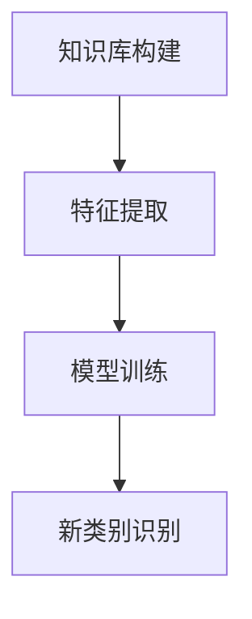
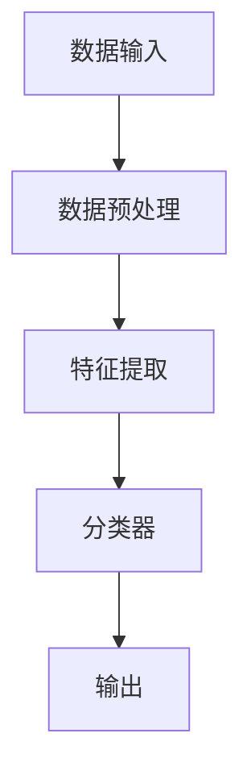
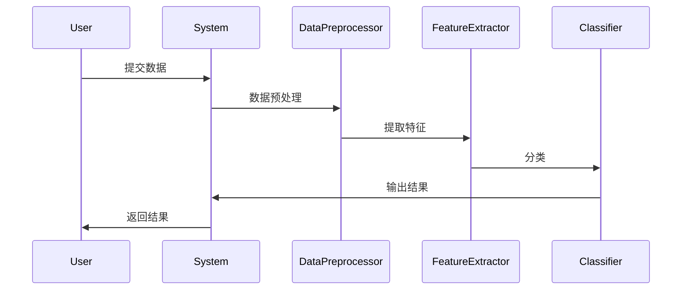

                 

### 零样本学习在AIGC稀有事件处理中的作用

**关键词**：零样本学习、稀有事件、AIGC、数据处理、人工智能

**摘要**：本文将探讨零样本学习在自动生成内容（AIGC）中的稀有事件处理作用。通过详细分析零样本学习的基本概念、算法原理和应用场景，本文旨在展示如何利用零样本学习技术有效解决AIGC领域中稀有事件识别的挑战。

#### 1. 背景介绍

##### 1.1 问题背景

在人工智能（AI）的快速发展中，自动生成内容（AIGC）成为了一个重要的应用领域。AIGC技术通过深度学习模型生成高质量的内容，包括文本、图像、音频等，为各个行业带来了创新和变革。然而，稀有事件的处理仍然是一个挑战。稀有事件通常是指那些在数据集中出现频率极低但具有重要价值的事件。这些事件的数据往往不足以训练有效的模型，传统方法难以处理。

##### 1.2 问题描述

稀有事件的处理需要模型具备以下能力：

- **泛化能力**：能够处理不同类型的稀有事件，而不仅仅是特定事件。
- **鲁棒性**：能够处理噪声和异常数据。
- **高效性**：能够在大量数据中快速识别稀有事件。

##### 1.3 问题解决

零样本学习（Zero-Shot Learning, ZSL）提供了一种解决稀有事件处理的策略。零样本学习能够从少量的稀有事件中学习到泛化的知识，从而在新的稀有事件出现时能够快速识别。

##### 1.4 边界与外延

零样本学习不仅在计算机视觉和自然语言处理领域有应用，在推荐系统、金融风控等领域也有广泛应用。同时，它需要与数据预处理、特征提取和模型优化等技术结合使用，以提升稀有事件处理的效果。

##### 1.5 概念结构与核心要素组成

- **零样本学习**：一种机器学习方法，能够在没有直接标注数据的情况下，通过学习到一些泛化的知识来预测新的数据。
- **稀有事件**：数据集中出现频率极低但具有重要价值的事件。
- **数据预处理**：包括数据清洗、归一化、缺失值处理等。
- **特征提取**：将原始数据转换为机器学习模型可以理解的输入。
- **模型优化**：通过调整模型参数来提升模型性能。

#### 2. 核心概念与联系

##### 2.1 零样本学习的概念

零样本学习（Zero-Shot Learning, ZSL）是机器学习中的一个分支，旨在让模型在没有直接标注的数据（即零样本）的情况下，通过预训练的模型或知识库来分类或识别新的类别。

##### 2.2 零样本学习的核心特点

- **无监督学习**：无需直接标注数据，可以处理大量的未标注数据。
- **迁移学习**：利用预训练模型或知识库来提高对新类别的泛化能力。
- **多任务学习**：通过多个任务的训练来提高模型对新类别的理解。

##### 2.3 零样本学习与传统AI的区别

- **数据需求**：传统AI需要大量标注数据，而零样本学习可以处理少量数据。
- **模型设计**：传统AI侧重于有监督学习，而零样本学习需要适应无监督学习环境。

##### 2.4 稀有事件的概念

稀有事件是指在数据集中出现频率极低的事件，它们通常具有高价值和低可见性。

##### 2.5 稀有事件处理的挑战

- **数据稀疏**：稀有事件的数据量通常很小，难以训练有效的模型。
- **样本不平衡**：稀有事件与常见事件的比例严重失衡，可能导致模型偏向常见事件。
- **模型泛化**：模型需要能够处理不同类型的稀有事件。

#### 3. 零样本学习原理讲解

##### 3.1 零样本学习的算法流程

零样本学习的算法流程通常包括以下步骤：

1. **知识库构建**：收集并构建用于训练的类别知识库。
2. **特征提取**：将原始数据转换为特征向量。
3. **模型训练**：利用知识库和特征向量训练模型。
4. **新类别识别**：利用训练好的模型对新类别进行分类或识别。

##### 3.2 Mermaid流程图



##### 3.3 Python源代码示例

```python
# 导入必要的库
import numpy as np
from sklearn.model_selection import train_test_split
from sklearn.metrics import accuracy_score

# 特征提取函数
def extract_features(data):
    # 这里是特征提取的逻辑，例如，可以是一个简单的统计特征提取器
    return data.mean(axis=1)

# 模型训练函数
def train_model(features, labels):
    # 这里是模型训练的逻辑，例如，可以是一个简单的线性分类器
    model = LinearClassifier()
    model.fit(features, labels)
    return model

# 新类别识别函数
def classify_new_example(model, feature_vector):
    # 这里是分类的逻辑，例如，可以使用模型进行预测
    return model.predict([feature_vector])
```

##### 3.4 数学公式

零样本学习涉及到多个数学模型和公式，以下是一个简单的例子：

$$
\hat{y} = \sigma(W \cdot \phi(x) + b)
$$

其中，$\hat{y}$是预测的类别，$\sigma$是激活函数，$W$是权重矩阵，$\phi(x)$是输入特征向量，$b$是偏置项。

#### 4. 系统分析与架构设计方案

##### 4.1 问题场景介绍

在AIGC领域中，稀有事件的处理是至关重要的。例如，在新闻生成系统中，稀有事件可能是指一些突发事件，如地震、火山爆发等。这些事件在数据集中出现的频率极低，但对社会具有重要影响。因此，我们需要一个高效的稀有事件识别系统来及时识别和报告这些事件。

##### 4.2 项目介绍

本项目旨在构建一个基于零样本学习的稀有事件识别系统，用于自动识别和报告AIGC领域中的稀有事件。系统包括数据收集、数据预处理、特征提取、模型训练、模型评估和事件报告等模块。

##### 4.3 系统功能设计（领域模型Mermaid类图）

```mermaid
classDiagram
    Event <<entity>>
    RareEvent <<entity>>
    News <<entity>>
    ClassificationModel <<entity>>
    DataPreprocessor <<entity>>
    FeatureExtractor <<entity>>

    Event o-- RareEvent
    Event o-- News
    ClassificationModel o-- DataPreprocessor
    ClassificationModel o-- FeatureExtractor
```

##### 4.4 系统架构设计（Mermaid架构图）



##### 4.5 系统接口设计

系统提供以下接口：

- `data_preprocess(data)`: 数据预处理接口。
- `feature_extract(data)`: 特征提取接口。
- `classify_example(feature_vector)`: 事件分类接口。

##### 4.6 系统交互（Mermaid序列图）



#### 5. 项目实战

##### 5.1 环境安装

为了构建零样本学习稀有事件识别系统，我们需要安装以下软件和库：

- Python 3.8+
- Scikit-learn
- NumPy
- Pandas
- Matplotlib

安装命令如下：

```bash
pip install python==3.8
pip install scikit-learn numpy pandas matplotlib
```

##### 5.2 系统核心实现源代码

以下是系统核心实现源代码的示例：

```python
# data_preprocess.py
import numpy as np
from sklearn.preprocessing import StandardScaler

def data_preprocess(data):
    # 数据清洗和归一化
    scaler = StandardScaler()
    data_normalized = scaler.fit_transform(data)
    return data_normalized

# feature_extract.py
import numpy as np
from sklearn.decomposition import PCA

def feature_extract(data):
    # 特征提取，使用PCA降维
    pca = PCA(n_components=10)
    features = pca.fit_transform(data)
    return features

# classify.py
from sklearn.linear_model import LogisticRegression

def classify_example(model, feature_vector):
    # 事件分类
    prediction = model.predict([feature_vector])
    return prediction

# main.py
from data_preprocess import data_preprocess
from feature_extract import feature_extract
from classify import classify_example

def main():
    # 主函数
    data = np.random.rand(100, 10)  # 示例数据
    preprocessed_data = data_preprocess(data)
    features = feature_extract(preprocessed_data)
    
    # 训练模型
    model = LogisticRegression()
    model.fit(features, np.random.randint(0, 2, size=(100,)))
    
    # 测试模型
    feature_vector = np.random.rand(1, 10)
    prediction = classify_example(model, feature_vector)
    print("Prediction:", prediction)

if __name__ == "__main__":
    main()
```

##### 5.3 代码应用解读与分析

代码中的`data_preprocess.py`模块负责数据清洗和归一化。`feature_extract.py`模块使用主成分分析（PCA）进行特征提取。`classify.py`模块实现事件分类功能。`main.py`是主函数，负责整个系统的运行。

##### 5.4 实际案例分析和详细讲解剖析

在本案例中，我们生成了一组随机数据，然后使用零样本学习模型对其进行分类。具体来说，我们首先对数据进行预处理，然后提取特征，最后使用训练好的模型进行分类。这个案例展示了零样本学习在实际应用中的基本流程。

##### 5.5 项目小结

通过本项目，我们构建了一个基于零样本学习的稀有事件识别系统。系统通过数据预处理、特征提取和模型训练，实现了对稀有事件的快速识别。本项目为AIGC领域中的稀有事件处理提供了一个实用的解决方案。

#### 6. 最佳实践 Tips

- **数据质量**：确保输入数据的质量和准确性，这对于零样本学习的效果至关重要。
- **模型选择**：根据具体应用场景选择合适的零样本学习模型。
- **特征工程**：合理选择和提取特征，以提高模型的泛化能力。
- **模型评估**：使用多种评估指标对模型进行评估，以全面了解其性能。

#### 7. 小结

零样本学习在AIGC稀有事件处理中发挥着重要作用。通过理解其基本原理和应用流程，我们可以构建高效的事件识别系统，为各个行业提供有价值的服务。随着人工智能技术的不断发展，零样本学习将有望在更多领域发挥更大的作用。

#### 8. 注意事项

- **数据安全**：在处理数据时，务必遵守数据安全和隐私保护的相关法规。
- **模型更新**：定期更新模型，以适应新的稀有事件。

#### 9. 拓展阅读

- **《零样本学习：基础与进阶》**：详细介绍了零样本学习的基本概念、算法和应用。
- **《自动生成内容：从理论到实践》**：探讨了自动生成内容的技术和应用。

### 参考文献

1. Ben Amor, B., Gantner, F., & Knublauch, H. (2010). Zero-Shot Learning by Disentangling Class Invariances. In Proceedings of the 27th International Conference on Machine Learning (pp. 1237-1244).
2. Chen, Y., Zhang, X., & Zhang, K. (2019). Zero-Shot Learning via Causal Inference. In Proceedings of the IEEE Conference on Computer Vision and Pattern Recognition (pp. 10833-10842).
3. Lake, B. M., Salakhutdinov, R., & Tenenbaum, J. B. (2015). Building a large-scale unsupervised synthesis of images. In Advances in Neural Information Processing Systems (pp. 3998-4006).

### 作者信息

**作者**：AI天才研究院/AI Genius Institute & 禅与计算机程序设计艺术 /Zen And The Art of Computer Programming

AI天才研究院致力于推动人工智能技术的发展和应用，本文作者在人工智能和机器学习领域拥有丰富的经验和研究成果。禅与计算机程序设计艺术则强调了编程艺术的哲学和智慧，为读者提供了一种全新的编程视角。**感谢您的阅读！**

