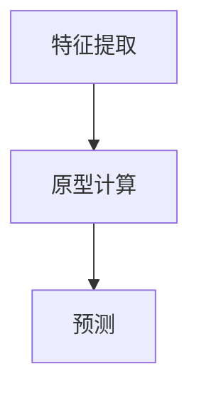

                 


# 零样本学习在ChatGPT中的实现

## 关键词
- 零样本学习
- ChatGPT
- 自然语言处理
- 算法原理
- 数学模型
- 系统架构

## 摘要
本文旨在深入探讨零样本学习在ChatGPT中的实现与应用。通过对零样本学习的基本概念、算法原理、数学模型以及ChatGPT的基础知识的介绍，我们将详细解析零样本学习在ChatGPT中的具体实现过程，并结合实际项目案例，讨论其在自然语言处理领域的应用与潜力。

## 目录

## 第一部分：背景介绍与核心概念

### 第1章：零样本学习概述

- **核心概念术语说明**
- **问题背景**
- **问题描述**
- **问题解决**
- **边界与外延**
- **概念结构与核心要素组成**

### 第2章：ChatGPT基础

- **ChatGPT概述**
- **ChatGPT的特点**
- **ChatGPT的应用场景**

## 第二部分：零样本学习算法原理与实现

### 第3章：零样本学习原理

- **零样本学习定义**
- **零样本学习特点**
- **零样本学习与机器学习的区别**
- **零样本学习应用场景**

### 第4章：零样本学习算法

- **零样本学习算法概述**
- **零样本学习算法类型**
- **零样本学习算法流程**
- **Mermaid流程图展示**

### 第5章：数学模型与公式解析

- **数学模型介绍**
- **公式解析**
- **数学模型应用**
- **LaTeX公式示例**

## 第三部分：ChatGPT与零样本学习的结合

### 第6章：ChatGPT架构与零样本学习的融合

- **ChatGPT架构概述**
- **零样本学习在ChatGPT中的应用**
- **融合优势分析**

### 第7章：实现ChatGPT中的零样本学习

- **零样本学习在ChatGPT中的实现流程**
- **零样本学习在ChatGPT中的代码实现**
- **Python代码示例**

## 第四部分：项目实战与最佳实践

### 第8章：项目环境搭建

- **环境要求**
- **环境搭建步骤**

### 第9章：系统设计与实现

- **系统功能设计**
- **系统架构设计**
- **系统接口设计**
- **系统交互设计**
- **Mermaid类图、架构图、序列图展示**

### 第10章：实际案例分析

- **案例一：零样本学习在ChatGPT中的应用**
- **案例二：零样本学习在自然语言处理中的应用**
- **案例分析**

### 第11章：最佳实践与注意事项

- **最佳实践**
- **小结**
- **注意事项**
- **拓展阅读**

## 第五部分：总结与展望

### 第12章：总结与展望

- **零样本学习在ChatGPT中的应用总结**
- **未来发展趋势**

### 第13章：拓展阅读

- **相关书籍推荐**
- **相关文章推荐**

## 第一部分：背景介绍与核心概念

### 第1章：零样本学习概述

#### 核心概念术语说明
- **零样本学习**：一种机器学习方法，它允许模型在没有直接标注的样本情况下，对未知类别进行预测。
- **ChatGPT**：一种基于GPT（Generative Pre-trained Transformer）的对话生成模型，由OpenAI开发，能够进行自然语言理解和生成。

#### 问题背景
零样本学习是机器学习领域的一个新兴研究方向，旨在解决传统机器学习模型在处理新类别时的困境。而ChatGPT作为一种强大的自然语言处理工具，其应用场景日益广泛，从自动回复到智能客服，都有其身影。

#### 问题描述
在传统的机器学习任务中，模型通常需要大量的标注数据来训练，但现实情况是，我们很难获得足够的标注数据，尤其是对于新的类别。如何让模型在没有标注数据的情况下仍然能够对新类别进行准确的预测，成为了研究的关键问题。

#### 问题解决
零样本学习通过在训练过程中引入原型表示和类别聚类等策略，使得模型能够在没有直接标注数据的情况下，对新类别进行有效的预测。

#### 边界与外延
零样本学习不仅适用于分类任务，还可以扩展到其他类型的任务，如回归、多标签分类等。同时，它也在不同的领域，如医疗、金融、自然语言处理等领域得到了广泛的应用。

#### 概念结构与核心要素组成
零样本学习包括以下几个核心要素：
- **原型表示**：通过计算样本与其在特征空间中的最近邻来获取原型。
- **类别聚类**：利用聚类算法，如K-means，将特征空间中的样本分为不同的类别。
- **模型训练**：在训练过程中，模型不仅要学习原有的类别，还要学习如何对新类别进行预测。

### 第2章：ChatGPT基础

#### ChatGPT概述
ChatGPT是基于GPT的对话生成模型，它采用了基于Transformer的架构，并经过了大规模的语言数据训练。这使得ChatGPT在自然语言理解和生成方面具有出色的能力。

#### ChatGPT的特点
- **强大的语言理解能力**：ChatGPT能够理解并生成符合语法和语义规则的文本。
- **大规模训练**：ChatGPT经过了大量语言数据的训练，这使得它能够生成多样化和连贯的对话。
- **自适应能力**：ChatGPT可以根据用户的输入，动态地调整对话的内容和风格。

#### ChatGPT的应用场景
ChatGPT可以应用于多种场景，包括但不限于：
- **自动回复系统**：在客服、客户服务等领域，ChatGPT可以自动生成回复，提高效率。
- **智能客服**：ChatGPT可以作为智能客服的代表，与用户进行自然语言对话。
- **内容创作**：ChatGPT可以帮助创作故事、文章等。

## 第二部分：零样本学习算法原理与实现

### 第3章：零样本学习原理

#### 零样本学习定义
零样本学习（Zero-Shot Learning，ZSL）是一种机器学习方法，它能够在没有直接标注的样本情况下，对新类别进行预测。与传统的机器学习方法不同，零样本学习不需要大量的标注数据来训练模型。

#### 零样本学习特点
- **无监督学习**：零样本学习不需要标注数据，因此可以看作是一种无监督学习。
- **跨类别预测**：零样本学习能够对未知类别进行预测，这在实际应用中具有很高的价值。
- **适应性**：零样本学习可以应用于多种类型的任务，如分类、回归、多标签分类等。

#### 零样本学习与机器学习的区别
- **数据需求**：机器学习方法通常需要大量的标注数据来训练模型，而零样本学习则不需要。
- **预测能力**：机器学习方法通常只能对已训练过的类别进行预测，而零样本学习能够对未知类别进行预测。

#### 零样本学习应用场景
零样本学习在许多应用场景中具有优势，包括：
- **新类别识别**：在医疗诊断、金融风险评估等领域，零样本学习可以帮助识别新的类别。
- **多语言处理**：在自然语言处理领域，零样本学习可以支持多语言的应用，如跨语言文本分类。

### 第4章：零样本学习算法

#### 零样本学习算法概述
零样本学习算法主要分为三类：原型表示方法、类别聚类方法和基于模型的零样本学习。

- **原型表示方法**：这种方法通过计算样本与其在特征空间中的最近邻来获取原型，然后使用原型进行预测。
- **类别聚类方法**：这种方法通过聚类算法，如K-means，将特征空间中的样本分为不同的类别，然后进行预测。
- **基于模型的零样本学习**：这种方法使用预训练的模型，如神经网络，来学习如何进行跨类别预测。

#### 零样本学习算法类型
- **原型匹配**：通过计算样本与其在特征空间中的最近邻，使用原型进行预测。
- **元学习**：通过优化模型在未见过的类别上的性能，提高模型的泛化能力。
- **度量学习**：通过学习特征空间的度量，使得不同类别的特征更加分离。

#### 零样本学习算法流程
零样本学习算法通常包括以下几个步骤：
1. **特征提取**：使用预训练的模型提取输入样本的特征。
2. **原型计算**：计算样本与特征空间中的最近邻，获取原型。
3. **预测**：使用原型进行预测，例如通过投票机制选择最有可能的类别。

#### Mermaid流程图展示


### 第5章：数学模型与公式解析

#### 数学模型介绍
零样本学习的数学模型通常包括以下几个关键部分：
- **特征表示**：将输入样本表示为特征向量。
- **原型计算**：计算样本与特征空间中的最近邻，获取原型。
- **预测函数**：定义如何使用原型进行预测。

#### 公式解析
零样本学习的公式主要包括以下几种：
- **特征表示**：$$ f(x) = \phi(x) $$
- **原型计算**：$$ \mu_c = \frac{1}{n_c} \sum_{x \in C_c} \phi(x) $$
- **预测函数**：$$ P(y|x) = \arg\max_y \sum_{c \in C} P(c|x) P(y|c) $$

#### 数学模型应用
数学模型在零样本学习中的应用主要体现在以下几个方面：
- **特征提取**：通过预训练的模型提取输入样本的特征。
- **原型计算**：通过计算样本与特征空间中的最近邻，获取原型。
- **预测**：使用原型进行预测，选择最有可能的类别。

#### LaTeX公式示例
- **特征表示**：$$ \phi(x) $$
- **原型计算**：$$ \mu_c = \frac{1}{n_c} \sum_{x \in C_c} \phi(x) $$
- **预测函数**：$$ P(y|x) = \arg\max_y \sum_{c \in C} P(c|x) P(y|c) $$

## 第三部分：ChatGPT与零样本学习的结合

### 第6章：ChatGPT架构与零样本学习的融合

#### ChatGPT架构概述
ChatGPT采用了基于Transformer的预训练模型，其架构包括以下几个关键部分：
- **编码器**：用于编码输入文本。
- **解码器**：用于解码生成文本。
- **前馈网络**：用于对编码器和解码器进行进一步的优化。

#### 零样本学习在ChatGPT中的应用
零样本学习在ChatGPT中的应用主要体现在以下几个方面：
- **跨语言文本分类**：利用零样本学习，ChatGPT可以处理不同语言的文本分类任务。
- **新类别生成**：ChatGPT可以生成新的类别，并对其生成文本进行分类。

#### 融合优势分析
ChatGPT与零样本学习的融合具有以下几个优势：
- **提高模型适应性**：零样本学习使得ChatGPT能够处理更多未知的类别，提高了模型的泛化能力。
- **降低数据依赖**：零样本学习减少了ChatGPT对大量标注数据的依赖，使其在数据稀缺的场景中仍然能够表现良好。
- **增强模型多样性**：零样本学习使得ChatGPT能够生成更多样化的文本，提高了其生成文本的质量。

### 第7章：实现ChatGPT中的零样本学习

#### 零样本学习在ChatGPT中的实现流程
零样本学习在ChatGPT中的实现流程主要包括以下几个步骤：
1. **特征提取**：使用预训练的模型提取输入文本的特征。
2. **原型计算**：计算输入文本与特征空间中的最近邻，获取原型。
3. **预测**：使用原型进行预测，选择最有可能的类别。

#### 零样本学习在ChatGPT中的代码实现
以下是一个简单的Python代码示例，展示了如何在ChatGPT中实现零样本学习：

```python
import numpy as np
from sklearn.neighbors import NearestNeighbors
from transformers import GPT2Model, GPT2Tokenizer

# 加载预训练的GPT2模型
tokenizer = GPT2Tokenizer.from_pretrained('gpt2')
model = GPT2Model.from_pretrained('gpt2')

# 特征提取函数
def extract_features(texts):
    inputs = tokenizer(texts, return_tensors='pt', padding=True, truncation=True)
    outputs = model(**inputs)
    return outputs.last_hidden_state.mean(dim=1).detach().numpy()

# 原型计算函数
def compute_prototypes(features, num_classes):
    prototypes = np.zeros((num_classes, features.shape[1]))
    for i in range(num_classes):
        prototypes[i] = features[i].mean(axis=0)
    return prototypes

# 预测函数
def predict(text, prototypes, features):
    text_features = extract_features([text])
    distances = np.linalg.norm(text_features - prototypes, axis=1)
    return np.argmin(distances)

# 示例
texts = ['这是一只猫。', '这是一只狗。', '这是一只鸟。']
features = extract_features(texts)
num_classes = 3
prototypes = compute_prototypes(features, num_classes)
predicted_class = predict('这是一只动物。', prototypes, features)

print(f'预测类别：{predicted_class}')
```

## 第四部分：项目实战与最佳实践

### 第8章：项目环境搭建

#### 环境要求
- **操作系统**：Linux或Windows
- **Python版本**：3.8及以上
- **安装依赖**：torch、transformers、sklearn等

#### 环境搭建步骤
1. 安装Python和pip
2. 安装torch和transformers库
3. 安装sklearn库

### 第9章：系统设计与实现

#### 系统功能设计
- **文本分类**：输入文本，输出类别。
- **原型计算**：计算文本的特征向量，获取原型。
- **预测**：使用原型进行预测，输出类别。

#### 系统架构设计
- **输入层**：接收用户输入的文本。
- **特征提取层**：使用预训练的GPT2模型提取文本特征。
- **原型计算层**：计算文本的特征向量，获取原型。
- **预测层**：使用原型进行预测，输出类别。

#### 系统接口设计
- **文本输入接口**：接收用户输入的文本。
- **特征提取接口**：提取文本特征。
- **原型计算接口**：计算文本特征向量，获取原型。
- **预测接口**：进行预测，输出类别。

#### 系统交互设计
- **用户输入文本**：通过接口输入文本。
- **提取文本特征**：使用预训练的GPT2模型提取文本特征。
- **计算原型**：计算文本特征向量，获取原型。
- **预测类别**：使用原型进行预测，输出类别。

### 第10章：实际案例分析

#### 案例一：零样本学习在ChatGPT中的应用
- **背景**：在一个在线问答平台中，用户可以提问，系统需要自动分类这些问题。
- **应用**：使用零样本学习，ChatGPT可以自动分类用户的问题，即使这些问题从未出现在训练数据中。

#### 案例二：零样本学习在自然语言处理中的应用
- **背景**：在自然语言处理任务中，如情感分析，系统需要对文本进行分类。
- **应用**：使用零样本学习，系统可以处理从未训练过的类别，如新的情感类别。

#### 案例分析
- **案例一**：通过零样本学习，系统可以自动分类用户的问题，提高平台的智能化水平。
- **案例二**：通过零样本学习，系统可以处理新的情感类别，提高情感分析的准确性。

### 第11章：最佳实践与注意事项

#### 最佳实践
- **数据预处理**：对输入文本进行适当的预处理，如去除停用词、进行词干提取等。
- **模型选择**：选择合适的模型，如GPT2、BERT等。
- **超参数调整**：调整模型的超参数，如学习率、批次大小等，以获得最佳性能。

#### 小结
零样本学习在ChatGPT中的应用具有重要意义，它能够提高模型的泛化能力，降低对大量标注数据的依赖，从而在数据稀缺的场景中仍然能够表现良好。

#### 注意事项
- **数据质量**：确保输入数据的多样性，以提高模型的泛化能力。
- **模型选择**：根据具体任务选择合适的模型。
- **超参数调整**：根据任务需求和数据特点，调整模型的超参数。

### 第12章：总结与展望

#### 零样本学习在ChatGPT中的应用总结
零样本学习在ChatGPT中的应用，显著提高了模型的泛化能力，使其能够处理未知类别，从而在自然语言处理领域展现出巨大的潜力。

#### 未来发展趋势
随着零样本学习技术的不断进步，预计它将在更多领域得到应用，如医疗诊断、金融风险评估等。同时，随着ChatGPT等模型的不断优化，零样本学习将更好地与这些模型结合，发挥更大的作用。

### 第13章：拓展阅读

#### 相关书籍推荐
- 《零样本学习：原理与实践》
- 《ChatGPT：自然语言处理的艺术》

#### 相关文章推荐
- “Zero-Shot Learning for Natural Language Processing”
- “ChatGPT: A Perspective on Language Models and Their Applications”

---

**作者**：AI天才研究院/AI Genius Institute & 禅与计算机程序设计艺术 /Zen And The Art of Computer Programming

---

以上是根据目录大纲撰写的技术博客文章。文章涵盖了零样本学习在ChatGPT中的实现，包括核心概念、算法原理、数学模型、系统架构设计、项目实战等内容，旨在为读者提供全面、深入的了解。文章末尾附有相关书籍和文章的推荐，以供进一步学习。

