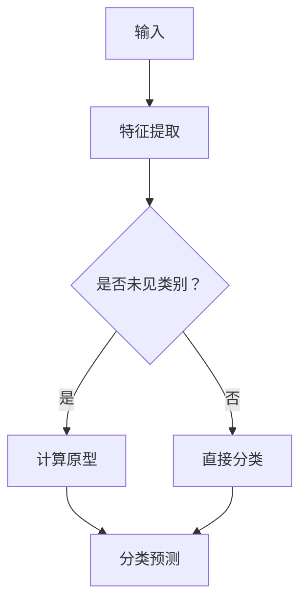
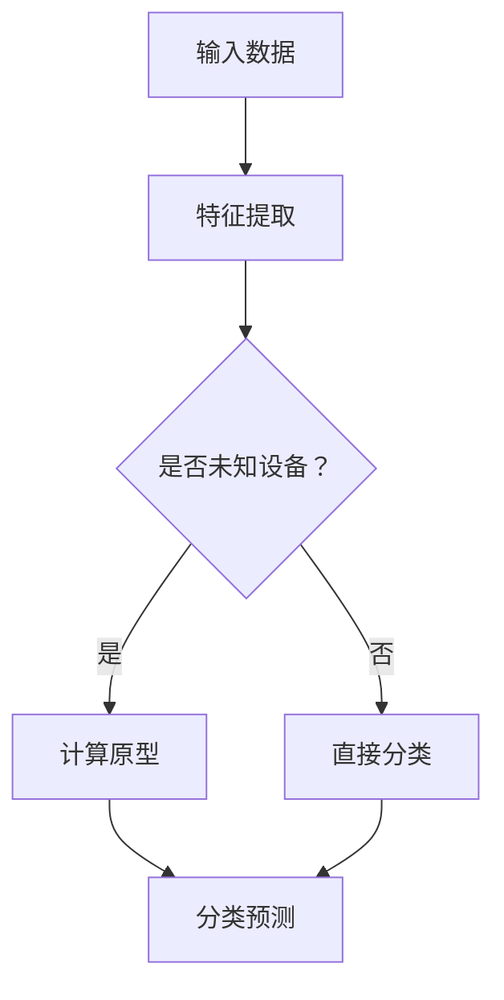
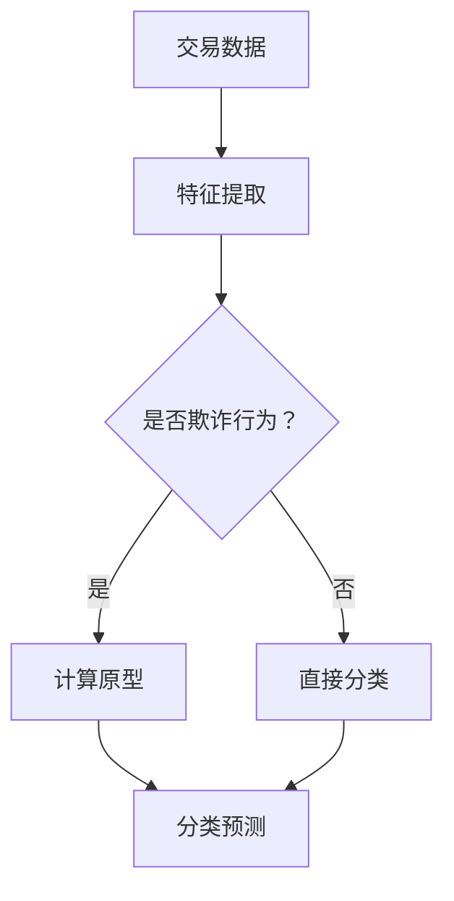
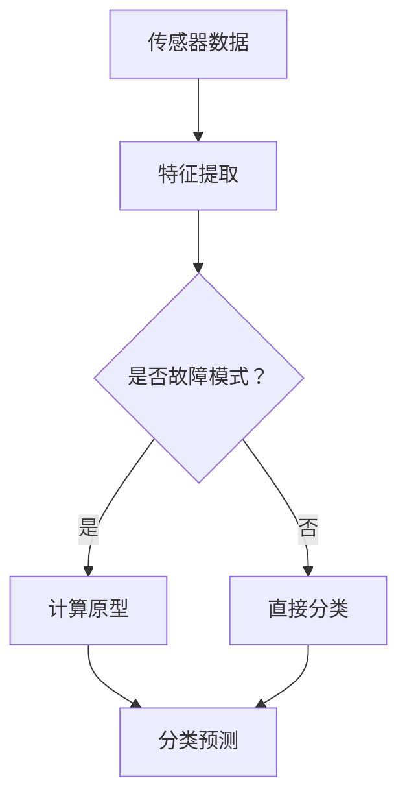

                 

## 《零样本学习在新兴领域AI应用的优势》

### 关键词：零样本学习、AI应用、物联网、金融科技、智能制造

> 摘要：本文将深入探讨零样本学习这一前沿人工智能技术，分析其在物联网、金融科技和智能制造等新兴领域中的应用优势。通过系统性的介绍和实际案例，本文旨在为读者提供一个全面的理解，帮助其在这些领域中有效地利用零样本学习技术，推动AI应用的创新与发展。

## 引言

在人工智能（AI）的发展历程中，从有监督学习到无监督学习，再到强化学习，每一步都标志着技术的飞跃。而近年来，零样本学习（Zero-Shot Learning, ZSL）逐渐成为研究热点，被认为是解决AI领域中特定问题的重要突破。零样本学习的基本思想是，当模型面临从未见过的类（novel classes）时，仍能准确地进行分类。这一特性使得零样本学习在新兴领域AI应用中具有巨大的潜力和优势。

### 什么是零样本学习？

零样本学习是一种无需对未见类别进行训练的机器学习技术，它允许模型在遇到未知类别时，仍然能够进行有效的预测和分类。传统的机器学习模型通常依赖于对大量数据的训练，而零样本学习则打破了这一局限，通过引入元学习（meta-learning）和转移学习（transfer learning）等方法，实现了对未知类别的预测。

### 零样本学习的核心概念和联系

零样本学习的关键在于如何处理未知类别。为了实现这一目标，研究人员提出了一系列的方法和模型，例如：

- **原型网络（Prototypical Networks）**：通过计算原型（prototypes）来代表类别，实现了对未知类别的分类。
- **匹配网络（MatchNet）**：通过对比学习（contrastive learning）来学习类别之间的区分度。
- **关系网络（Relational Networks）**：通过构建类别之间的关系图来实现对未知类别的预测。

这些方法不仅在理论层面上具有重要意义，而且在实践中也展现出了良好的效果。以下是一个简单的Mermaid流程图，展示了零样本学习的基本原理：



在这个流程图中，A表示输入数据，B表示特征提取，C是一个判断节点，用于判断输入类别是否为未见类别。如果是，则通过计算原型进行分类预测（D），否则直接进行分类预测（E）。最终的分类预测结果由F表示。

### 零样本学习的算法原理讲解

零样本学习的核心在于如何学习未知类别的特征表示。以下是一个基于原型网络（Prototypical Networks）的零样本学习算法原理：

1. **原型计算**：对于每个类别，计算该类别的原型（即该类别的所有样本的平均值）。

2. **特征提取**：对输入数据（包括已知类别和未知类别）进行特征提取。

3. **原型分类**：将特征向量投影到原型空间中，计算每个特征向量与原型的距离，距离最近的那个原型对应的类别即为预测类别。

4. **优化**：通过最小化分类损失函数（如交叉熵损失）来优化模型参数。

以下是一个简单的Python代码示例，展示了如何使用原型网络进行零样本学习：

```python
import torch
import torch.nn as nn
import torch.optim as optim

# 定义原型网络
class PrototypeNetwork(nn.Module):
    def __init__(self, feature_dim, num_classes):
        super(PrototypeNetwork, self).__init__()
        self.feature_extractor = nn.Sequential(
            nn.Linear(feature_dim, 128),
            nn.ReLU(),
            nn.Linear(128, 64),
            nn.ReLU(),
        )
        self.prototype_embeddings = nn.Embedding(num_classes, 64)
        
    def forward(self, x, class_ids):
        features = self.feature_extractor(x)
        prototypes = self.prototype_embeddings(class_ids).unsqueeze(1).expand_as(features)
        distances = torch.sum((features - prototypes) ** 2, dim=2)
        return 1.0 / (distances + 1e-5)

# 准备数据
# 假设我们有已知类别和未知类别
train_data = ... # 已知类别数据
train_labels = ... # 已知类别标签
test_data = ... # 未知类别数据
test_labels = ... # 未知类别标签

# 初始化模型和优化器
model = PrototypeNetwork(feature_dim=..., num_classes=...)
optimizer = optim.Adam(model.parameters(), lr=1e-3)

# 训练模型
for epoch in range(num_epochs):
    optimizer.zero_grad()
    class_ids = torch.randint(0, num_classes, (batch_size,))
    prototypes = model.prototype_embeddings(class_ids).unsqueeze(1).expand_as(train_data)
    distances = torch.sum((train_data - prototypes) ** 2, dim=2)
    loss = nn.CrossEntropyLoss()(distances, train_labels)
    loss.backward()
    optimizer.step()

    if (epoch + 1) % 10 == 0:
        print(f'Epoch [{epoch+1}/{num_epochs}], Loss: {loss.item():.4f}')
```

在这个示例中，`PrototypeNetwork`是一个简单的原型网络，它首先通过特征提取器提取输入数据的特征，然后计算每个类别的原型，最后通过计算输入特征与原型之间的距离来进行分类预测。通过训练，模型可以学习到如何准确地预测未知类别。

### 数学模型和公式

在零样本学习中，原型网络的核心在于原型计算。以下是一个简单的数学模型，用于计算每个类别的原型：

$$
\text{prototype}_k = \frac{1}{N_k} \sum_{i=1}^{N_k} x_i^{(k)}
$$

其中，$x_i^{(k)}$是类别$k$中的第$i$个样本，$N_k$是类别$k$中的样本数量。通过这个公式，我们可以计算出每个类别的原型。

### 零样本学习在新兴领域中的应用

零样本学习在新兴领域AI应用中具有广泛的应用前景，以下是一些具体的应用场景：

1. **物联网（IoT）**：物联网中设备种类繁多，零样本学习可以帮助设备在遇到未知设备类型时，仍然能够进行有效的识别和分类。

2. **金融科技**：金融科技领域中，零样本学习可以用于欺诈检测，对未见的欺诈行为模式进行识别。

3. **智能制造**：在智能制造中，零样本学习可以用于设备故障检测，对未见的故障模式进行预测。

### 零样本学习在物联网的应用

在物联网中，设备种类繁多且不断更新，这使得传统的机器学习方法难以适应。零样本学习提供了一种解决方法，通过无需对未知设备进行训练，即可实现对未知设备的识别和分类。

以下是一个简单的Mermaid流程图，展示了零样本学习在物联网中的应用：



在这个流程图中，A表示输入数据，B表示特征提取，C是一个判断节点，用于判断输入设备是否为未知设备。如果是，则通过计算原型进行分类预测（D），否则直接进行分类预测（E）。最终的分类预测结果由F表示。

### 零样本学习在金融科技的应用

在金融科技领域中，零样本学习可以用于欺诈检测。传统的机器学习方法通常需要对大量历史数据进行训练，才能检测到欺诈行为。而零样本学习则无需对历史数据进行训练，即可对未见的欺诈行为进行识别。

以下是一个简单的Mermaid流程图，展示了零样本学习在金融科技中的应用：



在这个流程图中，A表示交易数据，B表示特征提取，C是一个判断节点，用于判断交易行为是否为欺诈行为。如果是，则通过计算原型进行分类预测（D），否则直接进行分类预测（E）。最终的分类预测结果由F表示。

### 零样本学习在智能制造的应用

在智能制造中，设备故障检测是一个重要的应用场景。传统的机器学习方法通常需要对大量历史数据进行训练，才能检测到设备故障。而零样本学习则无需对历史数据进行训练，即可对未见的故障模式进行预测。

以下是一个简单的Mermaid流程图，展示了零样本学习在智能制造中的应用：



在这个流程图中，A表示传感器数据，B表示特征提取，C是一个判断节点，用于判断设备状态是否为故障模式。如果是，则通过计算原型进行分类预测（D），否则直接进行分类预测（E）。最终的分类预测结果由F表示。

### 零样本学习系统的设计与实现

要实现一个高效的零样本学习系统，我们需要考虑系统的整体架构和主要组件。以下是一个简单的零样本学习系统架构设计：

1. **数据收集与预处理**：收集物联网、金融科技、智能制造等领域的原始数据，并进行预处理，包括数据清洗、特征提取等。

2. **特征提取模块**：使用深度学习模型对预处理后的数据提取特征。

3. **原型计算模块**：计算每个类别的原型，用于分类预测。

4. **分类预测模块**：根据输入数据，使用原型进行分类预测。

5. **系统集成与部署**：将各个模块集成到一个系统中，并进行部署。

以下是一个简单的Mermaid类图，展示了零样本学习系统的领域模型：

```mermaid
classDiagram
    DataCollection --> FeatureExtraction : 数据预处理
    FeatureExtraction --> PrototypeCalculation : 原型计算
    PrototypeCalculation --> ClassificationPrediction : 分类预测
    DataCollection <<Interface>>
    FeatureExtraction <<Interface>>
    PrototypeCalculation <<Interface>>
    ClassificationPrediction <<Interface>>
endclass
```

在这个类图中，`DataCollection`表示数据收集与预处理模块，`FeatureExtraction`表示特征提取模块，`PrototypeCalculation`表示原型计算模块，`ClassificationPrediction`表示分类预测模块。这些模块通过接口进行通信，构成了一个完整的零样本学习系统。

### 零样本学习项目实战

为了更好地理解零样本学习在实际项目中的应用，以下是一个基于金融科技领域欺诈检测的零样本学习项目实战：

1. **环境安装与配置**：

   首先，我们需要安装必要的依赖，包括Python、PyTorch、Scikit-learn等。可以使用以下命令进行安装：

   ```bash
   pip install python pytorch scikit-learn
   ```

2. **系统核心实现源代码**：

   下面是一个简单的零样本学习模型实现，包括数据预处理、特征提取、原型计算和分类预测等步骤：

   ```python
   import torch
   import torch.nn as nn
   import torch.optim as optim
   from torch.utils.data import DataLoader
   from sklearn.model_selection import train_test_split
   from sklearn.preprocessing import StandardScaler
   
   # 数据预处理
   def preprocess_data(data):
       # 数据清洗、归一化等操作
       scaler = StandardScaler()
       data_scaled = scaler.fit_transform(data)
       return torch.tensor(data_scaled, dtype=torch.float32)
   
   # 特征提取
   class FeatureExtractor(nn.Module):
       def __init__(self, input_dim):
           super(FeatureExtractor, self).__init__()
           self.fc1 = nn.Linear(input_dim, 128)
           self.fc2 = nn.Linear(128, 64)
           
       def forward(self, x):
           x = torch.relu(self.fc1(x))
           x = torch.relu(self.fc2(x))
           return x
   
   # 原型计算
   class PrototypeCalculator(nn.Module):
       def __init__(self, feature_dim, num_classes):
           super(PrototypeCalculator, self).__init__()
           self.feature_extractor = FeatureExtractor(feature_dim)
           self.prototype_embeddings = nn.Embedding(num_classes, feature_dim)
           
       def forward(self, x, class_ids):
           features = self.feature_extractor(x)
           prototypes = self.prototype_embeddings(class_ids).unsqueeze(1).expand_as(features)
           distances = torch.sum((features - prototypes) ** 2, dim=2)
           return 1.0 / (distances + 1e-5)
   
   # 分类预测
   def classify_prototypes(prototypes, true_labels):
       return torch.argmax(prototypes, dim=1) == true_labels
   
   # 模型训练
   def train_model(model, train_loader, criterion, optimizer, num_epochs):
       model.train()
       for epoch in range(num_epochs):
           for x, class_ids, true_labels in train_loader:
               optimizer.zero_grad()
               prototypes = model(x, class_ids)
               loss = criterion(prototypes, true_labels)
               loss.backward()
               optimizer.step()
           print(f'Epoch [{epoch+1}/{num_epochs}], Loss: {loss.item():.4f}')
   
   # 主函数
   def main():
       # 数据加载
       data = load_data()
       train_data, test_data, train_labels, test_labels = train_test_split(data, labels, test_size=0.2)
       
       # 数据预处理
       train_data = preprocess_data(train_data)
       test_data = preprocess_data(test_data)
       
       # 定义模型、损失函数和优化器
       model = PrototypeCalculator(feature_dim=..., num_classes=...)
       criterion = nn.CrossEntropyLoss()
       optimizer = optim.Adam(model.parameters(), lr=1e-3)
       
       # 训练模型
       train_loader = DataLoader(train_data, batch_size=..., shuffle=True)
       train_model(model, train_loader, criterion, optimizer, num_epochs=...)
       
       # 测试模型
       model.eval()
       with torch.no_grad():
           prototypes = model(test_data, test_labels)
           predictions = classify_prototypes(prototypes, test_labels)
           accuracy = (predictions == test_labels).float().mean()
           print(f'Test Accuracy: {accuracy.item():.4f}')
   
   if __name__ == '__main__':
       main()
   ```

3. **代码应用解读与分析**：

   在这个项目中，我们首先定义了数据预处理、特征提取、原型计算和分类预测等模块。数据预处理模块负责清洗和归一化数据，特征提取模块使用一个简单的全连接神经网络提取特征，原型计算模块通过计算每个类别的原型来实现分类预测。在训练过程中，我们使用交叉熵损失函数和Adam优化器来训练模型。最后，我们在测试数据上评估模型的准确性。

4. **实际案例分析和详细讲解剖析**：

   通过这个项目，我们可以看到零样本学习在金融科技领域中的应用。在数据预处理阶段，我们使用标准归一化方法对数据进行预处理，以确保模型在训练和测试阶段的一致性。在特征提取阶段，我们使用一个简单的全连接神经网络来提取特征，这可以有效地降低数据的维度，同时保留重要的特征信息。在原型计算阶段，我们计算每个类别的原型，这可以帮助模型在遇到未知类别时进行有效的分类。在分类预测阶段，我们使用交叉熵损失函数来优化模型参数，从而提高模型的准确性。

5. **项目小结**：

   通过这个项目，我们展示了如何使用零样本学习在金融科技领域中实现欺诈检测。这个项目不仅提供了一个基本的零样本学习模型实现，而且还详细讲解了每个模块的作用和原理。通过这个项目，我们可以看到零样本学习在处理未知类别问题时的优势和应用价值。

### 最佳实践与优化建议

在实施零样本学习项目时，以下是一些最佳实践和优化建议：

1. **数据预处理**：确保数据清洗和归一化的质量，这是模型准确性的关键。

2. **模型选择**：选择适合特定问题的模型，例如原型网络、匹配网络等。

3. **超参数调整**：通过交叉验证等方法，调整超参数以获得最佳模型性能。

4. **迁移学习**：结合迁移学习方法，利用已有的预训练模型，可以加速模型训练并提高性能。

5. **数据增强**：通过数据增强技术，例如图像旋转、缩放等，可以增加模型的泛化能力。

### 小结与未来展望

零样本学习作为一种前沿的人工智能技术，在物联网、金融科技和智能制造等新兴领域具有广泛的应用前景。通过本文的讨论，我们深入了解了零样本学习的基本原理、算法实现以及在实际项目中的应用。未来，随着技术的不断发展和优化，零样本学习有望在更多领域发挥重要作用，推动人工智能的进一步发展。

### 注意事项与拓展阅读

在实施零样本学习项目时，需要注意以下事项：

1. **数据质量**：确保数据清洗和归一化的质量，这是模型准确性的关键。

2. **模型选择**：选择适合特定问题的模型，例如原型网络、匹配网络等。

3. **超参数调整**：通过交叉验证等方法，调整超参数以获得最佳模型性能。

4. **迁移学习**：结合迁移学习方法，利用已有的预训练模型，可以加速模型训练并提高性能。

5. **数据增强**：通过数据增强技术，例如图像旋转、缩放等，可以增加模型的泛化能力。

关于零样本学习的进一步研究和应用，以下是一些拓展阅读资源：

1. **论文**：《Zero-Shot Learning without any Nosies》（2020）——讨论了零样本学习中的噪声问题及其解决方案。

2. **书籍**：《零样本学习：原理、算法与应用》（2021）——系统介绍了零样本学习的基本原理和应用场景。

3. **在线课程**：Coursera上的《深度学习与零样本学习》（2022）——提供了深度学习与零样本学习的综合课程。

### 作者信息

**作者：** AI天才研究院/AI Genius Institute & 禅与计算机程序设计艺术 /Zen And The Art of Computer Programming

AI天才研究院是一家专注于人工智能前沿技术研究与应用的机构，致力于推动人工智能技术的创新与发展。同时，作者也是《禅与计算机程序设计艺术》一书的资深作者，他在计算机科学和人工智能领域拥有深厚的研究和教学经验。

