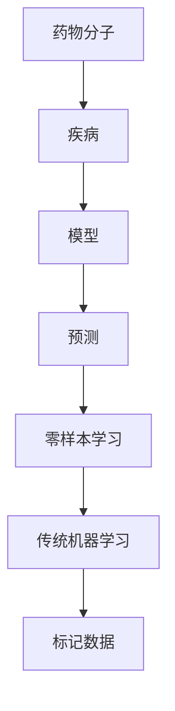

                 

### 第一部分：引言与背景

#### 1.1 研发新药的挑战与机遇

**核心概念术语说明：**
- 新药研发（New Drug Development）：指开发全新药物或改进现有药物的过程。
- 成本压力（Cost Pressure）：指新药研发过程中所涉及的高昂成本。
- 时间压力（Time Pressure）：指新药研发过程中对时间的高要求。

**问题背景：**
新药研发是一个复杂且耗时的过程，通常需要数年时间以及数百万甚至数十亿美元的投资。这一过程面临着巨大的成本压力和时间压力，导致许多药物研发项目无法按时完成或超出预算。此外，传统药物发现方法依赖于大量实验和数据分析，效率低下，且容易受到技术限制。

**问题描述：**
如何通过技术手段提高新药研发的效率和降低成本？

**问题解决：**
随着人工智能（AI）技术的发展，AI在药物研发中的应用逐渐成为解决上述问题的有效手段。特别是在零样本学习（Zero-Shot Learning, ZSL）领域，通过提前学习大量未知类别的数据，使其能够对新类别进行有效预测和分类，从而在一定程度上解决传统方法的局限性。

**边界与外延：**
零样本学习在药物研发中的应用范围不仅限于药物分子设计和筛选，还可以涉及疾病诊断、个性化治疗等多个方面。同时，随着技术的不断进步，其应用范围也将进一步扩展。

**概念结构与核心要素组成：**
零样本学习的核心要素包括：
- **数据预处理**：对药物分子和疾病数据进行有效的预处理，以便更好地应用于模型训练。
- **模型设计**：选择合适的零样本学习模型，如对抗生成网络（GAN）和迁移学习（Transfer Learning）。
- **算法优化**：通过优化算法参数，提高模型的预测准确性和鲁棒性。

#### 1.2 零样本学习概念介绍

**核心概念原理：**
零样本学习是一种机器学习方法，旨在使模型能够在未见过的类别上实现准确的预测和分类。与传统的监督学习（Supervised Learning）和半监督学习（Semi-Supervised Learning）不同，零样本学习不需要对未见过的类别进行标记。

**概念属性特征对比表格：**

| 特征对比项 | 零样本学习 | 传统机器学习 |
| --- | --- | --- |
| 数据需求 | 无需对未见过的类别进行标记 | 需要对所有类别进行标记 |
| 预测能力 | 能够对未见过的类别进行有效预测 | 主要针对已标记的数据进行预测 |
| 适用场景 | 新药研发、跨领域问题等 | 数据量较大、标记数据丰富的场景 |

**ER实体关系图架构：**

#### 1.3 零样本学习在新药研发中的应用

**零样本学习在药物分子设计中的应用：**
通过零样本学习，可以对药物分子进行结构预测和属性预测，从而优化药物分子设计过程。例如，利用对抗生成网络（GAN）生成新的药物分子结构，并通过零样本学习模型进行筛选，提高新药设计的效率。

**零样本学习在药物筛选和优化中的应用：**
零样本学习可以用于药物筛选和优化，通过提前学习大量药物-疾病数据，使其能够对新药物进行有效预测和分类。例如，利用迁移学习（Transfer Learning）将已有药物的属性和效果应用于新药物，从而加速药物筛选过程。

**零样本学习在疾病诊断和治疗中的应用：**
零样本学习还可以应用于疾病诊断和治疗，通过对大量健康和疾病样本进行学习，使其能够对新病例进行有效诊断。例如，利用零样本学习模型对癌症患者进行分类和预测，提高疾病诊断的准确性和效率。

### 摘要

本文首先介绍了新药研发的挑战与机遇，并引入了零样本学习这一概念。通过对零样本学习的原理和其在药物研发中的应用进行详细解析，本文探讨了零样本学习如何提高药物分子设计、药物筛选和疾病诊断的效率。最后，本文总结了零样本学习在药物研发中的未来应用前景和面临的挑战，为该领域的研究和实践提供了有益的参考。

---

文章标题：**零样本学习在新药研发AI中的应用前景**

关键词：**零样本学习，新药研发，AI，药物分子设计，药物筛选，疾病诊断**

摘要：本文探讨了零样本学习在新药研发中的应用前景，包括其在药物分子设计、药物筛选和疾病诊断等方面的应用。通过详细解析零样本学习的原理和算法，本文分析了其在提高药物研发效率和降低成本方面的潜力。同时，本文也讨论了零样本学习在药物研发中面临的挑战和未来发展方向，为该领域的研究和实践提供了参考。

