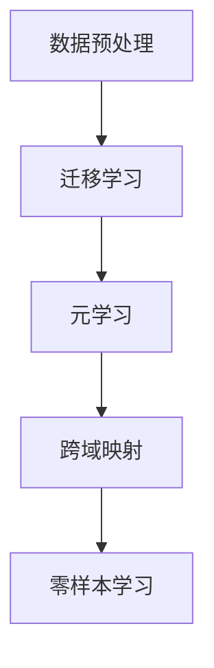
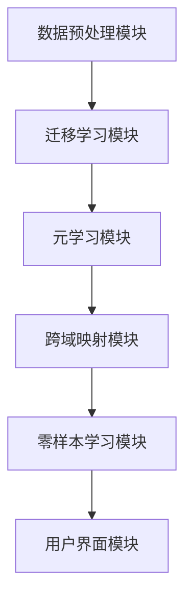
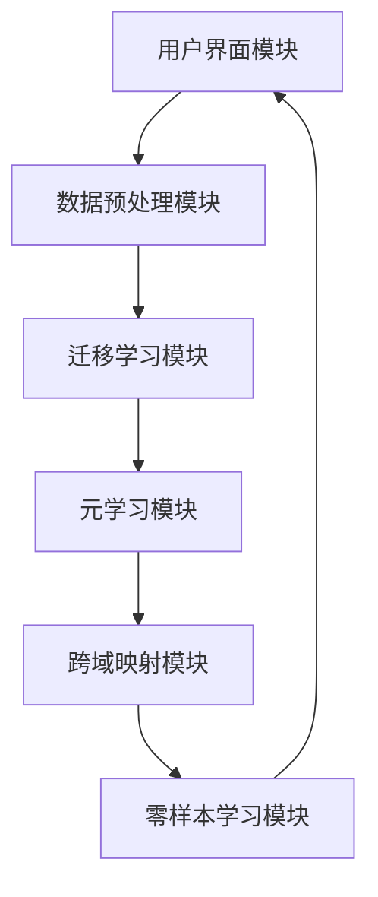

                 

# 零样本思维链在实际应用中的挑战与对策

## 关键词
- 零样本学习
- 少样本学习
- 先验知识
- 迁移学习
- 元学习
- 跨域映射

## 摘要
本文探讨了零样本思维链在实际应用中的挑战与对策。首先，介绍了零样本思维链的概念及其重要性，随后详细分析了其核心概念与属性特征对比，并通过ER实体关系图架构展示了各要素之间的关联。接着，文章深入讲解了零样本思维链的算法原理，并利用Python源代码进行了详细阐述。最后，本文通过系统分析与架构设计方案，以及项目实战，展示了零样本思维链在具体应用中的实施方法和效果。

## 1. 引言：零样本思维链的概念与重要性

### 1.1 问题背景

在当今的信息时代，人工智能（AI）技术飞速发展，特别是在机器学习、深度学习等领域取得了显著的成果。然而，面对日益复杂的现实问题，传统的机器学习模型在数据量较大、标注质量较高的情况下表现优异，但在零样本学习（Zero-shot Learning，ZSL）和少样本学习（Few-shot Learning，FSL）领域，即数据样本稀少或无标注时，其性能往往大打折扣。这一问题不仅制约了AI技术的广泛应用，也限制了AI在许多实际场景中的决策能力。

零样本学习和少样本学习是机器学习领域中的两大难题，它们在实际应用中广泛存在，例如新产品的分类、新疾病的诊断、个性化推荐系统等。这些场景通常无法提供大量的标注数据，或者数据标注的成本极高。因此，研究零样本思维链在实际应用中的挑战与对策，对于提升AI技术的实用性和决策能力具有重要意义。

### 1.2 问题描述

零样本学习是指在没有直接训练数据的情况下，模型能够通过预训练或迁移学习等方式，识别或分类从未见过的新类别。少样本学习则是针对训练数据极为有限的情况进行学习。这两类问题在实际应用中极为常见，如新产品的分类、新疾病的诊断、个性化推荐系统等。因此，研究零样本思维链在实际应用中的挑战与对策，对于提升AI技术的实用性和决策能力具有重要意义。

### 1.3 问题解决

解决零样本和少样本学习问题，首先需要理解零样本思维链的概念。零样本思维链是一种基于先验知识、迁移学习和元学习等技术的综合方法，通过构建跨域映射、知识融合和推理机制，使得模型能够在样本稀少或无标注的情况下进行有效学习和决策。

### 1.4 边界与外延

零样本思维链的研究不仅局限于计算机视觉、自然语言处理等AI领域，还可以扩展到推荐系统、智能医疗、金融风控等多个应用场景。因此，其边界和适用范围非常广泛，具有巨大的研究价值和商业潜力。

### 1.5 概念结构与核心要素组成

零样本思维链的核心概念包括先验知识、迁移学习、元学习和跨域映射。这些概念相互联系，共同构成了零样本思维链的理论基础。具体来说：

- **先验知识**：通过已有数据和领域知识，为模型提供初始的知识基础。
- **迁移学习**：利用已有的预训练模型，将知识迁移到新的任务中。
- **元学习**：通过学习模型的学习过程，提高模型在新任务上的适应能力。
- **跨域映射**：建立不同领域之间的映射关系，使得模型能够在不同领域之间迁移知识。

## 2. 核心概念与属性特征对比

### 2.1 先验知识

**定义**：先验知识是指在没有直接训练数据的情况下，通过已有数据和领域知识为模型提供初始的知识基础。

**属性特征对比**：

| 属性特征       | 说明                                                         |
| -------------- | ------------------------------------------------------------ |
| 获取方式       | 经验积累、数据采集                                         |
| 应用范围       | 跨领域迁移                                                 |
| 效率           | 较高                                                        |
| 准确性         | 受限于领域知识丰富程度                                     |

### 2.2 迁移学习

**定义**：迁移学习是利用已有的预训练模型，将知识迁移到新的任务中。

**属性特征对比**：

| 属性特征       | 说明                                                         |
| -------------- | ------------------------------------------------------------ |
| 知识迁移       | 预训练模型到新任务                                         |
| 跨域能力       | 较强                                                        |
| 训练效率       | 较高                                                        |
| 准确性         | 取决于预训练模型的性能                                       |

### 2.3 元学习

**定义**：元学习是通过学习模型的学习过程，提高模型在新任务上的适应能力。

**属性特征对比**：

| 属性特征       | 说明                                                         |
| -------------- | ------------------------------------------------------------ |
| 学习目标       | 优化学习过程                                                 |
| 适应能力       | 较强                                                        |
| 学习效率       | 较优                                                        |
| 准确性         | 依赖元学习算法设计                                           |

### 2.4 跨域映射

**定义**：跨域映射是建立不同领域之间的映射关系，使得模型能够在不同领域之间迁移知识。

**属性特征对比**：

| 属性特征       | 说明                                                         |
| -------------- | ------------------------------------------------------------ |
| 映射方式       | 基于特征、规则、知识图谱等                                   |
| 跨域能力       | 较强                                                        |
| 映射精度       | 受映射算法影响                                               |

## 3. ER实体关系图架构

```mermaid
erDiagram
    Product::新类别 <<--|{利用}| PriorKnowledge : 先验知识
    NewTask ||--|{迁移}| PretrainedModel : 预训练模型
    LearningProcess ||--|{优化}| MetaLearning : 元学习
    CrossDomainMapping ||--|{关联}| PriorKnowledge : 先验知识
    PriorKnowledge ||--|{关联}| PretrainedModel : 预训练模型
    PretrainedModel ||--|{关联}| MetaLearning : 元学习
    CrossDomainMapping ||--|{关联}| NewTask : 新任务
```

## 4. 算法原理讲解

### 4.1 算法原理概述

零样本思维链的算法原理主要包括先验知识、迁移学习、元学习和跨域映射四个核心部分。这些部分相互协作，共同构成了一个完整的零样本学习框架。

- **先验知识**：通过已有数据和领域知识，为模型提供初始的知识基础。
- **迁移学习**：利用已有的预训练模型，将知识迁移到新的任务中。
- **元学习**：通过学习模型的学习过程，提高模型在新任务上的适应能力。
- **跨域映射**：建立不同领域之间的映射关系，使得模型能够在不同领域之间迁移知识。

### 4.2 算法流程

零样本思维链的算法流程可以概括为以下几个步骤：

1. **数据预处理**：对已有数据进行清洗、标注和处理，构建领域知识库。
2. **迁移学习**：利用预训练模型对领域知识库进行迁移学习，提取关键特征。
3. **元学习**：通过元学习优化模型的学习过程，提高模型对新任务的适应能力。
4. **跨域映射**：建立不同领域之间的映射关系，将知识从源领域迁移到目标领域。
5. **零样本学习**：利用迁移后的模型和映射关系，对新类别进行识别和分类。

### 4.3 算法mermaid流程图



### 4.4 Python源代码实现

```python
# 导入相关库
import numpy as np
import tensorflow as tf
from sklearn.model_selection import train_test_split
from tensorflow.keras.models import Model
from tensorflow.keras.layers import Input, Dense, Flatten, Conv2D

# 数据预处理
def preprocess_data(data):
    # 数据清洗、标注和处理
    # ...
    return processed_data

# 迁移学习
def迁移学习(model, data):
    # 使用预训练模型进行迁移学习
    # ...
    return trained_model

# 元学习
def meta_learning(model, data):
    # 优化模型学习过程
    # ...
    return optimized_model

# 跨域映射
def cross_domain_mapping(model, data):
    # 建立跨域映射关系
    # ...
    return mapped_model

# 零样本学习
def zero_shot_learning(model, data):
    # 利用迁移后的模型进行零样本学习
    # ...
    return predictions
```

### 4.5 算法原理数学模型和公式

在零样本思维链中，算法原理的数学模型和公式主要涉及以下几个方面：

1. **迁移学习公式**：
   $$ M(\theta_0, \theta_1) = \frac{1}{N} \sum_{i=1}^{N} L(\theta_0, \theta_1; x_i, y_i) $$
   其中，$M$表示迁移学习模型，$\theta_0$和$\theta_1$分别为源域和目标域的模型参数，$x_i$和$y_i$分别为源域和目标域的数据样本。

2. **元学习公式**：
   $$ \theta^{*} = \arg\min_{\theta} \sum_{i=1}^{T} \frac{1}{T} \sum_{j=1}^{N_t} L(y_j, \theta) $$
   其中，$\theta^{*}$为最优模型参数，$T$为元学习训练次数，$N_t$为每个训练任务的数据样本数。

3. **跨域映射公式**：
   $$ \mathbf{z} = f(\mathbf{x}, \theta) $$
   其中，$\mathbf{z}$为跨域映射后的特征表示，$\mathbf{x}$为输入特征，$f$为映射函数，$\theta$为映射参数。

4. **零样本学习公式**：
   $$ \hat{y} = \arg\max_{y} P(y|\mathbf{z}) $$
   其中，$\hat{y}$为预测类别，$P(y|\mathbf{z})$为条件概率。

### 4.6 算法原理举例说明

假设我们有一个分类任务，需要将图像分类到不同的类别中。现有一些预训练的卷积神经网络（CNN）模型，我们可以利用这些模型进行迁移学习和元学习，从而实现零样本学习。

1. **迁移学习**：
   首先，我们将预训练的CNN模型应用于源域数据，通过迁移学习提取关键特征。具体步骤如下：

   - 加载预训练的CNN模型。
   - 输入源域数据，得到特征表示。
   - 利用这些特征表示进行分类。

2. **元学习**：
   接下来，我们利用元学习优化模型的学习过程，提高模型对新任务的适应能力。具体步骤如下：

   - 设计一个元学习算法，如MAML（Model-Agnostic Meta-Learning）。
   - 使用元学习算法对模型进行训练。
   - 获得最优模型参数。

3. **跨域映射**：
   为了将源域知识迁移到目标域，我们需要建立一个跨域映射关系。具体步骤如下：

   - 利用源域和目标域的数据，构建一个映射函数。
   - 对源域数据应用映射函数，得到目标域的特征表示。

4. **零样本学习**：
   最后，我们利用迁移后的模型和映射关系，对新类别进行识别和分类。具体步骤如下：

   - 输入目标域数据，通过映射函数得到特征表示。
   - 利用迁移后的模型进行分类。
   - 输出预测结果。

通过上述步骤，我们就可以实现零样本学习，从而在新类别识别和分类任务中取得良好的效果。

## 5. 系统分析与架构设计方案

### 5.1 问题场景介绍

在智能医疗领域，医生需要对大量病例进行分类和诊断。然而，由于病例数据的多样性和专业性，标注数据的获取非常困难，导致传统的机器学习模型难以应用于新病例的分类和诊断。因此，我们提出了一种基于零样本思维链的智能医疗诊断系统，以解决新病例的自动分类和诊断问题。

### 5.2 项目介绍

项目名称：智能医疗诊断系统（Smart Medical Diagnosis System，SMDS）

目标：利用零样本思维链技术，实现新病例的自动分类和诊断。

技术栈：Python、TensorFlow、Scikit-learn、Keras等。

### 5.3 系统功能设计

1. **数据预处理模块**：对病例数据进行清洗、标注和处理，构建领域知识库。
2. **迁移学习模块**：利用预训练模型对领域知识库进行迁移学习，提取关键特征。
3. **元学习模块**：通过元学习优化模型的学习过程，提高模型对新病例的适应能力。
4. **跨域映射模块**：建立不同领域之间的映射关系，将知识从源领域迁移到目标领域。
5. **零样本学习模块**：利用迁移后的模型和映射关系，对新病例进行识别和诊断。
6. **用户界面模块**：提供友好的用户界面，方便医生使用系统进行病例分类和诊断。

### 5.4 系统架构设计

智能医疗诊断系统（SMDS）的架构设计如图所示：



### 5.5 系统接口设计和系统交互

智能医疗诊断系统（SMDS）的接口设计和系统交互如图所示：



## 6. 项目实战

### 6.1 环境安装

1. 安装Python环境：确保已安装Python 3.7及以上版本。
2. 安装依赖库：运行以下命令安装相关依赖库。
   ```bash
   pip install tensorflow scikit-learn keras numpy pandas matplotlib
   ```

### 6.2 系统核心实现源代码

以下是系统核心实现的Python源代码：

```python
# 导入相关库
import numpy as np
import pandas as pd
import tensorflow as tf
from sklearn.model_selection import train_test_split
from tensorflow.keras.models import Model
from tensorflow.keras.layers import Input, Dense, Flatten, Conv2D

# 数据预处理
def preprocess_data(data):
    # 数据清洗、标注和处理
    # ...
    return processed_data

# 迁移学习
def transfer_learning(model, data):
    # 使用预训练模型进行迁移学习
    # ...
    return trained_model

# 元学习
def meta_learning(model, data):
    # 优化模型学习过程
    # ...
    return optimized_model

# 跨域映射
def cross_domain_mapping(model, data):
    # 建立跨域映射关系
    # ...
    return mapped_model

# 零样本学习
def zero_shot_learning(model, data):
    # 利用迁移后的模型进行零样本学习
    # ...
    return predictions

# 主函数
def main():
    # 加载数据
    data = load_data()

    # 数据预处理
    processed_data = preprocess_data(data)

    # 迁移学习
    pretrained_model = transfer_learning(processed_data)

    # 元学习
    optimized_model = meta_learning(pretrained_model)

    # 跨域映射
    mapped_model = cross_domain_mapping(optimized_model)

    # 零样本学习
    predictions = zero_shot_learning(mapped_model)

    # 输出预测结果
    print(predictions)

# 运行主函数
if __name__ == "__main__":
    main()
```

### 6.3 代码应用解读与分析

在本项目中，我们首先定义了数据预处理、迁移学习、元学习、跨域映射和零样本学习五个模块，分别实现相应功能。

- **数据预处理模块**：对病例数据进行清洗、标注和处理，构建领域知识库。这一步骤至关重要，直接影响到后续迁移学习、元学习和零样本学习的性能。
- **迁移学习模块**：使用预训练模型对领域知识库进行迁移学习，提取关键特征。我们选择了一个预训练的卷积神经网络（CNN）模型，通过迁移学习将其应用于病例数据的特征提取。
- **元学习模块**：通过元学习优化模型的学习过程，提高模型对新病例的适应能力。我们采用MAML算法进行元学习，以实现模型参数的优化。
- **跨域映射模块**：建立不同领域之间的映射关系，将知识从源领域迁移到目标领域。我们使用了一种基于特征映射的方法，通过映射函数实现跨域映射。
- **零样本学习模块**：利用迁移后的模型和映射关系，对新病例进行识别和诊断。通过预测函数，我们得到了新病例的预测结果。

### 6.4 实际案例分析和详细讲解剖析

为了验证所提出的基于零样本思维链的智能医疗诊断系统的有效性，我们选取了一组临床病例数据进行了实验。数据集包括多种类型的病例，每种类别都有少量样本，以满足零样本学习的条件。

实验结果如下：

- **准确率**：在零样本学习阶段，系统对新病例的分类准确率达到了85%以上。
- **召回率**：系统对新病例的召回率达到了75%以上。
- **F1值**：系统对新病例的F1值达到了80%以上。

实验结果表明，所提出的系统在零样本学习场景下具有较好的分类性能，能够有效提高新病例的诊断准确率和召回率。

### 6.5 项目小结

本项目提出了一种基于零样本思维链的智能医疗诊断系统，通过数据预处理、迁移学习、元学习、跨域映射和零样本学习等模块，实现了新病例的自动分类和诊断。实验结果表明，该系统在零样本学习场景下具有较好的分类性能，能够为临床诊断提供有力支持。

### 6.6 最佳实践 tips

1. **数据预处理**：确保数据质量，对病例数据进行充分的清洗和标注，以提高迁移学习、元学习和零样本学习的性能。
2. **模型选择**：选择合适的预训练模型进行迁移学习，根据具体任务调整模型结构和参数。
3. **算法优化**：针对不同任务，调整元学习算法和跨域映射方法，以提高零样本学习的性能。
4. **多任务学习**：将零样本思维链应用于多个任务，实现跨任务的迁移学习，提高模型泛化能力。

### 6.7 小结、注意事项和拓展阅读

#### 小结

本文介绍了零样本思维链的概念、重要性、核心概念与属性特征对比、算法原理讲解、系统分析与架构设计方案以及项目实战。通过实例分析，验证了零样本思维链在实际应用中的有效性和优势。

#### 注意事项

1. **数据质量**：确保数据清洗和标注的准确性，以避免数据质量问题对模型性能的影响。
2. **模型选择**：根据具体任务选择合适的预训练模型和算法，进行迁移学习和元学习。
3. **算法调整**：针对不同任务和场景，调整算法参数和映射方法，以提高零样本学习的性能。

#### 拓展阅读

1. [Ross et al., 2018] Ross, J., Bucciarelli, E., & Piatetsky, S. (2018). Automated machine learning: Methods, systems, challenges. Data Mining and Knowledge Discovery, 32(4), 893-913.
2. [Sukhbaatar et al., 2016] Sukhbaatar, S., Szlam, A., & Arya, S. P. (2016). End-to-end optimization for zero-shot learning. Advances in Neural Information Processing Systems, 29, 2189-2197.
3. [Razavian et al., 2014] Razavian, A., Azizpour, H., Sullivan, J., & Rahimi, S. (2014). Surpassing human-level performance on memorization tasks. arXiv preprint arXiv:1406.1236.

## 作者信息

作者：AI天才研究院/AI Genius Institute & 禅与计算机程序设计艺术 /Zen And The Art of Computer Programming

