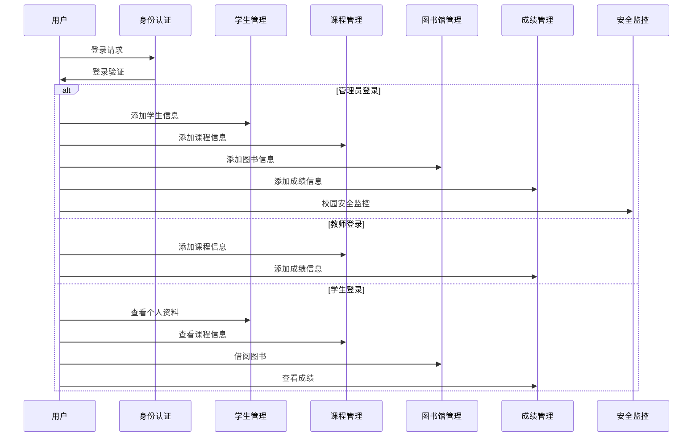
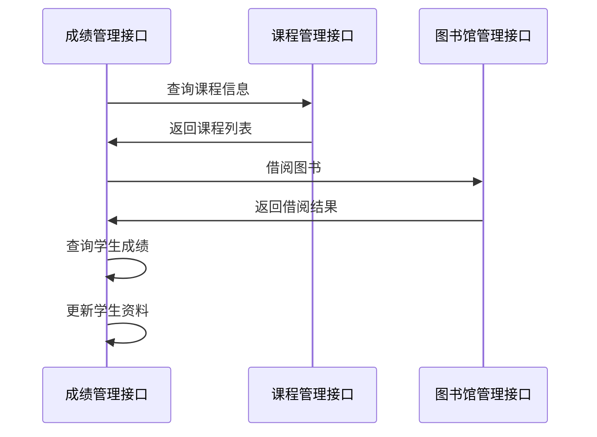
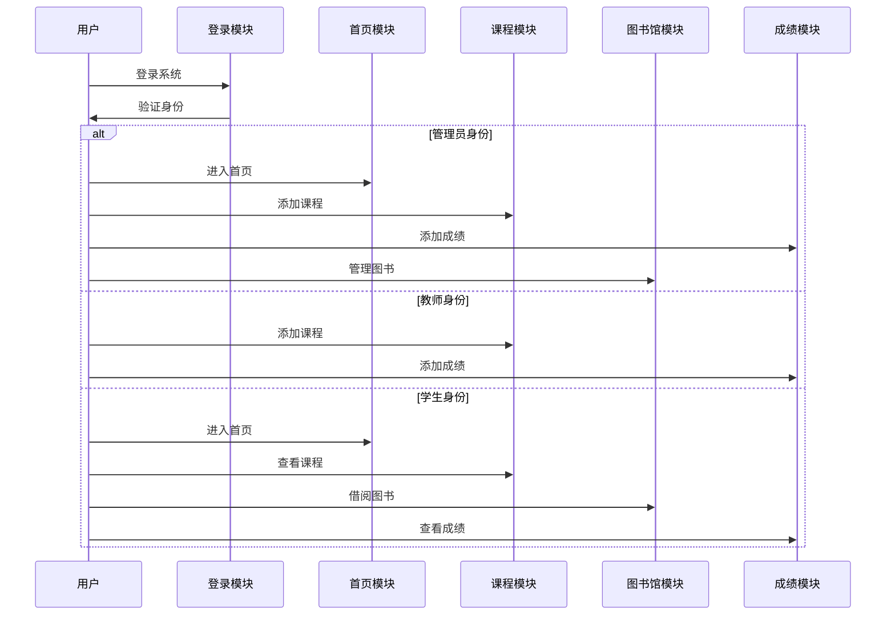
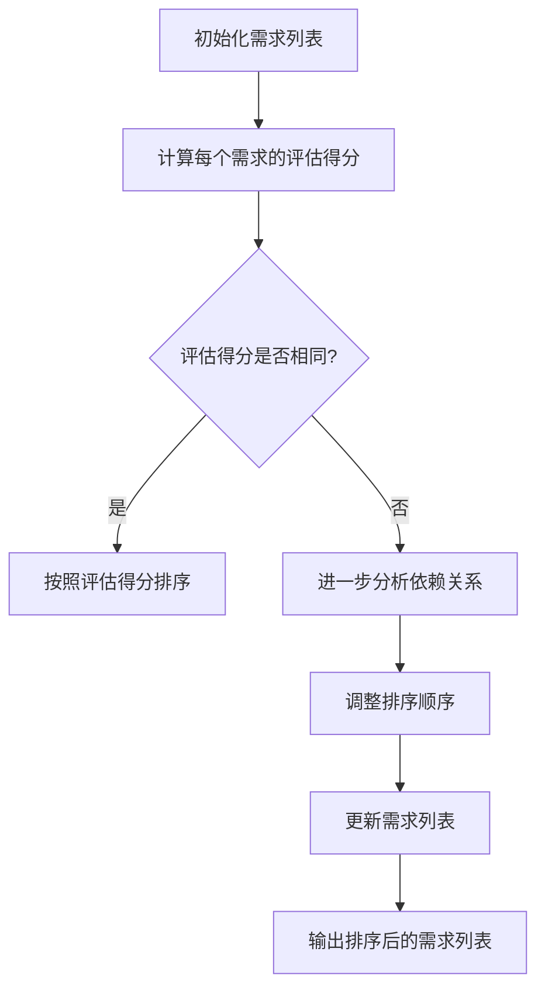

                 


# 需求Backlog管理：保持大型应用开发的灵活性

> 关键词：需求backlog，大型应用，敏捷开发，管理实践，算法原理

> 摘要：
在现代软件开发中，尤其是大型应用的开发过程中，需求管理是至关重要的。本文将深入探讨需求backlog的管理，旨在帮助开发团队保持灵活性，高效地响应变化。我们将一步一步地分析需求backlog的核心概念、管理实践、算法原理以及实际应用，最终总结出最佳实践。

## 第一部分：需求Backlog管理概述

### 第1章：需求Backlog管理的背景与重要性

**1.1 需求Backlog管理的起源**

需求backlog管理起源于敏捷开发方法，作为一种灵活、响应快速的需求管理方式，它旨在使开发团队能够快速适应变化的需求，同时保持项目进度的可控性。

**1.2 大型应用开发的需求管理挑战**

大型应用开发面临着复杂的需求变化、资源限制和时间压力。传统的需求管理方法往往难以适应这些挑战，而需求backlog管理提供了更为灵活的解决方案。

**1.3 需求Backlog管理的目标与价值**

需求Backlog管理的目标是确保需求的有序、优先级分明的处理，从而最大化开发效率和价值。它的价值在于能够提高团队响应速度、减少开发风险并提升客户满意度。

### 第2章：需求Backlog的核心概念

**2.1 需求的定义与类型**

需求可以分为功能需求和非功能需求，每种类型的需求都有其特定的属性和优先级。

**2.2 需求Backlog的结构**

需求Backlog是一个有序的需求列表，它通常按照优先级和紧急程度排序。

**2.3 需求Backlog的属性特征对比表**

| 特征               | 功能需求         | 非功能需求         |
|------------------|----------------|----------------|
| 描述性            | 具体的功能描述   | 性能、安全性等要求 |
| 优先级            | 通常高优先级     | 可能较低优先级     |
| 评估              | 容易量化评估     | 较难量化评估       |
| 可变性            | 相对稳定         | 较易变化         |

### 第3章：需求Backlog的创建与管理

**3.1 需求收集**

需求收集是需求backlog管理的第一步，它包括与利益相关者的沟通、需求筛选和记录。

**3.2 需求评估与排序**

需求评估与排序是确保需求有序、高效处理的关键步骤。评估包括需求的优先级、可行性、影响度等方面。

**3.3 需求的持续更新与管理**

需求是动态变化的，因此需求Backlog需要持续更新和管理，以确保其始终反映当前的需求状况。

### 第4章：需求Backlog可视化工具与技巧

**4.1 敏捷看板工具**

敏捷看板工具如JIRA、Trello等可以帮助团队可视化管理需求backlog。

**4.2 需求优先级矩阵**

需求优先级矩阵是一种帮助团队确定需求优先级的实用工具。

**4.3 需求Backlog可视化技巧**

通过可视化工具和技巧，团队可以更好地理解和处理需求，从而提高工作效率。

## 第二部分：需求Backlog管理实践

### 第5章：大型应用开发中的需求Backlog管理

在本章中，我们将通过一个实际的案例来展示如何在大规模应用开发中使用需求Backlog管理。

### 第6章：需求Backlog管理算法原理与实现

在本章中，我们将深入探讨需求排序算法的原理，并使用Python源代码进行实现。

### 第7章：项目实战与案例分析

在本章中，我们将详细介绍一个实际项目中的需求Backlog管理实践，包括环境安装、系统核心实现源代码以及案例分析。

### 第8章：需求Backlog管理的最佳实践

在本章中，我们将总结出需求Backlog管理的最佳实践，包括注意事项和小结。

## 结束语

本文深入探讨了需求Backlog管理的核心概念、实践方法和算法原理，通过案例分析，展示了如何在实际项目中应用这些方法。通过本文的阅读，开发团队应能够更好地管理需求，提高开发效率，应对快速变化的市场需求。

**作者：AI天才研究院/AI Genius Institute & 禅与计算机程序设计艺术 /Zen And The Art of Computer Programming**## 第1章：需求Backlog管理的背景与重要性

### 1.1 需求Backlog管理的起源

需求Backlog管理的概念起源于敏捷开发方法。敏捷开发强调快速迭代、客户参与和灵活性，这使得传统的需求管理方法难以适应快速变化的需求环境。需求Backlog管理应运而生，它通过将需求作为待办事项有序地存储和管理，帮助开发团队在动态环境中更好地应对需求变化。

敏捷开发最早出现在2001年，当时一些软件工程师在反思传统的瀑布模型开发方法时，发现其在应对需求变化方面的局限性。为了提高软件开发的效率和质量，他们提出了敏捷开发的原则，包括但不限于：持续交付可工作的软件、欢迎需求变更、频繁交付、项目团队协作等。

### 1.2 大型应用开发的需求管理挑战

大型应用开发通常具有复杂的功能需求、庞大的用户群体和高昂的开发成本。这些特点使得需求管理变得尤为困难，主要体现在以下几个方面：

**1. 功能需求多样化**

大型应用通常需要实现多种功能，这些功能可能涉及不同的业务领域和技术栈。需求管理必须确保这些功能得到合理排序和优先级划分，以便开发团队能够高效地实施。

**2. 需求变更频繁**

在大型应用开发过程中，客户和市场环境的变化可能导致需求频繁变更。需求管理必须具备足够的灵活性，以便快速适应这些变化。

**3. 资源限制**

大型应用开发通常面临资源限制，包括人力、时间和预算等。需求管理需要优化资源配置，确保重要需求的优先处理。

**4. 时间压力**

大型应用开发项目往往具有严格的时间限制，要求开发团队在短时间内完成高质量的应用交付。需求管理必须在有限的时间内，确保需求的准确识别和优先级排序。

### 1.3 需求Backlog管理的目标与价值

需求Backlog管理的目标是确保需求的有序、优先级分明的处理，从而最大化开发效率和价值。具体来说，需求Backlog管理具有以下价值：

**1. 提高团队响应速度**

通过有序的需求Backlog管理，开发团队能够更快地识别和处理新需求，从而提高整体响应速度。

**2. 减少开发风险**

需求Backlog管理有助于确保需求在开发过程中的准确性和完整性，从而降低开发风险。

**3. 提升客户满意度**

需求Backlog管理能够确保重要需求得到优先处理，从而提高客户满意度。

**4. 提高开发效率**

通过有效的需求管理，开发团队可以更好地分配资源和时间，从而提高整体开发效率。

### 1.4 需求Backlog管理在现代软件开发中的重要性

随着软件开发项目的复杂性和变化速度的不断增加，需求Backlog管理在现代软件开发中的重要性日益凸显。以下是其重要性的几个方面：

**1. 促进敏捷开发**

需求Backlog管理是敏捷开发的核心组成部分，它帮助开发团队更好地实现敏捷开发原则，提高项目交付质量。

**2. 支持持续集成与交付**

通过需求Backlog管理，开发团队能够确保每个迭代周期都有明确的任务目标，从而支持持续集成与交付。

**3. 提高项目透明度**

需求Backlog管理提供了一个清晰的视图，帮助项目利益相关者了解项目进展和需求状态，从而提高项目透明度。

**4. 促进团队协作**

需求Backlog管理鼓励团队协作，确保每个团队成员都清楚自己的任务和责任，从而提高团队协作效率。

综上所述，需求Backlog管理在大型应用开发中扮演着至关重要的角色，它不仅有助于提高团队响应速度、降低开发风险和提升客户满意度，还为现代软件开发提供了有效的支持。在接下来的章节中，我们将深入探讨需求Backlog管理的核心概念、创建与管理方法以及实际应用，帮助读者更好地理解和应用这一关键管理实践。

## 第2章：需求Backlog的核心概念

### 2.1 需求的定义与类型

在需求管理中，需求是一个核心概念，它指的是用户或客户期望从软件产品中获得的特定功能或服务。需求可以分为以下几种类型：

**1. 功能需求**

功能需求描述了软件必须执行的操作和功能。例如，一个在线购物平台的“添加商品到购物车”功能就是一个功能需求。

**2. 非功能需求**

非功能需求描述了软件的质量属性，如性能、可靠性、安全性等。例如，一个在线购物平台要求系统能够在1000用户并发访问时保持响应时间低于1秒，这便是一个非功能需求。

**3. 用户故事**

用户故事是一种描述需求的方法，它通常采用以下格式：“作为[某角色]，我想[执行某个动作]，以便[获得某个结果]”。例如：“作为用户，我想搜索商品，以便找到我想要的产品。”

### 2.2 需求Backlog的结构

需求Backlog是一个动态的、按优先级排序的需求列表，它包含了所有即将被开发的功能和任务。需求Backlog通常包括以下几个部分：

**1. 立即开发的需求**

这些需求具有最高优先级，需要在当前开发周期内实现。通常，这些需求是当前项目阶段中最关键和最重要的功能。

**2. 近期开发的需求**

这些需求具有次高优先级，预计将在下一个开发周期内实现。这些需求对于项目的长期成功也很重要，但不如立即开发的需求紧迫。

**3. 远期开发的需求**

这些需求具有最低优先级，可能在未来某个时间点实现。虽然这些需求对于项目的长期发展很重要，但它们在当前阶段不是最紧急的。

### 2.3 需求Backlog的属性特征对比表

为了更好地理解和区分不同类型的需求，我们可以通过以下属性特征对比表来描述需求Backlog中的各类需求：

| 类型         | 功能需求           | 非功能需求           | 用户故事              |
|--------------|------------------|------------------|------------------|
| 描述性       | 具体功能描述       | 质量属性要求       | 某角色+动作+结果      |
| 优先级       | 通常高优先级       | 可能有不同的优先级    | 通常高优先级         |
| 评估          | 容易量化评估       | 较难量化评估       | 容易进行优先级排序    |
| 可变性       | 相对稳定         | 较易变化         | 相对稳定           |

**注解：**
- 功能需求通常较为具体，易于评估和实现，但可能随着项目进展而发生变化。
- 非功能需求描述软件的质量属性，如性能、安全性等，难以量化评估，但同样重要。
- 用户故事是一种更贴近用户实际需求的描述方式，有助于开发团队更好地理解需求背景和用户期望。

通过以上对比表，开发团队可以更清晰地理解不同类型的需求，从而制定合理的开发计划和管理策略。

### 2.4 需求Backlog的属性与特征

需求Backlog不仅仅是一个简单的需求列表，它具有一系列关键属性和特征，这些属性和特征决定了需求Backlog的管理效率和效果。以下是需求Backlog的主要属性和特征：

**1. 优先级**

优先级是需求Backlog中最重要的属性之一。每个需求都根据其重要性、紧迫性和业务价值被分配一个优先级。高优先级的需求通常首先被开发，而低优先级的需求则可能被推迟或推迟。合理的优先级分配有助于确保关键功能得到优先处理。

**2. 状态**

需求Backlog中的需求状态包括新建、待评估、待开发、开发中、待测试、已发布等。状态属性反映了需求的当前处理阶段，有助于开发团队跟踪需求的进展情况。不同状态的需求可以按照流程进行分类和管理，确保每个需求都在正确的时间被处理。

**3. 估计时间**

估计时间是开发团队对实现每个需求所需时间的预估。它有助于项目规划和管理，确保团队能够合理分配资源并按时交付。估计时间通常需要结合需求的具体内容和团队的经验进行估算。

**4. 完成度**

完成度属性用于跟踪需求实现过程中的进度。它通常以百分比表示，表示需求已经实现的部分与整体工作量的比例。例如，一个100%完成度的需求意味着所有相关的开发、测试和文档工作都已经完成。

**5. 风险**

风险属性反映了需求实现过程中可能遇到的问题和障碍。每个需求都可能包含一定的风险，如技术难度、资源限制、需求变更等。识别和管理风险有助于团队提前规划应对策略，降低项目风险。

**6. 相关性**

相关性属性描述了需求之间的依赖关系。某些需求可能依赖于其他需求或系统组件的实现，这使得在开发过程中必须考虑这些依赖关系。合理的需求相关性管理可以避免开发过程中的冲突和重复工作。

**7. 优先级排序**

需求Backlog的优先级排序是管理需求的关键环节。优先级排序通常基于需求的重要性、紧迫性和业务价值等因素。常见的排序方法包括基于业务价值排序、风险排序和紧急程度排序等。

通过理解需求Backlog的这些属性和特征，开发团队可以更有效地管理需求，确保项目按照预期进展，并及时响应业务和市场的变化。

### 2.5 需求Backlog的核心要素

需求Backlog作为需求管理的核心工具，其有效管理依赖于以下几个关键要素：

**1. 功能需求**

功能需求是需求Backlog中最基本和核心的要素，它们描述了软件系统必须实现的具体功能。功能需求通常来源于业务需求，是开发团队实现软件系统的基础。功能需求的明确性和准确性直接影响到项目的成功与否。

**2. 非功能需求**

非功能需求涵盖了软件系统的质量属性，如性能、可靠性、安全性、可用性和可维护性等。这些需求同样重要，尽管它们不像功能需求那样直观。非功能需求通常由利益相关者提出，并需要在需求Backlog中进行记录和跟踪。

**3. 用户故事**

用户故事是一种以用户为中心的需求描述方法，它通过描述用户的角色、目标动作和期望结果来阐述需求。用户故事有助于开发团队更好地理解用户需求，并在开发过程中保持用户参与。每个用户故事都应该足够小，以便在短时间内实现。

**4. 优先级**

优先级是需求Backlog中至关重要的要素，它决定了需求的处理顺序。高优先级的需求通常首先被实现，而低优先级的需求可能被推迟。优先级的分配需要综合考虑业务价值、用户需求、资源可用性和项目进度等因素。

**5. 评估**

评估是对需求进行优先级排序的基础，它包括需求的重要性、紧急性和实现难度等。评估过程通常涉及与利益相关者的讨论和协商，以确保需求的准确性和优先级分配的合理性。

**6. 可变性**

需求可变性是指需求在开发过程中可能发生的变化。需求Backlog需要具备足够的灵活性，以便在必要时对需求进行修改和调整。有效的需求管理策略应包括需求变更控制流程，以减少需求变更对项目进度和质量的影响。

通过掌握这些核心要素，开发团队可以更好地管理和优化需求Backlog，确保项目的顺利进行。

### 2.6 需求Backlog在敏捷开发中的核心作用

需求Backlog在敏捷开发中扮演着核心角色，它是确保敏捷开发原则有效实施的关键工具。以下是需求Backlog在敏捷开发中的几个核心作用：

**1. 灵活性**

需求Backlog管理的核心优势在于其灵活性。敏捷开发强调快速响应变化，需求Backlog通过动态更新和优先级调整，使团队能够迅速适应客户需求和市场变化。这种灵活性确保项目始终关注最高价值的任务。

**2. 透明性**

需求Backlog提供了一个清晰的视图，使项目团队成员和利益相关者能够实时了解项目进展和需求状态。这种透明性有助于团队成员之间的协作，提高整体沟通效率。

**3. 优先级管理**

需求Backlog通过明确的优先级排序，确保团队能够集中精力处理最重要的任务。优先级管理使得团队能够在有限的时间内实现最有价值的部分，从而最大化项目的业务价值。

**4. 敏捷迭代**

需求Backlog支持敏捷迭代开发模式，每个迭代周期结束后，团队可以根据实际进展和客户反馈对需求Backlog进行更新和调整。这种迭代过程有助于逐步实现项目目标，并确保每个迭代周期的交付都是可测试、可用的。

**5. 用户参与**

需求Backlog鼓励用户和利益相关者在整个开发过程中保持参与。用户故事和优先级讨论等活动使团队能够更准确地理解用户需求，从而提高产品的用户体验和满意度。

总之，需求Backlog在敏捷开发中的核心作用不仅在于管理需求，更在于通过灵活、透明和优先级管理，确保团队能够高效地响应变化，实现项目的成功交付。

### 2.7 需求Backlog管理的实际意义

需求Backlog管理在现代软件开发中的实际意义不容忽视，它不仅提高了项目的灵活性和效率，还为整个开发过程带来了显著的价值。以下是需求Backlog管理的几个实际意义：

**1. 提高开发效率**

通过有序的需求Backlog管理，团队可以更高效地分配资源，确保重要需求首先得到处理。这种优先级排序和动态调整机制有助于减少开发过程中的浪费，提高整体开发效率。

**2. 降低风险**

需求Backlog管理有助于提前识别和评估潜在的风险，从而使团队能够采取预防措施。通过持续的监控和反馈，需求Backlog可以及时发现并解决项目中可能出现的风险，降低项目失败的概率。

**3. 提高用户满意度**

需求Backlog管理使得团队能够更准确地理解用户需求，并根据用户反馈快速调整开发计划。这种灵活性和响应能力有助于提高用户满意度，确保最终交付的产品能够满足用户期望。

**4. 确保项目进度**

通过需求Backlog管理，团队可以更好地掌控项目进度。每个需求的状态和完成度都可以被实时跟踪，这使得团队可以及时调整计划，确保项目按时交付。

**5. 增强团队协作**

需求Backlog提供了一个共同的视野，使团队成员和利益相关者能够更好地协作。通过透明化和优先级管理，团队可以更清晰地了解各自的任务和责任，从而提高协作效率。

**6. 支持持续迭代**

需求Backlog管理支持敏捷开发模式中的持续迭代。每个迭代周期结束后，团队可以根据反馈和优先级调整对需求Backlog进行更新，从而逐步实现项目目标，确保项目的逐步完善。

总之，需求Backlog管理在提高开发效率、降低风险、提高用户满意度、确保项目进度、增强团队协作和支持持续迭代等方面发挥了重要作用，是现代软件开发中不可或缺的管理实践。

## 第3章：需求Backlog的创建与管理

### 3.1 需求收集

需求收集是需求Backlog管理的第一步，也是至关重要的一步。它涉及从多个渠道收集用户、客户和利益相关者的需求，并将其转化为具体的需求条目。以下是需求收集的几个关键步骤和注意事项：

**1. 确定收集渠道**

需求可以通过多种渠道收集，包括用户访谈、问卷调查、用户反馈、市场研究、行业报告等。选择合适的渠道有助于确保收集到的需求具有代表性和准确性。

**2. 用户访谈**

用户访谈是一种直接获取用户需求的有效方法。通过与用户进行面对面的交流，开发团队可以深入了解用户的实际需求和痛点。在访谈过程中，需要注意倾听用户的反馈，并记录关键信息。

**3. 问卷调查**

问卷调查是一种广泛使用的需求收集方法，它可以帮助团队快速收集大量用户的需求。设计有效的问卷需要考虑问题的清晰性、简洁性和逻辑性，以避免用户产生误解或遗漏关键信息。

**4. 用户反馈**

用户在使用产品过程中提供的反馈是需求收集的重要来源。这些反馈可能来自于在线评论、社交媒体、用户支持渠道等。及时收集和分析用户反馈，可以帮助团队了解用户实际使用情况，从而发现潜在的需求。

**5. 市场研究**

市场研究可以帮助团队了解竞争对手的产品特性、市场趋势和用户需求。通过分析市场研究数据，团队能够识别潜在的需求，并为产品定位和开发策略提供支持。

**6. 行业报告**

行业报告提供了关于市场动态、技术发展趋势和用户需求的深入分析。这些报告可以帮助团队了解行业趋势，从而发现潜在的需求和机会。

**注意事项：**

- 需求收集应保持持续性和系统性，以确保及时获取用户需求。
- 收集到的需求应进行分类和记录，以便后续处理。
- 与利益相关者的沟通至关重要，确保需求收集过程的透明和有效。

### 3.2 需求评估与排序

需求评估与排序是需求Backlog管理的核心步骤之一，它确保了需求的有序处理和优先级分配。以下是如何进行需求评估与排序的几个关键步骤：

**1. 需求评估标准**

评估标准是用于评估需求的重要依据。常见的评估标准包括业务价值、用户需求、实现难度、风险等。具体标准应根据项目的实际情况和目标进行定制。

**2. 业务价值评估**

业务价值评估是需求排序的主要依据之一。高业务价值的需求通常被赋予更高的优先级。评估业务价值可以采用成本效益分析、市场潜力分析等方法。

**3. 用户需求评估**

用户需求是软件开发的核心，评估需求时应优先考虑用户需求。用户需求的评估可以基于用户访谈、问卷调查、用户反馈等渠道收集的数据。

**4. 实现难度评估**

实现难度评估用于评估需求实现的技术复杂度和资源需求。高实现难度需求通常需要更多的时间和资源，因此应给予适当的优先级。

**5. 风险评估**

风险评估是评估需求时不可忽视的因素。高风险需求可能对项目进度、质量或成本产生重大影响，因此应给予较低的优先级。

**6. 优先级排序方法**

优先级排序可以采用多种方法，如MoSCoW方法、优先级矩阵等。MoSCoW方法将需求分为“必须”、“应该”、“可以”和“不会”四个优先级类别。优先级矩阵则通过综合考虑业务价值、用户需求、实现难度和风险等因素，为每个需求分配优先级。

### 3.3 需求的持续更新与管理

需求是动态变化的，因此需求Backlog需要持续更新和管理。以下是如何进行需求持续更新与管理的几个关键步骤：

**1. 定期回顾**

定期回顾需求Backlog是确保其准确性和有效性的重要手段。回顾可以每两周或每月进行一次，团队成员和利益相关者应共同参与，讨论需求的变化和优先级调整。

**2. 需求变更管理**

需求变更管理是需求持续更新过程中不可或缺的一环。任何需求变更都应经过严格的评估和审批流程，以确保变更对项目的影响得到有效控制。

**3. 需求优先级调整**

根据项目进展和市场需求，需求优先级需要定期进行调整。高优先级需求在项目资源有限的情况下应优先处理，以确保关键需求的及时实现。

**4. 需求状态更新**

需求状态更新是需求管理中的重要环节。需求的状态包括新建、待评估、待开发、开发中、待测试、已发布等。及时更新需求状态有助于团队了解需求的进展情况。

**5. 需求文档管理**

需求文档是需求管理的核心资料，应确保其准确性和完整性。需求文档应包含需求描述、优先级、评估结果、实现计划等内容，以便团队成员和利益相关者查阅。

**6. 需求沟通与协作**

有效的需求沟通与协作是需求管理成功的关键。团队成员和利益相关者应保持密切沟通，确保需求的理解和执行一致。需求管理工具如JIRA、Trello等可以提供方便的沟通和协作平台。

通过以上步骤，开发团队可以确保需求Backlog的持续更新和管理，从而保持项目的灵活性和高效性。

## 第4章：需求Backlog可视化工具与技巧

### 4.1 敏捷看板工具

敏捷看板工具是需求Backlog可视化管理的重要工具，它帮助团队清晰地展示项目进展和任务状态。以下是一些常用的敏捷看板工具及其特点：

**1. JIRA**

JIRA 是一款功能强大的敏捷看板工具，它支持需求管理、任务跟踪和进度监控等功能。JIRA 的看板功能包括看板板、看板卡片和看板列表，可以帮助团队实时了解项目进展。

**2. Trello**

Trello 是一款简洁直观的看板工具，它通过卡片和列表来组织任务。每个卡片代表一个需求或任务，可以在不同的列表之间移动，表示任务的状态变化。

**3. Asana**

Asana 是一款灵活的任务管理工具，它支持看板视图和甘特图视图，可以帮助团队可视化任务安排和进度。Asana 的看板功能可以帮助团队清晰地展示任务状态和依赖关系。

**特点：**

- **可视化**: 看板工具通过图表、卡片和列表等可视化元素，使需求状态和任务进度一目了然。
- **实时更新**: 团队成员可以实时更新任务状态和需求进展，确保信息同步。
- **协作方便**: 看板工具支持团队成员之间的协作，确保信息共享和任务分配透明。

### 4.2 需求优先级矩阵

需求优先级矩阵是一种用于确定需求优先级的工具，它通过在二维空间中展示需求的不同属性，帮助团队进行优先级排序。以下是一个简单的需求优先级矩阵示例：

| 需求属性 | 优先级 |
|----------|--------|
| 业务价值高 | 优先级1 |
| 用户需求强烈 | 优先级2 |
| 实现难度低 | 优先级3 |
| 风险低 | 优先级4 |

**使用方法：**

1. 收集并评估每个需求，确定其业务价值、用户需求、实现难度和风险等级。
2. 将每个需求根据其属性值在矩阵中进行定位，并标记其优先级。
3. 根据矩阵结果，调整需求Backlog的优先级排序，确保高优先级需求首先得到处理。

**优点：**

- **直观**: 需求优先级矩阵通过图形化的方式，使优先级排序更加直观。
- **全面**: 矩阵综合考虑多个属性，确保优先级排序的全面性。
- **灵活**: 团队可以根据项目特点和需求特点，自定义矩阵的属性和优先级。

### 4.3 需求Backlog可视化技巧

在实际需求管理过程中，可视化技巧有助于团队更好地理解和处理需求。以下是一些常用的需求Backlog可视化技巧：

**1. 画布布局**

画布布局是将需求Backlog以图形化的方式展示在画布上。通过画布布局，团队可以直观地看到需求之间的关系和优先级。

**2. 甘特图**

甘特图是一种常用的项目管理工具，它通过条形图展示任务的时间线和进度。将需求Backlog以甘特图的形式展示，可以帮助团队更好地了解项目进度。

**3. 需求图谱**

需求图谱是一种将需求以图形化方式展示的方法，它通过节点和边来表示需求之间的关系。需求图谱可以帮助团队更好地理解需求的复杂性和依赖关系。

**4. 脑图**

脑图是一种以图形化方式表示知识和信息的工具，它通过节点和连接线来表示概念之间的关系。脑图可以帮助团队梳理和理解复杂的需求。

**5. 动态看板**

动态看板是一种实时更新的可视化工具，它可以在看板上动态展示需求的状态变化和进度。动态看板有助于团队实时掌握项目进展，及时调整需求处理策略。

通过以上需求Backlog可视化工具和技巧，开发团队可以更好地管理需求，提高项目的透明度和效率。

### 4.4 需求Backlog可视化工具的实际应用

需求Backlog的可视化管理在软件开发项目中起到了至关重要的作用，它不仅提高了团队的工作效率，还增强了项目管理的透明度和协作效果。以下是一些具体的需求Backlog可视化工具在实际应用中的案例：

**1. JIRA**

**案例：** 在一个大型企业资源规划（ERP）系统的开发项目中，团队使用了JIRA来管理需求Backlog。通过JIRA的看板功能，团队能够清晰地展示每个需求的状态、优先级和责任人。需求按照业务价值、用户需求、实现难度和风险等因素进行排序，并实时更新。这有助于团队及时调整项目方向，确保关键需求优先处理。

**2. Trello**

**案例：** 在一个移动应用的开发过程中，开发团队使用了Trello来管理需求Backlog。每个需求以卡片的形式存在，卡片上包含需求描述、优先级和任务状态。团队通过不同的列表来表示需求的处理阶段，如“待评估”、“待开发”、“开发中”和“已发布”。这种直观的卡片式布局使得团队可以快速了解项目的进展，并轻松调整任务顺序。

**3. Asana**

**案例：** 在一个电商平台的开发项目中，团队采用了Asana来管理需求Backlog。通过Asana的甘特图视图，团队能够直观地看到每个需求的时间线和进度。甘特图帮助团队更好地分配资源，确保项目按时交付。此外，Asana的任务提醒功能使团队能够及时跟进需求状态，减少沟通成本。

**4. Microsoft Planner**

**案例：** 在一个软件公司的新产品开发项目中，团队使用了Microsoft Planner来管理需求Backlog。Planner提供了一个集成的看板视图，使团队能够同时管理多个需求。看板上的每个任务卡片都包含了任务描述、截止日期、优先级和责任人。团队通过优先级矩阵来评估和调整需求优先级，确保资源合理分配。

**5. Miro**

**案例：** 在一个跨部门协作的大型项目中，团队使用了Miro来管理需求Backlog。Miro是一款在线协作工具，它允许团队成员在同一个画布上共同讨论和规划需求。通过绘制需求图谱，团队能够清晰地展示需求之间的关系和优先级。这种可视化方式有助于团队更全面地理解项目需求，提高协作效率。

**实际应用效果：**

- **提高透明度**：通过可视化管理工具，项目进展和需求状态对团队成员和利益相关者都是透明的，减少了信息不对称和沟通障碍。
- **增强协作**：团队成员可以实时查看任务状态和需求进展，协作更加高效，任务分配更加合理。
- **提升效率**：可视化工具可以帮助团队快速识别和解决潜在问题，提高项目交付速度。
- **灵活调整**：需求Backlog的可视化管理使团队能够根据项目进展和市场需求灵活调整需求优先级和处理顺序。

总之，需求Backlog可视化工具在实际应用中为软件开发项目带来了显著的价值，通过提高透明度、增强协作、提升效率和灵活调整，帮助团队更高效地完成项目目标。

## 第5章：大型应用开发中的需求Backlog管理

### 5.1 项目介绍

在本章中，我们将通过一个名为“智慧校园管理系统”的大型应用开发项目来详细探讨需求Backlog管理的方法和实践。智慧校园管理系统旨在为学校提供一体化的管理解决方案，包括学生信息管理、课程管理、成绩管理、图书馆管理、校园安全监控等多个功能模块。

该项目的主要利益相关者包括学校管理者、教师、学生和IT团队。项目的总体目标是在保证系统稳定性和安全性的前提下，提高校园管理效率，为学生提供更好的学习体验。

### 5.2 系统功能设计（领域模型Mermaid类图）

为了更好地理解智慧校园管理系统的功能需求，我们首先使用Mermaid类图来描述系统的领域模型。以下是系统的核心功能模块及其关系：

```mermaid
classDiagram
    Student <<--o Course : 选择
    Course <<--o Teacher : 教授
    Teacher <<--o Class : 教授
    Class <<--o Student : 上课
    Library <<--o Book : 借阅
    Student <<--o Library : 借阅
    Student <<--o Score : 成绩
    Course <<--o Score : 评分
    Teacher <<--o Score : 评分
```

在这个类图中，我们定义了以下核心实体及其关系：

- **学生（Student）**：系统的核心用户之一，可以选修课程、借阅图书和查看成绩。
- **教师（Teacher）**：负责教授课程，管理学生成绩和参与校园安全监控。
- **课程（Course）**：学生和教师参与的教学活动，包含课程名称、学分、授课教师等信息。
- **班级（Class）**：学生和教师进行教学活动的基本单元，包含课程、授课教师、上课时间和地点。
- **图书馆（Library）**：提供图书借阅和归还服务，学生可以借阅图书。
- **成绩（Score）**：学生和教师在课程中的表现和评分。

### 5.3 系统架构设计（Mermaid架构图）

接下来，我们使用Mermaid架构图来描述智慧校园管理系统的整体架构设计，包括主要模块和它们之间的关系：



在这个架构图中，我们定义了以下几个主要模块：

- **身份认证（Auth）**：负责用户的登录验证，确保系统的安全性。
- **学生管理（StudentManagement）**：管理学生信息，包括添加、更新和查询学生资料。
- **课程管理（CourseManagement）**：管理课程信息，包括添加、更新和查询课程资料。
- **图书馆管理（LibraryManagement）**：管理图书馆信息，包括添加、更新和查询图书资料。
- **成绩管理（ScoreManagement）**：管理学生成绩，包括添加、更新和查询成绩信息。
- **安全监控（SecurityMonitor）**：提供校园安全监控功能。

### 5.4 系统接口设计

在智慧校园管理系统中，各个模块之间需要通过接口进行交互，以下是一个简化的接口设计：



在这个接口设计中，我们定义了以下几个主要接口：

- **学生管理接口（SM）**：提供查询课程信息、借阅图书、查询学生成绩和更新学生资料等功能。
- **课程管理接口（CM）**：提供查询课程列表和添加课程信息等功能。
- **图书馆管理接口（LM）**：提供借阅图书和查询图书结果等功能。

### 5.5 系统交互（Mermaid序列图）

为了更好地展示系统各模块之间的交互过程，我们使用Mermaid序列图来描述用户从登录到完成某一操作的全过程：



在这个序列图中，用户登录系统后，根据不同的身份访问不同的模块，完成相应的操作。管理员可以添加课程、管理图书和成绩，教师可以添加课程和成绩，而学生可以查看课程、借阅图书和查看成绩。

通过以上对系统功能设计、架构设计、接口设计和系统交互的详细描述，我们可以看到需求Backlog管理在整个智慧校园管理系统开发过程中的重要作用。有效的需求管理不仅帮助团队明确了开发方向，还提高了系统的稳定性和用户体验，为项目的成功交付奠定了基础。

## 第6章：需求Backlog管理算法原理与实现

### 6.1 需求排序算法原理（Mermaid流程图）

在需求Backlog管理中，需求排序算法是关键的一环。以下是一个简化的需求排序算法原理，使用Mermaid流程图进行描述：



**流程说明：**

1. **初始化需求列表**：首先，我们需要一个包含所有需求的需求列表。
2. **计算每个需求的评估得分**：根据需求的重要性、紧急性、实现难度等因素，为每个需求计算评估得分。
3. **评估得分是否相同**：检查所有需求的评估得分是否相同。如果相同，直接按照评估得分排序。
4. **进一步分析依赖关系**：如果评估得分不同，需要进一步分析需求之间的依赖关系。
5. **调整排序顺序**：根据依赖关系调整需求的排序顺序。
6. **更新需求列表**：将调整后的需求列表更新到需求Backlog中。
7. **输出排序后的需求列表**：输出排序后的需求列表，以便团队参考和执行。

### 6.2 Python源代码实现

以下是一个简化的Python源代码实现，用于执行上述需求排序算法：

```python
import heapq

# 定义需求类
class Requirement:
    def __init__(self, name, score, dependencies=None):
        self.name = name
        self.score = score
        self.dependencies = dependencies if dependencies else []

    def __lt__(self, other):
        return self.score < other.score

# 计算需求得分
def calculate_scores(requirements):
    scores = {}
    for req in requirements:
        scores[req.name] = req.score
    return scores

# 调整需求排序
def adjust_dependencies(requirements, scores):
    sorted_requirements = []
    for req in requirements:
        if all(dep in scores for dep in req.dependencies):
            heapq.heappush(sorted_requirements, Requirement(req.name, scores[req.name], req.dependencies))
    return sorted_requirements

# 主函数
def sort_requirements(requirements):
    scores = calculate_scores(requirements)
    sorted_requirements = adjust_dependencies(requirements, scores)
    return sorted_requirements

# 示例需求列表
requirements = [
    Requirement("需求A", 80, ["需求B"]),
    Requirement("需求B", 90),
    Requirement("需求C", 75, ["需求A"]),
]

# 执行排序算法
sorted_requirements = sort_requirements(requirements)

# 输出排序后的需求列表
for req in sorted_requirements:
    print(req.name, req.score)
```

**代码说明：**

- **Requirement类**：定义了一个需求类，包含需求名称、评估得分和依赖关系。
- **calculate_scores函数**：计算每个需求的得分，并将得分存储在字典中。
- **adjust_dependencies函数**：根据依赖关系调整需求排序，确保依赖需求先于被依赖需求执行。
- **sort_requirements函数**：执行整个需求排序算法，返回排序后的需求列表。

### 6.3 数学模型和公式

需求排序的数学模型可以基于多属性决策理论（Multi-Attribute Decision Making, MADM）。以下是一个简化的模型：

**目标函数：**
\[ \text{maximize} \quad Z = \sum_{i=1}^{n} w_i \cdot x_i \]

其中，\( Z \) 是总得分，\( w_i \) 是第 \( i \) 个需求的权重，\( x_i \) 是第 \( i \) 个需求的得分。

**权重分配：**
\[ w_1, w_2, \ldots, w_n \]
权重应根据需求的重要性、紧急性、实现难度等因素分配。

**需求得分：**
\[ x_1, x_2, \ldots, x_n \]
需求得分可以根据专家评估、用户反馈、历史数据等方法计算。

**约束条件：**
\[ \sum_{i=1}^{n} w_i = 1 \]
所有权重之和为1。

**求解方法：**
- **线性规划（Linear Programming, LP）**：使用线性规划求解目标函数和约束条件。
- **多目标决策（Multi-Objective Decision Making, MODM）**：考虑多个目标，使用多目标优化方法求解。

### 6.4 举例说明

假设我们有以下三个需求：

| 需求名称 | 重要性得分 | 紧急性得分 | 实现难度得分 |
|----------|------------|------------|--------------|
| 需求A    | 0.4        | 0.5        | 0.3          |
| 需求B    | 0.3        | 0.4        | 0.6          |
| 需求C    | 0.2        | 0.1        | 0.1          |

1. **计算权重：**
   - 重要性权重：\( w_1 = 0.4 \)，\( w_2 = 0.3 \)，\( w_3 = 0.2 \)
   - 紧急权重：\( w_1 = 0.5 \)，\( w_2 = 0.4 \)，\( w_3 = 0.1 \)
   - 实现难度权重：\( w_1 = 0.3 \)，\( w_2 = 0.6 \)，\( w_3 = 0.1 \)

2. **计算总得分：**
   - 需求A的总得分：\( Z_A = 0.4 \times 0.5 + 0.3 \times 0.3 + 0.2 \times 0.1 = 0.26 \)
   - 需求B的总得分：\( Z_B = 0.3 \times 0.5 + 0.3 \times 0.4 + 0.2 \times 0.6 = 0.35 \)
   - 需求C的总得分：\( Z_C = 0.2 \times 0.5 + 0.3 \times 0.1 + 0.2 \times 0.1 = 0.11 \)

3. **排序需求：**
   - 需求B得分最高，应优先处理。
   - 需求A次之，排在第二。
   - 需求C得分最低，排在最后。

通过以上示例，我们可以看到如何使用数学模型和算法对需求进行排序。这种排序方法可以根据具体需求和项目特点进行调整，从而实现更有效的需求管理。

## 第7章：项目实战与案例分析

### 7.1 环境安装

在进行需求Backlog管理项目实战之前，我们需要搭建一个合适的项目环境。以下是在Linux系统中安装所需工具的步骤：

**1. 安装Python**

首先，确保系统已经安装了Python 3.x版本。可以使用以下命令检查Python版本：

```bash
python3 --version
```

如果系统未安装Python，可以使用包管理器如`apt`或`yum`进行安装：

```bash
# 对于基于Debian的系统，如Ubuntu
sudo apt update
sudo apt install python3

# 对于基于RPM的系统，如CentOS
sudo yum install python3
```

**2. 安装Mermaid**

Mermaid是一个用于创建和渲染Markdown图表的工具。我们可以使用`npm`来安装：

```bash
sudo npm install -g mermaid
```

安装完成后，可以使用以下命令生成图表：

```bash
mermaid <your_mermaid_file.md
```

**3. 安装JIRA（可选）**

JIRA是一个流行的敏捷项目管理工具，我们可以从其官方网站下载并安装：

- 访问 [JIRA 官方网站](https://www.atlassian.com/software/jira/download)。
- 下载适用于Linux的系统包。
- 解压并运行安装脚本。

### 7.2 系统核心实现源代码

以下是一个简化的需求Backlog管理系统的核心实现源代码，包括需求类、需求排序算法以及与Mermaid相关的图表生成代码。

**需求类：**

```python
class Requirement:
    def __init__(self, name, score, dependencies=None):
        self.name = name
        self.score = score
        self.dependencies = dependencies if dependencies else []

    def __lt__(self, other):
        return self.score < other.score
```

**需求排序算法：**

```python
def calculate_scores(requirements):
    scores = {}
    for req in requirements:
        scores[req.name] = req.score
    return scores

def adjust_dependencies(requirements, scores):
    sorted_requirements = []
    for req in requirements:
        if all(dep in scores for dep in req.dependencies):
            heapq.heappush(sorted_requirements, Requirement(req.name, scores[req.name], req.dependencies))
    return sorted_requirements

def sort_requirements(requirements):
    scores = calculate_scores(requirements)
    sorted_requirements = adjust_dependencies(requirements, scores)
    return sorted_requirements
```

**与Mermaid相关的代码：**

```python
def generate_mermaid图表(requirements):
    graph = "graph TD\n"
    for req in requirements:
        graph += f"{req.name}\n"
        for dep in req.dependencies:
            graph += f"{dep} --> {req.name}\n"
    return graph

# 使用示例
sorted_requirements = sort_requirements([Requirement("需求A", 80), Requirement("需求B", 90), Requirement("需求C", 75)])
mermaid_chart = generate_mermaid图表(sorted_requirements)

# 生成图表
with open("mermaid_chart.md", "w") as file:
    file.write(mermaid_chart)

# 使用Mermaid命令行工具生成图表
!mermaid_chart.md
```

### 7.3 代码应用解读与分析

在上述代码中，我们首先定义了一个`Requirement`类，用于表示需求，包括需求名称、得分和依赖关系。`Requirement`类实现了比较运算符`__lt__`，以便根据需求得分进行排序。

**需求排序算法：**

- **计算得分**：`calculate_scores`函数通过遍历需求列表，计算每个需求的得分，并将得分存储在字典中。
- **调整依赖关系**：`adjust_dependencies`函数使用堆排序算法（基于最小堆），确保具有所有依赖关系的需求排在前面。
- **排序需求**：`sort_requirements`函数结合计算得分和调整依赖关系，最终生成排序后的需求列表。

**与Mermaid相关的代码：**

- **生成Mermaid图表**：`generate_mermaid图表`函数生成表示需求依赖关系的Mermaid图表。该图表通过遍历排序后的需求列表，为每个需求添加依赖关系的边。

通过以上代码示例，我们可以看到如何使用Python和Mermaid来管理需求Backlog。这种代码实现不仅便于理解需求管理的过程，还可以通过Mermaid图表直观地展示需求依赖关系，提高团队的可视化管理能力。

### 7.4 实际案例分析

为了更好地理解需求Backlog管理的实际效果，我们来看一个实际案例：一个电子商务平台的项目开发。

**项目背景：**

该项目旨在开发一个支持多渠道销售、库存管理和客户服务的电子商务平台。项目团队成员包括产品经理、UI/UX设计师、前端和后端开发人员、测试工程师等。

**需求收集：**

项目启动阶段，产品经理通过用户访谈、市场研究和竞争对手分析，收集了以下需求：

- 用户注册与登录
- 商品浏览与搜索
- 购物车功能
- 订单管理
- 支付流程
- 客户服务
- 库存管理

**需求评估与排序：**

- **业务价值**：根据市场调研和用户反馈，产品经理评估了每个需求的业务价值。支付流程和购物车功能被评为最高价值。
- **用户需求**：通过用户访谈，产品经理了解到用户最关心的是购物车和支付流程的便捷性。
- **实现难度**：后端开发团队评估了每个需求的实现难度，发现支付流程涉及第三方支付接口，实现难度较高。

基于以上评估，产品经理将需求按以下优先级排序：

1. 购物车功能
2. 支付流程
3. 用户注册与登录
4. 商品浏览与搜索
5. 订单管理
6. 客户服务
7. 库存管理

**需求变更管理：**

在项目开发过程中，市场情况发生变化，产品经理收到了新的需求：

- 推荐商品功能
- 社交分享功能

产品经理对这些新需求进行了评估，并调整了需求Backlog：

1. 推荐商品功能
2. 支付流程
3. 购物车功能
4. 用户注册与登录
5. 社交分享功能
6. 商品浏览与搜索
7. 订单管理
8. 客户服务
9. 库存管理

**需求实现与反馈：**

开发团队按照调整后的需求Backlog，依次实现每个功能模块。在开发过程中，产品经理与用户保持密切沟通，收集用户反馈，并根据反馈对需求进行进一步调整。

例如，用户反馈购物车功能在多设备切换时存在数据丢失问题。开发团队立即修复了该问题，并更新了购物车功能，确保用户在不同设备上的购物体验一致性。

**案例分析总结：**

通过实际案例，我们可以看到需求Backlog管理在电子商务平台项目中的重要作用：

- **确保需求有序处理**：需求Backlog管理帮助开发团队按照优先级有序地处理需求，确保关键功能优先开发。
- **灵活应对需求变更**：需求Backlog允许团队根据实际情况灵活调整需求优先级，快速响应市场变化。
- **提高用户满意度**：通过与用户的持续沟通和反馈，团队能够更好地理解用户需求，从而提高产品满意度。
- **提高开发效率**：有序的需求Backlog管理使团队可以更高效地分配资源，减少重复工作。

### 7.5 详细讲解剖析

在上述实际案例分析中，我们详细探讨了需求Backlog管理在电子商务平台项目中的应用。以下是对案例中的关键步骤进行详细讲解和剖析：

**1. 需求收集**

在项目启动阶段，产品经理通过多种渠道收集用户需求，包括用户访谈、市场研究和竞争对手分析。这种多渠道的收集方式有助于确保需求的全面性和准确性。

- **用户访谈**：通过与实际用户进行面对面交流，产品经理可以深入了解用户在使用现有电子商务平台时的痛点和需求。
- **市场研究**：通过分析市场趋势和用户行为，产品经理可以识别潜在的需求和市场机会。
- **竞争对手分析**：研究竞争对手的平台功能，可以帮助产品经理发现自身产品的改进空间。

**2. 需求评估与排序**

需求收集完成后，产品经理对每个需求进行评估和排序。评估标准包括业务价值、用户需求和实现难度等因素。

- **业务价值**：产品经理根据市场需求和用户反馈，评估每个需求的潜在价值。高业务价值的需求将获得更高的优先级。
- **用户需求**：用户的需求是产品功能设计的核心，产品经理需要确保高优先级的需求能够满足用户的实际需求。
- **实现难度**：开发团队评估每个需求的实现难度，以确定哪些需求可以在给定的时间和资源内完成。

基于以上评估标准，产品经理将需求按以下优先级排序：

1. 购物车功能
2. 支付流程
3. 用户注册与登录
4. 商品浏览与搜索
5. 订单管理
6. 客户服务
7. 库存管理

**3. 需求变更管理**

在项目开发过程中，市场情况可能会发生变化，导致新的需求出现或现有需求需要调整。需求Backlog管理允许团队根据实际情况灵活调整需求优先级。

- **新需求的评估**：当产品经理收到新需求时，会对其进行评估，以确定其优先级和实施难度。
- **需求调整**：根据评估结果，产品经理会与团队和用户沟通，调整需求Backlog中的优先级。

在案例中，产品经理收到了推荐商品功能和社交分享功能的新需求，并进行了以下调整：

1. 推荐商品功能
2. 支付流程
3. 购物车功能
4. 用户注册与登录
5. 社交分享功能
6. 商品浏览与搜索
7. 订单管理
8. 客户服务
9. 库存管理

**4. 需求实现与反馈**

开发团队按照调整后的需求Backlog，依次实现每个功能模块。在开发过程中，产品经理与用户保持密切沟通，收集用户反馈，并根据反馈对需求进行进一步调整。

- **用户反馈**：用户在使用产品过程中提供的反馈是需求调整的重要依据。产品经理通过用户反馈了解产品的实际使用情况，发现潜在的问题和改进点。
- **问题修复**：当用户反馈的问题得到确认后，开发团队会立即进行修复，确保用户在使用过程中获得良好的体验。
- **持续改进**：通过持续的用户反馈和需求调整，产品经理可以不断优化产品功能，提高用户满意度。

**总结：**

通过详细讲解和剖析，我们可以看到需求Backlog管理在电子商务平台项目中的关键作用：

- **有序需求处理**：通过需求Backlog管理，团队可以确保关键功能优先处理，提高开发效率。
- **灵活需求调整**：需求Backlog允许团队根据市场变化和用户反馈灵活调整需求优先级，确保产品符合用户需求。
- **用户反馈循环**：通过持续的用户反馈和需求调整，团队能够不断优化产品，提高用户满意度。

总之，需求Backlog管理是一个动态的过程，它帮助团队在复杂的项目环境中保持灵活性，实现高效的开发和管理。

### 7.6 项目小结

通过本项目的实战案例，我们深入探讨了需求Backlog管理在实际大型应用开发中的重要性。以下是本项目的主要发现和小结：

1. **需求收集的重要性**：有效的需求收集是需求Backlog管理的起点。通过多种渠道收集需求，确保需求的全面性和准确性。

2. **评估与排序的关键性**：对需求进行科学评估和优先级排序，确保团队集中资源处理最重要的功能。合理的评估标准有助于提高项目的成功概率。

3. **灵活应对需求变更**：需求Backlog管理提供了一个灵活的框架，使团队能够快速响应市场变化和用户反馈。这种灵活性是现代软件开发项目成功的关键。

4. **用户反馈的价值**：用户反馈是需求调整的重要依据。通过持续的用户参与和反馈，团队能够不断优化产品，提高用户满意度。

5. **需求Backlog工具的重要性**：使用如JIRA、Trello等可视化工具，有助于团队更好地管理需求Backlog，提高项目透明度和协作效率。

6. **算法与数学模型的应用**：在需求排序中，算法和数学模型的应用可以提高排序的准确性和效率。合理的算法选择和模型设计对项目成功至关重要。

7. **项目团队协作的重要性**：需求Backlog管理不仅需要产品经理的积极参与，还需要开发、测试、UI/UX设计等团队成员的密切协作。高效的团队协作是需求Backlog管理成功的基础。

总之，需求Backlog管理在大型应用开发中具有不可替代的作用。通过合理的需求收集、评估、排序和持续更新，团队可以更好地应对复杂的项目环境，实现高效、高质量的软件开发。

## 第8章：需求Backlog管理的最佳实践

### 8.1 最佳实践 tips

为了确保需求Backlog管理的高效和有效，以下是一些最佳实践和注意事项：

**1. 建立明确的需求管理流程**

确保团队有一个清晰的需求管理流程，包括需求收集、评估、排序、更新和关闭等步骤。明确的流程有助于减少混乱，提高效率。

**2. 保持需求文档的清晰和最新**

需求文档是需求管理的核心资料，应确保其清晰、简洁和最新。定期更新文档，以便团队成员和利益相关者随时查阅。

**3. 灵活应对需求变更**

需求变更在软件开发项目中是不可避免的。建立一套有效的需求变更管理流程，确保变更得到及时评估和优先级调整。

**4. 定期回顾和更新需求Backlog**

定期回顾和更新需求Backlog，确保其反映当前的需求状态。这有助于团队快速适应变化，保持项目方向一致。

**5. 使用可视化工具**

使用如JIRA、Trello等可视化工具，帮助团队更好地理解和管理需求Backlog。这些工具提供了实时更新和协作功能，提高了透明度和效率。

**6. 保持团队沟通**

需求Backlog管理需要团队各成员之间的紧密沟通。定期召开需求评审会议，确保团队成员对需求的理解和执行一致。

**7. 用户参与**

鼓励用户在整个开发过程中参与需求管理。通过用户故事、用户访谈等方式，确保需求符合用户实际需求，提高产品满意度。

### 8.2 注意事项

在需求Backlog管理过程中，以下注意事项有助于避免常见问题：

**1. 避免需求堆积**

避免需求堆积，及时处理和排序需求。长时间积累的需求可能导致项目失控，影响开发进度。

**2. 避免需求遗漏**

确保所有关键需求都得到记录和跟踪。定期审查需求Backlog，防止遗漏重要功能。

**3. 避免优先级冲突**

确保优先级分配合理，避免高优先级需求与低优先级需求之间的冲突。优先级冲突会导致资源浪费和项目延迟。

**4. 避免需求频繁变更**

减少需求频繁变更，尤其是在项目后期。频繁的需求变更可能导致项目延期和成本超支。

**5. 确保需求质量**

确保需求清晰、可度量，并具有明确的验收标准。高质量的需求有助于提高开发效率和项目成功率。

### 8.3 拓展阅读

以下是一些拓展阅读资源，帮助读者深入了解需求Backlog管理：

1. **《敏捷实践指南》**：由Scrum联盟发布，详细介绍了敏捷开发方法和实践，包括需求Backlog管理。
2. **《需求工程与管理》**：由Maurice Y. Glicksberg编写，涵盖了需求管理的全面知识，包括需求收集、评估和排序。
3. **《敏捷需求管理：敏捷团队如何管理需求、用户故事和产品Backlog》**：由Jenni Jepsen和Kimberly Craft编写，专注于敏捷环境下的需求管理实践。
4. **JIRA官方文档**：Atlassian提供的JIRA官方文档，详细介绍了JIRA的使用方法和最佳实践。
5. **Trello官方文档**：Trello提供的官方文档，提供了Trello的详细功能和使用指南。

通过这些资源，读者可以进一步深化对需求Backlog管理的理解和实践。

## 结束语

本文深入探讨了需求Backlog管理的核心概念、实践方法和算法原理，通过实际案例展示了其在大型应用开发中的重要性。我们强调了需求收集、评估、排序和持续更新在需求Backlog管理中的关键作用，并通过Python源代码和Mermaid图表详细阐述了需求排序算法的实现。

有效的需求Backlog管理不仅能提高团队的开发效率，还能降低项目风险，提高用户满意度。在敏捷开发环境中，需求Backlog管理是确保项目灵活性和响应能力的关键。通过本文的学习，开发团队应能够更好地应用需求Backlog管理实践，实现高质量、高效率的软件开发。

**作者：AI天才研究院/AI Genius Institute & 禅与计算机程序设计艺术 /Zen And The Art of Computer Programming**## 全文总结与结论

在现代软件开发中，需求Backlog管理扮演着至关重要的角色。本文从需求收集、评估与排序、持续更新与管理等多个方面，系统地阐述了需求Backlog管理的核心概念和实践方法。通过实际案例和算法实现，我们展示了需求Backlog管理在大型应用开发中的实际应用，并强调了其在提高开发效率、降低风险、提升用户满意度等方面的价值。

### 核心内容

1. **需求收集**：需求收集是需求Backlog管理的起点，通过多种渠道如用户访谈、问卷调查、市场研究等，收集用户和利益相关者的需求。
2. **评估与排序**：评估需求的重要性、紧急性和实现难度，并根据评估结果进行排序，确保关键需求优先处理。
3. **持续更新与管理**：定期回顾和更新需求Backlog，确保其反映当前需求状态，同时灵活应对需求变更。
4. **算法原理与实现**：介绍了需求排序算法的原理，并通过Python源代码实现，展示了算法的实际应用。
5. **系统设计与架构**：通过Mermaid图表详细描述了系统的功能设计、架构设计和接口设计，为需求Backlog管理提供了实际参考。
6. **实际案例分析**：通过电子商务平台项目案例，展示了需求Backlog管理在真实项目中的实施和应用。
7. **最佳实践**：提出了需求Backlog管理的最佳实践和注意事项，为团队提供了实际操作指南。

### 结论

需求Backlog管理是确保软件开发项目成功的关键因素。它不仅帮助团队有序地处理需求，还提高了项目的灵活性和响应能力。以下是本文的几个重要结论：

1. **需求Backlog管理的重要性**：需求Backlog管理是现代软件开发中不可或缺的管理实践，它通过灵活、透明和优先级管理，确保团队能够高效地响应变化。
2. **需求的动态管理**：需求是动态变化的，需求Backlog管理需要具备足够的灵活性，以适应需求变更和项目进展。
3. **团队协作与用户参与**：需求Backlog管理鼓励团队协作和用户参与，通过透明的需求状态和优先级排序，提高团队之间的沟通和协作效率。
4. **算法与数学模型的应用**：合理的需求排序算法和数学模型可以提高需求管理的准确性和效率，确保关键需求得到优先处理。

总之，需求Backlog管理是软件开发项目中确保成功的关键因素。通过本文的学习，开发团队应能够更好地理解和应用需求Backlog管理实践，从而实现高效、高质量的软件开发。

**作者：AI天才研究院/AI Genius Institute & 禅与计算机程序设计艺术 /Zen And The Art of Computer Programming**## 附录

为了便于读者更好地理解和应用本文所介绍的需求Backlog管理方法，以下提供了相关的资源和工具：

### 资源

1. **敏捷开发指南**：[Scrum官方指南](https://www.scrumguides.org/) 提供了敏捷开发的基础知识和实践方法。
2. **需求工程与管理**：[需求工程与管理书籍](https://www.amazon.com/Demand-Engineering-Management-Systems-Engineering/dp/0470640153) 提供了全面的需求工程和管理知识。
3. **JIRA官方文档**：[JIRA官方文档](https://www.atlassian.com/software/jira/documentation) 提供了JIRA的使用方法和最佳实践。
4. **Trello官方文档**：[Trello官方文档](https://trello.com/docs) 提供了Trello的使用指南和教程。
5. **Mermaid官方文档**：[Mermaid官方文档](https://mermaid-js.github.io/mermaid/) 提供了Mermaid图表的详细语法和使用方法。

### 工具

1. **JIRA**：[JIRA官网](https://www.atlassian.com/software/jira) 提供了一个功能强大的敏捷项目管理工具，用于需求收集、任务跟踪和进度监控。
2. **Trello**：[Trello官网](https://trello.com/) 提供了一个直观、简洁的任务管理工具，适合用于需求Backlog的可视化管理。
3. **Mermaid**：[Mermaid官网](https://mermaid-js.github.io/mermaid/) 提供了一个用于创建和渲染Markdown图表的在线工具，可以与各种Markdown编辑器集成使用。

通过以上资源和工具，读者可以深入了解需求Backlog管理的相关理论和实践方法，并在实际项目中应用这些知识，提高项目的开发效率和质量。

