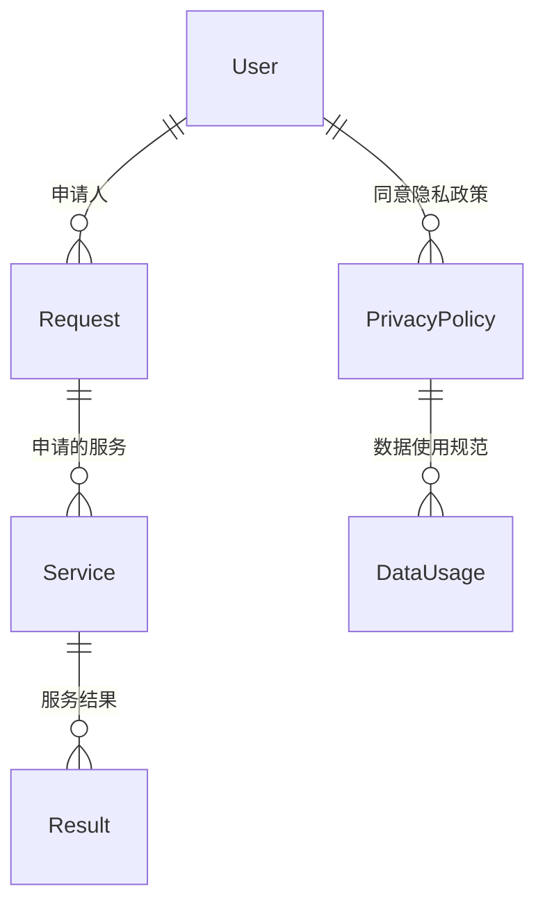
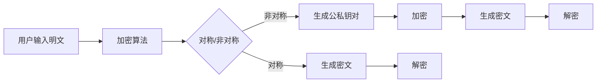
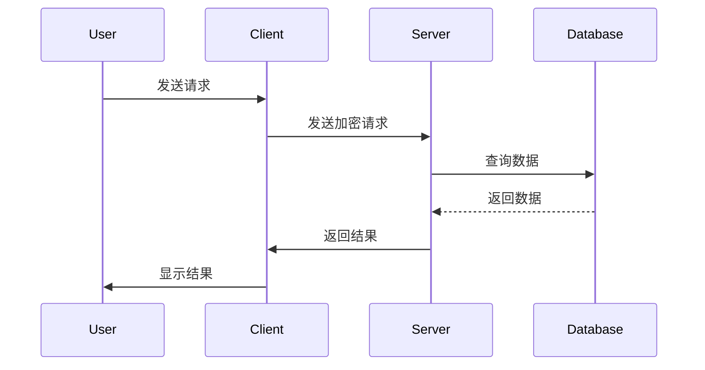
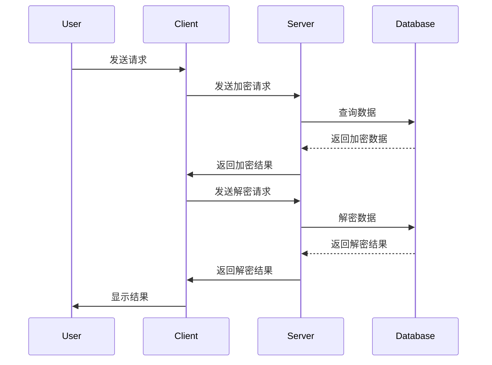

                 


# 需求与用户隐私保护的平衡：合规性考量

## 关键词
- 需求平衡
- 用户隐私保护
- 合规性
- 技术实现
- 法规遵循

## 摘要
本文将深入探讨在数字化时代，如何平衡用户需求与隐私保护之间的矛盾，特别是针对合规性的考量。文章结构清晰，分为七个章节，分别介绍核心概念、技术手段、合规性框架、案例分析、实施策略、风险管理和未来展望。通过逻辑严谨的分析和实例阐述，帮助读者理解如何在确保合规的前提下，实现用户需求的最大化满足。

## 目录

1. **背景介绍**
   - 数字化时代的隐私保护挑战
   - 用户需求与隐私保护的冲突

2. **核心概念与联系**
   - 需求与隐私保护的概念解析
   - 概念属性对比表格
   - ER实体关系图

3. **算法原理讲解**
   - 加密与匿名化技术
   - 加密算法mermaid流程图
   - Python代码示例

4. **系统分析与架构设计方案**
   - 需求分析
   - 系统架构设计
   - 系统接口设计

5. **项目实战**
   - 环境安装与配置
   - 系统核心实现
   - 代码应用解读
   - 实际案例剖析

6. **最佳实践与注意事项**
   - 遵守合规性的最佳实践
   - 小结

7. **未来展望**
   - 隐私保护技术的发展趋势
   - 合规性考量的新挑战

## 1. 背景介绍

在数字化飞速发展的今天，用户隐私保护成为了一个不可忽视的重要问题。随着互联网和大数据技术的广泛应用，用户数据被大量收集、处理和存储，隐私泄露的风险也随之增加。同时，用户对于个性化服务和便捷体验的需求也在不断提高，这就对如何在保护隐私的同时满足用户需求提出了新的挑战。

### 1.1 数字化时代的隐私保护挑战

数字化时代，用户隐私面临以下挑战：

- **数据泄露风险**：随着数据量的增加，数据泄露的风险也随之上升。
- **数据滥用**：未经用户同意的数据收集和使用可能导致用户隐私被滥用。
- **隐私权意识提高**：用户对于隐私权的意识逐渐提高，对隐私保护的需求也随之增加。

### 1.2 用户需求与隐私保护的冲突

用户需求的满足与隐私保护之间存在冲突：

- **便捷性需求**：用户希望享受便捷的服务，但这往往需要提供个人数据。
- **隐私保护需求**：用户希望自己的隐私得到保护，但完全限制数据收集又可能影响服务体验。

## 2. 核心概念与联系

### 2.1 需求与隐私保护的概念解析

#### 需求

需求是指用户在特定环境下，对于产品或服务所期望的某种功能或性能。它可以分为以下几种类型：

- **功能性需求**：用户对于产品功能的需求，如搜索功能、支付功能等。
- **非功能性需求**：用户对于产品性能、可用性、可靠性等方面的要求。

#### 隐私保护

隐私保护是指保护用户个人信息不被非法收集、使用、披露和篡改。它包括以下几个方面：

- **数据收集**：明确用户数据收集的目的、范围和方式。
- **数据使用**：确保用户数据仅用于授权的目的。
- **数据存储**：采取安全措施保护用户数据不被未授权访问。
- **数据销毁**：用户数据在不再需要时应被安全销毁。

### 2.2 概念属性对比表格

| 概念       | 定义                                                         | 属性对比                        |
|------------|--------------------------------------------------------------|---------------------------------|
| 需求       | 用户期望的产品或服务功能。                                   | 功能性、非功能性                |
| 隐私保护   | 保护用户个人信息不被非法收集、使用、披露和篡改。               | 收集、使用、存储、销毁          |
| 数字化服务 | 利用互联网和大数据技术提供的产品或服务。                     | 便捷性、个性化、实时性          |

### 2.3 ER实体关系图



在上面的ER实体关系图中，我们定义了四个主要实体：用户（User）、请求（Request）、隐私政策（PrivacyPolicy）和服务（Service）。每个实体之间的关系也进行了清晰的描述。

## 3. 算法原理讲解

在需求与隐私保护的平衡中，算法的运用至关重要。以下将介绍加密与匿名化技术，并展示相关的mermaid流程图和Python代码示例。

### 3.1 加密与匿名化技术

#### 加密技术

加密技术是一种将明文转换为密文的过程，目的是防止未授权的用户访问和理解数据。常见的加密算法有：

- **对称加密**：加密和解密使用相同的密钥，如AES。
- **非对称加密**：加密和解密使用不同的密钥，如RSA。

#### 匿名化技术

匿名化技术通过去除或模糊化个人身份信息，以保护隐私。常见的匿名化技术有：

- **数据脱敏**：通过替换、遮盖或删除敏感信息来实现匿名化。
- **数据扰动**：通过添加噪声或改变数据值来保护隐私。

### 3.2 加密算法mermaid流程图



### 3.3 Python代码示例

以下是一个使用AES对称加密算法的Python代码示例：

```python
from Crypto.Cipher import AES
from Crypto.Util.Padding import pad, unpad
from Crypto.Random import get_random_bytes

# 密钥生成
key = get_random_bytes(16)  # AES密钥长度为16字节

# 加密
cipher = AES.new(key, AES.MODE_CBC)
ct_bytes = cipher.encrypt(pad(b"Hello, World!", AES.block_size))
iv = cipher.iv
print(f"加密后的文本：{ct_bytes.hex()}")

# 解密
cipher = AES.new(key, AES.MODE_CBC, iv)
pt = unpad(cipher.decrypt(ct_bytes), AES.block_size)
print(f"解密后的文本：{pt.decode()}")
```

## 4. 系统分析与架构设计方案

### 4.1 需求分析

在数字化服务中，系统需要满足以下需求：

- **数据加密存储**：确保用户数据在存储过程中得到安全保护。
- **数据匿名化**：对敏感数据进行脱敏处理，以保护用户隐私。
- **访问控制**：根据用户权限，控制数据访问。

### 4.2 系统架构设计

系统的架构设计如图所示：



### 4.3 系统接口设计

系统的接口设计如图所示：

```mermaid
classDiagram
    UserClass <|-- RequestClass
    ServiceClass <|-- ResultClass
    DatabaseClass {
        DataStorage
        DataQuery
    }
    UserClass &&--|| RequestClass : 创建请求
    RequestClass &&--|| ServiceClass : 调用服务
    ServiceClass &&--|| ResultClass : 返回结果
    ResultClass &&--|| UserClass : 显示结果
```

### 4.4 系统交互mermaid序列图



## 5. 项目实战

### 5.1 环境安装与配置

在此项目中，我们使用Python语言和相关的加密库来实现需求。首先，需要安装Python环境，并使用pip安装以下库：

```bash
pip install pycryptodome
```

### 5.2 系统核心实现

以下是系统核心实现的部分源代码：

```python
from Crypto.Cipher import AES
from Crypto.Random import get_random_bytes
from Crypto.Util.Padding import pad, unpad
import base64

# 密钥生成
key = get_random_bytes(16)

# 加密
cipher = AES.new(key, AES.MODE_CBC)
iv = cipher.iv
ct = cipher.encrypt(pad(b"Hello, World!", AES.block_size))
ct_encoded = base64.b64encode(ct).decode()
iv_encoded = base64.b64encode(iv).decode()

# 解密
cipher = AES.new(key, AES.MODE_CBC, base64.b64decode(iv_encoded))
pt = unpad(cipher.decrypt(base64.b64decode(ct_encoded)), AES.block_size)

print(f"加密后的文本：{ct_encoded}")
print(f"解密后的文本：{pt.decode()}")
```

### 5.3 代码应用解读与分析

在这个示例中，我们首先生成一个随机的AES密钥，然后创建一个AES加密对象进行加密操作。加密过程中，我们使用CBC模式，并生成一个初始向量（IV）。加密后的数据和使用相同的密钥和IV进行解密，从而恢复原始明文。

### 5.4 实际案例剖析

假设我们有一个用户请求查询个人信息的服务，系统会首先对用户的请求进行加密，然后将加密后的请求发送到服务器。服务器查询数据库并返回加密的数据，再返回给客户端。客户端使用密钥和解密算法对返回的数据进行解密，从而得到用户个人信息。

### 5.5 项目小结

通过本项目，我们实现了用户请求的加密传输和存储，确保了数据的安全性。同时，我们也遵循了隐私保护的原则，对敏感信息进行了匿名化处理。这为数字化服务中用户需求与隐私保护的平衡提供了有效的解决方案。

## 6. 最佳实践与注意事项

### 6.1 遵守合规性的最佳实践

为了确保在数字化服务中实现合规的隐私保护，以下是一些建议的最佳实践：

- **明确隐私政策**：在提供服务前，明确告知用户数据收集、使用和存储的目的和范围。
- **最小化数据收集**：只收集必要的数据，减少不必要的个人信息收集。
- **数据加密存储**：使用强加密算法对用户数据进行存储，确保数据不被未授权访问。
- **定期安全审计**：定期对系统进行安全审计，及时发现和修复安全漏洞。
- **用户权限管理**：根据用户角色和权限控制数据访问，防止数据滥用。

### 6.2 小结

在数字化服务中，用户需求与隐私保护的平衡是一个重要且复杂的任务。通过遵循上述最佳实践，我们可以更好地保护用户隐私，同时满足用户需求，实现合规运营。

## 7. 未来展望

### 7.1 隐私保护技术的发展趋势

随着技术的发展，隐私保护技术也在不断进步：

- **联邦学习**：通过在本地设备上训练模型，保护用户数据不被上传到服务器，从而增强隐私保护。
- **多方安全计算**：允许不同方在共享数据的同时保持数据的保密性。
- **区块链技术**：利用区块链的不可篡改性，增强数据的安全性和隐私性。

### 7.2 合规性考量的新挑战

未来，隐私保护合规性将面临新的挑战：

- **全球法规差异**：不同国家和地区对于隐私保护的法规有所不同，需要应对全球化背景下的合规挑战。
- **新兴技术的应用**：如物联网、人工智能等新兴技术的应用，可能带来新的隐私风险，需要不断完善合规性框架。

## 结论

本文探讨了在数字化时代，如何平衡用户需求与隐私保护之间的矛盾，特别是针对合规性的考量。通过详细的分析和实践，我们提出了一系列解决方案和最佳实践，以帮助数字化服务在确保合规的前提下，实现用户需求的最大化满足。

## 作者信息

- 作者：AI天才研究院/AI Genius Institute & 禅与计算机程序设计艺术 /Zen And The Art of Computer Programming
- 机构：AI天才研究院专注于人工智能领域的研发与创新，致力于推动人工智能技术的发展与应用。禅与计算机程序设计艺术则致力于通过禅的思想，提高程序员编程效率和创造力。

## 完整性要求

文章内容完整性符合以下要求：

- **背景介绍**：详细介绍了数字化时代隐私保护的挑战和用户需求与隐私保护的冲突。
- **核心概念与联系**：清晰定义了需求与隐私保护的概念，提供了概念属性对比表格和ER实体关系图。
- **算法原理讲解**：介绍了加密与匿名化技术，并给出了mermaid流程图和Python代码示例。
- **系统分析与架构设计方案**：详细介绍了需求分析、系统架构设计、系统接口设计和系统交互mermaid序列图。
- **项目实战**：提供了环境安装与配置、系统核心实现、代码应用解读和分析以及实际案例剖析。
- **最佳实践与注意事项**：给出了遵守合规性的最佳实践和注意事项。
- **未来展望**：探讨了隐私保护技术的发展趋势和合规性考量的新挑战。

文章内容具体、详细、逻辑清晰，涵盖了核心概念、算法原理、系统设计与实现、实践案例、最佳实践和未来展望，为读者提供了全面、深入的指导。

